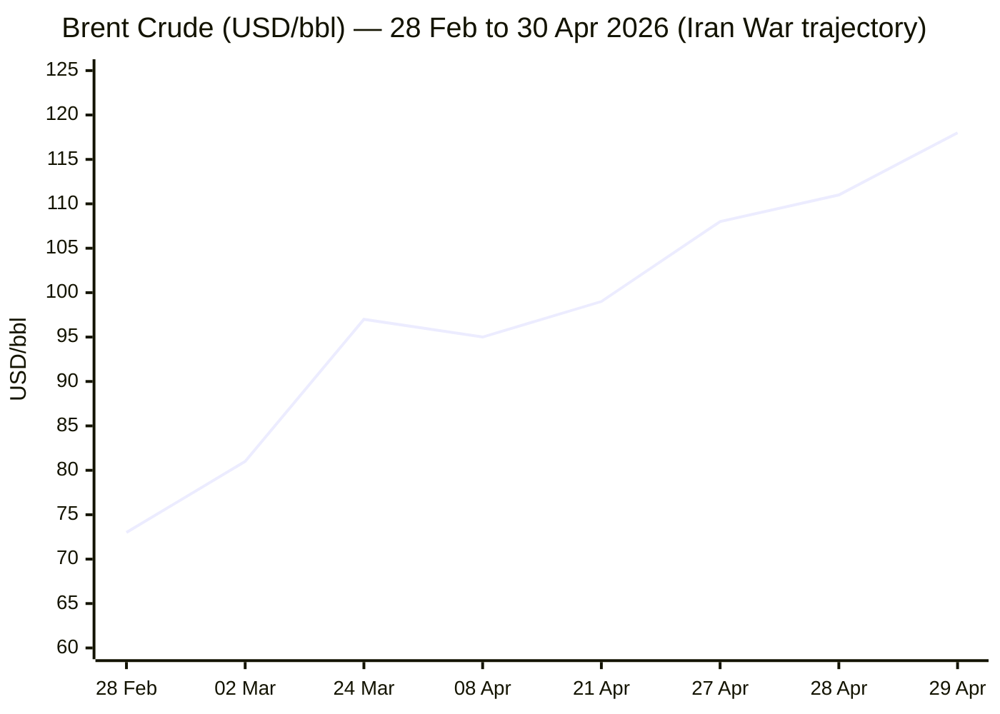
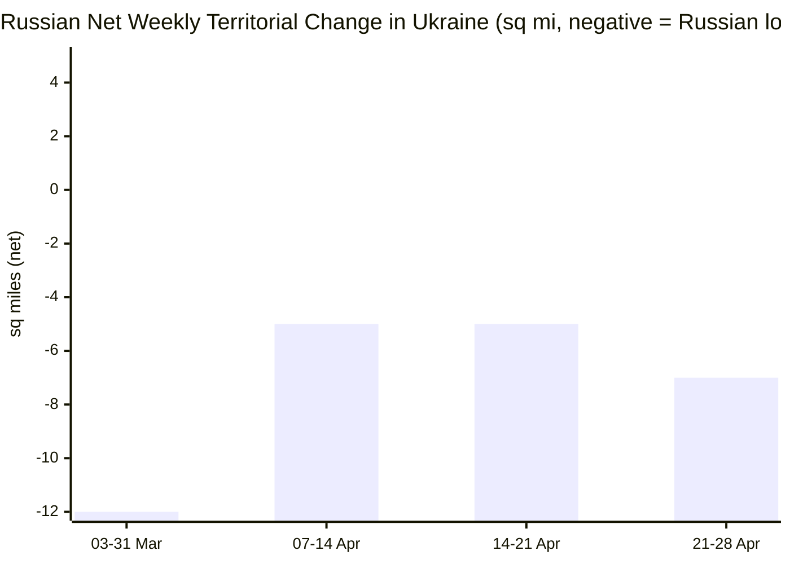

```yaml
---
brief_date: 2026-04-30
version: v1.2.1
run_time: "05:46 CET"
stories_published: 13
categories: [conflict, business, eu_affairs, technology, trends]
alert_counts:
  red: 3
  yellow: 8
  green: 2
ongoing_situations:
  - {name: "2026 Iran War", real_world_start: "2026-02-28", day: 62}
  - {name: "US Naval Blockade of Iranian Ports", real_world_start: "2026-04-13", day: 18}
  - {name: "Israel–Lebanon Ceasefire", real_world_start: "2026-04-16", day: 15}
  - {name: "Russia–Ukraine War", real_world_start: "2022-02-24", day: 1527}
sources_fetched: 11
fetch_status:
  le_monde: "❌"
  faz: "❌"
  kommersant: "❌"
  xinhua: "⚠️"
  european_parliament: "⚠️"
expansion_queue: []
---
```

---

# 🌐 MORNING BRIEF
## Thursday, 30 April 2026 · 05:46 CET
### 13 stories across 5 categories

---

## DIGEST SUMMARY

| # | Category | Headline | Alert |
|---|----------|----------|-------|
| 1 | ⚔️ Conflict | Iran War Day 62: Diplomacy in Stalemate as May 1 Threshold Looms | 🔴 |
| 2 | ⚔️ Conflict | Ukraine Day 1,527: Russia Loses Ground as Drone Barrage Intensifies | 🟡 |
| 3 | ⚔️ Conflict | Israel–Lebanon Ceasefire Day 15: Three-Week Extension Holds | 🟡 |
| 4 | 💼 Business | Brent Surges to $118/bbl as Trump Vows Prolonged Blockade; UAE Quits OPEC | 🔴 |
| 5 | 💼 Business | Fed Holds 3.5–3.75% in Divided Final Powell Meeting; Warsh Era Begins | 🟡 |
| 6 | 💼 Business | IMF Slashes 2026 Global Growth to 3.1% — "Economy in the Shadow of War" | 🟡 |
| 7 | 🇪🇺 EU Affairs | EP Adopts MFF 2028–2034 Negotiating Mandate Amid Energy Crisis Backdrop | 🟡 |
| 8 | 🇪🇺 EU Affairs | EP Debates EU Middle East Strategy; Ukraine Accountability Resolution Vote | 🟡 |
| 9 | 🇪🇺 EU Affairs | Cyprus Summit Outcomes: Art. 42.7 Consultation, One Europe Roadmap Signed | 🟢 |
| 10 | 🤖 Technology | Big Tech Layoff Wave: Meta 8,000 Jobs, Microsoft 8,750 Buyouts Amid $650bn AI Capex | 🔴 |
| 11 | 🤖 Technology | Intel Q1: Revenue Beats Estimates, Net Loss Widens | 🟢 |
| 12 | 📈 Trends | Pakistan's Islamabad Process: The World's New Diplomatic Clearinghouse | 🟡 |
| 13 | 📈 Trends | OPEC Fracturing: UAE Exit Signals Post-Cartel Energy Politics | 🟡 |

> Alert Level key: 🔴 High significance · 🟡 Developing · 🟢 Stable/Routine

---

## 🚨 SIGNAL BOARD

🔴 Brent crude settled at $118.03/bbl on 29 April — highest since June 2022 — as Trump confirmed a prolonged Hormuz blockade and Iran rejected the US nuclear framework.
🔴 The UAE quit OPEC after 57 years on 28 April, a structural blow to cartel cohesion potentially freeing an additional 1.6 mbd of Emirati capacity post-Hormuz.
🟡 The Fed held rates at 3.5–3.75% in an 8-4 vote — the most divided decision since October 1992 — with markets now pricing zero cuts for all of 2026.
🟡 Russia lost a net 7 square miles of Ukrainian territory in the week of 21–28 April, and 26 square miles over the four-week March–April period.
⚡ Pakistan's mediators expect a revised Iranian peace proposal within days; the May 1 War Powers Resolution deadline simultaneously converges on Washington.

---

## 🔄 ONGOING SITUATIONS

| Situation | Real-world start | Day # | Last significant development | Status |
|-----------|-----------------|-------|------------------------------|--------|
| 2026 Iran War | 28 Feb 2026 | Day 62 | Iran rejected US nuclear framework; Trump vowed extended blockade; May 1 War Powers threshold imminent | 🔴 Active |
| US Naval Blockade of Iranian Ports | 13 Apr 2026 | Day 18 | Trump confirmed blockade to continue "until nuclear deal"; Brent $118/bbl | 🔴 Active |
| Israel–Lebanon Ceasefire | 16 Apr 2026 | Day 15 | Trump extended ceasefire by 3 weeks; 2nd ambassador-level talks held | 🟡 Fragile |
| Russia–Ukraine War | 24 Feb 2022 | Day 1,527 | Russia net –7 sq mi this week; 189 engagements, 8,409 Shahed drones (29 Apr) | 🔴 Active |

---

## ⚔️ CONFLICT

> 🔎 **CONFLICT ANALYST** · 3 updates today

---

### 1. Iran War Day 62 — Diplomacy in Stalemate as May 1 Threshold Looms 🔴

**Alert:** 🔴
**Summary:** The US-Israel war on Iran enters its 62nd day with diplomatic channels under severe strain. Iran submitted a new proposal via Pakistani mediators to reopen the Strait of Hormuz while deferring nuclear negotiations — a formulation Washington has signalled it is unlikely to accept. Trump cancelled the Witkoff-Kushner trip to Islamabad on 25 April, citing Iranian "infighting." On 29 April he told Tehran to "get smart soon." US authorities sanctioned 35 entities in Iran's shadow banking network the same day. Iranian Foreign Minister Araghchi completed a diplomatic sprint: Islamabad twice, Muscat (with Gulf intelligence officials present), and St Petersburg, where Putin praised Iranian "courage." Pakistani mediators now expect a revised proposal within days. The May 1 War Powers Resolution deadline — which would require Congressional authorisation for continuing hostilities — is converging simultaneously.
**Significance:** The dual deadline of May 1 (War Powers) and the approaching Hajj season (late May, constraining Gulf diplomatic bandwidth) creates a narrow window for a deal. Iran's leadership divisions on nuclear concessions, documented publicly, reduce the prospect of a unified negotiating position. Each day of Hormuz disruption shifts the balance toward a prolonged supply shock that central banks cannot absorb through policy alone.
**Sources:**
- [Al Jazeera — Iran offers Hormuz deal without nuclear talks, as it seeks broader buy-in](https://www.aljazeera.com/news/2026/4/27/iran-offers-hormuz-deal-without-nuclear-talks-as-it-seeks-broader-buy-in) · 27 April 2026
- [Axios — Iran offers US deal to reopen Hormuz strait, postpone nuclear talks](https://www.axios.com/2026/04/27/iran-us-hormuz-strait-nuclear-talks-proposal-pakistan) · 27 April 2026
- [CNBC — Trump says Iran must 'get smart soon'; oil hits $115/bbl](https://www.cnbc.com/2026/04/29/oil-prices-brent-wti-trump-iran.html) · 29 April 2026
- [UPI — US sanctions Iran shadow-banking network as peace talks stall](https://www.upi.com/Top_News/US/2026/04/29/Federal-Reserve-to-announce-latest-interest-rate-decision/3721777474603/) · 29 April 2026
- [CNN — Live updates: Iran war peace proposal](https://www.cnn.com/2026/04/29/world/live-news/iran-war-peace-proposal-trump) · 30 April 2026

**Trend:** → Stable (stalemate deepening; no breakthrough imminent)
**Tags:** #Iran #peace-talks #Pakistan-mediation #nuclear #MULTI-SOURCE #escalation

📚 *Background reading:* [House of Commons Library — US-Iran ceasefire and nuclear talks in 2026](https://commonslibrary.parliament.uk/research-briefings/cbp-10637/) · [RAND — Iran War strategic implications](https://www.rand.org) · [Wikipedia — 2026 Iran War Ceasefire](https://en.wikipedia.org/wiki/2026_Iran_war_ceasefire)

---

### 2. Ukraine War Day 1,527 — Russia Loses Ground as Drone Barrage Intensifies 🟡

**Alert:** 🟡
**Summary:** Ukrainian forces repelled 189 combat engagements over 29 April, as Russia deployed 8,409 kamikaze drones and dropped 234 guided aerial bombs in a single day. ISW data for the week of 21–28 April shows Russia sustained a net loss of 7 square miles of Ukrainian territory — the second consecutive week of net Russian setbacks. Over the four-week period ending 28 April, Russian forces lost a net 26 square miles, a marked reversal from the prior period when Russia was advancing. Russia controls roughly 45,770 square miles (approximately 20% of Ukraine). Ukraine's energy infrastructure remains severely degraded, with only 3.5 GW of the 9+ GW of damaged capacity restored.
**Significance:** The sustained Ukrainian territorial recovery, however modest in absolute terms, reverses a months-long Russian spring offensive momentum and suggests improved Ukrainian positional defence. The drone-intensity of Russian attacks underscores continued pressure on civilian infrastructure ahead of another difficult winter, even as the EU's €90bn loan to Ukraine has been unblocked.
**Sources:**
- [Russia Matters — Russia-Ukraine War Report Card, 29 April 2026](https://www.russiamatters.org/news/russia-ukraine-war-report-card/russia-ukraine-war-report-card-april-29-2026) · 29 April 2026
- [EMPR Media — Russia-Ukraine war updates as of 29 April 2026](https://empr.media/news/war/russia-ukraine-war-updates-key-developments-as-of-april-29-2026/) · 29 April 2026

**Trend:** ↘ De-escalating (Russian territorial gains reversing)
**Tags:** #Ukraine #Russia #frontline #drone-warfare #MULTI-SOURCE #day-1527

---

### 3. Israel–Lebanon Ceasefire Day 15 — Three-Week Extension Holds 🟡

**Alert:** 🟡
**Summary:** The US-mediated Israel–Lebanon ceasefire, originally announced on 16 April, was extended by three weeks by President Trump on 24 April following the second round of ambassador-level talks. Iran and Pakistani mediators had previously insisted Lebanon must be included in any broader Iran deal; Washington and Tel Aviv maintain Lebanon is a separate track. The extension provides a fragile but operative pause in hostilities along the northern Israeli front, reducing multi-front military pressure on Israel while Iranian missile stocks remain significantly depleted from the current conflict.
**Significance:** The Lebanon ceasefire's durability hinges on the broader Iran diplomatic track. Should the Iran war resume, Hezbollah's incentives to reopen the Lebanon front would intensify. The ongoing depletion of Iranian ballistic missile capacity — reduced by more than 90% by Day 10 of the war — limits, but does not eliminate, Tehran's ability to resume high-intensity attacks.
**Sources:**
- [Xinhua — Trump says ceasefire between Israel, Lebanon to be extended by 3 weeks](https://english.news.cn/northamerica/20260424/609ad14dfc68425f9a8330a53adac022/c.html) · 24 April 2026
- [House of Commons Library — Israel/US-Iran conflict 2026: Background and UK response](https://commonslibrary.parliament.uk/research-briefings/cbp-10521/) · 30 April 2026

**Trend:** ↘ De-escalating (ceasefire holding; extension confirmed)
**Tags:** #Lebanon #Hezbollah #ceasefire #Israel #peace-talks

📚 *Background reading:* [IISS — Military Balance: Iranian missile programme](https://www.iiss.org) · [Al Jazeera — Iran war background](https://www.aljazeera.com)

---

## 💼 BUSINESS

> 💼 **BUSINESS ANALYST** · 3 updates today

---

### 4. Brent Surges to $118/bbl as Trump Vows Prolonged Blockade; UAE Quits OPEC 🔴

**Alert:** 🔴
**Summary:** Brent crude settled at $118.03/bbl on 29 April — up 6% in a single session and the highest close since June 2022 — after Trump confirmed the US naval blockade of Iranian ports would continue until Tehran agrees to a nuclear deal. The IEA has characterised the Strait of Hormuz disruption as the "largest supply disruption in the history of the global oil market," with Goldman Sachs estimating a 14.5 million barrel-per-day reduction in global production. Compounding the supply shock, the UAE announced its departure from OPEC on 28 April — its first exit after 57 years of membership — citing national interest and the need to expand production unconstrained by cartel quotas. The Emirati minister noted the timing was deliberate: with Hormuz closed, the immediate market impact of the exit is muted, but the structural implications for OPEC cohesion are severe.
**Market signal:** Strongly bearish for energy importers and inflation, and bullish for oil producers unconstrained by OPEC+ quotas; no near-term supply relief possible until the Strait reopens.
**Sources:**
- [CNBC — Brent oil tops $118 after Trump says he will blockade Iran until nuclear deal](https://www.cnbc.com/2026/04/29/oil-prices-brent-wti-trump-iran.html) · 29 April 2026
- [Al Jazeera — UAE quits OPEC: What that means for the Gulf, energy markets and beyond](https://www.aljazeera.com/news/2026/4/29/uae-quits-opec-what-that-means-for-the-gulf-energy-markets-and-beyond) · 29 April 2026
- [CNN — What UAE's OPEC departure means for gas prices](https://www.cnn.com/2026/04/29/business/gas-prices-uae-opec-intl) · 29 April 2026
- [CNBC — Shocking UAE exit rocks OPEC](https://www.cnbc.com/2026/04/29/shocking-uae-exit-rocks-opec-but-group-will-still-hold-significant-sway-over-the-oil-market.html) · 29 April 2026

**Trend:** ↗ Escalating
**Tags:** #Brent #oil-price #Hormuz #supply-shock #energy-markets #MULTI-SOURCE

📎 *See also: Conflict § Story 1 — Iran War diplomatic stalemate; Trends § Story 13 — OPEC fragmentation structural trend.*

---

### 5. Fed Holds 3.5–3.75% in Divided Final Powell Meeting; Warsh Confirmed Nominee 🟡

**Alert:** 🟡
**Summary:** The Federal Open Market Committee voted 8-4 on 29 April to hold the federal funds rate unchanged at 3.5–3.75%, in what is almost certain to be Jerome Powell's final meeting as Chair before his term expires 15 May. The four dissents — the most since October 1992 — were split: one (Governor Stephen Miran) favoured a rate cut, while Hammack, Kashkari, and Logan opposed retaining an easing bias in the statement. Powell confirmed he will remain on the Board of Governors pending resolution of a DOJ investigation into Fed building renovations. The FOMC statement noted "inflation is elevated, in part reflecting the recent increase in global energy prices." Kevin Warsh, Trump's nominee for Chair, advanced out of the Senate Banking Committee the same morning. Markets are pricing zero rate movements for all of 2026 and a single 25bp cut in December 2027.
**Market signal:** Neutral to mildly hawkish — the dissent pattern signals the incoming Warsh-led FOMC may face early pressure to remove the easing bias entirely, constraining future rate-cut optionality.
**Sources:**
- [CNBC — Fed interest rate decision April 2026: Fed holds rates steady amid dissent](https://www.cnbc.com/2026/04/29/fed-interest-rate-decision-april-2026.html) · 29 April 2026
- [Federal Reserve — Implementation Note, 29 April 2026](https://www.federalreserve.gov/newsevents/pressreleases/monetary20260429a1.htm) · 29 April 2026
- [CNN — Key takeaways from Powell's last meeting as Fed Chair](https://www.cnn.com/2026/04/29/economy/fed-decision-powell-warsh) · 29 April 2026

**Trend:** → Stable (rates on hold; leadership transition imminent)
**Tags:** #Fed #interest-rates #inflation #institutional #MULTI-SOURCE

---

### 6. IMF Slashes 2026 Global Growth to 3.1% — "Economy in the Shadow of War" 🟡

**Alert:** 🟡
**Summary:** The IMF's April 2026 World Economic Outlook, published 14 April, revised global growth down to 3.1% for 2026 (from 3.4% in the January update), with headline inflation forecast rising to 4.4%. The report's "reference forecast" assumes a short-lived conflict and a 19% energy price increase; an adverse scenario (longer Hormuz closure) sees growth fall to 2.5% and inflation reach 5.4%. A severe scenario would push growth to 2.0% with inflation exceeding 6%. Emerging market and developing economies face the sharpest slowdown. The IMF noted that every day of continued disruption increases the probability that the adverse scenario materialises.
**Market signal:** Bearish for global equities and risk assets; constructive for safe-haven instruments and commodity exporters insulated from Hormuz disruption.
**Sources:**
- [IMF — World Economic Outlook April 2026: Global Economy in the Shadow of War](https://www.imf.org/en/publications/weo/issues/2026/04/14/world-economic-outlook-april-2026) · 14 April 2026
- [IMF Blog — War Darkens Global Economic Outlook](https://www.imf.org/en/blogs/articles/2026/04/14/war-darkens-global-economic-outlook-and-reshapes-policy-priorities) · 14 April 2026

**Trend:** ↘ De-escalating (growth expectations revised downward)
**Tags:** #IMF #GDP-forecast #inflation #stagflation #institutional

📚 *Background reading:* [Bruegel — Energy shock and European economic resilience](https://www.bruegel.org) · [CFR — Global economic fallout from Middle East wars](https://www.cfr.org/)*

---

## 🇪🇺 EU AFFAIRS

> 🇪🇺 **EU AFFAIRS ANALYST** · 3 updates today

---

### 7. EP Votes MFF 2028–2034 Negotiating Mandate Amid Energy Crisis Backdrop 🟡

**Alert:** 🟡
**Summary:** The European Parliament voted this week (27–30 April plenary) to adopt its negotiating mandate for the EU's next seven-year budget, covering 2028–2034. The adopted position defends a ceiling set at 1.27% of EU GNI, representing a 10% increase over the Commission's July 2025 proposal, with a headline figure of approximately €2 trillion. MEPs secured inclusion of a strong competitiveness fund — a centrist demand — along with robust rule-of-law conditionality across the entire budget and new own-resource revenue streams as a red line. The MFF will be formally negotiated at and after the June 2026 European Council (18–19 June), where the Cypriot Presidency will table a "negotiation box" with figures.
**Legislative/policy stage:** Parliament's negotiating mandate adopted (April 2026 plenary). Council negotiation box to be tabled by Cypriot Presidency for June 2026 European Council. Interinstitutional negotiations to commence thereafter.
**Sources:**
- [European Parliament — Newsletter, 27–30 April 2026 Strasbourg plenary](https://www.europarl.europa.eu/news/en/agenda/plenary-news/2026-04-27) · 27 April 2026
- [Renew Europe — Plenary Priorities 27–30 April 2026](https://www.reneweuropegroup.eu/news/2026-04-27/plenary-priorities-27-30-april-2026) · 27 April 2026
- [EU Council — Informal meeting of heads of state or government, Cyprus](https://www.consilium.europa.eu/en/meetings/european-council/2026/04/23-24/) · 24 April 2026

**Trend:** → Stable (mandate adopted; negotiations entering interinstitutional phase)
**Tags:** #MFF #EU-institutions #EU-funds #eurozone

---

### 8. EP Debates EU Middle East Strategy; Ukraine Accountability Resolution Vote 🟡

**Alert:** 🟡
**Summary:** The April Strasbourg plenary session (27–30 April) featured a full debate on the EU's strategic response to the Middle East crisis and its implications for energy prices and fertiliser availability, with Council and Commission statements. MEPs are voting Thursday on a resolution demanding accountability and justice for Russian attacks on Ukrainian civilians. The session also covers a Digital Markets Act enforcement resolution (calling for faster compliance proceedings and scrutiny of AI-driven search tools) and the first-ever EU standards on cat and dog welfare. The EP's Foreign Affairs Committee separately discussed the Iran situation with Nobel Peace Prize laureate Shirin Ebadi and Iranian democratic parties on 15 April.
**Legislative/policy stage:** Plenary debate concluded (29 April); Ukraine accountability resolution vote today (30 April); EU Middle East strategy resolution non-binding. DMA enforcement review ongoing (legislative stage: Commission review phase, no formal proposal yet).
**Sources:**
- [European Parliament — Newsletter 27–30 April 2026](https://www.europarl.europa.eu/news/en/agenda/plenary-news/2026-04-27) · 27 April 2026
- [EP Thinktank — European Parliament Plenary Session April 2026](https://epthinktank.eu/2026/04/24/european-parliament-plenary-session-april-2026/) · 24 April 2026
- [European Parliament — Press kit for Cyprus informal summit](https://www.europarl.europa.eu/news/en/press-room/20260423IPR41854/) · 23 April 2026

**Trend:** ↗ Escalating (EP asserting strategic posture on two active wars simultaneously)
**Tags:** #EU-institutions #Ukraine-aid #digital-regulation #Iran #humanitarian

---

### 9. Cyprus Summit Outcomes: Art. 42.7 Consultation, One Europe Roadmap Signed 🟢

**Alert:** 🟢
**Summary:** The informal EU summit in Nicosia and Ayia Napa (23–24 April) produced three headline outcomes: an opening process on Article 42.7 mutual defence (the EU treaties' equivalent of NATO's Article 5, invoked only once previously, after the 2015 Paris attacks); the signing of the "One Europe, One Market" roadmap between the Presidents of the European Council, Commission, and Parliament; and a working lunch with leaders of Egypt, Jordan, Lebanon, Syria, and the Gulf Cooperation Council to advance EU-MENA diplomatic and security ties. Commission President von der Leyen disclosed the Iran war has added €25bn to the EU's energy import bill in 54 days. Council President Costa warned EU leaders the bloc faces "collapse" if it dances to Washington's tune. The summit was the first without Viktor Orbán, defeated in Hungary's earlier April elections.
**Legislative/policy stage:** Article 42.7 framework discussion opened; no binding conclusions. One Europe, One Market roadmap: political commitment with legislative timelines to end of 2027. MFF to be formally addressed at June 2026 European Council.
**Sources:**
- [EU Council — Informal meeting, Cyprus, 23–24 April 2026](https://www.consilium.europa.eu/en/meetings/european-council/2026/04/23-24/) · 24 April 2026
- [Euronews — EU leaders meet in Cyprus to talk Ukraine, Hormuz, energy and mutual defence](https://www.euronews.com/my-europe/2026/04/23/eu-leaders-meet-in-cyprus-to-talk-ukraine-hormuz-energy-and-mutual-defence) · 23 April 2026
- [The Defense Post — Shaken by Iran War, EU Seeks Larger Voice on Mideast](https://thedefensepost.com/2026/04/25/europe-iran-war-response/) · 25 April 2026

**Trend:** ↗ Escalating (EU strategic autonomy debate gaining institutional momentum)
**Tags:** #EU-institutions #EU-defence #single-market #diplomacy #Hungary

📚 *Background reading:* [ECFR — EU mutual defence and strategic autonomy](https://ecfr.eu/) · [Bruegel — EU energy shock response](https://www.bruegel.org/)*

---

## 🤖 TECHNOLOGY

> 🤖 **TECHNOLOGY ANALYST** · 2 updates today

---

### 10. Big Tech Layoff Wave: Meta 8,000 Jobs, Microsoft 8,750 Buyouts Amid $650bn AI Capex 🔴

**Alert:** 🔴
**Summary:** Meta announced it would cut approximately 10% of its global workforce — roughly 8,000 positions — with redundancies beginning 20 May. The cuts were framed as efficiency measures to "offset other investments," a reference to the company's $115bn AI capex commitment for 2026. Microsoft simultaneously launched voluntary retirement buyouts for approximately 7% of its US workforce (around 8,750 workers), the company's first such scheme in its 51-year history. Amazon and Oracle have also undergone layoffs this year. The combined Big Tech platforms — Amazon, Google, Meta, Microsoft — are projected to spend approximately $650bn on capital expenditure in 2026, the overwhelming majority directed at AI infrastructure. The scale of human-capital displacement relative to AI investment is being described by analysts as a structural inflection point in tech-sector labour economics.
**Analyst note:** Within 18 months, expect AI-infrastructure investment to translate into a wave of model-capability launches and enterprise-AI deployment, creating a second-order labour market shock in mid-skill knowledge work sectors across Europe and North America — a dynamic that neither the EU's AI Act nor any G7 labour framework currently addresses at adequate scale.
**Sources:**
- [Xinhua — Meta to cut about 10% of workforce as Microsoft launches voluntary retirement programme](http://english.news.cn/northamerica/20260424/4ea03b19058a466389aab3cfddd5baa0/c.html) · 24 April 2026
- [CNBC — 20,000 job cuts at Meta, Microsoft raise concern that AI-driven labour crisis is here](https://www.cnbc.com/2026/04/24/20k-job-cuts-at-meta-microsoft-raise-concern-of-ai-labor-crisis-.html) · 24 April 2026
- [Yahoo Finance — Meta and Microsoft shrink workforce amid AI spending](https://finance.yahoo.com/sectors/technology/articles/meta-microsoft-shrink-workforce-amid-222119494.html) · 23 April 2026

**Trend:** ↗ Escalating
**Tags:** #AI #tech-layoffs #LLM #data-centre #MULTI-SOURCE

---

### 11. Intel Q1 2026: Revenue Beats Estimates, Net Loss Widens 🟢

**Alert:** 🟢
**Summary:** Intel reported higher Q1 2026 revenue relative to market expectations but posted a wider net loss, reflecting ongoing pressure from elevated capital expenditure requirements and continued market share challenges in the AI accelerator segment dominated by Nvidia. The results illustrate the bifurcation of the semiconductor market: AI-optimised chip demand is driving exceptional returns for GPU manufacturers, while legacy CPU and general-purpose chip producers face structurally compressed margins. Intel's foundry ambitions remain in an investment-intensive phase.
**Analyst note:** Intel's widening losses in the AI-infrastructure cycle suggest that without a credible AI-chip product offering by mid-2027, the company faces a multi-year revenue trajectory that undermines its foundry-expansion financing model — with implications for Western semiconductor supply-chain resilience goals.
**Sources:**
- [Xinhua — Intel posts higher Q1 revenue, wider net loss](http://english.news.cn/northamerica/20260424/d753b1becb79410ca9757420cbe701a7/c.html) · 24 April 2026

**Trend:** → Stable
**Tags:** #semiconductor #earnings #AI #data-point

📚 *Background reading:* [CSIS — Semiconductor supply chain and great-power competition](https://www.csis.org)*

---

## 📈 TRENDS

> 📈 **TRENDS ANALYST** · 2 updates today

---

### 12. Pakistan's Islamabad Process — The World's New Diplomatic Clearinghouse 🟡

**Alert:** 🟡
**Summary:** Pakistan's role as mediator in the US-Iran war has rapidly evolved from a convenience into a structurally institutionalised diplomatic track. Pakistani officials are now referring to the engagement as the "Islamabad Process," a deliberate framing suggesting a durable multilateral mechanism. Iranian FM Araghchi's 72-hour diplomatic sprint — Islamabad, Muscat (with Gulf intelligence officials present), and St Petersburg — was routed through or co-ordinated with Pakistani interlocutors at each stage. Islamabad hosted 21 hours of direct and indirect US-Iran talks (11–12 April) and remains in daily contact with both Washington and Tehran. Pakistan is now simultaneously co-ordinating Egypt, Qatar, Turkey, and Oman as secondary mediators, a structural expansion of the process beyond a bilateral channel.
**Horizon:** Medium-term signal: Pakistan is positioning itself as the indispensable diplomatic intermediary for the Middle East's most consequential crisis, a role that will reshape its strategic relationships with the US, China, and the Gulf for years beyond this war's conclusion.
**Sources:**
- [Al Jazeera — Iran offers Hormuz deal without nuclear talks](https://www.aljazeera.com/news/2026/4/27/iran-offers-hormuz-deal-without-nuclear-talks-as-it-seeks-broader-buy-in) · 27 April 2026
- [Wikipedia — Islamabad Talks](https://en.wikipedia.org/wiki/Islamabad_Talks) · 30 April 2026

**Trend:** ↗ Escalating
**Tags:** #Pakistan-mediation #diplomacy #mediation #peace-talks #Iran

📎 *See also: Conflict § Story 1 — Iran War diplomatic stalemate.*

📚 *Background reading:* [Atlantic Council — Pakistan's strategic pivot](https://www.atlanticcouncil.org) · [CFR — Mediation architecture in Middle East conflicts](https://www.cfr.org/)*

---

### 13. OPEC Fracturing — UAE Exit Opens Race to Produce in Post-Cartel Energy Politics 🟡

**Alert:** 🟡
**Summary:** The UAE's departure from OPEC on 28 April — its first exit after 57 years of membership — is accelerating a structural realignment of global energy governance. The UAE had been capped at 3.2 mbd under OPEC+ quotas despite a capacity of 4.8 mbd; departure allows it to pursue 5 mbd targets. Analysts at Kpler flag Kazakhstan and Nigeria as the next "flight risks," citing persistent overproduction and domestic refinery incentives respectively. The UAE's energy minister was explicit that timing was deliberately chosen while Hormuz is closed, minimising immediate market shock while signalling long-term intent. The IEA has described the current disruption as the "greatest global energy security challenge in history." Emerging market nations face acute food and energy cascades: the Philippines declared a national energy emergency on 24 March; Sri Lanka has moved to a four-day working week; India has raised fuel export duties.
**Horizon:** Long-term structural shift: the combination of OPEC fragmentation and geopolitical energy weaponisation (Hormuz closure, Russia sanctions, Houthi/Red Sea disruptions) points toward an extended period of higher structural oil price volatility and accelerated diversification pressure on energy-importing nations, particularly in South and South-East Asia.
**Sources:**
- [CNBC — UAE's departure from OPEC not without precedent](https://www.cnbc.com/2026/04/29/uae-opec-exit-oil-iran-war.html) · 29 April 2026
- [CNN — UAE to quit OPEC and OPEC+ — Day 60 of Middle East conflict](https://www.cnn.com/2026/04/28/world/live-news/iran-war-trump-israel) · 28 April 2026
- [Wikipedia — 2026 Iran war fuel crisis](https://en.wikipedia.org/wiki/2026_Iran_war_fuel_crisis) · 30 April 2026

**Trend:** ⚡ Reversal (OPEC structural cohesion reversing after decades of stability)
**Tags:** #oil-price #energy-markets #commodities #food-security #Hormuz #MULTI-SOURCE

📚 *Background reading:* [Atlantic Council — OPEC+ cohesion under geopolitical stress](https://www.atlanticcouncil.org) · [RAND — Energy security and conflict economics](https://www.rand.org)*

---

## 📊 KEY DATA OF THE DAY

> 📊 **DATA OFFICER** · 7 indicators

| Indicator | Value | Δ vs prior session | Δ vs 7 days ago | Note | Source | URL |
|-----------|-------|-------------------|-----------------|------|--------|-----|
| EUR/USD | 1.1674 | –0.19% | –0.27% | Near 2-week low; ECB holds expected today; USD buoyed by hawkish Fed dissents | Trading Economics / MidForex | [link](https://tradingeconomics.com/euro-area/currency) |
| Brent Crude (USD/bbl) | $118.03 | +6.3% | ~+19% | Highest since Jun 2022; Trump confirms extended blockade; UAE OPEC exit Day 2 | EIA / CNBC | [link](https://www.cnbc.com/2026/04/29/oil-prices-brent-wti-trump-iran.html) |
| Gold (XAU/USD) | $4,554 | –1.2% | N/A | One-month low; rate hike fears weigh on non-yielder; Goldman holds $5,400 EY26 target | Investing.com / LBMA | [link](https://www.investing.com/commodities/gold) |
| IMF Global Growth 2026 | 3.1% | vs Jan WEO: –0.3pp | vs Oct WEO 2025: –0.3pp | Reference scenario (limited conflict); adverse case 2.5%; severe 2.0% | IMF WEO Apr 2026 | [link](https://www.imf.org/en/publications/weo/issues/2026/04/14/world-economic-outlook-april-2026) |
| EU CPI YoY (Mar 2026) | 2.6% | vs Feb 2026: +0.7pp | vs Dec 2025: +0.6pp | Energy-driven reacceleration; April 2026 flash estimate scheduled for release today | Eurostat | [link](https://ec.europa.eu/eurostat/web/products-euro-indicators/w/2-16042026-ap) |
| FAO Food Price Index | 128.5 | vs Feb 2026: +2.4% | March 2026 (latest available) | Second consecutive monthly rise; vegetable oils +5.1%; war-driven energy cost spillover | FAO | [link](https://www.fao.org/worldfoodsituation/foodpricesindex/en/) |
| Strait of Hormuz Transit Volume | ~10–15% of normal | ↑ Slight improvement | Sharply below Day 1 baseline | Industry sources (29 Apr): "getting better but far from normal"; Goldman estimates –14.5 mbd global production loss | CNBC / JMIC est. | [link](https://www.cnbc.com/2026/04/29/shocking-uae-exit-rocks-opec-but-group-will-still-hold-significant-sway-over-the-oil-market.html) |

**Data commentary:** The data composite for 30 April 2026 reflects an energy shock of historic magnitude meeting a monetary policy establishment with severely constrained room to manoeuvre. Brent at $118/bbl — a 62% rise since the war's first day — is embedding structural inflation that the EU's March CPI (2.6%, energy-driven) has only begun to register; the April flash estimate due today is expected to breach 2.9%. Gold's retreat from its recent safe-haven highs, despite escalating hostilities, signals that rate-hike expectations are now outweighing flight-to-safety impulses — a pattern consistent with stagflationary market psychology. The Hormuz transit-volume indicator, though imprecisely measured, is the single most consequential variable: every additional week of near-closure converts the IMF's reference scenario into the adverse one.

---

## 📊 CHARTS

### Chart 1 — Brent Crude Price Trajectory: From War's Eve to Day 62



---

### Chart 2 — ISW Ukrainian Territorial Delta: Russian Net Weekly Gain/Loss (sq mi)



*Note: Negative values indicate net Russian territorial losses. Data: ISW via Russia Matters, April 2026.*

---

## ⚙️ AGENT METADATA

| Field | Value |
|-------|-------|
| Agent version | MORNING BRIEF v1.2.1 |
| Run timestamp | 2026-04-30T05:46:56+02:00 |
| Fetch status | Le Monde ❌ · FAZ ❌ · Kommersant ❌ · Xinhua ⚠️ (stories dated 24 Apr, outside 24h window) · EP ⚠️ (navigation only, no article content extracted) |
| Sources queried | 11 / 11 (Tier 1: Guardian ✓, Le Monde ❌, El País ✓, FAZ ❌, Kommersant ❌, Xinhua ⚠️ · Tier 2: IMF ✓, ECB ✓, European Commission ✓, European Parliament ⚠️, FAO ✓) |
| Stories surfaced | ~24 (before editorial filter) |
| Stories published | 13 (after editorial filter) |
| Languages processed | EN, DE (FAZ blocked; partial via search), FR (Le Monde blocked) |
| Output language | English (British) |
| Date validated | ✅ Confirmed 30 April 2026 |
| Expansion Queue | None — all tags drawn from closed list |

---

*MORNING BRIEF is an AI-assisted digest. All summaries are paraphrased from original sources. Verify time-sensitive information at the linked URLs before acting. Output language: British English.*
