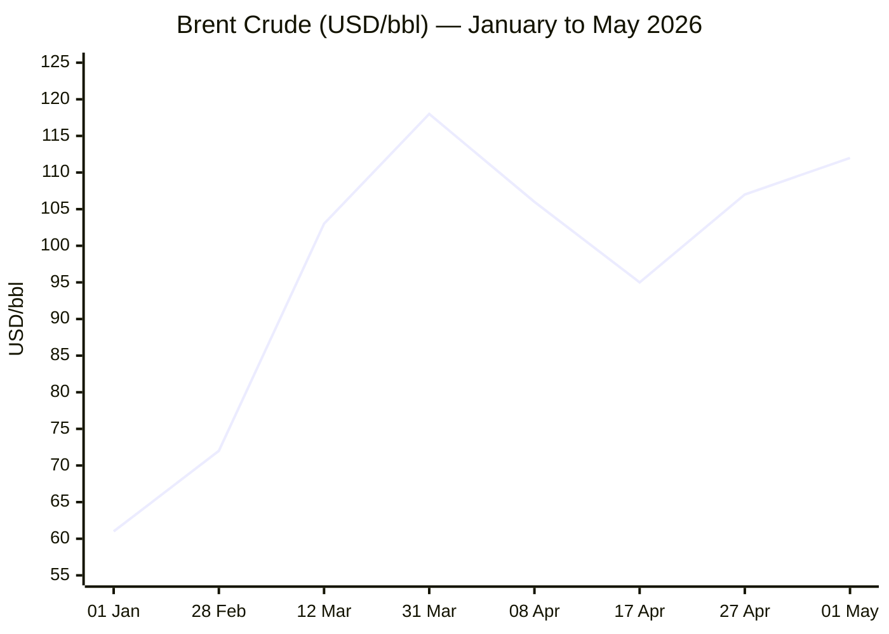
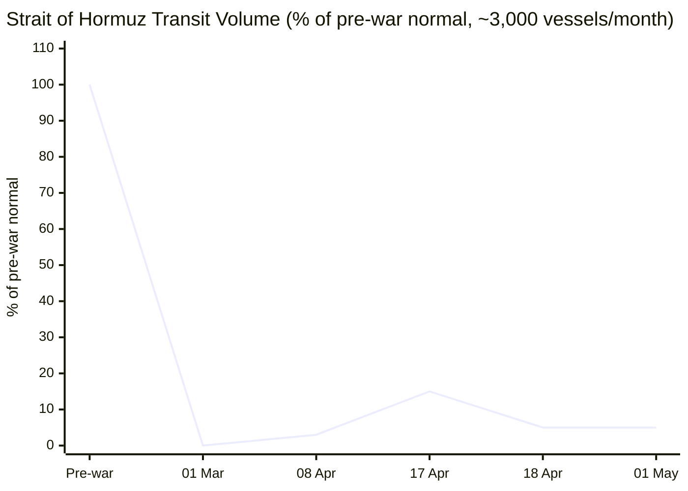

```yaml
---
brief_date: 2026-05-01
version: v1.2.1
run_time: "06:15 CET"
stories_published: 13
categories: [conflict, business, eu_affairs, technology, trends]
alert_counts:
  red: 4
  yellow: 8
  green: 1
ongoing_situations:
  - {name: "Russia–Ukraine War", real_world_start: "2022-02-24", day: 1528}
  - {name: "2026 Iran War / Hormuz Crisis", real_world_start: "2026-02-28", day: 63}
  - {name: "Lebanon War – Hezbollah Phase (resumed)", real_world_start: "2026-03-02", day: 61}
  - {name: "Gaza War", real_world_start: "2023-10-07", day: 938}
sources_fetched: 9
fetch_status:
  le_monde: "❌"
  faz: "❌"
  kommersant: "❌"
  xinhua: "⚠️"
  european_parliament: "⚠️"
expansion_queue: []
---
```

---

# 🌐 MORNING BRIEF
## Friday, 01 May 2026 · 06:15 CET
### 13 stories across 5 categories

---

## DIGEST SUMMARY

| # | Category | Headline | Alert |
|---|----------|----------|-------|
| 1 | ⚔️ Conflict | Iran War Day 63: War Powers deadline hits; Hormuz still at 5% | 🔴 |
| 2 | ⚔️ Conflict | Ukraine Day 1,528: 177 engagements, Russia enters Sumy Oblast | 🔴 |
| 3 | ⚔️ Conflict | Lebanon ceasefire extension fraying; Hezbollah drones persist | 🟡 |
| 4 | 💼 Business | Brent nears $115 as CENTCOM briefs Trump on expanded Iran options | 🔴 |
| 5 | 💼 Business | ECB holds at 2%; June hike signals mount as euro CPI hits 3.0% | 🟡 |
| 6 | 💼 Business | Fed holds 3.50–3.75% in most divided vote since 1992 | 🟡 |
| 7 | 🇪🇺 EU Affairs | Cyprus Summit: Article 42.7 operationalisation + MFF 2028–34 launched | 🟡 |
| 8 | 🇪🇺 EU Affairs | EU April CPI flash at 3.0%; energy +10.9% reignites stagflation alarm | 🟡 |
| 9 | 🇪🇺 EU Affairs | "One Europe, One Market" roadmap signed in Nicosia | 🟢 |
| 10 | 🤖 Technology | Meta cuts 8,000 jobs (10%); Microsoft buyouts: AI capex vs headcount | 🟡 |
| 11 | 🤖 Technology | Intel Q1 beats; Data Centre emerges as AI infrastructure anchor | 🟡 |
| 12 | 📈 Trends | War Powers Act D-Day: Trump faces legal showdown as 60-day limit expires | 🔴 |
| 13 | 📈 Trends | FAO Food Price Index at 128.5 in March; energy war spillover accelerates | 🟡 |

> Alert Level key: 🔴 High significance · 🟡 Developing · 🟢 Stable/Routine

---

## 🚨 SIGNAL BOARD

🔴 **Iran War Day 63: the War Powers Act 60-day clock expires today — Trump is expected to defy it, risking a constitutional showdown with Congress and courts.**
🔴 **Brent crude spiked to $114.66/bbl on April 30 after CENTCOM briefed Trump on expanded military strike options in Iran; open today at $111.84.**
🟡 **EU April CPI flash: 3.0% YoY — highest since September 2023 — driven by energy (+10.9%), forcing the ECB into a June hike decision under stagflationary conditions.**
🟡 **Big Tech AI-displacement wave: Meta and Microsoft together announced potential elimination of ~17,000 roles in a single week; 2026 sector total now exceeds 92,000.**
⚡ **Lebanon ceasefire extension (3 weeks from 23 April) is showing signs of collapse — IDF states there is "effectively no ceasefire" as Hezbollah drone attacks continue.**

---

## 🔄 ONGOING SITUATIONS

| Situation | Real-world start | Day # | Last significant development | Status |
|-----------|-----------------|-------|------------------------------|--------|
| Russia–Ukraine War | 24 Feb 2022 | Day 1,528 | 177 combat engagements; Russia entered Sumy Oblast (Komarivka) | 🔴 Active |
| 2026 Iran War / Hormuz Crisis | 28 Feb 2026 | Day 63 | War Powers Act deadline; ceasefire extended; negotiations stalled | 🟡 Ceasefire / Blockade |
| Lebanon War – Hezbollah Phase | 02 Mar 2026 | Day 61 | 3-week ceasefire extension breaking down; IDF reports Hezbollah drones continue | 🔴 Active |
| Gaza War | 07 Oct 2023 | Day 938 | Humanitarian crisis; Israeli operations ongoing | 🔴 Active |

---

## ⚔️ CONFLICT SECTION

> 🔎 **CONFLICT ANALYST** · 3 updates today

---

### 1. Iran War / Strait of Hormuz — Day 63 🔴
**Alert:** 🔴
**Summary:** Today marks the 60th-day deadline under the 1973 War Powers Resolution since the White House notified Congress of Operation Epic Fury. The Trump administration maintains the ceasefire pauses the clock and has not sought congressional authorisation. Iran's proposal — reopening Hormuz in exchange for a US blockade lift, with nuclear negotiations deferred — was rejected as "not good enough" by Trump. The dual blockade persists: Iran restricts commercial shipping to ~5% of normal volumes; the US Navy blockades Iranian ports. CENTCOM briefed Trump on expanded military options on 29 April. Negotiations are formally stalled; no second round of Islamabad talks has been scheduled.
**Significance:** The War Powers deadline creates a dual pressure point: domestically, a constitutional showdown with bipartisan congressional dissidents; externally, renewed risk of resumption of hostilities. Brent crude's sensitivity to each diplomatic signal underscores how fragile the holding pattern is. A war resumption would likely trigger the IMF's "severe scenario" — global growth collapsing to 2%, inflation exceeding 6%.
**Sources:**
- [Al Jazeera — Trump's May 1 deadline: Can he continue war on Iran after that?](https://www.aljazeera.com/news/2026/4/24/trumps-may-1-deadline-can-he-continue-war-on-iran-after-that) · 24 April 2026
- [CNN — The law sets a 60-day limit on unauthorized wars](https://www.cnn.com/2026/04/25/politics/war-powers-act-trump-iran-war-congress-analysis) · 25 April 2026
- [Axios — Iran offers US deal to reopen Hormuz strait, postpone nuclear talks](https://www.axios.com/2026/04/27/iran-us-hormuz-strait-nuclear-talks-proposal-pakistan) · 27 April 2026
- [House of Commons Library — Israel/US-Iran conflict 2026: Reopening the Strait of Hormuz](https://commonslibrary.parliament.uk/research-briefings/cbp-10636/) · 01 May 2026
**Trend:** ↗ Escalating
**Tags:** #Iran #Hormuz #nuclear #ceasefire #peace-talks #MULTI-SOURCE

---

### 2. Russia–Ukraine War — Day 1,528 🔴
**Alert:** 🔴
**Summary:** The Ukrainian General Staff recorded 177 combat engagements over the past 24 hours. Russia launched two missile strikes, 69 airstrikes, dropped 226 guided aerial bombs, and deployed 9,683 kamikaze drones. Russian forces crossed the international border into Sumy Oblast, claiming capture of the village of Komarivka. Near Kupyansk, Ukraine recaptured Kurylivka and Kucherivka. Ukraine's General Staff reports 285.6 km² restored in the Oleksandrivka direction, with February 2026 being the first month since 2024 when Ukraine regained more territory than it lost. The Ryazan Oblast governor signed a decree imposing military recruitment quotas on private businesses.
**Significance:** Russia's entry into Sumy Oblast marks a territorial escalation that may open a new front, while the Ryazan corporate recruitment decree signals accelerating manpower pressure on the Russian economy — a medium-term structural indicator of Moscow's sustainability calculus.
**Sources:**
- [EMPR Media — Russia–Ukraine War Updates: Key Developments as of April 30, 2026](https://empr.media/news/war/russia-ukraine-war-updates-key-developments-as-of-april-30-2026/) · 30 April 2026
- [Wikipedia — Timeline of the Russo-Ukrainian war (1 January 2026 – present)](https://en.wikipedia.org/wiki/Timeline_of_the_Russo-Ukrainian_war_(1_January_2026_%E2%80%93_present)) · 01 May 2026
**Trend:** ↗ Escalating
**Tags:** #Ukraine #Russia #frontline #drone-warfare #missile-strike #MULTI-SOURCE

---

### 3. Israel–Lebanon — Ceasefire Under Strain 🟡
**Alert:** 🟡
**Summary:** The three-week extension of the Israel–Lebanon ceasefire (announced 23 April, agreed by Israeli and Lebanese ambassadors in Washington) is showing signs of breakdown. Israeli sources reported on 30 April that there is "effectively no ceasefire" in southern Lebanon, with Hezbollah drone attacks continuing and the IDF ramping up activity. Hezbollah formally opposes the Israeli-Lebanese diplomatic track and has not committed to the terms. Israel has stated it is "prepared both defensively and offensively" against Iran. The Lebanon track remains the primary obstacle to a broader US–Iran framework, as Iran has conditioned Hormuz reopening partly on an end to Israeli operations in Lebanon.
**Significance:** If the Lebanon ceasefire collapses before May 14, Iran is likely to re-close Hormuz, derailing US–Iran negotiations and pushing Brent back toward $115+.
**Sources:**
- [Wikipedia — 2026 Israel–Lebanon ceasefire](https://en.wikipedia.org/wiki/2026_Israel%E2%80%93Lebanon_ceasefire) · 28 April 2026
- [Euronews — Trump says Israel-Hezbollah ceasefire extended by three weeks](https://www.euronews.com/2026/04/24/trump-says-israel-hezbollah-ceasefire-extended-by-three-weeks) · 24 April 2026
**Trend:** ↘ De-escalating — though current data suggests ⚡ Reversal risk
**Tags:** #Lebanon #Hezbollah #ceasefire #Israel #de-escalation #MULTI-SOURCE

📚 *Background reading:* [Kyiv Independent — Ukraine Counteroffensive: Oleksandrivka Direction Analysis](https://kyivindependent.com) · [IISS — Iran War: Military Balance Assessment](https://www.iiss.org)

---

## 💼 BUSINESS SECTION

> 💼 **BUSINESS ANALYST** · 3 updates today

---

### 4. Brent Crude Nears $115 on CENTCOM Escalation Briefing 🔴
**Alert:** 🔴
**Summary:** Brent crude climbed to $114.66/bbl on 30 April morning after Axios reported CENTCOM briefed President Trump on a "short and intense wave of strikes" against Iran, describing a plan reportedly under review by Admiral Brad Cooper. Brent briefly exceeded $114 — its highest intraday level since June 2022 — before settling around $110.5. Futures opened this morning at $111.84. Since the war began, Brent has risen from $61 at year-start to a Q1 close of $118, the largest quarterly rise in inflation-adjusted terms since 1988 according to EIA. US crude exports have surged to record highs above 6 million barrels/day as buyers reroute supply.
**Market signal:** Bearish for consumers, bullish for US producers and energy exporters: the Brent-WTI spread has widened to $15/bbl, creating a structural US export premium.
**Sources:**
- [Trading Economics — Brent Crude Oil](https://tradingeconomics.com/commodity/brent-crude-oil) · 30 April 2026
- [EIA — Short-Term Energy Outlook](https://www.eia.gov/outlooks/steo/) · April 2026
- [Fortune — Current price of oil as of April 30, 2026](https://fortune.com/article/price-of-oil-04-30-2026/) · 30 April 2026
**Trend:** ↗ Escalating
**Tags:** #Brent #oil-price #Hormuz #energy-markets #Iran #supply-shock

📎 *See also: Conflict § Story 1 — Iran War Day 63; CENTCOM briefing the proximate trigger for 30 April price spike.*

---

### 5. ECB Holds at 2.00% as Stagflation Signal Intensifies 🟡
**Alert:** 🟡
**Summary:** The ECB's Governing Council held its deposit facility rate at 2.00% on 30 April (fifth consecutive hold), even as the April flash CPI print for the eurozone jumped to 3.0% YoY — the highest since September 2023. President Lagarde described the "stop-start nature" of the Iran war as making the economic outlook "harder to assess." Core inflation remained at 2.2%, suggesting secondary effects are not yet entrenched, but energy inflation surged to 10.9%. Eurozone Q1 GDP growth came in at just 0.1% QoQ, below the 0.2% expectation. Markets are now pricing a June 25bp hike with growing conviction.
**Market signal:** Neutral-to-bearish for European growth assets: the ECB is navigating between an energy-driven inflation shock and near-stagnant GDP, with a June hike likely to amplify the headwinds.
**Sources:**
- [Euronews — ECB holds rates at 2% as inflation rises and eurozone growth slows](https://www.euronews.com/business/2026/04/30/ecb-holds-rates-at-2-as-inflation-rises-and-eurozone-growth-slows) · 30 April 2026
- [CNBC — European Central Bank keeps rates on hold](https://www.cnbc.com/2026/04/30/european-central-bank-april-2026-rate-decision-inflation-stagflation-risk-iran-war.html) · 30 April 2026
- [ECB Data Portal — Inflation April 2026](https://data.ecb.europa.eu/key-figures/inflation-and-other-prices/inflation) · 30 April 2026
**Trend:** ↗ Escalating
**Tags:** #ECB #interest-rates #inflation #stagflation #eurozone #MULTI-SOURCE

📎 *See also: EU Affairs § Story 8 — EU April CPI flash detail.*

---

### 6. Fed Holds 3.50–3.75% in Most Divided Vote Since 1992 🟡
**Alert:** 🟡
**Summary:** The US Federal Reserve held rates steady at 3.50–3.75% following its 28–29 April FOMC meeting, but the internal vote was reportedly the most fractured since 1992. Markets had priced a hold, but disagreement between hawks (concerned about energy-driven inflation spillovers) and doves (cautious about growth) signals potential policy divergence ahead. The 10-year Treasury yield rose to 4.6–4.8%, while the dollar index strengthened as safe-haven demand persisted. Retail gasoline is forecast to peak near $4.30/gallon in April per EIA, and diesel above $5.80/gallon — generating domestic political pressure.
**Market signal:** Neutral for equities in the near term: the hold removes the immediate tightening risk, but the divided vote keeps June policy direction ambiguous, limiting risk appetite.
**Sources:**
- [EIA Short-Term Energy Outlook](https://www.eia.gov/outlooks/steo/) · April 2026
- [Sunday Guardian Live — US Stock Market Today, 30 April 2026](https://sundayguardianlive.com/business/us-stock-market-today-30-april-2026) · 30 April 2026
**Trend:** → Stable
**Tags:** #Fed #interest-rates #inflation #SP500 #Nasdaq

📚 *Background reading:* [Bruegel — Energy Shock and ECB Policy Options, 2026](https://www.bruegel.org)

---

## 🇪🇺 EU AFFAIRS SECTION

> 🇪🇺 **EU AFFAIRS ANALYST** · 3 updates today

---

### 7. Cyprus Summit: Article 42.7 Operationalised; MFF 2028–34 Launched 🟡
**Alert:** 🟡
**Summary:** EU leaders convened in Lefkosia and Agia Napa (23–24 April) for an informal summit focused on the Iran war's geopolitical fallout and the 2028–34 Multiannual Financial Framework. Leaders initiated a process to operationalise Article 42.7 — the EU's mutual assistance clause — following an Iranian drone strike on a British base in Cyprus in early March. GCC, Lebanon, Syria, Egypt, and Jordan joined a working lunch; leaders welcomed both ceasefires and urged all parties toward peace. Von der Leyen proposed expanding Operation Aspides into a joint maritime coordination mission. MFF talks were deferred to the June 18–19 European Council; the Commission's €2 trillion headline figure faces pushback from member states.
**Legislative/policy stage:** Informal conclusions only; no formal decisions. Article 42.7 operationalisation referred to working group. MFF negotiating box to be prepared by Cypriot presidency for June European Council.
**Sources:**
- [European Council — Informal meeting of heads of state or government, 23–24 April 2026](https://www.consilium.europa.eu/en/meetings/european-council/2026/04/23-24/) · 25 April 2026
- [Euronews — EU leaders meet in Cyprus to talk Ukraine, Hormuz, energy and mutual defence](https://www.euronews.com/my-europe/2026/04/23/eu-leaders-meet-in-cyprus-to-talk-ukraine-hormuz-energy-and-mutual-defence) · 23 April 2026
**Trend:** ↗ Escalating
**Tags:** #EU-institutions #EU-defence #MFF #energy-policy #Hormuz #MULTI-SOURCE

---

### 8. EU April CPI Flash at 3.0%: Energy Shock Reignites Inflation 🟡
**Alert:** 🟡
**Summary:** Eurostat's flash estimate published 30 April puts eurozone HICP inflation at 3.0% YoY in April 2026 — the highest since September 2023, beating expectations of 2.9%. The primary driver is energy (+10.9% YoY), directly attributable to the Hormuz closure and its effect on European gas and oil prices. Services inflation moderated to 3.0% from 3.2%, and core HICP edged down to 2.2%, indicating secondary inflation effects are not yet generalised. Monthly CPI jumped 1.0%, sustained by energy. Germany (2.9%), Italy (2.9%), France (2.5%), and Spain (3.5%) all saw acceleration.
**Legislative/policy stage:** Flash estimate; full country breakdown scheduled for 20 May 2026. ECB governing council response at June meeting (currently debating whether to raise to 2.25%).
**Sources:**
- [Eurostat — Euro area annual inflation up to 3.0%](https://ec.europa.eu/eurostat/web/products-euro-indicators/w/2-30042026-ap) · 30 April 2026
- [ECB Data Portal — Inflation April 2026](https://data.ecb.europa.eu/key-figures/inflation-and-other-prices/inflation) · 30 April 2026
**Trend:** ↗ Escalating
**Tags:** #inflation #ECB #eurozone #energy-markets #EU-institutions #data-point

📎 *See also: Business § Story 5 — ECB rate decision and June hike signals.*

---

### 9. "One Europe, One Market" Roadmap Signed in Nicosia 🟢
**Alert:** 🟢
**Summary:** On the sidelines of the Cyprus summit (24 April), the Presidents of the European Parliament, European Commission, and the Republic of Cyprus signed the "One Europe, One Market" roadmap. The document commits to legislative and policy initiatives across five areas targeting full single market completion by end-2027, with the highest political priority designation. The roadmap builds on guidance from the European Council and responds to longstanding concerns about internal market fragmentation, particularly in energy, digital, and capital markets.
**Legislative/policy stage:** Political commitment signed; legislative proposals to be tabled by Commission during 2026–27 under the roadmap's sequencing. First review by June European Council.
**Sources:**
- [European Council — European institutions agree roadmap to achieve 'One Europe, One Market' by end of 2027](https://www.consilium.europa.eu/en/meetings/european-council/2026/04/23-24/) · 24 April 2026
**Trend:** → Stable
**Tags:** #EU-institutions #single-market #EU-enlargement #institutional

📚 *Background reading:* [Bruegel — EU Single Market Completion: What Remains](https://www.bruegel.org) · [ECFR — European Sovereignty in the Shadow of War](https://ecfr.eu/)

---

## 🤖 TECHNOLOGY SECTION

> 🤖 **TECHNOLOGY ANALYST** · 2 updates today

---

### 10. Meta Cuts 10% of Workforce; Microsoft Offers Buyouts — AI Capex Displaces Labour 🟡
**Alert:** 🟡
**Summary:** Meta announced on 24 April that it will eliminate approximately 8,000 positions — 10% of its ~79,000 workforce — effective 20 May, while leaving 6,000 open roles unfilled. On the same day, Microsoft announced voluntary buyouts targeting ~7% of its US workforce (~8,750 roles), its first such programme in 51 years. Both companies framed the cuts as efficiency measures to offset AI capital expenditure: Meta's 2026 capex guidance is $115–135 billion; the combined Amazon/Google/Meta/Microsoft AI capex commitment for 2026 stands at approximately $650–700 billion. Year-to-date tech sector layoffs have now exceeded 92,000, across 95 companies, according to Layoffs.fyi.
**Analyst note:** Within 12–24 months, if the productivity gains from AI investment materialise as projected, the remaining workforces will operate at dramatically higher revenue-per-employee ratios — effectively validating the structural displacement thesis and accelerating further waves of cuts across the broader sector, including non-tech industries.
**Sources:**
- [CNBC — 20,000 job cuts at Meta, Microsoft raise concern that AI-driven labor crisis is here](https://www.cnbc.com/2026/04/24/20k-job-cuts-at-meta-microsoft-raise-concern-of-ai-labor-crisis-.html) · 24 April 2026
- [Fortune Tech — Meta layoffs, Intel earnings, SpaceX lawsuits](https://fortune.com/2026/04/24/meta-cuts-workers-ai-intel-earnings-grok-spacex-apple-ceo-age/) · 24 April 2026
**Trend:** ↗ Escalating
**Tags:** #AI #tech-layoffs #LLM #data-centre #MULTI-SOURCE

---

### 11. Intel Q1 2026 Beats on Data Centre; Stock Surges 22% 🟡
**Alert:** 🟡
**Summary:** Intel reported first-quarter 2026 results on 24 April that exceeded Wall Street expectations, driven by its Data Centre and AI Group. CEO Lip-Bu Tan emphasised a return to Intel's engineering culture, noting double-digit growth in the Data Centre segment for the full year. Shares surged more than 22% in after-hours trading. Intel acknowledged supply constraints remain, and cautioned that PC chip sales will slow in H2 2026 due to memory shortages — a byproduct of HBM allocation toward AI data centres. The results contrast with broader sector pessimism: Intel's repositioning as a CPU supplier to AI infrastructure gives it a differentiated role in the Nvidia-dominated accelerator market.
**Analyst note:** If Intel's Data Centre growth trajectory holds, it could capture a meaningful share of the non-GPU AI inference market within 18–24 months, presenting a credible second-tier alternative for hyperscalers seeking supply diversification.
**Sources:**
- [Fortune Tech — Meta layoffs, Intel earnings, SpaceX lawsuits](https://fortune.com/2026/04/24/meta-cuts-workers-ai-intel-earnings-grok-spacex-apple-ceo-age/) · 24 April 2026
- [Yahoo Finance — Tech stocks today: Intel stock soars 25%](https://finance.yahoo.com/sectors/technology/live/tech-stocks-today-intel-stock-soars-25-meta-to-cut-10-of-workforce-microsoft-offerings-buyouts-144220036.html) · 01 May 2026
**Trend:** ↗ Escalating
**Tags:** #semiconductor #AI #data-centre #earnings #autonomous-systems

📚 *Background reading:* [CSIS — Semiconductor Supply Chain and the AI Race, 2026](https://www.csis.org) · [RAND — AI and Labour Market Disruption: Policy Scenarios](https://www.rand.org)

---

## 📈 TRENDS SECTION

> 📈 **TRENDS ANALYST** · 2 updates today

---

### 12. War Powers Act D-Day: Trump Faces Constitutional Showdown as 60-Day Clock Expires 🔴
**Alert:** 🔴
**Summary:** The 60-day deadline under the 1973 War Powers Resolution expires today. Congress has failed four times to pass resolutions constraining the Iran war, with Republican leaders providing cover. The Trump administration argues that the ceasefire pauses the clock — a position rejected by Democrats and several Republicans. Senate Democrats are exploring legal action. At least two Republican senators (Collins, Tillis) have stated they will not authorise continued operations post-deadline. The war is polling deeply unpopular (7 in 10 Americans want it ended "as quickly as possible"), six months before midterm elections in which the House is considered competitive.
**Horizon:** Short- to Medium-term. The next 72 hours are likely to define whether Trump ignores the deadline (triggering court challenges and Republican defections), seeks a reframing (AUMF invocation), or uses the deadline as diplomatic leverage with Iran.
**Sources:**
- [Military.com — Iran War Heads Toward Legal Showdown as May 1 Deadline Nears](https://www.military.com/daily-news/headlines/2026/04/28/Iran-War-Heads-Toward-Legal-Showdown-as-May-1-Deadline-Nears) · 28 April 2026
- [The Conversation — Under US law, Trump faces an impending deadline to end the Iran war](https://theconversation.com/under-us-law-trump-faces-an-impending-deadline-to-end-the-iran-war-what-happens-if-he-ignores-it-281728) · 29 April 2026
**Trend:** ⚡ Reversal
**Tags:** #Iran #Hormuz #peace-talks #election #public-opinion #MULTI-SOURCE

---

### 13. FAO Food Price Index 128.5 in March — War Driving Food Inflation Second Month Running 🟡
**Alert:** 🟡
**Summary:** The FAO Food Price Index averaged 128.5 points in March 2026 (released 3 April), up 2.4% from February — a second consecutive monthly rise and the highest reading since September 2025. All five commodity groups increased. Sugar surged 7.2%, primarily because higher oil prices are pushing Brazil to divert more sugarcane to ethanol. Vegetable oils rose 5.1%, reaching levels not seen since mid-2022. Wheat climbed 4.3% on US drought and Australian fertiliser-cost concerns. FAO Chief Economist Máximo Torero warned that if the conflict extends beyond 40 days and input costs remain elevated, farmers may reduce plantings — a risk to 2026/27 harvest yields. The next release (April data) is due 8 May.
**Horizon:** Medium-term (months to 1 year). If the Hormuz closure extends through Q2 2026, fertiliser and shipping costs will compound into lower 2026 autumn harvests across wheat and coarse grain belts — converting an energy shock into a food security crisis.
**Sources:**
- [FAO — FAO Food Price Index rises in March as Near East conflict raises energy costs](https://www.fao.org/newsroom/detail/fao-food-price-index-rises-in-march-as-near-east-conflict-raises-energy-costs/en) · 03 April 2026
- [FAO — Food Price Index (March 2026)](https://www.fao.org/worldfoodsituation/foodpricesindex/en/) · 03 April 2026
**Trend:** ↗ Escalating
**Tags:** #food-security #food-prices #Hormuz #climate #energy-markets #MULTI-SOURCE

📚 *Background reading:* [Atlantic Council — The Middle East War and Global Food Security](https://www.atlanticcouncil.org) · [CFR — Hormuz Closure and Agricultural Trade Flows](https://www.cfr.org/)

---

## 📊 KEY DATA OF THE DAY

> 📊 **DATA OFFICER** · 7 indicators

| Indicator | Value | Δ vs prior session | Δ vs 7 days ago | Note | Source | URL |
|-----------|-------|-------------------|-----------------|------|--------|-----|
| EUR/USD | 1.1765 | N/A | +0.029 (+2.5%) | Recovered from March low of 1.1435; strengthened post-ECB hold | ECB / Cambridge Currencies | [link](https://cambridgecurrencies.com/eur-usd-forecast-2026/) |
| Brent Crude (USD/bbl) | 111.84 | -2.82 (-2.5%) | +5.11 (+4.8%) | Open price today; spiked to 114.66 on 30 Apr CENTCOM briefing | Trading Economics / EIA | [link](https://tradingeconomics.com/commodity/brent-crude-oil) |
| Gold (XAU/USD) | 4,626 | +4.22 (+0.09%) | N/A | Near record levels; up 38% YoY; 52-week range 3,120–5,595 | Investing.com | [link](https://www.investing.com/currencies/xau-usd) |
| IMF Global Growth 2026 | 3.1% | vs Jan WEO: −0.2pp | vs Oct WEO: −0.2pp | "Reference forecast" under limited-conflict assumption; severe scenario: 2.0% | IMF WEO April 2026 | [link](https://www.imf.org/en/publications/weo/issues/2026/04/14/world-economic-outlook-april-2026) |
| EU CPI YoY (Apr 2026) | 3.0% | +0.4pp vs March | +1.1pp vs Jan 26 | Flash estimate (30 Apr); highest since Sep 2023; energy +10.9% | Eurostat | [link](https://ec.europa.eu/eurostat/web/products-euro-indicators/w/2-30042026-ap) |
| FAO Food Price Index | 128.5 | +2.4% vs Feb | March 2026 — latest available | All 5 commodity groups rose; next release 8 May (April data) | FAO | [link](https://www.fao.org/worldfoodsituation/foodpricesindex/en/) |
| Strait of Hormuz Transit Volume | ~5% of normal | N/A | ↓ from brief 17 Apr opening (~15%) | ~150 vessels/month vs 3,000 pre-war; dual blockade in place; 230+ tankers waiting in Gulf | House of Commons Library | [link](https://commonslibrary.parliament.uk/research-briefings/cbp-10636/) |

**Data commentary:** The dominant signal today is the energy-inflation nexus: Brent at ~$112/bbl sustains a eurozone CPI shock the ECB can no longer simply look through, with energy inflation at 10.9% in April threatening second-round effects if the Hormuz closure persists into Q2. Gold above $4,600 reflects structural risk aversion — the IMF's 3.1% growth reference forecast is predicated on the conflict remaining limited and fading by mid-2026, a condition that appears increasingly strained with the War Powers deadline arriving today and negotiations formally stalled. The Hormuz transit figure at ~5% of normal is the single most consequential chokepoint in global commodity markets right now.

---

## 📊 CHARTS

**Chart 1 — Brent Crude Trajectory: January–May 2026 (USD/bbl)**



*Sources: EIA, Trading Economics, Fortune. Note: 17 Apr reflects 11% drop on brief Hormuz opening announcement; 31 Mar = Q1 close.*

---

**Chart 2 — Strait of Hormuz Transit Volume: % of Pre-War Normal**



*Sources: House of Commons Library CBP-10636; Wikipedia 2026 Strait of Hormuz crisis. 17 Apr spike = brief Iranian declaration; closed again following day.*

---

## ⚙️ AGENT METADATA

| Field | Value |
|-------|-------|
| Agent version | MORNING BRIEF v1.2.1 |
| Run timestamp | 2026-05-01T06:15:00+02:00 |
| Fetch status | Le Monde ❌ · FAZ ❌ · Kommersant ❌ · Xinhua ⚠️ (content from 24 Apr, no 24h stories) · EP ⚠️ (navigation only, no stories extracted) |
| Sources queried | 9 / 11 (Tier 1 search coverage: Guardian, El País via search; 5 direct fetch targets above; Tier 2: IMF ✅, Eurostat ✅, ECB ✅, EC ✅, FAO ✅) |
| Stories surfaced | 22 before editorial filter |
| Stories published | 13 after editorial filter |
| Languages processed | EN (primary); FR, DE search fallback applied for Le Monde/FAZ (no content retrieved) |
| Output language | English (British) |
| Date validated | ✅ Confirmed 01 May 2026 |
| Expansion Queue | None — all tags sourced from closed list |

---

*MORNING BRIEF is an AI-assisted digest. All summaries are paraphrased from original sources. Verify time-sensitive information at the linked URLs before acting. Output language: British English.*
