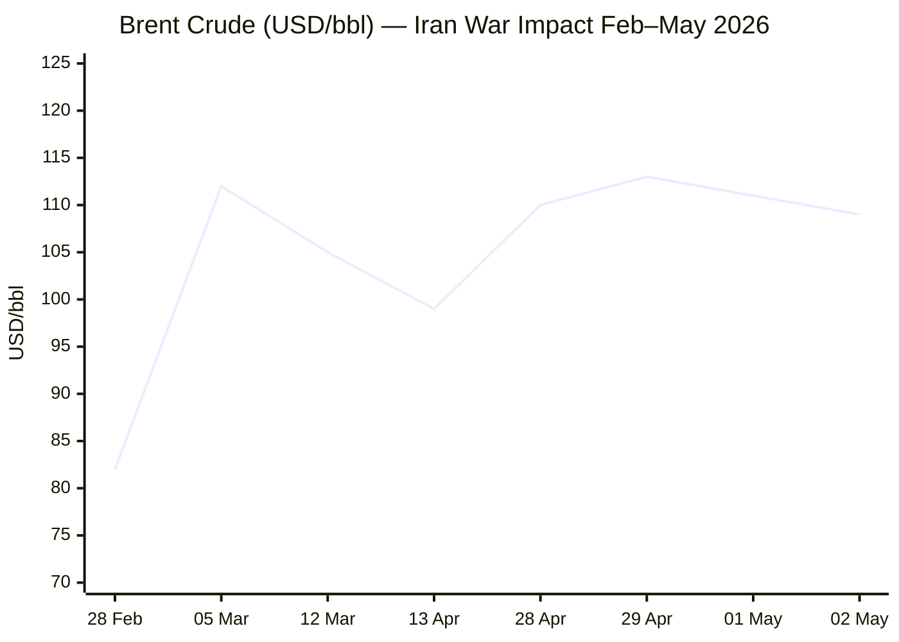
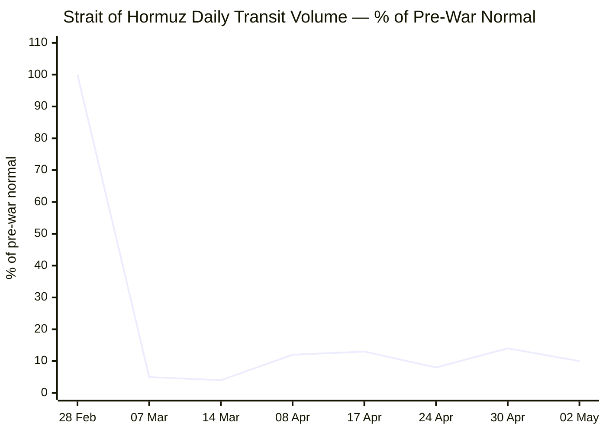

````yaml
---
brief_date: 2026-05-02
version: v1.2.1
run_time: "06:06 CET"
stories_published: 13
categories: [conflict, business, eu_affairs, technology, trends]
alert_counts:
  red: 2
  yellow: 7
  green: 4
ongoing_situations:
  - {name: "Russia–Ukraine War", real_world_start: "2022-02-24", day: 1529}
  - {name: "Iran War / Hormuz Crisis", real_world_start: "2026-02-28", day: 64}
  - {name: "Israel–Gaza & Lebanon", real_world_start: "2023-10-07", day: 939}
sources_fetched: 9
fetch_status:
  le_monde: "❌"
  faz: "❌"
  kommersant: "❌"
  xinhua: "⚠️"
  european_parliament: "⚠️"
expansion_queue: []
---
````

---

# 🌐 MORNING BRIEF
## Saturday, 02 May 2026 · 06:06 CET

### 13 stories across 5 categories

---

## DIGEST SUMMARY

| # | Category | Headline | Alert |
|---|----------|----------|-------|
| 1 | ⚔️ Conflict | Iran War: Trump invokes ceasefire to sidestep War Powers deadline | 🔴 |
| 2 | ⚔️ Conflict | Ukraine: Russia crosses into Sumy Oblast; 210 drones overnight | 🟡 |
| 3 | ⚔️ Conflict | Lebanon: Israeli strikes kill 11 despite ceasefire; Hezbollah–govt split deepens | 🟡 |
| 4 | 💼 Business | Brent slides to ~$109 on Iran deal signal; dual blockade holds | 🔴 |
| 5 | 💼 Business | Eurozone GDP +0.1% Q1; CPI surges to 3.0% — stagflation risk real | 🟡 |
| 6 | 💼 Business | IMF April WEO: Global growth cut to 3.1%; adverse scenario 2.5% | 🟡 |
| 7 | 🇪🇺 EU Affairs | Magyar–von der Leyen: deal on Hungary's €17B frozen funds by late May | 🟢 |
| 8 | 🇪🇺 EU Affairs | Cyprus summit: EU to operationalise Article 42.7 mutual defence clause | 🟡 |
| 9 | 🇪🇺 EU Affairs | Slovakia under EU rule-of-law conditionality scrutiny | 🟢 |
| 10 | 🤖 Technology | FDA launches AI-powered real-time clinical trials with AstraZeneca & Amgen | 🟢 |
| 11 | 🤖 Technology | AI market: GPT-5.5 live; DeepSeek V4 competes on cost; governance tensions rising | 🟢 |
| 12 | 📈 Trends | Pakistan cements role as Iran–US strategic mediator | 🟡 |
| 13 | 📈 Trends | Hormuz closure accelerates global food security crisis via fertiliser shock | 🟡 |

> Alert Level key: 🔴 High significance · 🟡 Developing · 🟢 Stable/Routine

---

## 🚨 SIGNAL BOARD

🔴 **Trump invoked the ceasefire to argue the 60-day War Powers clock has "terminated" — Congress and legal experts reject the interpretation, leaving the Iran war's legal basis unresolved on Day 64.**
🔴 **Brent crude fell ~2% to ~$109/bbl after Iran sent a response to US amendments to a peace proposal — but the dual Hormuz blockade remains intact, keeping supply constrained.**
🟡 **Eurozone CPI hit 3.0% in April (energy +10.9%), the highest since September 2023; Q1 GDP grew only 0.1% — stagflation is no longer hypothetical.**
🟡 **Magyar and von der Leyen agreed on a late-May deadline to unlock Hungary's €17B in frozen EU funds — the single largest post-Orbán institutional reset.**
⚡ **Reversal signal: Gold retreated from $4,672 intraday high to $4,648 — "Strong Sell" on technicals — as Iran deal talk briefly reduced safe-haven demand.**

---

## 🔄 ONGOING SITUATIONS

| Situation | Real-world start | Day # | Last significant development | Status |
|-----------|-----------------|-------|------------------------------|--------|
| Russia–Ukraine War | 24 Feb 2022 | Day 1,529 | Russian forces crossed into Sumy Oblast (Komarivka); 210 drone attack overnight 1–2 May | 🔴 Active |
| Iran War / Hormuz Crisis | 28 Feb 2026 | Day 64 | Trump sent War Powers letter to Congress (1 May); Senate defeated sixth WPR curb 50–47; Brent ~$109/bbl; Hormuz transit ~14 vessels/day | 🟡 Ceasefire / Dual Blockade |
| Israel–Gaza & Lebanon | 07 Oct 2023 | Day 939 | Israeli strikes killed 11 in south Lebanon despite ceasefire; Hezbollah–Lebanese govt split escalating | 🔴 Active |

---

## ANALYST SECTIONS

---

> 🔎 **CONFLICT ANALYST** · 3 updates today

### 1. Iran War: Trump Invokes Ceasefire to Sidestep War Powers Deadline 🔴

**Alert:** 🔴
**Summary:** Friday 1 May marked the 60-day War Powers Resolution deadline for the Iran war. The Trump administration sent a formal letter to Congress arguing that the April 8 ceasefire "terminated" the hostilities that began on 28 February, resetting the clock. Defence Secretary Hegseth made the same argument in Senate testimony. Democrats and legal experts reject the interpretation, noting the statute contains no pause provision and that US forces remain operationally active in the region. A sixth Senate War Powers vote to curb Trump's authority failed 50–47, with Republican Susan Collins the sole crossover. Trump simultaneously called the 1973 law "totally unconstitutional."
**Significance:** The constitutional confrontation over war-making authority is now explicit. If the ceasefire collapses and strikes resume, the administration would face a direct legal challenge with no clear congressional authorisation in place.
**Sources:**

- [Al Jazeera — Has the US–Iran ceasefire reset the clock on War Powers Act deadline?](https://www.aljazeera.com/news/2026/5/1/has-the-us-iran-ceasefire-reset-the-clock-on-war-powers-act-deadline) · 01 May 2026
- [CNN — Trump considers it 'treasonous' to say US isn't winning the war with Iran](https://www.cnn.com/2026/05/01/world/live-news/iran-war-news) · 01 May 2026
- [The Hill — Trump tells Congress Iran ceasefire stopped 60-day clock, calls War Powers Act unconstitutional](https://thehill.com/homenews/administration/5858291-live-updates-donald-trump-iran-war-clock-dhs-funding-midterms/) · 01 May 2026

**Trend:** ↗ Escalating
**Tags:** #Iran #ceasefire #nuclear #MULTI-SOURCE

---

### 2. Ukraine: Russian Forces Cross Sumy Border; 210-Drone Strike Overnight 🟡

**Alert:** 🟡
**Summary:** Overnight into 2 May, Russia launched 210 attack drones at Ukraine — approximately 140 were Shahed-type — with air defences shooting down 190. Russian forces crossed the international border into Sumy Oblast, seizing the village of Komarivka according to Russian defence ministry claims; Ukraine's military said the village of Korchakivka in Sumy remained under Ukrainian control. Separately, 138 combat clashes were recorded on 30 April across the front. Russian strikes hit Kherson, Kharkiv, Odesa port infrastructure, and residential areas in Dnipropetrovsk region. Total claimed Russian losses since 24 February 2022 now stand at approximately 1,331,710, per Ukrainian MoD (1,420 in the past 24 hours).
**Significance:** The Sumy border crossing, if confirmed, would mark a new theatre of Russian ground pressure to add to existing Donetsk and Zaporizhzhia axes, stretching Ukrainian defensive resources.
**Sources:**

- [Ukrinform — Ukraine war live updates](https://www.ukrinform.net/rubric-ato) · 01–02 May 2026
- [Wikipedia — Timeline of the Russo-Ukrainian war 2026](https://en.wikipedia.org/wiki/Timeline_of_the_Russo-Ukrainian_war_(1_January_2026_%E2%80%93_present)) · 02 May 2026

**Trend:** ↗ Escalating
**Tags:** #Ukraine #Russia #frontline #drone-warfare #MULTI-SOURCE

---

### 3. Lebanon: Israeli Strikes Kill 11 Despite Ceasefire; Hezbollah–Government Rift Deepens 🟡

**Alert:** 🟡
**Summary:** Israeli air strikes on southern Lebanon killed at least 11 people — ten in Habbouch and one in Ain Baal — in what Lebanese officials called the deadliest day since the extended ceasefire took effect on 16 April. Hezbollah accused the Lebanese government of "treason" for engaging in ambassador-level talks with Israel in Washington. Lebanon's President Joseph Aoun responded by accusing Hezbollah of dragging Lebanon into a war to serve Iranian interests. The internal Lebanese political rupture now overlaps with the unresolved status of Hezbollah's exclusion from the Iran–US ceasefire framework.
**Significance:** The government–Hezbollah confrontation signals potential for domestic Lebanese political crisis at precisely the moment Washington is pressing Beirut to enforce the ceasefire independently of Tehran.
**Sources:**

- [CNN — Iran war live updates](https://www.cnn.com/2026/04/30/world/live-news/iran-war-news) · 30 Apr 2026
- [PBS NewsHour — US–Iran talks at impasse over nuclear program and Strait of Hormuz](https://www.pbs.org/newshour/show/u-s-iran-talks-at-impasse-over-nuclear-program-and-strait-of-hormuz) · 28 Apr 2026

**Trend:** ↗ Escalating
**Tags:** #Lebanon #Hezbollah #ceasefire #Iran #peace-talks

📚 *Background reading:* [IISS — Middle East military balance 2026](https://www.iiss.org) · [Kyiv Independent — Ukraine frontline analysis](https://kyivindependent.com)

---

> 💼 **BUSINESS ANALYST** · 3 updates today

### 4. Brent Slides ~2% to $109 on Iran Deal Signal; Dual Blockade Intact 🔴

**Alert:** 🔴
**Summary:** Brent crude fell from ~$111 to below $110 per barrel on Friday after Axios reported Iran had responded to US amendments to a potential peace deal — though without detail. On Thursday, Brent had briefly touched $114/bbl intraday — its highest since June 2022 — after reports of a White House briefing on expanded military options in Iran. The dual blockade remains: Iran controls the Strait of Hormuz, and the US Navy blockades Iranian ports. Hormuz transit stood at just 14 crossings on 30 April, roughly 10–14% of pre-war levels. US crude exports have surged to record highs as global buyers seek alternatives to Middle Eastern supply.
**Market signal:** Bearish on near-term oil demand recovery — the Hormuz dual blockade shows no sign of resolution, keeping structural supply deficit in place; any positive deal headline causes sharp but volatile relief rallies.
**Sources:**

- [Trading Economics — Brent crude futures](https://tradingeconomics.com/commodity/brent-crude-oil) · 01–02 May 2026
- [IEA — The Middle East and Global Energy Markets](https://www.iea.org/topics/the-middle-east-and-global-energy-markets) · Apr 2026
- [CNBC — Oil prices near $100 as US Navy blockades Iran's ports](https://www.cnbc.com/2026/04/12/oil-prices-iran-war-strait-hormuz-blockade.html) · 13 Apr 2026

📎 *See also: Conflict § Story 1 — Iran War/War Powers, and Trends § Story 13 — fertiliser/food security*

**Trend:** ↗ Escalating
**Tags:** #Brent #oil-price #Hormuz #supply-shock #energy-markets #MULTI-SOURCE

---

### 5. Eurozone GDP +0.1% Q1; CPI Jumps to 3.0% — Stagflation Risk Real 🟡

**Alert:** 🟡
**Summary:** Eurostat flash estimates published 30 April confirmed eurozone Q1 2026 GDP grew only 0.1% quarter-on-quarter — the weakest reading since the post-pandemic recovery stalled — while April CPI climbed to 3.0% year-on-year, the highest since September 2023 and above the market consensus of 2.9%. Energy prices led the surge, rising 10.9% annually — the steepest since February 2023 — driven directly by Hormuz disruption. Core inflation (excluding energy and food) eased slightly to 2.2% from 2.3%. The ECB is widely expected to hold its benchmark rate at 2.0% at its next meeting, caught between a slowing economy and an energy-driven inflation spike.
**Market signal:** Neutral-to-bearish for European equities — stagflation constrains monetary policy flexibility and compresses corporate margins in energy-intensive sectors.
**Sources:**

- [Eurostat — Euro area annual inflation up to 3.0%](https://ec.europa.eu/eurostat/web/products-euro-indicators/w/2-30042026-ap) · 30 Apr 2026
- [CNBC — Euro zone inflation jumps to 3% as economic growth almost stalls](https://www.cnbc.com/2026/04/30/euro-zone-economy-inflation-growth.html) · 30 Apr 2026

**Trend:** ↗ Escalating
**Tags:** #inflation #stagflation #ECB #eurozone #interest-rates #MULTI-SOURCE

---

### 6. IMF April WEO: Global Growth Cut to 3.1%; Adverse Scenario 2.5% 🟡

**Alert:** 🟡
**Summary:** The IMF's April 2026 World Economic Outlook — subtitled *Global Economy in the Shadow of War* — revised global growth down to 3.1% for 2026 (from 3.4% before the Iran conflict), with headline inflation projected to rise to 4.4%. The reference forecast assumes a short-lived conflict and a moderate 19% increase in energy commodity prices in 2026. An adverse scenario (sharper energy price rises, inflation expectations unanchored) puts global growth at 2.5%; a severe scenario, where disruptions extend into 2027, brings growth to 2.0%. Downside risks — prolonged Hormuz closure, geopolitical fragmentation, AI productivity disappointment — dominate the outlook. Emerging markets and conflict-proximate economies face the steepest slowdowns.
**Market signal:** Bearish at the macro level — the IMF's severe scenario would represent a near-recessionary world economy, and the baseline assumes a conflict duration the current dual-blockade standoff has already exceeded.
**Sources:**

- [IMF — World Economic Outlook April 2026: Global Economy in the Shadow of War](https://www.imf.org/en/publications/weo/issues/2026/04/14/world-economic-outlook-april-2026) · 14 Apr 2026
- [IMF Blog — War Darkens Global Economic Outlook](https://www.imf.org/en/blogs/articles/2026/04/14/war-darkens-global-economic-outlook-and-reshapes-policy-priorities) · 14 Apr 2026

**Trend:** ↘ De-escalating *(growth trajectory)*
**Tags:** #IMF #GDP-forecast #inflation #stagflation #MULTI-SOURCE

📚 *Background reading:* [Bruegel — European macroeconomic outlook 2026](https://www.bruegel.org) · [RAND — Energy security and economic resilience](https://www.rand.org)

---

> 🇪🇺 **EU AFFAIRS ANALYST** · 3 updates today

### 7. Magyar and von der Leyen Agree Late-May Deadline to Unlock Hungary's €17B 🟢

**Alert:** 🟢
**Summary:** On 29 April, Prime Minister-elect Péter Magyar made his first visit to Brussels, where he met European Commission President Ursula von der Leyen and European Council President António Costa. Magyar and von der Leyen agreed to finalise a political agreement by late May that would unlock the €17 billion in EU funds frozen since December 2022 under the rule-of-law conditionality mechanism. Of this total, approximately €10 billion in post-COVID recovery funds faces an August 2026 expiry deadline. The Commission has set 27 "super-milestones" covering anti-corruption, public procurement transparency, judicial independence, and fundamental rights guarantees. Magyar stated that none of the conditions run contrary to Hungary's national interests. He is to be formally sworn in on 9 May when the new National Assembly convenes.
**Legislative/policy stage:** Political agreement target: late May 2026. Formal Commission assessment of milestone fulfilment to follow. Rule-of-law conditionality mechanism remains active.
**Sources:**

- [Euronews — Incoming Hungarian PM Magyar in Brussels to unlock EU funds](https://www.euronews.com/my-europe/2026/04/29/newsletter-hungarian-prime-minister-peter-magyar-in-brussels-to-unlock-eu-funds) · 29 Apr 2026
- [Hungarian Conservative — Hungary's Magyar seeks political deal with Brussels on EU funds by late May](https://www.hungarianconservative.com/articles/current/hungary-magyar-eu-commission-funds-von-der-leyen/) · 29–30 Apr 2026
- [Balkan Insight — Democracy Digest: Hungary's incoming PM paves way for unfreezing EU funds](https://balkaninsight.com/2026/05/01/democracy-digest-hungarys-incoming-pm-paves-way-for-unfreezing-of-eu-funds/rd/) · 01 May 2026

**Trend:** ↘ De-escalating *(EU–Hungary institutional tension)*
**Tags:** #Hungary #Magyar #EU-funds #rule-of-law #EU-institutions #MULTI-SOURCE

---

### 8. EU Cyprus Summit: Article 42.7 Operationalisation and Operation Aspides Expansion 🟡

**Alert:** 🟡
**Summary:** The informal EU summit in Ayia Napa, Cyprus (23–24 April) produced a substantive political signal on collective European defence. Leaders agreed to initiate a working process to operationalise Article 42.7 of the EU treaties — the mutual assistance clause — clarifying how it functions practically and its relationship with NATO's Article 5. The summit was prompted in part by an Iranian drone strike on a British base in Cyprus in early March. Commission President von der Leyen proposed expanding Operation Aspides from a protection-only mission to a "sophisticated joint maritime coordination" role covering the Strait of Hormuz. Leaders from Lebanon, Egypt, Syria, Jordan, and the GCC Secretary-General attended the margins. The MFF successor framework — a proposed €2 trillion budget for 2028–2034 — was also tabled but yielded no decisions.
**Legislative/policy stage:** Article 42.7 operationalisation process: initiated; no formal decisions taken at informal summit. Operation Aspides mandate expansion: under Commission proposal, requires Council decision. MFF: Commission proposal circulated, member-state negotiations pending.
**Sources:**

- [Euronews — EU leaders meet in Cyprus to talk Ukraine, Hormuz, energy and mutual defence](https://www.euronews.com/my-europe/2026/04/23/eu-leaders-meet-in-cyprus-to-talk-ukraine-hormuz-energy-and-mutual-defence) · 23 Apr 2026
- [The Defense Post — Shaken by Iran War, EU seeks larger voice on Mideast](https://thedefensepost.com/2026/04/25/europe-iran-war-response/) · 25 Apr 2026

**Trend:** ↗ Escalating *(EU defence integration)*
**Tags:** #EU-defence #EU-institutions #Iran #Hormuz #MFF #MULTI-SOURCE

---

### 9. Slovakia Under EU Rule-of-Law Conditionality Scrutiny 🟢

**Alert:** 🟢
**Summary:** A majority of MEPs in the European Parliament voted this week to urge the European Commission to examine whether conditions are met to activate the rule-of-law conditionality mechanism against Slovakia under Prime Minister Robert Fico. MEPs cited recent changes to prosecutorial structures and oversight bodies as raising concerns that institutional checks have been weakened, potentially jeopardising EU funding. The Slovak government maintains the reforms are a systemic restructuring, not democratic backsliding. The development comes as Hungary prepares to exit conditionality scrutiny under Magyar, creating a shifting rule-of-law landscape within the bloc.
**Legislative/policy stage:** European Parliament resolution: adopted. Commission examination: not yet formally initiated. Conditionality mechanism activation: would require formal Commission assessment and Council qualified majority.
**Sources:**

- [Balkan Insight — Slovakia under increasing EU scrutiny as tensions grow over reforms](https://balkaninsight.com/2026/05/01/democracy-digest-hungarys-incoming-pm-paves-way-for-unfreezing-of-eu-funds/rd/) · 01 May 2026

**Trend:** ↗ Escalating
**Tags:** #rule-of-law #EU-institutions #EU-funds #EU-election

📚 *Background reading:* [ECFR — Europe's shifting rule-of-law frontier](https://ecfr.eu) · [Bruegel — EU budget conditionality: lessons from Hungary](https://www.bruegel.org)

---

> 🤖 **TECHNOLOGY ANALYST** · 2 updates today

### 10. FDA Launches AI-Powered Real-Time Clinical Trials with AstraZeneca and Amgen 🟢

**Alert:** 🟢
**Summary:** The US Food and Drug Administration this week announced the first real-time AI-monitored clinical trial programme, partnering with AstraZeneca and Amgen in an initial pilot. The system uses cloud computing and AI to monitor trial data continuously rather than awaiting periodic submissions, with FDA Chief AI Officer Jeremy Walsh stating the goal is to reduce overall clinical trial time by 20–40%. The FDA requested public input by 29 May, with potential expansion of the pilot scheduled for summer 2026. The initiative follows a major consolidation of FDA's internal data systems — 40 intake systems into one — enabling new AI integrations across the agency.
**Analyst note:** Over a 12–24 month horizon, successful AI-accelerated trial timelines could structurally reduce drug development costs by billions of dollars per compound, reshaping pharma capital allocation and potentially widening access to therapies in markets where the Iran war has disrupted supply chains.
**Sources:**

- [Government Executive — FDA to pilot real-time clinical drug trials through cloud and AI](https://www.govexec.com/technology/2026/04/fda-pilot-real-time-clinical-drug-trials-cloud-ai/413199/) · 30 Apr 2026

**Trend:** ↗ Escalating
**Tags:** #AI #biotech #AI-regulation #AI-benchmark

---

### 11. AI Market: GPT-5.5 Live; DeepSeek V4 Competes on Cost; Governance Pressures Mount 🟢

**Alert:** 🟢
**Summary:** As of early May 2026, the competitive frontier AI model market has consolidated around several key releases. OpenAI's GPT-5.5 — positioned for agentic coding and scientific research — rolled out on 23 April to commercial and enterprise users. Anthropic's Claude Opus 4.7 has been confirmed, with Mythos in limited internal testing. DeepSeek V4 is competing aggressively on cost-per-token and long-context (1M-token window), targeting bulk and regulated-industry use cases. Google is retiring Gemini 2.0, pushing the Gemini 3.x family. Governance tensions are rising simultaneously: xAI faces active investigations in Canada, the EU, and the UK, while US AI governance is fracturing between federal light-touch policy and state-level healthcare and consumer AI regulations. Anthropic reportedly settled training data claims.
**Analyst note:** Within 12–18 months, the compute-access and distribution layer — not model capability alone — is likely to determine market leadership; startups and regulated industries will face acute vendor dependency risks as infrastructure consolidates around a small number of hyperscalers.
**Sources:**

- [Mean CEO Blog — New AI Model Releases News May 2026](https://blog.mean.ceo/new-ai-model-releases-news-may-2026/) · 01 May 2026

**Trend:** → Stable *(capability competition)* / ↗ Escalating *(governance friction)*
**Tags:** #AI #LLM #AI-regulation #semiconductor #AI-safety

📚 *Background reading:* [CSIS — AI governance and the technology competition](https://www.csis.org) · [RAND — AI and national security: emerging challenges](https://www.rand.org)

---

> 📈 **TRENDS ANALYST** · 2 updates today

### 12. Pakistan Cements Role as Iran–US Strategic Mediator 🟡

**Alert:** 🟡
**Summary:** Pakistan's central role in the Iran–US ceasefire and subsequent diplomatic process has become one of the most consequential structural shifts in regional geopolitics to emerge from the 2026 Iran war. Prime Minister Shehbaz Sharif and Field Marshal Asim Munir brokered the 8 April ceasefire, and Pakistani mediators have served as the primary back-channel for Iran's subsequent proposals, including the April 26–28 Hormuz-first framework. Iran's Foreign Minister Araghchi raised the phased proposal directly with Pakistani, Egyptian, Turkish, and Qatari counterparts in Islamabad. The failure of the Islamabad Talks has not removed Pakistan from the process — both sides continue to communicate through Islamabad.
**Horizon:** Medium-term. Pakistan's elevation from regional power to indispensable mediator in a major US-Iran war is a multi-year geopolitical reorientation likely to outlast the immediate conflict.
**Sources:**

- [House of Commons Library — US–Iran ceasefire and nuclear talks in 2026](https://commonslibrary.parliament.uk/research-briefings/cbp-10637/) · 01 May 2026
- [Axios — Iran offers US deal to reopen Hormuz strait, postpone nuclear talks](https://www.axios.com/2026/04/27/iran-us-hormuz-strait-nuclear-talks-proposal-pakistan) · 26 Apr 2026

**Trend:** ↗ Escalating
**Tags:** #Pakistan-mediation #diplomacy #mediation #peace-talks #Iran #MULTI-SOURCE

---

### 13. Hormuz Closure Accelerates Global Food Security Crisis via Fertiliser Shock 🟡

**Alert:** 🟡
**Summary:** The structural link between the Hormuz closure and global food security has crystallised over ten weeks of disruption. The Strait is the primary export route for over 30% of globally traded urea and 20–30% of ammonia — key agricultural inputs whose production depends on Qatari and Gulf LNG. Qatar's Ras Laffan facility, attacked on 2 March, remains offline and may require 3–5 years for full repair. FAO's Chief Economist Máximo Torero warned in April that if the conflict extends beyond 40 days (already surpassed), farmers may reduce fertiliser application or shift to less input-intensive crops — decisions that could depress 2026/27 yields. The FAO Food Price Index stood at 128.5 in March 2026 (the highest since September 2025), driven by energy and vegetable oil price pass-through.
**Horizon:** Long-term. Fertiliser infrastructure damage and crop-year planting decisions made in April–May 2026 will affect food supply and prices through 2027, independent of when the Hormuz blockade ends.
**Sources:**

- [FAO — Food Price Index March 2026](https://www.fao.org/worldfoodsituation/foodpricesindex/en/) · 03 Apr 2026
- [Wikipedia — 2026 Iran war fuel crisis](https://en.wikipedia.org/wiki/2026_Iran_war_fuel_crisis) · 02 May 2026

📎 *See also: Business § Story 4 — oil markets*

**Trend:** ↗ Escalating
**Tags:** #food-security #food-prices #Hormuz #climate #energy-markets #MULTI-SOURCE

📚 *Background reading:* [RAND — Energy security and global food systems](https://www.rand.org) · [Atlantic Council — Middle East energy disruptions and agricultural markets](https://www.atlanticcouncil.org)

---

## 📊 KEY DATA OF THE DAY

> 📊 **DATA OFFICER** · 7 indicators

| Indicator | Value | Δ vs prior session | Δ vs 7 days ago | Note | Source | URL |
|-----------|-------|-------------------|-----------------|------|--------|-----|
| EUR/USD | 1.1765 | +0.29% | N/A | Dollar weakness persisting; EU stagflation complicates ECB path | Trading Economics / ECB | [link](https://tradingeconomics.com/euro-area/currency) |
| Brent Crude (USD/bbl) | ~$109.00 | −1.8% | N/A | Fell from $111 on Iran deal response; intraday high $114 on 29 Apr | Trading Economics / EIA | [link](https://tradingeconomics.com/commodity/brent-crude-oil) |
| Gold (XAU/USD) | $4,648 | +0.41% | N/A | 52-week low $3,123; war premium elevated; technicals "Strong Sell" | Investing.com | [link](https://www.investing.com/commodities/gold) |
| IMF Global Growth 2026 | 3.1% | vs Jan WEO: −0.3pp | vs Oct WEO: −0.3pp | "Shadow of War" WEO; adverse scenario 2.5%; severe 2.0% | IMF WEO Apr 2026 | [link](https://www.imf.org/en/publications/weo/issues/2026/04/14/world-economic-outlook-april-2026) |
| EU CPI YoY (April 2026) | 3.0% | vs March: +0.4pp | vs Jan 2026: +1.3pp | Highest since Sep 2023; energy +10.9%; core 2.2% | Eurostat flash 30 Apr | [link](https://ec.europa.eu/eurostat/web/products-euro-indicators/w/2-30042026-ap) |
| FAO Food Price Index | 128.5 | vs Feb: +2.4% | March 2026 — latest available (Apr release: 8 May) | Highest since Sep 2025; energy/veg oil pass-through from Hormuz | FAO | [link](https://www.fao.org/worldfoodsituation/foodpricesindex/en/) |
| Hormuz Transit Volume | ~14 crossings/day | vs pre-war: −86% | vs early Mar: +9 crossings | ~10–14% of pre-war normal (~100+/day); dual blockade holds | Windward Maritime Intelligence / CSIS | [link](https://www.csis.org/analysis/strait-hormuz-8-charts) |

**Data commentary:** The combination of Brent at ~$109/bbl, eurozone CPI at 3.0%, and global growth slashed to 3.1% paints a textbook stagflation backdrop: energy costs are driving consumer price acceleration across advanced economies while simultaneously choking the growth impulse. The Hormuz transit figure — 14 crossings versus pre-war levels of 100+ per day — makes clear the energy shock is structural, not a sentiment spike. Gold near $4,648 reflects sustained geopolitical risk premium even as technicals suggest the safe-haven trade is crowded. The FAO index rising for the second consecutive month confirms that food and energy inflation are now feeding each other through fertiliser and logistics channels.

---

## CHARTS





---

## ⚙️ AGENT METADATA

| Field | Value |
|-------|-------|
| Agent version | MORNING BRIEF v1.2.1 |
| Run timestamp | 2026-05-02T06:06:00+02:00 |
| Fetch status | Le Monde ❌ · FAZ ❌ · Kommersant ❌ · Xinhua ⚠️ (content 24 Apr, outside 24h window) · EP ⚠️ (navigation only, no press releases) |
| Sources queried | 9 / 11 (Le Monde, FAZ, Kommersant unreachable; EP and Xinhua fetched but no current-window stories; all 5 outlets covered via Phase 2 search fallback) |
| Stories surfaced | ~24 (before editorial filter) |
| Stories published | 13 |
| Languages processed | EN, DE (secondary), FR (secondary) |
| Output language | English (British) |
| Date validated | ✅ Confirmed 02 May 2026 |
| Expansion Queue | None — all tags resolved from closed list |

---

*MORNING BRIEF is an AI-assisted digest. All summaries are paraphrased from original sources. Verify time-sensitive information at the linked URLs before acting. Output language: British English.*
