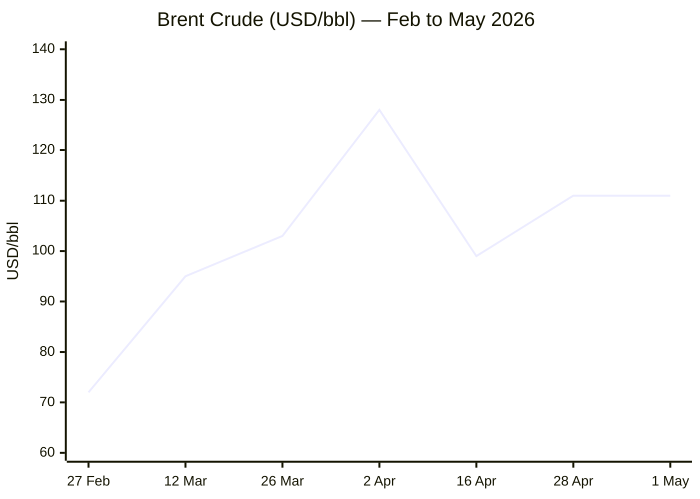
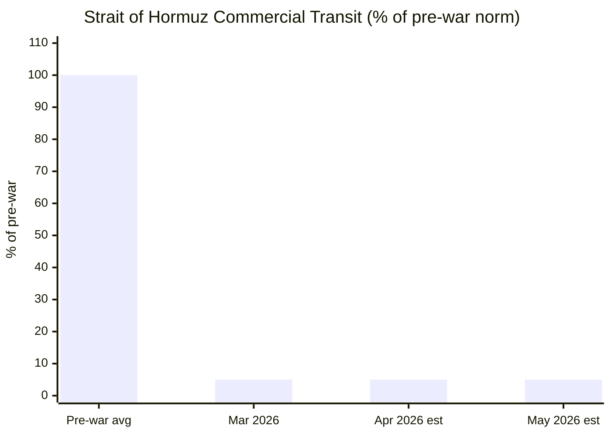

````yaml
---
brief_date: 2026-05-03
version: v1.2.1
run_time: "05:47 CET"
stories_published: 10
categories: [conflict, business, eu_affairs, technology, trends]
alert_counts:
  red: 3
  yellow: 4
  green: 3
ongoing_situations:
  - {name: "2026 Iran War & Hormuz Crisis", real_world_start: "2026-02-28", day: 65}
  - {name: "Russia–Ukraine War", real_world_start: "2022-02-24", day: 1530}
  - {name: "Israel–Lebanon Ceasefire", real_world_start: "2026-04-16", day: 18}
sources_fetched: 9
fetch_status:
  le_monde: "❌"
  faz: "❌"
  kommersant: "❌"
  xinhua: "⚠️"
  european_parliament: "⚠️"
expansion_queue: []
---
````

---

# 🌐 MORNING BRIEF
## Sunday, 03 May 2026 · 05:47 CET
### 10 stories across 5 categories

---

## DIGEST SUMMARY

| # | Category | Headline | Alert |
|---|----------|----------|-------|
| 1 | ⚔️ Conflict | Iran submits 14-point peace proposal; Trump says he "can't imagine" accepting it | 🔴 |
| 2 | ⚔️ Conflict | Russia–Ukraine: 177 engagements in 24 hours; Ukraine strikes airfield 1,700 km into Russia | 🟡 |
| 3 | 💼 Business | Brent at $111/bbl as UAE exits OPEC; 850 million barrels of supply lost since February | 🔴 |
| 4 | 💼 Business | IMF cuts global growth to 3.1%; EU inflation hits 3.0% — highest since September 2023 | 🟡 |
| 5 | 🇪🇺 EU Affairs | Magyar begins Hungary government formation; Orbán era ends after 16 years | 🟢 |
| 6 | 🇪🇺 EU Affairs | Cyprus summit delivers AccelerateEU, Article 42.7 debate, and single-market roadmap | 🟡 |
| 7 | 🤖 Technology | Pentagon signs AI contracts with 8 firms; Anthropic excluded over safety guardrail dispute | 🟡 |
| 8 | 🤖 Technology | Google commits $40 billion to Anthropic; AI industry pivots from tools to autonomous agents | 🟢 |
| 9 | 📈 Trends | Global maritime order fractures: Hormuz at 5% transit; Indonesia floats Malacca toll | 🔴 |
| 10 | 📈 Trends | Hungary's landslide signals populism in retreat across EU | 🟢 |

> Alert Level key: 🔴 High significance · 🟡 Developing · 🟢 Stable/Routine

---

## 🚨 SIGNAL BOARD

🔴 Iran's 14-point counterproposal separates Hormuz reopening from nuclear talks — Trump "not satisfied," military briefing on new strike options imminent
🔴 Brent crude +60% since 28 February; 850 million barrels of cumulative supply lost; UAE's OPEC exit removes 4.8 million bpd of production ceiling
🟡 EU CPI hits 3.0% in April (energy +10.9%) — highest since September 2023 — with ECB stuck between growth risk and inflation risk
🟢 Hungary's Tisza Party secures two-thirds supermajority; EU gains first pro-European government in Budapest in 16 years
⚡ Global maritime governance precedent set: Indonesia floated Malacca toll before walking it back — the Hormuz closure is spreading strategic contagion

---

## 🔄 ONGOING SITUATIONS

| Situation | Real-world start | Day # | Last significant development | Status |
|-----------|-----------------|-------|------------------------------|--------|
| 2026 Iran War & Hormuz Crisis | 28 Feb 2026 | Day 65 | Iran submitted 14-point proposal; Trump reviewing, sceptical; USCENTCOM briefing expanded strike options | 🟡 Ceasefire (fragile) |
| Russia–Ukraine War | 24 Feb 2022 | Day 1,530 | 177 combat engagements in 24 h; Ukraine strikes airfield 1,700 km into Russia; Russian drone attacks on infrastructure | 🔴 Active |
| Israel–Lebanon Ceasefire | 16 Apr 2026 | Day 18 | Ceasefire extended 3 weeks (to ~14 May) by Trump on 23 April; IRGC says Lebanon not included in Iran ceasefire terms | 🟡 Ceasefire |

---

## ⚔️ CONFLICT

> 🔎 **CONFLICT ANALYST** · 2 updates today

---

### 1. Iran–US Diplomacy: 14-Point Proposal, Sceptical White House 🔴
**Alert:** 🔴
**Summary:** Iran submitted a 14-point counterproposal to the US framework on or around 30 April, conveyed through Pakistani mediators. Tehran's plan proposes resolving all outstanding issues and ending the war within 30 days — shorter than the two-month ceasefire Washington sought — while deferring nuclear negotiations until after the Strait of Hormuz is reopened and the US naval blockade lifted. Key demands include security guarantees against future US-Israeli strikes, withdrawal of US forces from Iran's periphery, reparations, and a new multilateral mechanism governing Strait transit rights. Trump told reporters on 2 May he had been briefed on the concept but had "not yet reviewed" the exact wording, before posting on social media that he "can't imagine" it would be acceptable, adding Iran had "not yet paid a big enough price." Iran's armed forces stated it was "likely" the war would resume, citing US "non-commitment to agreements." US national security team met Monday to discuss next steps; CNN reported Trump is unlikely to accept any proposal that defers nuclear issues.
**Significance:** The proposal crystallises the fundamental impasse: Iran seeks sequential de-escalation (Hormuz first, nukes later); Washington insists the nuclear file opens simultaneously. The divergence removes Washington's primary leverage — the blockade — before its primary objective is achieved. USCENTCOM chief Admiral Brad Cooper is scheduled to brief Trump on expanded military options, raising the risk of resumption despite the nominal ceasefire.
**Sources:**
- [NPR — Iran submits 14-point response to U.S. proposal to end war](https://www.npr.org/2026/05/02/nx-s1-5808924/iran-response-trump-proposal) · 02 May 2026
- [CNBC — Trump says he is reviewing a new Iranian proposal to end the war](https://www.cnbc.com/2026/05/02/trump-iran-strait-of-hormuz.html) · 02 May 2026
- [Al Jazeera — Trump reviews Iranian proposal aimed at reopening Strait of Hormuz](https://www.aljazeera.com/news/2026/4/28/trump-reviews-iranian-proposal-aimed-at-reopening-strait-of-hormuz) · 28 Apr 2026

**Trend:** → Stable
**Tags:** #Iran #nuclear #peace-talks #Hormuz #MULTI-SOURCE

---

### 2. Russia–Ukraine: Deep Strike Campaign Intensifies on Both Sides 🟡
**Alert:** 🟡
**Summary:** Over the 24 hours to 08:00 on 30 April, Russian forces conducted 177 combat engagements, launched 2 missile strikes, 69 airstrikes, dropped 226 guided aerial bombs, and deployed 9,683 kamikaze drones — one of the heaviest single-day drone surges of the war. Strikes hit Sumy, Dnipropetrovsk, and Zaporizhzhia regions. In a significant counter, Ukraine struck a Russian airfield roughly 1,700 km from the front, confirming destruction of a Su-57 and Su-34 fighter jet. Russian drone attacks on 2 May targeted critical infrastructure in Mykolaiv, Kryvyi Rih, and Odesa Oblasts. A Russian drone hit a civilian bus in Kherson, killing two and injuring seven. The Ukrainian General Staff reported Russian losses exceeding 1.33 million troops since February 2022, including 1,240 over the prior 24 hours. Russia's spring offensive is gaining momentum, per ISW, reversing the territorial gains Ukraine recorded in February.
**Significance:** Ukraine's 1,700 km strike represents one of its deepest penetrations of Russian territory and signals continued investment in long-range drone and missile capability even as frontline pressure intensifies. The asymmetry — Russia's mass drone campaign versus Ukraine's precision deep strikes — is defining the current operational phase and will shape Western support decisions into the summer.
**Sources:**
- [Kyiv Independent — Ukraine strikes Russian airfield 1,700 kilometres away, damages 4 fighter jets](https://kyivindependent.com/) · 02 May 2026
- [EMPR — Russia–Ukraine War Updates: Key Developments as of April 30, 2026](https://empr.media/news/war/russia-ukraine-war-updates-key-developments-as-of-april-30-2026/) · 30 Apr 2026

**Trend:** ↗ Escalating
**Tags:** #Ukraine #Russia #frontline #drone-warfare #MULTI-SOURCE

📚 *Background reading:* [Kyiv Independent — Ukraine war latest](https://kyivindependent.com/) · [ACLED — Ukraine Conflict Monitor](https://acleddata.com/monitor/ukraine-conflict-monitor)

---

## 💼 BUSINESS

> 💼 **BUSINESS ANALYST** · 2 updates today

---

### 3. Brent at $111/bbl as UAE Exits OPEC; 850 Million Barrels of Supply Lost 🔴
**Alert:** 🔴
**Summary:** Brent crude held above $111/bbl on Friday — up approximately 60% since the 28 February US-Israeli strikes on Iran — as the Strait of Hormuz remains effectively closed to commercial shipping. The week's volatility was amplified by two developments: the UAE formally exited OPEC and OPEC+ on 1 May, ending nearly 60 years of membership, citing "national interests" and the desire to lift production unconstrained by quotas. Abu Dhabi has 4.8 million bpd of capacity but was capped at 3.2 million bpd under OPEC rules. Separately, US crude exports reached record levels as global buyers substitute American supply for disrupted Gulf barrels. ING revised its Q2 2026 Brent forecast up to $104/bbl average, with downside scenario pricing above $100/bbl for the rest of the year. The cumulative supply disruption since 28 February now exceeds 850 million barrels, with around 14 million bpd currently disrupted. 📎 See also: Conflict § Story 1 — Iran–US Hormuz impasse.
**Market signal:** Bearish in the long run as UAE uncaps production capacity, but short-term bullish as Hormuz remains closed and OPEC loses its ability to coordinate a response.
**Sources:**
- [Al Jazeera — UAE leaves OPEC in blow to oil cartel during war on Iran](https://www.aljazeera.com/news/2026/4/28/uae-leaves-opec-and-opec) · 28 Apr 2026
- [ING THINK — Oil forecasts raised as prolonged Strait of Hormuz disruption continues](https://think.ing.com/articles/oil-forecasts-revised-higher-as-strait-of-hormuz-disruption-drags-on280426/) · 28 Apr 2026
- [CNBC — U.S. oil hovers near $100 on report Trump dissatisfied with Iran's proposal](https://www.cnbc.com/2026/04/28/oil-prices-us-iran-hormuz-negotiations-wti-brent-crude.html) · 28 Apr 2026

**Trend:** ↗ Escalating
**Tags:** #Brent #oil-price #supply-shock #commodities #MULTI-SOURCE

---

### 4. IMF Cuts Global Growth to 3.1%; EU Inflation Breaks 3-Year High 🟡
**Alert:** 🟡
**Summary:** The IMF's April 2026 World Economic Outlook — titled *Global Economy in the Shadow of War* — cut the 2026 global growth reference forecast to 3.1%, down from 3.4% in the January update and from 3.4% pre-war. The Fund raised global headline inflation to 4.4% for 2026. Its adverse scenario — a prolonged Hormuz shutdown — puts growth at 2.5% and inflation at 5.4%; a severe scenario implies 2.0% growth. Separately, Eurostat's 30 April flash estimate showed euro-area annual inflation reached 3.0% in April, the highest since September 2023, up from 2.6% in March. Energy drove the jump at +10.9% year-on-year. Core inflation held at 2.2%, providing the ECB room to stay on hold — its fifth consecutive meeting — but Lagarde has flagged the risk of secondary effects if energy prices remain elevated.
**Market signal:** Bearish for risk assets and equities broadly; stagflationary signal keeps central bank easing off the table and raises the prospect of a 2027 hike.
**Sources:**
- [IMF — World Economic Outlook, April 2026: Global Economy in the Shadow of War](https://www.imf.org/en/publications/weo/issues/2026/04/14/world-economic-outlook-april-2026) · 14 Apr 2026
- [Eurostat — Euro area annual inflation up to 3.0%](https://ec.europa.eu/eurostat/web/products-euro-indicators/w/2-30042026-ap) · 30 Apr 2026

**Trend:** ↗ Escalating
**Tags:** #IMF #inflation #GDP-forecast #ECB #interest-rates #MULTI-SOURCE

📚 *Background reading:* [Bruegel — EU economics analysis](https://www.bruegel.org) · [IMF blog — War Darkens Global Economic Outlook](https://www.imf.org/en/blogs/articles/2026/04/14/war-darkens-global-economic-outlook-and-reshapes-policy-priorities)

---

## 🇪🇺 EU AFFAIRS

> 🇪🇺 **EU AFFAIRS ANALYST** · 2 updates today

---

### 5. Hungary: Magyar Begins Government Formation; EU Relations Reset Expected 🟢
**Alert:** 🟢
**Summary:** Following Tisza Party's historic landslide on 12 April — 53.6% of the vote, 138 of 199 parliamentary seats, a two-thirds supermajority — Péter Magyar is engaged in the constitutional process of government formation. Hungary's President is obliged to nominate the person commanding a parliamentary majority. Viktor Orbán, absent from the 23–24 April Cyprus summit for the first time in 16 years as Council member, has conceded defeat. Magyar's two-thirds majority grants him the authority to amend Hungary's Fundamental Law — the same mechanism Orbán used to entrench Fidesz since 2010. European Commission President von der Leyen stated "Hungary has chosen Europe." Brussels is closely watching reform milestones tied to €20bn+ in frozen EU cohesion and recovery funds, conditioned on rule-of-law and judicial independence improvements. Hungarian forint has strengthened since the result.
**Legislative/policy stage:** Government formation in progress; no new executive in place yet. Hungarian parliament will convene to confirm a new Prime Minister; Magyar has announced a coalition government is not required given the supermajority.
**Sources:**
- [CNN — Hungary election 2026 results: Péter Magyar wins, Trump ally Viktor Orbán concedes](https://www.cnn.com/2026/04/12/world/live-news/hungary-election-orban-magyar) · 12 Apr 2026
- [Al Jazeera — Peter Magyar wins Hungary election, unseating Viktor Orban after 16 years](https://www.aljazeera.com/news/2026/4/12/hungary-election-early-results-show-magyars-tisza-ahead-of-orbans-fidesz) · 12 Apr 2026

**Trend:** ⚡ Reversal
**Tags:** #Hungary #Magyar #EU-funds #rule-of-law #EU-election #MULTI-SOURCE

---

### 6. Cyprus Summit Delivers AccelerateEU, Article 42.7 Debate, Single Market Roadmap 🟡
**Alert:** 🟡
**Summary:** EU leaders meeting informally in Ayia Napa on 23–24 April endorsed the Commission's AccelerateEU package — a 44-action plan to shield European households from the Iran war-driven fossil-fuel price shock (already costing the EU an additional €24bn in import costs). Measures include targeted energy bill relief, nuclear plant life extensions, and accelerated renewable deployment, with the majority entering force in April or May 2026. Leaders also opened debate on Article 42.7 of the EU Treaty — the mutual defence clause — triggered by the Iranian Shahed drone strike on Akrotiri air base in Cyprus in early March. Cyprus, a non-NATO member holding the Council presidency, pushed for an operational playbook for the clause. Separately, Commission, Council, and Parliament presidents signed the *One Europe, One Market* roadmap, committing to five legislative and policy priority areas by end-2027. EU leaders agreed to resume MFF 2028–2034 discussions at the June European Council, with a "negotiation box" prepared by the Cypriot presidency.
**Legislative/policy stage:** AccelerateEU: most measures to enter force April–May 2026; member-state implementation required. Article 42.7: informal debate only; no formal process triggered. MFF: June European Council for negotiation box; final agreement targeted by end-2026.
**Sources:**
- [European Council — Informal meeting of heads of state or government, 23–24 April 2026](https://www.consilium.europa.eu/en/meetings/european-council/2026/04/23-24/) · 24 Apr 2026
- [Carbon Brief — EU strategy sets out 44 actions to limit fossil-fuel price shocks](https://www.carbonbrief.org/iran-war-eu-strategy-sets-out-44-actions-to-limit-fossil-fuel-price-shocks/) · 26 Apr 2026
- [European Parliament — Press kit for the informal EU summit of 23–24 April 2026](https://www.europarl.europa.eu/news/en/press-room/20260423IPR41854/) · 23 Apr 2026

**Trend:** ↗ Escalating
**Tags:** #EU-institutions #EU-defence #energy-policy #MFF #single-market #MULTI-SOURCE

📚 *Background reading:* [ECFR — European foreign policy analysis](https://ecfr.eu/) · [Bruegel — Tagliapietra on EU energy transition](https://www.bruegel.org)

---

## 🤖 TECHNOLOGY

> 🤖 **TECHNOLOGY ANALYST** · 2 updates today

---

### 7. Pentagon Signs AI Contracts with 8 Firms; Anthropic Excluded Over Safety Dispute 🟡
**Alert:** 🟡
**Summary:** The US Department of Defense announced on 1 May contracts with eight AI providers — OpenAI, Google, Microsoft, Amazon Web Services, NVIDIA, SpaceX, Oracle, and Reflection — to deploy their models on classified DoD networks for "lawful operational use." Anthropic was explicitly excluded after the Trump administration declared it a "supply-chain risk" over the company's refusal to remove safety guardrails barring autonomous weapons and mass-surveillance applications. A federal judge in California blocked the DoD's blacklisting effort last month. Discussions between Anthropic CEO Dario Amodei and White House Chief of Staff Susie Wiles have resumed following Anthropic's unveiling of *Mythos*, a cybersecurity threat-identification tool that also generates attack roadmaps. DoD's GenAI.mil platform has reached 1.3 million Defence personnel within five months of launch. The Pentagon's framework signals an "AI-first fighting force" strategy with multiple vendor relationships to avoid lock-in.
**Analyst note:** Within 12–24 months, multi-vendor AI infrastructure across classified DoD networks will normalise AI-assisted operational planning across all services, accelerating procurement cycles for AI-enabled systems and setting precedents for allied militaries on AI governance frameworks.
**Sources:**
- [CNN — Pentagon strikes deals with 7 Big Tech companies after shunning Anthropic](https://www.cnn.com/2026/05/01/tech/pentagon-ai-anthropic) · 01 May 2026
- [Tech Startups — Pentagon signs AI deals with OpenAI, Google, Microsoft, and Amazon for classified networks](https://techstartups.com/2026/05/01/pentagon-signs-ai-deals-with-openai-google-microsoft-and-amazon-for-classified-networks-leaves-out-anthropic/) · 01 May 2026

**Trend:** ↗ Escalating
**Tags:** #AI #AI-regulation #AI-safety #cyber #MULTI-SOURCE

---

### 8. Google Commits $40 Billion to Anthropic; Industry Pivots to Agentic AI 🟢
**Alert:** 🟢
**Summary:** Google has reportedly committed up to $40 billion in additional investment in Anthropic — including an immediate $10 billion tranche with $30 billion tied to milestones — alongside expanded long-term compute support. The deal follows a broader industry pivot characterised by a shift from generative tools to autonomous AI agents capable of executing multi-step tasks within enterprise controls. OpenAI has restructured its product direction toward multimodal virtual assistants; Adobe introduced agentic workflows inside Firefly; SAS launched governed enterprise AI agents. Meta's AI expansion faces political barriers in China. Anthropic's revenue has reportedly reached $30 billion annually, driving infrastructure strain that has pushed the company into talks to acquire inference chips from UK-based Fractile (expected in 2027). The Google deal, combined with the ongoing White House discussions, positions Anthropic to re-enter the DoD conversation once Mythos oversight is resolved.
**Analyst note:** Google's $40 billion commitment, if completed, would make Anthropic the most heavily capitalised safety-first AI lab globally by 2027, altering competitive dynamics against OpenAI and DeepSeek in both enterprise and government markets.
**Sources:**
- [Boston Institute of Analytics — Generative AI Course Weekly Roundup, 26 April–2 May 2026](https://bostoninstituteofanalytics.org/blog/generative-ai-course-weekly-roundup-26-april-2-may-2026-5-major-shifts-defining-the-rise-of-agentic-ai/) · 02 May 2026
- [InvestingLive — Eurozone April CPI (Anthropic valuation note)](https://investinglive.com/news/eurozone-april-preliminary-cpi-30-vs-29-yy-expected-20260430/) · 30 Apr 2026

**Trend:** ↗ Escalating
**Tags:** #AI #LLM #AI-safety #data-centre #MULTI-SOURCE

📚 *Background reading:* [CSIS — Technology and security analysis](https://www.csis.org) · [RAND — AI and national security](https://www.rand.org)

---

## 📈 TRENDS

> 📈 **TRENDS ANALYST** · 2 updates today

---

### 9. Global Maritime Order Fractures as Hormuz Closure Sets Dangerous Precedent 🔴
**Alert:** 🔴
**Summary:** Traffic through the Strait of Hormuz — through which 20% of the world's oil and LNG normally passes — remains at approximately 5% of pre-war norms, with only 154 ships transiting in the entirety of March versus the pre-war average of roughly 3,000. Around 2,000 vessels remain stranded in the Persian Gulf. War-risk insurance premiums have risen to 5% of hull value, up from 0.125% before the conflict — a 40-fold increase. The IRGC has designated its own transit corridor north of Larak Island, effectively asserting sovereignty over international waters. The contagion has spread: Indonesia's Finance Minister briefly floated the idea of charging tolls on the Strait of Malacca — inspired by Iran's model — before walking it back under pressure. IMO and UNSC Resolution 2817 (2026) has reaffirmed Gulf states as non-belligerents, but the legal erosion of transit passage rights is testing the UN Convention on the Law of the Sea (UNCLOS).
**Horizon:** Long-term structural shift. The Hormuz closure is the largest maritime supply shock since the 1973 oil embargo. Even if resolved within months, legal precedents, elevated insurance regimes, and the demonstration that a choke-point can be weaponised will reshape maritime governance discussions for a decade.
**Sources:**
- [Al Jazeera — Turbulent and dangerous: How shipping is the new global battleground](https://www.aljazeera.com/news/2026/5/1/turbulent-and-dangerous-how-shipping-is-the-new-global-battleground) · 01 May 2026
- [Al Jazeera — When will Strait of Hormuz be safe for commercial shipping again?](https://www.aljazeera.com/features/2026/4/28/when-will-strait-of-hormuz-be-safe-for-commercial-shipping-again) · 28 Apr 2026
- [CNN — Visualizing shipping through the Strait of Hormuz since war began](https://www.cnn.com/2026/4/29/world/iran-war-gulf-hormuz-shipping-maps-intl-vis) · 29 Apr 2026

**Trend:** ↗ Escalating
**Tags:** #Hormuz #shipping #supply-shock #food-security #MULTI-SOURCE

---

### 10. Hungary's Magyar Landslide Signals Structural Reversal of EU Populism 🟢
**Alert:** 🟢
**Summary:** Tisza's 53.6% share and 79.6% voter turnout on 12 April — the highest in Hungary since the Communist-era 1985 election — marks the most significant democratic reversal in the European Union since Poland's 2023 election ended eight years of PiS rule. Magyar, a former Fidesz insider, built a pro-European centre-right coalition without forming a formal alliance, harnessing record youth and diaspora turnout. Orbán's defeat has been interpreted as a structural warning for illiberal-nationalist movements: even with state media control, gerrymandering, and institutional entrenchment, populism can lose when voters are mobilised. Marine Le Pen's legal proceedings in France, Alternative für Deutschland's judicial battles in Germany, and now Orbán's collapse form an emerging pattern. Budapest's shift to a pro-EU posture could unblock Ukraine's accession cluster discussions previously vetoed by Fidesz.
**Horizon:** Medium-term trend signal (months to one year). The EU's internal political geometry is shifting toward a broader pro-integration majority for the first time since 2015. The test is whether Magyar's government pursues rule-of-law reforms fast enough to unlock frozen EU funds — and whether this unlocks Ukraine's accession momentum.
**Sources:**
- [Al Jazeera — Peter Magyar wins Hungary election, unseating Viktor Orban after 16 years](https://www.aljazeera.com/news/2026/4/12/hungary-election-early-results-show-magyars-tisza-ahead-of-orbans-fidesz) · 12 Apr 2026
- [Wikipedia — 2026 Hungarian parliamentary election](https://en.wikipedia.org/wiki/2026_Hungarian_parliamentary_election) · 12 Apr 2026

**Trend:** ⚡ Reversal
**Tags:** #Magyar #EU-election #public-opinion #EU-enlargement #diplomacy

📚 *Background reading:* [ECFR — European political analysis](https://ecfr.eu/) · [CFR — Democracy trends in Europe](https://www.cfr.org/)

---

## 📊 KEY DATA OF THE DAY

> 📊 **DATA OFFICER** · 7 indicators

| Indicator | Value | Δ vs prior session | Δ vs 7 days ago | Note | Source | URL |
|-----------|-------|-------------------|-----------------|------|--------|-----|
| EUR/USD | 1.1728 | N/A (weekend) | +0.38% | Dollar at 2-month low; ECB on hold at 2.00% since Jun 2025 | ECB / midforex | [link](https://midforex.com/forex/eur-to-usd-forecast) |
| Brent Crude (USD/bbl) | 111.00 | N/A (weekend) | +1.0% (vs ~$110) | +60% since 28 Feb war start; dual Hormuz blockade persists | EIA STEO | [link](https://www.eia.gov/outlooks/steo/marketreview/) |
| Gold (XAU/USD) | 4,621.78 | -0.14% | −3.7% | Down ~15% since war start; Iran inflation fears limit upside; central banks still buying | Trading Economics | [link](https://tradingeconomics.com/commodity/gold) |
| IMF Global Growth 2026 | 3.1% | −0.3pp vs Jan WEO | −0.3pp vs Oct WEO | Reference forecast; assumes limited-duration conflict fading by mid-2026 | IMF WEO Apr 2026 | [link](https://www.imf.org/en/publications/weo/issues/2026/04/14/world-economic-outlook-april-2026) |
| EU CPI YoY (Apr 2026 flash) | 3.0% | +0.4pp vs March | +1.3pp vs Jan | Highest since Sep 2023; energy +10.9%; core 2.2%; ECB on hold | Eurostat | [link](https://ec.europa.eu/eurostat/web/products-euro-indicators/w/2-30042026-ap) |
| FAO Food Price Index | 128.5 pts | +2.4% vs Feb | +1.0% vs yr ago | March 2026 — latest available; Apr data due 8 May; energy driving vegetable oil and sugar | FAO | [link](https://www.fao.org/worldfoodsituation/foodpricesindex/en/) |
| Strait of Hormuz transit | ~5% of pre-war norm | → Stable | → Stable | 154 ships transited in all of March (vs ~3,000/month pre-war); ~2,000 vessels stranded | Kpler / CNN | [link](https://www.cnn.com/2026/4/29/world/iran-war-gulf-hormuz-shipping-maps-intl-vis) |

**Data commentary:** The data picture today is one of a supply-shock economy holding an uneasy line. Brent at $111/bbl — 60% above pre-war levels — is passing through directly into the EU's 3.0% CPI print, with energy inflation now running at 10.9% year-on-year. The IMF's reference forecast at 3.1% global growth already embeds a war of limited duration; the adverse scenario at 2.5% is increasingly plausible as the Hormuz dual blockade stabilises at 5% transit with no diplomatic breakthrough evident. Gold's relative weakness (-15% since war start) reflects that elevated interest rate expectations — triggered by the inflation shock — are outweighing safe-haven demand, inverting the typical wartime gold playbook.

---

## CHARTS





---

## ⚙️ AGENT METADATA

| Field | Value |
|-------|-------|
| Agent version | MORNING BRIEF v1.2.1 |
| Run timestamp | 2026-05-03T05:47:01+02:00 |
| Fetch status | Le Monde ❌ · FAZ ❌ · Kommersant ❌ · Xinhua ⚠️ · EP ⚠️ |
| Sources queried | 9 / 11 |
| Stories surfaced | ~28 (pre-editorial filter) |
| Stories published | 10 |
| Languages processed | EN, FR (partial via search) |
| Output language | English (British) |
| Date validated | ✅ Confirmed 03 May 2026 |
| Expansion Queue | None |

**Fetch notes:** Le Monde and FAZ returned SITE_BLOCKED; Kommersant /en/ endpoint returned 404. Xinhua fetched successfully but all articles were dated 24 April (outside the 24-hour window). European Parliament served navigation HTML only with no press release content extracted. All five were compensated by Phase 2 web search across multiple Tier 1 and Tier 2 sources. Story pool depth was not materially impaired. Kommersant fallback applied: search pass used for Russian-perspective sourcing; attributions made to named Russian state actors where relevant.

---

*MORNING BRIEF is an AI-assisted digest. All summaries are paraphrased from original sources. Verify time-sensitive information at the linked URLs before acting. Output language: British English.*
