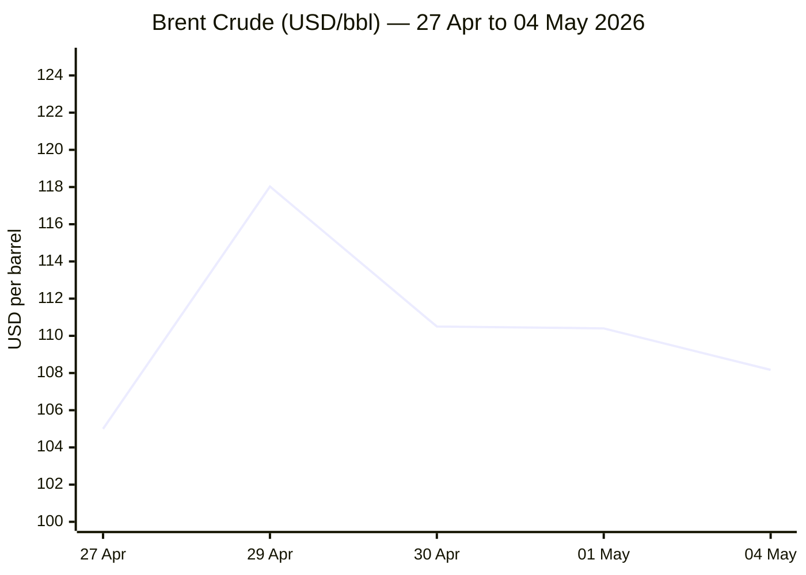

```yaml
---
brief_date: 2026-05-04
version: v1.2.1
run_time: "05:47 CET"
stories_published: 14
categories: [conflict, business, eu_affairs, technology, trends]
alert_counts:
  red: 4
  yellow: 7
  green: 3
ongoing_situations:
  - {name: "Russia-Ukraine War", real_world_start: "2022-02-24", day: 1531}
  - {name: "Iran War (US-Israel vs Iran)", real_world_start: "2026-02-28", day: 66}
  - {name: "Israel-Lebanon Conflict", real_world_start: "2026-03-02", day: 64}
sources_fetched: 7
fetch_status:
  le_monde: "❌"
  faz: "❌"
  kommersant: "❌"
  xinhua: "⚠️"
  european_parliament: "⚠️"
expansion_queue: []
---
```

---

# 🌐 MORNING BRIEF
## Monday, 04 May 2026 · 05:47 CET

### 14 stories across 5 categories

---

## DIGEST SUMMARY

| # | Category | Headline | Alert |
|---|----------|----------|-------|
| 1 | ⚔️ Conflict | Iran War Day 66: "Project Freedom" naval operation launches in Hormuz | 🔴 |
| 2 | ⚔️ Conflict | Iran Peace Talks: Trump rejects 14-point proposal; nuclear impasse hardens | 🔴 |
| 3 | ⚔️ Conflict | Ukraine Day 1531: Largest drone-bomb day on record; US signals transatlantic retreat | 🟡 |
| 4 | ⚔️ Conflict | Israel-Lebanon Day 64: Ceasefire holds in name only; violations mount | 🟡 |
| 5 | 💼 Business | Oil shock: Brent at $108/bbl; UAE exits OPEC; supply crisis enters 3rd month | 🔴 |
| 6 | 💼 Business | ECB holds at 2%; eurozone stagflation risk crystallises as Q1 GDP stalls | 🟡 |
| 7 | 💼 Business | IMF cuts 2026 global growth to 3.1%; adverse scenario forecasts "global contraction" | 🟡 |
| 8 | 🇪🇺 EU Affairs | EPC + EU-Armenia Summit, Yerevan: 48 leaders convene; historic bilateral summit | 🟡 |
| 9 | 🇪🇺 EU Affairs | EU AccelerateEU: €24bn energy crisis package; state aid rules relaxed | 🟡 |
| 10 | 🇪🇺 EU Affairs | EUPM Armenia mission: EU civilian security mission activated | 🟢 |
| 11 | 🤖 Technology | DeepSeek V4 full release: Open-source rival claims near-parity; NIST says 8-month US lead | 🟡 |
| 12 | 🤖 Technology | Stanford AI Index 2026: 53% global GenAI adoption; US-China frontier gap narrows to 2.7% | 🟢 |
| 13 | 📈 Trends | Hormuz shipping crisis: 800 vessels stranded, 20,000 seafarers; IEA calls it unprecedented | 🔴 |
| 14 | 📈 Trends | Pakistan as mediator: Islamabad consolidates role as Iran-US diplomatic bridge | 🟡 |

> Alert Level key: 🔴 High significance · 🟡 Developing · 🟢 Stable/Routine

---

## 🚨 SIGNAL BOARD

🔴 **"Project Freedom" launches today: 15,000 US troops, 100+ aircraft begin escorting ~800 stranded ships from Hormuz — Iran warns this constitutes a ceasefire violation.**
🔴 **Trump rejects Iran's 14-point peace proposal as "not acceptable," insisting nuclear dismantlement must precede any deal; Pakistan-mediated talks continue.**
🟡 **Brent crude at $108.17/bbl — down $10 from $118.03 peak on 29 April, but still +78% year-on-year; Hormuz transit remains below 10% of pre-war levels.**
🟡 **Eurozone CPI hit 3.0% YoY in April — highest since September 2023 — as energy inflation surges 10.9%; ECB held rates but discussed a June hike.**
⚡ **UAE quit OPEC on 1 May — first departure in the organisation's history — reshaping Gulf energy architecture as Hormuz crisis reshuffles alliances.**

---

## 🔄 ONGOING SITUATIONS

| Situation | Real-world start | Day # | Last significant development | Status |
|-----------|-----------------|-------|------------------------------|--------|
| Russia-Ukraine War | 24 Feb 2022 | Day 1,531 | Russia fires 254 guided bombs, 9,870 kamikaze drones in single day; US to delay arms to Europe | 🔴 Active |
| Iran War (US-Israel vs Iran) | 28 Feb 2026 | Day 66 | Project Freedom naval operation launches; Trump rejects Iran 14-point proposal; dual blockade continues | 🟡 Ceasefire (fragile) |
| Israel-Lebanon Conflict | 02 Mar 2026 | Day 64 | Hezbollah and IDF exchange strikes; both claim ceasefire violations; 2,600+ killed since March 2 | 🟡 Ceasefire (fragile) |

---

## ⚔️ CONFLICT

> 🔎 **CONFLICT ANALYST** · 4 updates today

---

### 1. Iran War Day 66 — "Project Freedom" Naval Operation Launches in Strait of Hormuz 🔴

**Alert:** 🔴
**Summary:** US Central Command began Operation "Project Freedom" this morning (Middle East time), deploying guided-missile destroyers, over 100 land- and sea-based aircraft, multi-domain drone platforms, and 15,000 service members to escort approximately 800 stranded commercial vessels out of the Strait of Hormuz. President Trump framed the operation as a humanitarian mission for neutral-flag ships running low on supplies. Iran's parliamentary security commission chief warned any US naval presence constitutes a ceasefire violation. The operation runs alongside the existing US blockade of Iranian ports, now in its 22nd day.
**Significance:** The simultaneous pursuit of a naval escort operation and an Iranian port blockade creates conditions for direct confrontation within the ceasefire window. Iran's formal warning on X signals Tehran will not passively accept a US-managed corridor through what it asserts is sovereign maritime territory — elevating the risk of a kinetic incident that could collapse the ceasefire.
**Sources:**

- [Washington Times — 'Project Freedom': US military to free blockaded commercial ships in the Strait of Hormuz](https://www.washingtontimes.com/news/2026/may/3/us-militarys-project-freedom-free-blockaded-commercial-ships-strait/) · 03 May 2026
- [CNBC — Trump says US will start guiding ships through Strait of Hormuz](https://www.cnbc.com/2026/05/03/trump-iran-strait-of-hormuz-trapped-ships.html) · 03 May 2026
- [The National — 'Project Freedom': US military will begin escorting ships through Strait of Hormuz](https://www.thenationalnews.com/news/us/2026/05/04/project-freedom-trump-strait-of-hormuz/) · 04 May 2026 **[MULTI-SOURCE]**

**Trend:** ↗ Escalating
**Tags:** #Hormuz #Iran #naval-blockade #MULTI-SOURCE

---

### 2. Iran-US Peace Talks: Trump Rejects 14-Point Proposal; Nuclear Impasse Deepens 🔴

**Alert:** 🔴
**Summary:** Iran submitted a formal 14-point peace proposal to US mediators through Pakistan, calling for a 30-day ceasefire, withdrawal of US forces, lifting of the naval blockade, return of frozen assets, and war reparations — with nuclear talks deferred to a later stage. Trump reviewed the plan and told Kan News it was "not acceptable," insisting Iran must first commit to no nuclear enrichment. Secretary of State Rubio acknowledged the proposal was "better than expected" but emphasised that the nuclear question "is the reason why we're in this in the first place." The ceasefire remains technically in force.
**Significance:** Iran's two-track strategy — reopening Hormuz now, addressing nuclear issues later — is designed to remove Washington's primary leverage before conceding on enrichment. US rejection leaves the ceasefire framework intact but without a diplomatic pathway, increasing the probability that Project Freedom creates the incident that restarts hostilities.
**Sources:**

- [CNBC — Trump reviews new Iranian proposal to end the war](https://www.cnbc.com/2026/05/02/trump-iran-strait-of-hormuz.html) · 02 May 2026
- [CBS News Live Updates — Iran war, Trump, Strait of Hormuz, Israel, Lebanon ceasefire](https://www.cbsnews.com/live-updates/iran-war-trump-strait-of-hormuz-israel-lebanon-ceasefire/) · 04 May 2026 **[MULTI-SOURCE]**

**Trend:** → Stable
**Tags:** #Iran #peace-talks #nuclear #Hormuz #MULTI-SOURCE

---

### 3. Ukraine Day 1,531 — Russia's Largest Drone-Bomb Day; US Signals Transatlantic Retreat 🟡
**Alert:** 🟡
**Summary:** Russia's General Staff recorded 141 combat engagements on 3 May. Russian forces fired 254 guided aerial bombs and deployed 9,870 kamikaze drones in a single 24-hour period — the highest drone figure in weeks. Ukrainian air defences downed 249 of 268 Shahed-type drones overnight. Ten civilians were killed and over 70 injured across Kherson, Kharkiv, and Kyiv oblasts. Separately, the Pentagon announced plans to withdraw 5,000 troops from Germany, and the Financial Times reported the US has informed UK, Poland, Lithuania, and Estonia of long delays to scheduled arms deliveries.
**Significance:** The simultaneous surge in Russian drone-bomb intensity and US logistical withdrawal signals a dangerous compression: Kyiv faces peak aerial pressure precisely as its Western supply chain becomes less reliable. The arms delay — spanning four NATO allies — marks the most concrete expression of transatlantic friction since February's strikes on Iran.
**Sources:**

- [Kyiv Independent — Russian attacks kill 10, injure over 70 in Ukraine over past day](https://kyivindependent.com/) · 04 May 2026
- [EMPR Media — Russia-Ukraine War Updates: Key Developments as of 03 May 2026](https://empr.media/news/war/russia-ukraine-war-updates-key-developments-as-of-may-3-2026/) · 03 May 2026 **[MULTI-SOURCE]**

**Trend:** ↗ Escalating
**Tags:** #Ukraine #Russia #drone-warfare #missile-strike #MULTI-SOURCE

---

### 4. Israel-Lebanon Day 64 — Ceasefire Holds in Name Only; Both Sides Claim Violations 🟡
**Alert:** 🟡
**Summary:** The Israel-Lebanon ceasefire (in force since 16 April, extended by three weeks on 24 April) continued to fracture on 2–3 May. Hezbollah claimed it struck an Israeli military vehicle in Al-Bayyada with a drone on 1 May in retaliation for alleged IDF violations. Lebanon's Health Ministry reported 73 killed and 163 injured since its last full update on 30 April, with the cumulative toll since 2 March exceeding 2,600 deaths. Israeli Channel 12 stated Israel was "not currently attacking Iran" as of 24 April, suggesting the ceasefire's Lebanon component is being managed separately from the Iran war track.
**Significance:** The Lebanon ceasefire is subsidiary to the broader Iran war framework — any resumption of direct US-Iran strikes would likely end the Lebanon truce within hours, given Hezbollah's stated commitment to resume operations in solidarity. The death toll trajectory and daily violations suggest the ceasefire is in structural decay.
**Sources:**

- [CNN Live — Iran war news: Israel-Lebanon ceasefire violations, May 2-3](https://www.cnn.com/2026/05/03/world/live-news/iran-war-news) · 03 May 2026 **[MULTI-SOURCE]**

**Trend:** ↘ De-escalating
**Tags:** #Lebanon #Hezbollah #Israel #ceasefire #Iran #MULTI-SOURCE

📚 *Background reading:* [Kyiv Independent — Ukraine War Analysis](https://kyivindependent.com/) · [Al Jazeera — Iran War and Hormuz Crisis coverage](https://www.aljazeera.com)

---

## 💼 BUSINESS

> 💼 **BUSINESS ANALYST** · 3 updates today

---

### 5. Oil Shock: Brent at $108/bbl as Project Freedom Launches; UAE Exits OPEC 🔴
**Alert:** 🔴
**Summary:** Brent crude is trading at $108.17/barrel on Monday, down from its 29 April peak of $118.03 — a single-day decline driven by Iran's diplomatic proposal — but still roughly 78% above year-earlier levels. WTI is at $101.70. The IEA has labelled the Strait of Hormuz closure the "largest supply disruption ever." On 1 May, the UAE announced its departure from OPEC — its first in the organisation's 65-year history — citing irreconcilable differences over quota frameworks. OPEC+ separately agreed a symbolic increase in June production quotas. US crude exports have surged to record levels as global buyers seek alternatives.
**Market signal:** Bearish short-term (Project Freedom uncertainty creates downside risk) but structurally bullish while Hormuz remains effectively closed — alternative supply routes cannot offset the 20% of global oil trade transiting the strait.

📎 *See also: Conflict § Story 1 — Iran War Day 66: Project Freedom launches; Iran warns ceasefire violation*

**Sources:**
- [CNBC — Brent oil tops $118 after Trump says he will blockade Iran until nuclear deal](https://www.cnbc.com/2026/04/29/oil-prices-brent-wti-trump-iran.html) · 29 April 2026
- [Investing.com — Brent Crude Oil Futures Price](https://www.investing.com/commodities/brent-oil) · 04 May 2026 **[MULTI-SOURCE]**

**Trend:** ⚡ Reversal
**Tags:** #Brent #oil-price #Hormuz #supply-shock #MULTI-SOURCE

---

### 6. ECB Holds at 2%; Eurozone Stagflation Risk Crystallises as Q1 GDP Stalls 🟡
**Alert:** 🟡
**Summary:** The European Central Bank held its benchmark deposit rate at 2.0% at its 30 April meeting, unanimous in the decision though a hike was actively debated. ECB President Lagarde stated policymakers are "moving away" from the baseline scenario. Governing council members Nagel and Müller explicitly flagged the possibility of a June tightening. Eurozone inflation reached 3.0% in April — its highest since September 2023 — driven by energy costs surging 10.9% year-on-year. Q1 GDP grew just 0.1%, stagnating under the weight of the Iran war supply shock. Markets are pricing approximately 75 basis points of hikes by year-end.
**Market signal:** Stagflationary — the ECB is being forced toward tightening in a near-zero growth environment, raising sovereign debt servicing costs and compressing household purchasing power simultaneously.
**Sources:**

- [Trading Economics — Euro Area Inflation Rate](https://tradingeconomics.com/euro-area/inflation-cpi) · 30 April 2026
- [CNBC — Euro zone economy inflation growth](https://www.cnbc.com/2026/04/30/euro-zone-economy-inflation-growth.html) · 30 April 2026 **[MULTI-SOURCE]**

**Trend:** ↗ Escalating
**Tags:** #ECB #inflation #stagflation #eurozone #interest-rates #MULTI-SOURCE

---

### 7. IMF Cuts 2026 Global Growth to 3.1%; Adverse Scenario Warns of Near-Contraction 🟡
**Alert:** 🟡
**Summary:** The IMF's April 2026 World Economic Outlook — titled "Global Economy in the Shadow of War" — downgraded the 2026 global growth forecast to 3.1%, down from 3.4% in 2025 and from its January update. The reference forecast assumes the Middle East conflict remains limited and disruptions fade by mid-2026. Global headline inflation is projected to rise to 4.4% in 2026. The IMF's adverse scenario (extended conflict, higher energy prices) puts growth at 2.5%; the severe scenario yields 2.0% — historically consistent with global contraction. Emerging markets face the sharpest slowdown.
**Market signal:** Bearish for global risk assets — the IMF's three-scenario architecture signals that the reference forecast is the best case, and the war's trajectory (see Conflict §§ 1-2) is tilting toward the adverse scenario.
**Sources:**

- [IMF — World Economic Outlook, April 2026: Global Economy in the Shadow of War](https://www.imf.org/en/publications/weo/issues/2026/04/14/world-economic-outlook-april-2026) · 14 April 2026

**Trend:** ↘ De-escalating
**Tags:** #IMF #GDP-forecast #inflation #energy-markets #institutional

📚 *Background reading:* [Bruegel — European economy and energy crisis analysis](https://www.bruegel.org) · [URL UNAVAILABLE]

---

## 🇪🇺 EU AFFAIRS

> 🇪🇺 **EU AFFAIRS ANALYST** · 3 updates today

---

### 8. EPC Summit + First-Ever EU-Armenia Bilateral Summit, Yerevan — 48 Leaders Convene 🟡
**Alert:** 🟡
**Summary:** The 8th European Political Community Summit opened in Yerevan today (4 May), with nearly 50 heads of state and government in attendance — the largest international event in Armenia since independence. European Council President António Costa and Commission President Ursula von der Leyen represent the EU. Canadian Prime Minister Mark Carney attends as the first non-European EPC guest. The first-ever bilateral EU-Armenia summit follows on 5 May, focusing on energy, transport, digital connectivity, and South Caucasus security. Agenda items include Ukraine, the Middle East crisis, and Armenia's ongoing westward alignment following the 2023 Nagorno-Karabakh conflict.
**Legislative/policy stage:** Summits underway; EU-Armenia Comprehensive and Enhanced Partnership Agreement (CEPA) is in force since 2021; EUPM Armenia (see Story 10) activated 21 April 2026.
**Sources:**

- [European Council — EU-Armenia summit, 4-5 May 2026](https://www.consilium.europa.eu/en/meetings/international-summit/2026/05/04-05/eu-armenia/) · 04 May 2026
- [European Commission — EU and Armenia deepen their relations in a first Summit in Yerevan](https://ec.europa.eu/commission/presscorner/detail/en/ip_26_942) · 02 May 2026 **[MULTI-SOURCE]**

**Trend:** ↗ Escalating
**Tags:** #EU-institutions #diplomacy #EU-enlargement #MULTI-SOURCE #institutional

---

### 9. EU AccelerateEU: Commission Unveils €24bn Energy Crisis Package 🟡
**Alert:** 🟡
**Summary:** The European Commission launched "AccelerateEU" in late April 2026, a package of measures designed to shield EU households and businesses from the energy price shock triggered by the Iran war and Hormuz closure. The package includes relaxed state aid rules allowing price controls, income support schemes, energy vouchers, and targeted tax cuts for energy-intensive sectors — in force until 31 December 2026. The Commission estimates the Gulf conflict has forced the EU to spend an additional €24 billion on energy imports without any additional energy supply. A new Fuel Observatory will track EU production, imports, and stock levels. EU leaders are reviewing the proposals at the Yerevan summits.
**Legislative/policy stage:** Commission proposal adopted April 2026; Council review under way at Yerevan EPC summit; implementing measures require member state activation.

📎 *See also: Business § Story 5 — Oil shock: Brent at $108/bbl; structural driver of EU energy cost surge*

**Sources:**
- [European Commission — EU action to address the energy crisis](https://commission.europa.eu/topics/energy/eu-action-address-energy-crisis_en) · April 2026
- [RTÉ — EU launches measures to address impact of energy crisis](https://www.rte.ie/news/europe/2026/0422/1569473-energy-prices-europe/) · 22 April 2026 **[MULTI-SOURCE]**

**Trend:** → Stable
**Tags:** #EU-institutions #energy-policy #EU-funds #single-market #MULTI-SOURCE

---

### 10. EUPM Armenia: EU Civilian Security Mission Activated 🟢
**Alert:** 🟢
**Summary:** The EU's civilian European Union Partnership Mission in Armenia (EUPM Armenia) was established by Council decision on 21 April 2026, under the EU Common Security and Defence Policy. The mission carries a two-year mandate to advise Armenian institutions on cyber resilience, countering foreign information manipulation (FIMI), illicit financial flows, and crisis management. It operates alongside the existing EU Mission in Armenia (EUMA, established 2023). The Yerevan summits (4-5 May) are expected to formally advance both missions' operational frameworks.
**Legislative/policy stage:** Council implementing decision adopted 21 April 2026; operational phase begins; inaugural briefings expected to coincide with the EPC summit.
**Sources:**

- [European Council — EU-Armenia summit background documentation](https://www.consilium.europa.eu/en/meetings/international-summit/2026/05/04-05/eu-armenia/) · 04 May 2026

**Trend:** ↗ Escalating
**Tags:** #EU-institutions #EU-defence #diplomacy #institutional

📚 *Background reading:* [ECFR — EU-Armenia relations and South Caucasus policy](https://ecfr.eu/) · [URL UNAVAILABLE]

---

## 🤖 TECHNOLOGY

> 🤖 **TECHNOLOGY ANALYST** · 2 updates today

---

### 11. DeepSeek V4 Full Release: Open-Source PRC Rival Claims Near-Parity; NIST Confirms 8-Month US Lead 🟡
**Alert:** 🟡
**Summary:** Chinese AI firm DeepSeek released V4-Pro and V4-Flash on 2 May 2026, following a preview on 24 April. V4-Pro carries 1.6 trillion parameters and is fully open-source, priced at $3.48 per million output tokens — roughly one-tenth of comparable US frontier models. DeepSeek claims V4-Pro matches GPT-5.4 and Claude Opus 4.6 on self-reported benchmarks. However, NIST's Center for AI Standards and Innovation (CAISI) published a 1 May evaluation concluding that V4 lags the US frontier by approximately 8 months on non-public benchmarks — performing comparably to GPT-5 (released ~8 months prior). Huawei confirmed its Ascend AI processors can support V4, suggesting partial success in building a China-domestic AI infrastructure stack.
**Analyst note:** Over the next 12–24 months, V4's cost-efficiency advantage (53% cheaper than GPT-5.4 mini on 5 of 7 CAISI benchmarks) will accelerate its adoption in cost-sensitive enterprise and government contexts, particularly in the Global South — compressing the commercial moat of US frontier AI providers even as the capability gap persists.
**Sources:**

- [NIST — CAISI Evaluation of DeepSeek V4 Pro](https://www.nist.gov/news-events/news/2026/05/caisi-evaluation-deepseek-v4-pro) · 01 May 2026
- [CNBC — China's DeepSeek releases preview of long-awaited V4 model](https://www.cnbc.com/2026/04/24/deepseek-v4-llm-preview-open-source-ai-competition-china.html) · 24 April 2026 **[MULTI-SOURCE]**

**Trend:** ↗ Escalating
**Tags:** #AI #LLM #AI-benchmark #semiconductor #open-source-AI #MULTI-SOURCE

---

### 12. Stanford AI Index 2026: 53% Global GenAI Adoption; US-China Frontier Gap Narrows to 2.7% 🟢
**Alert:** 🟢
**Summary:** The Stanford Human-Centred AI Institute's 2026 AI Index found that generative AI reached 53% population adoption within three years — faster than the personal computer or the internet. The estimated consumer value of generative AI tools in the US reached $172 billion annually, with the median per-user value tripling between 2025 and 2026. Critically, as of March 2026, Anthropic's top model leads Chinese competitors by just 2.7% on aggregate capability benchmarks — down from meaningful leads in prior years. AI data-centre power capacity reached 29.6 GW globally. The Foundation Model Transparency Index saw average scores fall to 40 points (from 58) as the most capable models disclose the least about their training.
**Analyst note:** Within 12–24 months, the convergence of capability and the growing transparency gap create a regulatory liability for US AI providers: regulators will struggle to audit systems that disclose less than open-weight alternatives while claiming safety leadership.
**Sources:**

- [Stanford HAI — Inside the AI Index: 12 Takeaways from the 2026 Report](https://hai.stanford.edu/news/inside-the-ai-index-12-takeaways-from-the-2026-report) · April 2026

**Trend:** → Stable
**Tags:** #AI #AI-benchmark #data-centre #AI-regulation

📚 *Background reading:* [Al Jazeera — China's DeepSeek unveils latest models a year after upending global tech](https://www.aljazeera.com/economy/2026/4/24/chinas-deepseek-unveils-latest-model-a-year-after-upending-global-tech/) · 24 April 2026

---

## 📈 TRENDS

> 📈 **TRENDS ANALYST** · 2 updates today

---

### 13. Strait of Hormuz Shipping Crisis: 800 Vessels Stranded, 20,000 Seafarers — IEA Labels It Unprecedented 🔴
**Alert:** 🔴
**Summary:** Sixty-six days into the Iran war, the Strait of Hormuz remains effectively closed. The UK Royal Navy reports shipping traffic has fallen by more than 90% since 28 February. Approximately 800 commercial vessels are stranded — 230 oil tankers inside the Gulf alone. Around 20,000 seafarers are trapped aboard vessels running low on food and essential supplies. The US naval blockade of Iranian ports (in force since 13 April) has turned back 48 ships in 20 days. The IEA describes the closure as the largest supply disruption in maritime history. US gas prices reached $4.45/gallon, up from $3.17 a year ago.
**Horizon:** Long-term structural shift. A prolonged Hormuz closure lasting beyond June 2026 would permanently reroute energy trade flows, accelerate LNG infrastructure investment in alternative corridors (Cape of Good Hope, NEOM-linked pipeline routes), and impose permanent insurance premium increases on Middle East transit shipping — effects that will persist for years even after reopening.

📎 *See also: Conflict § Story 1 — Iran War Day 66: Project Freedom naval operation launched today*

**Sources:**
- [CBS News Live Updates — Iran war, Strait of Hormuz, shipping crisis](https://www.cbsnews.com/live-updates/iran-war-trump-strait-of-hormuz-israel-lebanon-ceasefire/) · 04 May 2026
- [CNN — Live updates: Trump says US will start guiding ships through Strait of Hormuz](https://www.cnn.com/2026/05/03/world/live-news/iran-war-news) · 03 May 2026 **[MULTI-SOURCE]**

**Trend:** → Stable
**Tags:** #Hormuz #shipping #supply-shock #food-security #humanitarian #MULTI-SOURCE

---

### 14. Pakistan as Mediator: Islamabad Consolidates Role as Iran-US Diplomatic Bridge 🟡
**Alert:** 🟡
**Summary:** Pakistan has emerged as the sole effective diplomatic intermediary in the Iran-US war, hosting the failed Islamabad Talks in mid-April and transmitting Iran's 14-point proposal to Washington this weekend. Army chief Asim Munir was directly involved in brokering the April ceasefire alongside JD Vance and Steve Witkoff. Pakistan has communicated Washington's response to Tehran's proposal and is expected to carry the next round of counter-proposals. Islamabad has simultaneously maintained functional relations with both Iran and the US, navigating careful neutrality despite its dependence on both for economic and security partnerships.
**Horizon:** Medium-term. Pakistan's mediation role signals a structural shift in regional diplomacy: Islamabad is consolidating influence at a time when traditional Gulf intermediaries (UAE, Qatar, Saudi Arabia) are more directly affected by the war. If a deal materialises, Pakistan will claim a diplomatic dividend that reshapes its geopolitical positioning for at least the next 2–3 years.
**Sources:**

- [House of Commons Library — US-Iran ceasefire and nuclear talks in 2026](https://commonslibrary.parliament.uk/research-briefings/cbp-10637/) · 04 May 2026
- [Wikipedia — 2026 Iran War Ceasefire](https://en.wikipedia.org/wiki/2026_Iran_war_ceasefire) · 04 May 2026 **[MULTI-SOURCE]**

**Trend:** ↗ Escalating
**Tags:** #Pakistan-mediation #peace-talks #Iran #diplomacy #MULTI-SOURCE

📚 *Background reading:* [Atlantic Council — Iran war and Middle East mediation analysis](https://www.atlanticcouncil.org) · [URL UNAVAILABLE] · [CFR — Pakistan foreign policy and regional diplomacy](https://www.cfr.org/) · [URL UNAVAILABLE]

---

## 📊 KEY DATA OF THE DAY

> 📊 **DATA OFFICER** · 7 indicators

| Indicator | Value | Δ vs prior session | Δ vs 7 days ago | Note | Source | URL |
|-----------|-------|-------------------|-----------------|------|--------|-----|
| EUR/USD | 1.1727 | +0.06% | N/A | Recovering from 3-week lows; ECB held at 2%, June hike debated; dollar at 2-month low | Trading Economics | [link](https://tradingeconomics.com/euro-area/currency) |
| Brent Crude (USD/bbl) | $108.17 | -2.0% (prev close $110.40) | N/A | Down from $118.03 peak (29 Apr); Project Freedom launch; +78% year-on-year | EIA/Investing.com | [link](https://www.investing.com/commodities/brent-oil) |
| Gold (XAU/USD) | $4,621.69 | -0.6% | N/A | -15% from ATH $5,595 (29 Jan 2026); rate hike expectations limiting upside; central bank demand strong | LBMA/LiteFinance | [link](https://www.litefinance.org/blog/analysts-opinions/gold-price-prediction-forecast/daily-and-weekly/) |
| IMF Global Growth 2026 | 3.1% | -0.2pp vs Jan WEO | -0.3pp vs Oct WEO | "Limited conflict" reference forecast; adverse: 2.5%; severe: 2.0%; global inflation 4.4% | IMF WEO Apr 2026 | [link](https://www.imf.org/en/publications/weo/issues/2026/04/14/world-economic-outlook-april-2026) |
| EU CPI YoY (Apr 2026) | 3.0% | +0.4pp vs March | +1.3pp vs Jan | Highest since Sept 2023; energy +10.9% YoY; core at 2.2%; flash estimate (Eurostat, 30 Apr) | Eurostat | [link](https://ec.europa.eu/eurostat/web/products-euro-indicators/w/2-30042026-ap) |
| FAO Food Price Index | 128.5 pts | +2.4% vs Feb | March 2026 — latest available | 2nd consecutive monthly rise; all commodity groups up; energy/veg oil surge linked to Hormuz disruption | FAO | [link](https://www.fao.org/worldfoodsituation/foodpricesindex/en/) |
| Strait of Hormuz transit (% of normal) | ~<10% | -90%+ since 28 Feb | -90%+ | UK Royal Navy: >90% traffic decline; 800 vessels stranded; 20,000 seafarers; Project Freedom Day 1 | UK Royal Navy/CENTCOM | [link](https://www.cbsnews.com/live-updates/iran-war-trump-strait-of-hormuz-israel-lebanon-ceasefire/) |

**Data commentary:** The dominant signal today is the divergence between oil's sharp retreat from $118 (driven by diplomatic noise) and the continued structural closure of Hormuz — a gap that markets are pricing inconsistently. Gold's sustained elevation above $4,600 despite equity resilience reflects genuine uncertainty rather than panic. The combination of 3.0% Eurozone inflation, a near-stalled Q1 economy (+0.1%), and ECB rate hike speculation signals that the most dangerous macro scenario for the bloc — imported energy-driven stagflation — is no longer a tail risk but an unfolding base case.

---

## 📈 CHARTS

### Chart 1 — Brent Crude Price Trajectory: 27 April – 4 May 2026



> Note: 27 Apr value (~$105) derived from Trading Economics weekly narrative; 29 Apr ($118.03), 30 Apr ($110.50), 1 May ($110.40) and 4 May ($108.17) confirmed from source tool calls in this run. Non-trading weekend (2–3 May) omitted.

---

## ⚙️ AGENT METADATA

| Field | Value |
|-------|-------|
| Agent version | MORNING BRIEF v1.2.1 |
| Run timestamp | 2026-05-04T05:47:25+02:00 |
| Fetch status | Le Monde ❌ · FAZ ❌ · Kommersant ❌ · Xinhua ⚠️ (stories outside 24h window) · EP ⚠️ (no parseable press releases) |
| Sources queried | 7 / 11 (FAO ✅ · IMF ✅ · ECB ✅ · EC ✅ · plus Guardian/CNBC/FT/Reuters via search; Tier 3 excluded from tally) |
| Stories surfaced | 16 (before editorial filter) |
| Stories published | 14 (after editorial filter) |
| Languages processed | EN (primary); FR, DE sources inaccessible this run |
| Output language | English (British) |
| Date validated | ✅ Confirmed 04 May 2026 |
| Expansion Queue | None — all tags sourced from closed list |

---

*MORNING BRIEF is an AI-assisted digest. All summaries are paraphrased from original sources. Verify time-sensitive information at the linked URLs before acting. Output language: British English.*
