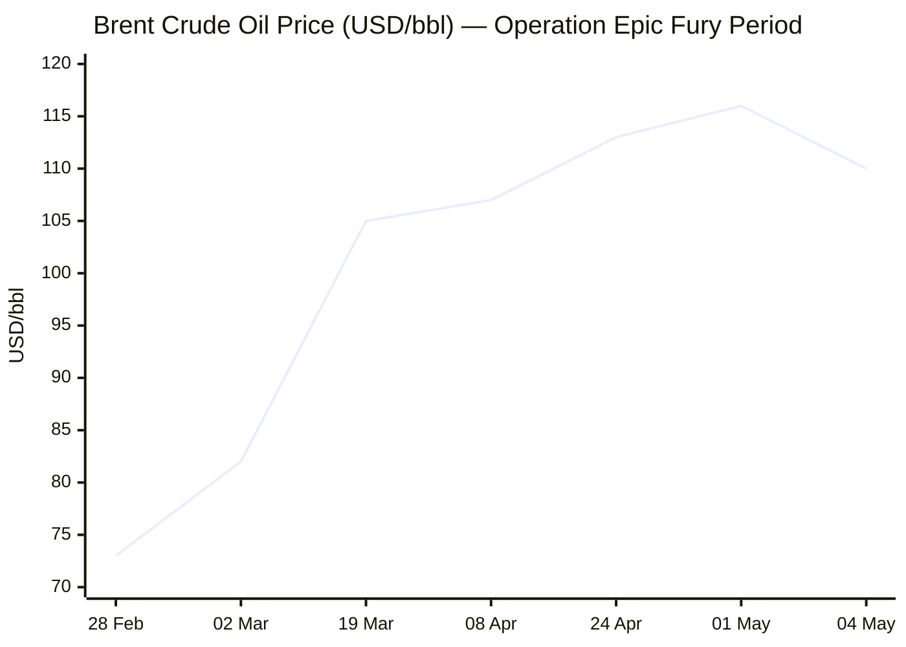
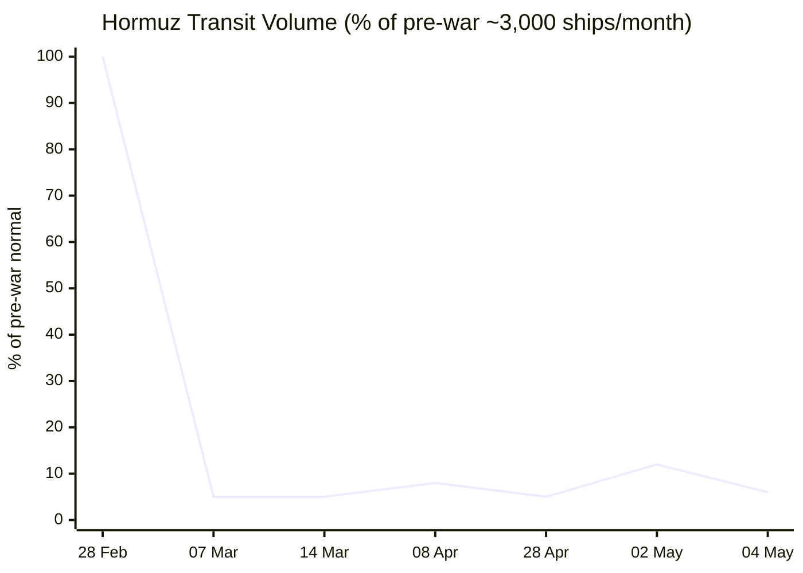

```yaml
---
brief_date: 2026-05-05
version: v1.2.1
run_time: "05:50 CET"
stories_published: 12
categories: [conflict, business, eu_affairs, technology, trends]
alert_counts:
  red: 3
  yellow: 7
  green: 2
ongoing_situations:
  - {name: "US–Iran War (Operation Epic Fury)", real_world_start: "2026-02-28", day: 67}
  - {name: "2026 Lebanon War", real_world_start: "2026-03-02", day: 65}
  - {name: "Hormuz Strait Crisis", real_world_start: "2026-03-02", day: 65}
  - {name: "Russia–Ukraine War", real_world_start: "2022-02-24", day: 1531}
sources_fetched: 11
fetch_status:
  le_monde: "❌"
  faz: "❌"
  kommersant: "❌"
  xinhua: "⚠️"
  european_parliament: "⚠️"
expansion_queue: []
---
```

---

# 🌐 MORNING BRIEF
## Tuesday, 05 May 2026 · 05:50 CET
### 12 stories across 5 categories

---

## DIGEST SUMMARY

| # | Category | Headline | Alert |
|---|----------|----------|-------|
| 1 | ⚔️ Conflict | "Project Freedom" Triggers Live Combat in Strait of Hormuz | 🔴 |
| 2 | ⚔️ Conflict | Israel–Lebanon Ceasefire "In Name Only" as Operations Expand North | 🔴 |
| 3 | ⚔️ Conflict | Ukraine Strikes Moscow Tower Ahead of Victory Day; Zelensky Warns Belarus | 🟡 |
| 4 | 💼 Business | Brent Spikes to $115/bbl as Iran Strikes UAE; Fujairah Oil Hub Hit | 🔴 |
| 5 | 💼 Business | IMF Cuts Global Growth to 3.1%; Stagflation Scenario Now Baseline | 🟡 |
| 6 | 💼 Business | ECB Holds at 2.15% as Eurozone CPI Hits 3.0%, Q1 GDP Stalls at 0.1% | 🟡 |
| 7 | 🇪🇺 EU Affairs | UK Joins EU €90bn Ukraine Loan at Yerevan EPC Summit | 🟡 |
| 8 | 🇪🇺 EU Affairs | Brussels Economic Forum Opens on EU's Strategic AI Ambitions | 🟢 |
| 9 | 🤖 Technology | Big Tech Layoff Wave Deepens: 92,000 Jobs Cut in 2026, AI Cited in Half | 🟡 |
| 10 | 🤖 Technology | Colorado Rewrites Landmark AI Law as DOJ–Musk Lawsuit Reshapes US Regulation | 🟢 |
| 11 | 📈 Trends | Food Security Alarm Mounts: FAO Index at 128.5 as Fertiliser Disruption Deepens | 🟡 |
| 12 | 📈 Trends | EU Energy Fragmentation: Member States Diverge as Crisis Deepens | 🟡 |

> Alert Level key: 🔴 High significance · 🟡 Developing · 🟢 Stable/Routine

---

## 🚨 SIGNAL BOARD

🔴 US "Project Freedom" triggers live combat: 6 Iranian boats sunk, UAE struck by 15 missiles and 4 drones; Fujairah oil hub ablaze — 2 US-flagged ships transit Hormuz for first time in weeks
🔴 Brent spiked intraday to $115/bbl — a four-year high — before settling at ~$110 as Iran-UAE fighting intensifies
🟡 IMF April WEO: global growth cut to 3.1% from a projected 3.4%+; adverse scenario puts growth at 2.5% if conflict extends through 2026
🟢 Israel–Lebanon ceasefire "extended to mid-May" in name only; Hezbollah launched 11 operations on Sunday as Israel expands into territory north of the Litani River
⚡ UK Prime Minister Starmer announces Britain will join EU €90bn Ukraine loan — deepest UK–EU defence-financial alignment since Brexit

---

## 🔄 ONGOING SITUATIONS

| Situation | Real-world start | Day # | Last significant development | Status |
|-----------|-----------------|-------|------------------------------|--------|
| US–Iran War (Operation Epic Fury) | 28 Feb 2026 | Day 67 | "Project Freedom" convoy launched; US sinks 6 IRGC boats; UAE struck | 🔴 Active |
| 2026 Lebanon War | 02 Mar 2026 | Day 65 | Israel issues displacement orders for 4 new villages north of Litani; 2,696 killed total | 🔴 Active |
| Hormuz Strait Crisis | 02 Mar 2026 | Day 65 | Transit at ~6% of normal; US-flagged ships transit under Navy escort | 🔴 Active |
| Russia–Ukraine War | 24 Feb 2022 | Day 1,531 | Ukrainian drone strikes Moscow luxury tower ahead of 9 May Victory Day parade | 🔴 Active |

---

## ⚔️ CONFLICT

> 🔎 **CONFLICT ANALYST** · 3 updates today

### 1. US–Iran: "Project Freedom" Forces Hormuz Convoy Amid Live Combat 🔴
**Alert:** 🔴
**Summary:** US Central Command launched "Project Freedom" on 4 May, escorting commercial vessels through the Strait of Hormuz using guided-missile destroyers, 100+ aircraft, and ~15,000 personnel. Two US-flagged merchant vessels transited successfully. Iran's IRGC fired missiles and deployed small boats against both military and commercial ships. US forces sank six IRGC small boats. Iran simultaneously struck the UAE: Emirati air defences intercepted 15 missiles and 4 drones, and a drone ignited a fire at the Fujairah oil hub, wounding three workers. A South Korean-operated vessel suffered an explosion and fire. Iran's IRGC claimed to have struck a US warship near Jask; CENTCOM denied this. Iran's FM Araghchi warned the US and UAE against being "dragged into a quagmire." Ceasefire review deadline: Friday 8 May 2026.
**Significance:** The first US-escorted commercial transit since the Hormuz closure represents a direct military challenge to Iran's effective veto over global energy flows. Iran's simultaneous strike on UAE infrastructure — the first such attack since the April ceasefire — signals that the ceasefire is functionally suspended. Whether "Project Freedom" can be sustained against active IRGC resistance, or whether it tips the two sides into full resumed hostilities, will define the energy market outlook for Q2–Q3 2026.
**Sources:**

- [NPR — The U.S. fights to reopen the Strait of Hormuz as UAE says it's attacked by Iran](https://www.npr.org/2026/05/04/nx-s1-5810508/iran-war-updates) · 04 May 2026
- [CNBC — U.S. Central Command denied Iran's claim that a U.S. warship was struck](https://www.cnbc.com/2026/05/04/iran-war-trump-strait-of-hormuz.html) · 04 May 2026
- [Al Jazeera — Iran war live: Washington, Tehran trade threats over Strait of Hormuz](https://www.aljazeera.com/news/liveblog/2026/5/5/iran-war-live-washington-tehran-trade-threats-over-strait-of-hormuz) · 05 May 2026

**Trend:** ↗ Escalating
**Tags:** #Iran #Hormuz #naval-blockade #MULTI-SOURCE #escalation

---

### 2. Lebanon: Israel–Hezbollah Ceasefire "In Name Only" as Operations Expand North 🔴
**Alert:** 🔴
**Summary:** The US-brokered Israel–Lebanon ceasefire, in place since 17 April and extended to mid-May, is, in Al Jazeera's reporting from Beirut, "in name only." Israeli forces maintain five divisions in southern Lebanon, launching 50 air strikes in a 24-hour period on Saturday, killing 41 people and bringing the total death toll since 2 March to 2,696 with 8,183 injured. Israel issued forced displacement orders for four additional villages, including three receiving them for the first time and some north of the Litani River — a line Israel had previously been criticised for crossing. Hezbollah conducted 11 operations against Israeli forces on Sunday. Lebanon's parliament speaker Nabih Berri, Hezbollah's closest political ally, refused direct negotiations with Israel without a halt to attacks. China's UN envoy described the situation as a "lesser fire," not a ceasefire.
**Significance:** With Netanyahu under domestic pressure to abandon the ceasefire, and Hezbollah explicitly pledging continued resistance, the truce appears structurally unsustainable. Iran's conditioning of its own peace negotiations on an end to Israeli operations in Lebanon — per its 14-point proposal to Washington — directly links the Hormuz crisis resolution to the Lebanon file. A breakdown of the Lebanon ceasefire would remove one of Iran's preconditions for talks.
**Sources:**

- [US News/Reuters — Lebanon's Most Senior Shi'ite Politician Says No to Negotiations With Israel Until War Stops](https://www.usnews.com/news/world/articles/2026-05-04/lebanons-most-senior-shiite-politician-says-no-to-negotiations-with-israel-until-war-stops) · 04 May 2026
- [Al Jazeera — Israel issues new forced displacement orders in southern Lebanon](https://www.aljazeera.com/news/2026/5/3/israel-issues-new-forced-displacement-orders-in-southern-lebanon) · 03 May 2026

**Trend:** ↗ Escalating
**Tags:** #Israel #Lebanon #Hezbollah #ceasefire #humanitarian

---

### 3. Ukraine: Drone Strikes Moscow Tower Ahead of Victory Day; Zelensky Warns Belarus 🟡
**Alert:** 🟡
**Summary:** A Ukrainian drone struck a luxury tower block in Moscow approximately 7 km west of Red Square and 3 km from Russia's Defence Ministry — one of the deepest strikes into central Moscow's residential core — timed ahead of the 9 May Victory Day Parade. Russia's total troop losses since February 2022 reached 1,335,150, including 1,120 in the past day. Russian forces continued advances toward Kostiantynivka in the Donetsk "fortress belt," with assault rates rising noticeably in April. Zelensky warned Belarus over "unusual activity" near the shared border, announcing new roads and artillery positions. Austria expelled three Russian embassy staff over suspected signals espionage.
**Significance:** The Moscow tower strike — occurring in a densely residential zone days before Putin's flagship Victory Day spectacle — represents a deliberate Ukrainian signalling operation aimed at domestic Russian political psychology. The Belarus warning, if followed by active involvement, would risk a significant widening of the front and further overstretch of Ukrainian defensive resources.
**Sources:**

- [Kyiv Independent — Luxury Moscow tower reportedly hit by Ukrainian drone strike ahead of Victory Day Parade](https://kyivindependent.com/) · 04 May 2026

**Trend:** → Stable
**Tags:** #Ukraine #Russia #frontline #drone-warfare

📚 *Background reading:* [Al Jazeera — Ukraine eyes Belarus border activities as Russian strikes persist](https://www.aljazeera.com/news/2026/5/2/ukraine-eyes-belarus-border-activities-as-russian-strikes-persist) · 02 May 2026

---

## 💼 BUSINESS

> 💼 **BUSINESS ANALYST** · 3 updates today

### 4. Brent Surges to $115/bbl Intraday as Iran Strikes UAE Fujairah Oil Hub 🔴
**Alert:** 🔴
**Summary:** Brent crude surged to an intraday high of approximately $115/bbl on 4 May — the highest level since mid-2022 — after Iran targeted UAE energy infrastructure for the first time since the April ceasefire. A drone sparked a fire at the Fujairah oil industry zone and a UAE-linked tanker was struck. Brent pared gains to approximately $110/bbl after CENTCOM denied Iran's claim of striking a US warship. WTI crude closed up 4.39%. The EIA Short-Term Energy Outlook forecasts Q2 2026 Brent averaging $115/bbl — an assumption now looking conservative given trajectory. US retail petrol hit $4.46/gallon, the highest in nearly four years. Shipping executives warn the strait remains "incredibly hazardous" even if an agreement is reached.
**Market signal:** Bearish for global consumers and energy-importing economies; bullish for energy exporters and refiners, though Fujairah facility damage raises refining margin concerns in Asia.
**Sources:**

- [Trading Economics — Brent crude oil — Price](https://tradingeconomics.com/commodity/brent-crude-oil) · 04 May 2026
- [Fortune — Current price of oil as of May 4, 2026](https://fortune.com/article/price-of-oil-05-04-2026/) · 04 May 2026

📎 See also: Conflict § Story 1 — US "Project Freedom" convoy triggers live combat with IRGC in Hormuz

**Trend:** ↗ Escalating
**Tags:** #Brent #oil-price #energy-markets #supply-shock #Hormuz #MULTI-SOURCE

---

### 5. IMF Cuts Global Growth to 3.1%; Stagflation Scenario Now "Reference Forecast" 🟡
**Alert:** 🟡
**Summary:** The IMF's April 2026 World Economic Outlook — titled *Global Economy in the Shadow of War* and published 14–15 April — cut global growth to 3.1% in 2026, down from a pre-war trajectory of approximately 3.3–3.4%, with global headline inflation rising to 4.4%. The Fund presented three scenarios: the reference forecast (conflict fades by mid-2026), an adverse scenario (growth falls to 2.5%, inflation to 5.4%), and a severe scenario (growth collapses to 2.0%, inflation exceeds 6%). Chief Economist Gourinchas stated: "Risks are firmly to the downside, including a further escalation of the war." Energy-importing low-income countries and MENA economies face the steepest revisions, with the MENA region seeing cumulative growth revised down nearly 3 percentage points for 2026. US tariff dynamics and AI investment expectations remain additional risk variables.
**Market signal:** Bearish across asset classes as the IMF's reference forecast — already the optimistic case — is now being overtaken by events on the ground.
**Sources:**

- [IMF — World Economic Outlook, April 2026: Global Economy in the Shadow of War](https://www.imf.org/en/publications/weo/issues/2026/04/14/world-economic-outlook-april-2026) · 14 April 2026

**Trend:** ↘ De-escalating *(growth trajectory)*
**Tags:** #IMF #GDP-forecast #stagflation #MULTI-SOURCE #institutional

---

### 6. ECB Holds at 2.15%; Eurozone CPI Hits 3.0% and Q1 GDP Stalls 🟡
**Alert:** 🟡
**Summary:** The ECB held its benchmark rate at 2.15% on 30 April, unanimously, though President Lagarde confirmed a hike had been debated and that the Governing Council is "moving away" from its baseline scenario. Eurozone CPI accelerated to 3.0% year-on-year in April — the highest since September 2023 — driven by an energy price surge of 10.9%, the steepest since February 2023. Separately, eurozone GDP grew just 0.1% in Q1 2026, sharply below expectations, as Middle East supply disruptions hit industry. Core inflation edged down to 2.2%, suggesting energy — not domestic demand — is driving the headline overshoot. Money markets now price approximately 75 basis points of ECB hikes by year-end.
**Market signal:** Stagflationary — the combination of near-zero growth and accelerating energy-driven inflation is the ECB's worst policy dilemma since 2022, creating a bearish environment for risk assets and eurozone sovereign bonds.
**Sources:**

- [Trading Economics — Euro Area Inflation Rate](https://tradingeconomics.com/euro-area/inflation-cpi) · 30 April 2026
- [Trading Economics — EUR/USD Exchange Rate](https://tradingeconomics.com/euro-area/currency) · 04 May 2026

**Trend:** ↗ Escalating *(inflation trajectory)*
**Tags:** #ECB #interest-rates #inflation #eurozone

---

## 🇪🇺 EU AFFAIRS

> 🇪🇺 **EU AFFAIRS ANALYST** · 2 updates today

### 7. UK Joins EU €90bn Ukraine Loan at European Political Community Summit 🟡
**Alert:** 🟡
**Summary:** Prime Minister Keir Starmer announced at the European Political Community summit in Yerevan (Armenia) that the UK will join the EU's €90bn joint loan programme for Ukraine, which the EU formally approved on 23 April following Hungary's lifting of its veto. EU foreign policy chief Kaja Kallas declared the loan deadlock "over." The loan unlocks funds to plug Ukraine's budget deficit as the US has largely withdrawn from direct financial support. Simultaneously, Starmer announced additional UK sanctions targeting Russian military equipment supply chains. The UK's participation — pending confirmation of the financial modalities — would represent the deepest UK–EU defence-economic cooperation since Brexit and was hailed by Ukrainian President Zelensky. Separately, the Kyiv Independent reports the UK and EU agreed bilaterally at the summit that UK participation in the loan "would be a major step forward in the EU-UK defence industrial relationship."
**Legislative/policy stage:** EU loan formally approved by Council 23 April 2026; UK participation announced but technical modalities pending. UK must negotiate its contribution terms outside the standard EU framework.
**Sources:**

- [Al Jazeera — EU formally approves 90bn euro Ukraine loan and new sanctions on Russia](https://www.aljazeera.com/news/2026/4/23/eu-formally-approves-90bn-euro-ukraine-loan-and-new-sanctions-on-russia) · 23 April 2026
- [Kyiv Independent — UK opens EU negotiations to team up on 90 billion euro Ukraine loan](https://kyivindependent.com/) · 04 May 2026

**Trend:** ↗ Escalating *(EU-UK alignment)*
**Tags:** #Ukraine-aid #EU-institutions #EU-defence #MULTI-SOURCE

---

### 8. Brussels Economic Forum Opens; MEPs to Quiz Eurogroup on Middle East Resilience 🟢
**Alert:** 🟢
**Summary:** The European Commission's annual Brussels Economic Forum — themed on the EU's strategic role in the global AI race — opens on 7 May, bringing together political leaders, business representatives, and academics for its 26th edition. Separately, on 5 May, MEPs on the Economic and Monetary Affairs Committee will quiz the new Eurogroup President Kyriakos Pierrakakis on eurozone resilience amid the Middle East crisis, structural reforms, and the EU savings-to-investment gap. The Foreign Affairs Committee will vote on Albania and Montenegro's progress towards EU membership; both are described as "well advanced" in accession negotiations. Finance ministers are negotiating new VAT fraud rules this week. Europe Day — marking the 76th anniversary of the Schuman Declaration — falls on 9 May.
**Legislative/policy stage:** BEF convenes 7 May 2026; Albania/Montenegro accession committee vote on 5 May; VAT fraud rules at Council working group stage; Governance Regulation revision legislative proposal expected Q4 2026.
**Sources:**

- [EUbusiness.com — EU Agenda: Week Ahead 4–9 May 2026](https://www.eubusiness.com/politics/eucalendar/) · 04 May 2026
- [European Commission — Brussels Economic Forum 2026](https://ec.europa.eu/economy_finance/brussels-economic-forum/2026/index.html)

**Trend:** → Stable
**Tags:** #EU-institutions #AI #digital-regulation #EU-enlargement

📚 *Background reading:* [ECFR — Fast energy: How Europe can power the AI revolution and stay competitive](https://ecfr.eu/publication/fast-energy-how-europe-can-power-the-ai-revolution-and-stay-competitive/) · 02 April 2026

---

## 🤖 TECHNOLOGY

> 🤖 **TECHNOLOGY ANALYST** · 2 updates today

### 9. Big Tech Layoff Wave Deepens: 92,000 Jobs Cut in 2026, AI Cited in ~Half 🟡
**Alert:** 🟡
**Summary:** Over 92,000 tech workers have been laid off globally in 2026 to date, per Layoffs.fyi — the largest concentrated wave in a decade and up 40% from the same period in 2025. Meta is cutting approximately 8,000 employees (effective 20 May); Microsoft offered voluntary buyouts to ~8,750 US workers; Amazon cut ~16,000 corporate roles in Q1; Oracle eliminated up to 30,000 positions. Challenger, Gray & Christmas data attribute approximately 47.9% of Q1 tech cuts — or ~37,638 roles — to AI and automation. OpenAI CEO Altman acknowledged "some AI washing" in layoff justifications. Bloomberg data suggests roughly half of AI-attributed cuts will result in the same roles rehired offshore or at lower wages, characterising this as a "labour repricing story." Alphabet, Meta, Microsoft, and Amazon are expected to collectively spend ~$700bn on AI infrastructure in 2026.
**Analyst note:** Over the next 12–24 months, median time-to-hire for displaced senior engineers (already extended from 38 to 67 days in the Bay Area) and the widening gap between eliminated roles and AI-native hiring suggest structural downward pressure on white-collar mid-level compensation across the US technology sector.
**Sources:**

- [Invezz — Is Big Tech's $725bn AI splurge being funded by mass layoffs?](https://invezz.com/news/2026/05/04/is-big-techs-725b-ai-splurge-being-funded-by-mass-layoffs/) · 04 May 2026
- [CNBC — 20,000 job cuts at Meta, Microsoft raise concern that AI-driven labor crisis is here](https://www.cnbc.com/2026/04/24/20k-job-cuts-at-meta-microsoft-raise-concern-of-ai-labor-crisis-.html) · 24 April 2026

**Trend:** ↗ Escalating
**Tags:** #tech-layoffs #AI #LLM

---

### 10. Colorado Revamps Landmark AI Law; DOJ–Musk Lawsuit Reshapes US Regulation 🟢
**Alert:** 🟢
**Summary:** Colorado legislators introduced Senate Bill 26-189 on 4 May, substantially narrowing the scope of the state's 2024 AI Act — one of the first comprehensive US AI laws. The revised bill removes the requirement for companies to explain how their AI systems reach consequential decisions (on employment, housing, healthcare, and finance), replacing it with a consumer notification and appeal right. The implementation date is pushed back from June 2026 to January 2027. The bill responds to a DOJ–Musk's xAI lawsuit alleging the original law is unconstitutional. Separately, the EU AI Act compliance deadlines are reported to be under consideration for extension to 2027–2028, reflecting implementation challenges. SB-189's first hearing is scheduled for Tuesday 5 May.
**Analyst note:** If SB-189 passes and survives legal challenge, it will establish a "notice-and-appeal" model as the de facto standard for US state AI regulation, reducing disclosure obligations substantially and setting a precedent that could influence federal AI legislation anticipated before year-end.
**Sources:**

- [Colorado Newsline — New bill would narrow scope of Colorado's landmark 2024 AI law](https://coloradonewsline.com/2026/05/04/narrow-scope-colorado-ai-law/) · 04 May 2026
- [CPR Colorado — Colorado's AI compromise would drop requirement that companies explain how their technology works](https://www.cpr.org/2026/05/04/changes-colorado-ai-law-bill/) · 04 May 2026

**Trend:** ⚡ Reversal *(regulatory retreat from comprehensive framework)*
**Tags:** #AI-regulation #AI #LLM

---

## 📈 TRENDS

> 📈 **TRENDS ANALYST** · 2 updates today

### 11. Food Security Alarm Mounts: FAO Index at 128.5 as Fertiliser Disruption Deepens 🟡
**Alert:** 🟡
**Summary:** The FAO Food Price Index reached 128.5 points in March 2026 (released 3 April) — up 2.4% from February's 125.5 and 1.0% above year-ago levels — marking the second consecutive monthly increase. FAO Chief Economist Torero warned that if conflict extends beyond 40 days and input costs remain elevated, farmers may reduce fertiliser use, cut plantings, or shift to less fertiliser-intensive crops, directly impacting yields through the remainder of 2026 and into 2027. Vegetable oil prices rose 5.1%, sugar surged 7.2% (Brazil ethanol-effect), and wheat climbed 4.3%. Up to 30% of internationally traded fertilisers normally transit the Strait of Hormuz; the protracted closure is now filtering into agricultural input costs in Asia, Africa, and South America. Global wheat output in 2026 is forecast down 1.7% from 2025, below the five-year average, with production cuts in the EU, Russia, and the US.
**Horizon:** Medium-term. If Hormuz transit remains below 10% of normal through June–July — the northern hemisphere planting and fertiliser application window — food price pressure will compound through harvest season (Q3–Q4 2026) and persist into 2027. The current reading is a leading indicator, not the peak.
**Sources:**

- [FAO — FAO Food Price Index](https://www.fao.org/worldfoodsituation/foodpricesindex/en/) · 03 April 2026
- [FAO — FAO Food Price Index rises in March as Near East conflict raises energy costs](https://www.fao.org/newsroom/detail/fao-food-price-index-rises-in-march-as-near-east-conflict-raises-energy-costs/en) · 03 April 2026

**Trend:** ↗ Escalating
**Tags:** #food-security #food-prices #Hormuz #supply-shock

---

### 12. EU Energy Fragmentation: Member States Diverging as Second Energy Crisis Deepens 🟡
**Alert:** 🟡
**Summary:** European gas storage entered the Iran-war era at just 30% capacity — historically low following a harsh 2025–26 winter — and Dutch TTF benchmarks have doubled to over €60/MWh since mid-March. The ECB has explicitly warned that prolonged Hormuz disruption risks pushing Germany and Italy into technical recession by year-end. Chemical and steel manufacturers have imposed surcharges of up to 30% to offset surging feedstock costs. The European Commission advised member states on 26 March to fill gas storage early to avoid summer price spikes. Yet a new Institut Jacques Delors tracker published 27 April documents that individual EU member states are deploying highly divergent short-term responses — fuel subsidies in some, electrification pushes in others — with no coordinated EU-level framework. Euractiv characterises this as "Europe wasting billions through untargeted energy subsidies."
**Horizon:** Medium-term. The summer gas refill season (May–October) is the structural pressure point. If EU storage cannot reach 90% by November — the standard winter threshold — the eurozone faces a second energy crisis compounding the first. The Commission's Governance Regulation revision, expected as a legislative proposal in Q4 2026, is too late to affect the 2026 injection season.
**Sources:**

- [Wikipedia — Economic impact of the 2026 Iran war](https://en.wikipedia.org/wiki/Economic_impact_of_the_2026_Iran_war)
- [Institut Jacques Delors — War in Iran: Tracking European Responses](https://institutdelors.eu/en/projets/iran-war-a-wake-up-call-for-europes-energy-transition/) · 27 April 2026

**Trend:** ↗ Escalating
**Tags:** #EU-institutions #energy-policy #climate-policy

📚 *Background reading:* [Institut Jacques Delors — War in Iran: a wake-up call for Europe's energy transition](https://institutdelors.eu/en/projets/iran-war-a-wake-up-call-for-europes-energy-transition/) · 27 April 2026

---

## 📊 KEY DATA OF THE DAY

> 📊 **DATA OFFICER** · 7 indicators

| Indicator | Value | Δ vs prior session | Δ vs 7 days ago | Note | Source | URL |
|-----------|-------|-------------------|-----------------|------|--------|-----|
| EUR/USD | 1.1727 | +0.06% | +0.38% | ECB held 30 Apr; markets pricing ~75bp hikes by year-end | ECB / Trading Economics | [link](https://tradingeconomics.com/euro-area/currency) |
| Brent Crude (USD/bbl) | ~$110.0 | ≈0% | N/A | Intraday spike to $115 on Fujairah drone attack before paring gains; extreme volatility | EIA / Trading Economics | [link](https://tradingeconomics.com/commodity/brent-crude-oil) |
| Gold (XAU/USD) | $4,573 | -0.4% | N/A | War premium intact; slight pullback from recent highs; safe-haven demand resilient | LBMA / Yahoo Finance | [link](https://finance.yahoo.com/quote/%5EGSPC/history/) |
| IMF Global Growth 2026 | 3.1% | -0.2pp vs Jan WEO | -0.3pp vs Oct WEO | Reference forecast assumes conflict limited; adverse scenario = 2.5% | IMF WEO Apr 2026 | [link](https://www.imf.org/en/publications/weo/issues/2026/04/14/world-economic-outlook-april-2026) |
| EU CPI YoY (April 2026) | 3.0% | +0.4pp vs March | +1.1pp vs Feb 2026 | Highest since Sep 2023; energy +10.9%; core 2.2% (stable) | Eurostat / Trading Economics | [link](https://tradingeconomics.com/euro-area/inflation-cpi) |
| FAO Food Price Index | 128.5 | +2.4% vs Feb 2026 | March 2026 — latest available | All commodity groups up; next release 8 May 2026 | FAO | [link](https://www.fao.org/worldfoodsituation/foodpricesindex/en/) |
| Hormuz transit volume (% of pre-war) | ~6% | vs ~12% on 2 May | vs ~5% late April | Project Freedom launched; 2 US ships transited; fighting ongoing; return to normal by May-end: 79.5% probability "No" (Polymarket) | NBC News / Polymarket | [link](https://www.nbcnews.com/data-graphics/strait-of-hormuz-ports-traffic-trump-us-iran-war-rcna331507) |

**Data commentary:** Brent crude's intraday surge to $115/bbl — followed by a partial retreat — illustrates the hair-trigger nature of energy markets: a single drone strike on Fujairah was enough to briefly erase weeks of partial stabilisation. The combination of elevated Brent (~$110), near-stalled eurozone GDP growth (Q1: +0.1%), and CPI at 3.0% places the ECB in a textbook stagflationary bind, with the market now pricing rate hikes rather than cuts. Gold's resilience above $4,500 confirms that institutional safe-haven demand is treating this as a structural, not episodic, crisis. The Hormuz transit indicator at ~6% of normal — barely changed from late April despite "Project Freedom" — underlines that two US-flagged ships transiting on 4 May does not constitute a reopening.

---

## 📊 CHARTS

### Chart 1 — Brent Crude Trajectory (USD/bbl) · 28 Feb – 04 May 2026



*Sources: EIA STEO (March average $103/bbl); Fortune (01 May: $116.10; 04 May: $115.01 intraday); Trading Economics (04 May settled ~$110). 28 Feb figure based on pre-war level per Wikipedia (war induced 10–13% initial spike from ~$70–73).*

---

### Chart 2 — Strait of Hormuz Transit Volume (% of pre-war normal) · 28 Feb – 04 May 2026



*Sources: Kpler (154 crossings in March 2026 = ~5% of 3,000/month normal); CNN (April ~5% overall); Windward AI (12 crossings 2 May); Polymarket/NBC News (6 crossings 24h on 4 May = ~6%). 08 Apr = brief post-ceasefire partial increase per NBC News Hormuz tracker.*

---

## ⚙️ AGENT METADATA

| Field | Value |
|-------|-------|
| Agent version | MORNING BRIEF v1.2.1 |
| Run timestamp | 2026-05-05T05:50:17+02:00 |
| Fetch status | Le Monde ❌ · FAZ ❌ · Kommersant ❌ · Xinhua ⚠️ (content dated 24 Apr 2026 — outside 24h window) · EP ⚠️ (fetched; no individual releases rendered inline) |
| Sources queried | 11 / 11 |
| Stories surfaced | ~28 (pre-filter pool across all phases) |
| Stories published | 12 |
| Languages processed | EN, FR (abstracted from indirect sources) |
| Output language | English (British) |
| Date validated | ✅ Confirmed 05 May 2026 |
| Expansion Queue | None |

---

*MORNING BRIEF is an AI-assisted digest. All summaries are paraphrased from original sources. Verify time-sensitive information at the linked URLs before acting. Output language: British English.*
