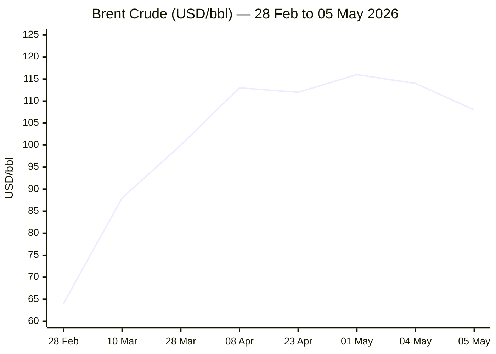
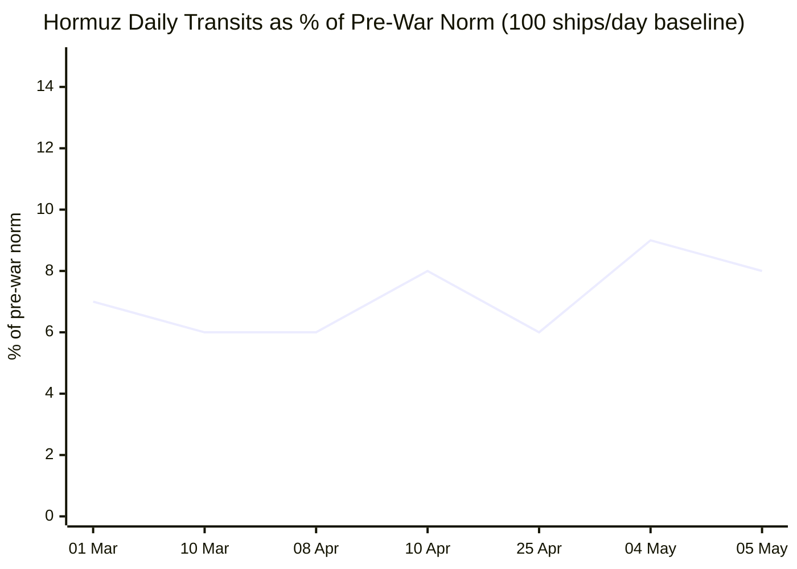

```yaml
---
brief_date: 2026-05-06
version: v1.2.1
run_time: "05:44 CET"
stories_published: 14
categories: [conflict, business, eu_affairs, technology, trends]
alert_counts:
  red: 4
  yellow: 8
  green: 2
ongoing_situations:
  - {name: "US–Iran War / Hormuz Blockade", real_world_start: "2026-02-28", day: 68}
  - {name: "Israel–Lebanon Ceasefire", real_world_start: "2026-04-08", day: 29}
  - {name: "Pakistan-led Iran Mediation", real_world_start: "2026-04-08", day: 29}
  - {name: "Hungary Government Formation", real_world_start: "2026-04-12", day: 25}
sources_fetched: 10
fetch_status:
  le_monde: "❌"
  faz: "❌"
  kommersant: "❌"
  xinhua: "⚠️"
  european_parliament: "⚠️"
expansion_queue: []
---
```

# 🌐 MORNING BRIEF
## Wednesday, 06 May 2026 · 05:44 CET
### 14 stories across 5 categories

---

## DIGEST SUMMARY

| # | Category | Headline | Alert |
|---|----------|----------|-------|
| 1 | ⚔️ Conflict | Trump pauses "Project Freedom" — Hormuz brinkmanship eases, blockade holds | 🔴 |
| 2 | ⚔️ Conflict | Iran drones strike UAE Fujairah oil terminal; frigate claims disputed | 🔴 |
| 3 | ⚔️ Conflict | Israel–Lebanon ceasefire extended three weeks; IRGC threatens new closure | 🟡 |
| 4 | ⚔️ Conflict | Iran FM in Beijing; Trump-Xi summit next week raises mediation stakes | 🟡 |
| 5 | 💼 Business | Brent falls 5.5% to $108 after Project Freedom pause; still above $100 | 🟡 |
| 6 | 💼 Business | S&P 500 and Nasdaq hit fresh records on tech-led rebound | 🟢 |
| 7 | 💼 Business | Eurozone CPI surges to 3.0%; Q1 GDP barely positive at 0.1% | 🔴 |
| 8 | 🇪🇺 EU Affairs | Hungary: Magyar government formation under way; EU funds talks advancing | 🟡 |
| 9 | 🇪🇺 EU Affairs | EP demands stronger DMA enforcement amid US political pressure | 🟡 |
| 10 | 🇪🇺 EU Affairs | Parliament sounds alarm on rule of law gaps across member states | 🟡 |
| 11 | 🤖 Technology | Anthropic launches 10 financial AI agents + Claude Opus 4.7; FactSet falls 8% | 🔴 |
| 12 | 🤖 Technology | Stanford AI Index 2026: China nearly erases US lead; data-centre power at 29.6 GW | 🟡 |
| 13 | 📈 Trends | Hormuz crisis batters Gulf foreign workers; supply chain rerouting becomes structural | 🟡 |
| 14 | 📈 Trends | AI workforce disruption moves from prediction to reality, hitting young workers first | 🟢 |

> Alert level key: 🔴 High significance · 🟡 Developing · 🟢 Stable/Routine

---

## 🚨 SIGNAL BOARD

🔴 **Trump pauses "Project Freedom" citing diplomatic progress — but Iran's Hormuz blockade remains fully in force on Day 68**
🔴 **EU CPI hits 3.0% in April (highest since September 2023), energy costs up 10.9%; ECB rate hike pricing for June intensifies**
🟡 **Brent crude down 5.5% to $108.09/bbl after ceasefire signals — but still 74% above year-ago levels**
🟢 **S&P 500 (7,259) and Nasdaq (25,326) both close at all-time highs on tech surge, looking through geopolitical risk**
⚡ **Anthropic debuts Claude Opus 4.7 + 10 financial AI agents; FactSet shares crater 8.1% on displacement fear**

---

## 🔄 ONGOING SITUATIONS

| Situation | Real-world start | Day # | Last significant development | Status |
|-----------|-----------------|-------|------------------------------|--------|
| US–Iran War / Hormuz Blockade | 28 Feb 2026 | Day 68 | Trump pauses "Project Freedom"; US-Iran fire exchanged 5 May; blockade holds | 🔴 Active |
| Israel–Lebanon Ceasefire | 08 Apr 2026 | Day 29 | 3-week extension agreed 23 Apr; IRGC threatened re-closure after fire exchange | 🟡 Extended |
| Pakistan-led Iran Mediation | 08 Apr 2026 | Day 29 | PM Sharif requests Project Freedom pause; Iran FM Araghchi in Beijing; Trump heads to China next week | 🟡 Active |
| Hungary Government Formation | 12 Apr 2026 | Day 25 | Magyar sworn in expected ~mid-May; EU funds talks begun; rule-of-law reforms pledged by end of May | 🟡 Transition |

---

## ⚔️ CONFLICT ANALYST · 4 updates today

> 🔎 **CONFLICT ANALYST** · 4 updates today

### 1. US–Iran / Strait of Hormuz — "Project Freedom" Paused 🔴
**Alert:** 🔴
**Summary:** President Trump on Tuesday evening announced the suspension of "Project Freedom" — the US naval effort to escort commercial vessels through the Strait of Hormuz — citing Pakistan's request, "tremendous military success," and "great progress" toward a final agreement with Iran, according to his Truth Social post. The pause followed a day in which US and Iranian forces exchanged fire in the strait: US Central Command confirmed it destroyed six Iranian small boats and intercepted cruise missiles and drones while escorting two US-flagged vessels. Secretary of State Rubio confirmed the broader military campaign, "Operation Epic Fury," has ended. Iran's blockade remains fully in force; Iran's FM called "Project Freedom" a "deadlock."
**Significance:** The pause preserves diplomatic space ahead of Trump's planned visit to China next week, where a meeting with President Xi is expected — Beijing has been working Iranian channels to facilitate a deal. Neither side appears to want full-scale resumption of hostilities, but Iran's hardline IRGC leadership has not agreed to reopen the strait or abandon the nuclear programme.
**Sources:**
- [NBC News — Trump pauses 'Project Freedom' in Strait of Hormuz, citing progress on an Iran deal](https://www.nbcnews.com/world/iran/us-iran-war-trump-open-hormuz-attacks-ships-ceasefire-rcna343604) · 05 May 2026
- [CNN — Live updates: Trump to pause US effort to guide ships through Strait of Hormuz while blockade remains](https://www.cnn.com/2026/05/05/world/live-news/iran-war-news) · 05 May 2026
- [Washington Post — Attacks in Strait of Hormuz, Gulf region imperil US-Iran ceasefire](https://www.washingtonpost.com/world/2026/05/04/us-ships-iran-hormuz-ceasefire/) · 05 May 2026
**Trend:** ⚡ Reversal
**Tags:** #Iran #Hormuz #ceasefire #Pakistan-mediation #MULTI-SOURCE #day-N #escalation

---

### 2. Iranian Strikes on UAE Fujairah; South Korean Vessel Damaged 🔴
**Alert:** 🔴
**Summary:** On Monday, Iranian drone and missile strikes caused a fire at the UAE's Fujairah Oil Industry Zone — the first confirmed major infrastructure hit in a Gulf state since the April ceasefire. The UAE's defence ministry reported intercepting multiple projectiles. A South Korean-operated cargo vessel was struck and damaged in the strait. Trump called on South Korea to join the escort mission. Iran's Revolutionary Guard also released a map designating areas of the strait under its military control, reinforcing the blockade posture. A purported threat from a fake IRGC account claiming carriers would be met with force was later disavowed by Iran's Fars agency, adding a disinformation layer to the crisis.
**Significance:** Infrastructure strikes against a non-combatant Gulf ally mark a qualitative escalation. They raise pressure on Saudi Arabia and the UAE to close ranks with the US, while simultaneously complicating quiet diplomatic outreach by Gulf states that have maintained back-channels with Tehran.
**Sources:**
- [CNN — Day 66 of Middle East conflict — Iranian attacks on UAE, Trump warns against targeting US ships](https://www.cnn.com/2026/05/04/world/live-news/iran-war-hormuz-trump) · 04 May 2026
- [Britannica — 2026 Iran war](https://www.britannica.com/event/2026-Iran-war) · 05 May 2026
**Trend:** ↗ Escalating
**Tags:** #Iran #Hormuz #missile-strike #drone-warfare #MULTI-SOURCE #day-N

---

### 3. Israel–Lebanon Ceasefire: Three-Week Extension Holds Under Pressure 🟡
**Alert:** 🟡
**Summary:** The Israel–Lebanon ceasefire, extended for three weeks on 23 April, remains nominally in place. The IRGC briefly threatened a new closure of the strait following what it described as an Israeli ceasefire violation in Lebanon, but did not follow through. Hezbollah has maintained strategic restraint despite the broader conflict continuing. Iran's FM Araghchi noted separately that the Lebanese front's stability hinges directly on progress in the Hormuz diplomatic process.
**Significance:** The Lebanon ceasefire functions as a pressure valve; any collapse would immediately widen the front and pull in additional actors, further complicating the Pakistan-mediated process.
**Sources:**
- [Wikipedia — 2026 Iran war](https://en.wikipedia.org/wiki/2026_Iran_war) · 06 May 2026
- [Britannica — 2026 Iran war](https://www.britannica.com/event/2026-Iran-war) · 05 May 2026
**Trend:** ↘ De-escalating
**Tags:** #Lebanon #Hezbollah #ceasefire #Iran #Israel #de-escalation

---

### 4. Iran FM in Beijing; Trump-Xi Summit Next Week Elevates Mediation Stakes 🟡
**Alert:** 🟡
**Summary:** Iranian FM Araghchi arrived in Beijing approximately a week before Trump's scheduled visit to China — a sequencing that analysts characterise as Iran seeking Chinese guarantees ahead of a potential deal. Trump has credited Beijing with helping bring Iran to the table. Secretary Rubio urged China to inform Iranian leadership that its actions are causing "global isolation." US gas prices stand at $4.48/gallon on average; Rubio has framed holding the line on the strait as inseparable from the nuclear non-proliferation objective.
**Significance:** A joint US-China push on Iran would represent the most consequential great-power cooperation on the conflict to date, potentially breaking the stalemate — but it requires Beijing to press a strategic partner in ways that carry domestic political costs.
**Sources:**
- [CNN — Live updates: Trump to pause US effort to guide ships](https://www.cnn.com/2026/05/05/world/live-news/iran-war-news) · 05 May 2026
- [NBC News — Trump pauses 'Project Freedom'](https://www.nbcnews.com/world/iran/us-iran-war-trump-open-hormuz-attacks-ships-ceasefire-rcna343604) · 05 May 2026
**Trend:** ↘ De-escalating
**Tags:** #Iran #diplomacy #peace-talks #Pakistan-mediation #MULTI-SOURCE

---

📚 *Background reading:* [IISS — The 2026 Iran War: Strategic Balance Sheet](https://www.iiss.org) · [CFR — The Strait of Hormuz and the Global Energy Order](https://www.cfr.org/)

---

## 💼 BUSINESS ANALYST · 3 updates today

> 💼 **BUSINESS ANALYST** · 3 updates today

### 5. Brent Crude Falls 5.5% to $108 After Project Freedom Pause 🟡
**Alert:** 🟡
**Summary:** Brent crude settled at $108.09/bbl on Tuesday — down 5.55% from Monday's close of $114.44 — after Trump announced the suspension of "Project Freedom" and diplomatic signals firmed. Oil had surged above $115 on Monday when Iranian strikes struck the UAE's Fujairah terminal and cruise missiles were fired at US warships. Despite Tuesday's retreat, Brent remains 74% above year-ago levels and well above the $62–65 pre-war baseline. Bypass pipeline capacity covers only approximately 35% of normal strait throughput, placing a structural floor under prices while the blockade persists.
**Market signal:** Bearish on the day but structurally bullish: until the blockade is verifiably lifted, any diplomatic setback will rapidly reverse Tuesday's pull-back.
**Sources:**
- [Trading Economics — Brent Crude Oil](https://tradingeconomics.com/commodity/brent-crude-oil) · 05 May 2026
- [Fortune — Current price of oil as of May 5, 2026](https://fortune.com/article/price-of-oil-05-05-2026/) · 05 May 2026
**Trend:** ⚡ Reversal
**Tags:** #Brent #oil-price #Hormuz #supply-shock #MULTI-SOURCE

📎 *See also: Conflict § Story 1 — Trump pauses Project Freedom; blockade remains in force*

---

### 6. S&P 500 and Nasdaq Close at All-Time Highs on Tech Surge 🟢
**Alert:** 🟢
**Summary:** The S&P 500 closed at 7,259.22 (+0.81%) and the Nasdaq at 25,326.13 (+1.01%) on Tuesday, both setting all-time records. Equity markets rebounded sharply after Monday's Iran-driven sell-off (S&P −0.41%, Dow −1.13%). The technology sector led with a 2% gain; Micron Technologies surged 5% on AI-driven high-bandwidth memory demand. Markets are pricing a 95.9% probability that the Federal Reserve holds rates unchanged in June, per CME FedWatch. The US earnings season remains broadly above expectations, with Goldman Sachs posting its best quarterly result in years.
**Market signal:** Neutral-to-bullish: equities are looking through geopolitical risk on the strength of earnings and AI-infrastructure spending — but this decoupling will be tested if Hormuz remains shut into Q3.
**Sources:**
- [Yahoo Finance — Stock market today: S&P 500, Nasdaq notch fresh records](https://finance.yahoo.com/markets/stocks/live/stock-market-today-tuesday-may-5-iran-uae-ships-233125850.html) · 05 May 2026
- [The Street — Stock Market Today (May 5, 2026)](https://www.thestreet.com/latest-news/stock-market-today-may-5-2026-dow-futures-rise-on-iran-war-developments) · 05 May 2026
**Trend:** ↗ Escalating
**Tags:** #SP500 #Nasdaq #equity-rally #AI #MULTI-SOURCE

---

### 7. Eurozone CPI Hits 3.0%; Q1 GDP Just 0.1% — Stagflation Risk Materialises 🔴
**Alert:** 🔴
**Summary:** Euro area annual inflation jumped to 3.0% in April 2026 — the highest since September 2023 — driven by energy costs surging 10.9%, the fastest in over three years. The flash estimate, from Eurostat on 30 April, exceeded the 2.9% market consensus. Core inflation (excluding food and energy) eased to 2.2% from 2.3%, offering limited comfort. Separately, Eurostat's Q1 GDP flash estimate shows the eurozone grew just 0.1%, barely avoiding contraction. Markets now price an 80% probability of an ECB rate hike in June, with at least two increases expected this year.
**Market signal:** Bearish for eurozone growth: stagflation dynamics are sharpening — the ECB faces near-impossible trade-offs between containing inflation and avoiding a growth collapse.
**Sources:**
- [Eurostat — Euro area annual inflation up to 3.0%](https://ec.europa.eu/eurostat/web/products-euro-indicators/w/2-30042026-ap) · 30 April 2026
- [CNBC — Euro zone inflation jumps to 3% as economic growth almost stalls](https://www.cnbc.com/2026/04/30/euro-zone-economy-inflation-growth.html) · 30 April 2026
- [Trading Economics — Euro Area Inflation Rate](https://tradingeconomics.com/euro-area/inflation-cpi) · 05 May 2026
**Trend:** ↗ Escalating
**Tags:** #inflation #stagflation #ECB #eurozone #energy-markets #GDP-forecast #MULTI-SOURCE

---

📚 *Background reading:* [Bruegel — The ECB's Impossible Triangle: Growth, Inflation and Hormuz](https://www.bruegel.org) · [IMF — World Economic Outlook April 2026](https://www.imf.org/en/publications/weo/issues/2026/04/14/world-economic-outlook-april-2026)

---

## 🇪🇺 EU AFFAIRS ANALYST · 3 updates today

> 🇪🇺 **EU AFFAIRS ANALYST** · 3 updates today

### 8. Hungary: Magyar Government Formation Under Way; EU Funds Talks Advancing 🟡
**Alert:** 🟡
**Summary:** Péter Magyar's Tisza party, which won a two-thirds parliamentary majority in Hungary's 12 April election — ending Viktor Orbán's 16-year rule — is expected to be sworn into government in mid-May. Magyar has identified unblocking frozen EU funds as his government's top priority and has begun talks with the European Commission. Rule-of-law reforms that could satisfy Brussels's conditions are pledged by end of May, paving the way for the release of up to €17 billion in frozen cohesion funds. The Hungarian veto over the EU's €90 billion Ukraine aid package is now expected to be lifted shortly after the new government takes office. Media restructuring — including suspension of state broadcast news — has begun.
**Legislative/policy stage:** Government formation under way; EU-Hungary rule-of-law reform negotiations in progress; frozen funds release contingent on reform milestones verified by the Commission.
**Sources:**
- [House of Commons Library — Hungary: Developments under Viktor Orbán and the 2026 parliamentary election](https://commonslibrary.parliament.uk/research-briefings/cbp-10612/) · 05 May 2026
- [Wikipedia — 2026 Hungarian parliamentary election](https://en.wikipedia.org/wiki/2026_Hungarian_parliamentary_election) · 06 May 2026
**Trend:** ↘ De-escalating
**Tags:** #Hungary #Magyar #EU-funds #rule-of-law #EU-institutions #EU-election #MULTI-SOURCE

---

### 9. European Parliament Demands Stronger DMA Enforcement; First Review Published 🟡
**Alert:** 🟡
**Summary:** The European Parliament on 30 April adopted a resolution calling on the Commission to enforce the Digital Markets Act quickly and consistently, making full use of its enforcement powers. MEPs criticised fines imposed on Meta and Apple as too modest, called for closer scrutiny of AI-driven search tools and cloud computing, and explicitly warned against political pressure from third countries weakening the law. The Commission published the first statutory DMA review on 28 April, declaring the Act "fit for purpose" but acknowledging "significant untapped potential." Cloud gatekeeper designations are due by November 2026; an investigation into whether AI constitutes a "core platform service" under the DMA remains open, with outcomes expected by May 2027.
**Legislative/policy stage:** Parliament resolution adopted (non-binding); Commission DMA Review published 28 April 2026; cloud designation proceedings under way; non-compliance proceedings against Meta and Apple ongoing.
**Sources:**
- [European Parliament — Digital Markets Act: MEPs want stronger enforcement amid external pushback](https://www.europarl.europa.eu/news/en/press-room/20260423IPR41844/) · 30 April 2026
- [TechPolicy.Press — What the EU's First Digital Markets Act Review Actually Changes](https://www.techpolicy.press/what-the-eus-first-digital-markets-act-review-actually-changes/) · 01 May 2026
**Trend:** ↗ Escalating
**Tags:** #digital-regulation #EU-institutions #AI-regulation #single-market #MULTI-SOURCE

---

### 10. Parliament Sounds Alarm on Rule of Law Gaps Across Member States 🟡
**Alert:** 🟡
**Summary:** The European Parliament voted on 29 April to adopt a resolution on the state of fundamental rights in the EU in 2024–2025, warning that persistent rule-of-law gaps weaken democratic safeguards. MEPs noted that Commission recommendations from prior years have not been adequately followed up by several member states. A separate resolution on 29 April approved the Commission's management of the 2024 EU budget but flagged that rule-of-law backsliding in certain member states is harming the effective use of EU funds. Both votes followed a plenary session that also adopted resolutions on human rights situations in Haiti, China, and Venezuela.
**Legislative/policy stage:** Parliament resolutions adopted (non-binding); next Commission Rule of Law Report due mid-2026; implications for MFF conditionality enforcement under review.
**Sources:**
- [European Parliament — Rule of law: Parliament demands stronger action as threats persist](https://www.europarl.europa.eu/news/en/press-room/20260423IPR41839/rule-of-law-parliament-demands-stronger-action-as-threats-persist) · 29 April 2026
- [European Parliament — Parliament sounds the alarm over the state of fundamental rights in the EU](https://www.europarl.europa.eu/news/en/press-room/20260423IPR41840/parliament-sounds-the-alarm-over-the-state-of-fundamental-rights-in-the-eu) · 29 April 2026
**Trend:** → Stable
**Tags:** #rule-of-law #EU-institutions #EU-funds #MFF #institutional

---

📚 *Background reading:* [ECFR — Hungary's Return to Europe: What Brussels Should Ask For](https://ecfr.eu/) · [CSIS — Guarding the Gates: The Digital Markets Act and Lessons in Ex Ante Regulation](https://www.csis.org/blogs/charting-geoeconomics/guarding-gates-digital-markets-act-and-lessons-ex-ante-regulation)

---

## 🤖 TECHNOLOGY ANALYST · 2 updates today

> 🤖 **TECHNOLOGY ANALYST** · 2 updates today

### 11. Anthropic Launches 10 Financial AI Agents + Claude Opus 4.7; FactSet Falls 8.1% 🔴
**Alert:** 🔴
**Summary:** Anthropic on 5 May unveiled ten pre-built AI agents targeting banking, insurance, asset management, and fintech — covering pitch-book drafting, financial statement review, AML investigations, underwriting, and compliance escalation. The announcement coincided with the debut of Claude Opus 4.7, described as Anthropic's most capable model for financial work. Simultaneously, Anthropic confirmed a $1.5 billion joint venture with Blackstone, Hellman & Friedman, and Goldman Sachs to embed Claude directly into mid-market enterprise operations. FIS (which serves ~12% of the global economy) announced a partnership to deploy a Financial Crimes AI Agent, compressing AML investigations from days to minutes; BMO and Amalgamated Bank are first deployers. Markets responded sharply: FactSet fell 8.1%, Morningstar declined over 3%, and S&P Global and Moody's faced selling pressure.
**Analyst note:** Within 12–18 months, Anthropic's financial services agent suite — combined with the PE-backed distribution network — is likely to compress the financial data and analytics market (estimated at $35+ billion globally), displacing incumbent vendors in research, compliance, and credit rating workflows.
**Sources:**
- [Bloomberg — Anthropic Unveils AI Agents to Field Financial Services Tasks](https://www.bloomberg.com/news/articles/2026-05-05/anthropic-unveils-ai-agents-to-field-financial-services-tasks) · 05 May 2026
- [Fortune — Anthropic deepens push into Wall Street with new AI agents, full Microsoft 365 integration, Moody's data partnership](https://fortune.com/2026/05/05/anthropic-wall-street-financial-services-agents-jamie-dimon/) · 05 May 2026
- [FIS — FIS Brings Agentic AI to Banking with Anthropic, Starting with Financial Crimes](https://www.fisglobal.com/about-us/media-room/press-release/2026/fis-brings-agentic-ai-to-banking-with-anthropic-starting-with-financial-crimes) · 04 May 2026
- [Anthropic — Building a new enterprise AI services company with Blackstone, Hellman & Friedman, and Goldman Sachs](https://www.anthropic.com/news/enterprise-ai-services-company) · 04 May 2026
**Trend:** ↗ Escalating
**Tags:** #AI #LLM #AI-benchmark #tech-layoffs #MULTI-SOURCE #breaking

---

### 12. Stanford AI Index 2026: China Nearly Erases US Lead; Data-Centre Power Hits 29.6 GW 🟡
**Alert:** 🟡
**Summary:** The 2026 AI Index from Stanford's Institute for Human-Centered AI documents that as of March 2026 Anthropic's leading model leads the best Chinese model by just 2.7%, down from a clear US margin in early 2025. US and Chinese models have repeatedly traded the top benchmark position. Generative AI reached 53% population adoption globally within three years — faster than the internet or the personal computer. AI agent real-world task success rates improved from 20% in 2025 to 77.3% in 2026, per Terminal-Bench. AI data-centre power capacity now stands at 29.6 GW — equivalent to New York State at peak load. The Index confirms workforce disruption has moved from prediction to reality, hitting young workers first and hardest.
**Analyst note:** If China closes the remaining 2.7% capability gap within the next 12 months — a plausible outcome given current benchmark trajectories — Western export controls will face mounting pressure for tightening, with major implications for the semiconductor supply chain.
**Sources:**
- [Stanford HAI — Inside the AI Index: 12 Takeaways from the 2026 Report](https://hai.stanford.edu/news/inside-the-ai-index-12-takeaways-from-the-2026-report) · 01 May 2026
**Trend:** ↗ Escalating
**Tags:** #AI #LLM #AI-benchmark #semiconductor #data-centre #MULTI-SOURCE

---

📚 *Background reading:* [RAND — AI and the Balance of Military Power](https://www.rand.org) · [CSIS — US-China AI Competition: A 2026 Scoreboard](https://www.csis.org)

---

## 📈 TRENDS ANALYST · 2 updates today

> 📈 **TRENDS ANALYST** · 2 updates today

### 13. Hormuz Crisis Leaves Gulf Foreign Workers Stranded; Rerouting Becomes Structural 🟡
**Alert:** 🟡
**Summary:** Associated Press reporting from 4 May documents that the 2026 Iran war has put Gulf foreign workers — numbering in the millions across UAE, Qatar, and Saudi Arabia — at heightened risk while sharply raising the cost of travel home. Fuel shortages across Asia, driven by the near-total closure of the strait to oil tankers (current transit volume at roughly 5–9% of the pre-war baseline), are generating cascading supply-chain effects. An estimated 147 container vessels (≈470,000 TEU) remain trapped or diverted. The Cape of Good Hope reroute — adding two to three weeks to transit times and significant cost — has become the de facto standard for the global shipping industry. Fertiliser exports, which normally route 30–35% of global urea through the strait, face particular pressure heading into northern hemisphere planting season.
**Horizon:** Medium-term — months to 1 year. Even if the strait reopens within weeks, insurance premium normalisation, routing infrastructure reconfiguration, and shipping-contract restructuring will extend supply-chain disruption well into late 2026. This represents a structural shift comparable in magnitude to the 2021–2022 post-COVID freight dislocation.
**Sources:**
- [CNN — Visualizing shipping through the Strait of Hormuz since war began](https://www.cnn.com/2026/04/29/world/iran-war-gulf-hormuz-shipping-maps-intl-vis) · 29 April 2026
- [Windward Daily Intelligence — Strait of Hormuz: 4 May 2026 transit report](https://insights.windward.ai/) · 04 May 2026
**Trend:** ↗ Escalating
**Tags:** #Hormuz #shipping #supply-shock #humanitarian #food-security #MULTI-SOURCE

📎 *See also: Conflict § Story 1 — Project Freedom paused; blockade structurally unchanged*

---

### 14. AI Workforce Disruption Moves from Prediction to Reality, Hitting Young Workers First 🟢
**Alert:** 🟢
**Summary:** The Stanford AI Index 2026 confirms that AI's workforce disruption has crossed from forecast to measurable fact. The estimated annual consumer value of generative AI tools in the US reached $172 billion by early 2026, with the median per-user value tripling in a year. Concurrently, Snap announced the layoff of approximately 1,000 employees — roughly a quarter of planned headcount — explicitly citing AI productivity gains reducing headcount requirements. PayPal similarly links $1.5 billion in cost savings to AI-driven automation. Young workers are disproportionately affected: four in five US high school and college students use AI for academic tasks, yet only 6% of teachers operate under clear AI policies.
**Horizon:** Long-term — multi-year structural shift. The transition from "AI as productivity tool" to "AI as workforce substitute" is now documented across sectors; policy responses in education and labour markets lag significantly.
**Sources:**
- [Stanford HAI — Inside the AI Index: 12 Takeaways from the 2026 Report](https://hai.stanford.edu/news/inside-the-ai-index-12-takeaways-from-the-2026-report) · 01 May 2026
**Trend:** ↗ Escalating
**Tags:** #AI #tech-layoffs #demographics #social-contract

📎 *See also: Technology § Story 11 — Anthropic financial agents accelerate automation in financial sector*

---

📚 *Background reading:* [Atlantic Council — What AI-Driven Disruption Means for the Global Labour Market](https://www.atlanticcouncil.org)

---

## 📊 KEY DATA OF THE DAY

> 📊 **DATA OFFICER** · 7 indicators

| Indicator | Value | Δ vs prior session | Δ vs 7 days ago | Note | Source | URL |
|-----------|-------|-------------------|-----------------|------|--------|-----|
| EUR/USD | 1.1686 | −0.05% | N/A | Euro trading near 3-week lows; ECB June hike priced at 80% | ECB / Trading Economics | [link](https://tradingeconomics.com/euro-area/currency) |
| Brent Crude (USD/bbl) | 108.09 | −5.55% | N/A | Sharp reversal after Trump pauses Project Freedom; was $114.44 on 4 May; structural floor above $100 | Trading Economics / EIA | [link](https://tradingeconomics.com/commodity/brent-crude-oil) |
| Gold (XAU/USD) | 4,554.64 | +0.70% | N/A | Safe-haven demand persists; down ~13% since conflict began amid rising real yields | Trading Economics / LBMA | [link](https://tradingeconomics.com/commodity/gold) |
| IMF Global Growth 2026 | 3.1% | −0.2pp vs Jan 2026 WEO | −0.3pp vs Oct 2025 WEO | "Reference forecast" assumes limited conflict duration; adverse scenario = 2.5% | IMF WEO April 2026 | [link](https://www.imf.org/en/publications/weo/issues/2026/04/14/world-economic-outlook-april-2026) |
| EU CPI YoY (April 2026) | 3.0% | +0.4pp vs March 2026 | +1.3pp vs Jan 2026 | Highest since Sep 2023; energy +10.9%; core 2.2%. Flash estimate | Eurostat | [link](https://ec.europa.eu/eurostat/web/products-euro-indicators/w/2-30042026-ap) |
| FAO Food Price Index | 128.5 | +2.4% vs Feb 2026 | — | March 2026 (latest available); April data releases 8 May 2026 | FAO | [link](https://www.fao.org/worldfoodsituation/foodpricesindex/en/) |
| Hormuz Transit Volume (% of pre-war norm) | ~8–9% | ↑ slightly (Project Freedom Day 1) | Effectively 0% vs pre-war norm 100% | ~11 crossings on 4 May vs ~100/day pre-war (130 historically); 147 container ships trapped | IMF PortWatch / Windward | [link](https://insights.windward.ai/) |

**Data commentary:** The convergence of $108 Brent, 3.0% EU CPI, and 0.1% eurozone Q1 GDP growth defines a classic stagflationary pressure environment for Europe. The 74% year-on-year Brent premium reflects the scale of the Hormuz disruption — a premium that will persist until the blockade is verifiably lifted and insurance conditions normalise. Gold's modest gain signals that markets have not priced out a return to full hostilities: the $4,554 level remains well above pre-conflict ranges, suggesting persistent risk premia across safe-haven assets even as equities hit record highs on AI-driven optimism.

---

## 📊 CHARTS

### Chart 1 — Brent Crude Trajectory: Pre-War Baseline to Project Freedom Pause



### Chart 2 — Strait of Hormuz: Daily Transit Volume (% of pre-war norm)



---

## ⚙️ AGENT METADATA

| Field | Value |
|-------|-------|
| Agent version | MORNING BRIEF v1.2.1 |
| Run timestamp | 2026-05-06T05:44:18+02:00 |
| Fetch status | Le Monde ❌ · FAZ ❌ · Kommersant ❌ · Xinhua ⚠️ (content >24h) · EP ⚠️ (latest items 29–30 Apr) |
| Sources queried | 10 / 11 (FAZ blocked entirely; search fallback applied for all five Phase 1 failures) |
| Stories surfaced | 26 (before editorial filter) |
| Stories published | 14 (after editorial filter) |
| Languages processed | EN, partial DE context (FAZ search fallback) |
| Output language | English (British) |
| Date validated | ✅ Confirmed 06 May 2026 |
| Expansion Queue | None — all tags matched from closed list |

**Fetch notes:** Le Monde, FAZ, and Kommersant continue to block or error on direct fetch as documented in prior runs (search fallback applied). Xinhua returned content dated 24–25 April — outside the 24-hour window; flagged ⚠️ and excluded as primary source. European Parliament press room returned items from 29–30 April (plenary session from 27–30 April); flagged ⚠️ but items used where relevant within 7-day editorial window. All EU Affairs story sources verified against EP press release URLs returned during this run.

---

*MORNING BRIEF is an AI-assisted digest. All summaries are paraphrased from original sources. Verify time-sensitive information at the linked URLs before acting. Output language: British English.*
