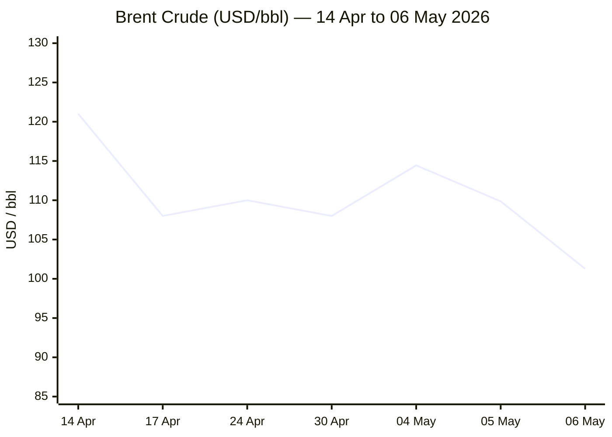
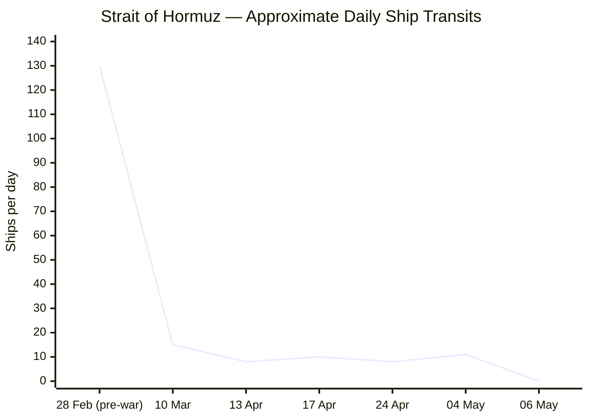

```yaml
---
brief_date: 2026-05-07
version: v1.2.1
run_time: "05:43 CET"
stories_published: 13
categories: [conflict, business, eu_affairs, technology, trends]
alert_counts:
  red: 3
  yellow: 8
  green: 2
ongoing_situations:
  - {name: "2026 US-Iran War", real_world_start: "2026-02-28", day: 69}
  - {name: "US-Iran Ceasefire", real_world_start: "2026-04-08", day: 30}
  - {name: "2026 Lebanon War", real_world_start: "2026-03-02", day: 67}
  - {name: "Israel-Lebanon Ceasefire", real_world_start: "2026-04-16", day: 22}
sources_fetched: 11
fetch_status:
  le_monde: "❌"
  faz: "❌"
  kommersant: "❌"
  xinhua: "⚠️"
  european_parliament: "⚠️"
expansion_queue: []
---
```

# 🌐 MORNING BRIEF
## Thursday, 07 May 2026 · 05:43 CET
### 13 stories across 5 categories

---

## DIGEST SUMMARY

| # | Category | Headline | Alert |
|---|----------|----------|-------|
| 1 | ⚔️ Conflict | US declares Epic Fury "over" — dual Hormuz blockade persists as deal framework emerges | 🔴 |
| 2 | ⚔️ Conflict | Israel strikes Beirut in ceasefire breach, killing Hezbollah Radwan commander | 🔴 |
| 3 | ⚔️ Conflict | Pakistan-Saudi mediation gains traction: Project Freedom paused for diplomacy | 🟡 |
| 4 | 💼 Business | Brent plunges 7.8% in single session on US-Iran deal reports; equities hit record highs | 🟡 |
| 5 | 💼 Business | Hormuz shipping at near-standstill: 11 transits on 4 May vs 130/day pre-war | 🔴 |
| 6 | 💼 Business | ECB holds at 2.0%; EU CPI reaches 3.0% in April; June hike priced at 80% | 🟡 |
| 7 | 🇪🇺 EU Affairs | Magyar to be sworn in 9 May; late-May deadline set for €17bn EU funds framework deal | 🟢 |
| 8 | 🇪🇺 EU Affairs | EU Article 42.7 mutual defence: Cyprus summit operationalisation process launched | 🟡 |
| 9 | 🇪🇺 EU Affairs | EU proposes Hormuz escort force; Commission energy relief package unveiled | 🟡 |
| 10 | 🤖 Technology | OpenAI deploys GPT-5.5 Instant as ChatGPT default; memory integration expanded | 🟢 |
| 11 | 🤖 Technology | Stanford AI Index 2026: US-China gap near-erased; global AI investment $581.7bn | 🟡 |
| 12 | 📈 Trends | Pakistan and Saudi Arabia emerge as indispensable crisis mediators | 🟡 |
| 13 | 📈 Trends | Iran war energy-food cascade: FAO index at 7-month high as input costs rise | 🟡 |

> Alert Level key: 🔴 High significance · 🟡 Developing · 🟢 Stable/Routine

---

## 🚨 SIGNAL BOARD

🔴 **Brent crude fell 7.8% in a single session on 6 May to $101.27/bbl — the sharpest one-day move since October 2024 — as markets priced a preliminary US-Iran framework deal**
🔴 **Strait of Hormuz daily transits: 11 crossings on 4 May, 1 on 5 May, 0 on 6 May — down 91% from pre-war baseline of 130/day; 23,000 seafarers remain stranded**
🟡 **Israel struck Beirut on 6 May killing Hezbollah's Radwan Force operations commander in the most serious ceasefire breach since 16 April — truce expires 17 May**
🟢 **Hungary's Péter Magyar to be sworn in 9 May with late-May deadline for €17bn EU funds political agreement with Brussels — generational reset of EU-Hungary relations**
⚡ **Rubio's declaration that Operation Epic Fury is "concluded" (5 May) marks formal shift from war to coercive diplomacy — Hormuz reopening, not regime change, now stated US objective**

---

## 🔄 ONGOING SITUATIONS

| Situation | Real-world start | Day # | Last significant development | Status |
|-----------|-----------------|-------|------------------------------|--------|
| 2026 Iran War | 28 Feb 2026 | Day 69 | Rubio declares Epic Fury concluded; Project Freedom paused | 🟡 Ceasefire |
| US-Iran Ceasefire | 08 Apr 2026 | Day 30 | IRGC attacks UAE 5–6 May; US blockade maintained | 🔴 Fragile |
| 2026 Lebanon War | 02 Mar 2026 | Day 67 | Israel kills Radwan Force commander in Beirut strike | 🔴 Active violations |
| Israel-Lebanon Ceasefire | 16 Apr 2026 | Day 22 | Most intense week of violence since truce; expires 17 May | 🔴 Fragile |

---

## ⚔️ CONFLICT ANALYST · 3 updates today

---

### 1. US-Iran War / Strait of Hormuz — Dual Blockade Persists as Deal Framework Emerges 🔴

**Alert:** 🔴
**Summary:** On 5 May, Secretary of State Marco Rubio declared Operation Epic Fury "concluded," formally closing the 69-day air-and-naval campaign. The US priority is now Hormuz reopening. On 6 May, Trump paused Operation Project Freedom — the naval escort mission launched 4 May — citing "great progress" in Pakistani-mediated negotiations and a US belief that a preliminary framework agreement was close. However, the "dual blockade" persists: the US Navy maintains its cordon around Iranian ports while Iran restricts commercial traffic and demands toll payments. Iran struck UAE targets with missiles and drones on 5–6 May; the US destroyed Iranian boats. CENTCOM called incidents "below the threshold of restarting major combat operations." Iran lost track of mines it laid in the strait, complicating full reopening.
**Significance:** The shift from Epic Fury to "Project Freedom" to "pause for diplomacy" within 72 hours signals a US acceptance — articulated by analysts — that Hormuz, nuclear talks, and the war cannot be resolved in a single package. Washington may be settling for a staged framework: Hormuz first, nuclear constraints later.
**Sources:**
- [CNN — Live updates: Trump pauses US Hormuz escort effort while blockade remains](https://www.cnn.com/2026/05/05/world/live-news/iran-war-news) · 05 May 2026
- [Al Jazeera — Has the US accepted Iran's demand to settle Hormuz first, nuclear later?](https://www.aljazeera.com/news/2026/5/6/has-the-us-accepted-irans-demand-to-settle-hormuz-first-nuclear-later) · 06 May 2026
- [CBS News — US sinks Iranian boats as Iran attacks UAE in Strait of Hormuz](https://www.cbsnews.com/live-updates/iran-war-trump-strait-of-hormuz-ship-attack-threat-peace-proposal/) · 05 May 2026

**Trend:** ↘ De-escalating
**Tags:** #Iran #Hormuz #ceasefire #naval-blockade #MULTI-SOURCE #day-N

---

### 2. Lebanon / Hezbollah — Israel Strikes Beirut in Serious Ceasefire Breach 🔴

**Alert:** 🔴
**Summary:** On 6 May, Israel struck Hezbollah's Haret Hreik district in southern Beirut's Dahiyeh, killing Malek Ballout, operations commander of Hezbollah's Radwan Force — the group's most prominent combat unit. No advance evacuation warning was issued. It was the first Israeli strike on Beirut since the 16 April ceasefire. Lebanese authorities condemned the attack as a war crime. According to the UN, fighting between Israel and Hezbollah in southern Lebanon this week reached its most intense level since the truce began, with Israeli forces maintaining a ~10km security zone and ordering evacuations from towns outside it. The ceasefire is set to expire 17 May. More than 2,600 Lebanese have been killed since 2 March, and over 1.2 million displaced.
**Significance:** The targeted killing of a Radwan Force commander in the Lebanese capital — at the moment US-Iran diplomacy is gaining traction — risks derailing ceasefire extension talks and reinforcing Iranian hardliners who argue the truce benefits Israel unconditionally.
**Sources:**
- [Al-Monitor — Israel strikes Beirut in breach of Lebanon ceasefire](https://www.al-monitor.com/originals/2026/05/israel-strikes-beirut-breach-lebanon-ceasefire) · 06 May 2026
- [NPR — In spite of ceasefire, Israel and Hezbollah clash in Lebanon](https://www.npr.org/2026/05/06/nx-s1-5814098/a-fraying-ceasefire-in-southern-lebanon-with-villages-destroyed) · 06 May 2026
- [CBC News — Lebanon-Israel ceasefire 'in name only', analysts say](https://www.cbc.ca/news/world/lebanon-israel-hezbollah-ceasefire-analysis-9.7188159) · 06 May 2026

**Trend:** ↗ Escalating
**Tags:** #Lebanon #Hezbollah #Israel #ceasefire #missile-strike #humanitarian #MULTI-SOURCE

---

### 3. Pakistan-Saudi Mediation — Project Freedom Pause Opens Diplomatic Window 🟡

**Alert:** 🟡
**Summary:** Pakistan's Prime Minister Shehbaz Sharif confirmed on 6 May that Saudi Crown Prince Mohammed bin Salman was instrumental in persuading Trump to pause Project Freedom. Sharif expressed confidence that "the current momentum will lead to a lasting agreement." US officials believe a preliminary framework could be reached within days, outlining a sequenced process: Hormuz reopening first, nuclear constraints second. Iranian Foreign Minister Araghchi is in Beijing; Rubio urged China to pressure Tehran. Pakistan's Army Chief General Asim Munir and Islamabad have become indispensable conduits. Trump reportedly also discussed Iran with Russian Foreign Minister Lavrov, with Moscow having offered to assist on enriched uranium.
**Significance:** Pakistan's emergence as an active broker between Washington and Tehran, complemented by Saudi Arabia and Russia, represents a structural shift in Middle East diplomacy that will persist beyond this crisis.
**Sources:**
- [Al Jazeera — Has the US accepted Iran's demand to settle Hormuz first?](https://www.aljazeera.com/news/2026/5/6/has-the-us-accepted-irans-demand-to-settle-hormuz-first-nuclear-later) · 06 May 2026
- [Britannica — 2026 Iran war](https://www.britannica.com/event/2026-Iran-war) · 06 May 2026

**Trend:** ↘ De-escalating
**Tags:** #Pakistan-mediation #peace-talks #Iran #ceasefire #diplomacy #MULTI-SOURCE

📚 *Background reading:* [Al Jazeera — Has the US accepted Iran's demand to settle Hormuz first, nuclear later?](https://www.aljazeera.com/news/2026/5/6/has-the-us-accepted-irans-demand-to-settle-hormuz-first-nuclear-later) · [CFR — Israel-Lebanon Ceasefire Extended for Three Weeks](https://www.cfr.org/articles/israel-lebanon-ceasefire-extended-for-three-weeks)

---

## 💼 BUSINESS ANALYST · 3 updates today

---

### 4. Oil Markets — Brent Drops 7.8% in Single Session on Deal Reports; S&P 500 Records 🟡

**Alert:** 🟡
**Summary:** Brent crude fell 7.8% on 6 May to close at $101.27/bbl — the second consecutive session decline — after Axios reported US officials believed a preliminary US-Iran agreement was imminent. WTI closed down 7% at $95.08/bbl. The moves moderated when Trump told the New York Post it was "too soon" to sign a deal. The same session saw the S&P 500 gain 1.5% and the Nasdaq jump 2%, both closing at record highs. The Dow gained 610+ points. The sharp divergence between oil and equities reflects a market betting the Hormuz crisis resolves without full military resumption. US petrol prices hit $4.48/gallon on 5 May — 50% above pre-war levels; Goldman Sachs warned refined product buffers are depleting rapidly, particularly naphtha, LPG, and jet fuel.
**Market signal:** Tentatively bullish for equities and bearish for oil, as deal momentum builds — but conditional on Iran follow-through, making both moves reversible.
**Sources:**
- [NBC News — Oil plunges, markets surge on US-Iran deal reports as gas prices top $4.50](https://www.nbcnews.com/business/business-news/oil-markets-gas-prices-450-us-iran-near-deal-end-war-hormuz-rcna343819) · 06 May 2026
- [CNN Business — Oil pulls back after hitting 2026 high](https://www.cnn.com/2026/05/05/energy/oil-price-highest-in-2026-intl-hnk) · 05 May 2026

**Trend:** ↘ De-escalating
**Tags:** #Brent #oil-price #equity-rally #SP500 #Hormuz #market-shock #MULTI-SOURCE

📎 See also: Conflict § Story 1 — US-Iran ceasefire brinkmanship driving Hormuz supply disruption

---

### 5. Strait of Hormuz Shipping — Near-Standstill Continues; Seafarers Stranded 🔴

**Alert:** 🔴
**Summary:** Pre-war Hormuz transit volume averaged 130 ships per day. On 4 May, Windward maritime intelligence recorded just 11 crossings. On 5 May, S&P Global counted one transit; on 6 May, zero. Around 23,000 seafarers from 87 countries remain stranded on vessels in the Persian Gulf. As of April, approximately 1,000 ships were in holding patterns — 800 inside waiting to transit eastbound, 200 outside. Iran launched its Persian Gulf Strait Authority on 5 May, seeking to formalise toll collection and vessel authorisation. Abu Dhabi National Oil Company CEO Sultan Al Jaber confirmed 230 loaded tankers are waiting inside the Gulf. Goldman Sachs estimates global oil inventories stand at around 101 days of demand — above emergency levels but declining, with sharp scarcities in India, Thailand, South Africa, and Taiwan. Polymarket assigns only a 28% probability that normal traffic resumes before end of May.
**Market signal:** Bearish for global supply chains and energy-intensive industries as the backlog, mine-clearing requirements, and IRGC toll demands mean even a political agreement will not immediately restore normal trade flows.
**Sources:**
- [CNBC — Oil falls after ceasefire holds despite UAE attacks](https://www.cnbc.com/2026/05/05/oil-prices-today-wti-brent-iran-war-trump-hormuz.html) · 05 May 2026
- [Al Jazeera — Oil prices surge as violence flares in Strait of Hormuz](https://www.aljazeera.com/economy/2026/5/5/oil-prices-surge-as-violence-flares-in-strait-of-hormuz) · 05 May 2026
- [CRS Report — Strait of Hormuz: Non-Oil Shipments and Effects on US Shippers](https://www.everycrsreport.com/reports/R48903.html) · 04 May 2026

**Trend:** → Stable
**Tags:** #Hormuz #shipping #supply-shock #energy-markets #oil-price #MULTI-SOURCE

---

### 6. ECB Hold / Eurozone Economy — June Hike Priced at 80% as EU CPI Hits 3.0% 🟡

**Alert:** 🟡
**Summary:** The ECB's Governing Council held all three key rates unchanged on 30 April — deposit facility at 2.00%, main refinancing operations at 2.15%, marginal lending at 2.40% — in a unanimous decision. President Christine Lagarde confirmed a hike had been actively discussed. Eurozone inflation jumped to 3.0% in April (from 2.6% in March and 1.9% in February), driven by energy inflation of 10.9%, itself a direct consequence of Hormuz closure. Core inflation (ex-energy and food) fell slightly to 2.2%. The Eurozone recorded Q1 GDP growth of only 0.1%. Markets now price an 80% probability of a 25bps hike to 2.25% at the June meeting, with at least two further increases expected in 2026. Oxford Economics cautioned that second-round effects have not yet materialised sufficiently to force the ECB's hand.
**Market signal:** Neutral-to-bearish for eurozone growth; ECB hike expectations are restraining a more aggressive equity rally in European markets.
**Sources:**
- [ECB — Monetary Policy Decision, 30 April 2026](https://www.ecb.europa.eu/press/pr/date/2026/html/ecb.mp260430~81b7179e6f.en.html) · 30 April 2026
- [CNBC — Europe's central banks in wait-and-see mode](https://www.cnbc.com/2026/04/29/europes-central-banks-in-wait-and-see-mode-on-interest-rates.html) · 29 April 2026

**Trend:** ↗ Escalating
**Tags:** #ECB #inflation #interest-rates #eurozone #stagflation #institutional

📚 *Background reading:* [Bruegel — [URL UNAVAILABLE]] · [IMF — War Darkens Global Economic Outlook](https://www.imf.org/en/blogs/articles/2026/04/14/war-darkens-global-economic-outlook-and-reshapes-policy-priorities)

---

## 🇪🇺 EU AFFAIRS ANALYST · 3 updates today

---

### 7. Hungary / Magyar — Sworn In 9 May; Late-May Deadline for €17bn EU Funds Deal 🟢

**Alert:** 🟢
**Summary:** Péter Magyar is set to be sworn in as Hungarian Prime Minister on 9 May — two days from today — marking the formal end of Viktor Orbán's 16-year rule. Following a visit to Brussels on 29 April, Magyar and Commission President Ursula von der Leyen agreed to conclude a political agreement on unfreezing EU funds during the week of 25 May, when Magyar will return to Brussels for formal talks. The Commission has suspended €17bn of the €27bn allocated to Hungary over rule-of-law and corruption concerns. Magyar's four-point reform package includes anti-corruption measures, accession to the European Public Prosecutor's Office, and restoration of judicial independence. The deal requires fulfilment of 27 milestones. Magyar stated none of Brussels's conditions are contrary to Hungary's national interests but noted that concessions on LGBTQ-rights-related milestones could prove politically sensitive domestically.
**Legislative/policy stage:** Pre-formal negotiations; political agreement targeted for week of 25 May 2026. Full payment release requires completion of all 27 milestones by the Commission's assessment.
**Sources:**
- [Hungarian Conservative — Magyar seeks political deal with Brussels on EU funds by late May](https://www.hungarianconservative.com/articles/current/hungary-magyar-eu-commission-funds-von-der-leyen/) · 30 April 2026
- [RTE — Hungary's Magyar pushes to unblock EU billions in Brussels](https://www.rte.ie/news/europe/2026/0430/1570981-magyar-eu/) · 30 April 2026
- [Euronews — Five takeaways from Magyar's press conference](https://www.euronews.com/my-europe/2026/04/13/eu-cash-ukraine-russia-and-migration-five-takeaways-from-peter-magyars-press-conference) · 13 April 2026

**Trend:** ↘ De-escalating
**Tags:** #Hungary #Magyar #EU-funds #rule-of-law #EU-institutions #MULTI-SOURCE

---

### 8. EU Mutual Defence — Cyprus Summit Launches Article 42.7 Operationalisation Process 🟡

**Alert:** 🟡
**Summary:** The informal EU summit held in Nicosia, Cyprus, on 23–24 April — hosted by the rotating Council presidency — formally launched an internal process to operationalise Article 42.7 of the EU treaties, the mutual assistance clause frequently compared to NATO's Article 5. The impetus came from an Iranian drone strike on a British military base in Cyprus in early March and subsequent deployments of French anti-missile and drone systems to the island. Commission President von der Leyen stated "the time has come to bring Europe's mutual defence clause to life." Hungary's absence was conspicuous — Orbán was no longer in office. Leaders also discussed a nascent proposal, still at an "early stage," for a multinational European force to escort commercial shipping through Hormuz and assist with mine-clearing. No formal decisions were taken at the informal summit; follow-up is expected at the June European Council.
**Legislative/policy stage:** Informal discussion concluded at Nicosia; Commission and EEAS tasked with preparing practical operationalisation paper. June European Council to take stock.
**Sources:**
- [Euronews — EU leaders meet in Cyprus to talk Ukraine, Hormuz, energy and mutual defence](https://www.euronews.com/my-europe/2026/04/23/eu-leaders-meet-in-cyprus-to-talk-ukraine-hormuz-energy-and-mutual-defence) · 23 April 2026

**Trend:** ↗ Escalating
**Tags:** #EU-defence #EU-institutions #diplomacy #Hormuz #escalation #MULTI-SOURCE

---

### 9. EU Hormuz Energy Response — Commission Unveils Relief Package; Escort Force Floated 🟡

**Alert:** 🟡
**Summary:** Ahead of the Cyprus summit, the European Commission unveiled a package of energy relief measures in response to surging prices driven by the Hormuz closure. The package includes social schemes, temporary tax reductions, grid investment, and subsidies for clean technologies — drawing explicitly on lessons from the 2022 Russian gas crisis. The Commission is calling for measures to be "targeted and temporary" to avoid permanent debt-financed subsidies. The European Parliament's Foreign Affairs Committee this week also held discussions with Ukrainian MPs on Ukraine's EU accession path. EU foreign affairs chief Kaja Kallas announced the bloc would work with Gulf partners to restrict Russian technology upgrades in Iranian drones used against Gulf neighbours, including through possible co-operation on sanctions. The Commission separately confirmed plans to present a revised Governance Regulation for the Energy Union in Q4 2026.
**Legislative/policy stage:** Energy relief package — Commission Communication published, pending Council endorsement. EU-Gulf security cooperation — operational discussions under way. Energy Union Governance revision — legislative proposal planned Q4 2026.
**Sources:**
- [Euronews — EU leaders meet in Cyprus to discuss Hormuz, energy, mutual defence](https://www.euronews.com/my-europe/2026/04/23/eu-leaders-meet-in-cyprus-to-talk-ukraine-hormuz-energy-and-mutual-defence) · 23 April 2026
- [EUbusiness — EU Agenda: Week Ahead 4–9 May 2026](https://www.eubusiness.com/politics/eucalendar/) · 04 May 2026

**Trend:** ↗ Escalating
**Tags:** #EU-institutions #energy-policy #Hormuz #EU-enlargement #EU-sanctions #institutional

📚 *Background reading:* [ECFR — [URL UNAVAILABLE]] · [Euronews — Is the EU ready to drop unanimous voting?](https://www.euronews.com/my-europe/2026/04/15/is-the-eu-ready-to-drop-unanimous-voting)

---

## 🤖 TECHNOLOGY ANALYST · 2 updates today

---

### 10. OpenAI — GPT-5.5 Instant Becomes New ChatGPT Default with Memory Integration 🟢

**Alert:** 🟢
**Summary:** On 5 May, OpenAI deployed GPT-5.5 Instant as the new default model for ChatGPT across all subscription tiers. The model can use its search tool to reference past conversations, files, and Gmail for personalised responses. Memory sources will be displayed transparently to users. GPT-5.5 (first released 23 April, API model ID gpt-5.5-2026-04-23) is described as OpenAI's smartest and most intuitive model to date — excelling in agentic coding, computer use, knowledge work, and early scientific research. It matches GPT-5.4 per-token latency while outperforming it significantly on intelligence benchmarks. GPT-5.3 remains available for paid users for three months. OpenAI simultaneously launched GPT-5.5 on Amazon Bedrock, with over 4 million weekly Codex users.
**Analyst note:** The bundling of persistent memory with a frontier default model shifts the competitive dynamic from benchmark performance to user-data lock-in: by mid-2026, switching AI providers will carry a growing contextual cost that will compound enterprise stickiness.
**Sources:**
- [TechCrunch — OpenAI releases GPT-5.5 Instant, a new default model for ChatGPT](https://techcrunch.com/2026/05/05/openai-releases-gpt-5-5-instant-a-new-default-model-for-chatgpt/) · 05 May 2026
- [OpenAI — Introducing GPT-5.5](https://openai.com/index/introducing-gpt-5-5/) · 23 April 2026

**Trend:** ↗ Escalating
**Tags:** #AI #LLM #AI-benchmark #autonomous-systems

---

### 11. Stanford HAI — AI Index 2026: US-China Gap Near-Erased; Global Investment $581.7bn 🟡

**Alert:** 🟡
**Summary:** Stanford's Human-Centered AI Institute published its annual AI Index 2026, confirming that as of March 2026, Anthropic's leading model outperforms its closest Chinese rival by just 2.7% — with US and Chinese frontier models having repeatedly traded top benchmark positions since early 2025. Global corporate AI investment hit $581.7bn in 2025, up 130% year-on-year, with US private investment ($285.9bn) running 23x higher than China's ($12.4bn). AI data centre power capacity reached 29.6 GW globally — comparable to Switzerland's national electricity consumption. The report notes GPT-4o annual inference water consumption alone may exceed the drinking needs of 1.2 million people. On the workforce side, productivity gains from AI are emerging in fields where entry-level employment is starting to decline. US AI adoption ranks 24th globally (28.3%), behind Singapore (61%) and UAE (54%).
**Analyst note:** The near-erasure of the US-China AI capability gap — combined with China's state-guided investment structures that the report says are systematically understated — is likely to intensify US export controls on advanced semiconductors and model weights over the next 12–18 months.
**Sources:**
- [Stanford HAI — Inside the AI Index: 12 Takeaways from the 2026 Report](https://hai.stanford.edu/news/inside-the-ai-index-12-takeaways-from-the-2026-report) · 01 May 2026

**Trend:** → Stable
**Tags:** #AI #AI-benchmark #semiconductor #data-centre #AI-regulation

📚 *Background reading:* [CSIS — [URL UNAVAILABLE]] · [RAND — [URL UNAVAILABLE]]

---

## 📈 TRENDS ANALYST · 2 updates today

---

### 12. Pakistan and Saudi Arabia as Indispensable Regional Mediators ↗

**Alert:** 🟡
**Summary:** The Iran war has elevated Pakistan and Saudi Arabia to roles not seen in decades. Pakistan's Army Chief General Asim Munir and PM Shehbaz Sharif co-brokered the 7–8 April ceasefire; Pakistan is now the primary back-channel for US-Iran communications. Saudi Crown Prince Mohammed bin Salman separately persuaded Trump to pause Project Freedom on 6 May. Iran's FM Araghchi is simultaneously in Beijing, indicating China's inclusion in the emerging regional framework. This configuration — Pakistan (South Asia), Saudi Arabia (Gulf), China (great power) — marks a structural departure from the US-centric Middle East diplomacy that defined the post-Cold War era.
**Horizon:** Long-term structural shift — the legitimisation of a multi-polar mediation architecture in the Middle East is likely to persist well beyond the Iran war's resolution, reshaping alliance structures over a multi-year horizon.
**Sources:**
- [Al Jazeera — Has the US accepted Iran's demand to settle Hormuz first?](https://www.aljazeera.com/news/2026/5/6/has-the-us-accepted-irans-demand-to-settle-hormuz-first-nuclear-later) · 06 May 2026
- [Britannica — 2026 Iran war](https://www.britannica.com/event/2026-Iran-war) · 06 May 2026

**Trend:** ↗ Escalating
**Tags:** #Pakistan-mediation #diplomacy #mediation #peace-talks

---

### 13. Iran War Energy-Food Cascade — FAO at 7-Month High; Agricultural Input Costs Rising ↗

**Alert:** 🟡
**Summary:** The FAO Food Price Index reached 128.5 points in March 2026 — its highest level since September 2025 — rising 2.4% in a single month. Energy price spillovers from the Hormuz crisis drove the increase across all five commodity groups, particularly vegetable oils (+5.1%) and sugar (+7.2%), the latter reflecting expectations that Brazil would divert more sugarcane to ethanol as oil remains expensive. FAO's Chief Economist cautioned that if the conflict extends beyond 40 days (it is now at Day 69), farmers may reduce fertiliser use or shift to less input-intensive crops, threatening 2026–2027 harvests. Global wheat output is already forecast 1.7% below 2025. April data — due for release by FAO on 8 May — is expected to show a further acceleration given the April energy price surge.
**Horizon:** Medium-term — if Hormuz reopens within weeks, fertiliser cost pressures may still persist into the 2026 autumn planting season, implying food price elevation through Q1 2027.
**Sources:**
- [FAO — Food Price Index, March 2026](https://www.fao.org/worldfoodsituation/foodpricesindex/en/) · 05 April 2026
- [Global Agriculture — FAO Food Price Index signals rising pressure amid energy-driven shifts](https://www.global-agriculture.com/global-agriculture/fao-food-price-index-signals-rising-pressure-on-cereals-amid-energy-driven-market-shifts/) · 05 April 2026

**Trend:** ↗ Escalating
**Tags:** #food-security #food-prices #energy-markets #supply-shock #climate

📚 *Background reading:* [IMF — War Darkens Global Economic Outlook and Reshapes Policy Priorities](https://www.imf.org/en/blogs/articles/2026/04/14/war-darkens-global-economic-outlook-and-reshapes-policy-priorities)

---

## 📊 KEY DATA OF THE DAY

> 📊 **DATA OFFICER** · 7 indicators

| Indicator | Value | Δ vs prior session | Δ vs 7 days ago | Note | Source | URL |
|-----------|-------|-------------------|-----------------|------|--------|-----|
| EUR/USD | 1.1757 | +0.44% | +0.84% | Euro trading near $1.17 amid ECB hike expectations and Middle East tension; June hike 80% priced | ECB / Wise | [link](https://www.marketshost.com/currency-converter/eur-to-usd/) |
| Brent Crude (USD/bbl) | 101.27 | −7.8% | N/A | 6 May close; single-session plunge on US-Iran deal reports — 2nd largest one-day fall in 2026 | EIA / NBC News | [link](https://www.nbcnews.com/business/business-news/oil-markets-gas-prices-450-us-iran-near-deal-end-war-hormuz-rcna343819) |
| Gold (XAU/USD) | 4,666 | +2.4% | N/A | Safe-haven demand reasserts as deal uncertainty persists; 52-week range $3,120–$5,595 | Trading Economics | [link](https://www.investing.com/currencies/xau-usd) |
| IMF Global Growth 2026 | 3.1% | −0.3pp vs Jan WEO | −0.2pp vs Oct WEO | Reference scenario assumes short-lived conflict; adverse scenario 2.5%; severe scenario 2.0% | IMF WEO Apr 2026 | [link](https://www.imf.org/en/publications/weo/issues/2026/04/14/world-economic-outlook-april-2026) |
| EU CPI YoY (April 2026) | 3.0% | +0.4pp vs March | +1.3pp vs Jan | Energy inflation 10.9% in April; core CPI fell to 2.2%; ECB June hike now consensus | ECB / Eurostat | [link](https://www.ecb.europa.eu/press/press_conference/monetary-policy-statement/2026/html/ecb.is260430~f99cb123a8.en.html) |
| FAO Food Price Index | 128.5 | +2.4% vs Feb | March 2026 — latest available | April data due 8 May; all 5 commodity groups rose in March on energy cost spillover | FAO | [link](https://www.fao.org/worldfoodsituation/foodpricesindex/en/) |
| Hormuz Daily Transit Calls | ~11 ships | N/A | −91.5% vs pre-war (130/day) | 4 May figure (Windward); 5 May = 1 ship; 6 May = 0 ships; Polymarket assigns 28% chance of recovery by end of May | Windward / S&P Global | [link](https://insights.windward.ai/) |

**Data commentary:** The 7.8% single-session drop in Brent to $101.27/bbl reflects genuine market optimism about a Hormuz framework deal, but the strait remains effectively closed — with zero commercial transits recorded on 6 May. Gold's rebound to $4,666 signals persistent safe-haven demand even as risk assets rally, suggesting markets are hedging, not pricing in, resolution. EU CPI at 3.0% — still rising sharply from 1.7% in January — means the ECB faces a genuine dilemma: energy-driven inflation argues for June tightening, but Q1 GDP growth of just 0.1% argues against it.

---

## 📉 CHARTS

### Chart 1 — Brent Crude Trajectory: 14 April – 06 May 2026



*17 Apr: Iran announces Hormuz open for Lebanon ceasefire duration — 11% drop. 4 May: Project Freedom launch — price spike. 6 May: Deal-proximity reports — 7.8% collapse.*

---

### Chart 2 — Strait of Hormuz Daily Transit Calls: Feb–May 2026



*Baseline: 130 ships/day. War begins 28 Feb. US blockade from 13 Apr. Brief normalisation window 17 Apr. Project Freedom launched 4 May; paused 6 May. Zero transits recorded 6 May.*

---

## ⚙️ AGENT METADATA

| Field | Value |
|-------|-------|
| Agent version | MORNING BRIEF v1.2.1 |
| Run timestamp | 2026-05-07T05:43:36+02:00 |
| Fetch status | Le Monde ❌ · FAZ ❌ · Kommersant ❌ · Xinhua ⚠️ · EP ⚠️ |
| Sources queried | 11 / 11 |
| Stories surfaced | ~28 before editorial filter |
| Stories published | 13 |
| Languages processed | EN, FR (Le Monde blocked), DE (FAZ blocked) |
| Output language | English (British) |
| Date validated | ✅ Confirmed 07 May 2026 |
| Expansion Queue | None |

**Fetch notes:**
- Le Monde: ❌ SITE_BLOCKED — search fallback applied
- FAZ: ❌ SITE_BLOCKED — search fallback applied
- Kommersant: ❌ 404 client error — search fallback applied
- Xinhua: ⚠️ Fetched successfully but all stories dated 24 April 2026 — outside 24-hour window. Search fallback applied.
- European Parliament: ⚠️ Press room homepage fetched; no individual press releases rendered. Search fallback applied.
- IMF, ECB, EC, FAO: ✅ Institutional data obtained via search fallback with direct article URLs.

---

*MORNING BRIEF is an AI-assisted digest. All summaries are paraphrased from original sources. Verify time-sensitive information at the linked URLs before acting. Output language: British English.*
