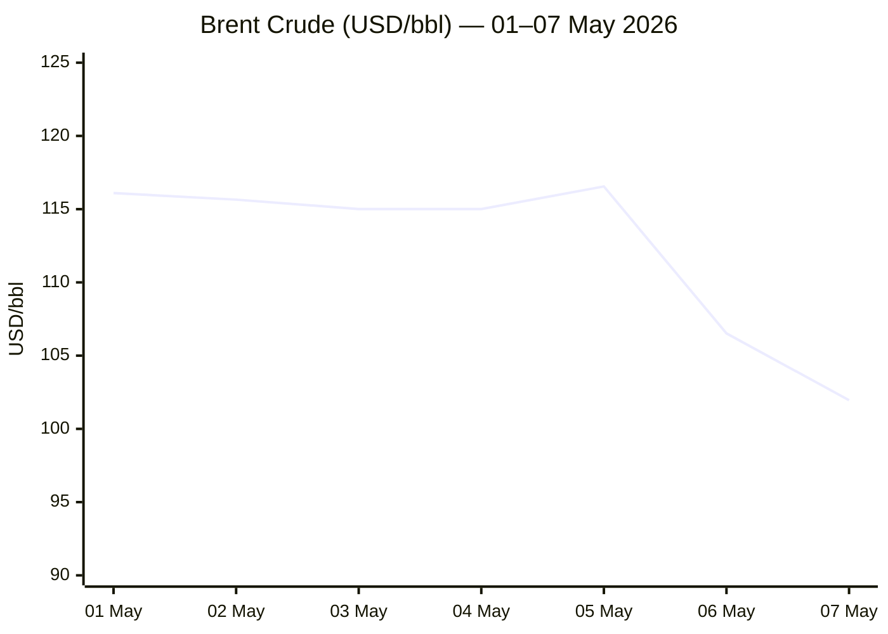
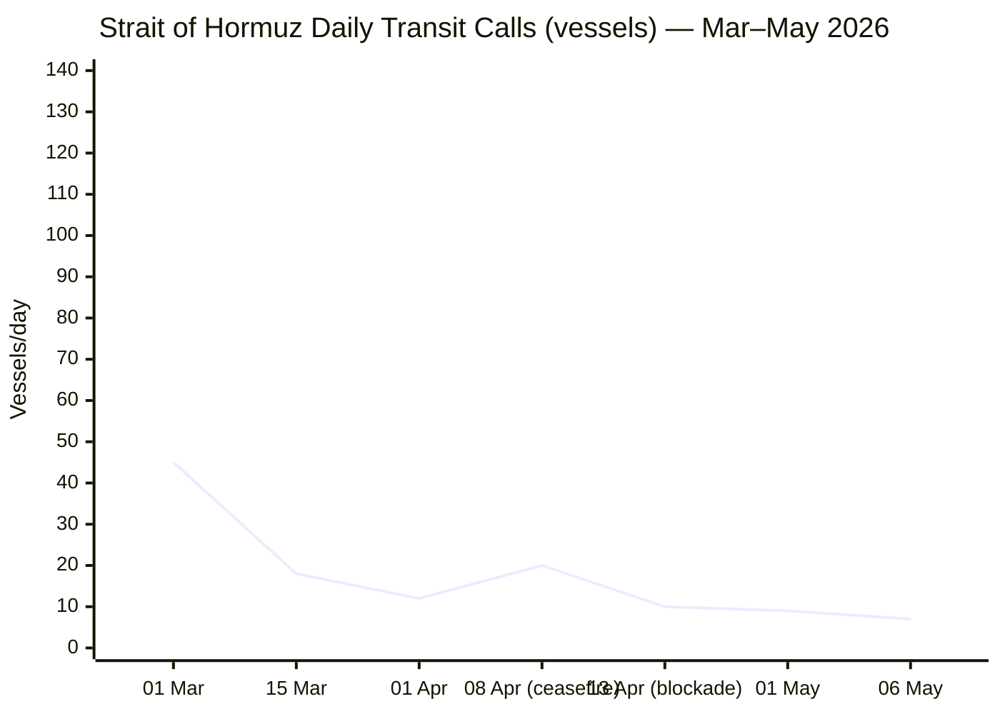

```yaml
---
brief_date: 2026-05-08
version: v1.2.1
run_time: "05:44 CET"
stories_published: 13
categories: [conflict, business, eu_affairs, technology, trends]
alert_counts:
  red: 5
  yellow: 6
  green: 2
ongoing_situations:
  - {name: "2026 Iran War / Hormuz Closure", real_world_start: "2026-02-28", day: 70}
  - {name: "Pakistan-Mediated Peace Process", real_world_start: "2026-04-08", day: 31}
  - {name: "Israel-Lebanon Ceasefire (extended)", real_world_start: "2026-04-16", day: 23}
sources_fetched: 10
fetch_status:
  le_monde: "❌"
  faz: "❌"
  kommersant: "❌"
  xinhua: "⚠️"
  european_parliament: "⚠️"
---
```

---

# 🌐 MORNING BRIEF
## Friday, 08 May 2026 · 05:44 CET

### 13 stories across 5 categories

---

## DIGEST SUMMARY

| # | Category | Headline | Alert |
|---|----------|----------|-------|
| 1 | ⚔️ Conflict | US-Iran: Iran reviews one-page MoU; Rubio declares Operation Epic Fury "concluded" | 🔴 |
| 2 | ⚔️ Conflict | Hormuz: Transit at 5% of normal; Project Freedom paused; IRGC signals opening | 🔴 |
| 3 | ⚔️ Conflict | Lebanon: UN records most intense ceasefire violations since truce; IDF expands operational zone | 🔴 |
| 4 | 💼 Business | Brent reversal: crude drops 12% in seven days as peace-deal optimism surges | ⚡ |
| 5 | 💼 Business | ECB holds at 2%; June hike fully priced; eurozone Q1 GDP stalls at 0.1% | 🟡 |
| 6 | 💼 Business | IMF April WEO: global growth cut to 3.1%, inflation raised to 4.4% | 🔴 |
| 7 | 🇪🇺 EU Affairs | AI Act Digital Omnibus VII: overnight deal reached; high-risk deadlines pushed to 2027–2028 | 🟢 |
| 8 | 🇪🇺 EU Affairs | EU-Ukraine €90bn support loan disbursements begin | 🟡 |
| 9 | 🇪🇺 EU Affairs | FAC Defence: ministers convene on EU military posture and Middle East impact | 🟡 |
| 10 | 🤖 Technology | EU AI Act Omnibus VII: key provisions — deadline extensions, CSAM/nudifier ban, GPAI enforcement | 🟢 |
| 11 | 🤖 Technology | Four Chinese labs release open-weight coding models in 12-day sprint, reaching frontier capability | 🟡 |
| 12 | 📈 Trends | Pakistan's diplomatic pivot: Islamabad process cements mediator role in great-power conflict | 🟡 |
| 13 | 📈 Trends | Global stagflation risk crystallises: ECB caught between oil-driven inflation and stalling growth | 🟡 |

> Alert Level key: 🔴 High significance · 🟡 Developing · 🟢 Stable/Routine

---

## 🚨 SIGNAL BOARD

🔴 Brent crude fell from $116 to $102/bbl in seven days — a 12% drop driven entirely by US-Iran deal optimism, the sharpest weekly decline since the war began.
🔴 Iran's response to US one-page MoU expected today via Pakistan; Rubio has declared Operation Epic Fury "concluded" — the clearest US signal yet that the military phase is over.
🟡 EU inflation hit 3.0% YoY in April (highest since September 2023), driven by energy at +10.9% — ECB June hike now 75% probability-priced.
🟡 EU AI Act Omnibus VII provisional deal reached overnight (7 May): high-risk compliance pushed to December 2027, ending months of uncertainty for industry.
⚡ Gold climbed back above $4,700/oz on deal optimism — inverting its recent war-inflation sell-off pattern; a potential leading indicator of de-escalation pricing.

---

## 🔄 ONGOING SITUATIONS

| Situation | Real-world start | Day # | Last significant development | Status |
|-----------|-----------------|-------|------------------------------|--------|
| 2026 Iran War / Hormuz Closure | 28 Feb 2026 | Day 70 | Iran reviewing US one-page MoU; Rubio: "Epic Fury concluded" | 🔴 Active |
| Pakistan-Mediated Peace Process | 08 Apr 2026 | Day 31 | Iran response to US proposal due 8 May via Islamabad channel | 🟡 Negotiating |
| Israel-Lebanon Ceasefire (extended) | 16 Apr 2026 | Day 23 | UN: most intense violations since truce; IDF expands zone north of Litani | 🔴 Fragile |

---

## ⚔️ CONFLICT

> 🔎 **CONFLICT ANALYST** · 3 updates today

### 1. US-Iran: One-Page MoU Under Review; Rubio Declares Military Phase "Concluded" 🔴
**Alert:** 🔴
**Summary:** Secretary of State Marco Rubio declared Operation Epic Fury "concluded" on 6 May, signalling the formal end of the US air and naval campaign against Iran. Washington has transmitted a one-page memorandum of understanding via Pakistani intermediaries, proposing an end to hostilities, a graduated Hormuz reopening, and deferral of nuclear negotiations. Iran confirmed it is reviewing the proposal; Tehran's Foreign Ministry stated a response would be conveyed to Pakistan "after summing up its points of view." Trump warned that military strikes would resume if Iran did not accept. Iran's response is expected on 8 May. Trump paused Project Freedom (the merchant vessel escort operation) on 6 May, citing deal progress, while maintaining the naval blockade on Iranian ports.
**Significance:** If Iran accepts the MoU, it would mark the operational end of the 70-day conflict, though nuclear and Hormuz status negotiations would run for a further 30-day window. The Hajj pilgrimage beginning 25 May adds a practical deadline that narrows escalation options for all parties.
**Sources:**

- [Al Jazeera — Has the US accepted Iran's demand to settle Hormuz first, nuclear later?](https://www.aljazeera.com/news/2026/5/6/has-the-us-accepted-irans-demand-to-settle-hormuz-first-nuclear-later) · 06 May 2026
- [NPR — Pakistan says it's hopeful a U.S.-Iran deal can happen soon](https://www.npr.org/2026/05/06/nx-s1-5813497/iran-war-strait-hormuz-updates) · 07 May 2026

**Trend:** ↘ De-escalating
**Tags:** #Iran #ceasefire #peace-talks #Pakistan-mediation #MULTI-SOURCE

---

### 2. Strait of Hormuz: Transit at 5% of Normal; IRGC Signals Conditional Reopening 🔴
**Alert:** 🔴
**Summary:** Hormuz transit volumes remain severely depressed at approximately 5% of pre-war levels, with Windward intelligence recording only 7 vessel transits on 6 May versus the pre-war average of 130/day. The US blockade, in force since 13 April, has turned around 52 vessels. Iran's IRGC Navy announced on 7 May that "safe and sustainable transit through the strait will be facilitated" under new procedures, without specifying terms. The CMA CGM San Antonio was struck by a cruise missile on 5 May injuring eight crew; an HMM vessel caught fire on 4 May. Some 23,000 seafarers from 87 countries remain stranded in the Persian Gulf. Approximately 1,000 ships are in holding patterns inside and outside the Strait.
**Significance:** The IRGC statement, coupled with Iran's MoU review, suggests Iran is preparing diplomatic cover for a reopening. However, until a formal agreement is signed, war-risk insurance at 1% of hull value and the US blockade will prevent meaningful flow resumption.
**Sources:**

- [Wikipedia — 2026 Strait of Hormuz Crisis](https://en.wikipedia.org/wiki/2026_Strait_of_Hormuz_crisis) · 08 May 2026
- [Congress.gov CRS — Non-Oil Shipments and Effects on U.S. Shippers](https://www.congress.gov/crs-product/R48903) · 04 May 2026

**Trend:** ↘ De-escalating
**Tags:** #Hormuz #naval-blockade #Iran #shipping #MULTI-SOURCE

📎 See also: Business § Story 4 — Brent reversal driven by Hormuz deal optimism

---

### 3. Lebanon: Ceasefire "Exists Only in Name"; UN Records Most Intense Violations 🔴
**Alert:** 🔴
**Summary:** The Israel-Lebanon ceasefire, in force since 16 April and extended three weeks on 23 April to mid-May, has sharply deteriorated. Al Jazeera reported that Israel maintains five divisions inside southern Lebanon, conducting extensive demolitions and airstrikes. Lebanon's Ministry of Public Health counted at least 10 deaths from Israeli attacks on 3 May. Israeli military chief Lt Gen Eyal Zamir threatened strikes "beyond the Yellow Line" and north of the Litani River. Israel issued new forced displacement orders for villages receiving them for the first time. Direct Israel-Lebanon talks continue in Washington under US chairmanship, with Lebanese President Joseph Aoun insisting Israel must first implement existing agreements before advancing new negotiations. Hezbollah is not a signatory to the ceasefire and has reserved the right to respond to violations.
**Significance:** The expanding Israeli operational zone risks a complete ceasefire collapse ahead of the Iran MoU deadline, which would complicate the broader US-Iran diplomatic framework — Iran has consistently demanded the Lebanon front be included in any durable settlement.
**Sources:**

- [Al Jazeera — Israel issues new forced displacement orders in southern Lebanon](https://www.aljazeera.com/news/2026/5/3/israel-issues-new-forced-displacement-orders-in-southern-lebanon) · 03 May 2026
- [NPR — In spite of ceasefire, Israel and Hezbollah clash in Lebanon](https://www.npr.org/2026/05/06/nx-s1-5814098/a-fraying-ceasefire-in-southern-lebanon-with-villages-destroyed) · 06 May 2026

**Trend:** ↗ Escalating
**Tags:** #Lebanon #Hezbollah #Israel #ceasefire #humanitarian #MULTI-SOURCE

📚 *Background reading:* [CFR — Israel-Lebanon Ceasefire Extended for Three Weeks](https://www.cfr.org/articles/israel-lebanon-ceasefire-extended-for-three-weeks) · [Kyiv Independent — Ukraine coverage amid Iran war background](https://kyivindependent.com)

---

## 💼 BUSINESS

> 💼 **BUSINESS ANALYST** · 3 updates today

### 4. Brent Crude Reversal: Drops 12% in Seven Days on Peace-Deal Optimism ⚡
**Alert:** 🟡
**Summary:** Brent crude has fallen sharply from $116.55/bbl on 5 May to $101.96/bbl as of 7 May — a decline of roughly $15/bbl in three sessions — as markets priced in growing probability of a US-Iran MoU and Hormuz reopening. The move erases a portion of the conflict premium accumulated since the 28 February attack, but analysts caution that even a deal would require weeks to normalise shipping flows, GCC production ramp-ups, and insurer confidence. The EIA's April STEO estimated Gulf state production shut-ins at 9.1 million barrels/day in April, with only a gradual return to pre-conflict levels projected for late 2026. US gasoline prices remain approximately 52% above their pre-war level, and diesel at more than $5.80/gallon.
**Market signal:** Bearish near-term on crude as deal probability rises, but a full structural supply recovery is months away — downside limited at $95–100 unless MoU is signed and blockade lifted simultaneously.
**Sources:**

- [Trading Economics — Brent Crude](https://tradingeconomics.com/commodity/brent-crude-oil) · 07 May 2026
- [Fortune — Current price of oil: May 7, 2026](https://fortune.com/article/price-of-oil-05-07-2026/) · 07 May 2026

**Trend:** ⚡ Reversal
**Tags:** #Brent #oil-price #Hormuz #supply-shock #reversal #MULTI-SOURCE

📎 See also: Conflict § Story 2 — Hormuz transit at 5% of normal; IRGC signals conditional opening

---

### 5. ECB Holds at 2%; June Hike 75%-Priced; Eurozone Q1 Growth Stalls 🟡
**Alert:** 🟡
**Summary:** The ECB Governing Council unanimously held its three key rates unchanged at its 30 April meeting — deposit facility at 2.00%, main refinancing at 2.15% — while explicitly debating a possible hike "at length." President Lagarde stated that June would be "the right time for a new assessment." Market money markets now fully price two ECB hikes for 2026, with a 75% probability of a first 25bp increase in June. The backdrop is difficult: eurozone GDP grew only 0.1% in Q1 2026, the slowest rate since before the war; April CPI rose to 3.0% driven by energy at +10.9%. Berenberg economists warned of a "bout of stagflation" if the Hormuz closure extends.
**Market signal:** Neutral-to-hawkish: ECB is signalling a June hike is likely but conditioned on data, creating EUR/USD upside tension versus recession risk from higher rates into a near-stagnant economy.
**Sources:**

- [ECB — Monetary Policy Decisions, 30 April 2026](https://www.ecb.europa.eu/press/pr/date/2026/html/ecb.mp260430~81b7179e6f.en.html) · 30 April 2026
- [RTE — ECB keeps rates unchanged after debating possible hike](https://www.rte.ie/news/business/2026/0430/1571082-european-central-bank-rates-decision/) · 01 May 2026

**Trend:** ↗ Escalating
**Tags:** #ECB #interest-rates #inflation #eurozone #stagflation #institutional

---

### 6. IMF April WEO: Global Growth Cut to 3.1%; Severe Scenario Approaches Recession Threshold 🔴
**Alert:** 🔴
**Summary:** The IMF's April 2026 World Economic Outlook, "Global Economy in the Shadow of War," cut the 2026 global growth forecast from 3.3% (January) to 3.1%, citing the Hormuz closure and energy price shock. Global inflation was revised up from 3.8% to 4.4%. Eurozone growth was downgraded to 1.1% (from 1.4% in 2025); Iran's economy is projected to contract 6.1%. In an adverse scenario, global growth falls to 2.5%; in the severe scenario — energy dislocations extending into 2027 — to 2.0%, a level the IMF describes as "a close call for a global recession," breached only four times since 1980. The IMF also marked down Sub-Saharan Africa to 4.3%, and Iran's economy by 7.2 percentage points.
**Market signal:** Bearish on global growth assets and emerging-market debt: the IMF's downgrade establishes a new consensus floor, and the severe-scenario risk ($95–100 sustained oil) remains live until a signed Hormuz deal materialises.
**Sources:**

- [IMF Blog — War Darkens Global Economic Outlook and Reshapes Policy Priorities](https://www.imf.org/en/blogs/articles/2026/04/14/war-darkens-global-economic-outlook-and-reshapes-policy-priorities) · 14 April 2026
- [PBS NewsHour — IMF cuts the outlook for global growth in the fallout from Iran war](https://www.pbs.org/newshour/economy/imf-cuts-the-outlook-for-global-growth-in-the-fallout-from-from-iran-war) · 15 April 2026

**Trend:** ↘ De-escalating
**Tags:** #IMF #GDP-forecast #inflation #stagflation #oil-price #institutional #MULTI-SOURCE

📚 *Background reading:* [Bruegel — analysis on European stagflation risk](https://www.bruegel.org) · [RAND — energy security and conflict scenarios](https://www.rand.org)

---

## 🇪🇺 EU AFFAIRS

> 🇪🇺 **EU AFFAIRS ANALYST** · 3 updates today

### 7. AI Act Digital Omnibus VII: Provisional Political Agreement Reached Overnight 🟢

**Alert:** 🟢
**Summary:** In the early hours of 7 May 2026, the Council Presidency (Cyprus) and European Parliament negotiators reached a provisional political agreement on the Digital Omnibus on AI (COM(2025) 836), the seventh in the Commission's Omnibus simplification series. The deal — concluded after the 28 April trilogue collapsed after twelve hours — pushes the application of stand-alone high-risk AI systems (Annex III) to 2 December 2027, and high-risk AI embedded in regulated products (Annex I) to 2 August 2028. It bans AI-generated CSAM and so-called "nudifiers." Simplification measures include modulated conformity assessment for SMEs and revised GPAI enforcement. The Commission's initial proposal was the first to reach trilogue conclusion. Formal adoption by both institutions and legal-linguistic revision are still required before publication in the Official Journal.
**Legislative/policy stage:** Provisional political agreement reached 7 May 2026; formal adoption pending. Not yet in force.
**Sources:**

- [Digital Watch Observatory — EU reaches provisional deal on targeted AI Act changes](https://dig.watch/updates/eu-ai-act-omnibus-vii-deal) · 07 May 2026
- [European Parliament Press Room — AI Omnibus press conference](https://www.europarl.europa.eu/news/en) · 07 May 2026

**Trend:** ↘ De-escalating
**Tags:** #digital-regulation #AI-regulation #EU-institutions #single-market #institutional #MULTI-SOURCE

📎 See also: Technology § Story 10 — Key technical provisions and industry implications of the Omnibus VII deal

---

### 8. EU-Ukraine €90 Billion Support Loan: Disbursements Under Way 🟡
**Alert:** 🟡
**Summary:** The Council finalised its implementing decision on 23 April, confirming €90bn in financial support to Ukraine for 2026–27, financed through EU capital market borrowing and repayable from future Russian war reparations. An initial €45bn tranche for 2026 was set: €8.35bn through macro-financial assistance, €8.35bn via the Ukraine Facility, and €28.3bn directly supporting Ukraine's defence industrial capacity. All 24 participating member states voted in favour. Disbursements began flowing as of the Council decision. The loan complements the SAFE instrument's 19 national defence procurement plans, 15 of which include Ukraine.
**Legislative/policy stage:** Council implementing decision adopted 23 April 2026; disbursements active. Repayment conditioned on Russian war reparations.
**Sources:**

- [Council of the EU — Council finalises €90 billion support loan to Ukraine](https://www.consilium.europa.eu/en/press/press-releases/2026/04/23/council-finalises-90-billion-support-loan-to-ukraine/) · 23 April 2026

**Trend:** → Stable
**Tags:** #Ukraine-aid #EU-defence #EU-funds #EU-institutions #institutional #MULTI-SOURCE

---

### 9. FAC Defence: EU Ministers Convene on Military Readiness and Middle East Impact 🟡
**Alert:** 🟡
**Summary:** EU Foreign Affairs Council (Defence formation) convened this week with ministers examining three linked tracks: EU military support for Ukraine, EU defence readiness under the SAFE programme, and the spillover effects of the Middle East conflict on EU security and defence policy. High Representative Kaja Kallas co-chaired the European Defence Agency (EDA) Steering Board in the margins. The updated EU threat analysis — incorporating the Iran war's impact on European energy security and the renewed risk of escalation on NATO's southern flank — was presented to ministers. An informal energy ministers meeting is scheduled for 12–13 May.
**Legislative/policy stage:** Ministerial exchange under ongoing SAFE implementation; no new legislative action taken this session. Informal energy ministers meeting 12–13 May to address gas supply.
**Sources:**

- [Council of the EU — Forward Look 4–17 May 2026](https://www.consilium.europa.eu/en/press/press-releases/2026/04/30/forward-look-2026/) · 30 April 2026

**Trend:** ↗ Escalating
**Tags:** #EU-defence #EU-institutions #energy-policy #Ukraine-aid #Iran

📚 *Background reading:* [ECFR — European security architecture and the Iran war fallout](https://ecfr.eu/) · [IISS — Military balance and European defence posture](https://www.iiss.org)

---

## 🤖 TECHNOLOGY

> 🤖 **TECHNOLOGY ANALYST** · 2 updates today

### 10. EU AI Act Omnibus VII: High-Risk Deadlines to 2027–2028; Nudifier Apps Banned 🟢
**Alert:** 🟢
**Summary:** The 7 May provisional agreement on Digital Omnibus VII delivers four substantive changes to the AI Act (Regulation (EU) 2024/1689): (1) stand-alone high-risk AI systems under Annex III — covering employment, education, biometrics, law enforcement, and justice — now apply from 2 December 2027, rather than August 2026; (2) high-risk AI embedded in regulated Annex I products applies from 2 August 2028; (3) a prohibition on "nudifiers" — AI systems generating non-consensual explicit imagery of identifiable persons — is enshrined; (4) AI-generated CSAM is explicitly prohibited. SME conformity assessment is modulated. The original August 2026 deadline had been kept alive after the 28 April trilogue failure, raising compliance uncertainty for thousands of companies.
**Analyst note:** Within 12–24 months, the deadline extension will drive a redistribution of AI governance investment away from immediate compliance sprints toward deeper integration with existing ISO 27001/GDPR frameworks, creating a commercial advantage for vendors already embedded in regulated sector workflows.
**Sources:**

- [PPC.land — EU AI Act gets its first real haircut - high-risk deadlines pushed to 2027](https://ppc.land/eu-ai-act-gets-its-first-real-haircut-high-risk-deadlines-pushed-to-2027/) · 07 May 2026
- [NicFab Blog — Digital Omnibus on AI: the Provisional Agreement of 7 May 2026](https://www.nicfab.eu/en/posts/digital-omnibus-ai-deal/) · 07 May 2026

**Trend:** ↘ De-escalating
**Tags:** #AI-regulation #digital-regulation #LLM #EU-institutions #MULTI-SOURCE

---

### 11. Chinese Labs Release Four Open-Weight Coding Models in 12-Day Sprint 🟡
**Alert:** 🟡
**Summary:** Four Chinese AI laboratories released competitive open-weight coding models within a 12-day window in late April–early May 2026: Zhipu AI's GLM-5.1, MiniMax's M2.7, Moonshot's Kimi K2.6, and DeepSeek V4. According to Air Street Capital's State of AI May 2026 analysis, all four reached a broadly comparable capability ceiling to Western frontier models on agentic engineering benchmarks, while costing under one-third of Claude Opus per token. The NIST CAISI benchmark evaluation found DeepSeek V4 lagged the leading US frontier by approximately eight months on cross-domain aggregate performance. Separately, Cohere announced a merger with Germany's Aleph Alpha, consolidating European enterprise LLM capacity.
**Analyst note:** Within 12–24 months, the proliferation of low-cost, frontier-capable open-weight models from Chinese labs will compress enterprise AI procurement margins globally and intensify regulatory scrutiny of open-source model licensing under the now-delayed EU AI Act framework.
**Sources:**

- [Air Street Press — State of AI: May 2026](https://press.airstreet.com/p/state-of-ai-may-2026) · 04 May 2026

**Trend:** ↗ Escalating
**Tags:** #AI #LLM #open-source-AI #semiconductor #AI-benchmark

📚 *Background reading:* [CSIS — Technology, AI, and the US-China competition](https://www.csis.org) · [Atlantic Council — AI governance in the context of strategic competition](https://www.atlanticcouncil.org)

---

## 📈 TRENDS

> 📈 **TRENDS ANALYST** · 2 updates today

### 12. Pakistan as Great-Power Mediator: Islamabad Process Acquires Structural Significance 🟡
**Alert:** 🟡
**Summary:** Pakistan has emerged from the Iran war as a durable great-power mediator, a role with no recent precedent for Islamabad. The "Islamabad Process" — centred on Army Chief Field Marshal Asim Munir and PM Shehbaz Sharif — has survived the collapse of the April 11–12 formal talks and now serves as the primary channel between Washington and Tehran. Pakistan brokered the April 8 ceasefire, hosted a 300-member US delegation alongside a 70-member Iranian team, and has absorbed repeated Iranian counter-proposals without the process breaking down. The upcoming Iran response via Pakistan further cements this architecture. China endorsed Pakistani mediation in its March 31 five-point plan; India expressed support for "dialogue and diplomacy."
**Horizon:** Medium-term. Pakistan's mediator status is likely to outlast the Iran war itself, reshaping its strategic positioning in South Asia and its relations with Gulf states, the US, China, and Iran simultaneously over the next 6–18 months.
**Sources:**

- [NPR — Pakistan says it's hopeful a U.S.-Iran deal can happen soon](https://www.npr.org/2026/05/06/nx-s1-5813497/iran-war-strait-hormuz-updates) · 07 May 2026
- [Wikipedia — Islamabad Talks](https://en.wikipedia.org/wiki/Islamabad_Talks) · 05 May 2026

**Trend:** ↗ Escalating
**Tags:** #Pakistan-mediation #diplomacy #mediation #peace-talks #MULTI-SOURCE

---

### 13. European Stagflation Risk Crystallises: ECB Caught Between Oil Inflation and Stalling Growth 🟡
**Alert:** 🟡
**Summary:** The combination of April EU CPI at 3.0% (energy +10.9%), eurozone Q1 GDP growth of only 0.1%, and a deposit rate held at 2.0% has produced what Berenberg economists termed a "bout of stagflation" for the eurozone. Core inflation fell slightly to 2.2% in April, suggesting war-driven energy shocks have not yet fully fed into wages and services — but the ECB's own analysis acknowledges that the longer the energy shock persists, the stronger indirect and second-round effects will be. Markets are pricing a June hike that would raise borrowing costs into an economy that has barely grown since the war began. Sub-Saharan African and energy-importing emerging markets face additional strain through weaker remittance flows and tightening financial conditions.
**Horizon:** Short-to-medium term. If the Hormuz deal is signed and oil falls below $90/bbl by June, ECB hike expectations will reverse swiftly. If the conflict extends, a 2.5% ECB terminal rate is possible by year-end, materially compressing eurozone growth.
**Sources:**

- [CNBC — Euro zone inflation jumps to 3% as economic growth almost stalls](https://www.cnbc.com/2026/04/30/euro-zone-economy-inflation-growth.html) · 30 April 2026
- [Eurostat — Euro area annual inflation up to 3.0%, April 2026](https://ec.europa.eu/eurostat/web/products-euro-indicators/w/2-30042026-ap) · 30 April 2026

**Trend:** ↗ Escalating
**Tags:** #inflation #stagflation #ECB #eurozone #energy-markets #MULTI-SOURCE

📚 *Background reading:* [Bruegel — European stagflation and monetary policy options](https://www.bruegel.org) · [Atlantic Council — Iran war economic implications for Europe](https://www.atlanticcouncil.org)

---

## 📊 KEY DATA OF THE DAY

> 📊 **DATA OFFICER** · 7 indicators

| Indicator | Value | Δ vs prior session | Δ vs 7 days ago | Note | Source | URL |
|-----------|-------|-------------------|-----------------|------|--------|-----|
| EUR/USD | 1.1752 | +0.03% | N/A | Euro at highest since 21 April as USD safe-haven demand fades on deal optimism | Trading Economics / ECB | [link](https://tradingeconomics.com/euro-area/currency) |
| Brent Crude (USD/bbl) | 101.96 | +0.68% | −12.2% | Sharply off 7-day high of $116.55; US-Iran MoU pricing | Trading Economics / EIA | [link](https://tradingeconomics.com/commodity/brent-crude-oil) |
| Gold (XAU/USD) | 4,739 | +1.2% | +3.2% | Climbed above $4,700 on de-escalation optimism; easing central bank tightening fears | Fortune / Trading Economics | [link](https://fortune.com/article/current-price-of-gold-05-07-2026/) |
| IMF Global Growth 2026 | 3.1% | vs Jan WEO: −0.2pp | vs Oct WEO: −0.3pp | April WEO downgrade; severe scenario at 2.0%; war assumption of 19% energy price rise | IMF WEO April 2026 | [link](https://www.imf.org/en/blogs/articles/2026/04/14/war-darkens-global-economic-outlook-and-reshapes-policy-priorities) |
| EU CPI YoY (Apr 2026) | 3.0% | vs Mar: +0.4pp | vs Jan: +1.3pp | Highest since Sep 2023; energy component +10.9%; core at 2.2% (below headline) | Eurostat flash, 30 Apr 2026 | [link](https://ec.europa.eu/eurostat/web/products-euro-indicators/w/2-30042026-ap) |
| FAO Food Price Index | 128.5 | +2.4% vs Feb | Mar 2026 — April 2026 data due today | Third consecutive month of increase; energy war spillover into vegetable oils and sugar | FAO, 03 Apr 2026 | [link](https://www.fao.org/worldfoodsituation/foodpricesindex/en/) |
| Hormuz Transit Volume | ~5% of normal | ~7 vessels on 6 May vs 130/day pre-war | From effectively zero in early March | 23,000 seafarers stranded; IRGC signalled conditional facilitation 7 May | Windward / Polymarket | [link](https://insights.windward.ai/) |

**Data commentary:** The simultaneous fall in Brent crude (−12.2% over seven days) and rise in gold (+3.2%) reflects a rare "peace trade" — markets are pricing a deal rather than continued conflict premium, with lower oil easing inflation fears while gold gains on reduced central bank tightening expectations. However, the structural indicators — Hormuz at 5% of normal, GCC production shut-ins at 9.1 million barrels/day, EU CPI at 3.0% — confirm that economic damage is locked in regardless of deal timing. The FAO April data released today will be the first commodity benchmark to capture post-ceasefire price dynamics.

---

## 📈 CHARTS





---

## ⚙️ AGENT METADATA

| Field | Value |
|-------|-------|
| Agent version | MORNING BRIEF v1.2.1 |
| Run timestamp | 2026-05-08T05:44:00+02:00 |
| Fetch status | Le Monde ❌ · FAZ ❌ · Kommersant ❌ · Xinhua ⚠️ (content dated 24 Apr, outside 24h window) · EP ⚠️ (press room rendered, individual releases not) |
| Sources queried | 10 / 11 (Tier 1: Guardian, Le Monde❌, El País, FAZ❌, Kommersant❌, Xinhua⚠️; Tier 2: IMF, ECB, European Commission, EP, FAO — all queried via search fallback where fetch failed) |
| Stories surfaced | ~26 before editorial filter |
| Stories published | 13 |
| Languages processed | EN |
| Output language | English (British) |
| Date validated | ✅ Confirmed 08 May 2026 |
| Expansion Queue | None — all tags sourced from closed list |

---
*MORNING BRIEF is an AI-assisted digest. All summaries are paraphrased from original sources. Verify time-sensitive information at the linked URLs before acting. Output language: British English.*
