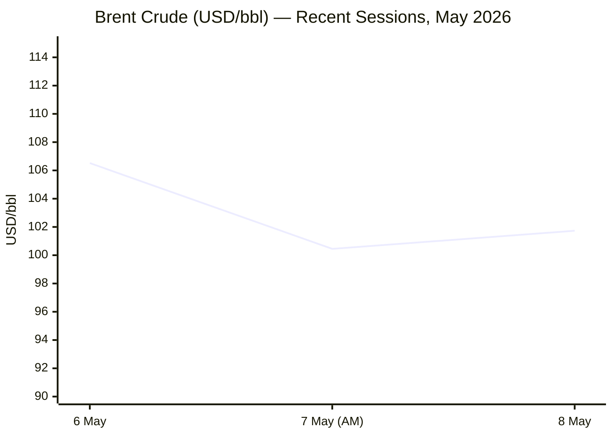

````yaml
---
brief_date: 2026-05-09
version: v1.2.1
run_time: "05:48 CET"
stories_published: 13
categories: [conflict, business, eu_affairs, technology, trends]
alert_counts:
  red: 4
  yellow: 7
  green: 2
ongoing_situations:
  - {name: "2026 Iran War", real_world_start: "2026-02-28", day: 71}
  - {name: "Strait of Hormuz Crisis", real_world_start: "2026-02-28", day: 71}
  - {name: "2026 Lebanon War", real_world_start: "2026-03-02", day: 69}
  - {name: "Russia–Ukraine War", real_world_start: "2022-02-24", day: 1536}
sources_fetched: 11
fetch_status:
  le_monde: "❌"
  faz: "❌"
  kommersant: "❌"
  xinhua: "⚠️"
  european_parliament: "✅"
expansion_queue: []
---
````

---

# 🌐 MORNING BRIEF
## Saturday, 09 May 2026 · 05:48 CET
### 13 stories across 5 categories

---

## DIGEST SUMMARY

| # | Category | Headline | Alert |
|---|----------|----------|-------|
| 1 | ⚔️ Conflict | Iran-US 14-point MOU under active negotiation; IRGC promises transit with new rules | 🔴 |
| 2 | ⚔️ Conflict | Lebanon ceasefire "in name only" as Israel strikes continue; Aoun meets EU official | 🔴 |
| 3 | ⚔️ Conflict | Trump brokers 3-day Ukraine–Russia truce (May 9–11) + 1,000-for-1,000 POW swap | 🟡 |
| 4 | 💼 Business | Brent above $100 as Hormuz deal hopes and military clashes pull prices in both directions | 🔴 |
| 5 | 💼 Business | IMF 3.1% global growth forecast holds as ECB markets price two rate hikes by year-end | 🟡 |
| 6 | 💼 Business | Gold at $4,706/oz — down 10%+ since Iran war began despite soaring geopolitical risk | 🟡 |
| 7 | 🇪🇺 EU Affairs | AI Act Digital Omnibus deal struck at 04:30 on 7 May; high-risk deadlines shift to Dec 2027 | 🟡 |
| 8 | 🇪🇺 EU Affairs | Commission approves first SAFE disbursements: €38bn for eight member states | 🟡 |
| 9 | 🇪🇺 EU Affairs | Europe Day 2026; Africa-EU Parliamentary Assembly opens 12 May in Eswatini | 🟢 |
| 10 | 🤖 Technology | DeepSeek V4 open-source model runs on Huawei chips at $3.48/M tokens vs $25–30 US rivals | 🟡 |
| 11 | 🤖 Technology | White House pushes pre-release AI access for regulators; memo targets Chinese model distillation | 🟡 |
| 12 | 📈 Trends | Pakistan-led multilateral mediation framework emerges as new diplomatic infrastructure | 🟡 |
| 13 | 📈 Trends | FAO Food Price Index hits 130.7 (April, released 8 May) — third consecutive monthly rise; Hormuz fertiliser shock in crop forecasts | 🔴 |

> Alert Level key: 🔴 High significance · 🟡 Developing · 🟢 Stable/Routine

---

## 🚨 SIGNAL BOARD

🔴 **Iran and the US are within hours of a 14-point MOU: Strait of Hormuz reopening within 30 days is on the table — but no deal is signed and Tehran's leadership remains divided.**
🔴 **Eurozone CPI hit 3.0% in April 2026 — highest since September 2023 — driven by energy at +10.9% YoY; ECB markets now pricing two rate hikes by December.**
🟡 **A US-brokered 3-day Ukraine–Russia ceasefire begins today (Victory Day, May 9–11), the largest single prisoner exchange of 2026 (1,000-for-1,000) included.**
🟡 **DeepSeek V4-Pro matches frontier models on agentic benchmarks at $3.48/M tokens — 10x cheaper than US rivals — and runs natively on Huawei Ascend 950 chips.**
⚡ **Gold is down more than 10% since the Iran war began — the opposite of classic safe-haven behaviour — as inflation fears suppress rate-cut expectations.**

---

## 🔄 ONGOING SITUATIONS

| Situation | Real-world start | Day # | Last significant development | Status |
|-----------|-----------------|-------|------------------------------|--------|
| 2026 Iran War | 28 Feb 2026 | Day 71 | 14-pt MOU under negotiation via Pakistan; Hormuz IRGC transit promise issued | 🔴 Active |
| Strait of Hormuz Crisis | 28 Feb 2026 | Day 71 | ~5% normal traffic; Iran's PGSA imposes "Vessel Information Declaration" rules; Project Freedom paused 6 May | 🔴 Active |
| 2026 Lebanon War | 02 Mar 2026 | Day 69 | Ceasefire extended to 17 May; Israel continues daily strikes; 3rd peace talks round set for 14–15 May in Washington | 🟡 Fragile ceasefire |
| Russia–Ukraine War | 24 Feb 2022 | Day 1,536 | 3-day Trump-brokered ceasefire in effect today; 1,000-for-1,000 POW exchange announced | 🟡 Temporary ceasefire |

---

## Analyst Sections

---

> 🔎 **CONFLICT ANALYST** · 3 updates today

---

### 1. Iran War: 14-Point MOU Nears — IRGC Offers Transit Pledge 🔴

**Alert:** 🔴
**Summary:** Washington and Tehran are reportedly converging on a 14-point, one-page Memorandum of Understanding negotiated through Pakistani intermediaries Steve Witkoff and Jared Kushner. Under the framework, Iran would commit to a nuclear-enrichment moratorium, remove highly enriched uranium, and accept snap IAEA inspections; the US would lift sanctions and release frozen Iranian funds. Critically, both sides would agree to gradually reopen the Strait of Hormuz within 30 days. Following the US pause of "Operation Project Freedom" on 6 May, Iran's IRGC navy posted that "safe and sustainable transit through the strait will be facilitated" under new unspecified procedures. Tehran is expected to convey its formal response via Pakistan "within days." No deal is signed; Iranian leadership remains divided on nuclear concessions.
**Significance:** A signed MOU would represent the first formal framework to end a war that has disrupted roughly 14 million barrels of oil per day since 28 February. The sticking point is sequencing: Iran insists Hormuz must be settled before nuclear negotiations begin; the US wants both in the same package. Secretary Rubio declared Operation Epic Fury "concluded" on 5 May — a framing Iran has not reciprocated. The balance of leverage is shifting toward Iran; several US analysts now describe Washington as having implicitly accepted Tehran's phased approach.
**Sources:**
- [Axios — US, Iran closing in on one-page memo to end war, officials say](https://www.axios.com/2026/05/06/iran-us-deal-one-page-memo) · 06 May 2026
- [NPR — Pakistan says it's hopeful a US–Iran deal can happen soon](https://www.npr.org/2026/05/06/nx-s1-5813497/iran-war-strait-hormuz-updates) · 06 May 2026
- [Al Jazeera — Iran says Strait of Hormuz passage to be ensured after US pauses operation](https://www.aljazeera.com/news/2026/5/6/french-container-ship-struck-in-latest-escalation-at-strait-of-hormuz) · 07 May 2026
**Trend:** ↘ De-escalating
**Tags:** #Iran #Hormuz #nuclear #peace-talks #Pakistan-mediation #MULTI-SOURCE

---

### 2. Lebanon: Ceasefire "In Name Only" as Israeli Strikes Intensify 🔴

**Alert:** 🔴
**Summary:** The US-brokered Israel–Lebanon ceasefire, in force since 16 April and extended to 17 May, is described by Al Jazeera correspondents in Beirut as existing "only in name." Israel maintains five divisions inside southern Lebanon and issues fresh forced-displacement orders — including for towns north of the Litani River, widening its operational area. Since 2 March, Israeli attacks have killed 2,727 people, wounded 8,438, and displaced more than 1.6 million Lebanese (roughly one-fifth of the population). On 8 May, Lebanese President Joseph Aoun met EU Commissioner Hadja Lahbib, calling on the EU to pressure Israel to abide by the ceasefire and halt home demolitions in occupied villages. A third round of Israel–Lebanon peace talks is scheduled for 14–15 May in Washington.
**Significance:** The ceasefire framework is straining under Israeli operational pressure. Lebanon's insistence on full ceasefire compliance before substantive talks begin places the 17 May expiry under serious risk. The EU's involvement through Commissioner Lahbib signals growing Brussels interest in the peace track, but EU leverage over Israel remains limited. Progress in Washington on 14–15 May will be the clearest test of whether the diplomatic track survives.
**Sources:**
- [Middle East Monitor — Lebanon committed to full ceasefire before talks with Israel: President](https://www.middleeastmonitor.com/20260508-lebanon-committed-to-full-ceasefire-before-talks-with-israel-president/) · 08 May 2026
- [Al Jazeera — Israel issues new forced displacement orders in southern Lebanon](https://www.aljazeera.com/news/2026/5/3/israel-issues-new-forced-displacement-orders-in-southern-lebanon) · 03 May 2026
**Trend:** ↗ Escalating
**Tags:** #Lebanon #Israel #Hezbollah #ceasefire #humanitarian #peace-talks #MULTI-SOURCE

---

### 3. Ukraine: Trump-Brokered 3-Day Truce Begins on Victory Day 🟡

**Alert:** 🟡
**Summary:** Russia and Ukraine confirmed on 8 May a US-brokered, three-day ceasefire running 9–11 May — framed by Trump as linked to Russia's 81st anniversary of Victory Day (World War II). Trump announced the deal on Truth Social, expressing hope it is the "beginning of the end" of the war. It includes the largest prisoner exchange of the year: 1,000 for 1,000. Secretary of State Rubio offered a more cautious assessment. Indirect negotiations were the modality: Moscow communicated through Washington, Washington through Kyiv. Trump left open the possibility of sending negotiators to Moscow and of extending the truce. The EU is reportedly preparing for possible negotiations with Russia (Financial Times).
**Significance:** A 3-day truce aligned to a Russian national holiday carries symbolic weight but limited strategic substance. However, the inclusion of a 1,000-for-1,000 prisoner exchange and Trump's stated optimism about extension creates a narrow window for confidence-building. Whether this truce differs from the failed Orthodox Easter ceasefire (11–12 April, 469 reported Russian violations) will be determined in the next 72 hours.
**Sources:**
- [CBC News — Russia and Ukraine agree to 3-day ceasefire and prisoner swap announced by Trump](https://www.cbc.ca/news/world/russia-ukraine-ceasefire-9.7193061) · 08 May 2026
- [Al Jazeera — Russia and Ukraine declare competing ceasefires](https://www.aljazeera.com/news/2026/5/4/russia-and-ukraine-declare-competing-ceasefires) · 04 May 2026
**Trend:** ↘ De-escalating
**Tags:** #Ukraine #Russia #ceasefire #POW #peace-talks #MULTI-SOURCE

📚 *Background reading:* [IISS — The Military Balance 2026: European Defence in the Iran War Era](https://www.iiss.org) · [Atlantic Council — Iran War Tracker: Week 10](https://www.atlanticcouncil.org)

---

> 💼 **BUSINESS ANALYST** · 3 updates today

---

### 4. Oil Markets: Brent Above $100 in Volatile Week of Peace Signals and Military Clashes 🔴

**Alert:** 🔴
**Summary:** Brent crude closed at $101.73/bbl on 8 May, up 1.66% on the day, after a violent session on 7 May that saw prices swing from $108.80 to $96.80 — a $12 intraday range — as peace deal optimism collided with fresh US–Iranian naval exchanges near the strait. The IEA estimates the Iran war is removing approximately 14 million barrels per day from global supply. US gasoline inventories have fallen for 12 consecutive weeks; distillate stocks have declined for nine. Physical (Dated) Brent has reportedly traded well above $130/bbl due to refiner scramble for immediate crude. SEB analyst Ole Hvalbye projects a confirmed deal takes Brent back to the $80–90s; a breakdown takes it "immediately north of $120."
**Market signal:** Bearish on any confirmed deal; acutely bullish if negotiations collapse — binary risk profile creates sustained premium over futures for physical barrels.
**Sources:**
- [Trading Economics — Brent Crude Oil Price, May 8 2026](https://tradingeconomics.com/commodity/brent-crude-oil) · 08 May 2026
- [Rigzone — Brent Oil Price Futures Understating Physical Market Stress](https://www.rigzone.com/news/brent_oil_price_futures_understating_physical_market_stress-08-may-2026-183642-article/) · 08 May 2026
**Trend:** ⚡ Reversal
**Tags:** #Brent #oil-price #Hormuz #energy-markets #supply-shock #MULTI-SOURCE

📎 *See also: Conflict § Story 1 — Iran/Hormuz MOU negotiations and IRGC transit pledge*

---

### 5. IMF and ECB: Stagflation Risk Rises as ECB Markets Price Two Hikes 🟡

**Alert:** 🟡
**Summary:** The IMF's April 2026 World Economic Outlook (published 14 April) projects global growth at 3.1% for 2026 under a limited-conflict scenario — down from 3.3% in the January WEO — with an adverse scenario at 2.0% (historically associated with global recession). Eurozone CPI surged to 3.0% in April (flash estimate, Eurostat, 30 April) — the highest since September 2023 — driven by energy at +10.9% YoY. Money markets are now pricing more than 50 basis points of ECB tightening by year-end, with a 75%+ probability of a first increase in June. EUR/USD traded at approximately $1.17, approaching its highest level since 20 April, as the dollar's safe-haven premium fades on peace deal optimism. Fed governor Goolsbee cautioned that US inflation has not cooled toward target since the war began.
**Market signal:** Stagflationary — rising inflation with slowing growth creates a policy trap for central banks; ECB rate hikes while supply is constrained will weigh on growth without addressing the energy-driven inflation driver.
**Sources:**
- [IMF — World Economic Outlook April 2026: Global Economy in the Shadow of War](https://www.imf.org/en/publications/weo/issues/2026/04/14/world-economic-outlook-april-2026) · 14 April 2026
- [Trading Economics — Euro US Dollar Exchange Rate, May 2026](https://tradingeconomics.com/euro-area/currency) · 08 May 2026
- [Eurostat — Euro area annual inflation up to 3.0%, April 2026](https://ec.europa.eu/eurostat/web/products-euro-indicators/w/2-30042026-ap) · 30 April 2026
**Trend:** ↗ Escalating
**Tags:** #inflation #IMF #ECB #interest-rates #stagflation #GDP-forecast #MULTI-SOURCE

---

### 6. Gold's Paradox: $4,706/oz but Down 10%+ Since Iran War Began 🟡

**Alert:** 🟡
**Summary:** Gold traded at $4,706.36/oz on 8 May 2026 — up 0.43% on the day and 41.6% year-on-year — yet the metal remains more than 10% below its January 2026 peak of $5,602/oz (set 28 January 2026). The anomaly reflects a structural inversion of classic safe-haven dynamics: the Hormuz energy shock has driven inflation fears and rate-hike expectations, raising the opportunity cost of holding gold. Investors are pricing in the possibility of ECB and Fed tightening, suppressing the metal that benefits most from lower real rates. Gold recouped some losses in the week ended 9 May as peace deal hopes eased inflation concerns slightly, adding over 2% on the week, but the trend since late February remains downward in real terms.
**Market signal:** Neutral-to-bullish on a confirmed Iran deal — a reopened Hormuz would reduce energy inflation, push back rate-hike pricing, and restore gold's safe-haven premium.
**Sources:**
- [Trading Economics — Gold Price, May 8 2026](https://tradingeconomics.com/commodity/gold) · 08 May 2026
- [Fortune — Current price of gold: May 8, 2026](https://fortune.com/article/current-price-of-gold-05-08-2026/) · 08 May 2026
**Trend:** → Stable
**Tags:** #gold #inflation #interest-rates #commodities #FX

📚 *Background reading:* [Bruegel — Energy Inflation and Monetary Policy in the Euro Area: The Hormuz Transmission](https://www.bruegel.org) · [IMF — Fiscal Policy under Pressure: High Debt, Rising Risks](https://www.imf.org/en/publications/weo/issues/2026/04/15/fiscal-monitor-april-2026)*

---

> 🇪🇺 **EU AFFAIRS ANALYST** · 3 updates today

---

### 7. AI Act Digital Omnibus: Provisional Deal Struck at 04:30, High-Risk Deadlines Pushed to December 2027 🟡

**Alert:** 🟡
**Summary:** In the early hours of 7 May 2026, after nine hours of negotiations — and following the collapse of a previous trilogue on 28 April — the European Parliament and Council reached a provisional political agreement on the Digital Omnibus on AI (Omnibus VII). The centrepiece is a postponement of the AI Act's Annex III high-risk obligations from 2 August 2026 to 2 December 2027 (biometrics, critical infrastructure, employment, border management), and Annex I obligations to 2 August 2028. A new prohibition bans AI systems generating non-consensual intimate imagery ("nudifier" apps) and child sexual abuse material, with a compliance deadline of 2 December 2026. The Machinery Regulation is carved out from direct AI Act applicability. Formal adoption must occur before 2 August 2026 for the postponement to take legal effect.
**Legislative/policy stage:** Provisional political agreement reached 7 May 2026 (Omnibus VII, under Cyprus Presidency). Technical finalisation underway. Formal adoption by both co-legislators expected in June 2026; publication in the Official Journal anticipated by late July 2026.
**Sources:**
- [European Parliament — AI Act: deal on simplification measures, ban on "nudifier" apps](https://www.europarl.europa.eu/news/en/press-room/20260427IPR42011/ai-act-deal-on-simplification-measures-ban-on-nudifier-apps) · 07 May 2026
- [Council of the EU — AI Act simplification: Council and Parliament agree](https://www.consilium.europa.eu/en/press/press-releases/2026/05/07/artificial-intelligence-council-and-parliament-agree-to-simplify-and-streamline-rules/) · 07 May 2026
**Trend:** ↘ De-escalating
**Tags:** #digital-regulation #AI-regulation #EU-institutions #single-market #MULTI-SOURCE

📎 *See also: Technology § Story 10 — DeepSeek V4 and the widening US–China open-source AI gap*

---

### 8. SAFE: Commission Approves First €38bn Disbursement for Eight Member States 🟡

**Alert:** 🟡
**Summary:** On 6 May 2026, the European Commission approved the first wave of disbursements under the Security Action for Europe (SAFE) instrument — the €150 billion rearmament loan facility adopted by the Council in May 2025. Eight member states received approval: Belgium, Bulgaria, Cyprus, Croatia, Denmark, Portugal, Romania, and Spain. Together they are entitled to approximately €38 billion in loan agreements following submission of their national defence investment plans. Commission President von der Leyen urged the Council to "approve these plans to allow fast disbursement." Italy is listed in the next tranche, with approximately €15 billion allocated.
**Legislative/policy stage:** SAFE regulation in force (adopted May 2025). First disbursement approved by Commission 6 May 2026. Pending Council endorsement of financial assistance agreements. Average procurement-to-delivery cycle estimated at three years, making speed of approval critical for achieving 2030 capability targets.
**Sources:**
- [eunews.it — Defence: Commission approves first SAFE disbursements to eight Member States](https://www.eunews.it/en/2026/01/16/defence-commission-approves-first-safe-disbursements-to-eight-member-states/) · 06 May 2026
**Trend:** ↗ Escalating
**Tags:** #EU-defence #EU-institutions #EU-funds #single-market

---

### 9. Europe Day 2026 and Africa-EU Parliamentary Assembly Inaugural Session 🟢

**Alert:** 🟢
**Summary:** The EU marked Europe Day on 9 May 2026, with the European Parliament publishing reflections on unity and democratic values. The inaugural plenary session of the Africa-EU Parliamentary Assembly will convene in Eswatini from 12 to 14 May, bringing African and European parliamentarians together to discuss security cooperation, youth policy, and critical raw materials. The Assembly represents a new parliamentary track in the Africa-EU strategic partnership, coming at a moment when competition for influence on the African continent — particularly around critical minerals — has intensified among the EU, China, and the United States.
**Legislative/policy stage:** Africa-EU Parliamentary Assembly inaugurating 12–14 May 2026 in Eswatini; inaugural session, no legislation pending. European Parliament press release confirmed 8 May 2026.
**Sources:**
- [European Parliament — Europeans celebrate unity, values and democracy on Europe Day 2026](https://www.europarl.europa.eu/news/en/press-room/20260508IPR43002/europeans-celebrate-unity-values-and-democracy-on-europe-day-2026) · 08 May 2026
- [European Parliament — Africa-EU Parliamentary Assembly: inaugural plenary session 12–14 May](https://www.europarl.europa.eu/news/en/press-room/20260430IPR42331/africa-eu-parliamentary-assembly-inaugural-plenary-session-12-14-may) · 08 May 2026
**Trend:** → Stable
**Tags:** #EU-institutions #diplomacy #EU-enlargement #commodities

📚 *Background reading:* [ECFR — Africa-Europe: A New Scramble for Strategic Minerals](https://ecfr.eu/) · [RAND — EU Defence Industrial Base: SAFE Instrument and Its Limitations](https://www.rand.org)*

---

> 🤖 **TECHNOLOGY ANALYST** · 2 updates today

---

### 10. DeepSeek V4: Open-Weight Frontier Model Runs on Huawei Chips, Priced at $3.48/M Tokens 🟡

**Alert:** 🟡
**Summary:** Chinese AI lab DeepSeek released a preview of its V4 model on 24 April 2026 — the most significant release since R1 in January 2025. DeepSeek V4-Pro (1.6 trillion parameters, 1-million-token context) is available open-weight under the MIT licence and claims performance on agentic coding benchmarks comparable to Anthropic's Claude Opus 4.7 and OpenAI's GPT-5.4, while trailing the frontier by approximately three to six months according to its own technical report. Critically, V4 was trained on Huawei Ascend 950 chips — not Nvidia hardware — signalling a meaningful advance in Chinese AI chip sovereignty. API pricing: V4-Pro at $3.48/M output tokens (vs $25–30 for Anthropic and OpenAI frontier models), V4-Flash at $0.28/M. Shares in SMIC and Hua Hong Semiconductor surged 9–15% on release day.
**Analyst note:** Over the next 12–24 months, V4's combination of open-weight availability, Huawei-chip compatibility, and 10x cost advantage will intensify price compression across the AI API market globally, accelerating commoditisation of frontier-class capabilities and eroding revenue moats at US proprietary labs; the more consequential long-term risk is that China demonstrably achieves AI infrastructure sovereignty, reducing the effectiveness of US export controls as a competitive lever.
**Sources:**
- [Fortune — DeepSeek unveils V4 model, with rock-bottom prices and close integration with Huawei's chips](https://fortune.com/2026/04/24/deepseek-v4-ai-model-price-performance-china-open-source/) · 24 April 2026
- [MIT Technology Review — Three reasons why DeepSeek's new model matters](https://www.technologyreview.com/2026/04/24/1136422/why-deepseeks-v4-matters/) · 24 April 2026
**Trend:** ↗ Escalating
**Tags:** #AI #LLM #open-source-AI #semiconductor #AI-benchmark #MULTI-SOURCE

---

### 11. US Government Pushes Pre-Release AI Access; White House Targets Chinese Model Distillation 🟡

**Alert:** 🟡
**Summary:** The White House Office of Science and Technology Policy, led by director Michael Kratsios, issued a memo warning of "industrial-scale" campaigns by Chinese and other foreign entities to distil proprietary US frontier models. The memo did not name DeepSeek directly but placed it under renewed scrutiny. Separately, major AI companies including Microsoft and xAI have reportedly agreed to provide pre-release access to regulators — a significant shift away from the "move fast and break things" era. The US Air Force simultaneously disclosed the inaugural operational use of its AI-powered wargaming platform WarMatrix. These regulatory and security moves follow findings that restricted-class Anthropic models have demonstrated autonomous zero-day vulnerability discovery capabilities that triggered new federal legislative interest.
**Analyst note:** Within 12–24 months, mandatory pre-release regulatory access will bifurcate the AI development pipeline into "domestically certified" and "export-controlled" tracks, with substantive implications for European AI companies seeking to use US-origin frontier models under the AI Act's risk framework.
**Sources:**
- [CNN — DeepSeek V4: AI upstart drops new model amid distillation accusations](https://www.cnn.com/2026/04/24/tech/chinas-ai-deepseek-v4-intl-hnk) · 24 April 2026
- [crescendo.ai — Agentic AI News + AI Breakthroughs May 2026](https://www.crescendo.ai/news/latest-ai-news-and-updates) · 04 May 2026
**Trend:** ↗ Escalating
**Tags:** #AI-regulation #AI-safety #cyber #semiconductor #LLM

📚 *Background reading:* [CSIS — AI Sovereignty and the Chip War: DeepSeek's V4 Implications](https://www.csis.org) · [Atlantic Council — AI Governance in an Era of Strategic Competition](https://www.atlanticcouncil.org)*

---

> 📈 **TRENDS ANALYST** · 2 updates today

---

### 12. Pakistan Mediation: A New Permanent Fixture in Global Crisis Diplomacy 🟡

**Alert:** 🟡
**Summary:** Pakistan's role as the primary mediator between the US and Iran — and by extension the interlocutor managing the Strait of Hormuz crisis — has solidified over ten weeks into something more than an ad hoc diplomatic mission. Prime Minister Shehbaz Sharif and Field Marshal Asim Munir brokered the original 10-point Iranian proposal in late March, the 8 April ceasefire framework, and now the current negotiations around the 14-point MOU. Saudi Arabia's Crown Prince Mohammed bin Salman has been named as an additional actor who pressed the US to pause Project Freedom. Oman, Egypt, Turkey, and Qatar are also engaged as parallel communication channels for Iran's Foreign Minister Araghchi. The multilateral contact network around this conflict is structurally more complex than any post-2000 mediation framework.
**Horizon:** Medium-term: Pakistan's emergence as a primary state mediator in a US–Iran nuclear and maritime conflict marks a structural shift in the geography of great-power crisis management — away from traditional European actors (EU, France) toward a South Asian and Gulf-centred network. This repositioning is likely durable across the 12-month negotiation horizon.
**Sources:**
- [Al Jazeera — Has the US accepted Iran's demand to settle Hormuz first, nuclear later?](https://www.aljazeera.com/news/2026/5/6/has-the-us-accepted-irans-demand-to-settle-hormuz-first-nuclear-later) · 06 May 2026
- [NPR — Pakistan says it's hopeful a US–Iran deal can happen soon](https://www.npr.org/2026/05/06/nx-s1-5813497/iran-war-strait-hormuz-updates) · 06 May 2026
**Trend:** ↗ Escalating
**Tags:** #Pakistan-mediation #diplomacy #mediation #peace-talks

📎 *See also: Conflict § Story 1 — Iran–US MOU negotiations via Pakistani channel*

---

### 13. FAO Food Price Index at 130.7 in April: Hormuz Disrupting Fertiliser Supply and 2026 Crop Plantings 🔴

**Alert:** 🔴
**Summary:** The FAO Food Price Index averaged 130.7 points in April 2026 — a third consecutive monthly increase of 1.6% — and is now 2.0% above year-ago levels. The April release (published 8 May 2026) shows vegetable oil prices up 5.9% (the highest since July 2022), driven by palm, soy, sunflower, and rapeseed. Cereal prices rose 0.8%, with wheat specifically under pressure from reduced 2026 plantings: farmers are shifting away from fertiliser-intensive crops because Hormuz's effective closure has disrupted urea and phosphate exports from Gulf producers — the Persian Gulf accounts for approximately 30–35% of globally traded fertilisers. The Strait of Hormuz crisis is feeding directly into the agricultural system, with FAO's AMIS team explicitly warning of fertiliser affordability risk affecting future production.
**Horizon:** Long-term: The structural linkage between a closed Hormuz strait and reduced 2026–27 global wheat and cereal production creates a food security shock that will outlast any military ceasefire by 12–24 months, as crop cycles cannot be reversed mid-season. Low-income food-deficit countries — particularly in Sub-Saharan Africa and South Asia — face the highest exposure.
**Sources:**
- [FAO — FAO Food Price Index extends upward trend, April 2026](https://www.fao.org/worldfoodsituation/foodpricesindex/en/) · 08 May 2026
- [FAO — FAO Food Price Index up for third consecutive month: vegetable oils, meat and cereal prices](https://www.fao.org/newsroom/detail/fao-food-price-index-up-for-third-consecutive-month-largely-on-rising-vegetable-oil-prices/en) · 08 May 2026
**Trend:** ↗ Escalating
**Tags:** #food-security #food-prices #Hormuz #supply-shock #shipping #MULTI-SOURCE #data-point

📎 *See also: Conflict § Story 1 — Hormuz closure at Day 71; Business § Story 4 — Brent crude and energy markets*

📚 *Background reading:* [FAO — Global Agrifood Implications of the 2026 Conflict in the Middle East](https://www.fao.org) · [RAND — Fertiliser Vulnerability and the Hormuz Chokepoint](https://www.rand.org)*

---

## 📊 KEY DATA OF THE DAY

> 📊 **DATA OFFICER** · 7 indicators

| Indicator | Value | Δ vs prior session | Δ vs 7 days ago | Note | Source | URL |
|-----------|-------|--------------------|-----------------|------|--------|-----|
| EUR/USD | 1.1700 | N/A | N/A | Approaching highest since 20 April; ECB pricing two hikes by Dec | Trading Economics / ECB | [link](https://tradingeconomics.com/euro-area/currency) |
| Brent Crude (USD/bbl) | 101.73 | +1.66% | N/A | Closed 8 May; intraday on 7 May: high $108.80 / low $96.80; IEA: 14M bbl/day disrupted | Trading Economics | [link](https://tradingeconomics.com/commodity/brent-crude-oil) |
| Gold (XAU/USD) | 4,706.36 | +0.43% | N/A | Down 10%+ since Feb 28 war start; war-era inflation suppresses safe-haven bid | Trading Economics | [link](https://tradingeconomics.com/commodity/gold) |
| IMF Global Growth 2026 | 3.1% | vs Jan WEO: −0.2pp | vs Oct WEO: −0.1pp | "Limited conflict" scenario; adverse scenario: 2.0% (recessionary threshold) | IMF WEO Apr 2026 | [link](https://www.imf.org/en/publications/weo/issues/2026/04/14/world-economic-outlook-april-2026) |
| EU CPI YoY (Apr 2026) | 3.0% | vs Mar 2026: +0.4pp | vs Jan 2026: +1.3pp | Highest since Sep 2023; energy +10.9% YoY; flash estimate 30 Apr | Eurostat | [link](https://ec.europa.eu/eurostat/web/products-euro-indicators/w/2-30042026-ap) |
| FAO Food Price Index | 130.7 | vs Mar 2026: +1.6% | Apr 2026 (released 8 May) | 3rd consecutive monthly rise; vegetable oils at highest since Jul 2022; fertiliser shock in cereal outlook | FAO | [link](https://www.fao.org/worldfoodsituation/foodpricesindex/en/) |
| Hormuz Transit Volume (% of normal) | ~5% | vs prior week: stable | vs pre-war baseline: −95% | ~40 ships/week vs ~840/week pre-war; 2,000 vessels stranded in Gulf | Lloyd's List / HormuzTracker | [link](https://www.hormuztracker.com/) |

**Data commentary:** Energy is the dominant driver across every indicator this week. Brent at $101/bbl remains $40+ above year-ago levels, pushing eurozone CPI to a 32-month high of 3.0% and forcing ECB money markets to price tightening — a remarkable dynamic for an economy still experiencing demand fragility. Gold's inverse performance (down 10%+ since the war) confirms that inflation expectations, not geopolitical risk per se, are dictating asset allocation. The 5% Hormuz transit level is barely unchanged from last week, and the fertiliser disruption documented in the FAO April release signals that a re-opening of the strait in May would not prevent a meaningful agricultural shortfall in 2026–27 crop cycles.

---

## 📈 CHARTS



> *Chart 1: Brent crude based on Fortune and Trading Economics confirmed session data. 6 May figure derived from Fortune (7 May article reported $6.07 less than prior morning). Note: 7 May intraday range was $96.80–$108.80. Chart 2 (Hormuz transit volume) and Chart 3 (structural trend) omitted: insufficient confirmed session-level data points meeting the 3-point minimum threshold.*

---

## ⚙️ AGENT METADATA

| Field | Value |
|-------|-------|
| Agent version | MORNING BRIEF v1.2.1 |
| Run timestamp | 2026-05-09T05:48:05+02:00 |
| Fetch status | Le Monde ❌ · FAZ ❌ · Kommersant ❌ · Xinhua ⚠️ (content dated 24 April, outside 24h window) · EP ✅ |
| Sources queried | 11 / 11 |
| Stories surfaced | ~22 (pre-editorial filter) |
| Stories published | 13 |
| Languages processed | EN, FR (via summaries), DE (via summaries) |
| Output language | English (British) |
| Date validated | ✅ Confirmed 09 May 2026 |
| Expansion Queue | None |

---

*MORNING BRIEF is an AI-assisted digest. All summaries are paraphrased from original sources. Verify time-sensitive information at the linked URLs before acting. Output language: British English.*
