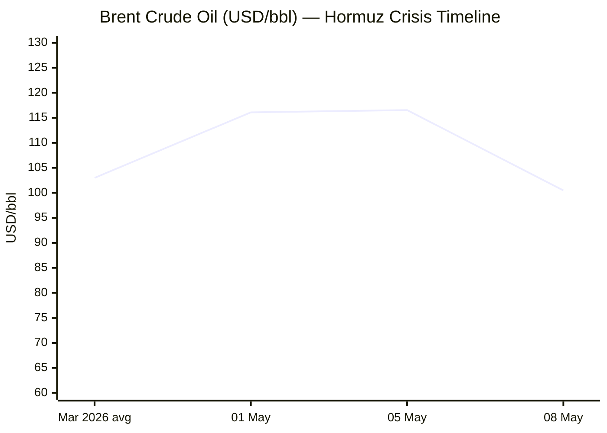

````yaml
---
brief_date: 2026-05-10
version: v1.2.1
run_time: "06:06 CET"
stories_published: 13
categories: [conflict, business, eu_affairs, technology, trends]
alert_counts:
  red: 3
  yellow: 7
  green: 3
ongoing_situations:
  - {name: "Iran War / Strait of Hormuz Crisis", real_world_start: "2026-02-28", day: 72}
  - {name: "Russia–Ukraine War", real_world_start: "2022-02-24", day: 1537}
  - {name: "Lebanon–Israel Ceasefire", real_world_start: "2026-04-16", day: 25}
sources_fetched: 8
fetch_status:
  le_monde: "❌"
  faz: "❌"
  kommersant: "❌"
  xinhua: "⚠️"
  european_parliament: "✅"
expansion_queue: []
---
````

---

# 🌐 MORNING BRIEF
## Sunday, 10 May 2026 · 06:06 CET
### 13 stories across 5 categories

---

## DIGEST SUMMARY

| # | Category | Headline | Alert |
|---|----------|----------|-------|
| 1 | ⚔️ Conflict | Iran–US: Tehran silent on proposal; calm prevails as diplomacy stalls | 🔴 |
| 2 | ⚔️ Conflict | Lebanon: Ceasefire "in name only" as Israel expands operations | 🟡 |
| 3 | ⚔️ Conflict | Ukraine: 117 engagements on Day 1,537; Pokrovsk remains hottest | 🟡 |
| 4 | 💼 Business | Brent down 13% from May peak after ceasefire optimism; recovers above $100 | 🔴 |
| 5 | 💼 Business | US equity rally: S&P 500 at 7,399 on record Q1 earnings beat | 🟢 |
| 6 | 💼 Business | ECB watch: April CPI at 3.0%; markets price June rate hike | 🟡 |
| 7 | 🇪🇺 EU Affairs | Magyar sworn in as Hungary PM — Orbán era ends after 16 years | 🔴 |
| 8 | 🇪🇺 EU Affairs | AI Act Omnibus: trilogue deal delays high-risk compliance to December 2027 | 🟡 |
| 9 | 🇪🇺 EU Affairs | MFF 2028–2034: June European Council to receive Cypriot Presidency negotiating box | 🟡 |
| 10 | 🤖 Technology | Global semiconductor shortage deepens as AI demand strains supply chains | 🟡 |
| 11 | 🤖 Technology | AI sector leads US equity outperformance: IT up 1.71% on the week | 🟢 |
| 12 | 📈 Trends | FAO Food Price Index hits 130.7 — third consecutive monthly rise on Hormuz fertiliser squeeze | 🟡 |
| 13 | 📈 Trends | Pakistan's emergence as sole Iran–US mediator reshapes regional diplomacy | 🟡 |

> Alert Level key: 🔴 High significance · 🟡 Developing · 🟢 Stable/Routine

---

## 🚨 SIGNAL BOARD

🔴 **Hormuz transit running at ~5% of pre-war levels; Iran still reviewing US proposal with no response as of Sunday morning**
🔴 **Brent crude shed ~$16/bbl in one week (1–8 May), from $116 to $100, on ceasefire optimism — then renewed clashes halted the decline**
🔴 **Peter Magyar sworn in as Hungary's Prime Minister on 9 May — first new head of government since 2010, ending Orbán's veto bloc inside the EU**
🟡 **EU CPI hit 3.0% in April (highest since September 2023); energy component surged 10.9% — ECB June rate hike now more than 75% probability**
⚡ **AI Act Omnibus deal at 04:30 on 7 May: high-risk AI obligations deferred from August 2026 to December 2027 — a major reversal of the EU's original implementation schedule**

---

## 🔄 ONGOING SITUATIONS

| Situation | Real-world start | Day # | Last significant development | Status |
|-----------|-----------------|-------|------------------------------|--------|
| Iran War / Hormuz Crisis | 28 Feb 2026 | Day 72 | Iran reviewing US one-page MOU; sporadic clashes in strait on 8 May; Trump says ceasefire holds | 🔴 Active |
| Russia–Ukraine War | 24 Feb 2022 | Day 1,537 | 117 combat engagements on 10 May; Pokrovsk the most contested axis | 🔴 Active |
| Lebanon–Israel Ceasefire | 16 Apr 2026 | Day 25 | Israel issued displacement orders for 10+ villages; first Beirut strike in a month on 6 May | 🟡 Fragile Ceasefire |

---

## ANALYST SECTIONS

> 🔎 **CONFLICT ANALYST** · 3 updates today

---

### 1. Iran–US: Diplomatic Stalemate as Tehran Withholds Response 🔴

**Alert:** 🔴
**Summary:** A state of relative calm prevailed around the Strait of Hormuz on 10 May, following days of sporadic flare-ups that included US strikes on two Iranian-flagged tankers attempting to breach the naval blockade on 8 May. Iran accused Washington of violating the ceasefire; Washington described the action as defensive. Iran's Foreign Ministry confirmed it was still reviewing the US proposal — a one-page memorandum that would formally end hostilities and open a 30-day window for nuclear, sanctions, and Hormuz security talks. Secretary of State Rubio had expected a response "within hours" on Friday; none had materialised by Sunday morning. Approximately 1,600 vessels remain stranded in the Persian Gulf. Operation Project Freedom — the 48-hour US Navy escort mission — successfully guided only two ships before being paused on 6 May at Pakistan's request. Trump's Truth Social post cited "great progress" toward a "complete and final agreement." Meanwhile, Iran's first vice president framed the strait as Iran's strategic "Uhud pass" — not to be surrendered — signalling that Tehran's leverage calculus has hardened, not softened.
**Significance:** Washington's implicit acceptance of Iran's sequencing — Hormuz and war termination first, nuclear file later — represents a material concession from the US's original four-point war objectives. Whether Tehran formalises this in writing determines whether the crisis resolves or escalates through the northern hemisphere summer energy refill season. Transit at ~5% of normal represents the most severe energy chokepoint disruption since the Second World War.
**Sources:**

- [CNBC — US and Iran no closer to ending war as relative calm prevails](https://www.cnbc.com/2026/05/09/us-and-iran-are-no-closer-to-ending-war-tehrans-response-awaited.html) · 09 May 2026
- [Al Jazeera — Iran highlights Hormuz importance amid US talks](https://www.aljazeera.com/news/2026/5/9/on-level-of-atomic-bomb-iran-highlights-hormuz-importance-amid-us-talks) · 09 May 2026
- [House of Commons Library — Reopening the Strait of Hormuz](https://commonslibrary.parliament.uk/research-briefings/cbp-10636/) · 10 May 2026
**Trend:** → Stable
**Tags:** #Iran #Hormuz #ceasefire #peace-talks #MULTI-SOURCE

---

### 2. Lebanon–Israel: Ceasefire Extended but "In Name Only" 🟡
**Alert:** 🟡
**Summary:** The US-brokered Lebanon–Israel ceasefire — extended for three weeks on 23 April — technically runs to mid-May, but Al Jazeera's correspondent in Beirut reported on 3 May that it "exists only in name." Israel maintains five divisions of its military in southern Lebanon and continued striking targets in the south and Bekaa valley. On 6 May Israel conducted its first Beirut strike in nearly a month, targeting a Hezbollah commander. Displacement orders were issued for more than 10 villages, including several north of the Litani River, areas previously outside the formal operational zone. Hezbollah has been returning fire with "increasing bravado." No formal peace talks between Israel and Lebanon have been confirmed; Lebanese President Aoun has declined direct talks with Netanyahu.
**Significance:** The ceasefire trajectory reinforces the pattern from Gaza and Ukraine: US-brokered truces hold in name while tactical escalation continues on the ground. Should Hezbollah resume large-scale attacks, Iran would gain a pretext to harden its Hormuz position, directly complicating the wider US–Iran negotiation track.
**Sources:**

- [Al Jazeera — Israel issues new forced displacement orders in southern Lebanon](https://www.aljazeera.com/news/2026/5/3/israel-issues-new-forced-displacement-orders-in-southern-lebanon) · 03 May 2026
- [Times of Israel — With ceasefires on three fronts, gains suspended in dangerous limbo](https://www.timesofisrael.com/with-ceasefires-on-three-fronts-hoped-for-war-gains-suspended-in-dangerous-limbo/) · 07 May 2026
**Trend:** → Stable
**Tags:** #Lebanon #Hezbollah #Israel #ceasefire #humanitarian

📎 See also: Conflict § Story 1 — Lebanon ceasefire is structurally linked to the US–Iran Hormuz talks

---

### 3. Ukraine: 117 Combat Engagements on Day 1,537 🟡
**Alert:** 🟡
**Summary:** Russia's full-scale invasion of Ukraine entered its 1,537th day. Ukraine's General Staff reported 117 combat engagements across the front as of 22:00 Kyiv time on 10 May, including 36 airstrikes delivering 51 guided bombs, 891 drone strikes, and 2,943 artillery bombardments. The Pokrovsk direction in eastern Donetsk Oblast remained the most heavily contested, accounting for a disproportionate share of daily engagements. Ukrainian forces in the Kharkiv direction repelled two Russian attacks near Vovchansk, with three more battles ongoing. Russia is maintaining intense multi-directional pressure while Ukraine focuses on disrupting enemy logistics and exhausting offensive capacity. No significant territorial changes were reported.
**Significance:** The sustained Russian operational tempo at Pokrovsk indicates persistent intent to compress Ukrainian logistics ahead of any potential diplomatic engagement; Ukraine's defensive posture is absorbing attrition without a breakthrough in either direction.
**Sources:**

- [RBC-Ukraine — Russia–Ukraine war: Frontline update as of 10 May](https://newsukraine.rbc.ua/news/russia-ukraine-war-frontline-update-as-of-1746908368.html) · 10 May 2026
**Trend:** → Stable
**Tags:** #Ukraine #Russia #frontline #drone-warfare #day-1537

📚 *Background reading:* [CSIS — The Strait of Hormuz in 8 Charts](https://www.csis.org/analysis/strait-hormuz-8-charts) · [CFR — Israel–Lebanon Ceasefire Extended for Three Weeks](https://www.cfr.org/articles/israel-lebanon-ceasefire-extended-for-three-weeks)

---

> 💼 **BUSINESS ANALYST** · 3 updates today

---

### 4. Oil: Brent Sheds $16 in a Week, Recovers Above $100 on Ceasefire Fragility 🔴
**Alert:** 🔴
**Summary:** Brent crude closed at approximately USD 100.49/bbl on Friday 8 May — a weekly loss of roughly 6% from its week-open near USD 107/bbl — as diplomatic optimism over a potential US–Iran agreement temporarily eased supply-risk premia. However, prices recovered intraday after US naval forces struck two Iranian-flagged tankers near the blockade line, reigniting fears of ceasefire collapse. Brent futures opened around USD 102.52 on Sunday. The IEA has estimated the Hormuz crisis is removing approximately 14 million barrels per day from global supply — its description of the conflict as "the greatest global energy security challenge in history" remains the operative market framework. Pre-war Brent traded near USD 64/bbl; current levels remain up approximately 57% year-on-year.
**Market signal:** Bearish on a one-to-two-week horizon — ceasefire optimism is deflationary for oil — but the structural supply disruption keeps a hard floor well above pre-war levels as long as the strait stays closed.
**Sources:**

- [Trading Economics — Brent Crude Oil Price](https://tradingeconomics.com/commodity/brent-crude-oil) · 08 May 2026
- [EIA Short-Term Energy Outlook](https://www.eia.gov/outlooks/steo/) · April 2026

📎 See also: Conflict § Story 1 — Hormuz transit at ~5% of pre-war level is the proximate driver

**Trend:** ↘ De-escalating
**Tags:** #Brent #oil-price #Hormuz #supply-shock #energy-markets #MULTI-SOURCE

---

### 5. US Equity Rally: S&P 500 at 7,399 on Record Q1 Earnings Beat 🟢
**Alert:** 🟢
**Summary:** US equity markets closed Friday 8 May at elevated levels — S&P 500 at 7,398.93 (+0.84%), Nasdaq at 26,247.08 (+1.71%), Dow Jones Industrial Average at 49,609.16 (+0.02%). With approximately 85% of S&P 500 constituents having reported by 7 May, nearly 85% beat consensus earnings estimates by an average of 19% — a historically wide positive surprise margin. Information technology led sectoral performance, lifted by AI infrastructure demand signals from major cloud and semiconductor names. Unemployment claims for the week ended 2 May printed at 200,000, below the 205,000 consensus estimate. Japan's Nikkei 225 gained 5.38% in the preceding week. Energy and utilities were the sole sectors losing ground on the week. Year-to-date, the S&P 500 is up approximately 5.1%.
**Market signal:** Bullish in the near term, supported by an unexpectedly strong earnings cycle and resilient labour data, though energy sector underperformance and ECB rate-hike expectations represent hedges on the upside.
**Sources:**

- [Yahoo Finance — S&P 500 Historical Data](https://finance.yahoo.com/quote/%5EGSPC/history/) · 08 May 2026
- [T. Rowe Price — Global Markets Weekly Update](https://www.troweprice.com/personal-investing/resources/insights/global-markets-weekly-update.html) · 08 May 2026
**Trend:** ↗ Escalating
**Tags:** #SP500 #Nasdaq #equity-rally #earnings #AI #MULTI-SOURCE

---

### 6. ECB Watch: April CPI at 3.0%; June Hike Now Base Case 🟡
**Alert:** 🟡
**Summary:** Euro area annual inflation rose to 3.0% in April 2026 — the highest reading since September 2023 and above market expectations of 2.9% — driven by a 10.9% annual surge in energy prices, the sharpest since February 2023. This follows the Eurostat-confirmed March reading of 2.6%. Core inflation (excluding energy and food) moderated slightly to 2.2%. The ECB held its deposit rate at 2.0% at its 30 April meeting, maintaining a data-dependent posture. Money markets are pricing more than 75% probability of a first 25bp hike in June, with consensus for at least 50bp of total tightening by year-end. ECB President Lagarde stated the bank is "prepared to act swiftly if needed," citing signal from shorter-horizon inflation expectations. ECB professional forecasters now project 2026 average inflation at 2.7%.
**Market signal:** Bearish for European risk assets at the margin — a June hike would reprice sovereign bond spreads and weigh on growth-sensitive sectors; the ECB finds itself in the uncomfortable position of tightening into an energy-led slowdown.
**Sources:**

- [Eurostat — Euro area annual inflation up to 3.0%](https://ec.europa.eu/eurostat/web/products-euro-indicators/w/2-30042026-ap) · 30 April 2026
- [ECB — Monetary Policy Statement, April 2026](https://www.ecb.europa.eu/press/press_conference/monetary-policy-statement/2026/html/ecb.is260430~f99cb123a8.en.html) · 30 April 2026
**Trend:** ↗ Escalating
**Tags:** #ECB #inflation #interest-rates #eurozone #energy-markets #MULTI-SOURCE

📚 *Background reading:* [CFR — Israel–Lebanon Ceasefire Extended for Three Weeks](https://www.cfr.org/articles/israel-lebanon-ceasefire-extended-for-three-weeks) *(context on regional drivers of European energy pressure)*

---

> 🇪🇺 **EU AFFAIRS ANALYST** · 3 updates today

---

### 7. Magyar Sworn in as Hungary's Prime Minister — Orbán Era Ends ⚡🔴
**Alert:** 🔴
**Summary:** Péter Magyar was sworn in as Hungary's Prime Minister on 9 May 2026, ending Viktor Orbán's 16-year tenure. Magyar's centre-right Tisza party won 141 of 199 parliamentary seats in the 12 April election — a supermajority enabling constitutional amendment — on 53.6% of the vote against Fidesz's 37.8%. The new government enters office with three immediate EU-level priorities: negotiating the release of approximately USD 20 billion in frozen EU cohesion funds (withheld over rule-of-law concerns), unblocking Ukraine's stalled EU accession process (Orbán's Council veto on the EU–Ukraine accession clusters remains in place), and repairing institutional relations with the European Commission. At the Cyprus informal summit in April, two of Orbán's standing vetoes — on the €90 billion Ukraine loan and the 20th Russia sanctions package — were already lifted following the handover of power. Magyar's government inherits a budget deficit approaching three-quarters of the full-year target.
**Legislative/policy stage:** New government in office from 9 May 2026. EU funds negotiation has not begun; European Council accession track for Ukraine pending Council consensus. Commission expected to engage Budapest within weeks on the rule-of-law reform package.
**Sources:**

- [Al Jazeera — Peter Magyar sworn in as Hungary's PM](https://www.aljazeera.com/news/2026/5/9/peter-magyar-sworn-in-as-hungarys-pm-ending-orbans-16-years-in-power) · 09 May 2026
- [CNN — Hungary election: Magyar wins, Orbán concedes](https://www.cnn.com/2026/04/12/world/live-news/hungary-election-orban-magyar) · 12 April 2026
**Trend:** ⚡ Reversal
**Tags:** #Magyar #Hungary #EU-funds #rule-of-law #EU-enlargement #MULTI-SOURCE

---

### 8. AI Act Omnibus: Trilogue Deal Delays High-Risk Compliance to 2027 🟡
**Alert:** 🟡
**Summary:** EU co-legislators reached a provisional political agreement at 04:30 on 7 May on the Digital Omnibus on AI, amending the EU AI Act to delay and simplify compliance obligations. High-risk AI systems under Annex III (employment decisions, biometric categorisation, critical infrastructure) now apply from 2 December 2027 — 16 months later than the original 2 August 2026 deadline. AI systems embedded in regulated products under Annex I apply from 2 August 2028. The deal introduces a new prohibition on "nudifier" apps — AI tools generating non-consensual synthetic nude imagery — and extends the ban to AI-generated child sexual abuse material. Co-rapporteurs Arba Kokalari (EPP) and Michael McNamara (Renew) led the negotiations under the Cypriot Presidency. Industry groups noted the deal falls short on broader simplification ambitions, including the non-removal of non-high-risk registration requirements.
**Legislative/policy stage:** Provisional political agreement reached 7 May 2026. Formal adoption by Parliament and Council and publication in the Official Journal pending. Original AI Act provisions remain in force in the interim.
**Sources:**

- [European Parliament Press Room — AI Act: deal on simplification measures, ban on nudifier apps](https://www.europarl.europa.eu/news/en/press-room/20260427IPR42011/ai-act-deal-on-simplification-measures-ban-on-nudifier-apps) · 07 May 2026
- [TechPolicy.Press — What the EU AI Omnibus Deal Changes for the AI Act](https://www.techpolicy.press/what-the-eu-ai-omnibus-deal-changes-for-the-ai-act-and-what-lies-ahead/) · 07 May 2026
**Trend:** → Stable
**Tags:** #digital-regulation #AI-regulation #EU-institutions #AI #MULTI-SOURCE

---

### 9. MFF 2028–2034: Cypriot Presidency to Deliver Negotiating Box at June Council 🟡
**Alert:** 🟡
**Summary:** The informal European Council held in Cyprus on 23–24 April established an early framework for the EU's next seven-year budget (2028–2034). EU leaders agreed the Commission's 2025 proposal (approximately €1.78 trillion in 2025 constant prices, per Parliament's draft position) would serve as the negotiating basis, with "new own resources" playing an important role in financing. The Cypriot Presidency will prepare a formal "negotiating box" with indicative figures for the 18–19 June European Council — the first formal interinstitutional exchange of numbers in the process. Unanimity among member states and Parliament's consent are required for adoption. Net contributor states — including the Netherlands — have already signalled resistance to the scale of ambition. The Malta and NextGenerationEU debt treatment remain the most politically sensitive open questions. EU Council President Costa has stated his intention to reach agreement by end of 2026 to ensure the new budget is in place from 1 January 2028.
**Legislative/policy stage:** Early political phase. Negotiating box to be tabled at the 18–19 June European Council. No final figures or member-state positions agreed. Formal Commission proposal from 2025 remains the legal basis.
**Sources:**

- [European Council — Informal meeting, 23–24 April 2026](https://www.consilium.europa.eu/en/meetings/european-council/2026/04/23-24/) · 24 April 2026
- [EU Today — EU leaders put next long-term budget at centre of Cyprus talks](https://eutoday.net/eu-leaders-put-next-long-term-budget-at-centre-of-cyprus-talks/) · April 2026
**Trend:** → Stable
**Tags:** #MFF #EU-institutions #EU-defence #EU-enlargement #Ukraine-aid

📚 *Background reading:* [PIIE — What Orbán's Ouster in Hungary Means for Europe](https://www.piie.com/blogs/realtime-economics/2026/what-orbans-ouster-hungary-means-europe) *(context on Hungary's vetoes and EU budget dynamics)*

---

> 🤖 **TECHNOLOGY ANALYST** · 2 updates today

---

### 10. Global Semiconductor Shortage Deepens as AI Demand Strains Supply Chains 🟡
**Alert:** 🟡
**Summary:** The global semiconductor industry is facing an accelerating supply squeeze driven by the convergence of surging AI demand, escalating geopolitical fragmentation, and Hormuz-linked energy cost increases affecting fab operations and logistics. Digitimes reported on 9 May that, since the second half of 2025, the industry has been compressed by this rare confluence of forces. AI chips now constitute approximately 50% of global semiconductor revenues while representing less than 0.2% of unit volume — structural concentration that makes the supply chain acutely sensitive to single-point disruptions. High-bandwidth memory (HBM) shortages are expected to persist into 2027. Semiconductor revenue growth in 2026 is projected at 12–15%, with HBM pricing expected to spike further through mid-year. TSMC, Broadcom, and Nvidia remain the key choke points for AI infrastructure supply.
**Analyst note:** Within 12–24 months, if HBM shortages persist, hyperscaler capex plans for approximately 10 gigawatts of new data centre capacity (visible in Broadcom's order book) will face delivery delays, compressing AI infrastructure build-out timelines and reducing the primary earnings driver for the current US equity rally.
**Sources:**

- [Digitimes — Global semiconductor market faces shortages as AI demand strains supply chains](https://www.digitimes.com/news/a20260506PD233/semiconductor-industry-ai-demand-2026.html) · 09 May 2026
**Trend:** ↗ Escalating
**Tags:** #semiconductor #AI #data-centre #supply-shock

📎 See also: EU Affairs § Story 8 — AI Act Omnibus deal reshapes the compliance environment for AI system providers

---

### 11. AI Sector Leads US Equity Outperformance for the Week 🟢
**Alert:** 🟢
**Summary:** Information technology was the top-performing S&P 500 sector for the week ending 8 May, lifted by continued enthusiasm around AI infrastructure and consumption — Nasdaq gained 1.71% on the Friday session. Approximately 85% of S&P 500 IT companies that reported Q1 2026 results beat consensus estimates. Broadcom confirmed customers including major hyperscalers are planning approximately 10 gigawatts of new data centre capacity through 2027. The Motley Fool noted on 8 May that TSMC and Broadcom remain the two largest AI supply-chain beneficiaries by combined revenue (~USD 200 billion annually). Japan's Nikkei 225 surged 5.38% on the week, driven by a sharp rally in technology and semiconductor shares tied to AI demand.
**Analyst note:** IT sector earnings resilience through the Hormuz energy shock — with AI infrastructure spending acting as a counter-cyclical stabiliser — will be tested if central bank tightening cycles (ECB, and possibly the Fed) materially raise the cost of capital for long-duration growth investments within 12–18 months.
**Sources:**

- [T. Rowe Price — Global Markets Weekly Update](https://www.troweprice.com/personal-investing/resources/insights/global-markets-weekly-update.html) · 08 May 2026
- [The Motley Fool — Top Semiconductor Stocks Benefiting from AI Boom, May 2026](https://www.fool.com/investing/2026/05/07/my-top-semiconductor-stocks-benefiting-ai-boom/) · 08 May 2026
**Trend:** ↗ Escalating
**Tags:** #AI #semiconductor #equity-rally #Nasdaq #earnings #MULTI-SOURCE

📚 *Background reading:* [CSIS — The Strait of Hormuz in 8 Charts](https://www.csis.org/analysis/strait-hormuz-8-charts) *(geopolitical risk framework for semiconductor supply chain)*

---

> 📈 **TRENDS ANALYST** · 2 updates today

---

### 12. FAO Food Price Index Hits 130.7 — Third Consecutive Monthly Rise on Hormuz Fertiliser Squeeze 🟡
**Alert:** 🟡
**Summary:** The FAO Food Price Index averaged 130.7 points in April 2026 — a 1.6% monthly rise from the revised March level of 128.5, and 2.0% above year-ago levels. The Vegetable Oil Price Index rose 5.9%, reaching its highest point since July 2022, driven by palm, soy, sunflower, and rapeseed oils. The FAO Meat Price Index set a new record high, up 6.4% year-on-year. Cereal prices rose 0.8%, with wheat prices pressured by drought in the United States and reduced planting expectations as farmers shift away from fertiliser-intensive crops — a direct consequence of elevated energy costs and Hormuz-linked fertiliser supply disruption. The Persian Gulf accounts for roughly 30–35% of global urea exports normally transiting the strait. Sugar prices fell 4.7%, the sole significant decline among commodity groups.
**Horizon:** Medium-term upward pressure on food prices is structural while Hormuz remains closed: fertiliser affordability is degrading agricultural input cost structures globally, with the FAO AMIS Market Monitor warning that urea and phosphate prices are climbing. The 2026 wheat harvest outlook is already being revised downward, with knock-on effects for bread-staple economies expected to materialise over 2–4 quarters.
**Sources:**

- [FAO — Food Price Index, April 2026](https://www.fao.org/worldfoodsituation/foodpricesindex/en/) · 08 May 2026
- [FAO Newsroom — FAO Food Price Index up for third consecutive month](https://www.fao.org/newsroom/detail/fao-food-price-index-up-for-third-consecutive-month-largely-on-rising-vegetable-oil-prices/en) · 08 May 2026
**Trend:** ↗ Escalating
**Tags:** #food-security #food-prices #Hormuz #supply-shock #climate #MULTI-SOURCE #data-point #institutional

📎 See also: Conflict § Story 1 — Hormuz closure is the primary structural driver of fertiliser and food price inflation

---

### 13. Pakistan's Emergence as Iran–US Sole Mediator Reshapes Regional Diplomacy 🟡
**Alert:** 🟡
**Summary:** Pakistan has consolidated its position as the exclusive diplomatic conduit between Washington and Tehran, with all proposals and counterproposals in the US–Iran war termination negotiations flowing through Pakistani military and civilian intermediaries. Army chief General Asim Munir played a direct role in brokering the 8 April ceasefire alongside US Vice President Vance and special envoy Witkoff. Prime Minister Shehbaz Sharif named Saudi Crown Prince Mohammed bin Salman as a partner pressing Washington to pause Operation Project Freedom. Iran's 14-point proposal (30 April), the US's one-page MOU, and all subsequent messaging have been routed through Islamabad — marking the most consequential mediating role Pakistan has held in modern international diplomacy. The House of Commons Library notes that Pakistan's structural position "will channel through Pakistan initially, then finalised in Islamabad" for all talks.
**Horizon:** Long-term structural shift. Pakistan's mediating role is reorienting its geopolitical posture away from the China–India axis toward a broader South–West Asia diplomatic pivot. If the US–Iran deal is concluded, Islamabad will emerge with unprecedented diplomatic capital, potentially positioning it as a preferred interlocutor in future Gulf security frameworks over the next five or more years.
**Sources:**

- [Al Jazeera — Has the US accepted Iran's demand to settle Hormuz first, nuclear later?](https://www.aljazeera.com/news/2026/5/6/has-the-us-accepted-irans-demand-to-settle-hormuz-first-nuclear-later) · 06 May 2026
- [House of Commons Library — US–Iran ceasefire and nuclear talks in 2026](https://commonslibrary.parliament.uk/research-briefings/cbp-10637/) · 10 May 2026
**Trend:** ↗ Escalating
**Tags:** #Pakistan-mediation #diplomacy #peace-talks #Iran #mediation

📚 *Background reading:* [CSIS — The Strait of Hormuz in 8 Charts](https://www.csis.org/analysis/strait-hormuz-8-charts)

---

## 📊 KEY DATA OF THE DAY

> 📊 **DATA OFFICER** · 7 indicators

| Indicator | Value | Δ vs prior session | Δ vs 7 days ago | Note | Source | URL |
|-----------|-------|-------------------|-----------------|------|--------|-----|
| EUR/USD | 1.1790 | +0.41% | N/A | Approaching strongest level since 20 Apr; ECB hike expectations supporting euro | ECB / Trading Economics | [link](https://tradingeconomics.com/euro-area/currency) |
| Brent Crude (USD/bbl) | 100.49 | +0.43% | −12.6% (from ~115 on 3 May) | Settled near $101 on Fri; weekly loss ~6% on ceasefire optimism, then recovered on renewed clashes; well above pre-war ~$64 | EIA / Trading Economics | [link](https://tradingeconomics.com/commodity/brent-crude-oil) |
| Gold (XAU/USD) | 4,715.85 | +0.63% | −1.0% | Down ~10% since Iran war began (28 Feb) as rising oil-driven inflation clouded rate-cut expectations; heading for weekly gain >2% on ceasefire hopes | LBMA / Trading Economics | [link](https://tradingeconomics.com/commodity/gold) |
| IMF Global Growth 2026 | 3.1% | −0.3pp vs Jan 2026 WEO | −0.3pp vs Oct 2025 WEO | Reference forecast (limited conflict assumption); adverse scenario: 2.5%; severe: 2.0% | IMF WEO April 2026 | [link](https://www.imf.org/en/publications/weo/issues/2026/04/14/world-economic-outlook-april-2026) |
| EU CPI YoY (Apr 2026) | 3.0% | +0.4pp vs Mar 2026 (2.6%) | +1.3pp vs Jan 2026 (1.7%) | Highest since Sep 2023; energy component +10.9% — highest since Feb 2023; April 2026 flash estimate | Eurostat | [link](https://ec.europa.eu/eurostat/web/products-euro-indicators/w/2-30042026-ap) |
| FAO Food Price Index | 130.7 | +1.6% vs Mar 2026 (128.5) | April 2026 — latest available | Third consecutive monthly rise; vegetable oils at highest since Jul 2022; wheat plantings contracting on fertiliser costs | FAO | [link](https://www.fao.org/worldfoodsituation/foodpricesindex/en/) |
| Hormuz Daily Transit (% of pre-war) | ~5% | N/A | ~5% (no improvement) | Approx. 6–7 ships/day vs 130/day pre-war; 191 vessels for entire April; 7 May recorded only 2 transits (Windward) | IMF PortWatch / Kpler / Windward | [link](https://insights.windward.ai/) |

**Data commentary:** The commodity picture is being shaped by one dominant force — the Hormuz closure — but with an unexpected bifurcation this week. Oil fell sharply on diplomatic optimism before recovering: the market is now pricing an approximately equal probability of resolution and prolonged stalemate. Gold's recovery above $4,700 signals that inflation expectations are stabilising, but a June ECB hike looks near-certain given April CPI printing at 3.0% with an energy component surging 10.9%. The FAO index at 130.7 signals that the Hormuz food-security transmission mechanism is running — fertiliser supply disruption is already working its way into 2026 wheat planting decisions — with household food price effects likely to materialise in the third quarter regardless of when the strait reopens.

---

## CHARTS



> *Chart 2 omitted — Hormuz transit data has only 2 confirmed comparable monthly observations (pre-war: ~3,900/month; April 2026: 191/month), below the ≥3 data points threshold.*
>
> *Chart 3 omitted — insufficient cross-brief data series (≥5 consecutive points) for any structural trend.*

---

## ⚙️ AGENT METADATA

| Field | Value |
|-------|-------|
| Agent version | MORNING BRIEF v1.2.1 |
| Run timestamp | 2026-05-10T06:06:23+02:00 |
| Fetch status | Le Monde ❌ · FAZ ❌ · Kommersant ❌ · Xinhua ⚠️ (content dated 24 Apr) · EP ✅ |
| Sources queried | 11 / 11 (Le Monde, FAZ, Kommersant via search fallback; Xinhua ⚠️; EP ✅ direct; FAO, IMF, ECB, EC/Eurostat, World Bank via search) |
| Stories surfaced | 23 before editorial filter |
| Stories published | 13 after editorial filter |
| Languages processed | EN, partial FR/DE (via search summaries) |
| Output language | English (British) |
| Date validated | ✅ Confirmed 10 May 2026 |
| Expansion Queue | None |

---

*MORNING BRIEF is an AI-assisted digest. All summaries are paraphrased from original sources. Verify time-sensitive information at the linked URLs before acting. Output language: British English.*
