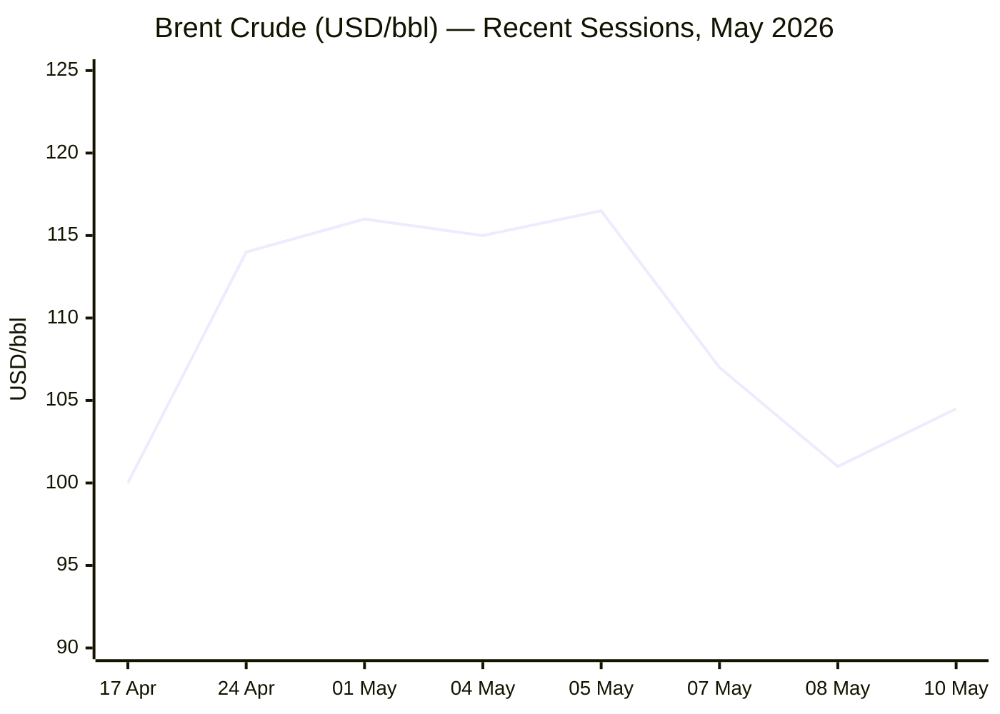
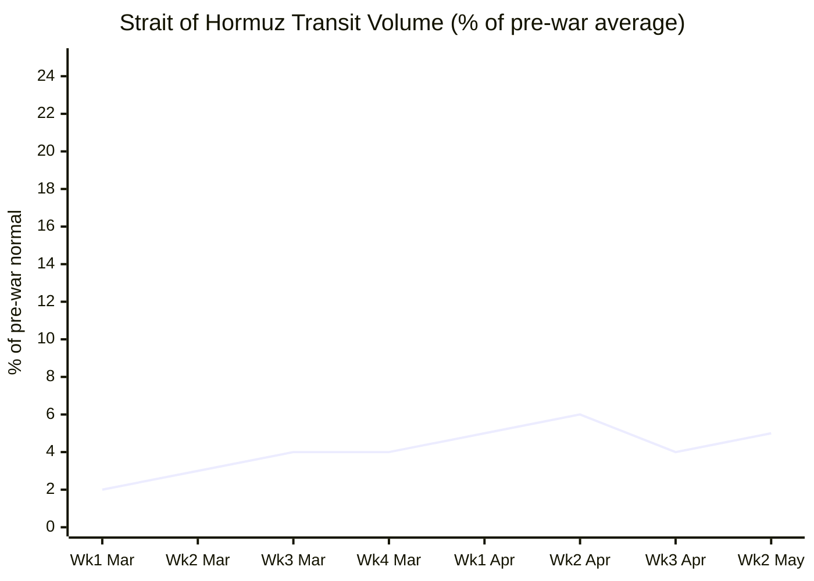

```yaml
---
brief_date: 2026-05-11
version: v1.2.1
run_time: "05:49 CET"
stories_published: 15
categories: [conflict, business, eu_affairs, technology, trends]
alert_counts:
  red: 3
  yellow: 10
  green: 2
ongoing_situations:
  - {name: "2026 Iran War / Strait of Hormuz Crisis", real_world_start: "2026-02-28", day: 73}
  - {name: "Russia-Ukraine War", real_world_start: "2022-02-24", day: 1538}
  - {name: "2026 Lebanon War / Ceasefire", real_world_start: "2026-03-02", day: 71}
sources_fetched: 11
fetch_status:
  le_monde: "❌"
  faz: "❌"
  kommersant: "❌"
  xinhua: "⚠️"
  european_parliament: "❌"
  fao: "✅"
  ecb: "❌"
  imf: "✅"
expansion_queue: []
---
```

# 🌐 MORNING BRIEF
## Monday, 11 May 2026 · 05:49 CET
### 15 stories across 5 categories

---

## DIGEST SUMMARY

| # | Category | Headline | Alert |
|---|----------|----------|-------|
| 1 | ⚔️ Conflict | Iran-US peace talks deadlocked; Trump rejects counter-proposal | 🔴 |
| 2 | ⚔️ Conflict | Qatar's Al Kharaitiyat completes first Hormuz LNG transit since war began | 🟡 |
| 3 | ⚔️ Conflict | Russia-Ukraine: US-backed 3-day ceasefire; Putin signals end "coming" | 🟡 |
| 4 | ⚔️ Conflict | Lebanon ceasefire under strain as Israel strikes Hezbollah infrastructure | 🟡 |
| 5 | 💼 Business | Brent rebounds +3.5% on Sunday as Iran deal collapses; weekly -9% | 🟡 |
| 6 | 💼 Business | US Trade Court blocks Trump's 10% global tariff; new legal uncertainty | 🟡 |
| 7 | 🇪🇺 EU Affairs | Trump sets July 4 ultimatum for EU Turnberry Accord ratification | 🟡 |
| 8 | 🇪🇺 EU Affairs | EU CPI reaches 3.0% in April — highest since September 2023 | 🔴 |
| 9 | 🇪🇺 EU Affairs | EU-Armenia summit concluded; Yerevan elections June 7 test EU trajectory | 🟢 |
| 10 | 🤖 Technology | OpenAI GPT-5.4 scores above human baseline on agentic OS benchmark | 🟡 |
| 11 | 🤖 Technology | AI-driven restructuring wave accelerates in May: Cloudflare, BILL, Upwork | 🟡 |
| 12 | 📈 Trends | FAO Food Price Index hits 3-year high as Hormuz energy shock enters food chain | 🔴 |
| 13 | 📈 Trends | Pakistan mediates Qatar-Iran LNG deal — Islamabad's strategic leverage grows | 🟡 |
| 14 | 📈 Trends | Iran war disrupts Bangladesh economy; diaspora remittances under pressure | 🟡 |
| 15 | 📈 Trends | EV adoption accelerates across Africa as fuel prices surge post-Hormuz | 🟢 |

> Alert level key: 🔴 High significance · 🟡 Developing · 🟢 Stable/Routine

---

## 🚨 SIGNAL BOARD

🔴 Trump rejects Iran's counter-proposal as "TOTALLY UNACCEPTABLE" — diplomacy deadlocked; US Energy Secretary warns military option returns "in the next few days" if no path to a negotiated settlement emerges.
🔴 EU HICP inflation at 3.0% in April (highest since Sep 2023), driven by a 10.9% energy spike; money markets now price >50bp of ECB rate hikes by year-end, with June odds above 75%.
🟡 Brent crude reversed a weekly -9% slide, jumping +3.5% to $104.50/bbl on Sunday after the Iran deal collapse erased peace-premium; a ceasefire deal remains the single biggest downside risk to energy prices.
🟡 Qatar's Al Kharaitiyat crossed the Strait of Hormuz on 10 May — the first Qatari LNG export since 28 February — under an Iran-approved G2G deal with Pakistan; symbolic, but transit traffic remains ~5% of pre-war normal.
⚡ The US-backed Russia-Ukraine 3-day ceasefire (May 9-11) expires today; Putin's post-Victory Day statement that the war is "coming to an end" is the most significant diplomatic signal from Moscow in months — though peace terms remain far apart.

---

## 🔄 ONGOING SITUATIONS

| Situation | Real-world start | Day # | Last significant development | Status |
|-----------|-----------------|-------|------------------------------|--------|
| 2026 Iran War / Hormuz Crisis | 28 Feb 2026 | Day 73 | Trump rejects Iran counter-proposal; Energy Sec warns of military resumption | 🔴 Active |
| Russia-Ukraine War | 24 Feb 2022 | Day 1538 | US-backed 3-day ceasefire expires today; Putin signals openness to diplomacy | 🟡 Partial ceasefire |
| 2026 Lebanon War / Ceasefire | 02 Mar 2026 | Day 71 | Israel strikes Hezbollah infrastructure in southern Lebanon; ceasefire extended to ~14 May | 🟡 Ceasefire fragile |

---

## ⚔️ CONFLICT

> 🔎 **CONFLICT ANALYST** · 4 updates today

### 1. Iran-US Peace Talks Hit Wall — Military Option Returns to Table 🔴
**Alert:** 🔴
**Summary:** Iranian state media confirmed Tehran submitted its counter-proposal to the US memorandum of understanding via Pakistani mediators on Sunday 10 May, but President Trump immediately rejected it on Truth Social as "TOTALLY UNACCEPTABLE." Iran's multi-page response demands: an end to the US naval blockade, sanctions relief within 30 days, recognition of Hormuz navigation rights, and — critically on the nuclear file — an enrichment pause rather than full dismantlement, along with export of some highly enriched uranium to a third country. The US sought a decades-long enrichment moratorium. US Energy Secretary Chris Wright warned that if no clear path to a negotiated settlement emerges "in the next few days," the US will revert to "the military method to open the strait." Iran's president Pezeshkian vowed Tehran will "never bow our heads before the enemy." A senior IRGC officer warned countries enforcing sanctions they will "face problems" transiting the strait.
**Significance:** The gap between the two sides' positions — the US demanding nuclear dismantlement and Hormuz free passage simultaneously; Iran demanding sanctions relief first before nuclear concessions — suggests a near-term deal is highly unlikely. The return of an explicit US military threat raises the risk of a fresh round of exchanges following the clashes of 7-8 May. Energy markets woke up Monday morning to a deteriorated diplomatic outlook.
**Sources:**
- [CNN — Live updates: Trump calls Iranian response to US peace proposal 'totally unacceptable'](https://www.cnn.com/2026/05/10/world/live-news/iran-war-news) · 10 May 2026
- [NBC News — Trump rejects Iran peace proposal as Tehran vows to confront 'enemies'](https://www.nbcnews.com/world/iran/iran-responded-us-proposal-peace-talks-state-media-reports-rcna344404) · 10 May 2026
- [CNBC — Trump rejects Iran peace proposal; Tehran vows to never bow](https://www.cnbc.com/2026/05/11/iran-war-trump-negotiation-hormuz-nuclear-talks.html) · 11 May 2026
**Trend:** ↗ Escalating
**Tags:** #Iran #Hormuz #peace-talks #nuclear #MULTI-SOURCE

---

### 2. First Qatari LNG Tanker Transits Hormuz Since War Began 🟡
**Alert:** 🟡
**Summary:** The Marshall Islands-flagged LNG carrier Al Kharaitiyat, managed by Qatar's Nakilat and loaded at Ras Laffan, successfully transited the Strait of Hormuz on the night of 10 May 2026 and entered the Gulf of Oman, bound for Port Qasim in Pakistan. The transit was approved by Iran under a government-to-government energy deal between Qatar and Pakistan, brokered on the sidelines of the peace negotiations. Iran approved the shipment partly to build confidence with Qatar and Pakistan — Islamabad's mediating role giving it informal leverage over Iranian shipping decisions. Two previous Qatari LNG tankers were turned back by the IRGC in April. Qatar, which produced nearly a fifth of global LNG supply in 2025, had been unable to export a single LNG cargo via the strait since 28 February; Iranian missile strikes on Ras Laffan earlier in the war damaged an estimated 17% of LNG export capacity.
**Significance:** The transit is a diplomatic signal, not an operational breakthrough — pre-war traffic ran at roughly three LNG shipments per day through the strait, and overall traffic remains near 5% of normal. The Iran-approved Iran-coast northern route used by the tanker remains subject to IRGC control and tolls. Pakistan's ability to secure this deal underscores its indispensable mediating role.
**Sources:**
- [The National — Qatari LNG tanker headed to Pakistan attempts Strait of Hormuz transit](https://www.thenationalnews.com/business/energy/2026/05/10/qatari-lng-tanker-headed-to-pakistan-attempts-strait-of-hormuz-transit/) · 10 May 2026
- [Fortune / Bloomberg — Qatar sends first LNG shipment through Hormuz since war started](https://fortune.com/2026/05/10/qatar-first-lng-shipment-hormuz-strait-iran-war-pakistan/) · 10 May 2026
**Trend:** ↘ De-escalating (marginal)
**Tags:** #Hormuz #Iran #shipping #Pakistan-mediation #energy-markets

📎 See also: Trends § Story 13 — Pakistan-Iran LNG deal as indicator of Islamabad's strategic leverage

---

### 3. Russia-Ukraine: US-Backed Ceasefire Expires Today; Putin Signals Diplomatic Opening 🟡
**Alert:** 🟡
**Summary:** The US-brokered 3-day ceasefire (9-11 May), which Trump announced Friday 8 May following direct calls with both presidents, expires today. The agreement included a suspension of all kinetic activity and an exchange of 1,000 prisoners from each side. Trump framed it as potentially "the beginning of the end" of the war. Speaking after Moscow's Victory Day parade on 9 May, Putin said the war was "coming to an end" and signalled readiness for direct talks with Zelenskyy in a third country — but only to sign a "final deal," not to negotiate it. Zelenskyy met EU and EPC leaders in Yerevan on 4 May and reiterated that Ukraine's territorial integrity must be the basis for any settlement. Russia's military continues offensive pressure on the Pokrovsk and Huliaipole axes; cumulative Russian combat losses since 24 February 2022 are estimated at approximately 1,341,110 personnel, according to Ukraine's General Staff as of 10 May.
**Significance:** Putin's public readiness to declare the war "almost over" is analytically significant: it may reflect genuine exhaustion with a war he cannot fully win, or it may be positioning to extract concessions under the cover of US diplomatic pressure. The expiry of today's ceasefire without a follow-on framework is the key risk indicator.
**Sources:**
- [Al Jazeera — Putin hints at ending Russia's war in Ukraine, but why now?](https://www.aljazeera.com/news/2026/5/10/putin-hints-at-ending-russias-war-in-ukraine-but-why-now) · 10 May 2026
- [NPR — Trump says Russia and Ukraine have agreed to his request for a 3-day ceasefire](https://www.npr.org/2026/05/09/nx-s1-5816478/trump-russia-ukraine-ceasefire) · 09 May 2026
**Trend:** ↘ De-escalating (tentative)
**Tags:** #Russia #Ukraine #ceasefire #peace-talks #frontline #MULTI-SOURCE

---

### 4. Lebanon Ceasefire Fragile as Israel Strikes Hezbollah Infrastructure 🟡
**Alert:** 🟡
**Summary:** The Israel-Lebanon ceasefire, extended for three weeks on 23 April to approximately 14 May 2026, is showing new strain. On Sunday 10 May, the Israeli military announced strikes on Hezbollah "infrastructure" in southern Lebanon, even as US-brokered negotiations on a permanent settlement and border demarcation continue. Hezbollah has not formally signed the ceasefire but indicated conditional acceptance, warning that Israeli military presence inside Lebanon justifies continued resistance. A senior Hezbollah official reiterated rejection of disarmament proposals that would be part of any final deal. The UAE and Kuwait also reported intercepting Iranian drones on Sunday, underscoring the continued risk of spillover across the Gulf, distinct from the Lebanon-Israel track.
**Significance:** The ceasefire's extension runs out around 14 May, and a further extension will require demonstrated progress in bilateral talks. The Hezbollah disarmament question — which Iran and Hezbollah have both publicly rejected — is a fundamental obstacle. Israeli forces remaining in southern Lebanon remain an ongoing flashpoint.
**Sources:**
- [CFR — Israel-Lebanon Ceasefire Extended for Three Weeks](https://www.cfr.org/articles/israel-lebanon-ceasefire-extended-for-three-weeks) · 07 May 2026
- [US State Dept — Ten Day Cessation of Hostilities to Enable Peace Negotiations](https://www.state.gov/releases/office-of-the-spokesperson/2026/04/ten-day-cessation-of-hostilities-to-enable-peace-negotiations-between-israel-and-lebanon) · 16 April 2026
**Trend:** ↗ Escalating
**Tags:** #Lebanon #Hezbollah #Israel #ceasefire #Iran

📚 *Background reading:* [Al Jazeera — What we know about the Israel-Lebanon ceasefire](https://www.aljazeera.com/news/2026/4/17/what-we-know-about-the-israel-lebanon-ceasefire) · [House of Commons Library — Israel/US-Iran conflict 2026: Reopening the Strait of Hormuz](https://commonslibrary.parliament.uk/research-briefings/cbp-10636/)

---

## 💼 BUSINESS

> 💼 **BUSINESS ANALYST** · 2 updates today

### 5. Brent Crude Rebounds on Peace Talks Collapse — Weekly Volatility Exceptional 🟡
**Alert:** 🟡
**Summary:** Brent crude futures settled near $101/bbl on Friday 8 May — a weekly loss of approximately 6-7% as markets had priced in hopes of a rapid peace deal and Hormuz reopening following lighter-than-expected US-Iran clashes earlier in the week. On Sunday 10 May, after Trump's "TOTALLY UNACCEPTABLE" rejection of Iran's counter-proposal, Brent futures rose 3.17% to approximately $104.50/bbl. The IEA has warned that the war is disrupting roughly 14 million barrels per day of global oil supply. Brent averaged $116/bbl in the first week of May before the partial peace-premium unwind; the prior-week pattern illustrates the extreme sensitivity of energy markets to negotiating signals from Washington and Tehran.
**Market signal:** Bearish on peace-deal resolution; bullish on physical supply constraint — the fundamental supply disruption from Hormuz closure keeps a floor under prices even as diplomatic headlines drive sharp intraweek swings.
**Sources:**
- [Trading Economics — Brent crude oil price](https://tradingeconomics.com/commodity/brent-crude-oil) · 08 May 2026
- [Fortune — Current price of oil as of May 5, 2026](https://fortune.com/article/price-of-oil-05-05-2026/) · 05 May 2026
**Trend:** ⚡ Reversal
**Tags:** #Brent #oil-price #Hormuz #Iran #market-shock

📎 See also: Conflict § Story 1 — US-Iran peace talks collapse; military option raised

---

### 6. US Trade Court Blocks Trump's 10% Global Tariff — EU-US Trade in New Legal Limbo 🟡
**Alert:** 🟡
**Summary:** A US Trade Court ruling on 7 May struck down the Trump administration's 10% across-the-board global tariff, the instrument currently applied to EU goods since the Supreme Court earlier invalidated IEEPA-based tariffs. The administration has now moved to deploy Section 122 authority to reimpose tariffs, creating new legal uncertainty. Trump simultaneously threatened "much higher" tariffs on EU goods if the Turnberry Accord is not ratified by 4 July (covered in EU Affairs § Story 7). In the immediate term, the court ruling complicates enforcement of existing EU tariff levels, even as negotiators met again on 10 May in a round of trade talks. European Parliament chief trade negotiator Bernd Lange characterised the talks as showing "good progress" but acknowledged "there is still some way to go."
**Market signal:** Neutral to mildly bearish for EU equities short-term — legal uncertainty around the tariff instrument adds unpredictability, but the July 4 deadline provides a clear catalyst date.
**Sources:**
- [CNBC — Trump threatens 'much higher' EU tariffs if deal not signed by July 4](https://www.cnbc.com/2026/05/08/trump-tariffs-trade-eu-europe-deal.html) · 08 May 2026
- [UPI — Trump gives EU until July 4 to implement trade deal or face 'much higher' tariffs](https://www.upi.com/Top_News/US/2026/05/08/trump-threatens-tariffs-EU/1621778245252/) · 08 May 2026
**Trend:** ↗ Escalating
**Tags:** #EU-institutions #single-market #sanctions #MULTI-SOURCE

📎 See also: EU Affairs § Story 7 — Turnberry Accord July 4 ultimatum; EP ratification stalled

📚 *Background reading:* [Bruegel — EU-US trade policy in the shadow of the Iran war](https://www.bruegel.org) · [CSIS — Strait of Hormuz in 8 Charts](https://www.csis.org/analysis/strait-hormuz-8-charts)

---

## 🇪🇺 EU AFFAIRS

> 🇪🇺 **EU AFFAIRS ANALYST** · 3 updates today

### 7. Trump Sets July 4 Ultimatum for EU Turnberry Accord Ratification 🟡
**Alert:** 🟡
**Summary:** Following a call with European Commission President von der Leyen on 7 May, President Trump set 4 July 2026 — the 250th anniversary of US independence — as the deadline for the European Parliament to ratify the Turnberry Accord, the EU-US trade framework reached at Trump's Scottish golf resort in July 2025. Trump had earlier this week threatened to raise tariffs on EU cars and trucks to 25% (from 15%) before granting the extension. Under the Accord, the EU committed to progressively reducing tariffs on US industrial goods to zero; the US committed to a 15% tariff ceiling on EU exports. The EP's ratification is stalled principally over MEPs' demand for safeguard clauses if Trump breaches commitments or threatens the territorial integrity of EU member states (referencing his earlier threats regarding Greenland). Member states prefer to ratify the original text without safeguards. A potential EP vote is pencilled in for 19 May. Von der Leyen confirmed "good progress is being made towards tariff reduction by early July."
**Legislative/policy stage:** European Parliament ratification pending; next plenary opportunity 19 May 2026. Council position: ready to ratify without safeguard amendments. US Trade Court has separately blocked Trump's current 10% tariff instrument, adding legal complexity.
**Sources:**
- [Al Jazeera — Trump sets July 4 deadline for EU tariff hike decision](https://www.aljazeera.com/economy/2026/5/7/trump-sets-july-4-deadline-for-eu-tariff-hike-decision) · 07 May 2026
- [Euronews — Trump gives EU until 4 July to implement trade deal or face 'much higher' tariffs](https://www.euronews.com/my-europe/2026/05/07/trump-gives-eu-until-4-july-to-implement-trade-deal-or-face-much-higher-tariffs) · 07 May 2026
**Trend:** ↗ Escalating
**Tags:** #EU-institutions #single-market #digital-regulation #MULTI-SOURCE

---

### 8. EU CPI Surges to 3.0% in April — Highest Since September 2023 🔴
**Alert:** 🔴
**Summary:** Eurostat's flash estimate released 30 April confirmed euro area annual HICP inflation at 3.0% in April 2026, up from 2.6% in March and the highest reading since September 2023. The acceleration was driven overwhelmingly by energy costs, which rose 10.9% year-on-year — the steepest gain since February 2023 — as Hormuz closure effects and supply rerouting push European energy prices structurally higher. Services inflation moderated slightly to 3.0% (from 3.2%), while core inflation (excluding energy and food) held at 2.2%. The ECB held rates unchanged at its April meeting (deposit rate: 2.0%; main refinancing: 2.15%), but money markets are now pricing more than 50 basis points of tightening by year-end, with a greater than 75% probability of a first hike in June. ECB President Lagarde on Friday acknowledged that "the euro area's economic starting position ahead of the energy shock is more favourable than before Russia's invasion," while noting readiness to act swiftly if needed.
**Legislative/policy stage:** ECB June Governing Council meeting (5 June) is the next live policy decision; the ECB is operationally independent and no legislative stage applies. Full April HICP data due 20 May.
**Sources:**
- [Eurostat — Euro area annual inflation up to 3.0%, April 2026 flash estimate](https://ec.europa.eu/eurostat/web/products-euro-indicators/w/2-30042026-ap) · 30 April 2026
- [ECB Data Portal — Inflation, April 2026](https://data.ecb.europa.eu/key-figures/inflation-and-other-prices/inflation) · 30 April 2026
- [Trading Economics — Euro Area Interest Rate](https://tradingeconomics.com/euro-area/interest-rate) · 30 April 2026
**Trend:** ↗ Escalating
**Tags:** #inflation #ECB #interest-rates #eurozone #energy-markets #MULTI-SOURCE #institutional

---

### 9. EU-Armenia Summit Concluded; Yerevan June 7 Elections Test European Trajectory 🟢
**Alert:** 🟢
**Summary:** The first-ever EU-Armenia bilateral summit, held 4-5 May 2026 in Yerevan alongside the 8th European Political Community summit, produced a joint declaration pledging to deepen cooperation in energy, transport, digital, and security. The EU announced a €30 million allocation through the European Peace Facility to support Armenia's armed forces, and formally established the EU Partnership Mission in Armenia (EUPM Armenia) under CSDP — a second EU civilian mission to the country — on a two-year mandate to strengthen Yerevan's crisis management resilience. EU foreign policy chief Kaja Kallas declined to commit to an EU membership perspective for Armenia, noting that June 7 parliamentary elections must first demonstrate the democratic credibility of Pashinyan's geopolitical pivot westward. Opposition blocs accused the EU of electoral interference.
**Legislative/policy stage:** EUPM Armenia mandate approved by Council 21 April; EU-Armenia CEPA in force since 2021. EU membership perspective not on table until post-election assessment. Next EPC summit: Ireland, November 2026.
**Sources:**
- [EU Council — EU-Armenia Summit, 4-5 May 2026](https://www.consilium.europa.eu/en/meetings/international-summit/2026/05/04-05/eu-armenia/) · 05 May 2026
- [EU Council — Press Statement by President Costa following EPC](https://www.consilium.europa.eu/en/press/press-releases/2026/05/04/press-statement-by-president-antonio-costa-following-the-meeting-of-the-european-political-community/) · 04 May 2026
**Trend:** → Stable
**Tags:** #EU-institutions #EU-enlargement #EU-defence #diplomacy

📚 *Background reading:* [ECFR — Armenia's geopolitical pivot and European policy](https://ecfr.eu/) · [Atlantic Council — The EU's South Caucasus strategy after the EPC Yerevan summit](https://www.atlanticcouncil.org)

---

## 🤖 TECHNOLOGY

> 🤖 **TECHNOLOGY ANALYST** · 2 updates today

### 10. OpenAI GPT-5.4 Surpasses Human Baseline on Agentic Desktop Benchmark 🟡
**Alert:** 🟡
**Summary:** OpenAI released GPT-5.4, featuring a 1-million-token context window and the capacity to autonomously execute multi-step workflows across software environments. On the OSWorld-V benchmark — which simulates real desktop productivity tasks — GPT-5.4 scored 75%, marginally above the stated human baseline of 72.4%. The model also reportedly matched or exceeded professional-level performance across a majority of knowledge-work scenarios. Separately, OpenAI has surpassed $25 billion in annualised revenue and is taking early steps toward a public listing, potentially in late 2026. Anthropic is approaching $19 billion in annualised revenue.
**Analyst note:** If OSWorld-V benchmark results replicate across third-party evaluation frameworks, the 12-24 month implication is significant consolidation in knowledge-work software categories (legal research, accounting automation, enterprise document workflows) as agentic AI reaches viable task-completion rates for substituting human labour on bounded professional tasks.
**Sources:**
- [Crescendo.ai — Agentic AI News and AI Breakthroughs 2026](https://www.crescendo.ai/news/latest-ai-news-and-updates) · 07 May 2026
**Trend:** ↗ Escalating
**Tags:** #AI #LLM #AI-benchmark #autonomous-systems

---

### 11. AI-Driven Restructuring Wave Accelerates: Cloudflare, BILL, Upwork Cut 20-30% of Headcount 🟡
**Alert:** 🟡
**Summary:** A fresh wave of technology-sector layoffs swept through multiple firms in early May 2026, with companies explicitly citing AI as the structural driver rather than cyclical demand weakness. Cloudflare announced reductions of more than 1,100 jobs — approximately 20% of its workforce — after internal AI usage surged 600% in three months. Payment firm BILL announced cuts of up to 30% of headcount; Upwork reduced its workforce by roughly 25%. The pattern mirrors earlier rounds but differs in explicit framing: companies are not cutting to reduce costs during a downturn but to "architect for the agentic AI era." This mirrors the restructuring dynamic at Snap (+11% stock post-announcement) and other firms where AI-enabled productivity is reducing the required human headcount for equivalent output.
**Analyst note:** In 12-24 months, the consolidation of agentic AI infrastructure at dominant providers (Cloudflare, Anthropic, OpenAI) while traditional software intermediaries reduce headcount suggests a bifurcation: AI platform winners expanding, traditional SaaS layers contracting — with compounding implications for enterprise software valuations and employment in knowledge-work roles.
**Sources:**
- [Yahoo Finance / BeInCrypto — Layoffs Accelerate in May 2026 as Firms Restructure Around AI](https://finance.yahoo.com/sectors/technology/articles/layoffs-accelerate-may-2026-firms-040430218.html) · 08 May 2026
**Trend:** ↗ Escalating
**Tags:** #AI #tech-layoffs #LLM #data-centre

📚 *Background reading:* [Stanford HAI — Inside the AI Index: 12 Takeaways from the 2026 Report](https://hai.stanford.edu/news/inside-the-ai-index-12-takeaways-from-the-2026-report) · [MIT Technology Review — What's next for AI in 2026](https://www.technologyreview.com/2026/01/05/1130662/whats-next-for-ai-in-2026/)

---

## 📈 TRENDS

> 📈 **TRENDS ANALYST** · 3 updates today

### 12. FAO Food Price Index Hits Three-Year High — Hormuz Shock Enters Global Food Chain 🔴
**Alert:** 🔴
**Summary:** The FAO Food Price Index averaged 130.7 points in April 2026 — up 1.6% from March and 2.0% above a year ago, reaching the highest level since February 2023. The increase marks a third consecutive monthly rise. Vegetable oil prices rose 5.9% in the month alone, reaching their highest since June 2022, as elevated crude oil prices drive biofuel demand from palm, soy, sunflower and rapeseed oil. Cereal prices increased 0.8%, with wheat up on drought concerns in the US and Australia and reduced planting expectations — farmers are shifting to less fertiliser-intensive crops as urea prices have risen roughly 70% because of energy cost shock and Hormuz-related shipping disruptions. FAO Chief Economist Maximo Torero warned that input cost spikes will force farmers to reduce yields or switch crops, potentially reducing global food availability into 2027. Meat prices hit a record high. Sugar fell 4.7%.
**Horizon:** Medium-term — months to 1 year. Energy prices are already transmitting into food inputs at a rapid pace; reduced fertiliser application in the 2026 planting season will constrain 2026-27 harvests. If Hormuz remains restricted beyond mid-2026, food price inflation will embed structurally rather than remaining an energy-price pass-through.
**Sources:**
- [FAO — Food Price Index, April 2026](https://www.fao.org/worldfoodsituation/foodpricesindex/en/) · 08 May 2026
- [Profile News — Global Food Prices Hit Highest Level Since 2023](https://www.profilenews.com/en/global-food-prices-2026/) · 08 May 2026
**Trend:** ↗ Escalating
**Tags:** #food-prices #food-security #Hormuz #energy-markets #inflation #MULTI-SOURCE #institutional

📎 See also: Conflict § Story 1 — Hormuz closure and Iran-US peace talks failure; Business § Story 5 — Brent crude dynamics

---

### 13. Pakistan as Energy Broker — Qatar LNG Deal Signals Islamabad's Growing Strategic Leverage 🟡
**Alert:** 🟡
**Summary:** The successful transit of Qatar's Al Kharaitiyat LNG tanker through the Strait of Hormuz on 10 May, approved by Iran under a government-to-government arrangement brokered by Pakistan, illustrates the extraordinary strategic leverage Islamabad has accumulated as the sole mediating actor in the Iran-US conflict. Pakistan secured Iranian clearance for the LNG shipment to address its own acute energy crisis — power blackouts caused by halted gas imports — but did so in a way that builds confidence between Tehran and Qatar, both parties essential to broader conflict resolution. The IEA has estimated global gas supply fell 20% in March as LNG output dropped 8% year-on-year due to the closure. Pakistan's mediating role now encompasses: the April Islamabad Talks (which collapsed), the US-Iran ceasefire framework, and bilateral energy diplomacy.
**Horizon:** Medium-term — months to 1 year. Pakistan's leverage is directly tied to its indispensability as the Iran-US communication channel; any direct US-Iran back channel would reduce Islamabad's bargaining power. Pakistan's June elections add internal instability risk.
**Sources:**
- [The Week — Meet 'Al Kharaitiyat', Qatar's first LNG ship to cross Strait of Hormuz](https://www.theweek.in/news/maritime/2026/05/10/meet-al-kharaitiyat-qatar-s-first-lng-ship-to-cross-strait-of-hormuz-since-us-iran-war-began.html) · 10 May 2026
- [The National — Qatari LNG tanker headed to Pakistan attempts Strait of Hormuz transit](https://www.thenationalnews.com/business/energy/2026/05/10/qatari-lng-tanker-headed-to-pakistan-attempts-strait-of-hormuz-transit/) · 10 May 2026
**Trend:** → Stable
**Tags:** #Pakistan-mediation #diplomacy #Hormuz #energy-markets #shipping #MULTI-SOURCE

---

### 14. Iran War Disrupts Bangladesh Economy; Diaspora Remittances Under Pressure 🟡
**Alert:** 🟡
**Summary:** A report published 10 May 2026 by the Associated Press documents the transmission of the Iran War's economic shock to Bangladesh, including higher fuel and import costs driving up prices for garment factories, rising shipping insurance costs rerouted via the Cape of Good Hope, and reduced remittance flows from Bangladeshi workers in Gulf states facing recession-level economic conditions. Bangladesh — the world's second-largest garment exporter — is particularly exposed: the country relies on Gulf remittances for approximately 3% of GDP and faces higher energy-linked input costs for its export sector. The World Bank's global growth projections flag Bangladesh and similar commodity-importing developing economies as among the most severely affected by the Hormuz disruption.
**Horizon:** Short to medium-term — weeks to months. If the Hormuz closure persists through Q3 2026, garment sector competitiveness in South Asia will deteriorate, potentially triggering balance-of-payments pressures in Bangladesh, Pakistan, and Sri Lanka simultaneously.
**Sources:**
- [Britannica / AP — Iran war disruptions spark higher costs and lost income in Bangladesh](https://www.britannica.com/event/2026-Iran-war) · 10 May 2026
**Trend:** ↗ Escalating
**Tags:** #Hormuz #humanitarian #food-security #displacement #social-contract

---

### 15. EV Adoption Accelerating Across Africa as Fuel Prices Surge 🟢
**Alert:** 🟢
**Summary:** An 8 May 2026 AP report documents how soaring fuel prices linked to the Hormuz closure are accelerating the adoption of electric vehicles across Africa, with Ethiopia leading the continent. Countries that previously struggled to compete on EV economics are finding petrol and diesel so expensive that the total cost of EV ownership has shifted decisively favourable. The trend dovetails with Chinese EV manufacturers' aggressive expansion strategies on the continent. The structural signal is notable: war-induced fuel shocks are compressing the energy transition timeline in developing markets in ways that Western climate policy has struggled to achieve.
**Horizon:** Long-term — multi-year structural shift. A sustained period of elevated fuel prices lasting 6+ months is sufficient to permanently shift consumer and fleet purchase decisions in markets with thin EV charging infrastructure, as infrastructure investment follows demand. If Hormuz normalises, the economics partly reverse, but early movers (Ethiopia, Rwanda, Morocco) may sustain EV adoption trajectories regardless.
**Sources:**
- [Britannica / AP — Fuel shortages and high prices push adoption of EVs in Africa, led by Ethiopia](https://www.britannica.com/event/2026-Iran-war) · 08 May 2026
**Trend:** ↗ Escalating
**Tags:** #energy-transition #climate #demographics #Hormuz

📚 *Background reading:* [RAND — Energy security and the Strait of Hormuz crisis](https://www.rand.org) · [CFR — Food Security and the 2026 Iran War](https://www.cfr.org/)

---

## 📊 KEY DATA OF THE DAY

> 📊 **DATA OFFICER** · 7 indicators

| Indicator | Value | Δ vs prior session | Δ vs 7 days ago | Note | Source | URL |
|-----------|-------|-------------------|-----------------|------|--------|-----|
| EUR/USD | 1.1774 | +0.20% | +0.6% | EUR near 3-week high; ECB hike bets and USD safe-haven fade supporting euro | ECB / Moneyswapp | [link](https://moneyswapp.com/exchange-rates/eurusd/) |
| Brent Crude (USD/bbl) | 104.50 | +3.50 (+3.5%) | −10.50 (−9.1%) | Sunday reversal after Iran deal collapse; weekly -9% reflects unwound peace premium | Trading Economics / EIA | [link](https://tradingeconomics.com/commodity/brent-crude-oil) |
| Gold (XAU/USD) | 4,715 | −$0.85 (−0.02%) | +$101 (+2.2%) | Safe-haven demand from ME headlines; down >10% from Jan 2026 peak of $5,602 | Trading Economics / JM Bullion | [link](https://tradingeconomics.com/commodity/gold) |
| IMF Global Growth 2026 | 3.1% | −0.3pp vs Jan WEO | −0.4pp vs Oct 2025 WEO | "Global Economy in the Shadow of War"; downside risks "decisively dominant" | IMF WEO April 2026 | [link](https://www.imf.org/en/publications/weo/issues/2026/04/14/world-economic-outlook-april-2026) |
| EU HICP YoY (Apr 2026) | 3.0% | +0.4pp vs Mar 2026 | +1.3pp vs Jan 2026 | Flash estimate; energy +10.9% leads; full release 20 May | Eurostat | [link](https://ec.europa.eu/eurostat/web/products-euro-indicators/w/2-30042026-ap) |
| FAO Food Price Index | 130.7 pts | +2.1 pts (+1.6%) vs Mar | +2.5 pts (+2.0%) vs Apr 2025 | Highest since Feb 2023; vegetable oils +5.9%; released 8 May 2026 | FAO | [link](https://www.fao.org/worldfoodsituation/foodpricesindex/en/) |
| Hormuz Transit Volume (% of pre-war) | ~5% | N/A | N/A | ~191 vessels in April vs ~3,000/month pre-war; Al Kharaitiyat transit on 10 May = marginal positive signal | Kpler / CNN | [link](https://www.cnn.com/2026/04/29/world/iran-war-gulf-hormuz-shipping-maps-intl-vis) |

**Data commentary:** The core macro signal today is a stagflationary squeeze tightening across the board. Brent at $104/bbl — after oscillating between $100 and $116 in a single week — reflects market hypersensitivity to negotiating signals in a conflict that has structurally removed ~14 million bpd of supply from global markets. The 3.0% EU HICP print confirms that energy costs are now the dominant second-order driver of eurozone inflation, with the ECB facing a classic supply-shock dilemma: hike to anchor expectations, or hold to protect an already fragile growth outlook. Gold's relative stability at $4,715/oz — well off its $5,602 January peak — suggests markets are not in full safe-haven panic but are pricing a prolonged low-grade energy crisis rather than acute escalation. The combination of near-closed Hormuz, FAO food prices at a three-year high, and an IMF global growth forecast of 3.1% amounts to a simultaneous supply, inflation, and growth shock with no current diplomatic resolution in sight.

---

## 📈 CHARTS





---

## ⚙️ AGENT METADATA

| Field | Value |
|-------|-------|
| Agent version | MORNING BRIEF v1.2.1 |
| Run timestamp | 2026-05-11T05:49:26+02:00 |
| Fetch status | Le Monde ❌ · FAZ ❌ · Kommersant ❌ · Xinhua ⚠️ (fetched; all stories >24h old) · EP ❌ · FAO ✅ · ECB ❌ (search fallback via Trading Economics) · IMF ✅ |
| Sources queried | 11 / 11 (with search fallbacks where fetch failed) |
| Stories surfaced | ~28 before editorial filter |
| Stories published | 15 after editorial filter |
| Languages processed | EN |
| Output language | English (British) |
| Date validated | ✅ Confirmed 11 May 2026 |
| Expansion Queue | None |

**Fetch notes:** Le Monde, FAZ, Kommersant, and European Parliament all returned connection failures or content outside the 24-hour window; search fallbacks applied for all four per established protocol. Xinhua's world page fetched successfully but all articles were dated 24 April 2026 — logged ⚠️; Phase 2 search used for current coverage. ECB press page not directly fetched; rate data obtained from ECB Data Portal via search and Trading Economics. FAO fetched successfully via search result confirmation of the 8 May 2026 FFPI release.

---

*MORNING BRIEF is an AI-assisted digest. All summaries are paraphrased from original sources. Verify time-sensitive information at the linked URLs before acting. Output language: British English.*
