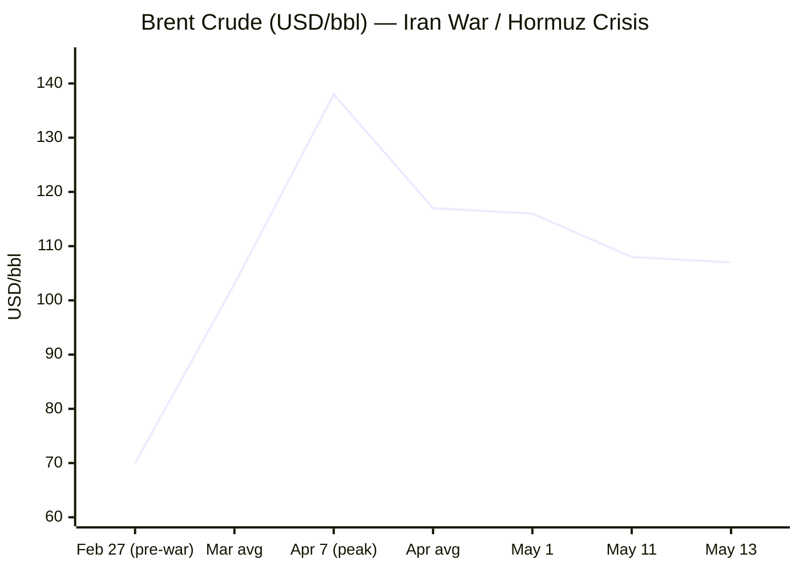

````yaml
---
brief_date: 2026-05-13
version: v1.2.1
run_time: "05:46 CET"
stories_published: 14
categories: [conflict, business, eu_affairs, technology, trends]
alert_counts:
  red: 2
  yellow: 10
  green: 2
ongoing_situations:
  - {name: "Russia–Ukraine War", real_world_start: "2022-02-24", day: 1540}
  - {name: "2026 Iran War / Hormuz Crisis", real_world_start: "2026-02-28", day: 75}
  - {name: "Israel–Lebanon Ceasefire", real_world_start: "2026-04-17", day: 27}
sources_fetched: 9
fetch_status:
  le_monde: "❌"
  faz: "❌"
  kommersant: "❌"
  xinhua: "⚠️"
  european_parliament: "⚠️"
expansion_queue: []
---
````

---

# 🌐 MORNING BRIEF
## Wednesday, 13 May 2026 · 05:46 CET
### 14 stories across 5 categories

---

## DIGEST SUMMARY

| # | Category | Headline | Alert |
|---|----------|----------|-------|
| 1 | ⚔️ Conflict | Iran–US Ceasefire on "Massive Life Support" as 14-Point MOU Talks Continue | 🔴 |
| 2 | ⚔️ Conflict | Putin Signals Openness to End War After Victory Day — Direct Talks Offered | 🟡 |
| 3 | ⚔️ Conflict | Israel–Lebanon Ceasefire Day 27 — Extension Deadline of 15 May Approaches | 🟡 |
| 4 | 💼 Business | US CPI April 3.8% — Highest Since May 2023; Real Wages Turn Negative | 🔴 |
| 5 | 💼 Business | Trump Departs for Beijing Summit with Xi — Trade, Iran, Taiwan and AI on Agenda | 🟡 |
| 6 | 💼 Business | EIA May STEO — Middle East Shut-ins at 10.5M bbl/day; UAE Exits OPEC | 🟡 |
| 7 | 🇪🇺 EU Affairs | EU Defence Ministers Discuss ASPIDES Reinforcement, Ukraine Loan and Lebanon | 🟡 |
| 8 | 🇪🇺 EU Affairs | UK and France Host 40-Nation Hormuz Mission Ministerial; Charles de Gaulle Pre-Positioned | 🟡 |
| 9 | 🇪🇺 EU Affairs | EU Confirms First €9.1bn Ukraine Loan Tranche for Q2; €60bn Earmarked for Defence | 🟢 |
| 10 | 🤖 Technology | Stanford AI Index 2026 — US-China Parity Near; Employment Disruption Begins | 🟡 |
| 11 | 🤖 Technology | Trump-Xi Summit to Include First Formal US-China AI Governance Dialogue | 🟡 |
| 12 | 📈 Trends | FAO Food Price Index Hits Highest Since Feb 2023 — Hormuz Fertiliser Transmission Now Biting | 🟡 |
| 13 | 📈 Trends | US Real Wages Turn Negative — Cost-of-Living Squeeze Deepens Amid Energy Shock | 🟡 |
| 14 | 📈 Trends | Pakistan as Indispensable Mediator — Islamabad's Structural Diplomatic Repositioning | 🟢 |

> Alert level key: 🔴 High significance · 🟡 Developing · 🟢 Stable/Routine

---

## 🚨 SIGNAL BOARD

🔴 US April CPI reached 3.8% YoY — the highest since May 2023 — as energy prices surged 17.9%; real wages turned negative (−0.3% annually) for the first time since April 2023.
🔴 Iran–US ceasefire declared "on massive life support" by Trump after rejecting Tehran's proposal; exchanges of fire confirmed in the Strait of Hormuz, "below the threshold of restarting major combat operations" (General Dan Caine, Joint Chiefs).
🟡 Trump en route to Beijing today for a two-day summit with Xi Jinping (14–15 May) — the first US presidential visit to China since 2017 — with Iran, Taiwan, trade and AI governance on the agenda.
🟡 EU defence ministers on 12 May agreed to explore reinforcing EUNAVFOR ASPIDES and discussed a potential replacement mission for UNIFIL in Lebanon as its mandate approaches expiry at end-2026.
⚡ FAO Food Price Index hit 130.7 in April — highest since February 2023 — driven by a third consecutive monthly rise in vegetable oil and cereal prices linked to Hormuz-related fertiliser supply disruption.

---

## 🔄 ONGOING SITUATIONS

| Situation | Real-world start | Day # | Last significant development | Status |
|-----------|-----------------|-------|------------------------------|--------|
| Russia–Ukraine War | 24 Feb 2022 | Day 1,540 | Putin offers direct talks with Zelensky post-Victory Day (9 May); US-backed ceasefire observed 8–9 May; ISW records Russian net territorial loss in April 7–May 5 period | 🔴 Active |
| 2026 Iran War / Hormuz Crisis | 28 Feb 2026 | Day 75 | Ceasefire "on massive life support" — Trump rejects Iran's 14-point proposal; 14-point MOU negotiations ongoing via Witkoff/Kushner; exchanges of fire in Hormuz below combat threshold | 🟡 Fragile ceasefire |
| Israel–Lebanon Ceasefire | 17 Apr 2026 | Day 27 | Trump-extended 3-week ceasefire expires 15 May; UNIFIL mandate discussions under way; Israeli forces remain in southern Lebanon | 🟡 Ceasefire |

---

## ⚔️ CONFLICT ANALYST · 3 updates today

---

### 1. Iran–US Ceasefire on "Massive Life Support" as 14-Point MOU Talks Continue 🔴

**Alert:** 🔴
**Summary:** President Trump labelled the Iran–US ceasefire "on massive life support" after rejecting Tehran's latest proposal as "totally unacceptable." Two US officials confirmed a 14-point memorandum of understanding is being negotiated via envoys Steve Witkoff and Jared Kushner, proposing a 30-day negotiation window, phased Hormuz reopening, sanctions relief and a moratorium on Iranian enrichment. Iran accused Washington of reneging on a uranium removal commitment. Both sides exchanged missile, drone and fast-boat fire in the Strait of Hormuz; General Dan Caine confirmed incidents remained "below the threshold of restarting major combat operations." The Strait remains effectively closed at approximately 5% of pre-conflict transit volume. Trump departed Tuesday for Beijing, where reopening the waterway is a key summit agenda item.

**Significance:** The 14-point MOU — if agreed — would declare an end to the war and open a 30-day negotiation window; its failure risks an immediate resumption of major combat. Saudi Aramco CEO Amin Nasser has warned the market is losing approximately 100 million barrels of supply per week, with normalisation potentially delayed into 2027.

**Sources:**
- [CNN — Live updates: Trump says ceasefire with Iran on 'massive life support'](https://www.cnn.com/2026/05/11/world/live-news/iran-war-proposal-trump) · 11 May 2026
- [Axios — US, Iran closing in on one-page memo to end war, officials say](https://www.axios.com/2026/05/06/iran-us-deal-one-page-memo) · 06 May 2026

**Trend:** ↗ Escalating
**Tags:** #Iran #Hormuz #ceasefire #nuclear #MULTI-SOURCE

---

### 2. Putin Signals Openness to End War After Victory Day — Direct Talks Offered 🟡

**Alert:** 🟡
**Summary:** Speaking after Victory Day in Moscow on 9 May, President Putin signalled Russia's war "may be coming to an end," offering direct talks with President Zelensky in Moscow or a neutral country. His remarks followed a US-backed ceasefire observed around 8–9 May, during which Russia and Ukraine declared separate, non-overlapping truces. ISW data for April 7–May 5 shows Russian forces registered a net territorial loss of 46 square miles, reversing the 17 square mile gain of the prior four-week period. Broader negotiations remain stalled, and both sides continued combat engagements alongside diplomatic signals. Russian public support for peace negotiations stands at 64%; Ukrainian support for territorial compromise at 61%.

**Significance:** Putin's direct-talks offer is the clearest public signal of potential dialogue, though analysts note Russia's sustained military activity and historically incompatible negotiating positions make near-term progress uncertain; the offer may be designed to manage US diplomatic pressure ahead of Trump's Beijing visit.

**Sources:**
- [Al Jazeera — Putin hints at ending Russia's war in Ukraine, but why now?](https://www.aljazeera.com/news/2026/5/10/putin-hints-at-ending-russias-war-in-ukraine-but-why-now) · 10 May 2026
- [Russia Matters — Russia–Ukraine War Report Card, May 6, 2026](https://www.russiamatters.org/news/russia-ukraine-war-report-card/russia-ukraine-war-report-card-may-6-2026) · 06 May 2026

**Trend:** ↘ De-escalating
**Tags:** #Russia #Ukraine #ceasefire #peace-talks #MULTI-SOURCE

---

### 3. Israel–Lebanon Ceasefire Day 27 — Extension Deadline of 15 May Approaches 🟡

**Alert:** 🟡
**Summary:** The Israel–Lebanon ceasefire, extended by three weeks by President Trump on 24 April following second ambassador-level talks, is due to expire on 15 May — two days from today. EU defence ministers on 12 May discussed the status of UNIFIL (whose mandate expires end-2026) and the possibility of an EU-led replacement mission. HR Kaja Kallas emphasised additional funding for the Lebanese Armed Forces to advance Hezbollah disarmament, which both Hezbollah and Hamas continue to reject. Israeli forces remain in southern Lebanon; President Macron has described the situation as unsustainable as a long-term arrangement. A third extension or longer-term framework must be agreed within 48 hours to avert renewed hostilities.

**Significance:** The imminent ceasefire deadline concentrates diplomatic risk at a moment when US attention is focused on Beijing; the EU's discussion of a replacement UNIFIL mission signals growing concern about a governance vacuum in southern Lebanon post-2026.

**Sources:**
- [Insight EU Monitoring — Main results of EU Foreign Affairs and Defence Council, 12 May 2026](https://ieu-monitoring.com/editorial/main-results-of-the-eu-foreign-affairs-and-defence-council-on-12-may-2026/1215928) · 13 May 2026

**Trend:** ↗ Escalating
**Tags:** #Lebanon #Hezbollah #ceasefire #humanitarian

📚 *Background reading:* [Al Jazeera — What we know about Iran's response to the latest US ceasefire proposal](https://www.aljazeera.com/news/2026/5/8/what-we-know-about-irans-response-to-the-latest-us-ceasefire-proposal) · 08 May 2026 · [UK Commons Library — Israel/US-Iran conflict 2026: Reopening the Strait of Hormuz](https://commonslibrary.parliament.uk/research-briefings/cbp-10636/) · 11 May 2026

---

> 💼 **BUSINESS ANALYST** · 3 updates today

---

### 1. US CPI April 3.8% — Highest Since May 2023; Real Wages Turn Negative 🔴

**Alert:** 🔴
**Summary:** The Bureau of Labor Statistics reported April 2026 CPI at 3.8% YoY — the highest since May 2023 and up from 3.3% in March — driven by a 17.9% annual energy price surge attributable to the Iran war. Core CPI accelerated to 2.8% annually, above the 2.7% forecast; core monthly gain of 0.4% was the highest since January 2025. Real average hourly wages turned negative (−0.3% annually) for the first time since April 2023. Energy accounted for over 40% of the headline monthly gain; gasoline rose 28.4% annually. CME futures now imply over 70% probability of a Federal Reserve rate hike by April 2027, with no cuts expected in 2026.

**Market signal:** Bearish for equities and risk assets; stagflationary dynamics — supply-shock inflation coinciding with slowing growth — constrain the Fed's room to cut even as consumer purchasing power erodes.

**Sources:**
- [CNBC — CPI inflation April 2026: Prices rose 3.8% annually](https://www.cnbc.com/2026/05/12/cpi-inflation-april-2026-.html) · 12 May 2026
- [CNN — US inflation rose to 3.8% in April, eroding Americans' paychecks](https://www.cnn.com/2026/05/12/economy/us-cpi-inflation-april) · 12 May 2026

**Trend:** ↗ Escalating
**Tags:** #inflation #Fed #interest-rates #energy-markets #MULTI-SOURCE

📎 See also: Conflict § Story 1 — Iran–US ceasefire fragility driving sustained oil price elevation

---

### 2. Trump Departs for Beijing Summit with Xi — Trade Truce, Iran and AI on Agenda 🟡

**Alert:** 🟡
**Summary:** President Trump departed Tuesday for Beijing (summit: 14–15 May) with President Xi Jinping — the first US presidential visit to China since 2017 and the first summit since the October 2025 Busan tariff truce. The October trade truce is expected to be extended, with China potentially committing to purchases of US agricultural goods and Boeing aircraft, and a bilateral Board of Trade under discussion. Iran's Hormuz closure has severely disrupted China's crude oil imports (half sourced from the Middle East), giving Beijing diplomatic leverage. Iran's foreign minister visited Beijing last week; Putin is expected in the city days after Trump departs. Discussions on AI governance, Taiwan and rare earth supply are also anticipated.

**Market signal:** Moderately bullish for trade-exposed sectors if truce extension and commodity purchases are confirmed; downside risk if Taiwan or Iran agenda produces public friction.

**Sources:**
- [Al Jazeera — Trump-Xi meeting: Could China, US form a 'G2'?](https://www.aljazeera.com/news/2026/5/12/trump-xi-meeting-could-china-us-form-a-g2) · 12 May 2026
- [CNBC — What's at stake for trade, Taiwan and Iran in Trump's high-risk summit](https://www.cnbc.com/2026/05/12/trump-xi-china-trade-iran-taiwan.html) · 12 May 2026

**Trend:** → Stable
**Tags:** #diplomacy #FX #commodities #MULTI-SOURCE

---

### 3. EIA May STEO — Middle East Shut-ins at 10.5M bbl/day; UAE Exits OPEC 🟡

**Alert:** 🟡
**Summary:** The EIA's May Short-Term Energy Outlook (published 12 May) estimates that six Middle East producers collectively shut in 10.5 million bbl/day of crude production in April. The Strait of Hormuz is assumed effectively closed until late May, with shipping only gradually recovering thereafter. Brent averaged $117/bbl in April (peaking at $138 on 7 April) and is forecast at $106/bbl for May–June, declining to $89/bbl in Q4 2026. Global inventory draws are projected at 8.5 million bbl/day in Q2. The UAE's departure from OPEC effective 1 May reduces cartel spare capacity to approximately 2.5 million bbl/day in 2027 — complicating the group's future crisis response capacity.

**Market signal:** Neutral to mildly bearish near-term as prices moderate from the April peak, though structural tightening through Q2 — with 8.5M bbl/day inventory draws — limits downward price pressure.

**Sources:**
- [EIA — Short-Term Energy Outlook, May 2026](https://www.eia.gov/outlooks/steo/) · 12 May 2026

**Trend:** ↘ De-escalating
**Tags:** #Brent #oil-price #energy-markets #supply-shock

📎 See also: Conflict § Story 1 — Hormuz closure as root cause of Gulf supply disruption

📚 *Background reading:* [CFR — At the Trump-Xi Summit, China Will Have the Upper Hand](https://www.cfr.org/articles/at-the-trump-xi-summit-china-will-have-the-upper-hand) · 10 May 2026

---

> 🇪🇺 **EU AFFAIRS ANALYST** · 3 updates today

---

### 1. EU Defence Ministers Discuss ASPIDES Reinforcement, Lebanon and Updated Threat Analysis 🟡

**Alert:** 🟡
**Summary:** The Foreign Affairs Council with defence ministers convened in Brussels on 12 May, chaired by HR Kaja Kallas. Ministers received an updated comprehensive EU threat analysis and exchanged views on the Middle East's implications for European security. The Council explored reinforcing and extending EUNAVFOR ASPIDES once conditions in the Strait of Hormuz allow, and discussed UNIFIL's mandate — which expires end-2026 — alongside the potential for an EU replacement mission. On Ukraine, ministers discussed ongoing military support against the backdrop of the latest frontline developments and diplomatic efforts. The European Defence Agency Steering Board met in parallel under Kallas's chairwomanship.

**Legislative/policy stage:** Informal ministerial exchange; no formal Council decisions adopted; ASPIDES reinforcement and Lebanon mission contingent on conditions in the Strait of Hormuz and Lebanon respectively.

**Sources:**
- [EU Council — Foreign Affairs Council (Defence) 12 May 2026](https://www.consilium.europa.eu/en/meetings/fac/2026/05/12/) · 12 May 2026
- [Insight EU Monitoring — Main results of the EU Foreign Affairs and Defence Council, 12 May 2026](https://ieu-monitoring.com/editorial/main-results-of-the-eu-foreign-affairs-and-defence-council-on-12-may-2026/1215928) · 13 May 2026

**Trend:** ↗ Escalating
**Tags:** #EU-defence #EU-institutions #Lebanon #Hormuz #MULTI-SOURCE

---

### 2. UK and France Host 40-Nation Hormuz Mission Ministerial; Charles de Gaulle Pre-Positioned 🟡

**Alert:** 🟡
**Summary:** Defence Secretary John Healey and French counterpart Catherine Vautrin co-chaired the inaugural multinational Hormuz mission ministerial on 12 May, bringing together over 40 nations to advance planning for restoring freedom of navigation. Iran warned London and Paris against deploying warships to the region, while Macron clarified he did not envisage a "naval deployment" but rather a coordinated security mission. The French carrier strike group Charles de Gaulle transited the Suez Canal on 6 May to pre-position in the southern Red Sea. A 38-nation statement expressed readiness to contribute to safe passage and mine clearance once conditions allow. The UK has separately committed HMS Dragon to confidence-building and mine clearance operations.

**Legislative/policy stage:** First ministerial meeting of the coalition framework; operational deployment remains contingent on ceasefire stabilisation; planning phase under way for mine clearance and convoy escort operations.

**Sources:**
- [Times of Israel — UK, France to host meeting of defence ministers on Hormuz, amid Iran threats](https://www.timesofisrael.com/uk-france-to-host-defense-ministers-meeting-on-hormuz-amid-iran-threats/) · 12 May 2026
- [Euronews — Newsletter: The EU's best offence is a good defence](https://www.euronews.com/my-europe/2026/05/12/newsletter-the-eus-best-offence-is-a-good-defence) · 12 May 2026

**Trend:** ↗ Escalating
**Tags:** #Hormuz #EU-defence #naval-blockade #MULTI-SOURCE

---

### 3. EU Confirms First €9.1bn Ukraine Loan Tranche for Q2; €60bn Earmarked for Defence Procurement 🟢

**Alert:** 🟢
**Summary:** The European Commission confirmed on 12 May that the first tranche of the EU's €90 billion long-term Ukraine support loan — valued at €9.1 billion — will be disbursed "as soon as possible" in Q2 2026. Of the total €90 billion, €60 billion is allocated to defence procurement, raising questions about which European arms systems will benefit and how this intersects with the EU defence industrial base. HR Kallas has underscored the need for additional funding for the Lebanese Armed Forces as a complementary priority. Ukraine retains full decision-making authority over procurement choices, providing predictability for Kyiv's long-term planning.

**Legislative/policy stage:** First tranche disbursement confirmed for Q2 2026; European Commission has confirmed the disbursement timeline; procurement planning under way in coordination with Ukrainian authorities.

**Sources:**
- [Euronews — Newsletter: The EU's best offence is a good defence](https://www.euronews.com/my-europe/2026/05/12/newsletter-the-eus-best-offence-is-a-good-defence) · 12 May 2026
- [EU Council — Foreign Affairs Council (Defence) 12 May 2026](https://www.consilium.europa.eu/en/meetings/fac/2026/05/12/) · 12 May 2026

**Trend:** → Stable
**Tags:** #Ukraine-aid #EU-defence #EU-institutions #EU-funds #MULTI-SOURCE

📚 *Background reading:* [CSIS — Trump-Xi Summit in Beijing: Managing the World's Most Important Relationship](https://www.csis.org/analysis/trump-xi-summit-beijing-managing-worlds-most-important-relationship) · 09 May 2026

---

> 🤖 **TECHNOLOGY ANALYST** · 2 updates today

---

### 1. Stanford AI Index 2026 — US-China Parity Near; Entry-Level Employment Disruption Begins 🟡

**Alert:** 🟡
**Summary:** The Stanford HAI AI Index 2026 (published late April) reports that as of March 2026, Anthropic's top-performing model leads its closest Chinese equivalent by just 2.7%, with US and Chinese models having traded places atop performance rankings multiple times since early 2025. Generative AI reached 53% population adoption within three years — faster than personal computing or the internet. Global AI diffusion reached 17.8% of working-age population in Q1 2026. A structural employment shift is emerging: software developer employment for those aged 22–25 has fallen nearly 20% since 2024. Foundation model transparency index scores dropped to 40 (from 58 a year ago), raising governance concerns as the most capable models disclose the least.

**Analyst note:** Within 12–24 months, near-parity in AI capabilities between US and Chinese models — combined with falling transparency scores — will intensify pressure on governments to mandate disclosure standards, or accept strategic AI opacity as a structural feature of superpower competition.

**Sources:**
- [Stanford HAI — Inside the AI Index: 12 Takeaways from the 2026 Report](https://hai.stanford.edu/news/inside-the-ai-index-12-takeaways-from-the-2026-report) · April 2026

**Trend:** → Stable
**Tags:** #AI #LLM #AI-benchmark #AI-regulation

---

### 2. Trump-Xi Summit Expected to Yield First Formal US-China AI Governance Dialogue 🟡

**Alert:** 🟡
**Summary:** According to CSIS and CFR analysis, the Beijing summit agenda includes a framework discussion on AI risk and safety — the first institutionalised bilateral AI dialogue between the US and China. Key issues include military AI applications, export controls on advanced semiconductors, and China's rare earth leverage over the US defence industrial base. Trump's 11 May announcement that arms sales to Taiwan would be raised — potentially breaking with Reagan-era Six Assurances — adds diplomatic complexity. China's control of rare earth supply chains, weaponised via 2025 export restrictions, remains the primary structural bargaining chip Beijing brings to any technology governance discussion.

**Analyst note:** Formalised US-China AI safety talks — if confirmed — would represent the first dedicated bilateral channel for AI governance, setting a precedent that could shape global AI standards within 18 months and directly influence EU AI Act implementation and OECD AI governance frameworks.

**Sources:**
- [CSIS — Trump-Xi 2026 Summit analysis](https://www.csis.org/programs/trump-xi-2026-summit) · 09 May 2026
- [CFR — At the Trump-Xi Summit, China Will Have the Upper Hand](https://www.cfr.org/articles/at-the-trump-xi-summit-china-will-have-the-upper-hand) · 10 May 2026

**Trend:** ↗ Escalating
**Tags:** #AI #AI-regulation #semiconductor #diplomacy #MULTI-SOURCE

📚 *Background reading:* [Stanford HAI — Inside the AI Index: 12 Takeaways from the 2026 Report](https://hai.stanford.edu/news/inside-the-ai-index-12-takeaways-from-the-2026-report) · April 2026

---

> 📈 **TRENDS ANALYST** · 3 updates today

---

### 1. FAO Food Price Index Hits Highest Since February 2023 — Hormuz Fertiliser Disruption Now Biting Agriculture 🟡

**Alert:** 🟡
**Summary:** The FAO Food Price Index averaged 130.7 points in April 2026 — a third consecutive monthly rise, the highest since February 2023, and 2.0% above a year ago. The vegetable oil sub-index reached its highest level since July 2022 (+5.9% monthly); the meat index hit a record high. Wheat production for 2026 has been revised down approximately 2%, as farmers switch to less fertiliser-intensive crops in response to elevated fertiliser costs driven by Hormuz-linked energy disruption. The AMIS Market Monitor identifies the Hormuz closure as now exerting "primary" pressure on agricultural input costs through energy and fertiliser transmission channels, compounding pre-existing food security vulnerabilities in import-dependent economies.

**Horizon:** Medium-term: if Hormuz remains disrupted through Q3 2026, reduced fertiliser application in the current growing season will translate into lower 2026–27 harvest yields, sustaining food price pressure over a 6–12 month horizon irrespective of when the strait reopens.

**Sources:**
- [FAO — FAO Food Price Index, April 2026](https://www.fao.org/worldfoodsituation/foodpricesindex/en/) · 08 May 2026

**Trend:** ↗ Escalating
**Tags:** #food-prices #food-security #Hormuz #supply-shock

📎 See also: Conflict § Story 1 — Hormuz closure as root driver of fertiliser and food price disruption

---

### 2. US Real Wages Turn Negative — Cost-of-Living Squeeze Deepens Amid Energy Shock 🟡

**Alert:** 🟡
**Summary:** For the first time since April 2023, US real average hourly wages fell on an annual basis (−0.3%), as April CPI outpaced wage growth of 3.6%. Gasoline is up 28.4% annually; beef up 14.8%; airline fares up 20.7%. Consumer sentiment has reached all-time lows, while economists note that shelter inflation (3.3% annually) and services (3.0%) indicate that pressures extend well beyond war-related energy costs. The Atlanta Fed's GDPNow tracker projects 3.7% Q2 GDP growth — suggesting resilience at the top of the income distribution, even as lower-income households face severe budget compression with food, fuel and housing costs all rising simultaneously.

**Horizon:** Short-to-medium-term: economists project 2–6 months for price normalisation even after Hormuz reopens; shelter and core services components suggest inflation will remain above the Fed's 2% target through 2026 regardless of energy resolution.

**Sources:**
- [CNBC — Here's the inflation breakdown for April 2026, in one chart](https://www.cnbc.com/2026/05/12/inflation-breakdown-for-april-2026-cpi-chart.html) · 12 May 2026

**Trend:** ↗ Escalating
**Tags:** #inflation #social-contract #energy-markets #data-point

📎 See also: Business § Story 1 — US CPI April 2026 full breakdown

---

### 3. Pakistan as Indispensable Mediator — Islamabad's Structural Diplomatic Repositioning 🟢

**Alert:** 🟢
**Summary:** Pakistan's role as the sole active mediator between the US and Iran has transformed Islamabad into an indispensable diplomatic node. Prime Minister Shehbaz Sharif publicly credited Saudi Crown Prince Mohammed bin Salman as a partner who persuaded Trump to pause Operation Project Freedom, whilst Pakistani officials have physically carried both the US 14-point proposal and Iranian counter-proposals between the parties. Saudi Arabia, China and Pakistan now function as a de facto mediation coalition coordinating through Islamabad. The framework echoes Pakistan's Cold War role as a US intermediary with China in 1971, suggesting a structural rather than opportunistic diplomatic repositioning that could persist well beyond the current conflict.

**Horizon:** Long-term structural shift: Pakistan's accumulating mediation capital across multiple concurrent crises could reshape its long-term strategic alignment — reducing historical dependence on the India-Pakistan-US triangle and elevating Islamabad as a permanent diplomatic interlocutor between Western and Islamic bloc interests.

**Sources:**
- [Al Jazeera — Has the US accepted Iran's demand to settle Hormuz first, nuclear later?](https://www.aljazeera.com/news/2026/5/6/has-the-us-accepted-irans-demand-to-settle-hormuz-first-nuclear-later) · 06 May 2026

**Trend:** → Stable
**Tags:** #Pakistan-mediation #diplomacy #mediation #peace-talks

📚 *Background reading:* [UK Commons Library — US-Iran ceasefire and nuclear talks in 2026](https://commonslibrary.parliament.uk/research-briefings/cbp-10637/) · 11 May 2026

---

## 📊 KEY DATA OF THE DAY

> 📊 **DATA OFFICER** · 7 indicators

| Indicator | Value | Δ vs prior session | Δ vs 7 days ago | Note | Source | URL |
|-----------|-------|--------------------|-----------------|------|--------|-----|
| EUR/USD | 1.1780 | N/A | N/A | As of 11 May (latest confirmed); dollar gaining on hot CPI data | Trading Economics | [link](https://tradingeconomics.com/euro-area/currency) |
| Brent Crude (USD/bbl) | 107.05 | −0.67% | N/A | 13 May; down from $138 peak on 7 Apr; EIA forecasts $106 avg May–June | EIA STEO (12 May) | [link](https://www.eia.gov/outlooks/steo/) |
| Gold (XAU/USD) | 4,678.10 | −1.22% | N/A | 12 May close; dollar rebound on CPI data pressuring bullion; +43.8% YoY | Trading Economics | [link](https://tradingeconomics.com/commodity/gold) |
| IMF Global Growth 2026 | 3.1% | N/A | N/A | April WEO "reference forecast" assuming limited conflict; pre-war pace ~3.4%; downside risks dominate | IMF WEO Apr 2026 | [link](https://www.imf.org/en/publications/weo/issues/2026/04/14/world-economic-outlook-april-2026) |
| EU CPI YoY (Apr 2026) | 3.0% | +0.4pp vs Mar | +1.1pp vs Jan | Flash estimate (Eurostat, 30 Apr); energy +10.9%; above ECB 2% target; highest since Sep 2023 | Eurostat / Trading Economics | [link](https://tradingeconomics.com/euro-area/inflation-cpi) |
| FAO Food Price Index | 130.7 | +1.6% vs Mar | April 2026 — latest available | Third consecutive monthly rise; highest since Feb 2023; Hormuz fertiliser disruption driving cereal costs | FAO | [link](https://www.fao.org/worldfoodsituation/foodpricesindex/en/) |
| Strait of Hormuz transit volume | ~5% of pre-conflict | −95pp vs pre-war | Ongoing since 28 Feb | ~150 vessels/month vs 3,000 pre-conflict; US counter-blockade in force since 13 Apr; Operation Project Freedom paused | UK Commons Library | [link](https://commonslibrary.parliament.uk/research-briefings/cbp-10636/) |

**Data commentary:** Energy prices are the single dominant force across all indicators today. The Hormuz closure has sustained Brent at $107/bbl — more than 60% above year-ago levels — generating a 3.8% US CPI print and an EU CPI at a three-year high, leaving both the Fed and ECB in a near-impossible position. Gold's pullback to $4,678 reflects a strengthening dollar rather than any reduction in geopolitical risk premium. The FAO index at 130.7 signals that the war's agricultural transmission mechanism — via fertiliser and energy cost channels — is now as consequential for global food security as its direct energy market impact.

---

## 📈 CHARTS

### Chart 1 — Brent Crude (USD/bbl): Iran War and Hormuz Crisis



*Sources: EIA STEO (May 2026), Trading Economics, Fortune (daily price series). May 13 value as of early-session data.*

---

## ⚙️ AGENT METADATA

| Field | Value |
|-------|-------|
| Agent version | MORNING BRIEF v1.2.1 |
| Run timestamp | 2026-05-13T05:46:08+02:00 |
| Fetch status | Le Monde ❌ · FAZ ❌ · Kommersant ❌ · Xinhua ⚠️ (content dated 24 Apr — outside 24h window) · EP ⚠️ (agenda retrieved; no press releases) |
| Sources queried | 9 / 11 (ECB and World Bank not directly queried this session) |
| Stories surfaced | ~22 before editorial filter |
| Stories published | 14 after editorial filter |
| Languages processed | EN, FR (Le Monde attempted), DE (FAZ attempted) |
| Output language | English (British) |
| Date validated | ✅ Confirmed 13 May 2026 |
| Expansion Queue | None — all tags sourced from closed list |

---

*MORNING BRIEF is an AI-assisted digest. All summaries are paraphrased from original sources. Verify time-sensitive information at the linked URLs before acting. Output language: British English.*
