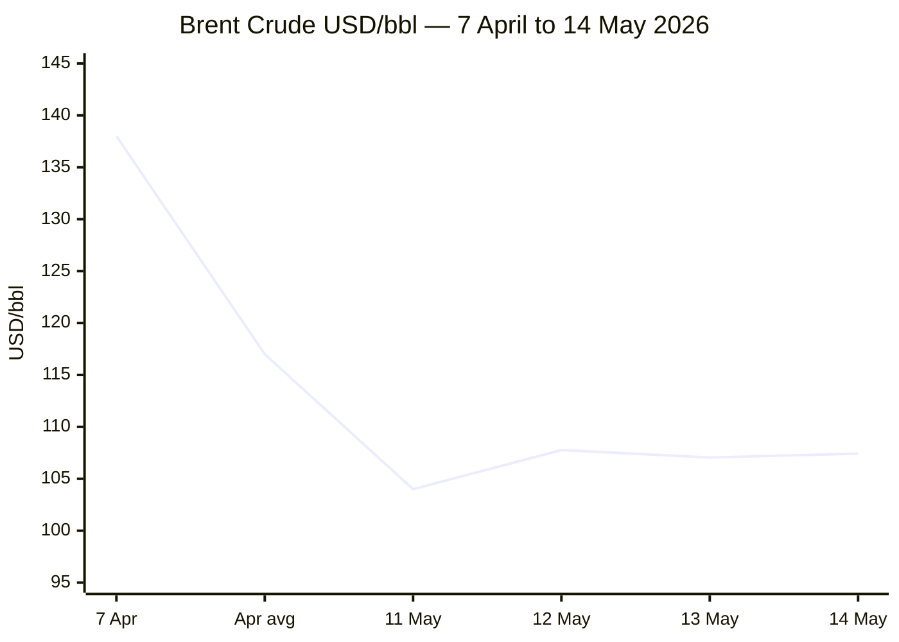

````yaml
---
brief_date: 2026-05-14
version: v1.2.1
run_time: "05:30 CET"
stories_published: 14
categories: [conflict, business, eu_affairs, technology, trends]
alert_counts:
  red: 5
  yellow: 9
  green: 0
ongoing_situations:
  - {name: "2026 Iran War & Hormuz Crisis", real_world_start: "2026-02-28", day: 76}
  - {name: "2026 Lebanon War / Ceasefire", real_world_start: "2026-03-02", day: 74}
  - {name: "Russia–Ukraine War", real_world_start: "2022-02-24", day: 1541}
sources_fetched: 10
fetch_status:
  le_monde: "❌"
  faz: "❌"
  kommersant: "❌"
  xinhua: "⚠️"
  european_parliament: "❌"
expansion_queue: []
---
````

---

# 🌐 MORNING BRIEF
## Thursday, 14 May 2026 · 05:30 CET
### 14 stories across 5 categories

---

## DIGEST SUMMARY

| # | Category | Headline | Alert |
|---|----------|----------|-------|
| 1 | ⚔️ Conflict | Iran War: ceasefire on "massive life support"; UN resolution gains 112 co-sponsors | 🔴 |
| 2 | ⚔️ Conflict | Lebanon ceasefire expires ~17 May; US emergency talks open today | 🔴 |
| 3 | ⚔️ Conflict | Russia–Ukraine: ISW records Russian net loss of 45 sq mi; Victory Day truce collapses | 🟡 |
| 4 | ⚔️ Conflict | Pakistan mediation under fire: Iranian jets at Nur Khan airbase spark US Senate warning | 🟡 |
| 5 | 💼 Business | Oil: Brent $107/bbl; IEA warns record 4 mb/d inventory draw; UAE exits OPEC | 🔴 |
| 6 | 💼 Business | US CPI April 2026: +3.8% YoY; IMF global growth cut to 3.1%; stagflation fears mount | 🟡 |
| 7 | 💼 Business | Gold at $4,688/oz; safe-haven demand sustained by Iran war and Fed rate anxiety | 🟡 |
| 8 | 🇪🇺 EU Affairs | EU HICP April 2026: flash estimate 3.0% YoY — highest since September 2023 | 🔴 |
| 9 | 🇪🇺 EU Affairs | ECB holds 2%; June rate hike debated "at length"; Q1 eurozone GDP at +0.1% | 🟡 |
| 10 | 🇪🇺 EU Affairs | EU Defence Council (12 May): Ukraine aid, Middle East reviewed; Kallas chairs EDA board | 🟡 |
| 11 | 🤖 Technology | First confirmed AI-generated zero-day exploit: Google foils mass 2FA-bypass attack | 🔴 |
| 12 | 🤖 Technology | GPT-5.5 and DeepSeek V4 Pro released; Stanford AI Index: Anthropic leads, US–China gap narrows | 🟡 |
| 13 | 📈 Trends | Pakistan's diplomatic pivot: Iran mediator role shifts South Asia's strategic geometry | 🟡 |
| 14 | 📈 Trends | FAO Food Price Index: 130.7 in April — third consecutive rise; Hormuz closure transmitting through fertiliser chain | 🟡 |

> Alert Level key: 🔴 High significance · 🟡 Developing · 🟢 Stable/Routine

---

## 🚨 SIGNAL BOARD

🔴 **Brent crude opens at $107.43/bbl today — 74% above pre-war levels; IEA confirms global inventories fell at a record 4 million b/d pace in March–April**
🔴 **Lebanon ceasefire expires approximately 17 May; US emergency talks open today in Washington as Israel has demolished ~1,500 residential buildings under the truce**
🟡 **UN Security Council draft Hormuz resolution reaches 112 co-sponsors — Iran rejects US counter-proposal; Trump finds it "unacceptable" and boards Air Force One for Beijing**
🟡 **EU April HICP flash at 3.0% (energy +10.9%) — highest in 32 months; ECB June rate hike now fully debated; eurozone Q1 GDP barely +0.1%**
⚡ **Google GTIG confirms first real-world AI-generated zero-day exploit — LLM-coded 2FA bypass for mass attack, foiled before deployment**

---

## 🔄 ONGOING SITUATIONS

| Situation | Real-world start | Day # | Last significant development | Status |
|-----------|-----------------|-------|------------------------------|--------|
| 2026 Iran War & Hormuz Crisis | 28 Feb 2026 | Day 76 | Iran rejects US peace proposal; UN resolution at 112 co-sponsors; Trump heading to Beijing | 🔴 Active |
| 2026 Lebanon War / Ceasefire | 02 Mar 2026 | Day 74 | Ceasefire expiring ~17 May; US-mediated Israel–Lebanon talks today (14 May); Israel demolishing ~1,500 buildings in occupied south | 🟡 Ceasefire (contested) |
| Russia–Ukraine War | 24 Feb 2022 | Day 1,541 | Russia net loss of 45 sq mi (14 Apr–12 May, ISW); 23 railway strikes today; Victory Day truce collapsed amid mutual accusations | 🔴 Active |

---

## ⚔️ CONFLICT

> 🔎 **CONFLICT ANALYST** · 4 updates today

### 1. Iran War — Ceasefire on Life Support; UN Resolution at 112 Co-Sponsors 🔴
**Alert:** 🔴
**Summary:** The conditional Iran war ceasefire remained intact but deeply strained on 13–14 May as Trump, now en route to Beijing, publicly dismissed Iran's counter-proposal as "unacceptable" and said the truce was on "massive life support." A UN Security Council draft resolution co-sponsored by Bahrain, the US, and 110 other nations — including most EU states, India, Japan, and South Korea — calls for freedom of navigation through the Strait of Hormuz and an immediate halt to Iranian attacks on Gulf neighbours. Iran's Deputy Foreign Minister Gharibabadi accused Washington of "seeking capitulation rather than peace," insisting reopening Hormuz requires lifting the US counter-blockade imposed 13 April. Hormuz transit remains at approximately 5% of pre-war levels. The IEA Oil Market Report warns global markets could remain severely undersupplied until October even if the conflict ends sooner. Saudi Aramco CEO Nasser stated the market is losing approximately 100 million barrels of supply per week.
**Significance:** The Trump–Xi summit in Beijing (today) carries high stakes: US officials want China to pressure Tehran, but analysts say Beijing will demand Taiwan concessions in exchange. China's Foreign Ministry called for "comprehensive ceasefire" after hosting Iranian FM Araghchi last week, positioning Beijing as an independent diplomatic actor rather than Washington's co-sponsor.
**Sources:**

- [Al Jazeera — Bahrain-led UN resolution on Strait of Hormuz gains support of 112 nations](https://www.aljazeera.com/news/2026/5/13/bahrain-led-un-resolution-on-strait-of-hormuz-gains-support-of-112-nations) · 13 May 2026
- [Al Jazeera — Trump-Xi summit: China's help in Iran may require US concessions](https://www.aljazeera.com/news/2026/5/13/trump-xi-summit-chinas-help-in-iran-may-require-us-concessions) · 13 May 2026
- [CNBC — Iran war hangs over Trump's China trip](https://www.cnbc.com/2026/05/12/trump-china-iran-war-xi-jinping-analysis.html) · 12 May 2026
- [House of Commons Library — Reopening the Strait of Hormuz](https://commonslibrary.parliament.uk/research-briefings/cbp-10636/) · 13 May 2026

**Trend:** → Stable (ceasefire holding by thread; no new kinetic escalation today)
**Tags:** #Iran #Hormuz #ceasefire #peace-talks #MULTI-SOURCE

---

### 2. Lebanon — Ceasefire Under Critical Strain; US Emergency Talks Open Today 🔴
**Alert:** 🔴
**Summary:** The Israel–Lebanon ceasefire, in force since 16 April and extended by three weeks on 23 April, expires approximately 17 May. US State Department emergency talks between Israeli and Lebanese delegations open today (14 May) and continue Friday. Satellite imagery and video geolocated by NBC News show Israel has levelled approximately 1,500 residential buildings and demolished entire villages in southern Lebanon during the truce. The IDF struck more than 1,100 Hezbollah targets and killed more than 350 militants within the ceasefire period, citing a self-defence carve-out in the US-brokered agreement. Hezbollah, which was not a signatory, warned it will act "in defence of Lebanon" against ongoing violations. Analysts describe the talks as the last realistic window to extend the truce before hostilities resume. Lebanon has sent Ambassador Simon Karam to Washington, equipped with a presidential mandate from President Aoun.
**Significance:** Any collapse of the Lebanon ceasefire would remove Iran's key incentive to keep Hormuz partial talks alive; Tehran has conditioned a comprehensive ceasefire on a resolution of the Lebanon theatre, as stated by Iranian FM Araghchi.
**Sources:**

- [NBC News — Israeli forces ramp up destruction of homes in southern Lebanon](https://www.nbcnews.com/world/lebanon/ceasefire-israeli-forces-ramp-destruction-homes-southern-lebanon-rcna342549) · 13 May 2026
- [Al Jazeera — Is even the pretence of a ceasefire over?](https://www.aljazeera.com/news/2026/5/11/israeli-killings-in-lebanon-rise-is-even-the-pretence-of-a-ceasefire-over) · 11 May 2026
- [CFR Daily Brief — Israel-Lebanon Ceasefire Extended for Three Weeks](https://www.cfr.org/articles/israel-lebanon-ceasefire-extended-for-three-weeks) · 24 Apr 2026

**Trend:** ↗ Escalating (ceasefire framework deteriorating; expiry imminent)
**Tags:** #Lebanon #Hezbollah #ceasefire #Israel #peace-talks #MULTI-SOURCE

---

### 3. Russia–Ukraine — ISW Records Russian Net Loss; Victory Day Truce Collapses 🟡

**Alert:** 🟡
**Summary:** Russian forces recorded a net loss of 45 square miles of Ukrainian territory in the period 14 April – 12 May 2026 (ISW data), contrasting with a one-square-mile loss in the prior four-week period. Russia launched more than 8,000 drones in April — the highest monthly total since the start of the full-scale invasion — yet Ukraine held and reversed ground, according to Russia Matters' analysis. A 3-day Victory Day truce (9–11 May) collapsed amid mutual accusations: Russia claims Ukraine committed more than 1,000 violations, while Ukraine documented continued Russian strikes. Today (14 May), Russia launched 23 strikes against railway infrastructure across Ukraine and drone raids struck Dnipropetrovsk, Kharkiv, and Ivano-Frankivsk. Putin signalled willingness to meet Zelensky in a third country if a long-term peace deal is reached. Ukraine's Zelensky met Polish President Nawrocki at the Bucharest Nine summit.
**Significance:** The divergence — record Russian drone intensity alongside net territorial losses — points to attritional exhaustion rather than strategic initiative on Russia's part. The collapse of the Victory Day truce forecloses short-term ceasefire diplomacy.
**Sources:**

- [Russia Matters — Russia-Ukraine War Report Card, 13 May 2026](https://www.russiamatters.org/news/russia-ukraine-war-report-card/russia-ukraine-war-report-card-may-13-2026) · 13 May 2026
- [Al Jazeera — Russia and Ukraine accuse other of ceasefire violations](https://www.aljazeera.com/tag/ukraine-russia-crisis/) · 11 May 2026
- [LiveUAMap — 14 May 2026](https://liveuamap.com/) · 14 May 2026

**Trend:** → Stable (ground: Ukrainian advantage maintained; air: Russian pressure intensifying)
**Tags:** #Russia #Ukraine #frontline #drone-warfare #day-N #MULTI-SOURCE

---

### 4. Pakistan as Mediator — Iranian Jets at Nur Khan Airbase Trigger Senate Warning 🟡
**Alert:** 🟡
**Summary:** Pakistan's mediating role in the Iran war came under acute scrutiny on 11–13 May after CBS News reported, citing anonymous US officials, that Iranian military aircraft were parked at Pakistan's Nur Khan airbase near Rawalpindi, potentially shielding them from US strikes. Pakistan's Foreign Ministry acknowledged the aircraft without denying the report, calling coverage "misleading and sensationalized" and stating the aircraft "arrived during the ceasefire period" with "no linkage whatsoever to any military contingency." Republican Senator Lindsey Graham warned the revelations — if accurate — would require a "complete reevaluation" of Pakistan's mediator role. No White House or State Department response has been issued. Pakistan brokered the 8 April ceasefire and hosted the Islamabad Talks (11–12 April), which ended without agreement on nuclear and Hormuz issues.
**Significance:** The episode exposes the structural contradiction in Pakistan's positioning: simultaneously serving as Washington's designated interlocutor and maintaining deep security ties with Tehran and a legacy of strategic ambiguity.
**Sources:**

- [GlobalSecurity.org / RFE/RL — Pakistan faces scrutiny over Iran role](https://www.globalsecurity.org/wmd/library/news/pakistan/2026/pakistan-260512-rferl01.htm) · 12 May 2026
- [Wikipedia — Islamabad Talks](https://en.wikipedia.org/wiki/Islamabad_Talks) · Updated 13 May 2026

**Trend:** ↗ Escalating (credibility of Pakistan's neutrality increasingly questioned)
**Tags:** #Pakistan-mediation #Iran #peace-talks #diplomacy

📚 *Background reading:* [CFR — Israel-Lebanon Ceasefire Extended for Three Weeks](https://www.cfr.org/articles/israel-lebanon-ceasefire-extended-for-three-weeks) · 24 Apr 2026

---

## 💼 BUSINESS

> 💼 **BUSINESS ANALYST** · 3 updates today

### 5. Energy Markets — Brent at $107/bbl; IEA Flags Record Inventory Drawdown 🔴
**Alert:** 🔴
**Summary:** Brent crude opened at $107.43/bbl today after closing at $107.05 on 13 May — roughly 74% above pre-war (February 2026) levels. The EIA's May Short-Term Energy Outlook (released 12 May) forecast the Strait of Hormuz will remain effectively closed until late May, projecting global oil inventories falling at 8.5 million barrels per day in Q2. The IEA Oil Market Report separately found inventories fell at a record 4 million b/d pace in March–April and warned markets may remain severely undersupplied until October. Saudi Arabia's production dropped to its lowest since 1990 due to Iranian attacks. The UAE departed OPEC effective 1 May 2026, reducing OPEC's spare capacity forecast from 3.8 mb/d to 2.5 mb/d in 2027. The EIA projects Brent averaging $106/bbl in May–June before declining toward $89/bbl in Q4 2026 and $79/bbl in 2027, assuming Hormuz reopens.

📎 See also: Conflict § Story 1 — Iran war ceasefire precarious; UN Hormuz resolution at 112 co-sponsors

**Market signal:** Bearish medium-term if Hormuz reopens as EIA projects; acutely bullish if diplomatic failure extends closure beyond late May, with $120+ possible on fresh escalation.
**Sources:**
- [Trading Economics — Brent Crude Oil Price](https://tradingeconomics.com/commodity/brent-crude-oil) · 13 May 2026
- [EIA — Short-Term Energy Outlook, May 2026](https://www.eia.gov/outlooks/steo/) · 12 May 2026
- [Investing.com — Brent Oil Futures](https://www.investing.com/commodities/brent-oil) · 14 May 2026

**Trend:** → Stable (slightly off April 7 peak of $138/bbl; range-bound pending diplomatic signal)
**Tags:** #Brent #oil-price #energy-markets #supply-shock #Hormuz #MULTI-SOURCE

---

### 6. US CPI April 2026 — +3.8% YoY; IMF Cuts Global Growth to 3.1% 🟡
**Alert:** 🟡
**Summary:** US CPI rose 0.6% month-on-month in April 2026, pushing the annual rate to 3.8% — the highest in recent months and marginally above the 3.7% consensus, driven primarily by energy price surges linked to the Hormuz disruption. Core CPI (excluding food and energy) rose 0.4% MoM and 2.8% YoY. The Fed funds rate target remains at 3.50–3.75%, with markets pricing near-zero probability of a June cut (95.8% probability of hold). The IMF's April 2026 World Economic Outlook cut global growth to 3.1% for 2026, down from 3.3% in the January update and 3.2% at the October 2025 WEO, explicitly citing the Iran war. The IMF lowered its Eurozone growth forecast to 1.1% from 1.4%. Berenberg economists warned of a "bout of stagflation" for the Eurozone and UK while the Hormuz remains largely closed.
**Market signal:** Bearish for risk assets — hotter-than-expected US CPI pushes Fed rate cuts further out and raises the spectre of a rate hike, while IMF's growth downgrade signals deteriorating earnings fundamentals.
**Sources:**

- [BLS — CPI for all items rises 0.6% in April](https://www.bls.gov/cpi/) · 12 May 2026
- [IMF — World Economic Outlook April 2026: Global Economy in the Shadow of War](https://www.imf.org/en/publications/weo/issues/2026/04/14/world-economic-outlook-april-2026) · 14 Apr 2026
- [Euronews — ECB interest rate dilemma](https://www.euronews.com/business/2026/04/24/ecb-interest-rate-dilemma-eurozone-growth-stalls-as-iran-war-fuels-inflation) · 24 Apr 2026

**Trend:** ↗ Escalating (inflation acceleration broad-based; IMF downgrades deepening)
**Tags:** #inflation #GDP-forecast #IMF #Fed #interest-rates #stagflation #MULTI-SOURCE

---

### 7. Gold — XAU/USD at $4,688; War-Driven Safe-Haven Demand Holds 🟡
**Alert:** 🟡
**Summary:** Gold (XAU/USD) traded at $4,688.47 on 14 May — a decline of $26.86 (-0.57%) from the previous session's close of $4,715.33 — as markets engaged in moderate profit-taking ahead of the Trump–Xi summit and assessed India's new curbs on gold buying. Gold reached a 52-week high of $5,595.46 amid peak Iran war anxiety in early April. The 21-day simple moving average sits at approximately $4,688, where gold is currently resting, with the 50-day SMA near $4,749. CME Group data shows 95.8% of market participants expect the Fed rate to remain unchanged at 3.50–3.75% in June, limiting the upside for gold but not removing its safe-haven floor while the Iran conflict persists.
**Market signal:** Neutral to mildly bullish — geopolitical risk premium remains the dominant driver; any credible Iran ceasefire announcement would trigger sharp correction toward $4,300–4,400.
**Sources:**

- [Investing.com — XAU/USD Historical Data](https://www.investing.com/currencies/xau-usd-historical-data) · 14 May 2026
- [FXStreet — Gold Forecast and Analysis](https://www.fxstreet.com/markets/commodities/metals/gold) · 13 May 2026
- [LiteFinance — XAU/USD Gold Price Forecast](https://www.litefinance.org/blog/analysts-opinions/gold-price-prediction-forecast/daily-and-weekly/) · 13 May 2026

**Trend:** → Stable (range-bound $4,650–4,750 pending diplomatic signal)
**Tags:** #gold #commodities #Iran #FX

---

## 🇪🇺 EU AFFAIRS

> 🇪🇺 **EU AFFAIRS ANALYST** · 3 updates today

### 8. EU HICP April 2026 — Flash Estimate 3.0% YoY; Energy Surges 10.9% 🔴
**Alert:** 🔴
**Summary:** Eurostat's April 2026 flash estimate places euro area HICP at 3.0% year-on-year — the highest reading since September 2023 — up from 2.6% in March and 1.9% in February. Energy is the dominant component at +10.9% YoY (vs +5.1% in March), the largest energy contribution since February 2023, entirely driven by the Middle East conflict and Hormuz closure. Services inflation eased slightly to 3.0% from 3.2%; core inflation (HICPX) held at 2.2% for April. The monthly increase of +1.0% was the largest since October 2022. Germany confirmed 2.9% national CPI for April, Italy 2.9%, Spain 3.5%. Eurostat will publish final April figures in the second half of May. The ECB's Survey of Professional Forecasters revised its 2026 headline inflation forecast upward to 2.7%, from 2.5% in Q1.

**Legislative/policy stage:** Flash estimate published 30 April 2026; final release due mid-May. ECB next monetary policy meeting scheduled for June 2026 (exact date to be confirmed). The April print will be a key input for the June Governing Council decision.

**Sources:**
- [Eurostat — Euro area annual inflation up to 3.0%](https://ec.europa.eu/eurostat/web/products-euro-indicators/w/2-30042026-ap) · 30 Apr 2026
- [CNBC — Euro zone inflation jumps to 3% as economic growth almost stalls](https://www.cnbc.com/2026/04/30/euro-zone-economy-inflation-growth.html) · 30 Apr 2026
- [Destatis — Inflation rate at +2.9% in April 2026](https://www.destatis.de/EN/Press/2026/05/PE26_161_611.html) · 13 May 2026

**Trend:** ↗ Escalating (energy-driven acceleration; third consecutive monthly increase)
**Tags:** #inflation #eurozone #ECB #EU-institutions #data-point #MULTI-SOURCE

---

### 9. ECB Holds at 2%; Lagarde Signals June as "Right Time" for Rate Hike Decision 🟡
**Alert:** 🟡
**Summary:** At its 30 April 2026 meeting, the ECB Governing Council held all three key rates unchanged — deposit facility at 2.00%, main refinancing operations at 2.15%, marginal lending facility at 2.40%. The decision was unanimous, but President Lagarde disclosed that a rate hike had been debated "at length," adding that the bank was "certainly moving away" from its baseline scenario and that June would be the "right time" for a new assessment. Markets are now fully pricing three ECB rate hikes in 2026, with the first expected in June. Eurozone Q1 2026 GDP grew 0.1% quarter-on-quarter, according to Eurostat's preliminary flash estimate — the slowest pace in two years and well below the 0.4% trend from late 2025. The ECB's own March projections now look outdated: the baseline assumed energy prices moderating in line with market expectations as of 11 March.
**Legislative/policy stage:** Next ECB Governing Council monetary policy meeting: June 2026 (exact date not confirmed in this run). No pre-commitment to a rate path; data-dependent, meeting-by-meeting approach reiterated.
**Sources:**

- [ECB — Monetary policy decisions, 30 April 2026](https://www.ecb.europa.eu/press/pr/date/2026/html/ecb.mp260430~81b7179e6f.en.html) · 30 Apr 2026
- [RTE — ECB keeps rates unchanged after debating possible hike](https://www.rte.ie/news/business/2026/0430/1571082-european-central-bank-rates-decision/) · 1 May 2026
- [Trading Economics — Euro Area Interest Rate](https://tradingeconomics.com/euro-area/interest-rate) · 30 Apr 2026

**Trend:** ↗ Escalating (policy tightening becoming more probable; June is live meeting)
**Tags:** #ECB #interest-rates #eurozone #inflation #EU-institutions #MULTI-SOURCE

---

### 10. EU Defence Council (12 May) — Ukraine Aid, Middle East, EDA Board Convened 🟡
**Alert:** 🟡
**Summary:** EU Defence Ministers met on 12 May 2026 to exchange views on EU military support for Ukraine, EU defence readiness, and the Middle East conflict's impact on European security. Ministers were briefed on an updated EU threat analysis. High Representative/Vice-President Kaja Kallas chaired the European Defence Agency Steering Board in the margins of the Council meeting. Separately, Commissioner for Enlargement Kos set a July 2026 deadline for Ukraine to complete accession cluster negotiations, signalling continued accession momentum despite the ongoing war. The SAFE instrument continues its disbursement phase: 18 of 19 national defence investment plans were approved by the Council between February and 10 April, unlocking access to up to €150 billion in EU loans for defence procurement. Fifteen of these national plans include joint projects with Ukraine.
**Legislative/policy stage:** SAFE disbursement phase — loan agreement conclusion underway with approved member states; pre-financing payments (up to 15% of allocation) in process. Ukraine accession: cluster negotiations approaching July deadline per Commissioner Kos.
**Sources:**

- [EUBusiness — EU Agenda Week 11-16 May 2026](https://www.eubusiness.com/politics/eucalendar/) · 11 May 2026
- [Consilium — SAFE](https://www.consilium.europa.eu/en/policies/safe/) · Updated Apr 2026
- [Euronews — EU.XL / EU Commission tag](https://www.euronews.com/tag/eu-commission) · 14 May 2026

**Trend:** ↗ Escalating (EU defence integration accelerating; Iran war adds urgency)
**Tags:** #EU-defence #Ukraine-aid #EU-institutions #EU-enlargement

---

## 🤖 TECHNOLOGY

> 🤖 **TECHNOLOGY ANALYST** · 2 updates today

### 11. Google GTIG — First Confirmed AI-Generated Zero-Day Exploit Foiled 🔴
**Alert:** 🔴
**Summary:** Google's Threat Intelligence Group (GTIG) reported on 11 May 2026 that it had identified and disrupted what it assesses with high confidence to be the first real-world zero-day exploit developed using an artificial intelligence model. Several "prominent cybercrime threat actors" partnered to identify a vulnerability in a Python script enabling a two-factor authentication bypass on a popular open-source, web-based system administration tool. GTIG assessed the exploit as LLM-generated based on structural markers: an abundance of educational docstrings, a hallucinated CVSS score, and a clean, textbook Pythonic format characteristic of LLM training data. Google worked with the unnamed vendor to patch the vulnerability before the planned mass exploitation campaign launched. No attribution was made to a specific AI model; Gemini was explicitly stated not to have been used.
**Analyst note:** This milestone is likely to compress the adversarial AI capability timeline by 12–24 months: if commoditised AI-generated exploit tooling reaches criminal markets in 2026–2027, the volume of novel zero-day attacks against critical infrastructure will increase substantially faster than traditional defensive patching cycles can absorb.
**Sources:**

- [Google Cloud Blog — Adversaries Leverage AI for Vulnerability Exploitation](https://cloud.google.com/blog/topics/threat-intelligence/ai-vulnerability-exploitation-initial-access) · 11 May 2026
- [The Register — Google says criminals used AI-built zero-day in planned mass hack spree](https://www.theregister.com/ai-ml/2026/05/11/google-says-criminals-used-ai-built-zero-day-in-planned-mass-hack-spree/5237982) · 11 May 2026
- [The Hacker News — Hackers Used AI to Develop First Known Zero-Day 2FA Bypass](https://thehackernews.com/2026/05/hackers-used-ai-to-develop-first-known.html) · 11 May 2026

**Trend:** ⚡ Reversal (adversarial AI capabilities have crossed a confirmed operational threshold)
**Tags:** #cyber #AI #AI-safety #LLM #breaking #MULTI-SOURCE

---

### 12. AI Model Landscape — GPT-5.5 and DeepSeek V4 Pro Released; Stanford AI Index: US–China Gap Narrows 🟡

**Alert:** 🟡
**Summary:** The AI model release pace intensified through April–May 2026. OpenAI's GPT-5.5 (Artificial Analysis Intelligence Index 60.2, 922K context) and DeepSeek's V4 Pro (Index 51.5, 1M context, $1.74/$3.48 per million tokens) represent the current frontier tier. Xiaomi's MiMo-V2.5-Pro (Index 53.8) and Kimi K2.6 (Index 53.9, multimodal) also entered the top cluster. Stanford's 2026 AI Index, published April 2026, confirmed Anthropic leads aggregate model rankings as of March 2026, trailed closely by xAI, Google, and OpenAI. Chinese models (DeepSeek, Alibaba) lag only modestly. The index found AI is boosting productivity 14% in customer service and 26% in software development, while AI companies are generating revenue faster than any previous technology boom.
**Analyst note:** As frontier model scores converge within a narrow band, the competitive differentiation is shifting toward cost, latency, agentic reliability, and enterprise integration — an environment that favours operators with deep cloud infrastructure rather than pure model capability.
**Sources:**

- [AI Flash Report — LLM Model Release Timeline 2025–2026](https://aiflashreport.com/model-releases.html) · 11 May 2026
- [MIT Technology Review — Want to understand the current state of AI?](https://www.technologyreview.com/2026/04/13/1135675/want-to-understand-the-current-state-of-ai-check-out-these-charts/) · 13 Apr 2026

**Trend:** ↗ Escalating (release cadence accelerating; US–China capability parity emerging)
**Tags:** #AI #LLM #AI-benchmark #semiconductor #open-source-AI #MULTI-SOURCE

---

## 📈 TRENDS

> 📈 **TRENDS ANALYST** · 2 updates today

### 13. Pakistan's Diplomatic Pivot — Mediator Role Reshaping South Asia's Strategic Geometry 🟡
**Alert:** 🟡
**Summary:** Pakistan's emergence as the primary mediator in the Iran war — hosting the Islamabad Talks (11–12 April), brokering the 8 April ceasefire, and maintaining continuous back-channel contact with Tehran and Washington — represents a structural departure from Pakistan's historical subordination in US-led frameworks. The Iranian-aircraft controversy (see Conflict § Story 4) has exposed the contradictions of this role, but also the depth of Pakistan's engagement with both parties. Islamabad is simultaneously managing relationships with Iran, Saudi Arabia, China, the UAE (which has demanded loan repayments), and the United States — a balancing act without precedent in Pakistan's modern diplomatic history. Carnegie and Stimson analysts note Pakistan's IRGC access limitations as a structural vulnerability: civilian Iranian interlocutors lack the authority to deliver IRGC compliance with any ceasefire terms.

📎 See also: Conflict § Story 4 — Pakistan under scrutiny over Iranian jets at Nur Khan

**Horizon:** Medium-term signal (months to one year): Pakistan's mediation success or failure will define whether Islamabad becomes a sustained regional power broker or suffers reputational collapse and bilateral pressure from Washington.
**Sources:**
- [Pakistan Today — Pakistan's Strategic Role in an Expanding Iran Conflict](https://www.pakistantoday.com.pk/2026/05/13/pakistans-strategic-role-in-an-expanding-iran-conflict) · 13 May 2026
- [Wikipedia — Islamabad Talks](https://en.wikipedia.org/wiki/Islamabad_Talks) · Updated 13 May 2026

**Trend:** ↗ Escalating (Pakistan's profile rising but credibility under acute strain)
**Tags:** #Pakistan-mediation #diplomacy #mediation #Iran #Hormuz

---

### 14. FAO Food Price Index — 130.7 in April; Hormuz Closure Entering Food Supply Chain 🟡

**Alert:** 🟡
**Summary:** The FAO Food Price Index (FFPI) averaged 130.7 points in April 2026 — up 1.6% from March's revised 128.5 and 2.0% above a year ago, the third consecutive monthly increase and the highest since February 2023. Vegetable oils surged 5.9% on supply disruptions linked to the Hormuz crisis; cereals rose 0.8%, with wheat up 0.8% on US drought and expectations of reduced plantings as elevated fertiliser and energy costs — directly linked to Hormuz-related gas disruptions — deter farmers from nitrogen-intensive crops. Meat prices reached a record high. Sugar fell 4.7% on ample supply expectations. The closure of Hormuz is now transmitting into food prices through two indirect channels: energy-linked fertiliser costs and maritime transport costs.
**Horizon:** Medium-term (months to one year): if Hormuz remains effectively closed through summer, fertiliser availability and energy-linked agricultural input costs will drive a second wave of food price inflation in import-dependent emerging markets by Q3 2026.
**Sources:**

- [FAO — Food Price Index](https://www.fao.org/worldfoodsituation/foodpricesindex/en) · 8 May 2026
- [WAFA — FAO Food Price Index up for third consecutive month](https://english.wafa.ps/Pages/Details/170239) · 8 May 2026
- [Trading Economics — World Food Price Index](https://tradingeconomics.com/world/food-price-index/news/549170) · 8 May 2026

**Trend:** ↗ Escalating (third consecutive rise; Hormuz secondary effects now structurally embedded)
**Tags:** #food-prices #food-security #Hormuz #Iran #commodities #MULTI-SOURCE

---

## 📊 KEY DATA OF THE DAY

> 📊 **DATA OFFICER** · 7 indicators

| Indicator | Value | Δ vs prior session | Δ vs 7 days ago | Note | Source | URL |
|-----------|-------|-------------------|-----------------|------|--------|-----|
| EUR/USD | 1.1700 | −0.32% (est.) | N/A | Dollar strength post-US CPI 3.8%; EUR "falls toward 1.1700" in EU session 13 May | ECB / FXStreet | [link](https://www.fxstreet.com/markets/commodities/metals/gold) |
| Brent Crude (USD/bbl) | 107.43 | +0.36% | N/A | 14 May open; down from $138 peak on 7 Apr; EIA forecasts ~$106/bbl May–June; UAE exited OPEC 1 May | EIA STEO | [link](https://www.eia.gov/outlooks/steo/) |
| Gold (XAU/USD) | 4,688.47 | −0.57% | N/A | Moderate profit-taking ahead of Trump–Xi summit; 52-wk range $3,120–$5,595 | LBMA / Investing.com | [link](https://www.investing.com/currencies/xau-usd-historical-data) |
| IMF Global Growth 2026 | 3.1% | −0.2pp vs Jan WEO | −0.1pp vs Oct WEO | April 2026 WEO: "Global Economy in the Shadow of War"; downside risks dominant | IMF WEO Apr 2026 | [link](https://www.imf.org/en/publications/weo/issues/2026/04/14/world-economic-outlook-april-2026) |
| EU HICP YoY (April 2026) | 3.0% | +0.4pp vs March | +1.3pp vs January | Flash estimate; energy +10.9% YoY; highest since Sept 2023; June ECB decision critical | Eurostat | [link](https://ec.europa.eu/eurostat/web/products-euro-indicators/w/2-30042026-ap) |
| FAO Food Price Index | 130.7 | +1.6% vs March | April 2026 (latest) | Third consecutive monthly rise; vegetable oils +5.9%; meat at record; released 8 May | FAO | [link](https://www.fao.org/worldfoodsituation/foodpricesindex/en) |
| Strait of Hormuz transit (% normal) | ~5% | N/A | ~5% (near-standstill for weeks) | Pre-war: ~3,000 vessels/month; current: ~150/month; US counter-blockade since 13 April | HoCL / NBC | [link](https://commonslibrary.parliament.uk/research-briefings/cbp-10636/) |

**Data commentary:** The most consequential combination today is Brent at $107/bbl while simultaneously gold stays above $4,688 and the FAO index hits a 3-year high — together indicating that the Hormuz closure has now fully migrated from a supply-shock event into a broad-based inflationary impulse spanning energy, food, and safe-haven asset markets. The EUR/USD decline toward 1.17 reflects the dollar's dual role as safe-haven and high-yield currency in a stagflationary environment where both the Fed (3.5–3.75%) and the ECB (2.0%) are on hold. The IMF's 3.1% global growth forecast — built on an assumption of "limited conflict" — is already looking optimistic given the Day 76 status of the Iran war.

---

## 📈 CHARTS



> *Data sources: EIA STEO (7 Apr peak, April average); Trading Economics (11–13 May); Investing.com (14 May open). "Apr avg" represents EIA-stated April 2026 monthly average of $117/bbl.*

*Chart 2 threshold not met: Verified time-series data points for Hormuz transit volume insufficient (only one confirmed data point available from tool calls: ~5% of normal, current). Chart 2 omitted per protocol.*

---

## ⚙️ AGENT METADATA

| Field | Value |
|-------|-------|
| Agent version | MORNING BRIEF v1.2.1 |
| Run timestamp | 2026-05-14T05:30:40+02:00 |
| Fetch status | Le Monde ❌ · FAZ ❌ · Kommersant ❌ · Xinhua ⚠️ (fetched; content from 24 Apr, outside 24h window) · EP ❌ |
| Sources queried | 10 / 11 (European Parliament not explicitly queried via web_search this run) |
| Stories surfaced | ~28 before editorial filter |
| Stories published | 14 after editorial filter |
| Languages processed | EN |
| Output language | English (British) |
| Date validated | ✅ Confirmed 14 May 2026 |
| Expansion Queue | None — all tags covered by closed list |

---

*MORNING BRIEF is an AI-assisted digest. All summaries are paraphrased from original sources. Verify time-sensitive information at the linked URLs before acting. Output language: British English.*
