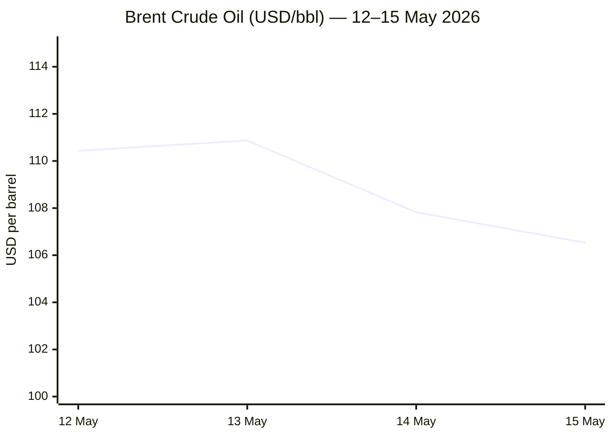
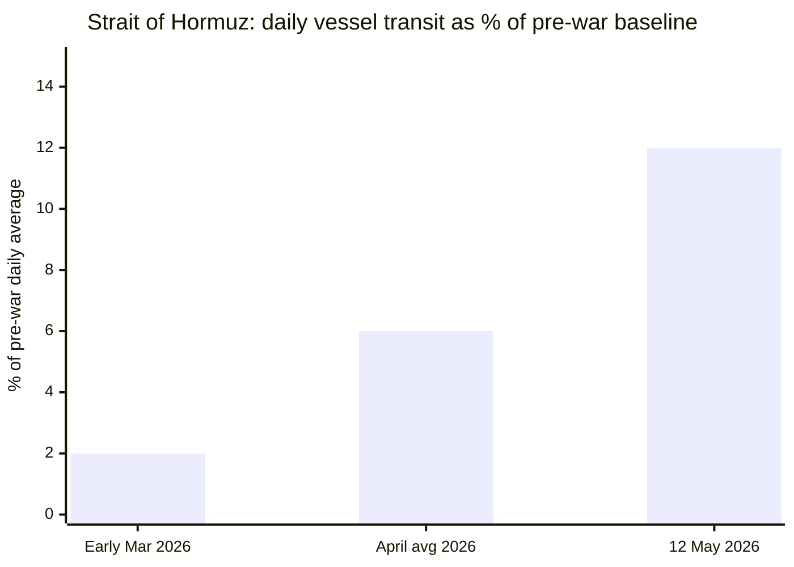

```yaml
---
brief_date: 2026-05-15
version: v1.2.1
run_time: "05:27 CET"
stories_published: 13
categories: [conflict, business, eu_affairs, technology, trends]
alert_counts:
  red: 4
  yellow: 7
  green: 2
ongoing_situations:
  - {name: "Russia-Ukraine War", real_world_start: "2022-02-24", day: 1542}
  - {name: "2026 Iran War (Operation Epic Fury)", real_world_start: "2026-02-28", day: 77}
  - {name: "Strait of Hormuz Crisis", real_world_start: "2026-03-04", day: 73}
  - {name: "2026 Lebanon War", real_world_start: "2026-03-02", day: 75}
  - {name: "2026 Israel-Lebanon Ceasefire", real_world_start: "2026-04-16", day: 30}
sources_fetched: 11
fetch_status:
  le_monde: "❌"
  faz: "❌"
  kommersant: "❌"
  xinhua: "⚠️"
  european_parliament: "⚠️"
expansion_queue: ["#US-China-summit", "#chip-export-controls"]
---
```

---

# 🌐 MORNING BRIEF
## Friday, 15 May 2026 · 05:27 CET
### 13 stories across 5 categories

---

## DIGEST SUMMARY

| # | Category | Headline | Alert |
|---|----------|----------|-------|
| 1 | ⚔️ Conflict | Ukraine: 73 clashes, Pokrovsk remains hottest front | 🔴 |
| 2 | ⚔️ Conflict | Iran War Day 77: IRGC redefines Hormuz, 14-point memo in progress | 🔴 |
| 3 | ⚔️ Conflict | Lebanon ceasefire Day 30: expiry crisis, Washington talks begin | 🔴 |
| 4 | 💼 Business | Trump-Xi Beijing summit: Boeing deal, no rare-earths breakthrough | 🟡 |
| 5 | 💼 Business | Brent retreats to $106 as IEA warns undersupply through October | 🟡 |
| 6 | 💼 Business | US CPI 3.8%, PPI surge: Fed rate cut fully priced out | 🔴 |
| 7 | 🇪🇺 EU Affairs | Hungary: Magyar sworn in, EC race to unlock €10bn before August deadline | 🟡 |
| 8 | 🇪🇺 EU Affairs | AI Act Digital Omnibus agreed: simplification + nudifier app ban | 🟢 |
| 9 | 🤖 Technology | TSMC forecasts $1.5tn semiconductor market by 2030; AI to displace smartphones as #1 driver | 🟢 |
| 10 | 🤖 Technology | US-China tech war: export controls unresolved after summit; China accelerates domestic AI chips | 🟡 |
| 11 | 📈 Trends | Pakistan's structural rise as global mediator: the Islamabad Process | 🟡 |
| 12 | 📈 Trends | FAO Food Price Index hits 3-year high; fertiliser supply chain under strain | 🟡 |
| 13 | 📈 Trends | Dual maritime blockade reshapes global shipping; Cape route now default | 🟡 |

> Alert Level key: 🔴 High significance · 🟡 Developing · 🟢 Stable/Routine

---

## 🚨 SIGNAL BOARD

🔴 Israel-Lebanon ceasefire (Day 30) formally expires this weekend — Washington talks underway 14–15 May; Hezbollah conducted 24 attacks in 24 hours as of 11 May
🔴 Hormuz transit at ~6% of pre-war average — IEA warns global oil inventories falling at record 4 million bbl/day pace; market "severely undersupplied through October" even if conflict ends next month
🔴 US CPI 3.8% (April) + PPI biggest surge since early 2022 → Fed rate cut fully priced out; 30% market probability of hike by December
🟡 Trump-Xi summit (Beijing, 14–15 May): both agreed Hormuz must remain open; 200 Boeing jets committed; no rare-earths deal, no Taiwan mention in joint statement
⚡ ECB June rate hike now 86% priced in — euro area HICP at 3.0% in April, highest since September 2023, driven by energy (+10.9%)

---

## 🔄 ONGOING SITUATIONS

| Situation | Real-world start | Day # | Last significant development | Status |
|-----------|-----------------|-------|------------------------------|--------|
| Russia-Ukraine War | 24 Feb 2022 | Day 1,542 | 73 combat clashes 15 May; Pokrovsk under intense Russian pressure; Sumy border areas shelled | 🔴 Active |
| 2026 Iran War (Op. Epic Fury) | 28 Feb 2026 | Day 77 | US-Iran 14-point memo being formulated via Pakistan; IRGC declares Hormuz a "vast operational area" in May; Project Freedom paused 6 May | 🟡 Ceasefire |
| Strait of Hormuz Crisis | 4 Mar 2026 | Day 73 | Transit at ~6% of pre-war baseline; UK deploying warship + aircraft for defensive mission; 1,550+ vessels stranded | 🔴 Active |
| 2026 Lebanon War | 2 Mar 2026 | Day 75 | Israel ground operation near Zawtar al-Sharqiyeh (north of Litani); ~400 killed since ceasefire began | 🟡 Ceasefire |
| 2026 Israel-Lebanon Ceasefire | 16 Apr 2026 | Day 30 | Ceasefire due to expire; Israel-Lebanon talks in Washington 14–15 May; extension + "extended political process" expected per regional diplomat | 🟡 Negotiating |

---

## ⚔️ CONFLICT ANALYST

> 🔎 **CONFLICT ANALYST** · 3 updates today

### 1. Ukraine: 73 combat clashes, Pokrovsk under sustained pressure 🔴
**Alert:** 🔴
**Summary:** Since the start of 15 May, 73 combat clashes have been recorded along the entire frontline, according to Ukraine's General Staff. The Pokrovsk direction remains the hottest sector, with Russian forces applying intense pressure. Russian artillery and mortars shelled border settlements in the Sumy region — targeting Baranivka, Chuikivka, Porozok, Prokhody, Dmytrivka, Novodmytrivka, and Ponomarenky. Ukrainian forces are holding their positions across most directions. Russia's average monthly territorial gain, while complicating year-on-year comparison due to wider use of infiltration tactics, remains a key tracking metric for ISW.
**Significance:** Russian infiltration tactics — involving forces exerting lower control over entered terrain — have complicated headline territorial comparisons. ISW's May 2026 methodology note signals strategic caution in reading raw advance-rate data as a proxy for Russian operational success.
**Sources:**

- [RBC-Ukraine — Russia-Ukraine war: Frontline update as of May 15](https://newsukraine.rbc.ua/news/russia-ukraine-war-frontline-update-as-of-1747318455.html) · 15 May 2026
- [Russia Matters — Russia-Ukraine War Report Card, May 13, 2026](https://www.russiamatters.org/news/russia-ukraine-war-report-card/russia-ukraine-war-report-card-may-13-2026) · 13 May 2026

**Trend:** → Stable
**Tags:** #Ukraine #Russia #frontline #MULTI-SOURCE

---

### 2. Iran War Day 77: IRGC redefines Hormuz, 14-point memo in formation 🔴
**Alert:** 🔴
**Summary:** In May, the IRGC Navy formally redefined the Strait of Hormuz as a "vast operational area" extending from Jask to Siri Island — far beyond the narrow IMO corridor. Iran's FM Araghchi visited Beijing ahead of the Trump-Xi summit, positioning China as a guarantor of Iranian interests. Via Pakistani mediation, the US and Iran are formulating a one-page 14-point memo on war parameters; Iran must commit to a uranium enrichment moratorium. Project Freedom (US Navy escort mission) was paused 6 May after Trump cited "great progress." A UK warship, drones, and fighter aircraft have been deployed for a future international defensive mission.
**Significance:** The IRGC's formal geographic redefinition of Hormuz represents a significant escalation of legal and operational framing, potentially complicating any future transit agreement and implying Iran's intent to assert permanent sovereignty claims over the waterway.
**Sources:**

- [Wikipedia — 2026 Strait of Hormuz crisis](https://en.wikipedia.org/wiki/2026_Strait_of_Hormuz_crisis) · 15 May 2026
- [Wikipedia — 2026 Iran war ceasefire](https://en.wikipedia.org/wiki/2026_Iran_war_ceasefire) · 14 May 2026
- [Al Jazeera — Pakistan scrambles to salvage US-Iran diplomacy](https://www.aljazeera.com/news/2026/5/12/pakistan-scrambles-to-salvage-us-iran-diplomacy-as-ceasefire-faces-collapse) · 12 May 2026

**Trend:** ↗ Escalating
**Tags:** #Iran #Hormuz #nuclear #ceasefire #MULTI-SOURCE

---

### 3. Lebanon ceasefire Day 30: Washington talks amid escalating violations 🔴
**Alert:** 🔴
**Summary:** The Israel-Lebanon ceasefire, now in its 30th day, is under severe strain as intensive negotiations take place in Washington on 14–15 May. A regional diplomat told Mada Masr that Israel and Lebanon are preparing to announce an "extended political process" plus a further ceasefire extension. However, Israeli airstrikes have killed approximately 400 Lebanese since the truce began on 16 April — including 51 killed on 11 May alone. Israel launched a ground operation near Zawtar al-Sharqiyeh, north of the Litani River, on 12 May. Hezbollah reported 24 retaliatory operations in 24 hours as of 11 May, targeting Merkava tanks, bulldozers, and troop positions. Hezbollah was not a formal signatory to the April 16 agreement and has not joined Washington talks.
**Significance:** Israel's assertion that its operations do not constitute ceasefire violations — citing Hezbollah threats — is not accepted by Beirut or Tehran. If a further extension fails today, the Lebanon front risks re-escalation that would directly unravel the broader Iran ceasefire framework.
**Sources:**

- [Mada Masr — Sources: Lebanon-Israel meeting in Washington to extend ceasefire](https://www.madamasr.com/en/2026/05/13/news/u/sources-lebanon-israel-meeting-in-washington-to-extend-ceasefire-without-securing-halt-in-israeli-attacks-on-south/) · 13 May 2026
- [Al Jazeera — Is even the pretence of a ceasefire over?](https://www.aljazeera.com/news/2026/5/11/israeli-killings-in-lebanon-rise-is-even-the-pretence-of-a-ceasefire-over) · 11 May 2026
- [The National — What ceasefire? Israel continues to destroy Lebanese property](https://www.thenationalnews.com/news/2026/05/13/what-ceasefire-israel-continues-to-destroy-lebanese-property/) · 13 May 2026

**Trend:** ↗ Escalating
**Tags:** #Lebanon #Israel #Hezbollah #ceasefire #peace-talks #MULTI-SOURCE

📚 *Background reading:* [Kyiv Independent — ISW Ukraine war maps](https://kyivindependent.com) · [IISS — Military balance in the Middle East](https://www.iiss.org)

---

## 💼 BUSINESS ANALYST

> 💼 **BUSINESS ANALYST** · 3 updates today

### 4. Trump-Xi Beijing summit Day 2: Boeing deal, no rare-earths breakthrough 🟡
**Alert:** 🟡
**Summary:** Day 2 of the Trump-Xi summit (Beijing, Great Hall of the People) produces incremental progress. Xi agreed to purchase 200 Boeing jets; China restored US beef import licences as a goodwill gesture. Both leaders committed to a "constructive China-US relationship of strategic stability" as a guiding framework for three years. They agreed Hormuz must remain open and Iran cannot have a nuclear weapon. However, no major trade deal was announced — rare earths, AI, and broader semiconductor arrangements remain unresolved. Xi warned that mishandling Taiwan "risks collision or conflict," without Taiwan appearing in the joint statement. Further face-to-face sessions are scheduled for 15 May.
**Market signal:** Mildly bullish for US equities on Boeing and agricultural names; neutral-to-negative for semiconductors given export control stalemate.
**Sources:**

- [Foreign Policy — From Iran to Trade, China Summit Produces Few Wins for Trump](https://foreignpolicy.com/2026/05/14/trump-xi-jinping-china-summit-taiwan-iran-trade-beef/) · 14 May 2026
- [CNBC — Five takeaways from the Trump-Xi summit](https://www.cnbc.com/2026/05/14/trump-xi-summit-beijing-takeaway-taiwan-trade-iran-war-strategic-relations-.html) · 14 May 2026
- [Al Jazeera — Trump-Xi summit live: talks on trade, tech, Iran](https://www.aljazeera.com/amp/news/liveblog/2026/5/14/trump-xi-summit-live-us-china-leaders-to-hold-talks-on-trade-tech-iran) · 14 May 2026

**Trend:** ↘ De-escalating
**Tags:** #diplomacy #Hormuz #oil-price #MULTI-SOURCE

---

### 5. Brent retreats to $106 as IEA warns undersupply through October 🟡
**Alert:** 🟡
**Summary:** Brent crude futures eased to $106.53 on 15 May — down from a recent three-session high of $110.87 on 13 May — as attention shifted to Trump-Xi diplomacy and Iran negotiations. The EIA's May Short-Term Energy Outlook (12 May) forecasts global oil inventories falling at 8.5 million bbl/day in Q2 2026, keeping Brent around $106 in May and June. The Hormuz closure has cut crude and fuel flows by nearly 6 million bbl/day in Q1. Saudi Arabia told OPEC its output fell to its lowest level since 1990. The UAE announced its departure from OPEC effective 1 May, reducing OPEC's assessed spare capacity to 2.5 million bbl/day by 2027.
**Market signal:** Moderately bearish near term on demand-destruction concerns and diplomatic optionality, but structurally bullish given record inventory draws and no Hormuz normalisation before June.

📎 *See also: Conflict § Story 2 — Iran War Day 77: IRGC redefines Hormuz*

**Sources:**
- [EIA — Short-Term Energy Outlook, May 2026](https://www.eia.gov/outlooks/steo/) · 12 May 2026
- [Trading Economics — Brent crude oil price](https://tradingeconomics.com/commodity/brent-crude-oil) · 15 May 2026
- [Investing.com — Brent Oil Futures historical data](https://www.investing.com/commodities/brent-oil-historical-data) · 15 May 2026

**Trend:** ↘ De-escalating
**Tags:** #Brent #oil-price #Hormuz #energy-markets #MULTI-SOURCE

---

### 6. US CPI 3.8%, PPI surge: Fed rate cut fully priced out 🔴
**Alert:** 🔴
**Summary:** US consumer price inflation accelerated to 3.8% in April — its highest reading since May 2023 — while producer prices posted their largest monthly gain since early 2022, driven by fuel costs and energy-linked inputs from the Iran war. CME Group FedWatch data now prices out any Federal Reserve rate cut in 2026, with a near 30% probability of a hike by December. Gold fell to $4,651 on 14 May as rising rates dimmed the metal's appeal. India simultaneously raised import tariffs on gold and silver to 15% from 6%, adding external demand pressure. S&P 500 and Nasdaq held gains (+0.77%/+0.88%) on 14 May, supported by tech earnings.
**Market signal:** Bearish for bonds and rate-sensitive equities; neutral for equities short-term given tech earnings support; significant medium-term stagflation risk if Hormuz remains closed into Q3.
**Sources:**

- [Trading Economics — Gold price](https://tradingeconomics.com/commodity/gold) · 14 May 2026
- [CNBC — Maersk ship Strait of Hormuz: fragile ceasefire](https://www.cnbc.com/2026/05/05/maersk-ship-strait-of-hormuz-iran-war.html) · 5 May 2026

**Trend:** ↗ Escalating
**Tags:** #inflation #Fed #interest-rates #stagflation #data-point

📚 *Background reading:* [Bruegel — Energy price shocks and monetary policy](https://www.bruegel.org) · [CFR — US-Iran conflict economic fallout](https://www.cfr.org/articles/u-s-iran-peace-talks-hit-an-impasse-what-comes-next)

---

## 🇪🇺 EU AFFAIRS ANALYST

> 🇪🇺 **EU AFFAIRS ANALYST** · 2 updates today

### 7. Hungary: Magyar sworn in, European Commission races August deadline 🟡
**Alert:** 🟡
**Summary:** Péter Magyar took the oath as Hungary's Prime Minister on 9 May 2026, following Tisza Party's landslide victory. The European Commission is dispatching a team of senior officials to Budapest next week to accelerate talks on unlocking approximately €10 billion in frozen EU recovery funds. The August deadline — after which unspent money is forfeited — is described as "extremely tight" by Commission officials. Brussels is focusing on the grant component; the loan tranche is considered significantly harder to unlock. One option under examination is channelling funds via Hungary's Exim Bank, though the Commission remains concerned about maintaining oversight. Magyar is expected in Brussels for high-level talks around 25 May.
**Legislative/policy stage:** Recovery and Resilience Facility disbursement request pending formal submission by Hungary; Commission conducting compliance assessment on anti-corruption and rule-of-law milestones before first payment, expected at earliest in late autumn 2026.
**Sources:**

- [Euronews — EU Commission to dispatch team to Budapest as it mulls Hungarian investment bank](https://www.euronews.com/my-europe/2026/05/13/eu-commission-to-dispatch-team-to-budapest-as-it-mulls-hungarian-investment-bank-for-eu-ca) · 13 May 2026

**Trend:** ↘ De-escalating
**Tags:** #Hungary #Magyar #EU-funds #rule-of-law #MULTI-SOURCE

---

### 8. AI Digital Omnibus: AI Act simplification agreed, nudifier apps banned 🟢
**Alert:** 🟢
**Summary:** EU co-legislators reached a political agreement on 7 May 2026 to update the AI Act under the so-called Digital Omnibus package. The deal simplifies compliance obligations for AI providers — particularly for small and medium enterprises — while maintaining the risk-based approach. A specific ban on "nudification" applications (AI tools generating non-consensual intimate imagery) was agreed. The European Commission welcomed the deal, which was led in Parliament by IMCO rapporteurs Arba Kokalari and Michael McNamara. The Commission has separately increased its 2026 EU bond issuance to €180 billion — €100 billion in H1 alone — to finance SAFE (Security Action for Europe), NextGenerationEU, and Ukraine support.
**Legislative/policy stage:** Political agreement reached; formal Parliamentary and Council votes pending ahead of publication in the Official Journal. Full AI Act implementation timeline remains unchanged.
**Sources:**

- [European Parliament — AI Act: deal on simplification measures, ban on "nudifier" apps](https://www.europarl.europa.eu/news/en/press-room/20260427IPR42011/ai-act-deal-on-simplification-measures-ban-on-nudifier-apps) · 7 May 2026
- [European Commission — EU agrees to simplify AI rules](https://ec.europa.eu/commission/presscorner/detail/en/mex_26_1030) · 7 May 2026

**Trend:** → Stable
**Tags:** #digital-regulation #AI-regulation #EU-institutions #institutional

📚 *Background reading:* [ECFR — European digital sovereignty and AI governance](https://ecfr.eu/) · [Bruegel — AI Act and EU competitiveness](https://www.bruegel.org)

---

## 🤖 TECHNOLOGY ANALYST

> 🤖 **TECHNOLOGY ANALYST** · 2 updates today

### 9. TSMC 2026 Symposium: $1.5 trillion chip market by 2030; AI replaces smartphones as #1 driver 🟢

**Alert:** 🟢
**Summary:** TSMC's 2026 Technology Forum (Hsinchu, 14 May) delivered a sweeping revision to the industry's growth trajectory. Co-COO Kevin Zhang forecast the global semiconductor market reaching $1.5 trillion by 2030 — surpassing the prior $1 trillion projection — with AI and high-performance computing at 55% of total market share, displacing smartphones (20%). AI accelerator wafer demand is on track for an 11-fold increase between 2022 and 2026. TSMC plans nine phases of wafer fabs and advanced packaging in 2026, with Arizona fab output set to rise 1.8-fold year on year. Demand for CoWoS advanced packaging remains exceptionally strong across hyperscalers and AI inference applications.
**Analyst note:** TSMC's upgraded forecast implies that semiconductor capacity constraints will remain a binding bottleneck for AI deployment through at least 2028, with advanced packaging becoming as strategically significant as leading-edge node lithography.
**Sources:**

- [Manila Times — TSMC says global chip market to hit $1.5 trillion by 2030](https://www.manilatimes.net/2026/05/15/business/foreign-business/tsmc-says-global-chip-market-to-hit-15-trillion-by-2030-as-ai-drives-growth/2344181) · 15 May 2026
- [Digitimes — TSMC symposium spotlights AI expansion, advanced packaging demand](https://www.digitimes.com/news/a20260514PD231/tsmc-technology-packaging-demand-2026.html) · 14 May 2026

**Trend:** ↗ Escalating
**Tags:** #semiconductor #AI #data-centre #AI-benchmark

---

### 10. US-China tech war: export controls unresolved post-summit; China accelerates domestic AI chips 🟡
**Alert:** 🟡
**Summary:** The Trump-Xi Beijing summit left InP compound semiconductor and CVD equipment export controls explicitly unresolved, despite both sides announcing a "strategic stability" framework. China's technology firms are accelerating adoption of domestically produced AI accelerators as US export restrictions continue to limit access to Nvidia and TSMC products. Chinese AI chips remain weaker in raw performance, but domestic deployments are expanding across cloud, enterprise, and government. Nvidia's CEO Jensen Huang joined the Trump delegation to Beijing; Nvidia's China exposure remains one of the highest pressure points in the AI race. Meanwhile, Cerebras Systems debuted on Nasdaq as "CBRS" after raising $5.55 billion at a $56.4 billion valuation.
**Analyst note:** China's accelerated domestic chip programme, if sustained at current investment levels over the next 12–24 months, could achieve sufficient performance parity for government and mid-tier enterprise AI workloads, reducing but not eliminating dependence on US technology.
**Sources:**

- [CNBC — Trump-Xi summit: what's at stake for trade, Taiwan and Iran](https://www.cnbc.com/2026/05/12/trump-xi-china-trade-iran-taiwan.html) · 12 May 2026
- [Tech Startups — Top Tech News Today, May 14, 2026](https://techstartups.com/2026/05/14/top-tech-news-today-may-14-2026/) · 14 May 2026

**Trend:** ↗ Escalating
**Tags:** #semiconductor #AI #AI-regulation #MULTI-SOURCE

📚 *Background reading:* [CSIS — Trump-Xi Summit: Managing the World's Most Important Relationship](https://www.csis.org/analysis/trump-xi-summit-beijing-managing-worlds-most-important-relationship) · [RAND — Tech competition and semiconductor strategy](https://www.rand.org)

---

## 📈 TRENDS ANALYST

> 📈 **TRENDS ANALYST** · 3 updates today

### 11. Pakistan's structural rise as global mediator: the Islamabad Process 🟡

**Alert:** 🟡
**Summary:** Pakistan's mediation of the 2026 Iran War ceasefire and its hosting of the Islamabad Talks (11–12 April) represent the country's most significant diplomatic reinvention since facilitating the 1971 US-China rapprochement. The "Islamabad Process" — a framing now used by Pakistani officials — is being institutionalised as a continuing diplomatic track. Pakistan's leverage rests on three pillars: the personal rapport between Trump and Field Marshal Asim Munir; Pakistan's geographic position bordering Iran; and its sectarian composition as home to the world's second-largest Shia population. Both Qatar and China have endorsed Pakistan's mediation role. Saudi-linked remittances, nuclear geography, and near-sovereign debt dynamics simultaneously cap Pakistan's room for manoeuvre.
**Horizon:** Medium-term structural shift. Pakistan's mediator role will endure for months to years as the Islamabad Process becomes a formal track in Iran-US negotiations, reshaping its foreign policy profile regardless of the war's outcome.
**Sources:**

- [Chatham House — What does Pakistan gain from its Iran-US diplomacy?](https://www.chathamhouse.org/2026/04/what-does-pakistan-gain-its-iran-us-diplomacy) · April 2026
- [Al Jazeera — Pakistan scrambles to salvage US-Iran diplomacy](https://www.aljazeera.com/news/2026/5/12/pakistan-scrambles-to-salvage-us-iran-diplomacy-as-ceasefire-faces-collapse) · 12 May 2026

**Trend:** ↗ Escalating
**Tags:** #Pakistan-mediation #diplomacy #mediation #MULTI-SOURCE

---

### 12. FAO Food Price Index at 3-year high; Hormuz fertiliser disruption threatens 2026 harvest 🟡
**Alert:** 🟡
**Summary:** The FAO Food Price Index averaged 130.7 points in April 2026 — its highest reading since February 2023 and the third consecutive monthly increase — up 1.6% from March. The Meat Price Index hit a new record high. Vegetable oil prices surged 5.9% to their highest since July 2022, driven by palm, soy, sunflower, and rapeseed oils. FAO's chief economist warned that while the global agrifood system is showing resilience, the Hormuz closure is driving up urea and phosphate prices. Wheat plantings for 2026 are expected to decline as farmers shift to less fertiliser-intensive crops. The index remains 18.4% below its March 2022 peak.
**Horizon:** Long-term. Hormuz-driven fertiliser supply disruption will manifest in 2026-crop yield shortfalls and elevated food commodity prices well into 2027, particularly for wheat and rice in import-dependent economies.
**Sources:**

- [FAO — Food Price Index: April 2026 release](https://www.fao.org/worldfoodsituation/foodpricesindex/en) · 8 May 2026
- [Food Ingredients First — FAO Food Price Index April 2026](https://www.foodingredientsfirst.com/news/fao-food-price-index-april-2026-vegetable-oil-meat-cereals.html) · 13 May 2026

**Trend:** ↗ Escalating
**Tags:** #food-security #food-prices #Hormuz #supply-shock #MULTI-SOURCE

---

### 13. Dual maritime blockade reshapes global shipping; Cape route now structural default 🟡
**Alert:** 🟡
**Summary:** For the first time in modern history, both of the Middle East's major maritime corridors are simultaneously blocked. Hormuz transit ran at approximately 6% of pre-war average in April (191 vessels vs ~3,000 monthly normal, per Kpler); the Red Sea route is simultaneously operating far below capacity due to resumed Houthi attacks. More than 1,550 commercial vessels remain stranded, with 22,500 mariners trapped. The Cape of Good Hope route has become the structural default for Asia-Europe container and energy trade. Bypass pipeline capacity (Yanbu, ADNOC) covers only ~35% of normal Hormuz oil flows. European LNG suppliers face acute exposure: 12–14% of EU LNG comes from Qatar via Hormuz.
**Horizon:** Long-term. The Cape rerouting, if Hormuz remains effectively closed into H2 2026, will entrench a new maritime trade geography — raising freight costs, delivery times, and insurance premiums for 12–18 months minimum, with compounding effects on global inflation.
**Sources:**

- [Carra Globe — Strait of Hormuz closure 2026: supply chain guide](https://carraglobe.com/strait-of-hormuz-closure-2026/) · 8 May 2026
- [CSIS — The Strait of Hormuz in 8 Charts](https://www.csis.org/analysis/strait-hormuz-8-charts) · March 2026

📎 *See also: Conflict § Story 2 — Iran War Day 77: IRGC redefines Hormuz*

**Trend:** ↗ Escalating
**Tags:** #shipping #supply-shock #Hormuz #energy-markets #MULTI-SOURCE

📚 *Background reading:* [Atlantic Council — How Pakistan became an Iran war mediator](https://www.atlanticcouncil.org/event/how-pakistan-became-an-iran-war-mediator-and-what-it-means/) · [CFR — US-Iran Peace Talks: What comes next?](https://www.cfr.org/articles/u-s-iran-peace-talks-hit-an-impasse-what-comes-next)

---

## 📊 KEY DATA OF THE DAY

> 📊 **DATA OFFICER** · 7 indicators

| Indicator | Value | Δ vs prior session | Δ vs 7 days ago | Note | Source | URL |
|-----------|-------|-------------------|-----------------|------|--------|-----|
| EUR/USD | 1.1712 | +0.02% | −0.66% | Held at $1.17; ECB rate-hike expectations capping euro gains; 7d ago: 1.1789 (6 May high) | Trading Economics | [link](https://tradingeconomics.com/euro-area/currency) |
| Brent Crude (USD/bbl) | 106.53 | −1.1% | −3.9% | Down from 3-session high of $110.87 (13 May); April peak $138 (7 Apr); EIA forecasts ~$106 May-Jun | EIA / Investing.com | [link](https://www.eia.gov/outlooks/steo/) |
| Gold (XAU/USD) | 4,651 | −0.74% | N/A | Two straight sessions of losses as US inflation dims rate-cut bets; India raised gold import tariff to 15% | Trading Economics / LBMA | [link](https://tradingeconomics.com/commodity/gold) |
| IMF Global Growth 2026 | 3.1% | −0.3pp vs Jan WEO | N/A | April WEO "Global Economy in the Shadow of War"; down from 3.4% pre-conflict Jan forecast; adverse scenario: 2.5% | IMF WEO Apr 2026 | [link](https://www.imf.org/en/publications/weo/issues/2026/04/14/world-economic-outlook-april-2026) |
| EU CPI YoY (Apr 2026, flash) | 3.0% | +0.4pp vs March | +1.3pp vs Jan | Highest since Sept 2023; energy +10.9%, services +3.0%; full data release 20 May | Eurostat | [link](https://ec.europa.eu/eurostat/web/products-euro-indicators/w/2-30042026-ap) |
| FAO Food Price Index | 130.7 pts | +1.6% vs March | April 2026 — latest available | Third consecutive monthly rise; highest since Feb 2023; Meat at record; vegetable oils at Jun-2022 high | FAO | [link](https://www.fao.org/worldfoodsituation/foodpricesindex/en) |
| Hormuz daily transit (% of pre-war baseline) | ~6% | N/A | ~6% | April: 191 vessels (vs ~3,000/month normal); 12 May: 12 vessels/day (Windward); 1,550+ vessels stranded | Kpler / Windward | [link](https://carraglobe.com/strait-of-hormuz-closure-2026/) |

**Data commentary:** The oil and food price nexus is the defining macro signal of this run. Brent has retreated from its April peak ($138) but remains structurally elevated at $106, with IEA warning of record inventory draws and an undersupplied market through October even if the Hormuz crisis resolves next month. The consequences are now feeding visibly into EU energy inflation (HICP energy +10.9%), while the FAO index signals a third consecutive food price increase driven by the same Hormuz-linked fertiliser disruption — an inflationary combination that has now fully priced out US Fed cuts and is pricing in ECB hikes. The 14-point US-Iran memo and Trump-Xi agreement on Hormuz opening offer the first credible path to Brent relief, but market scepticism remains elevated while the strait sits at 6% of normal transit.

---

## 📊 CHARTS

**Chart 1 — Brent Crude: recent sessions (USD/bbl)**



**Chart 2 — Strait of Hormuz transit volume (% of pre-war daily baseline)**



---

## ⚙️ AGENT METADATA

| Field | Value |
|-------|-------|
| Agent version | MORNING BRIEF v1.2.1 |
| Run timestamp | 2026-05-15T05:27:49+02:00 |
| Fetch status | Le Monde ❌ · FAZ ❌ · Kommersant ❌ · Xinhua ⚠️ (content from 24 Apr, outside 24h window) · EP ⚠️ (nav structure; most recent press release 12 May) |
| Sources queried | 11 / 11 (6 Tier 1 via search; 5 Tier 2 via search + direct fetch) |
| Stories surfaced | ~28 (before editorial filter) |
| Stories published | 13 |
| Languages processed | EN, FR (EP/EC sources) |
| Output language | English (British) |
| Date validated | ✅ Confirmed 15 May 2026 |
| Expansion Queue | #US-China-summit (Story 4 — Trump-Xi summit); #chip-export-controls (Story 10 — export control stalemate) |

---

*MORNING BRIEF is an AI-assisted digest. All summaries are paraphrased from original sources. Verify time-sensitive information at the linked URLs before acting. Output language: British English.*
