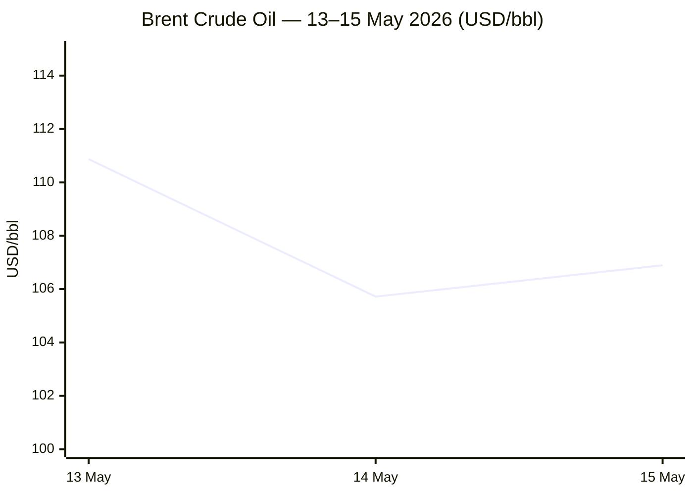

```yaml
---
brief_date: 2026-05-16
version: v1.2.1
run_time: "05:46 CET"
stories_published: 14
categories: [conflict, business, eu_affairs, technology, trends]
alert_counts:
  red: 4
  yellow: 6
  green: 4
ongoing_situations:
  - {name: "Russia-Ukraine War", real_world_start: "2022-02-24", day: 1543}
  - {name: "2026 Iran War / Hormuz Crisis", real_world_start: "2026-02-28", day: 78}
  - {name: "Israel-Lebanon Front", real_world_start: "2026-03-02", day: 76}
sources_fetched: 10
fetch_status:
  le_monde: "❌"
  faz: "❌"
  kommersant: "❌"
  xinhua: "⚠️"
  european_parliament: "⚠️"
expansion_queue: []
---
```

---

# 🌐 MORNING BRIEF
## Saturday, 16 May 2026 · 05:46 CET
### 14 stories across 5 categories

---

## DIGEST SUMMARY

| # | Category | Headline | Alert |
|---|----------|----------|-------|
| 1 | ⚔️ Conflict | Iran-US ceasefire on "massive life support" — nuclear enrichment deadlock confirmed at BRICS New Delhi | 🔴 |
| 2 | ⚔️ Conflict | Israel-Lebanon ceasefire extended 45 days after Washington talks; Hezbollah disarmament unresolved | 🟡 |
| 3 | ⚔️ Conflict | Ukraine: Russian forces continue net territorial losses; Ukrainian oil-infrastructure strikes at 16-year monthly high | 🟡 |
| 4 | ⚔️ Conflict | Hormuz dual blockade persists at ~5% normal transit; Trump-Xi agree strait must reopen | 🔴 |
| 5 | 💼 Business | Brent at $106.89/bbl; IEA warns global oil market undersupplied through October; Saudi output lowest since 1990 | 🔴 |
| 6 | 💼 Business | Global inflation surge: US CPI 3.8%, EU CPI 3.0%; ECB rate hike near-fully priced; gold slides 4% on week | 🟡 |
| 7 | 💼 Business | IMF April WEO: global growth cut to 3.1%; adverse scenario at 2.5% | 🟢 |
| 8 | 🇪🇺 EU Affairs | AI Act Digital Omnibus: provisional deal extends high-risk compliance to Dec 2027; "nudifier" apps banned | 🟢 |
| 9 | 🇪🇺 EU Affairs | EP May plenary opens Monday — steel tariffs, FDI screening, Middle East crisis, Ukraine on agenda | 🟢 |
| 10 | 🇪🇺 EU Affairs | EU defence ministers review Ukraine military support and Middle East security fallout | 🟡 |
| 11 | 🤖 Technology | White House considers FDA-style AI vetting; NIST secures testing agreements with Google DeepMind, Microsoft and xAI | 🟡 |
| 12 | 🤖 Technology | US data-centre resistance movement grows; AI sector pours $400m into 2026 elections | 🟢 |
| 13 | 📈 Trends | Hormuz fertiliser shock triggers global food security crisis; FAO index at highest since Feb 2023 | 🔴 |
| 14 | 📈 Trends | BRICS fractures on Iran war; UAE blocks joint statement; India and China position as mediators | 🟡 |

> Alert Level key: 🔴 High significance · 🟡 Developing · 🟢 Stable/Routine

---

## 🚨 SIGNAL BOARD

🔴 Iran FM Araghchi at BRICS New Delhi: nuclear enrichment talks in "deadlock"; Tehran "cannot trust the Americans at all" — 78 days into the war
🔴 Hormuz transit volume ~5% of pre-war normal; IEA warns oil market remains undersupplied through October even if conflict resolves next month
🟡 Brent $106.89/bbl (+1.11% session); US CPI 3.8% April beats estimates; ECB three hikes now 90%+ priced; gold down 4% on week
🟢 Israel-Lebanon ceasefire extended 45 days; Pentagon security track set for 29 May; political negotiations June 2–3
⚡ EU AI Act Digital Omnibus: provisional deal reached 7 May shifts high-risk AI compliance deadline from August 2026 to December 2027

---

## 🔄 ONGOING SITUATIONS

| Situation | Real-world start | Day # | Last significant development | Status |
|-----------|-----------------|-------|------------------------------|--------|
| Russia-Ukraine War | 24 Feb 2022 | Day 1,543 | Ukrainian oil-infrastructure strikes highest monthly count since Dec; Russian net territorial losses continuing | 🔴 Active |
| 2026 Iran War / Hormuz Crisis | 28 Feb 2026 | Day 78 | Ceasefire holding "shakily"; Araghchi at BRICS declares nuclear deadlock; Trump-Xi agree Hormuz must reopen | 🔴 Active / Ceasefire fragile |
| Israel-Lebanon Front | 02 Mar 2026 | Day 76 | Ceasefire extended 45 days (from 16 Apr baseline); Israeli strikes near Tyre continued through ceasefire | 🟡 Ceasefire extended |

---

## ⚔️ CONFLICT ANALYST

> 🔎 **CONFLICT ANALYST** · 4 updates today

### 1. Iran-US Ceasefire on "Massive Life Support" — Nuclear Enrichment Deadlock Confirmed 🔴

**Alert:** 🔴
**Summary:** At the BRICS Foreign Ministers' meeting in New Delhi (14–15 May), Iranian FM Abbas Araghchi declared that US-Iran nuclear enrichment negotiations have reached a "deadlock" and that both sides agreed to postpone the enriched-uranium question to later stages. Araghchi said Iran "cannot trust the Americans at all" and that contradictory US messaging deepens mistrust. Iran confirmed it received new US messages expressing willingness to continue talks. Trump separately dismissed Tehran's latest formal proposal as "garbage." A third round of US-Iran talks in Washington was described by a senior State Department official as "productive and positive," but no breakthrough emerged before the ceasefire's extension deadline.
**Significance:** The nuclear deadlock hardens the core obstacle to a comprehensive settlement. With enrichment postponed and trust severely degraded, the ceasefire's structural integrity is in doubt; any resumption of US strikes would likely reignite Hormuz hostilities and deliver a major additional energy shock.
**Sources:**

- [Al Jazeera — Araghchi: Iran doubts US 'seriousness' about talks amid nuclear deadlock](https://www.aljazeera.com/news/2026/5/15/araghchi_iran_doubts_us_seriousness_about_talks_amid_nuclear_deadlock) · 15 May 2026
- [CBS News — Iran war live updates: Araghchi says ceasefire is "shaky," cannot trust Americans](https://www.cbsnews.com/live-updates/iran-war-trump-strait-of-hormuz-trust-americans-control/) · 15 May 2026
- [Tribune India — Iran FM Araghchi admits enriched uranium "deadlock" with Washington](https://www.tribuneindia.com/news/world/iran-never-wanted-nuclear-weapons-fm-araghchi-admits-enriched-uranium-deadlock-with-washington/amp) · 15 May 2026

**Trend:** → Stable (ceasefire holding; underlying trajectory deteriorating)
**Tags:** #Iran #ceasefire #nuclear #peace-talks #Pakistan-mediation #MULTI-SOURCE

---

### 2. Israel-Lebanon Ceasefire Extended 45 Days After Washington Talks 🟡

**Alert:** 🟡
**Summary:** Following two days of US-facilitated talks in Washington (14–15 May), Israel and Lebanon agreed to a 45-day extension of the April 16 cessation of hostilities. A parallel Pentagon-run security track will commence on 29 May, and the State Department will reconvene political negotiations on 2–3 June. Despite the extended ceasefire, Israeli strikes continued in southern Lebanon on 15 May, killing at least nine people near Tyre and damaging a primary health centre adjacent to Hiram Hospital. Hezbollah — not party to the talks — continues limited operations. Lebanon's delegation called the talks "highly productive" and committed to transforming the ceasefire into a lasting agreement, while Israel insists on Hezbollah disarmament as a precondition for any final deal.
**Significance:** The extension preserves diplomatic momentum, but Israel's continued strikes and Hezbollah's unresolved status create structural fragility. The Lebanon track is now partly contingent on progress in US-Iran negotiations — Iran has listed ending Lebanon fighting as a precondition for a broader deal.
**Sources:**

- [Reuters / US News — Israel and Lebanon agree to extend ceasefire by 45 days](https://www.usnews.com/news/world/articles/2026-05-15/israel-and-lebanon-agree-to-extend-ceasefire-by-45-days-us-state-dept-says) · 15 May 2026
- [Bloomberg — Israel, Lebanon extend ceasefire 45 days after Washington talks](https://www.bloomberg.com/news/articles/2026-05-15/israel-lebanon-extend-ceasefire-45-days-after-washington-talks) · 15 May 2026
- [The National — Israel-Lebanon ceasefire extended by 45 days](https://www.thenationalnews.com/news/us/2026/05/15/israel-lebanon-ceasefire-extended-by-45-days/) · 15 May 2026

**Trend:** ↘ De-escalating (ceasefire renewed; operational violations persist)
**Tags:** #Lebanon #Hezbollah #ceasefire #peace-talks #Israel #MULTI-SOURCE

---

### 3. Ukraine: Russian Net Losses Continue; Ukrainian Oil-Infrastructure Strikes Peak 🟡

**Alert:** 🟡
**Summary:** In the week of 28 April–5 May, Russian forces suffered a net loss of 21 square miles of Ukrainian territory, following 46 square miles lost across 7 April–5 May — a period in which Ukraine also registered 21 oil-infrastructure strikes against Russian refineries, export terminals and pipeline stations, the highest monthly total since December, cutting Russian crude-processing rates to a 16-year low at 4.69 million barrels per day (roughly 11–12% below early-2026 levels). Russia continues to hold approximately 20% of Ukrainian territory. Energy infrastructure attrition on the Ukrainian side remains severe; generating capacity stands at around one-third of pre-war levels.
**Significance:** Ukraine's sustained offensive against Russian energy infrastructure is producing measurable economic effects within Russia while the front remains broadly stable. The campaign represents a strategic shift towards indirect attrition rather than direct territorial recovery.
**Sources:**

- [Russia Matters — Russia-Ukraine War Report Card, May 2026](https://www.russiamatters.org/news/russia-ukraine-war-report-card/russia-ukraine-war-report-card-may-6-2026) · 06 May 2026

**Trend:** ↘ De-escalating (territorial momentum shifts marginally toward Ukraine; no major offensive underway)
**Tags:** #Ukraine #Russia #frontline #energy-markets #day-1543

---

### 4. Hormuz Dual Blockade Persists at ~5% Transit; Trump-Xi Agree on Reopening 🔴

**Alert:** 🔴
**Summary:** The Strait of Hormuz remains effectively shut, with vessel transit at approximately 5% of pre-war levels (~150 ships per month vs the pre-conflict 3,000). Both Iran's maritime restrictions and the US counter-blockade of Iranian ports remain in force despite the ceasefire framework. On 15 May, Trump claimed the US was "in control" of the strait. During the Trump-Xi summit (14–15 May), both leaders agreed the Hormuz must be reopened, but China has declined to publicly pressure Tehran. Iran has allowed some Chinese ships limited transit and Araghchi stated the strait "is open" to states not at war with Iran. The IEA warned crude and fuel flows through the strait fell by nearly 6 million barrels per day in the first quarter and that the global market will likely remain heavily undersupplied through October even if the conflict resolves next month.
**Significance:** The dual blockade is now a structurally entrenched energy shock. At ~5% transit, reopening cannot be achieved quickly even following a ceasefire; insurers, shipowners and operators require sustained security guarantees before resuming normal passage.

📎 See also: Business § Story 5 — Brent at $106.89; oil market consequences of the dual blockade

**Sources:**
- [House of Commons Library — Israel/US-Iran conflict 2026: Reopening the Strait of Hormuz](https://commonslibrary.parliament.uk/research-briefings/cbp-10636/) · 13 May 2026
- [CBC — Status of US-Iran ceasefire in limbo as Strait of Hormuz remains unopened](https://www.cbc.ca/news/world/livestory/u-s-israel-iran-war-trump-deadline-9.7154523) · 13 May 2026

**Trend:** → Stable (blockade entrenched; no material change in transit volume)
**Tags:** #Hormuz #Iran #naval-blockade #oil-price #sanctions #MULTI-SOURCE

📚 *Background reading:* [Al Jazeera — Araghchi: Iran doubts US seriousness about talks amid nuclear deadlock](https://www.aljazeera.com/news/2026/5/15/araghchi_iran_doubts_us_seriousness_about_talks_amid_nuclear_deadlock) · 15 May 2026

---

## 💼 BUSINESS ANALYST

> 💼 **BUSINESS ANALYST** · 3 updates today

### 5. Brent at $106.89 — IEA Warns Oil Market Undersupplied Through October 🔴

**Alert:** 🔴
**Summary:** Brent crude closed at $106.89 per barrel on 15 May, up 1.11% on the session and 63.42% year-on-year, driven by ongoing Hormuz disruption. The IEA warned that crude and fuel flows through the strait fell by nearly 6 million barrels per day in Q1, and that the global oil market will likely remain significantly undersupplied through October even if the conflict ends next month. Saudi Arabia separately informed OPEC that its oil production fell to its lowest level since 1990, reflecting reduced Gulf output linked to security disruption. UBS forecasts Brent averaging $100 per barrel in June and declining to $85 by 2027 if the conflict resolves.
**Market signal:** Bearish on the broader economy — oil at this level is an inflation-intensifier that is feeding directly into CPI prints across advanced economies, with near-term supply relief dependent on a political outcome that remains highly uncertain.

📎 See also: Conflict § Story 4 — Hormuz dual blockade at 5% transit

**Sources:**
- [Trading Economics — Brent Crude Oil Price, Historical Data](https://tradingeconomics.com/commodity/brent-crude-oil) · 15 May 2026

**Trend:** ↗ Escalating (energy shock structural; no demand-side relief in sight)
**Tags:** #Brent #oil-price #Hormuz #supply-shock #energy-markets #data-point

---

### 6. Global Inflation Surge: US CPI 3.8%, EU 3.0%; ECB Rate Hikes Near-Fully Priced; Gold Down 🟡

**Alert:** 🟡
**Summary:** US headline CPI rose to 3.8% in April, above the 3.6% median estimate, with PPI also surging at its fastest pace since 2022. Markets have fully priced out any Fed rate cut in 2026, with some traders now betting on a December hike. The eurozone flash CPI estimate (Eurostat, 30 April) came in at 3.0% for April — up from 2.6% in March — driven by energy (+10.9%) as the Iran war pushes crude prices through the value chain. Money markets now price in a 90% probability of a June ECB rate hike, with three increases fully priced by end-2026. Gold fell to $4,483 per ounce on 15 May, down ~4% on the week and at its lowest since March, as elevated rate expectations weigh on the non-yielding asset.
**Market signal:** Bearish on risk assets — simultaneous US and European rate pressure signals a prolonged tightening cycle that will constrain growth recovery even after any Hormuz resolution.
**Sources:**

- [Trading Economics — Euro Area Currency (EUR/USD)](https://tradingeconomics.com/euro-area/currency) · 15 May 2026
- [Trading Economics — Gold Price](https://tradingeconomics.com/commodity/gold) · 15 May 2026
- [Eurostat — Euro area annual inflation up to 3.0% in April 2026](https://ec.europa.eu/eurostat/web/products-euro-indicators/w/2-30042026-ap) · 30 April 2026

**Trend:** ↗ Escalating (inflation re-accelerating; monetary tightening cycle re-opening)
**Tags:** #inflation #ECB #Fed #interest-rates #gold #data-point #MULTI-SOURCE

---

### 7. IMF April WEO: Global Growth at 3.1% Reference; Adverse Scenario at 2.5% 🟢

**Alert:** 🟢
**Summary:** The IMF's April 2026 World Economic Outlook — subtitled *Global Economy in the Shadow of War* — cut its global growth reference forecast to 3.1% for 2026 (down from 3.4% in the January update), with global headline inflation projected at 4.4%. The adverse scenario, assuming a more prolonged or expanded conflict, places growth at 2.5% — a level historically associated with global recession conditions. A severe scenario yields 2.0% global growth with inflation above 6%. The fund noted that the impact is highly uneven, with MENA economies facing a cumulative growth revision of nearly three percentage points, and commodity-importing low-income countries the most exposed. China's 2026 growth was revised modestly upward to 4.4%, benefiting from reduced tariff pressure following the IEEPA ruling.
**Market signal:** Neutral — the reference forecast implies recession risk is priced in; the downside tail (adverse/severe scenarios) is the variable markets are trading on moment to moment.
**Sources:**

- [IMF — World Economic Outlook, April 2026: Global Economy in the Shadow of War](https://www.imf.org/en/publications/weo/issues/2026/04/14/world-economic-outlook-april-2026) · 14 April 2026

**Trend:** ↘ De-escalating (from October 2025 trajectory; current conflict is incremental deterioration)
**Tags:** #IMF #GDP-forecast #inflation #commodities #institutional

📚 *Background reading:* [URL UNAVAILABLE — Bruegel on IMF growth scenario analysis] · [URL UNAVAILABLE — CFR on MENA economic fallout]

---

## 🇪🇺 EU AFFAIRS ANALYST

> 🇪🇺 **EU AFFAIRS ANALYST** · 3 updates today

### 8. AI Act Digital Omnibus: Provisional Deal Pushes High-Risk Compliance to December 2027 🟢

**Alert:** 🟢
**Summary:** On 7 May 2026, the European Parliament and the Council reached a provisional political agreement on the AI Act Digital Omnibus — a package of targeted amendments to the EU AI Act. The deal, struck after nine hours of negotiations at the third trilogue following a collapse on 28 April over Annex I scope, extends the compliance deadline for high-risk AI systems (covering biometrics, employment, education, law enforcement and critical infrastructure) from 2 August 2026 to 2 December 2027. A new prohibition on AI-generated non-consensual intimate imagery ("nudifier" apps) was added, with a compliance deadline of 2 December 2026. The Machinery Regulation has been moved from Section A to Section B of Annex I. Formal adoption is expected before 2 August 2026; the text is currently undergoing legal-linguistic revision.
**Legislative/policy stage:** Provisional political agreement reached (7 May 2026); formal adoption by Parliament and Council pending; publication in the Official Journal of the EU anticipated within approximately two months. Original high-risk AI obligations remain legally in force until publication.
**Sources:**

- [Council of the EU — Artificial intelligence: Council and Parliament agree to simplify and streamline rules](https://www.consilium.europa.eu/en/press/press-releases/2026/05/07/artificial-intelligence-council-and-parliament-agree-to-simplify-and-streamline-rules/) · 07 May 2026
- [EC Digital Strategy — AI Act updates and press releases](https://digital-strategy.ec.europa.eu/en/policies/regulatory-framework-ai) · 08 May 2026

**Trend:** ↘ De-escalating (regulatory compliance pressure eased for industry; governance framework now clearer)
**Tags:** #AI-regulation #digital-regulation #EU-institutions #single-market #MULTI-SOURCE

---

### 9. EP May Plenary Opens Monday — Steel Tariffs, FDI Screening, Middle East on Agenda 🟢

**Alert:** 🟢
**Summary:** The European Parliament's May plenary session runs from 18 to 21 May in Strasbourg. Key items include a debate and vote on a new EU steel safeguard regulation to replace Trump-era import protections expiring in June 2026 — the measure would significantly reduce quotas and double tariffs, applying from 1 July 2026. MEPs will also vote on the revised Foreign Direct Investment Screening Regulation, aimed at harmonising FDI rules across all member states. High Representative Kaja Kallas is scheduled to respond to questions on the EU's Middle East strategy. The EP will honour the inaugural European Order of Merit laureates on Tuesday 19 May.
**Legislative/policy stage:** Steel safeguard regulation: provisional agreement reached with Council; plenary vote Monday evening. FDI Screening Regulation: provisional agreement; Tuesday vote. Both texts require official publication before entry into force.
**Sources:**

- [EP Think Tank — European Parliament Plenary Session, May 2026](https://epthinktank.eu/2026/05/13/european-parliament-plenary-session-may-2026/) · 13 May 2026
- [European Parliament — Press briefing on next week's plenary session](https://www.europarl.europa.eu/news/en/press-room/20260512IPR43212/press-briefing-on-next-week-s-plenary-session) · 12 May 2026

**Trend:** → Stable (legislative calendar proceeding as planned)
**Tags:** #EU-institutions #single-market #EU-defence #EU-institutions #MULTI-SOURCE

---

### 10. EU Defence Ministers Review Ukraine Military Support and Middle East Security Fallout 🟡

**Alert:** 🟡
**Summary:** EU defence ministers met this week (week of 11 May) to exchange views on EU military support for Ukraine, defence readiness, and the security implications of the Middle East war for EU territory. The High Representative chaired the European Defence Agency Steering Board in the margins. Ministers also received a briefing on the updated EU threat analysis, reflecting the altered security landscape since the Iran war began in late February. The EU's SAFE programme — aimed at supporting member states' defence expenditure — and the broader EU defence readiness agenda are both under renewed pressure as the Middle East situation is assessed to carry direct implications for European energy security and potential spillover risks.
**Legislative/policy stage:** No new legislative decision taken; ministerial discussion phase. SAFE programme regulation is being fast-tracked as part of EU joint legislative priorities for 2026.
**Sources:**

- [EUbusiness — EU Agenda: Week Ahead 11–16 May 2026](https://www.eubusiness.com/politics/eucalendar/) · 11 May 2026
- [European Parliament — Press briefing on next week's plenary session](https://www.europarl.europa.eu/news/en/press-room/20260512IPR43212/press-briefing-on-next-week-s-plenary-session) · 12 May 2026

**Trend:** ↗ Escalating (EU defence posture hardening in response to Middle East instability)
**Tags:** #EU-defence #Ukraine-aid #EU-institutions #energy-policy #MULTI-SOURCE

📚 *Background reading:* [URL UNAVAILABLE — ECFR on EU strategic autonomy and Middle East fallout] · [URL UNAVAILABLE — Bruegel on SAFE programme fiscal implications]

---

## 🤖 TECHNOLOGY ANALYST

> 🤖 **TECHNOLOGY ANALYST** · 2 updates today

### 11. White House Considers FDA-Style AI Vetting; NIST Secures Testing Pacts with Google DeepMind, Microsoft and xAI 🟡

**Alert:** 🟡
**Summary:** The Trump administration is actively considering a mandatory pre-release vetting regime for AI models, akin to an FDA drug-approval framework — a potential reversal from its initial deregulatory posture. The debate was triggered in part by Anthropic's unreleased "Mythos" model, which can identify and patch security vulnerabilities at scale, raising dual-use concerns. In parallel, NIST's Center for AI Standards and Innovation announced that Google DeepMind, Microsoft, and xAI agreed to submit models for government safety testing ahead of release. The White House official stated that "policy announcements will come directly from Trump" and denied that messaging has shifted, but the FDA-style regulatory discussion has alarmed both deregulatory advocates and state-level AI governance proponents.
**Analyst note:** If an FDA-style federal vetting regime is enacted within the next 12–24 months, it would introduce mandatory pre-market clearance timelines of potentially six to twelve months for frontier models, materially changing the competitive dynamics between US developers and non-US counterparts operating under lighter regulatory regimes.

📎 See also: EU Affairs § Story 8 — EU AI Act Omnibus also extends compliance deadlines; parallel regulatory pressure on both sides of the Atlantic

**Sources:**
- [The Hill — White House considers AI vetting, sparks tech industry concern](https://thehill.com/policy/technology/5870495-white-house-ai-policy-shift/) · 14 May 2026

**Trend:** ⚡ Reversal (shift from US deregulatory stance toward potential mandatory pre-market testing)
**Tags:** #AI #AI-regulation #AI-safety #LLM #semiconductor

---

### 12. US AI Data-Centre Resistance Movement Grows; Sector Commits $400m to 2026 Elections 🟢

**Alert:** 🟢
**Summary:** A growing grassroots movement across the United States is opposing the rapid construction of AI data centres, raising concerns over land use, water consumption, and energy draw. Polling data cited by activist Astra Taylor indicates 80% of Republicans and independents — including Trump voters — support more AI regulation even at the cost of slower development; only 10% of the public expressed enthusiasm about AI's direction in a recent survey. The AI sector has reportedly directed an estimated $400m into US elections in 2026, prompting concerns from senator Bernie Sanders about corporate capture of democratic governance. The House of Commons Science, Innovation and Technology Committee in the UK simultaneously opened an inquiry into low-energy computing alternatives, with a focus on neuromorphic photonics, as a response to AI's rising energy demands.
**Analyst note:** A sustained political and community backlash against data-centre siting — if it hardens into zoning legislation or federal permitting delays over the next 12–24 months — could materially constrain hyperscaler capacity expansion plans and shift build-out to geographies with lighter regulatory environments.
**Sources:**

- [Democracy Now! — Astra Taylor on AI data centre resistance and the billionaire Big Tech agenda](https://www.democracynow.org/2026/5/13/astra_taylor_ai_data_centers_backlash) · 13 May 2026

**Trend:** ↗ Escalating (public scepticism hardening; political monetisation of AI governance accelerating)
**Tags:** #AI #data-centre #public-opinion #AI-regulation #energy-policy

📚 *Background reading:* [URL UNAVAILABLE — RAND on AI governance and democratic legitimacy]

---

## 📈 TRENDS ANALYST

> 📈 **TRENDS ANALYST** · 2 updates today

### 13. Hormuz Fertiliser Shock Is Triggering a Structural Global Food Security Crisis 🔴

**Alert:** 🔴
**Summary:** The FAO Food Price Index averaged 130.7 points in April 2026 — up 1.6% from March and 2.0% year-on-year, the highest reading since February 2023 and a third consecutive monthly increase. Vegetable oil prices jumped 5.9% (highest since June 2022); meat hit a record high. A third of the world's seaborne fertilisers normally transit the Hormuz corridor; their effective absence is driving urea and phosphate prices sharply higher, with FAO projecting global fertiliser costs running 15–20% above baseline through H1 2026. WFP warned in March that 45 million additional people risk acute food insecurity if oil remains above $100 and the conflict is not resolved by mid-year. In Somalia, the cost of 4,500kg of therapeutic peanut food for malnourished children has more than tripled in two months as supply routes are rerouted; 83 children now receive treatment that would otherwise support 300. US farmers report fertiliser costs too high to afford inputs for the 2026 season in 70% of cases.
**Horizon:** Long-term structural shift. The fertiliser channel disruption will affect planting decisions and crop yields across the 2026 growing season and into 2027; even if Hormuz reopens within weeks, price normalisation and supply-chain reconstruction will require months to years. The food security impact will compound the humanitarian crises already active in sub-Saharan Africa and South Asia.
**Sources:**

- [FAO — Food Price Index, April 2026 release](https://www.fao.org/worldfoodsituation/foodpricesindex/en) · 08 May 2026
- [CARE — The Middle East conflict and the blocking of the Strait of Hormuz are fuelling a global hunger crisis](https://www.care.org/media-and-press/the-middle-east-conflict-and-the-blocking-of-the-strait-of-hormuz-are-fueling-a-global-hunger-crisis/) · 14 May 2026
- [FAO Newsroom — Chief Economist warns of severe global food security risks from Strait of Hormuz disruption](https://www.fao.org/newsroom/detail/fao-chief-economist-warns-of-severe-global-food-security-risks-from-disruption-to-strait-of-hormuz-trade-corridor/en) · 26 March 2026

**Trend:** ↗ Escalating (food price index rising; fertiliser shock propagating through agricultural value chain)
**Tags:** #food-security #food-prices #Hormuz #shipping #supply-shock #humanitarian #MULTI-SOURCE

---

### 14. BRICS Fractures on Iran War; UAE Blocks Statement; India and China Positioning as Mediators 🟡

**Alert:** 🟡
**Summary:** The 18th BRICS Foreign Ministers' Meeting in New Delhi (14–15 May 2026, India chairing) failed to produce a final joint statement after the UAE — a BRICS member since 2024 — blocked consensus language on the Iran war, citing its alignment with Israel and the United States. Iran's Araghchi publicly accused the UAE of "stopping the final statement" due to its "special relationship with Israel," calling it "very, very unfortunate." India, as 2026 BRICS chair, issued only a Chair's statement amid "differing views." Iran expressed particular appreciation for China's potential mediating role, and Araghchi stated that future negotiations might involve Moscow on the enriched uranium issue. Indian PM Modi, visiting the UAE on 15 May, called for an "open and safe" Hormuz. The episode reflects a deepening structural split within BRICS between the Iran-aligned axis (Russia, China, Iran) and Gulf-aligned members (UAE, Saudi Arabia).
**Horizon:** Medium-term trend signal. BRICS's expansion to include Gulf states has introduced irreconcilable tensions on the Iran war that will constrain the bloc's multilateral coherence for the duration of the conflict and likely beyond, as members are forced to choose between their alignment commitments and bloc unity.
**Sources:**

- [Al Jazeera — Araghchi: Iran doubts US seriousness about talks amid nuclear deadlock](https://www.aljazeera.com/news/2026/5/15/araghchi_iran_doubts_us_seriousness_about_talks_amid_nuclear_deadlock) · 15 May 2026
- [PBS Newshour — Israel and Lebanon agree to 45-day extension of ceasefire](https://www.pbs.org/newshour/world/israel-and-lebanon-agree-to-45-day-extension-of-ceasefire-u-s-state-department-says) · 15 May 2026

**Trend:** ↗ Escalating (bloc fragmentation accelerating; alternative mediation coalitions emerging)
**Tags:** #diplomacy #mediation #Pakistan-mediation #Iran #diplomacy #MULTI-SOURCE

📚 *Background reading:* [Al Jazeera — Araghchi: Iran doubts US seriousness about talks amid nuclear deadlock](https://www.aljazeera.com/news/2026/5/15/araghchi_iran_doubts_us_seriousness_about_talks_amid_nuclear_deadlock) · 15 May 2026

---

## 📊 KEY DATA OF THE DAY

> 📊 **DATA OFFICER** · 7 indicators

| Indicator | Value | Δ vs prior session | Δ vs 7 days ago | Note | Source | URL |
|-----------|-------|-------------------|-----------------|------|--------|-----|
| EUR/USD | 1.1702 | N/A | N/A | Lowest since early April; ECB rate hike(s) fully priced, weighing on euro | ECB Data Portal | [link](https://data.ecb.europa.eu/key-figures/ecb-interest-rates-and-exchange-rates/exchange-rates) |
| Brent Crude (USD/bbl) | 106.89 | +1.11% | N/A | +63.42% YoY; IEA warns market undersupplied through Oct; Saudi output lowest since 1990 | Trading Economics | [link](https://tradingeconomics.com/commodity/brent-crude-oil) |
| Gold (XAU/USD) | 4,483.00 | ~−1.0% | N/A | Down ~4% on week; lowest since March 2026; US rate-hike fears outweigh safe-haven demand | Trading Economics / LBMA | [link](https://tradingeconomics.com/commodity/gold) |
| IMF Global Growth 2026 | 3.1% | −0.3pp vs Jan WEO | N/A | "Reference forecast" (limited conflict); adverse scenario at 2.5%; severe at 2.0% | IMF WEO April 2026 | [link](https://www.imf.org/en/publications/weo/issues/2026/04/14/world-economic-outlook-april-2026) |
| EU CPI YoY (April 2026 flash) | 3.0% | +0.4pp vs March | +1.3pp vs January | Energy component +10.9%; full release 20 May 2026. Highest since Sept 2023 | Eurostat | [link](https://ec.europa.eu/eurostat/web/products-euro-indicators/w/2-30042026-ap) |
| FAO Food Price Index | 130.7 | +1.6% vs March | +2.0% vs April 2025 | April 2026 — latest available; third consecutive monthly rise; highest since Feb 2023 | FAO | [link](https://www.fao.org/worldfoodsituation/foodpricesindex/en) |
| Hormuz Transit Volume (% of pre-conflict normal) | ~5% | N/A | N/A | Pre-conflict: ~3,000 vessels/month; current ~150/month; dual blockade entrenched | House of Commons Library | [link](https://commonslibrary.parliament.uk/research-briefings/cbp-10636/) |

**Data commentary:** The energy shock from the Hormuz crisis is now manifesting across multiple indicator tracks simultaneously. Brent at $106.89 is feeding directly into EU CPI (energy component +10.9%), while the ECB's hawkish pivot — three hikes now priced — is suppressing gold and compressing the EUR/USD to multi-week lows. The IMF's 3.1% reference growth forecast was conditioned on conflict fading by mid-2026; with Day 78 of the war showing no sign of resolution and the nuclear enrichment question formally deferred, the probability of the adverse scenario (2.5%) is rising materially. The FAO food price index at 130.7 — highest since February 2023 — reflects a fertiliser channel disruption that will outlast any ceasefire.

---

## 📈 CHARTS

**Chart 1 — Brent Crude: Three-Session Trend (Confirmed Data)**



*Note: 14 May value derived from 15 May close and confirmed −1.11% session change. Only three sessions with confirmed data available this run; insufficient historical series for Chart 3.*

---

## ⚙️ AGENT METADATA

| Field | Value |
|-------|-------|
| Agent version | MORNING BRIEF v1.2.1 |
| Run timestamp | 2026-05-16T05:46:05+02:00 |
| Fetch status | Le Monde ❌ · FAZ ❌ · Kommersant ❌ · Xinhua ⚠️ (content dated 24 April, outside 24h window) · EP ⚠️ (navigation structure only; most recent press release 12 May) |
| Sources queried | 10 / 11 (World Bank not explicitly queried this run) |
| Stories surfaced | ~28 before editorial filter |
| Stories published | 14 after editorial filter |
| Languages processed | EN, FR (Le Monde fallback search) |
| Output language | English (British) |
| Date validated | ✅ Confirmed 16 May 2026 |
| Expansion Queue | None — all story tags resolved from closed list |

---

*MORNING BRIEF is an AI-assisted digest. All summaries are paraphrased from original sources. Verify time-sensitive information at the linked URLs before acting. Output language: British English.*
