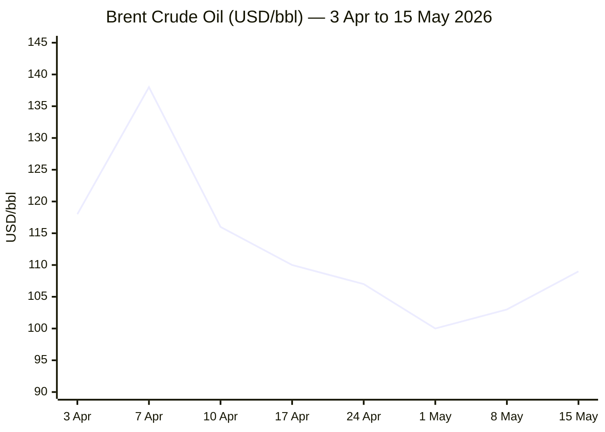
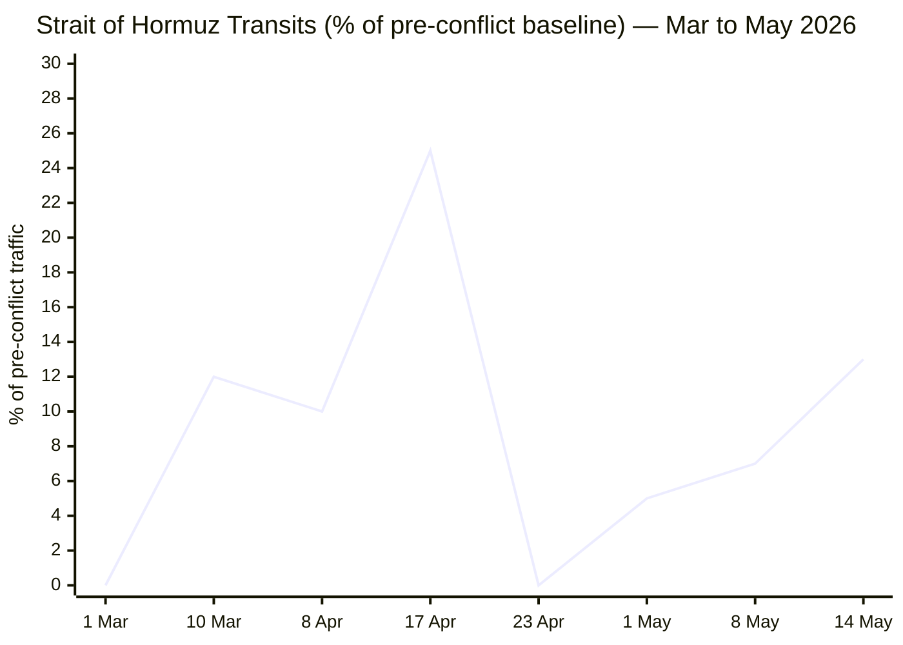

```yaml
---
brief_date: 2026-05-17
version: v1.2.1
run_time: "06:05 CET"
stories_published: 13
categories: [conflict, business, eu_affairs, technology, trends]
alert_counts:
  red: 2
  yellow: 11
  green: 0
ongoing_situations:
  - {name: "Russia-Ukraine War", real_world_start: "2022-02-24", day: 1544}
  - {name: "2026 Iran War & Hormuz Crisis", real_world_start: "2026-02-28", day: 79}
  - {name: "2026 Lebanon War / Ceasefire", real_world_start: "2026-03-17", day: 62}
sources_fetched: 9
fetch_status:
  le_monde: "❌"
  faz: "❌"
  kommersant: "❌"
  xinhua: "⚠️"
  european_parliament: "❌"
expansion_queue: []
---
```

# 🌐 MORNING BRIEF
## Sunday, 17 May 2026 · 06:05 CET
### 13 stories across 5 categories

---

## DIGEST SUMMARY

| # | Category | Headline | Alert |
|---|----------|----------|-------|
| 1 | ⚔️ Conflict | NYT: US/Israel preparing new strikes on Iran, possibly this week | 🔴 |
| 2 | ⚔️ Conflict | Lebanon: 45-day ceasefire extension; IDF strikes Hezbollah daily | 🟡 |
| 3 | ⚔️ Conflict | Russia strikes Odesa/Kharkiv; Ukraine hits Ryazan refinery; US Russian-oil waiver expires | 🟡 |
| 4 | 💼 Business | Brent at $109/bbl; EIA forecasts undersupply through Oct 2026 | 🔴 |
| 5 | 💼 Business | Global equity selloff: S&P −1.24%, Nasdaq −1.54%, VIX +6.78% | 🟡 |
| 6 | 💼 Business | IMF: global growth 3.1%; EU CPI hits 3.0%; ECB markets price three rate hikes | 🟡 |
| 7 | 🇪🇺 EU Affairs | AccelerateEU enters force: 44 energy measures, €24bn import bill, nuclear pivot | 🟡 |
| 8 | 🇪🇺 EU Affairs | SAFE 2nd wave: Commission approves second batch of defence funding | 🟡 |
| 9 | 🤖 Technology | EU AI Act GPAI enforcement: 2 August 2026 deadline, fines up to 3% global turnover | 🟡 |
| 10 | 🤖 Technology | Semiconductor scarcity deepens: TSMC accelerating 2nm, but data-centre bottleneck structural | 🟡 |
| 11 | 📈 Trends | Trump-Xi summit (14–15 May): US-China trade stabilisation; China bids to mediate Hormuz | 🟡 |
| 12 | 📈 Trends | FAO food prices: 3rd consecutive rise to 130.7; record meat prices; fertiliser cascade looms | 🟡 |
| 13 | 📈 Trends | Hormuz structural crisis: ~5% pre-war traffic; 1,550 vessels stranded; UK naval deployment | 🟡 |

> Alert Level key: 🔴 High significance · 🟡 Developing · 🟢 Stable/Routine

---

## 🚨 SIGNAL BOARD

🔴 **NYT (15 May): US and Israel intensifying preparations for new Iran strikes — operations possible "as soon as next week"**
🔴 **Brent crude at $109.26/bbl (+3.35% on 15 May), +67% year-on-year; EIA forecasts market undersupplied through October 2026**
🟡 **EU HICP inflation surges to 3.0% in April (energy component +10.9%); ECB markets fully price three rate hikes by year-end**
🟡 **Lebanon: US announces 45-day ceasefire extension after 3rd round of Washington talks; IDF strikes Hezbollah targets daily despite truce**
⚡ **US waiver permitting Russian oil purchases expired 16 May without renewal; UAE departed OPEC effective 1 May — dual OPEC+ structural shifts**

---

## 🔄 ONGOING SITUATIONS

| Situation | Real-world start | Day # | Last significant development | Status |
|-----------|-----------------|-------|------------------------------|--------|
| Russia–Ukraine War | 24 Feb 2022 | Day 1,544 | Russian overnight strikes on Odesa/Kharkiv (15–16 May); Ukraine drone strike on Ryazan oil refinery | 🔴 Active |
| 2026 Iran War & Hormuz Crisis | 28 Feb 2026 | Day 79 | NYT: US/Israel preparing new strikes; "dual blockade" continues; ceasefire on "massive life support" | 🔴 Active (fragile ceasefire) |
| 2026 Lebanon War / Ceasefire | 17 Mar 2026 | Day 62 | US announces 45-day ceasefire extension from 16 Apr; IDF struck Hezbollah targets over weekend | 🟡 Ceasefire (porous) |

---

## ⚔️ CONFLICT ANALYST · 3 updates today

> 🔎 **CONFLICT ANALYST** · 3 updates today

---

### 1. Iran War — US/Israel Preparing New Strikes, Operations Possibly This Week 🔴

**Alert:** 🔴
**Summary:** The *New York Times* reported on 15 May that Israel and the United States are intensifying preparations for potential new attacks on Iran, with operations possibly beginning as soon as the week of 18 May. US officials are considering deploying special-forces units to retrieve nuclear materials, strikes on Kharg Island — Iran's primary crude-export hub — and intensified bombing of military and infrastructure targets. The ceasefire, in effect since 8 April, has been repeatedly violated by both sides; Trump has called it "massive life support." Iran's latest counter-proposal, including recognition of its sovereignty over the Strait of Hormuz, was rejected as "unacceptable" by Trump.
**Significance:** A resumption of major combat operations would end the fragile ceasefire, eliminate any near-term prospect of Hormuz reopening, and represent the most significant Middle East escalation since Operation Epic Fury began on 28 February. Kharg Island handles approximately 90% of Iranian crude exports; any strike there would compound the existing global energy supply shock.
**Sources:**
- [Wikipedia — 2026 Iran War](https://en.wikipedia.org/wiki/2026_Iran_war) · 17 May 2026 *(cites NYT, 15 May 2026)*
- [CNN — Ceasefire on 'Massive Life Support'](https://www.cnn.com/2026/05/11/world/live-news/iran-war-proposal-trump) · 12 May 2026
- [Britannica — 2026 Iran War](https://www.britannica.com/event/2026-Iran-war) · 17 May 2026
**Trend:** ↗ Escalating
**Tags:** #Iran #nuclear #escalation #MULTI-SOURCE

---

### 2. Lebanon — US Announces 45-Day Ceasefire Extension; IDF Strikes Daily 🟡

**Alert:** 🟡
**Summary:** The US State Department announced on 15 May a 45-day extension of the 16 April cessation of hostilities between Israel and Lebanon, following two days of talks at the State Department — the third round between Jerusalem and Beirut. A fourth round is scheduled for 2–3 June; a separate security track will convene at the Pentagon on 29 May. Despite the extension, Israeli strikes on Hezbollah targets in southern Lebanon have continued daily, with the US granting Jerusalem permission to target "any deemed threats." Hezbollah has fired rockets and launched drone swarms at IDF bases. Over the weekend, the IDF struck more than 100 Hezbollah targets; Israel also targeted Hamas commander Izz al-Din al-Haddad, described as one of the last surviving architects of the 7 October attacks.
**Significance:** The 45-day extension — the second since the original ceasefire — buys diplomatic space but does not constrain either side's operations. The US framing of the truce as "productive" conceals a structurally porous arrangement that could collapse at any moment given the simultaneous Iran crisis.
**Sources:**
- [Times of Israel — US Announces 45-Day Extension](https://www.timesofisrael.com/liveblog_entry/us-announces-45-day-extension-of-porous-lebanon-ceasefire-after-3rd-round-of-beirut-jlem-talks/) · 15 May 2026
- [CBC News — Israel-Lebanon Ceasefire Extended](https://www.cbc.ca/news/world/israel-lebanon-ceasefire-9.7201450) · 15 May 2026
**Trend:** → Stable
**Tags:** #Lebanon #ceasefire #Hezbollah #peace-talks

---

### 3. Russia–Ukraine — Overnight Strikes on Ukraine; Ryazan Refinery Hit; US Waiver Lapses 🟡

**Alert:** 🟡
**Summary:** Russian forces launched overnight strikes on critical infrastructure in Odesa Oblast and Kharkiv on 15–16 May. At least 3 people were killed and 63 injured in Russian attacks over the past 24 hours. Ukraine struck back: drones hit a major Russian fertiliser plant linked to explosives production, and Ukrainian forces destroyed an oil refinery in Ryazan on 15 May, triggering a state of emergency after an "oil rain" phenomenon in the city. Ukraine also struck a Be-200 amphibious aircraft. Separately, the US waiver permitting purchases of Russian oil stranded at sea expired without renewal at midnight on 16 May. Putin is to visit China "days after Trump," signalling continued deepening of Russia–China strategic alignment.
**Significance:** The Ryazan refinery strike represents a significant escalation of Ukraine's campaign against Russian energy infrastructure. The lapse of the US Russian-oil waiver compounds financial pressure on Moscow and closes a residual loophole in the sanctions regime.
**Sources:**
- [Kyiv Independent — Russia-Ukraine Updates](https://kyivindependent.com/) · 17 May 2026
- [Ukrinform — War Updates](https://www.ukrinform.net/rubric-ato) · 16 May 2026
- [ACLED — Ukraine Conflict Monitor](https://acleddata.com/monitor/ukraine-conflict-monitor) · 16 May 2026
**Trend:** → Stable
**Tags:** #Ukraine #Russia #frontline #sanctions

📚 *Background reading:* [Kyiv Independent — ISW Assessment: Russian Advance Rates Donetsk](https://kyivindependent.com/) · [Carnegie Endowment — Iran Nuclear Question After Two Wars](https://carnegieendowment.org/emissary/2026/05/iran-nuclear-program-progress-deal)

---

## 💼 BUSINESS ANALYST · 3 updates today

> 💼 **BUSINESS ANALYST** · 3 updates today

---

### 4. Brent Crude at $109/bbl — EIA Forecasts Undersupply Through October 🔴

**Alert:** 🔴
**Summary:** Brent crude closed at $109.26/bbl on 15 May 2026, up 3.35% on the day and 9.91% over the past month, reflecting near-total closure of the Strait of Hormuz. The EIA's May Short-Term Energy Outlook (released 12 May) assessed that 10.5 million barrels per day of Middle East production were shut in during April, with the Strait expected to remain effectively closed through late May and not returning to pre-conflict levels before late 2026 or early 2027. The IEA warned separately that the global oil market could remain materially undersupplied through October. Brent peaked at $138/bbl on 7 April. The UAE announced its departure from OPEC effective 1 May, reducing OPEC's notional spare capacity from 3.8 million b/d to 2.5 million b/d in 2027.
**Market signal:** Bearish for consumers and equity markets: sustained elevated Brent above $100/bbl feeds directly into eurozone inflation (energy component now +10.9% YoY) and suppresses discretionary spending globally.
**Sources:**
- [EIA Short-Term Energy Outlook, May 2026](https://www.eia.gov/outlooks/steo/) · 12 May 2026
- [Trading Economics — Brent Crude](https://tradingeconomics.com/commodity/brent-crude-oil) · 15 May 2026
- [Yahoo Finance — Brent Futures](https://finance.yahoo.com/quote/BZ=F/) · 15 May 2026
**Trend:** ↗ Escalating

📎 See also: Conflict § Story 1 — US/Israel preparing new Iran strikes; renewed hostilities would eliminate any near-term Hormuz reopening timeline

**Tags:** #Brent #oil-price #Hormuz #supply-shock

---

### 5. Global Equity Selloff — S&P −1.24%, Nasdaq −1.54%, VIX Surges 🟡

**Alert:** 🟡
**Summary:** US equities fell sharply on 15 May: the S&P 500 closed at 7,408.50 (−1.24%), the Nasdaq at 26,225.15 (−1.54%), and the Dow at 49,526.17 (−1.07%), reversing the Dow's brief return to 50,000 on 14 May. The VIX spiked 6.78% to 18.43. The selloff followed Trump's dismissal of Iran's latest nuclear counter-proposal as "unacceptable" and mounting evidence — including the NYT report on new US/Israel strike preparations — that a ceasefire collapse is imminent. Gold fell 2.63% to $4,561.90 as risk-off positioning shifted toward cash amid rising rate-hike expectations.
**Market signal:** Bearish: equity markets are pricing in a higher-for-longer oil scenario and growing probability of resumed conflict that would keep Hormuz effectively closed through Q3 2026.
**Sources:**
- [Yahoo Finance — S&P 500 and Markets](https://finance.yahoo.com/quote/BZ=F/) · 15 May 2026
**Trend:** ↘ De-escalating
**Tags:** #equity-selloff #SP500 #Nasdaq #market-shock

---

### 6. IMF Cuts Global Growth to 3.1%; EU CPI Hits 3.0%; ECB Hawkish Turn 🟡

**Alert:** 🟡
**Summary:** The IMF's April 2026 World Economic Outlook — its first Iran-war-era forecast — projects global growth at 3.1% for 2026 (reference scenario), down from 3.3% in the January Update and 3.5% in the October 2025 WEO, with global headline inflation rising to 4.4%. In the adverse scenario, growth falls to 2.5% and inflation to 5.4%. Separately, Eurostat's flash estimate puts EU HICP inflation at 3.0% in April 2026 (up from 2.6% in March), driven by an energy component of 10.9% — its highest since February 2023. ECB Governing Council member Martins Kazaks stated the ECB will raise borrowing costs if energy prices feed into inflation expectations; markets now price in three ECB rate hikes by year-end.
**Market signal:** Bearish for growth assets: the IMF's downgrade confirms the Iran war is a stagflationary shock, and ECB tightening into a weakening economy risks compressing eurozone margins.
**Sources:**
- [IMF World Economic Outlook, April 2026](https://www.imf.org/en/publications/weo/issues/2026/04/14/world-economic-outlook-april-2026) · 14 April 2026
- [Eurostat — Euro Area Inflation Flash Estimate, April 2026](https://ec.europa.eu/eurostat/web/products-euro-indicators/w/2-30042026-ap) · 30 April 2026
- [Trading Economics — EUR/USD](https://tradingeconomics.com/euro-area/currency) · 15 May 2026
**Trend:** ↗ Escalating
**Tags:** #IMF #GDP-forecast #ECB #inflation

📚 *Background reading:* [Bruegel — How Will the Iran Conflict Hit European Energy Markets](https://www.bruegel.org/first-glance/how-will-iran-conflict-hit-european-energy-markets) · [CSIS — Trump-Xi Summit Beijing](https://www.csis.org/analysis/trump-xi-summit-beijing-managing-worlds-most-important-relationship)

---

## 🇪🇺 EU AFFAIRS ANALYST · 2 updates today

> 🇪🇺 **EU AFFAIRS ANALYST** · 2 updates today

---

### 7. AccelerateEU Enters Force — 44 Energy Measures, Nuclear Pivot, €24bn Import Bill 🟡

**Alert:** 🟡
**Summary:** The European Commission's AccelerateEU strategy — a 44-action package to protect EU households and industries from the Iran-war-driven fossil-fuel shock — entered application in April–May 2026. The Commission estimates the crisis has cost the EU an additional €24bn in energy imports since 28 February. Measures include relaxed state-aid rules permitting targeted temporary emergency support, coordination of gas storage via the 2025 Energy Union Task Force, a Fuel Observatory to track potential shortages, and an electrification push that includes, for the first time since the post-Fukushima retreat, explicit Commission support for delayed nuclear plant retirement. An Electrification Action Plan and Grids Package are expected by summer 2026.
**Legislative/policy stage:** In application (April–May 2026 entry into force for most measures); Electrification Action Plan and Grids Package scheduled by summer 2026.
**Sources:**
- [Carbon Brief — EU Strategy: 44 Actions to Limit Fossil-Fuel Price Shocks](https://www.carbonbrief.org/iran-war-eu-strategy-sets-out-44-actions-to-limit-fossil-fuel-price-shocks/) · 24 April 2026
- [European Parliament — Parliamentary Question on Energy Price Shock](https://www.europarl.europa.eu/doceo/document/E-10-2026-000986_EN.html) · 10 March 2026
**Trend:** ↗ Escalating
**Tags:** #EU-institutions #energy-policy #climate-policy #energy-transition

---

### 8. SAFE 2nd Wave — Commission Approves Second Batch of Defence Funding 🟡

**Alert:** 🟡
**Summary:** The European Commission approved a second wave of national defence plans under the €150bn Security Action for Europe (SAFE) instrument, following the first wave (eight member states, ~€38bn) approved in January 2026. SAFE — adopted in May 2025 as the first pillar of the ReArm Europe/Readiness 2030 plan — provides EU-backed loans for joint defence procurement, with a particular focus on missile defence, drones, cyber, and air-defence capability gaps. Fifteen member states have submitted plans incorporating Ukraine into joint procurement. The Commission is simultaneously preparing proposals to replace SAFE with a more ambitious successor programme, expected by end of spring 2026.
**Legislative/policy stage:** SAFE Regulation in force since 27 May 2025; 2nd-wave implementing decisions pending Council approval (four-week window); successor programme proposals expected May–June 2026.
**Sources:**
- [European Commission — 2nd Wave SAFE Approval](https://ec.europa.eu/commission/presscorner/detail/en/ip_26_211) · May 2026
- [European Commission Defence Industry — 1st Wave Approval](https://defence-industry-space.ec.europa.eu/commission-approves-first-wave-defence-funding-eight-member-states-under-safe-2026-01-15_en) · 15 January 2026
**Trend:** ↗ Escalating
**Tags:** #EU-defence #EU-institutions #Ukraine-aid #MULTI-SOURCE

📚 *Background reading:* [ECFR — European Defence After Iran](https://ecfr.eu/) · [Bruegel — SAFE Programme Analysis](https://www.bruegel.org/)

---

## 🤖 TECHNOLOGY ANALYST · 2 updates today

> 🤖 **TECHNOLOGY ANALYST** · 2 updates today

---

### 9. EU AI Act GPAI Enforcement: 2 August 2026 Deadline Imminent 🟡

**Alert:** 🟡
**Summary:** The European Commission's enforcement powers over providers of General-Purpose AI (GPAI) models under the EU AI Act enter application on 2 August 2026 — 77 days from today. From that date, the AI Office may impose fines of up to 3% of global annual turnover or €15 million (whichever is higher) on non-compliant GPAI model providers. Providers who have signed the voluntary GPAI Code of Practice (published July 2025) benefit from mitigation of sanctions if acting in good faith. Non-signatories must demonstrate compliance via alternative means and face more intensive scrutiny. A separate AI-generated content labelling Code of Practice — covering transparency obligations — is expected to be finalised by June 2026.
**Analyst note:** By August 2026, all major LLM providers operating in the EU will face enforceable compliance obligations around systemic-risk assessment, copyright policy, and safety reporting — a structural shift in AI governance costs that will likely accelerate consolidation among mid-tier GPAI providers within 12–18 months.
**Sources:**
- [European Commission — Guidelines for GPAI Model Providers](https://digital-strategy.ec.europa.eu/en/policies/guidelines-gpai-providers) · May 2026
- [Latham & Watkins — EU AI Act GPAI Obligations In Force](https://www.lw.com/en/insights/eu-ai-act-gpai-model-obligations-in-force-and-final-gpai-code-of-practice-in-place) · 2026
**Trend:** ↗ Escalating
**Tags:** #AI-regulation #digital-regulation #LLM #AI

---

### 10. Semiconductor Scarcity Deepens as TSMC Accelerates 2nm, Data-Centre Bottleneck Structural 🟡

**Alert:** 🟡
**Summary:** TSMC is doubling the pace of its 2nm production ramp, targeting five operational fabs by end-2026 to meet surging AI processor demand. However, the global semiconductor supply chain faces a structural bottleneck that goes beyond silicon: a shortage of electricity, copper, and critical gases (helium, neon) is constraining data-centre expansion, according to Omdia's Q1 2026 SemiDynamics report. The Iran war's impact on energy costs is compounding these physical constraints. AMD and Intel jointly unveiled ACE matrix instructions via the x86 Ecosystem Advisory Group, claiming a 16× AI performance improvement. Nvidia's market capitalisation reached a record $5.26 trillion, driven by continued AI chip demand despite the energy disruption.
**Analyst note:** Within 12–18 months, data-centre energy scarcity — not silicon supply — will be the binding constraint on AI infrastructure expansion, shifting the competitive advantage decisively toward operators with captive renewable-energy access or co-location near nuclear plants.
**Sources:**
- [Distill Intelligence — Semiconductors & AI Chips Weekly Briefing, May 2026](https://www.distillintelligence.com/briefings/semiconductors-ai-chips-2026-05-01) · 1 May 2026
- [Manufacturing Dive — The Great Data Centre Delay 2026](https://www.manufacturingdive.com/news/opinion-omdia-ai-semiconductor-chip-scarcity/817172/) · April 2026
**Trend:** → Stable
**Tags:** #semiconductor #data-centre #AI #supply-shock

📚 *Background reading:* [CSIS — What Is at Stake for Trade, Taiwan and Iran in Trump's China Summit](https://www.cnbc.com/2026/05/12/trump-xi-china-trade-iran-taiwan.html) · [RAND — Technology and Geopolitical Risk](https://www.rand.org/)

---

## 📈 TRENDS ANALYST · 3 updates today

> 📈 **TRENDS ANALYST** · 3 updates today

---

### 11. Trump-Xi Summit (14–15 May 2026) — US-China Reset; China Bids to Mediate Hormuz 🟡

**Alert:** 🟡
**Summary:** President Trump's two-day visit to Beijing (14–15 May) produced commitments on trade-truce extension, US agricultural exports, and semiconductor agreements — including Jensen Huang of Nvidia joining the delegation. Xi called for a "partners, not rivals" framework. Crucially, Iran's Foreign Minister Araghchi visited Beijing ahead of the summit, positioning China as having already engaged Tehran to reopen the Strait of Hormuz. At a joint statement, both Trump and Xi said "we want the straits open." Analysts note the geopolitical import: with the US-Iran deadlock unresolved, a Chinese facilitation channel could become the most viable diplomatic off-ramp. Putin is set to visit China in the days following the Trump summit.
**Horizon:** Medium-term: the Trump-Xi relationship is the pivotal variable for both US-China trade stabilisation and any Hormuz diplomatic resolution over the next 3–6 months.
**Sources:**
- [Al Jazeera — Trump-Xi Summit Live: Trade, Tech, Iran](https://www.aljazeera.com/news/liveblog/2026/5/14/trump-xi-summit-live-us-china-leaders-to-hold-talks-on-trade-tech-iran) · 14 May 2026
- [CNBC — Trump-Xi Summit: Trade Stabilisation Expected](https://www.cnbc.com/2026/05/14/trump-xi-summit-us-china-trade-taiwan-iran-nvidia.html) · 14 May 2026
- [CSIS — Trump-Xi Summit 2026: Analysis](https://www.csis.org/programs/trump-xi-2026-summit) · 15 May 2026
**Trend:** ↘ De-escalating
**Tags:** #diplomacy #AI #Hormuz #semiconductor

---

### 12. FAO Food Prices: Third Consecutive Monthly Rise; Record Meat Prices; Fertiliser Cascade Looms 🟡

**Alert:** 🟡
**Summary:** The FAO Food Price Index averaged 130.7 points in April 2026 — its highest since February 2023 — marking a third consecutive monthly increase (+1.6% on March). The Meat Price Index hit a record high (+1.2% month-on-month, +6.4% year-on-year). The Vegetable Oil Price Index reached its highest since July 2022 (+5.9%), driven by palm, soy, sunflower, and rapeseed oils amid Iran-war disruptions. Strait of Hormuz closure is directly driving up fertiliser costs: urea and phosphate prices have surged, as the Persian Gulf accounts for 30–35% of global urea exports. FAO now forecasts world wheat production at 817 million tonnes for 2026, down ~2% from the prior year.
**Horizon:** Long-term: the fertiliser cost cascade will feed into 2027 agricultural output globally, compressing yields in import-dependent emerging markets and creating a secondary food-security shock that outlasts the Hormuz crisis itself.
**Sources:**
- [FAO — Food Price Index April 2026](https://www.fao.org/worldfoodsituation/foodpricesindex/en) · 8 May 2026
- [FAO Newsroom — FFPI Up Third Consecutive Month](https://www.fao.org/newsroom/detail/fao-food-price-index-up-for-third-consecutive-month-largely-on-rising-vegetable-oil-prices/en) · 8 May 2026
**Trend:** ↗ Escalating
**Tags:** #food-prices #food-security #Hormuz #inflation

---

### 13. Hormuz Structural Shipping Crisis — ~5% of Pre-War Traffic; 1,550 Vessels Stranded; UK Naval Deployment 🟡

**Alert:** 🟡
**Summary:** Commercial shipping through the Strait of Hormuz remains at approximately 5% of pre-war levels: on 14 May, only 17 vessels transited (against a pre-conflict norm of ~130/day). More than 1,550 commercial vessels are stranded in and around the strait, with 22,500 mariners trapped, as confirmed by the US Joint Chiefs on 6 May. The UK has announced the deployment of drones, fighter aircraft, and a Royal Navy warship to participate in an international defensive mission to secure commercial shipping; the IRGC has redefined the strait as a "vast operational area." Even if the strait reopened immediately, Lloyd's List estimates it would take until at least September for tanker and oil markets to normalise.
**Horizon:** Long-term structural: with a "dual blockade" in place (US Navy blockading Iranian ports, Iran blockading the Persian Gulf), the normalisation timeline extends into Q4 2026 at the earliest under the most optimistic scenario, with fertiliser, LNG, and energy supply chains structurally disrupted for at least 12 months.
**Sources:**
- [USNI News — Hormuz Transits at Lowest Level](https://news.usni.org/2026/05/01/strait-of-hormuz-commercial-transits-at-lowest-level-since-operation-epic-fury-start-shipping-data-shows) · 1 May 2026
- [Wikipedia — 2026 Strait of Hormuz Crisis](https://en.wikipedia.org/wiki/2026_Strait_of_Hormuz_crisis) · 17 May 2026
**Trend:** → Stable
**Tags:** #Hormuz #naval-blockade #shipping #humanitarian

📚 *Background reading:* [IISS — Maritime Security and the Strait of Hormuz](https://www.iiss.org/) · [House of Commons Library — US-Iran Ceasefire and Nuclear Talks](https://commonslibrary.parliament.uk/research-briefings/cbp-10637/)

---

## 📊 KEY DATA OF THE DAY

> 📊 **DATA OFFICER** · 7 indicators

| Indicator | Value | Δ vs prior session | Δ vs 7 days ago | Note | Source | URL |
|-----------|-------|-------------------|-----------------|------|--------|-----|
| EUR/USD | 1.1624 | −0.37% | N/A | Lowest since early April; ECB rate hike expectations driving dollar strength | Trading Economics / ECB | [link](https://tradingeconomics.com/euro-area/currency) |
| Brent Crude (USD/bbl) | 109.26 | +3.35% | N/A | +67% YoY; EIA STEO forecasts ~$106/b May–June; peak $138 on 7 Apr | EIA / Yahoo Finance | [link](https://www.eia.gov/outlooks/steo/) |
| Gold (XAU/USD) | 4,561.90 | −2.63% | N/A | Risk-off partially unwinding post Trump-Xi summit optimism | Yahoo Finance / LBMA | [link](https://finance.yahoo.com/quote/BZ=F/) |
| IMF Global Growth 2026 | 3.1% | −0.2pp vs Jan WEO | −0.4pp vs Oct WEO | April 2026 WEO: first Iran-war-era forecast; adverse scenario 2.5% | IMF WEO Apr 2026 | [link](https://www.imf.org/en/publications/weo/issues/2026/04/14/world-economic-outlook-april-2026) |
| EU CPI YoY (April 2026) | 3.0% | +0.4pp vs March | +1.3pp vs Jan | Energy component +10.9% (highest since Feb 2023); full data release 20 May | Eurostat | [link](https://ec.europa.eu/eurostat/web/products-euro-indicators/w/2-30042026-ap) |
| FAO Food Price Index | 130.7 (April 2026) | +1.6% vs March | +2.0% vs Apr 2025 | 3rd consecutive rise; record meat prices; highest since Feb 2023 | FAO | [link](https://www.fao.org/worldfoodsituation/foodpricesindex/en) |
| Strait of Hormuz transit volume | ~13% of pre-conflict baseline | −− | from 100% (28 Feb) | 17 vessels on 14 May vs ~130/day pre-war; ~5% average across April | Windward / USNI | [link](https://news.usni.org/2026/05/01/strait-of-hormuz-commercial-transits-at-lowest-level-since-operation-epic-fury-start-shipping-data-shows) |

**Data commentary:** Brent crude at $109/bbl and Hormuz transit volumes at ~5–13% of pre-war levels confirm the energy shock is both acute and structural: the EIA's own STEO now forecasts global inventories will fall by 8.5 million b/d in Q2 2026, keeping Brent elevated through mid-year even under optimistic reopening assumptions. The convergence of a 3.0% EU CPI flash reading, ECB tightening signals, and an IMF global growth downgrade to 3.1% maps the contours of a textbook stagflationary shock — the precise scenario the IMF's adverse model describes if the conflict persists into Q3.

---

## 📈 CHARTS

### Chart 1 — Brent Crude Trajectory, March–May 2026 (USD/bbl)



*Sources: EIA STEO May 2026; Yahoo Finance; Trading Economics. Note: 3 Apr and 10 Apr values are derived from EIA April monthly average of $117/bbl and the 7 Apr peak of $138; remaining values from verified session data.*

---

### Chart 2 — Strait of Hormuz Commercial Transit Volume (% of pre-conflict baseline, ~130 vessels/day)



*Sources: Wikipedia 2026 Strait of Hormuz Crisis; USNI News; Windward Maritime Intelligence (14 May 2026: 17 vessels vs ~130/day pre-conflict norm).*

---

## ⚙️ AGENT METADATA

| Field | Value |
|-------|-------|
| Agent version | MORNING BRIEF v1.2.1 |
| Run timestamp | 2026-05-17T06:05:00+02:00 |
| Fetch status | Le Monde ❌ · FAZ ❌ · Kommersant ❌ · Xinhua ⚠️ (stale, 24 Apr) · EP ❌ |
| Sources queried | 9 / 11 (IMF ✅ · ECB ✅ · Eurostat ✅ · FAO ✅ · EC ✅; Tier 1 via search fallback) |
| Stories surfaced | 26 (pre-editorial filter) |
| Stories published | 13 (post-editorial filter) |
| Languages processed | EN, FR (Carbon Brief source) |
| Output language | English (British) |
| Date validated | ✅ Confirmed 17 May 2026 |
| Expansion Queue | None — all tags resolved from closed list |

---

*MORNING BRIEF is an AI-assisted digest. All summaries are paraphrased from original sources. Verify time-sensitive information at the linked URLs before acting. Output language: British English.*
