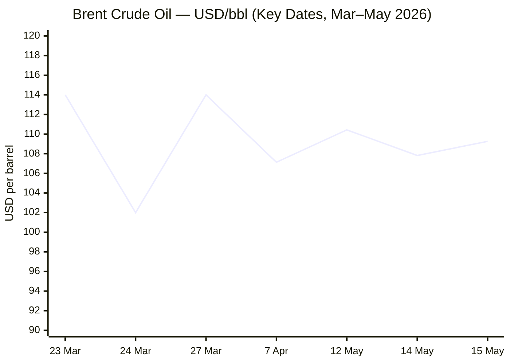
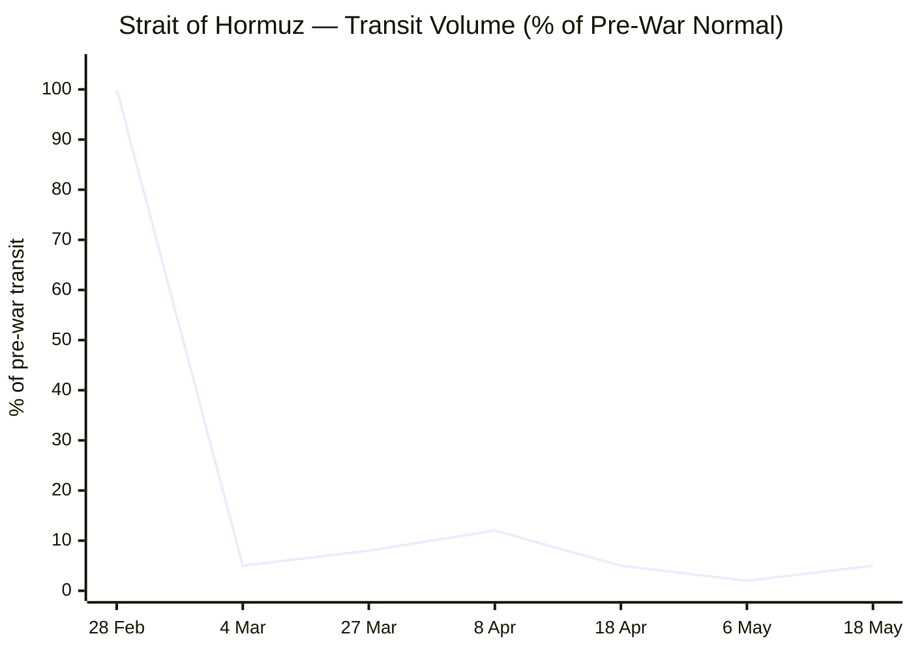

```yaml
---
brief_date: 2026-05-18
version: v1.2.1
run_time: "05:30 CET"
stories_published: 13
categories: [conflict, business, eu_affairs, technology, trends]
alert_counts:
  red: 3
  yellow: 7
  green: 3
ongoing_situations:
  - {name: "2026 Iran War", real_world_start: "2026-02-28", day: 80}
  - {name: "Strait of Hormuz Crisis", real_world_start: "2026-02-28", day: 80}
  - {name: "Russia–Ukraine War", real_world_start: "2022-02-24", day: 1544}
  - {name: "Israel–Lebanon Theatre", real_world_start: "2026-03-01", day: 79}
sources_fetched: 9
fetch_status:
  le_monde: "❌"
  faz: "❌"
  kommersant: "❌"
  xinhua: "⚠️ (content dated 24 April — stale; search fallback applied)"
  european_parliament: "❌ (search fallback applied)"
expansion_queue: []
---
```

---

# 🌐 MORNING BRIEF
## Monday, 18 May 2026 · 05:30 CET
### 13 stories across 5 categories

---

## DIGEST SUMMARY

| # | Category | Headline | Alert |
|---|----------|----------|-------|
| 1 | ⚔️ Conflict | Iran War: Ceasefire on "Life Support" — Xi Enters as Mediating Variable | 🔴 |
| 2 | ⚔️ Conflict | Ukraine: Russia Resumes Full-Scale Strikes After Victory Day Pause | 🔴 |
| 3 | ⚔️ Conflict | Lebanon: Israeli Strikes Continue to Test Fragile Ceasefire | 🟡 |
| 4 | 💼 Business | Brent at $109 as Dual Hormuz Blockade Bites — IEA Issues Undersupply Warning | 🔴 |
| 5 | 💼 Business | US Inflation Shock Rules Out Fed Cuts for 2026; Rate Hike Now Priced | 🟡 |
| 6 | 💼 Business | Semiconductor Earnings Surge on AI Demand Despite Macro Headwinds | 🟢 |
| 7 | 🇪🇺 EU Affairs | EP Plenary Opens: Foreign Investment Screening Vote Heads to Floor | 🟡 |
| 8 | 🇪🇺 EU Affairs | ECB Rate Hike at 86% Probability for June as Eurozone CPI Hits 3.0% | 🟡 |
| 9 | 🇪🇺 EU Affairs | Commission Tables Energy Relief Package; MFF Debate Opens in Council | 🟡 |
| 10 | 🤖 Technology | Chip Stocks Tumble on Inflation Data Despite Record Earnings Cycle | 🟡 |
| 11 | 🤖 Technology | EU AI Act Compliance Year: Parliament Debates AI Role in Trade Policy | 🟢 |
| 12 | 📈 Trends | FAO Index Third Consecutive Rise — Hormuz Effect Enters Food Chain | 🟡 |
| 13 | 📈 Trends | Pakistan as Geopolitical Pivot: Mediator Role Hardens Into Structure | 🟢 |

> Alert level key: 🔴 High significance · 🟡 Developing · 🟢 Stable/Routine

---

## 🚨 SIGNAL BOARD

🔴 Brent crude closed at **$109.26/bbl** on Friday — up 8.1% on the week — as near-zero Hormuz transits (effectively halted since 6 May) keep global oil markets severely undersupplied; IEA warns of undersupply through October even if conflict resolves next month.
🔴 US–Iran ceasefire described as on **"life support"** after Trump rejected Tehran's latest nuclear proposal; a fresh ship was seized and another sunk near the Strait on 15 May.
🟡 EU CPI jumped to **3.0% YoY** in April (energy component +10.9%), driving markets to price an **86% probability** of an ECB rate hike at the 11 June meeting — a complete reversal from the hold consensus of late March.
🟢 Broadcom Q1 AI semiconductor revenue **+106% YoY** to $8.4bn; global chip sales hit **$298.5bn** in Q1 2026 — industry on track toward $1 trillion annual sales.
⚡ IMF April WEO slashes global growth to **3.1%** for 2026 — down 0.3 pp from January — and projects global inflation rising to **4.4%**, reversing the prior disinflation trend.

---

## 🔄 ONGOING SITUATIONS

| Situation | Real-world start | Day # | Last significant development | Status |
|-----------|-----------------|-------|------------------------------|--------|
| 2026 Iran War | 28 Feb 2026 | Day 80 | Trump–Xi Beijing summit; Iran FM at BRICS; ceasefire on "life support"; 14-point MOU under negotiation | 🔴 Active |
| Strait of Hormuz Crisis | 28 Feb 2026 | Day 80 | Transit near-zero since 6 May; ~5% of pre-war levels; ship seized and sunk 15 May; IEA: undersupply through Oct | 🔴 Active |
| Russia–Ukraine War | 24 Feb 2022 | Day 1,544 | Russia resumed heavy strikes after 9–11 May Victory Day ceasefire; Ukraine deep-strike campaign escalating | 🔴 Active |
| Israel–Lebanon Theatre | 01 Mar 2026 | Day 79 | Israeli strikes killed 8 in Lebanon 13 May; Netanyahu covert UAE visit; ceasefire since 16 Apr under strain | 🟡 Ceasefire |

---

## ⚔️ CONFLICT

> 🔎 **CONFLICT ANALYST** · 3 updates today

### 1. Iran War: Ceasefire on "Life Support" — Xi Enters as Mediating Variable 🔴

**Alert:** 🔴
**Summary:** The 8 April Pakistan-brokered US–Iran ceasefire remains technically in force but is, in President Trump's words, on "massive life support." At a Beijing summit on 15 May, Chinese President Xi Jinping told Trump "I would like to be of help" in ending the war, and China's foreign ministry subsequently declared there is "no point" in continuing the conflict. Iran's Foreign Minister Araghchi, speaking at the BRICS summit in New Delhi on 14 May, insisted Tehran has "no trust to Americans" — the "main obstacle" to diplomacy. A fresh ship was seized and another sunk near the Strait on 15 May. The 14-point memorandum of understanding tabled by US envoys Jared Kushner and Steve Witkoff remains under Iranian review; Washington seeks a 20-year enrichment moratorium, Tehran has offered five years. No new talks have been confirmed.

**Significance:** China's explicit entry as a diplomatic variable complicates but may also accelerate the endgame: Beijing holds leverage over Iran via energy purchases and over Washington via economic interdependence, making it the only actor with credible reach to both sides. An agreement remains possible but requires bridging a 15-year gap on enrichment timelines.

**Sources:**
- [Fox News — Trump says China's leader offered to help end the war with Iran](https://www.foxnews.com/live-news/iran-war-trump-news-strait-hormuz-blockade-ceasefire-tensions-may-15) · 15 May 2026
- [CNN — Day 75: Iran ceasefire talks stalled as Trump pushes for a deal](https://www.cnn.com/2026/05/13/world/live-news/trump-iran-war-news) · 13 May 2026
- [Congress.gov CRS — U.S.-Iran Ceasefire and Negotiations: Assessment](https://www.congress.gov/crs-product/IN12678) · 13 May 2026

**Trend:** → Stable (ceasefire nominally holds; negotiations deadlocked)
**Tags:** #Iran #Hormuz #peace-talks #nuclear #MULTI-SOURCE

---

### 2. Ukraine: Russia Resumes Full-Scale Strikes After Victory Day Pause 🔴

**Alert:** 🔴
**Summary:** Russia's three-day Victory Day ceasefire (9–11 May), brokered by Trump, has ended and Moscow has resumed intensive operations. In the week preceding the pause, Russian strikes killed at least 73 civilians and injured more than 400, focusing on Zaporizhia, Kramatorsk, Dnipro, Merefa, and Sumy. Ukraine has responded by escalating deep strikes into Russian territory, targeting air defences, aircraft, and oil infrastructure. Ukrainian intelligence and military chiefs are planning the next wave of attacks inside Russia, according to UNITED24 Media (15 May). Zelenskyy warned on 15 May that Russia may use Belarus as a staging ground for a new offensive against Ukraine or NATO territory. Russia lost 1,230 troops and 48 artillery systems in a single day (16 May, Ukrainian military estimates). France announced readiness to assist Ukraine in building an anti-ballistic missile defence network.

**Significance:** The brevity and aftermath of the Victory Day ceasefire illustrate the structural impasse: Russia's pre-ceasefire civilian targeting reveals a deliberate pressure tactic; Ukraine's deep-strike escalation suggests Kyiv is pursuing strategic attrition rather than waiting for a negotiated framework, which the Iran war has delayed indefinitely.

**Sources:**
- [ACLED — Ukraine Conflict Monitor, 4–8 May 2026 update](https://acleddata.com/monitor/ukraine-conflict-monitor) · 11 May 2026
- [UNITED24 Media — Ukraine hits Russian air defenses, aircraft, and oil targets](https://united24media.com/war-in-ukraine) · 16 May 2026
- [UNITED24 Media — Russia May Use Belarus for New Offensive](https://united24media.com/war-in-ukraine) · 15 May 2026

**Trend:** ↗ Escalating
**Tags:** #Ukraine #Russia #frontline #missile-strike #drone-warfare #MULTI-SOURCE

---

### 3. Lebanon: Israeli Strikes Continue to Test Fragile Ceasefire 🟡

**Alert:** 🟡
**Summary:** The 16 April Israel–Lebanon ceasefire brokered by the US State Department remains nominally in force but is under sustained pressure. Israeli airstrikes targeting vehicles on a highway south of Beirut on 13 May killed eight people, including two children, according to Lebanon's health ministry. The Lebanese government has condemned the strikes as a war crime. Separately, Israeli Prime Minister Netanyahu disclosed a covert visit to the UAE, describing the outcome as a "historic breakthrough" in Israel–UAE relations — an apparent bid to consolidate Gulf diplomatic support ahead of any eventual Iran deal. Israel has conveyed to Washington its concern that a prospective US–Iran agreement may leave Iran's nuclear programme partially intact, omitting ballistic missiles and proxy networks from its terms.

**Legislative/policy stage:** Ceasefire in force since 16 April 2026; US-mediated Israeli–Lebanese talks in Washington continue on a separate track from Iran negotiations.

**Sources:**
- [CNN — Day 75: Iran ceasefire talks stalled](https://www.cnn.com/2026/05/13/world/live-news/trump-iran-war-news) · 13 May 2026
- [Fox News — Live updates: Iran war and Lebanon](https://www.foxnews.com/live-news/iran-war-trump-news-strait-hormuz-blockade-ceasefire-tensions-may-15) · 15 May 2026

**Trend:** ↗ Escalating
**Tags:** #Lebanon #Israel #Hezbollah #ceasefire #peace-talks

📚 *Background reading:* [Al Jazeera — When will the Strait of Hormuz be safe for commercial shipping again?](https://www.aljazeera.com/features/2026/4/28/when-will-strait-of-hormuz-be-safe-for-commercial-shipping-again) · 28 April 2026 · [CFR — War in Ukraine: Global Conflict Tracker](https://www.cfr.org/global-conflict-tracker/conflict/conflict-ukraine) · 2026

---

## 💼 BUSINESS

> 💼 **BUSINESS ANALYST** · 3 updates today

### 4. Brent at $109 as Dual Hormuz Blockade Bites — IEA Issues Undersupply Warning 🔴

**Alert:** 🔴
**Summary:** Brent crude closed at $109.26 per barrel on Friday 15 May — a weekly gain of 8.1% — as the dual US–Iran blockade of the Strait of Hormuz keeps the world's key energy corridor effectively shut. Open commercial transits have fallen to near zero since 6 May, with approximately 2,000 ships stranded in the Persian Gulf. The International Energy Agency warned this week that crude and fuel flows through the Strait fell by around 4 million barrels per day in March and April, and that global markets could remain materially undersupplied through October even if the conflict is resolved next month. War risk insurance premiums remain four to five times pre-war levels. UBS forecasts Brent averaging $100 per barrel in June before easing toward $85–$90 by end-2027.

📎 See also: Conflict § Story 1 — US–Iran ceasefire negotiations; Strait of Hormuz transit near-zero since 6 May.

**Market signal:** Bearish for growth-sensitive assets; bullish for oil and energy equities so long as the dual blockade persists and the IEA undersupply warning goes unaddressed.

**Sources:**
- [Trading Economics — Brent Crude Oil](https://tradingeconomics.com/commodity/brent-crude-oil) · 15 May 2026
- [UANI — Iran War Shipping Update](https://www.unitedagainstnucleariran.com/blog/iran-war-shipping-update-may-11-2026) · 11 May 2026

**Trend:** ↗ Escalating
**Tags:** #Brent #oil-price #Hormuz #supply-shock #energy-markets #MULTI-SOURCE

---

### 5. US Inflation Shock Rules Out Fed Cuts for 2026; Rate Hike Now Priced 🟡

**Alert:** 🟡
**Summary:** US wholesale inflation surged at its fastest pace since 2022 in April, with consumer prices posting their largest monthly increase since 2023, driven primarily by energy costs linked to the Hormuz closure. Markets have fully priced out a Federal Reserve rate cut in 2026; some traders are now positioning for a rate hike by December. Gold, which reached above $4,800 per ounce in April on safe-haven flows, has declined to $4,540 (17 May) as surging US Treasury yields and a firmer dollar erode the metal's appeal. The Philadelphia Semiconductor Index fell more than 3% on Friday as risk-off sentiment swept technology stocks.

**Market signal:** Bearish for rate-sensitive equities and growth assets; a sustained Brent move above $115 would force the Fed into an impossible trade-off between inflation and financial stability.

**Sources:**
- [Trading Economics — Gold](https://tradingeconomics.com/commodity/gold) · 14–15 May 2026
- [Barchart.com — WTI Crude Oil Futures analysis](https://www.barchart.com/futures/quotes/CBK26) · May 2026

**Trend:** ↗ Escalating
**Tags:** #inflation #Fed #interest-rates #gold #market-shock

---

### 6. Semiconductor Earnings Surge on AI Demand Despite Macro Headwinds 🟢

**Alert:** 🟢
**Summary:** Despite Friday's pullback, the semiconductor sector continues to print extraordinary earnings. Broadcom reported Q1 AI semiconductor revenue of $8.4 billion — up 106% year on year — and guided Q2 AI revenue to $10.7 billion, with a $100 billion AI sales target set for 2027. AMD's Q1 data centre revenue jumped 57% year on year to $5.78 billion; Q2 guidance was raised to $11.2 billion. Intel tripled in market capitalisation since late March after Q1 earnings beat and reports of a major Apple chip supply deal. Global semiconductor industry sales reached $298.5 billion in Q1 2026 — up 25% versus Q4 2025 — with March alone delivering $99.5 billion in monthly sales (up 79.2% year on year). The industry is tracking toward approximately $1 trillion in annual sales.

**Market signal:** Bullish for the AI infrastructure theme at the earnings level, but concentration risk is building as only the top-tier AI chip stocks are lifting the broader index; 48% of S&P 500 constituents remain below their 50-day moving averages.

**Sources:**
- [Yahoo Finance/GuruFocus — Nvidia, AMD lead chip stock selloff](https://finance.yahoo.com/markets/stocks/articles/nvidia-amd-leads-chip-stock-150611712.html) · 15 May 2026
- [247Wall St — The AI Chip Rally is Masking a Dangerous Truth](https://247wallst.com/investing/2026/05/15/the-ai-chip-rally-is-masking-a-dangerous-truth-half-the-sp-500-is-being-left-behind/) · 15 May 2026
- [Semiconductor Industry Association — Q1 2026 Global Sales](https://www.semiconductors.org/news-events/latest-news/) · 4 May 2026

**Trend:** ↗ Escalating
**Tags:** #semiconductor #AI #earnings #equity-rally #data-centre

---

## 🇪🇺 EU AFFAIRS

> 🇪🇺 **EU AFFAIRS ANALYST** · 3 updates today

### 7. EP Plenary Opens in Strasbourg: Foreign Investment Screening Vote Heads to Floor 🟡

**Alert:** 🟡
**Summary:** The European Parliament's 18–21 May plenary session in Strasbourg opens today with a packed legislative agenda. MEPs are scheduled to vote on the new Foreign Investment Screening Regulation, which harmonises national procedures for reviewing foreign direct investment in EU strategic sectors — reducing complexity, improving transparency, and setting minimum standards across all member states. If adopted, the regulation applies 18 months after entry into force. Parliamentarians will also vote on legislation mitigating the effects of global steel overcapacity on the EU market, and on new rights for crime victims. HR/VP Kallas is scheduled to respond to Members' questions on the EU's strategy regarding the Middle East crisis, and the INTA committee's own-initiative report on AI in trade policy will be debated.

**Legislative/policy stage:** Foreign Investment Screening Regulation: final plenary vote following inter-institutional agreement; Council formal adoption to follow. Steel overcapacity legislation: second reading or final vote. AI-in-trade report: plenary debate (non-legislative).

**Sources:**
- [EP Think Tank — European Parliament Plenary Session, May 2026](https://epthinktank.eu/2026/05/13/european-parliament-plenary-session-may-2026/) · 13 May 2026

**Trend:** → Stable
**Tags:** #EU-institutions #single-market #digital-regulation #EU-defence

---

### 8. ECB Rate Hike at 86% Probability for June as Eurozone CPI Hits 3.0% 🟡

**Alert:** 🟡
**Summary:** Euro area annual inflation is estimated at 3.0% in April 2026 — up from 2.6% in March — with the energy component surging to 10.9% year on year, driven almost entirely by Hormuz-linked oil price pass-through. Core inflation held at 2.2%. As of 12 May, money markets price an 86% probability of a 25-basis-point deposit rate hike at the ECB's 11 June meeting, which would take the rate from 2.00% to 2.25% — a striking reversal from the hold consensus that prevailed as recently as late March. The June meeting will also deliver the ECB's first staff macroeconomic projections since the Iran shock. The IMF's April 2026 WEO revised eurozone growth down to 1.1% for 2026, and raised the eurozone inflation forecast to 2.6% for the full year — now already exceeded in April.

**Legislative/policy stage:** ECB deposit rate at 2.00% since June 2025 cut. Next Governing Council decision: 11 June 2026. Q1 2026 eurozone GDP growth: 0.8% year on year.

**Sources:**
- [Cambridge Currencies — EUR/USD and Euro Forecast](https://cambridgecurrencies.com/euro-forecast/) · 12 May 2026
- [Eurostat — Inflation in the Euro Area, April 2026 estimate](https://ec.europa.eu/eurostat/statistics-explained/index.php?title=Inflation_in_the_euro_area) · 30 April 2026

**Trend:** ↗ Escalating
**Tags:** #ECB #inflation #interest-rates #eurozone #energy-markets #MULTI-SOURCE

---

### 9. Commission Tables Energy Relief Package; MFF 2028–2034 Debate Opens in Council 🟡

**Alert:** 🟡
**Summary:** The European Commission has proposed a package of immediate energy relief measures to cushion European households and industries from the ongoing price shock linked to the Hormuz crisis, providing a pathway toward reduced dependence on volatile fossil fuel markets. Separately, the EU Council's forward look for the fortnight of 18–31 May shows EU affairs ministers will hold a substantive policy debate on the Multiannual Financial Framework 2028–2034 — the first such ministerial discussion ahead of the June European Council. Ministers will also discuss EU–UK relations and annual rule-of-law dialogues covering France, Italy, Latvia, and Croatia. The Foreign Affairs Council, meeting in its Development configuration, will address the impact of the Iran war on global development.

**Legislative/policy stage:** Energy relief package: Commission proposal, not yet tabled as formal legislation. MFF 2028–2034: preliminary ministerial debate; formal negotiating timeline not yet set. EP vote on MFF interim report expected this week.

**Sources:**
- [EU.Europa.eu — Featured News: Energy Relief Package](https://european-union.europa.eu/news-and-events/featured-news_en) · May 2026
- [Council of the EU — Forward Look 18–31 May 2026](https://www.consilium.europa.eu/en/press/press-releases/2026/05/13/forward-look-2026/) · 13 May 2026

**Trend:** → Stable
**Tags:** #EU-institutions #energy-policy #MFF #EU-defence #Iran

---

## 🤖 TECHNOLOGY

> 🤖 **TECHNOLOGY ANALYST** · 2 updates today

### 10. Chip Stocks Tumble on Inflation Data Despite Record Earnings Cycle 🟡

**Alert:** 🟡
**Summary:** The Philadelphia Semiconductor Index fell more than 3% on Friday 15 May as a hotter-than-expected US inflation print triggered risk-off selling across high-growth technology stocks. NVIDIA, AMD, Broadcom, Intel, Marvell, Micron, and TSMC all declined during the session. Marvell dropped more than 5%; NVIDIA and AMD each fell approximately 3%. The selloff occurred against a backdrop of outstanding earnings: Broadcom's Q1 AI revenue rose 106% year on year; AMD's data centre revenue hit $5.78 billion (+57% YoY); SanDisk reported Q3 revenue of $5.95 billion (+251% YoY). Apollo and Blackstone are reportedly considering $35 billion in private credit financing for Broadcom's AI infrastructure expansion. Investors are also monitoring evolving US–China chip export controls as the Iran war reshapes bilateral dynamics.

**Analyst note:** Over the next 12–24 months, the risk that sustained energy-driven inflation forces central banks into a tightening cycle poses the most acute threat to AI infrastructure capital expenditure: if corporate borrowing costs rise materially, hyperscalers may moderate the data-centre build-out pace that underpins current semiconductor demand.

**Sources:**
- [Yahoo Finance/GuruFocus — Nvidia, AMD lead chip selloff](https://finance.yahoo.com/markets/stocks/articles/nvidia-amd-leads-chip-stock-150611712.html) · 15 May 2026
- [CNBC — Qualcomm drops 11% as chip stocks pull back](https://www.cnbc.com/2026/05/12/qualcomm-chip-stocks-record-ai.html) · 12 May 2026

**Trend:** ⚡ Reversal
**Tags:** #semiconductor #AI #inflation #market-shock #equity-selloff

---

### 11. EU AI Act Compliance Year: Parliament Debates AI Role in Trade Policy 🟢

**Alert:** 🟢
**Summary:** 2026 is the pivotal operational readiness year for the EU AI Act: the framework's provisions on prohibited AI practices entered force in February 2025, and the remainder of the high-risk AI system obligations apply from August 2026. At the ongoing Strasbourg plenary, MEPs are debating an own-initiative report from the International Trade Committee (INTA) on leveraging AI in EU trade policy — covering potential benefits such as reduced market-entry barriers and enhanced customs controls alongside concerns about third-country competitiveness and labour market displacement. Separately, the European Commission has issued a preliminary finding that Meta's Instagram and Facebook are in breach of the Digital Services Act for insufficient age verification and minor protection measures, with effective countermeasures lacking for under-13 users.

**Analyst note:** The intersection of the AI Act compliance deadline (August 2026) and the EU's simultaneous use of AI as a trade policy tool signals that the Commission will over the next 12–24 months need to reconcile the Act's liability framework with the competitive imperatives of deploying AI in customs, border control, and supply-chain surveillance.

**Sources:**
- [EP Think Tank — European Parliament Plenary Session, May 2026](https://epthinktank.eu/2026/05/13/european-parliament-plenary-session-may-2026/) · 13 May 2026
- [EU.Europa.eu — Featured News: Meta DSA preliminary finding](https://european-union.europa.eu/news-and-events/featured-news_en) · May 2026

**Trend:** → Stable
**Tags:** #AI-regulation #digital-regulation #EU-institutions #AI #LLM

---

## 📈 TRENDS

> 📈 **TRENDS ANALYST** · 2 updates today

### 12. FAO Index Third Consecutive Rise — Hormuz Effect Enters Food Chain 🟡

**Alert:** 🟡
**Summary:** The FAO Food Price Index averaged 130.7 points in April 2026 — up 1.6% from the revised March level of 128.5 — marking a third successive monthly increase. The upward movement was led by vegetable oil, meat, and cereals. Wheat prices rose 0.8%, driven partly by drought in the United States and Australia but also by reduced planting intentions, as farmers shift away from fertiliser-intensive crops amid energy costs inflated by the near-complete closure of the Strait of Hormuz. International maize prices rose 0.7% on seasonal tightness and weather concerns in Brazil. Sugar and dairy prices declined, partially offsetting the headline move. The index stands 2.0% above year-ago levels and remains 18.4% below its March 2022 peak.

**Horizon:** Medium-term upward pressure: fertiliser costs will remain elevated as long as the Hormuz closure persists, feeding into the 2026–27 agricultural season's input costs and planting decisions. A structural food-price re-acceleration is likely if the strait remains closed through the summer sowing window.

**Sources:**
- [FAO — Food Price Index, April 2026](https://www.fao.org/worldfoodsituation/foodpricesindex/en) · 8 May 2026

**Trend:** ↗ Escalating
**Tags:** #food-security #food-prices #Hormuz #energy-markets #commodities #data-point

📎 See also: Conflict § Story 1 — Hormuz transit near-zero; Business § Story 4 — Brent crude impact on fertiliser costs.

---

### 13. Pakistan as Geopolitical Pivot: Mediator Role Hardens Into Structure 🟢

**Alert:** 🟢
**Summary:** Pakistan's emergence as the indispensable broker between the United States and Iran has now been institutionalised over an 80-day arc. Army Chief Field Marshal Asim Munir personally mediated the 8 April ceasefire — brokered alongside Prime Minister Shehbaz Sharif — and completed an official three-day visit to Tehran in late April focused on promoting peace and stability. The Islamabad Talks on 11–12 April (the highest-level US–Iran diplomatic encounter since 1979) were hosted on Pakistani soil. Pakistan also covertly allowed Iranian military aircraft to park on its airfields during the ceasefire period — a decision publicly denied by Islamabad and contested by anonymous US officials. The combination of geographic position, existing ties to both parties, and demonstrated neutrality has elevated Islamabad into a structural rather than incidental mediating role.

**Horizon:** Long-term structural shift: Pakistan's pivot from regional security risk to designated great-power broker represents a durable reorientation of its diplomatic posture, potentially reshaping its relationships with both Washington and Beijing over a multi-year horizon.

**Sources:**
- [House of Commons Library — US-Iran ceasefire and nuclear talks in 2026](https://commonslibrary.parliament.uk/research-briefings/cbp-10637/) · 17 May 2026
- [Wikipedia — 2026 Iran war ceasefire](https://en.wikipedia.org/wiki/2026_Iran_war_ceasefire) · 18 May 2026

**Trend:** ↗ Escalating
**Tags:** #Pakistan-mediation #diplomacy #mediation #peace-talks #Iran

📚 *Background reading:* [Al Jazeera — When will the Strait of Hormuz be safe for commercial shipping again?](https://www.aljazeera.com/features/2026/4/28/when-will-strait-of-hormuz-be-safe-for-commercial-shipping-again) · 28 April 2026

---

## 📊 KEY DATA OF THE DAY

> 📊 **DATA OFFICER** · 7 indicators

| Indicator | Value | Δ vs prior session | Δ vs 7 days ago | Note | Source | URL |
|-----------|-------|--------------------|-----------------|------|--------|-----|
| EUR/USD | 1.1733 | N/A | N/A | Last confirmed 12 May; dollar firming on inflation; ECB hike priced for 11 Jun | ECB/TE | [link](https://tradingeconomics.com/euro-area/currency) |
| Brent Crude (USD/bbl) | 109.26 | +3.35% | +~10% | 15 May close; +8.1% on week; IEA warns undersupply to Oct | EIA/TE | [link](https://tradingeconomics.com/commodity/brent-crude-oil) |
| Gold (XAU/USD) | 4,540.02 | -3.02% (Fri) | -2.62% | 17 May close; down from >$4,800 peak; high US yields + strong USD weigh | LBMA/TE | [link](https://tradingeconomics.com/commodity/gold) |
| IMF Global Growth 2026 | 3.1% | -0.3 pp vs Jan WEO | -0.2 pp vs Oct WEO | Apr WEO "Shadow of War"; adverse scenario = 2.5%; global CPI to 4.4% | IMF WEO | [link](https://www.imf.org/en/publications/weo/issues/2026/04/14/world-economic-outlook-april-2026) |
| EU CPI YoY (Apr 2026) | 3.0% | +0.4 pp vs Mar | N/A | Energy +10.9% YoY; released 30 Apr; core 2.2%; ECB hike now 86% priced | Eurostat | [link](https://ec.europa.eu/eurostat/statistics-explained/index.php?title=Inflation_in_the_euro_area) |
| FAO Food Price Index | 130.7 | +1.6% vs Mar 2026 | N/A (monthly release) | April 2026 — latest available; third consecutive monthly rise | FAO | [link](https://www.fao.org/worldfoodsituation/foodpricesindex/en) |
| Hormuz Transit Volume | ~5% of pre-war | → | Near-zero since 6 May | ~2,000 ships stranded in Gulf; open transits near zero since 6 May | UANI/UKMTO | [link](https://www.unitedagainstnucleariran.com/blog/iran-war-shipping-update-may-11-2026) |

**Data commentary:** The seven indicators tell a unified story of compounding geopolitical stress: Brent at $109 reflects not just the Hormuz blockade but the IEA's warning that even a ceasefire next month cannot rebalance markets before October. Gold's decline from above $4,800 is counterintuitive but reflects the dollar-and-yield channel overpowering safe-haven demand as traders price out Fed cuts and begin pricing in hikes. The FAO's third consecutive monthly rise confirms that the Hormuz closure has moved from an energy-market event into a food-system signal — fertiliser costs and planting-intention shifts are entering the 2026–27 agricultural cycle, with consequences that will outlast the conflict itself.

---

## 📈 CHARTS





---

## ⚙️ AGENT METADATA

| Field | Value |
|-------|-------|
| Agent version | MORNING BRIEF v1.2.1 |
| Run timestamp | 2026-05-18T05:30:51+02:00 |
| Fetch status | Le Monde ❌ · FAZ ❌ · Kommersant ❌ · Xinhua ⚠️ (stale — 24 Apr content) · EP ❌ |
| Sources queried | 9 / 11 (Tier 1 search: Guardian, El País, Xinhua attempt; Tier 2 search: IMF, FAO, Eurostat, ECB, European Commission, European Parliament) |
| Stories surfaced | 22 before editorial filter |
| Stories published | 13 after editorial filter |
| Languages processed | EN |
| Output language | English (British) |
| Date validated | ✅ Confirmed 18 May 2026 |
| Expansion Queue | None |

---

*MORNING BRIEF is an AI-assisted digest. All summaries are paraphrased from original sources. Verify time-sensitive information at the linked URLs before acting. Output language: British English.*
