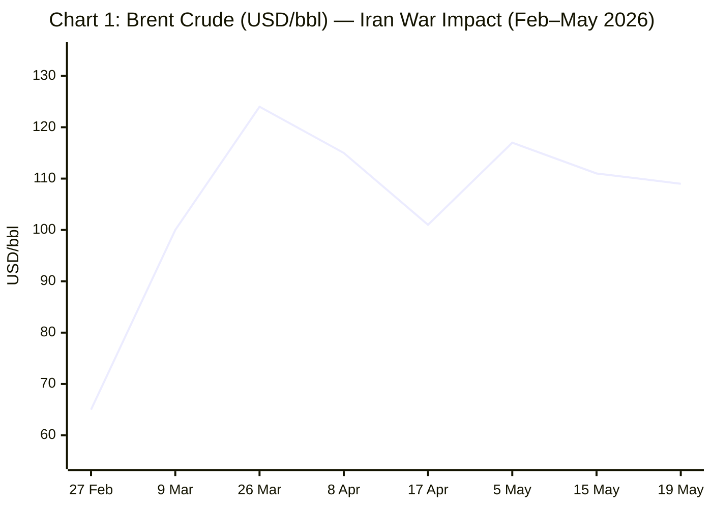
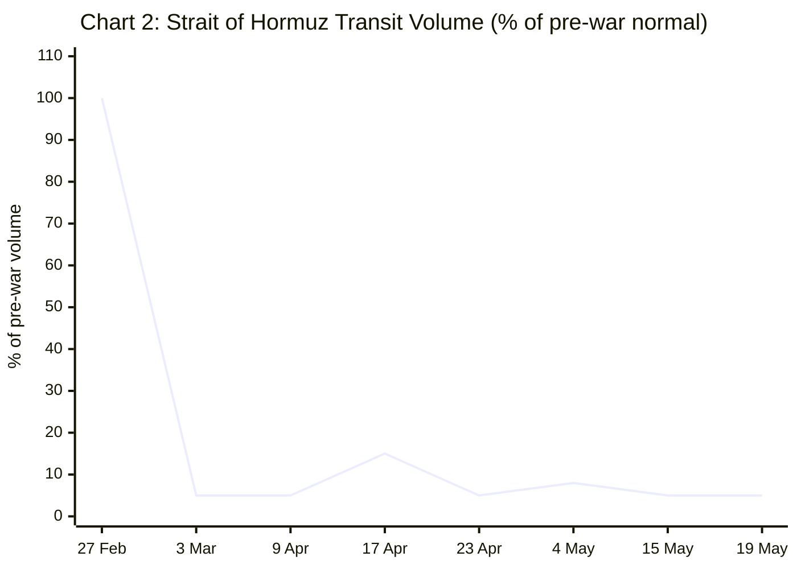

```yaml
---
brief_date: 2026-05-19
version: v1.2.1
run_time: "05:57 CET"
stories_published: 14
categories: [conflict, business, eu_affairs, technology, trends]
alert_counts:
  red: 4
  yellow: 9
  green: 1
ongoing_situations:
  - {name: "2026 Iran War / Hormuz Crisis", real_world_start: "2026-02-28", day: 81}
  - {name: "Russia–Ukraine War", real_world_start: "2022-02-24", day: 1545}
  - {name: "Israel–Lebanon Ceasefire", real_world_start: "2026-04-16", day: 34}
sources_fetched: 11
fetch_status:
  le_monde: "❌"
  faz: "❌"
  kommersant: "❌"
  xinhua: "⚠️"
  european_parliament: "❌"
expansion_queue: []
---
```

---

# 🌐 MORNING BRIEF
## Tuesday, 19 May 2026 · 05:57 CET
### 14 stories across 5 categories

---

## DIGEST SUMMARY

| # | Category | Headline | Alert |
|---|----------|----------|-------|
| 1 | ⚔️ Conflict | Iran War / Hormuz — IRGC declares strait a "vast operational area"; talks deadlocked | 🔴 |
| 2 | ⚔️ Conflict | Ukraine — Pokrovsk near cut-off; US renews Russia oil waiver; Belarus nuclear drills | 🔴 |
| 3 | ⚔️ Conflict | Israel — Flotilla intercepted off Cyprus; Netanyahu UAE disclosure; ceasefire fragile | 🟡 |
| 4 | 💼 Business | Oil markets — Brent $109/bbl; IEA warns demand contraction; SPR at record draw | 🔴 |
| 5 | 💼 Business | Inflation surge — US CPI 3.8%, EU HICP 3.0%; zero Fed cuts priced through 2027 | 🟡 |
| 6 | 💼 Business | IMF WEO April 2026 — global growth cut to 3.1% in "Shadow of War" | 🟡 |
| 7 | 🇪🇺 EU Affairs | FDI Screening Regulation — EP votes today; mandatory AI/semiconductor screening | 🟡 |
| 8 | 🇪🇺 EU Affairs | EU Fertilisers Action Plan — Commission presents today amid Hormuz supply crisis | 🟡 |
| 9 | 🇪🇺 EU Affairs | EU enlargement — Albania and Montenegro progress assessed in committee | 🟢 |
| 10 | 🤖 Technology | EU AI Act Digital Omnibus agreed — high-risk AI rules from 2 August 2026 | 🟡 |
| 11 | 🤖 Technology | EU cybersecurity and AI preparedness debated in EP plenary | 🟡 |
| 12 | 📈 Trends | FAO FFPI 130.7 — food prices at highest since Feb 2023; fertiliser chain at risk | 🔴 |
| 13 | 📈 Trends | Pakistan cements mediator role — US delegation returns to Islamabad for Iran talks | 🟡 |
| 14 | 📈 Trends | Global shipping reroutes — Atlantic Basin fills Persian Gulf gap; demand contracts | 🟡 |

> Alert Level key: 🔴 High significance · 🟡 Developing · 🟢 Stable/Routine

---

## 🚨 SIGNAL BOARD

🔴 Iran's IRGC has formally declared the Strait of Hormuz a "vast operational area" — extending control from Jask to Siri Island — as transit remains at ~5% of pre-war volume with ~230 tankers stranded and talks deadlocked.
🔴 US CPI reached 3.8% in April 2026, highest since May 2023; markets have priced in zero Fed rate cuts through 2027 and a 90% probability of the first ECB rate hike in June.
🟡 FAO Food Price Index averaged 130.7 in April — its third consecutive monthly rise and highest since February 2023 — as Hormuz closure disrupts fertiliser supply, now threatening the 2026–27 growing season.
🟡 Ukraine's positions in northern Pokrovsk are described as "almost cut off" by Ukrainian commanders; the US has again quietly extended Russia's oil sanctions waiver for a second time despite public pledges to the contrary.
⚡ Ukraine confirmed its first domestically produced glide bomb, a structural capability shift in an attritional war now in Day 1,545 — while the EP votes today on mandatory FDI screening covering AI and semiconductor investments.

---

## 🔄 ONGOING SITUATIONS

| Situation | Real-world start | Day # | Last significant development | Status |
|-----------|-----------------|-------|------------------------------|--------|
| 2026 Iran War / Hormuz Crisis | 28 Feb 2026 | Day 81 | IRGC redefines Hormuz as "vast operational area"; Iran sets 5 preconditions for new talks; UK deploys warship | 🔴 Active |
| Russia–Ukraine War | 24 Feb 2022 | Day 1,545 | Pokrovsk positions "almost cut off"; Ukraine claims Stepnohirsk; Belarus nuclear drills begin | 🔴 Active |
| Israel–Lebanon Ceasefire | 16 Apr 2026 | Day 34 | Israeli forces intercept flotilla off Cyprus; ceasefire extended; Hezbollah forces remain deployed | 🟡 Fragile |

---

## ⚔️ CONFLICT ANALYST

> 🔎 **CONFLICT ANALYST** · 3 updates today

---

### 1. Iran War / Hormuz — IRGC Declares "Vast Operational Area"; Talks Deadlocked 🔴

**Alert:** 🔴
**Summary:** Iran's Islamic Revolutionary Guard Corps Navy formally redefined the Strait of Hormuz as a "vast operational area" stretching from the port city of Jask to Siri Island, far exceeding the traditional narrow maritime corridor. Iran has set five preconditions for new talks, including US payment of war reparations and international recognition of Iranian sovereignty over the strait — terms Washington considers non-starters. The UK has announced deployment of drones, fighter aircraft, and a Royal Navy warship for a defensive mission to protect commercial shipping. Iran is selectively allowing Chinese vessels to transit under new protocols, following direct requests from Beijing's foreign minister.
**Significance:** The IRGC's formal juridical expansion of its claimed operational zone represents a structural shift — no longer a tactical blockade but a codified territorial claim over one of the world's most critical maritime chokepoints. Iran's selective facilitation of Chinese traffic while blocking Western vessels risks hardening the geopolitical fault lines around Hormuz into a permanent feature of the post-war order.
**Sources:**

- [Wikipedia — 2026 Strait of Hormuz crisis](https://en.wikipedia.org/wiki/2026_Strait_of_Hormuz_crisis) · 19 May 2026
- [House of Commons Library — Israel/US-Iran conflict 2026: Reopening the Strait of Hormuz](https://commonslibrary.parliament.uk/research-briefings/cbp-10636/) · 18 May 2026
- [PBS NewsHour — Tensions flare near Strait of Hormuz as one ship is seized and another is sunk](https://www.pbs.org/newshour/world/tensions-flare-near-strait-of-hormuz-as-one-ship-is-seized-and-another-is-sunk) · 15 May 2026

**Trend:** → Stable (deadlock persists; no breakthrough since ceasefire extension)
**Tags:** #Iran #Hormuz #naval-blockade #ceasefire #MULTI-SOURCE

---

### 2. Russia–Ukraine — Pokrovsk "Almost Cut Off"; US Renews Russia Oil Waiver; Belarus Drills 🔴
**Alert:** 🔴
**Summary:** Ukrainian commanders report that positions in northern Pokrovsk are "almost cut off" amid mounting Russian pressure, with Russian drone superiority making troop rotations, evacuations, and resupply nearly impossible. Separately, Ukraine's military intelligence (HUR) confirmed the capture of Stepnohirsk in Zaporizhzhia Oblast, with footage of the Artan special unit operating there. The Trump administration has again extended Russia's oil sanctions waiver — the second renewal despite public pledges by Treasury Secretary Bessent that it would not be repeated. Belarus has begun nuclear drills with Russia days after President Zelensky warned of expanding Russian military infrastructure along NATO's eastern flank. Ukraine has disclosed its first domestically produced glide bomb.
**Significance:** The Pokrovsk sector deterioration — compounded by drone attrition — signals a structural erosion of Ukrainian defensive depth that no single counterattack can reverse quickly. The US sanctions waiver extension injects fresh uncertainty into the Western sanctions architecture at a moment of political pressure on Ukraine's partners.
**Sources:**

- [Kyiv Independent — Ukraine war latest: Ukrainian positions in northern Pokrovsk 'almost cut off'](https://kyivindependent.com/) · 19 May 2026
- [Kyiv Independent — US again grants Russia oil sanctions waiver despite Treasury chief's pledges not to](https://kyivindependent.com/) · 18 May 2026

**Trend:** ↗ Escalating
**Tags:** #Ukraine #Russia #frontline #sanctions #drone-warfare #MULTI-SOURCE

---

### 3. Israel — Flotilla Intercepted Off Cyprus; Netanyahu UAE Disclosure; Ceasefire Day 34 🟡
**Alert:** 🟡
**Summary:** Israeli forces intercepted a flotilla off Cyprus on 18 May as it attempted to breach the Gaza blockade, according to the Associated Press. The interception came hours after Prime Minister Netanyahu publicly disclosed a covert visit to the UAE — a politically sensitive revelation denied by Emirati officials and widely interpreted as domestic electioneering ahead of Israeli elections. CNN earlier reported that Netanyahu secretly ordered the Israeli military to deploy an Iron Dome battery to the UAE. The Israel–Lebanon ceasefire (Day 34) holds formally but Hezbollah has declared it will keep its forces deployed and "ready to respond to any violations."
**Significance:** Netanyahu's public disclosure of a covert UAE visit — timed to a domestic political cycle — risks complicating the quiet normalisation of Israel-UAE security ties at a moment when the UAE is itself trying to stay out of the Iran-US confrontation. A breakdown in Hezbollah adherence to the ceasefire would immediately reopen a second front.
**Sources:**

- [Britannica — 2026 Iran war](https://www.britannica.com/event/2026-Iran-war) · 18 May 2026
- [Times of Israel — Ship said seized, diverted to Iran, another sunk, in latest Strait of Hormuz actions](https://www.timesofisrael.com/ship-said-seized-diverted-to-iran-another-sunk-in-latest-strait-of-hormuz-actions/) · 14 May 2026

**Trend:** → Stable
**Tags:** #Israel #Lebanon #ceasefire #Hezbollah #Gaza

📚 *Background reading:* [Al Jazeera — What to know about US-Iran standoff over the Strait of Hormuz](https://www.aljazeera.com/news/2026/4/19/what-to-know-about-us-iran-standoff-over-the-strait-of-hormuz) · [Crisis Group — Strait of Hormuz Trigger List](https://www.crisisgroup.org/trigger-list/iran-usisrael-trigger-list/flashpoints/strait-hormuz)

---

## 💼 BUSINESS ANALYST

> 💼 **BUSINESS ANALYST** · 3 updates today

---

### 4. Oil Market — Brent $109/bbl; IEA Warns of Demand Contraction; SPR at Record Draw 🔴
**Alert:** 🔴
**Summary:** Brent crude opened at $109.33/bbl on 19 May, following extreme intraday volatility on 18 May (ranging $102–$111) driven by conflicting reports of a potential US temporary sanctions waiver on Iranian oil and Iran's insistence that talks remain deadlocked. The IEA's May 2026 Oil Market Report warned that global oil demand will contract by 420,000 barrels per day year-on-year in 2026, with refinery throughputs plunging 4.5 mb/d in Q2. Global oil inventories were drawn by 250 mb across March and April (4 mb/d). The US SPR was drawn at the fastest pace on record — 8.6 million barrels in a single week — adding urgency to a resolution.

📎 *See also: Conflict § Story 1 — Iran War / Hormuz deadlock is the primary supply driver*

**Market signal:** Bearish on global demand growth but bullish on price floor: supply destruction from Hormuz closure and IEA's inventory draw signal persistent upward price pressure even if a deal is announced, given ramp-up time for supply restoration.
**Sources:**
- [IEA — Oil Market Report May 2026](https://www.iea.org/reports/oil-market-report-may-2026) · May 2026
- [Trading Economics — Brent Crude Oil](https://tradingeconomics.com/commodity/brent-crude-oil) · 18 May 2026
- [Investing.com — Brent Crude Oil Futures](https://www.investing.com/commodities/brent-oil) · 19 May 2026

**Trend:** ↗ Escalating
**Tags:** #Brent #oil-price #Hormuz #supply-shock #energy-markets #MULTI-SOURCE

---

### 5. Inflation Surge — US CPI 3.8%, EU HICP 3.0%; Zero Fed Cuts Priced Through 2027 🟡
**Alert:** 🟡
**Summary:** US CPI rose to 3.8% YoY in April 2026 (released 12 May), the highest since May 2023, driven by energy costs surging 17.9% YoY and gasoline up 28.4% (national average $4.50/gallon). The euro area HICP flash estimate for April came in at 3.0% (highest since September 2023), up from 2.6% in March, with energy inflation at 10.9%. Markets have repriced to zero probability of Fed rate cuts through 2027; the ECB faces three rate hikes now fully priced in by year-end, with a 90% probability of the first move in June. EUR/USD fell to a near one-month low of 1.161 on 18 May. Eurozone Q1 2026 GDP: +0.1% — the weakest quarterly reading since Q2 2025.
**Market signal:** Stagflationary: the combination of near-zero eurozone growth (+0.1% Q1) and accelerating inflation (+3.0%) leaves the ECB in a policy bind, with rate hikes the only credible response despite growth headwinds.
**Sources:**

- [BLS — Consumer Price Index April 2026](https://www.bls.gov/news.release/cpi.nr0.htm) · 12 May 2026
- [Eurostat — Euro area annual inflation up to 3.0%](https://ec.europa.eu/eurostat/web/products-euro-indicators/w/2-30042026-ap) · 30 Apr 2026
- [Trading Economics — Euro US Dollar](https://tradingeconomics.com/euro-area/currency) · 18 May 2026
- [CNBC — Inflation breakdown for April 2026](https://www.cnbc.com/2026/05/12/inflation-breakdown-for-april-2026-cpi-chart.html) · 12 May 2026

**Trend:** ↗ Escalating
**Tags:** #inflation #ECB #Fed #interest-rates #FX #stagflation

---

### 6. IMF WEO — Global Growth Cut to 3.1% in "Shadow of War" 🟡
**Alert:** 🟡
**Summary:** The IMF's April 2026 World Economic Outlook, published 14 April, cut global growth to 3.1% in 2026 under its reference forecast — down approximately 0.2 percentage points from January projections — on the assumption that the Middle East conflict remains limited in duration. Global inflation is projected to rise to 4.4% before resuming its decline in 2027. Emerging market growth was revised down to 3.9% from 4.2% in January. Chief Economist Pierre-Olivier Gourinchas noted that the global economy "was on a steady growth trajectory" of ~3.3% before the war intervened. The IMF flagged an adverse scenario where a prolonged conflict and sustained oil price increase could push global growth to 2.0% — historically associated with global recession.
**Market signal:** Neutral with downside skew: the IMF's reference forecast is already premised on conflict resolution by mid-2026; with talks deadlocked at Day 81, the adverse scenario is increasingly operative.
**Sources:**

- [IMF — World Economic Outlook, April 2026: Global Economy in the Shadow of War](https://www.imf.org/en/publications/weo/issues/2026/04/14/world-economic-outlook-april-2026) · 14 Apr 2026
- [World Economic Forum — IMF downgrades global growth](https://www.weforum.org/stories/2026/04/imf-downgrades-global-growth-and-other-finance-news-to-know/) · 17 Apr 2026

**Trend:** ↘ De-escalating (growth trajectory)
**Tags:** #IMF #GDP-forecast #inflation #commodities #MULTI-SOURCE

📚 *Background reading:* [IEA — Oil Market Report May 2026](https://www.iea.org/reports/oil-market-report-may-2026)

---

## 🇪🇺 EU AFFAIRS ANALYST

> 🇪🇺 **EU AFFAIRS ANALYST** · 3 updates today

---

### 7. FDI Screening Regulation — European Parliament Votes Today 🟡
**Alert:** 🟡
**Summary:** The European Parliament's plenary session votes today (19 May) on the revised Foreign Direct Investment Screening Regulation, the result of a trilogue agreement reached in December 2025. The regulation establishes mandatory minimum screening by all EU member states for investments in defined critical sectors: semiconductors, artificial intelligence (specifically general-purpose AI with defence or space relevance), quantum technologies, critical infrastructure in energy and transport, strategic raw materials, and certain financial system entities. The provisional text was adopted by the INTA committee on 24 February 2026 with 34 votes in favour, 2 against, and 3 abstentions. New rules will apply 18 months after entry into force.
**Legislative/policy stage:** EP plenary final vote — 19 May 2026. Upon adoption, regulation moves to signature and publication in the Official Journal. Application date: approximately November 2027.
**Sources:**

- [EP Think Tank — European Parliament Plenary Session May 2026](https://epthinktank.eu/2026/05/13/european-parliament-plenary-session-may-2026/) · 13 May 2026
- [EU Business — EU Agenda: Week Ahead 18–23 May 2026](https://www.eubusiness.com/politics/eucalendar/) · 18 May 2026
- [Mayer Brown — Shaping investments into EU strategic sectors: The FDI Screening Reform](https://www.mayerbrown.com/en/insights/publications/2026/03/shaping-investments-into-eu-strategic-sectors-the-fdi-screening-reform-and-the-industrial-accelerator-act) · Mar 2026

**Trend:** ↗ Escalating (legislative momentum)
**Tags:** #EU-institutions #digital-regulation #semiconductor #AI #EU-defence #MULTI-SOURCE

---

### 8. EU Fertilisers Action Plan — Commission Presents Amid Hormuz Supply Crisis 🟡
**Alert:** 🟡
**Summary:** The European Commission is presenting its Fertilisers Action Plan to the European Parliament today (19 May), following a debate with MEPs. The plan responds to sharply rising EU fertiliser prices driven by the effective closure of the Strait of Hormuz — a key export route for Persian Gulf-sourced nitrogen, urea, and phosphate. The FAO noted in its April 2026 report that disruptions to the Hormuz-dependent fertiliser supply chain are already driving up urea and phosphate prices and reducing farmer willingness to plant fertiliser-intensive crops (including wheat) in 2026. The EU Foreign Affairs Council (Trade formation) is separately meeting today to assess the broader impact of the Middle East conflict on EU trade.

📎 *See also: Conflict § Story 1 — Hormuz closure is the primary supply chain driver*

**Legislative/policy stage:** Commission strategy presentation — 19 May 2026. No legislative proposal at this stage; action plan will inform future measures. MEP debate follows presentation.
**Sources:**
- [Oireachtas National Parliament EU Office — European Update 18 May 2026](https://www.oireachtas.ie/en/press-centre/news-and-features/20260518-european-update-the-oireachtas-national-parliament-office-for-the-european-union/) · 18 May 2026
- [FAO — FAO Food Price Index up for third consecutive month](https://www.fao.org/newsroom/detail/fao-food-price-index-up-for-third-consecutive-month-largely-on-rising-vegetable-oil-prices/en) · 8 May 2026

**Trend:** ↗ Escalating
**Tags:** #EU-institutions #energy-policy #food-security #Hormuz #climate-policy

---

### 9. EU Enlargement — Albania and Montenegro: Membership Progress Assessed 🟢
**Alert:** 🟢
**Summary:** The European Parliament's Foreign Affairs Committee is voting today on assessments of Albania's and Montenegro's progress toward EU membership. Both countries are described by the EP as "well advanced" in their accession negotiations and represent the most likely near-term candidates for EU membership expansion. The vote comes amid an agenda heavily dominated by the Middle East crisis; enlargement advocates have warned that geopolitical urgency must not displace the bloc's strategic interest in consolidating the Western Balkans. A separate discussion on Ukraine's EU membership path takes place in committee on 19 May.
**Legislative/policy stage:** Foreign Affairs Committee assessment vote — 19 May 2026. Not a formal accession decision; provides EP's evaluation to feed into Council deliberations.
**Sources:**

- [EP Think Tank — European Parliament Plenary Session May 2026](https://epthinktank.eu/2026/05/13/european-parliament-plenary-session-may-2026/) · 13 May 2026
- [EU Business — EU Agenda: Week Ahead 18–23 May 2026](https://www.eubusiness.com/politics/eucalendar/) · 18 May 2026

**Trend:** → Stable
**Tags:** #EU-enlargement #EU-institutions #diplomacy

📚 *Background reading:* [ECFR — ecfr.eu](https://ecfr.eu/) · [Bruegel — bruegel.org](https://www.bruegel.org)

---

## 🤖 TECHNOLOGY ANALYST

> 🤖 **TECHNOLOGY ANALYST** · 2 updates today

---

### 10. EU AI Act Digital Omnibus Agreed — High-Risk AI Rules From 2 August 2026 🟡
**Alert:** 🟡
**Summary:** The Council of the EU and the European Parliament reached formal agreement on 7 May 2026 on the Digital Omnibus on AI — a streamlining package that simplifies and accelerates the implementation of the EU AI Act. Under the deal, the timeline for high-risk AI provisions is adjusted by up to 16 months, with rules entering into force on 2 August 2026, subject to the Commission confirming that the necessary standards and technical tools are available. Regulatory exemptions for SMEs are extended to small mid-caps. The AI Office's supervisory powers are reinforced, and the deadline for national AI regulatory sandboxes is pushed to 2 August 2027. A new provision prohibits AI-generated non-consensual intimate imagery.
**Analyst note:** Within 12–18 months, the August 2026 high-risk AI deadline will create the first EU enforcement cycle — including public sector AI in healthcare, education, and law enforcement — establishing whether the AI Office has the capacity and political backing to sanction major developers.
**Sources:**

- [Council of the EU — Artificial Intelligence: Council and Parliament agree to simplify and streamline rules](https://www.consilium.europa.eu/en/press/press-releases/2026/05/07/artificial-intelligence-council-and-parliament-agree-to-simplify-and-streamline-rules/) · 7 May 2026

**Trend:** → Stable (legislative stage progressing to implementation)
**Tags:** #AI-regulation #digital-regulation #EU-institutions #LLM #AI-safety

---

### 11. EU Cybersecurity and AI Preparedness — Debate in EP Plenary Today 🟡
**Alert:** 🟡
**Summary:** MEPs are debating EU cyber resilience capabilities in the face of advanced AI systems with Council and Commission representatives during today's (19 May) plenary session. The session follows the EP's own February 2026 decision to disable built-in AI features on corporate tablets and phones issued to MEPs and staff, citing risks that confidential data uploaded to AI company servers could be subject to foreign legal demands. The debate feeds into a broader EU effort to define what "AI-preparedness" means for critical infrastructure, particularly relevant as Hormuz-linked cyber threats against energy and port systems have increased since February.
**Analyst note:** The EU's institutional self-imposed AI restriction — unique among major legislative bodies — will within 18 months force a choice: either develop sovereign EU AI tooling for legislative workflows, or reverse the ban under competitive pressure from AI-integrated peer institutions.
**Sources:**

- [Oireachtas National Parliament EU Office — European Update 18 May 2026](https://www.oireachtas.ie/en/press-centre/news-and-features/20260518-european-update-the-oireachtas-national-parliament-office-for-the-european-union/) · 18 May 2026
- [TechCrunch — European Parliament blocks AI on lawmakers' devices, citing security risks](https://techcrunch.com/2026/02/17/european-parliament-blocks-ai-on-lawmakers-devices-citing-security-risks/) · 17 Feb 2026

**Trend:** → Stable
**Tags:** #cyber #AI-regulation #AI-safety #EU-institutions #digital-regulation

📚 *Background reading:* [CSIS — csis.org](https://www.csis.org)

---

## 📈 TRENDS ANALYST

> 📈 **TRENDS ANALYST** · 3 updates today

---

### 12. FAO FFPI 130.7 in April — Food Prices Highest Since February 2023; Fertiliser Chain Threatened 🔴

**Alert:** 🔴
**Summary:** The FAO Food Price Index averaged 130.7 points in April 2026 (released 8 May), marking a third consecutive monthly increase and the highest reading since February 2023. The vegetable oil sub-index rose 5.9% month-on-month (highest since July 2022), driven by palm, soy, sunflower, and rapeseed oils. The FAO explicitly linked the April acceleration to the effective closure of the Strait of Hormuz, which has disrupted fertiliser supply — driving urea and phosphate prices higher — and is already prompting farmers to shift toward less fertiliser-intensive crops. The FAO specifically warned that reduced wheat plantings for 2026 are expected as fertiliser affordability falls. Energy pass-through into rice production and marketing costs drove rice prices 1.9% higher.
**Horizon:** Medium-term structural deterioration: if the Hormuz fertiliser disruption persists through Q3 2026, its impact on 2027 harvests — particularly wheat in MENA and South Asia — will not be visible in the FFPI for 6–9 months, setting up a deferred food security shock.
**Sources:**

- [FAO — FAO Food Price Index (April 2026 release)](https://www.fao.org/worldfoodsituation/foodpricesindex/en) · 8 May 2026
- [FAO Newsroom — FAO Food Price Index up for third consecutive month](https://www.fao.org/newsroom/detail/fao-food-price-index-up-for-third-consecutive-month-largely-on-rising-vegetable-oil-prices/en) · 8 May 2026

**Trend:** ↗ Escalating
**Tags:** #food-prices #food-security #Hormuz #energy-markets #data-point #institutional

---

### 13. Pakistan Cements Mediator Role — US Returns to Islamabad for Iran Talks 🟡
**Alert:** 🟡
**Summary:** President Trump has announced that US officials are returning to Pakistan for resumed negotiations with Iran, describing it as a country offering "a very fair and reasonable deal." Pakistan has served as the primary channel for all US–Iran communications throughout the ceasefire period, channelling Iranian proposals to Washington in both the May 10 and subsequent rounds. The role has elevated Pakistan's diplomatic standing markedly; reporting from CBS News, citing anonymous US officials, revealed that Pakistan also quietly permitted Iranian military aircraft to use its Nur Khan airbase during the initial ceasefire — a disclosure Islamabad denied, insisting it acted as a transparent and impartial facilitator. Pakistan's dual positioning — hosting US negotiators while enabling Iranian logistics — illustrates the strategic leverage it is extracting from its mediating role.
**Horizon:** Medium-term: Pakistan's mediator status will outlast any Iran deal. Islamabad is building durable leverage over Washington and Tehran simultaneously, repositioning from a peripheral US ally to a structurally indispensable interlocutor in Middle East affairs.
**Sources:**

- [International Crisis Group — Strait of Hormuz](https://www.crisisgroup.org/trigger-list/iran-usisrael-trigger-list/flashpoints/strait-hormuz) · May 2026
- [NPR — Trump pauses US effort to guide stranded vessels out of Strait of Hormuz](https://www.npr.org/2026/05/05/nx-s1-5811770/iran-war-updates) · 5 May 2026
- [Wikipedia — 2026 Iran war](https://en.wikipedia.org/wiki/2026_Iran_war) · 19 May 2026

**Trend:** ↗ Escalating (Pakistan's role expanding)
**Tags:** #Pakistan-mediation #mediation #diplomacy #Iran #peace-talks #MULTI-SOURCE

---

### 14. Global Shipping Reroutes — Atlantic Basin Fills Persian Gulf Gap; Demand Contracts 🟡
**Alert:** 🟡
**Summary:** The IEA's May 2026 Oil Market Report documents a structural rerouting of global energy trade: Atlantic Basin crude exports have increased by 3.5 mb/d since February, now heading primarily to East of Suez markets that previously relied on Persian Gulf supply. US, Brazil, Canadian, Kazakhstani, and Venezuelan output has risen to fill the gap, with 2026 supply growth from the Americas revised up over 600,000 barrels per day since the start of the year to 1.5 mb/d on average. Saudi Arabia and the UAE have redirected some exports to terminals loading outside the Strait. These reroutes carry significantly higher freight costs and transit times, structurally elevating refinery and shipping margins while suppressing consumer demand. The IEA projects global observed inventories fell 250 mb in March-April combined.

📎 *See also: Business § Story 4 — IEA demand contraction data*

**Horizon:** Long-term structural shift: the rerouting of global oil supply away from the Gulf to Atlantic Basin suppliers represents the largest single reconfiguration of global energy trade flows since the 1973 oil shock. Even after a Hormuz resolution, shipping insurance and routing habits may take 12–24 months to fully normalise.
**Sources:**
- [IEA — Oil Market Report May 2026](https://www.iea.org/reports/oil-market-report-may-2026) · May 2026
- [House of Commons Library — Israel/US-Iran conflict 2026: Reopening the Strait of Hormuz](https://commonslibrary.parliament.uk/research-briefings/cbp-10636/) · 18 May 2026

**Trend:** → Stable (rerouting now a structural baseline)
**Tags:** #shipping #supply-shock #energy-markets #Hormuz #food-security

📚 *Background reading:* [Kyiv Independent — kyivindependent.com](https://kyivindependent.com)

---

## 📊 KEY DATA OF THE DAY

> 📊 **DATA OFFICER** · 7 indicators

| Indicator | Value | Δ vs prior session | Δ vs 7 days ago | Note | Source | URL |
|-----------|-------|-------------------|-----------------|------|--------|-----|
| EUR/USD | 1.162 | −0.003 (−0.26%) | −0.017 (−1.4%) | Near 1-month low; ECB June rate hike 90% priced; eurozone Q1 GDP +0.1% | ECB / Trading Economics | [link](https://tradingeconomics.com/euro-area/currency) |
| Brent Crude (USD/bbl) | 109.33 | N/A* | N/A* | *Extreme intraday volatility 18 May ($102–$111); open 19 May confirmed $109.33; pre-war level was ~$65 | Investing.com / Trading Economics | [link](https://www.investing.com/commodities/brent-oil) |
| Gold (XAU/USD) | 4,552 | −$12 (−0.3%) | −$183 (−3.9%) | Near 4-week low; hawkish Fed repricing and dollar strength suppressing safe-haven demand | Trading Economics | [link](https://tradingeconomics.com/commodity/gold) |
| IMF Global Growth 2026 | 3.1% | vs Jan WEO: −0.2pp | vs Oct 2025 WEO: −0.2pp | "Global Economy in the Shadow of War"; reference forecast assumes limited conflict | IMF WEO Apr 2026 | [link](https://www.imf.org/en/publications/weo/issues/2026/04/14/world-economic-outlook-april-2026) |
| EU CPI YoY (Apr 2026) | 3.0% | vs Mar 2026: +0.4pp | vs Jan 2026: +1.3pp | Flash estimate; highest since Sept 2023; energy +10.9%; full data due 20 May | Eurostat | [link](https://ec.europa.eu/eurostat/web/products-euro-indicators/w/2-30042026-ap) |
| FAO Food Price Index | 130.7 | vs Mar 2026: +2.1 (+1.6%) | April 2026 — latest available | Third consecutive monthly rise; highest since Feb 2023; vegetable oil +5.9% | FAO | [link](https://www.fao.org/worldfoodsituation/foodpricesindex/en) |
| Hormuz Transit Volume | ~5% of pre-war | −95pp since 28 Feb | → Unchanged | ~150 vessels/month vs 3,000 pre-war; ~230 loaded tankers stranded in Gulf | UKMT / House of Commons Library | [link](https://commonslibrary.parliament.uk/research-briefings/cbp-10636/) |

**Data commentary:** The combination of Brent at $109/bbl, US CPI at 3.8%, and EUR/USD at a near one-month low tells a coherent story: the Hormuz closure has transformed from a geopolitical event into a macroeconomic forcing function, driving the fastest simultaneous repricing of global rate expectations since the 2022 post-invasion inflation surge. The gold price decline — counterintuitively bearish for a safe-haven asset during an active war — reflects the market's view that inflation-fighting central banks will hold rates high, making coupon-less bullion less attractive than bonds at 4.5% yields. The FAO fertiliser warning embedded in the April FFPI reading signals that the food price shock has a second wave: the agricultural production impact of Hormuz-disrupted fertiliser supply will only appear in harvest data in 2027.

---

## 📊 CHARTS





*Chart 2 note: 17 April spike reflects Iran's brief announcement that the strait was "open for the duration of the Lebanon ceasefire," during which six cruise ships and a small number of commercial vessels transited. The reversal to ~5% followed Iran's retraction within days.*

---

## ⚙️ AGENT METADATA

| Field | Value |
|-------|-------|
| Agent version | MORNING BRIEF v1.2.1 |
| Run timestamp | 2026-05-19T05:57:31+02:00 |
| Fetch status | Le Monde ❌ · FAZ ❌ · Kommersant ❌ · Xinhua ⚠️ (Apr 24 content only) · EP ❌ |
| Sources queried | 11 / 11 (search fallback applied where fetch failed) |
| Stories surfaced | ~25 before editorial filter |
| Stories published | 14 after editorial filter |
| Languages processed | EN, FR (Le Monde via search), DE (FAZ via search) |
| Output language | English (British) |
| Date validated | ✅ Confirmed 19 May 2026 |
| Expansion Queue | None |

---

*MORNING BRIEF is an AI-assisted digest. All summaries are paraphrased from original sources. Verify time-sensitive information at the linked URLs before acting. Output language: British English.*
