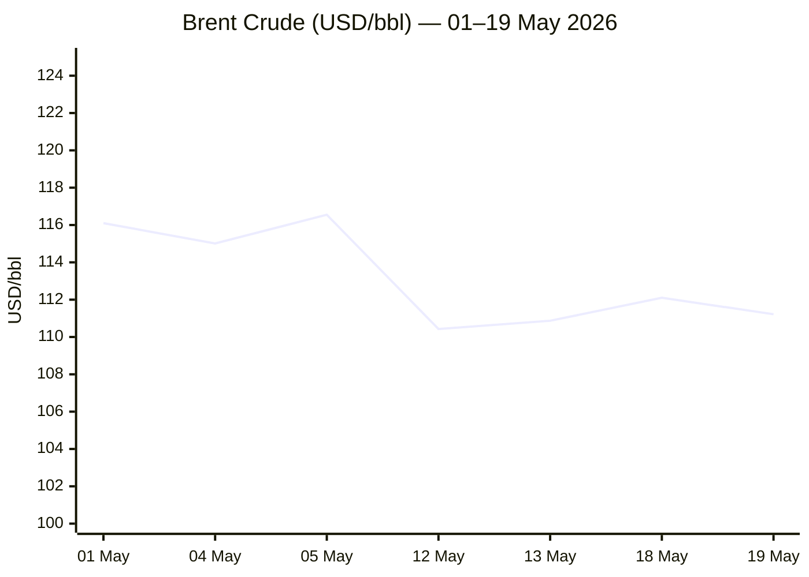
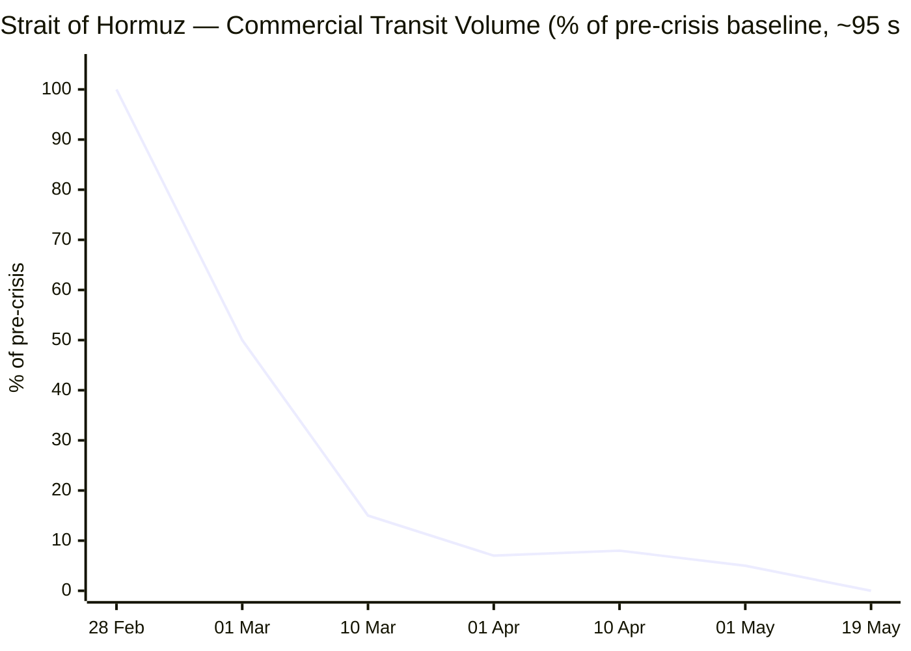

````yaml
---
brief_date: 2026-05-20
version: v1.2.1
run_time: "05:30 CET"
stories_published: 14
categories: [conflict, business, eu_affairs, technology, trends]
alert_counts:
  red: 3
  yellow: 7
  green: 4
ongoing_situations:
  - {name: "2026 Iran War", real_world_start: "2026-02-28", day: 82}
  - {name: "Strait of Hormuz Crisis", real_world_start: "2026-03-04", day: 78}
  - {name: "Russia–Ukraine War", real_world_start: "2022-02-24", day: 1547}
sources_fetched: 11
fetch_status:
  le_monde: "❌"
  faz: "❌"
  kommersant: "❌"
  xinhua: "⚠️"
  european_parliament: "⚠️"
expansion_queue: []
---
````

---

# 🌐 MORNING BRIEF
## Wednesday, 20 May 2026 · 05:30 CET
### 14 stories across 5 categories

---

## DIGEST SUMMARY

| # | Category | Headline | Alert |
|---|----------|----------|-------|
| 1 | ⚔️ Conflict | Iran ceasefire "on life support" — Trump was one hour from ordering strike | 🔴 |
| 2 | ⚔️ Conflict | Hormuz: zero transits for second consecutive day; IRGC redefines strait as operational zone | 🔴 |
| 3 | ⚔️ Conflict | UAE nuclear plant struck by drone; Senate advances Iran war-end bill | 🟡 |
| 4 | ⚔️ Conflict | Russia resumes mass drone campaign after Victory Day ceasefire; Ukraine hits Orenburg | 🟡 |
| 5 | ⚔️ Conflict | US–Ukraine Drone Deal memorandum drafted; Kyiv opens defence export framework | 🟢 |
| 6 | 💼 Business | US 30-year Treasury yield tops 5.2% — highest since 2007; S&P 500 third straight loss | 🔴 |
| 7 | 💼 Business | IMF WEO: global growth 3.1%, inflation 4.4%; adverse scenario now a live risk | 🟡 |
| 8 | 🇪🇺 EU Affairs | EP votes today on Slovakia rule-of-law resolution; billions in EU funds at stake | 🟡 |
| 9 | 🇪🇺 EU Affairs | EU AI Act Omnibus: EP/Council deal finalised; high-risk AI deadline moves to Dec 2027 | 🟢 |
| 10 | 🇪🇺 EU Affairs | EP plenary: foreign investment screening adopted; Kallas grilled on Middle East strategy | 🟢 |
| 11 | 🤖 Technology | Nvidia Q1 FY2027 earnings due tonight: consensus $78 bn revenue; AI capex at $725 bn | 🟡 |
| 12 | 🤖 Technology | EU AI Act Omnibus: nudifier ban added; watermarking deadline December 2026 | 🟢 |
| 13 | 📈 Trends | FAO Food Price Index rises for third straight month to 130.7 pts on Hormuz fertiliser shock | 🟡 |
| 14 | 📈 Trends | Dual chokepoint closure — Hormuz and Red Sea simultaneously blocked — triggers structural Cape rerouting | 🟡 |

> Alert level key: 🔴 High significance · 🟡 Developing · 🟢 Stable/Routine

---

## 🚨 SIGNAL BOARD

🔴 **Trump was "an hour away" from ordering strikes on Iran on 19 May before Gulf allies intervened — the 48-to-72-hour window granted expires today**
🔴 **Zero vessels transited the Strait of Hormuz for the second consecutive day (baseline: 95/day); war-risk insurance is 8× pre-crisis levels**
🟡 **US 30-year Treasury yield at 5.2% — its highest since 2007 — as bond markets price sustained war-driven inflation; UK gilts and Japanese bonds also at multi-decade highs**
🟡 **FAO Food Price Index at 130.7 in April (+1.6% MoM, third consecutive rise) as Hormuz closure drives fertiliser price surge**
⚡ **US and Ukraine draft landmark Drone Deal memorandum — Ukraine moves from arms-import-only posture to net technology exporter for the first time since 2022**

---

## 🔄 ONGOING SITUATIONS

| Situation | Real-world start | Day # | Last significant development | Status |
|-----------|-----------------|-------|------------------------------|--------|
| 2026 Iran War | 28 Feb 2026 | **Day 82** | Trump postponed 19 May strike; Gulf allies secured 48-72 hr window; Iran proposal dismissed as "garbage" | 🔴 Active |
| Strait of Hormuz Crisis | 04 Mar 2026 | **Day 78** | Zero commercial transits on 18–19 May; IRGC redefines strait extent; UK deploys forces | 🔴 Active |
| Russia–Ukraine War | 24 Feb 2022 | **Day 1,547** | Post-Victory Day ceasefire (9-11 May): Russia resumed mass drone campaign; Ukraine strikes Orenburg 1,500 km from border | 🟡 Active |

---

## ⚔️ ANALYST SECTIONS

> 🔎 **CONFLICT ANALYST** · 5 updates today

### 1. Iran ceasefire "on life support" — Trump one hour from strike 🔴

**Alert:** 🔴
**Summary:** President Trump revealed on 19 May that he was "an hour away" from ordering what he called "a very major attack" on Iran before cancelling it at the request of Saudi Arabia, Qatar, and the UAE. The Gulf leaders asked for two to three days, citing "serious negotiations" with Tehran. The ceasefire, brokered by Pakistan on 8 April, remains nominally in place but Trump has publicly described it as on "life support." Iran submitted an updated peace proposal reportedly including nuclear concessions, but the White House dismissed it as "garbage." The 48-to-72-hour diplomatic window expires today.
**Significance:** The repeated cycle of deadline-setting and deferral mirrors the pre-war pattern of late February. A failure of today's talks window materially raises the probability of renewed US strikes and a formal ceasefire collapse, with consequences extending across oil markets, the Strait, and Gulf Arab security architecture.
**Sources:**

- [NPR — Trump says he's called off Iran strike at request of Gulf allies](https://www.npr.org/2026/05/19/g-s1-122762/trump-says-hes-called-off-iran-strike) · 19 May 2026
- [CNBC — Trump says he was 'an hour away' from Iran strike decision before he postponed it](https://www.cnbc.com/2026/05/19/trump-iran-war-strike-postponed.html) · 19 May 2026
- [Time — Trump Cancels Planned Attack on Iran, Citing 'Serious Negotiations'](https://time.com/article/2026/05/19/trump-us-iran-israel-war-gulf-states-attack-hormuz/) · 19 May 2026

**Trend:** ⚡ Reversal
**Tags:** #Iran #ceasefire #peace-talks #nuclear #MULTI-SOURCE

---

### 2. Hormuz: zero transits for second consecutive day; IRGC redefines strait 🔴
**Alert:** 🔴
**Summary:** No commercial vessels transited the Strait of Hormuz on 18–19 May, according to IMF PortWatch and AIS data — the first back-to-back zero-transit days since the crisis began on Day 1. The IRGC Navy has formally redefined the strait as a "vast operational area" extending from Jask to Siri Island, far beyond the IMO corridor. War-risk insurance premiums stand at 8× pre-crisis levels; six P&I clubs have withdrawn cover. More than 1,550 vessels remain stranded. The United Kingdom announced the deployment of drones, fighter aircraft, and a Royal Navy warship to support freedom-of-navigation operations.
**Significance:** The IRGC's formal redefinition represents a legal escalation, shifting from de-facto blockade to claimed territorial sovereignty. If Iran also targets subsea cables — an option its officials have publicly floated — the crisis would extend from energy to digital infrastructure.
**Sources:**

- [Straits.live — Live Strait of Hormuz Status](https://straits.live/) · 19 May 2026
- [Wikipedia — 2026 Strait of Hormuz crisis](https://en.wikipedia.org/wiki/2026_Strait_of_Hormuz_crisis) · Updated 20 May 2026
- [USNI News — Strait of Hormuz Commercial Transits at Lowest Level](https://news.usni.org/2026/05/01/strait-of-hormuz-commercial-transits-at-lowest-level-since-operation-epic-fury-start-shipping-data-shows) · 01 May 2026

**Trend:** ↗ Escalating
**Tags:** #Hormuz #Iran #naval-blockade #escalation #MULTI-SOURCE

---

### 3. UAE nuclear plant struck by drone; US Senate advances Iran war-end bill 🟡
**Alert:** 🟡
**Summary:** A drone strike ignited a fire on the perimeter of the UAE's sole nuclear power plant on 18 May in what Emirati authorities called an "unprovoked terrorist attack," without formally attributing blame. The incident follows a pattern of Iranian-allied strikes on Gulf energy infrastructure since the ceasefire. Separately, the US Senate on 19 May advanced a bipartisan bill aimed at ending the Iran war; the measure remains in early procedural stages. Iran-connected oil tankers reportedly made deliveries in the Persian Gulf in defiance of the US blockade, according to *The Wall Street Journal*, citing US officials.
**Significance:** The nuclear plant strike elevates the risk of a pan-Gulf energy infrastructure campaign. Any confirmed Iranian link could rupture the diplomatic pause Trump's Gulf allies have purchased.
**Sources:**

- [PBS News — Trump says he's called off Iran strike planned for Tuesday](https://www.pbs.org/newshour/politics/trump-says-hes-called-off-iran-strike-planned-for-tuesday-at-request-of-gulf-allies) · 19 May 2026
- [Britannica — 2026 Iran war](https://www.britannica.com/event/2026-Iran-war) · Updated 19 May 2026

**Trend:** ↗ Escalating
**Tags:** #Iran #Hormuz #nuclear #escalation #drone-warfare

---

### 4. Russia resumes mass drone campaign; Ukraine strikes Orenburg 1,500 km from border 🟡
**Alert:** 🟡
**Summary:** Following the nominally US-brokered 9–11 May Victory Day ceasefire, Russia launched its heaviest aerial campaign of 2026, firing more than 1,560 drones at Ukraine through to 14 May, collapsing a residential building in Kyiv. ACLED data recorded Russia's deadliest civilian strikes of the year in the days leading up to the ceasefire — targeting first responders and energy workers in Zaporizhia, Kramatorsk, and Dnipro. Ukraine struck Russia's Tuapse oil refinery and confirmed a strike on Orenburg, 1,500 km from the border. Pokrovsk in Donetsk remains the most directly threatened major Ukrainian city.
**Significance:** The pattern of intensified civilian targeting around ceasefire periods, documented by ACLED, makes a durable truce structurally difficult. Russia's reluctance to protect civilian areas would be a core obstacle to any peace framework.
**Sources:**

- [ACLED — Ukraine Conflict Monitor](https://acleddata.com/monitor/ukraine-conflict-monitor) · 18 May 2026
- [Al Jazeera — Russia–Ukraine War latest](https://www.aljazeera.com/tag/ukraine-russia-crisis/) · 19 May 2026

**Trend:** ↗ Escalating
**Tags:** #Russia #Ukraine #drone-warfare #missile-strike #frontline #MULTI-SOURCE

---

### 5. US–Ukraine Drone Deal memorandum drafted; Kyiv opens defence export framework 🟢
**Alert:** 🟢
**Summary:** The US State Department and Ukrainian Ambassador Olha Stefanishyna have drafted a memorandum of understanding for a landmark defence agreement, as confirmed to CBS News by three sources. The deal would allow Ukraine to export combat-tested UAV technology to the US and manufacture drones in joint ventures with American firms. Ukraine's production capacity is projected at $55 billion in 2026; one producer alone plans 3 million FPV drones, against 300,000 built in the US in 2025. Separately, Kyiv announced six new joint ventures with Germany and is opening ten European export hubs. Ukraine has deployed drone interceptors and pilots to the Gulf to counter Iranian Shahed UAVs.
**Significance:** The memorandum marks the first formal step toward Ukraine exiting its post-invasion arms export ban, transforming Kyiv from net aid recipient to defence technology partner.
**Sources:**

- [CBS News — Ukraine, US working on major deal](https://www.cbsnews.com/news/ukraine-us-drone-defense-deal-draft-iran-war-capabilities-necessities/) · 12 May 2026
- [Defense News — Blacklists, corruption and frontline needs: Ukraine tackles an arms-export puzzle](https://www.defensenews.com/global/europe/2026/05/14/blacklists-corruption-and-frontline-needs-ukraine-tackles-an-arms-export-puzzle/) · 14 May 2026

**Trend:** ↗ Escalating
**Tags:** #Ukraine #drone-warfare #autonomous-systems #diplomacy #MULTI-SOURCE

📚 *Background reading:* [Kyiv Independent — Ukraine news and analysis](https://kyivindependent.com) · [Al Jazeera — Russia–Ukraine War](https://www.aljazeera.com/tag/ukraine-russia-crisis/)

---

> 💼 **BUSINESS ANALYST** · 2 updates today

### 6. US 30-year Treasury yield tops 5.2% — highest since 2007; S&P 500 third straight loss 🔴

**Alert:** 🔴
**Summary:** The 30-year US Treasury yield surged to 5.2% on 19 May, its highest since 2007, as bond markets priced sustained war-driven inflation into long-dated debt. The 10-year yield reached 4.687%, its highest since January 2025. The S&P 500 closed down 0.67% to 7,353.61 — its third consecutive losing session; the Dow shed 322 points (−0.65%) to 49,363.88; the Nasdaq fell 0.84% to 25,870.71. UK 30-year gilts hit their highest since 1998; Japan's 30-year bond yield reached a record. US consumer prices in April posted their highest annual increase in three years.
**Market signal:** Strongly bearish for equities and growth assets: war-driven energy inflation is forcing upward repricing of the entire yield curve, raising fears that the Fed's next move may be a hike rather than a cut.
**Sources:**

- [CNN — 30-year US Treasury yield hits highest level in 19 years](https://www.cnn.com/2026/05/19/business/30-year-treasury-yield-bond-record) · 19 May 2026
- [CNBC — S&P 500 posts third straight losing session as rising yields drag down stocks](https://www.cnbc.com/2026/05/18/stock-market-today-live-updates.html) · 19 May 2026

**Trend:** ↗ Escalating
**Tags:** #SP500 #interest-rates #inflation #market-shock #MULTI-SOURCE

📎 *See also:* Conflict § Story 2 — Strait of Hormuz zero transits drive oil price elevation, feeding inflation pressure

---

### 7. IMF WEO April 2026: global growth 3.1%, headline inflation 4.4% — adverse scenario now live risk 🟡
**Alert:** 🟡
**Summary:** The IMF's April 2026 World Economic Outlook — "Global Economy in the Shadow of War" — cuts global growth to 3.1% for 2026 and raises headline inflation to 4.4%, from a pre-conflict trajectory of 3.4% growth. The reference forecast assumes the conflict remains short-lived and disruptions fade by mid-2026; consistent with futures prices as of 10 March. An adverse scenario (energy prices up 80%, tighter financial conditions) yields 2.5% growth and 5.4% inflation. A severe scenario yields 2% growth and 6%+ inflation. The EIA STEO (12 May) assumes Hormuz stays "effectively closed" until late May, with inventories falling 8.5 million b/d in Q2 2026.
**Market signal:** Neutral-to-bearish: growth at 3.1% is manageable, but the adverse scenario is no longer tail risk — with Hormuz still at 0% transit and the ceasefire on "life support," the reference forecast's key assumption is under immediate pressure.
**Sources:**

- [IMF — World Economic Outlook April 2026: Global Economy in the Shadow of War](https://www.imf.org/en/publications/weo/issues/2026/04/14/world-economic-outlook-april-2026) · 14 April 2026
- [EIA — Short-Term Energy Outlook May 2026](https://www.eia.gov/outlooks/steo/) · 12 May 2026
- [IMF Blog — War Darkens Global Economic Outlook](https://www.imf.org/en/blogs/articles/2026/04/14/war-darkens-global-economic-outlook-and-reshapes-policy-priorities) · 14 April 2026

**Trend:** ↘ De-escalating
**Tags:** #IMF #GDP-forecast #oil-price #inflation #stagflation #MULTI-SOURCE

📎 *See also:* Conflict § Story 2 — Hormuz zero transit is the proximate cause of the IMF's revised downside scenarios

📚 *Background reading:* [Atlantic Council — Energy security analysis](https://www.atlanticcouncil.org) [URL UNAVAILABLE] · [Bruegel — Eurozone economic outlook](https://www.bruegel.org) [URL UNAVAILABLE]

---

> 🇪🇺 **EU AFFAIRS ANALYST** · 3 updates today

### 8. EP votes today on Slovakia rule-of-law resolution; billions in EU funds at stake 🟡
**Alert:** 🟡
**Summary:** The European Parliament is scheduled to vote at 12:00 today on a resolution calling for an EU response to democratic backsliding under Prime Minister Robert Fico, following a fact-finding mission to Bratislava in 2025. The resolution calls for restoration of anti-corruption safeguards, protection of postal voting rights, investigations into alleged EU funds misuse, and triggers the rule-of-law conditionality mechanism — which can freeze EU funds — if concerns persist. The Parliament previously voted on 29 April to call for triggering the conditionality mechanism; the Commission already launched an infringement proceeding against Bratislava in November 2025 over constitutional changes incompatible with EU law.
**Legislative/policy stage:** EP resolution vote in plenary at 12:00 CET, 20 May 2026. Rule-of-law conditionality mechanism trigger remains Commission prerogative; decision pending.
**Sources:**

- [Renew Europe — Plenary Priorities 18–21 May 2026](https://www.reneweuropegroup.eu/news/2026-05-18/plenary-priorities-18-21-may-2026) · 18 May 2026
- [Balkan Insight — European Parliament Approves Proposal to Freeze Billions in Funds for Slovakia](https://balkaninsight.com/2026/04/29/european-parliament-approves-proposal-to-freeze-billions-in-funds-for-slovakia/rd/) · 29 April 2026

**Trend:** ↗ Escalating
**Tags:** #rule-of-law #EU-funds #EU-institutions #MULTI-SOURCE

---

### 9. EU AI Act Omnibus: EP/Council deal confirmed; high-risk AI deadline moves to December 2027 🟢
**Alert:** 🟢
**Summary:** The provisional political agreement between the European Parliament and the Council reached on 7 May extends the compliance deadline for standalone high-risk AI systems (Annex III) to 2 December 2027 and for product-embedded systems (Annex I) to 2 August 2028. A new prohibition on AI systems generating non-consensual intimate imagery ("nudifier apps") takes effect 2 December 2026. Watermarking obligations for AI-generated content are retained but with a grace period to 2 December 2026. The agreement extends SME-equivalent regulatory protections to small mid-cap companies. Lead MEPs Arba Kokalari (EPP) and Michael McNamara (Renew) are scheduled to present the deal at an EP press conference on 21 May.
**Legislative/policy stage:** Provisional agreement reached 7 May 2026. Formal adoption expected before 2 August 2026 (the original HRAIS deadline). Text to be published in the *Official Journal* upon adoption.
**Sources:**

- [Council of the EU — Artificial Intelligence: Council and Parliament agree to simplify and streamline rules](https://www.consilium.europa.eu/en/press/press-releases/2026/05/07/artificial-intelligence-council-and-parliament-agree-to-simplify-and-streamline-rules/) · 7 May 2026
- [European Commission — AI Act regulatory framework](https://digital-strategy.ec.europa.eu/en/policies/regulatory-framework-ai) · Updated 19 May 2026

**Trend:** → Stable
**Tags:** #AI-regulation #digital-regulation #EU-institutions #MULTI-SOURCE

---

### 10. EP plenary: foreign investment screening adopted; Kallas grilled on Middle East strategy 🟢
**Alert:** 🟢
**Summary:** MEPs on 19 May adopted a final agreement with the Council on a new regulation screening foreign investments in EU strategic sectors: defence, semiconductors, artificial intelligence, critical raw materials, and financial services. EU trade ministers separately reviewed the impact of the Middle East conflict on EU trade flows. Also this week: the EP questioned High Representative Kaja Kallas on EU strategy toward the Iran war, Iran ceasefire, and Syria; and the Parliament launched the 2026 Daphne Caruana Galizia Prize for investigative journalism.
**Legislative/policy stage:** Foreign investment screening regulation adopted at plenary vote, 19 May 2026. Regulation to enter into force 1 July 2026 per the agreed timeline.
**Sources:**

- [EUbusiness — EU Agenda Week Ahead 18–23 May 2026](https://www.eubusiness.com/politics/eucalendar/) · 18 May 2026
- [Renew Europe — Plenary Priorities 18–21 May 2026](https://www.reneweuropegroup.eu/news/2026-05-18/plenary-priorities-18-21-may-2026) · 18 May 2026

**Trend:** → Stable
**Tags:** #EU-institutions #semiconductor #AI #single-market

📚 *Background reading:* [ECFR — European foreign and security policy analysis](https://ecfr.eu/) [URL UNAVAILABLE] · [Bruegel — EU economic policy](https://www.bruegel.org) [URL UNAVAILABLE]

---

> 🤖 **TECHNOLOGY ANALYST** · 2 updates today

### 11. Nvidia Q1 FY2027 earnings due tonight: $78 bn consensus, options pricing 8–10% move 🟡
**Alert:** 🟡
**Summary:** Nvidia reports Q1 fiscal 2027 results (quarter ended 26 April 2026) after US market close today. Wall Street consensus is approximately $78 billion in revenue (+78% YoY) and $1.77 non-GAAP EPS, with Data Centre revenue near $73 billion. The previous quarter (Q4 FY2026) posted record revenue of $68.1 billion (+73% YoY). CEO Jensen Huang has projected $1 trillion from Blackwell and Vera Rubin processors across 2026–27. The four largest hyperscalers collectively announced $725 billion in 2026 capex. Options markets are pricing an 8–10% share price swing on the print. China guidance — revenue excluded from forward guidance since H20 restrictions — remains the highest-variance variable.
**Analyst note:** Within 12–24 months, Q2 guidance will determine whether the Vera Rubin ramp and Blackwell GB300 transition begin to shift AI chip economics from data-centre build-out to inference-at-scale, with direct implications for Broadcom, TSMC, and hyperscaler capex trajectories.
**Sources:**

- [Motley Fool — Nvidia Reports Its Fiscal 2027 Q1 Earnings on May 20](https://www.fool.com/investing/2026/05/19/nvda-stock-earnings-beat-date-may-20/) · 19 May 2026
- [IG International — NVIDIA Q1 FY2027 earnings preview](https://www.ig.com/en/news-and-trade-ideas/nvidia-q1-fy-2027-earnings-preview-260513) · 13 May 2026

**Trend:** ↗ Escalating
**Tags:** #AI #semiconductor #AI-benchmark #earnings #data-centre

---

### 12. EU AI Act Omnibus: nudifier ban effective December 2026; watermarking deadline locked 🟢
**Alert:** 🟢
**Summary:** The 7 May EU AI Act Digital Omnibus deal introduces a new Article 5 prohibition on AI systems generating non-consensual intimate imagery and child sexual abuse material, including "nudifier" applications. Providers must comply by 2 December 2026 or face fines of up to €35 million or 7% of worldwide turnover. AI transparency and watermarking obligations (Article 50) — requiring disclosure of AI-generated content — remain on track for 2 August 2026 with a partial grace period for generative systems until 2 December 2026. The Commission separately opened public consultation on draft Article 50 transparency guidelines on 8 May.
**Analyst note:** In the 12–24 month window, the December 2026 watermarking deadline will be the first concrete compliance gate for generative AI deployments in the EU, making synthetic-content labelling infrastructure a near-term commercial priority across consumer-facing AI applications.
**Sources:**

- [Council of the EU — Artificial Intelligence: Council and Parliament agree to simplify rules](https://www.consilium.europa.eu/en/press/press-releases/2026/05/07/artificial-intelligence-council-and-parliament-agree-to-simplify-and-streamline-rules/) · 7 May 2026
- [Dastra — EU AI Act Omnibus: what changed](https://www.dastra.eu/en/blog/simpler-safer-stricter-where-it-counts-inside-the-eu-ai-omnibus-deal/60025) · 15 May 2026

**Trend:** → Stable
**Tags:** #AI-regulation #digital-regulation #AI-safety #LLM

📎 *See also:* EU Affairs § Story 9 — EP/Council procedural status of the Digital Omnibus package

📚 *Background reading:* [CSIS — Technology and security policy](https://www.csis.org) [URL UNAVAILABLE]

---

> 📈 **TRENDS ANALYST** · 2 updates today

### 13. FAO Food Price Index rises for third straight month to 130.7 pts on Hormuz fertiliser shock 🟡

**Alert:** 🟡
**Summary:** The FAO Food Price Index averaged 130.7 points in April 2026, up 1.6% from March (128.5) and 2.0% above the same month a year ago — the third consecutive monthly increase. Vegetable oil, meat, and cereals all rose; the FAO Agricultural Market Information System directly attributed the rise to Hormuz-driven disruption to fertiliser supply, with urea and phosphate prices surging. Palm oil hit its highest level since mid-2022. FAO also revised the 2026 world wheat production forecast down approximately 2%, as farmers shift to less fertiliser-intensive crops. The IMF's adverse scenario separately projects food commodity prices rising 5% in 2026 and 10% in 2027.
**Horizon:** Medium-to-long-term structural signal: if the Hormuz closure extends, the fertiliser cost shock will feed through to 2026 planting decisions and 2027 harvests, prolonging food price pressure well beyond any ceasefire.
**Sources:**

- [FAO — Food Price Index April 2026](https://www.fao.org/worldfoodsituation/foodpricesindex/en) · 8 May 2026
- [FAO — FFPI press release](https://www.fao.org/newsroom/detail/fao-food-price-index-up-for-third-consecutive-month-largely-on-rising-vegetable-oil-prices/en) · 8 May 2026

**Trend:** ↗ Escalating
**Tags:** #food-security #food-prices #Hormuz #supply-shock #MULTI-SOURCE

📎 *See also:* Conflict § Story 2 — Hormuz zero-transit as structural driver of global agricultural input costs

---

### 14. Dual chokepoint closure: both Hormuz and Red Sea blocked — Cape of Good Hope rerouting becomes structural 🟡
**Alert:** 🟡
**Summary:** For the first time in modern maritime history, both the Strait of Hormuz and the Red Sea/Suez route are simultaneously disrupted: Hormuz at effectively 0% of pre-war traffic; the Red Sea operating at 49% below pre-crisis capacity following a Houthi resumption of attacks. More than 1,550 vessels are stranded. Maersk, MSC, CMA CGM, and Hapag-Lloyd have rerouted to the Cape of Good Hope; container surcharges on Asia–Europe lanes are running at $1,000–$1,200 per TEU above pre-crisis. Brent crude remains approximately 70% above year-ago levels. The Carra Globe/Kpler analysis estimates April Hormuz traffic at approximately 5% of pre-war average.
**Horizon:** Long-term structural shift: two years of Red Sea disruption and now Hormuz closure are accelerating investment in Cape-route logistics infrastructure and multi-modal alternatives (Saudi Yanbu pipeline, Atlantic LNG terminals), reshaping maritime trade patterns that will persist beyond any resolution.
**Sources:**

- [Carra Globe — Strait of Hormuz Closure 2026: Supply Chain Impact](https://carraglobe.com/strait-of-hormuz-closure-2026/) · Updated 8 May 2026
- [CNN — Visualizing shipping through the Strait of Hormuz since war began](https://www.cnn.com/2026/04/29/world/iran-war-gulf-hormuz-shipping-maps-intl-vis) · 29 April 2026

**Trend:** ↗ Escalating
**Tags:** #shipping #Hormuz #supply-shock #energy-markets #MULTI-SOURCE

📚 *Background reading:* [CFR — Middle East and energy security](https://www.cfr.org/) [URL UNAVAILABLE] · [Atlantic Council — Maritime security and Gulf crisis](https://www.atlanticcouncil.org) [URL UNAVAILABLE]

---

## 📊 KEY DATA OF THE DAY

> 📊 **DATA OFFICER** · 7 indicators

| Indicator | Value | Δ vs prior session | Δ vs 7 days ago | Note | Source | URL |
|-----------|-------|-------------------|-----------------|------|--------|-----|
| EUR/USD | 1.1612 | −0.39% | −0.75% (vs 15 May ~1.170) | Near 1-month low; ECB June hike >80% priced | Trading Economics / ECB | [link](https://tradingeconomics.com/euro-area/currency) |
| Brent Crude (USD/bbl) | $111.22 | −0.79% | +0.72% (vs 12 May $110.43) | Volatile session; Trump strike cancellation triggered brief $2 drop before recovery; ~70% above yr-ago | Trading Economics / EIA | [link](https://tradingeconomics.com/commodity/brent-crude-oil) |
| Gold (XAU/USD) | $4,486.86 | N/A | N/A | Near 4-week low after weekly drop of ~4%; safe-haven premium persisting | Trading Economics | [link](https://tradingeconomics.com/commodity/gold) |
| IMF Global Growth 2026 | 3.1% | −0.3pp vs Jan WEO | −0.3pp vs Oct 2025 WEO | Reference forecast; adverse scenario = 2.5%; Iran conflict as primary driver of downgrade | IMF WEO April 2026 | [link](https://www.imf.org/en/publications/weo/issues/2026/04/14/world-economic-outlook-april-2026) |
| EU CPI YoY (Apr 2026) | 3.0% | +0.4pp vs Mar (est. 2.6%) | Highest since Sep 2023 | Well above ECB 2% target; energy cost pass-through from Hormuz | Eurostat / Trading Economics | [link](https://tradingeconomics.com/euro-area/currency) |
| FAO Food Price Index | 130.7 (Apr 2026) | +1.6% vs Mar 128.5 | Third consecutive monthly rise | 18.4% below Mar 2022 peak; Hormuz driving fertiliser costs up; wheat output forecast cut ~2% | FAO | [link](https://www.fao.org/worldfoodsituation/foodpricesindex/en) |
| Hormuz Transit Volume | 0% of pre-crisis | 0 ships (2nd consecutive day) | <5% last week | Pre-crisis baseline: ~95 ships/day; 1,550+ vessels stranded; war-risk insurance 8× pre-crisis | Straits.live / IMF PortWatch | [link](https://straits.live/) |

**Data commentary:** The combination of a 30-year Treasury at 5.2% and Brent holding above $110 signals that bond markets are now pricing a structurally higher inflation path rather than a transitory energy spike — a materially more hawkish backdrop than early April. EUR/USD near its one-month low at 1.1612 reflects growing market conviction of an ECB hike in June, compressing a euro zone already absorbing 3.0% inflation with only 0.1% Q1 GDP growth. The Hormuz transit reading of 0% — for a second consecutive day, on Day 78 of the crisis — means the EIA's reference assumption of Hormuz reopening by end of May is now unlikely to hold: if transit remains at zero through today's diplomatic window, the IMF's adverse scenario (2.5% global growth, 5.4% inflation) comes into play as the operative reference.

---

## 📈 CHARTS





---

## ⚙️ AGENT METADATA

| Field | Value |
|-------|-------|
| Agent version | MORNING BRIEF v1.2.1 |
| Run timestamp | 2026-05-20T05:30:47+02:00 |
| Fetch status | Le Monde ❌ · FAZ ❌ · Kommersant ❌ · Xinhua ⚠️ · EP ⚠️ |
| Sources queried | 11 / 11 |
| Stories surfaced | ~26 (pre-editorial filter) |
| Stories published | 14 (post-editorial filter) |
| Languages processed | EN, FR (search summaries translated) |
| Output language | English (British) |
| Date validated | ✅ Confirmed 20 May 2026 |
| Expansion Queue | None — all tags resolved from closed list |

---

*MORNING BRIEF is an AI-assisted digest. All summaries are paraphrased from original sources. Verify time-sensitive information at the linked URLs before acting. Output language: British English.*
