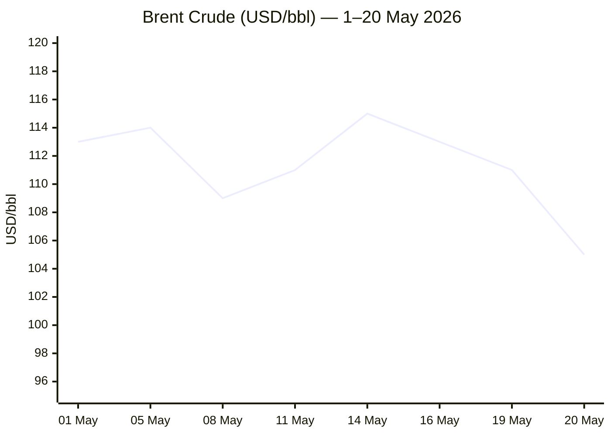
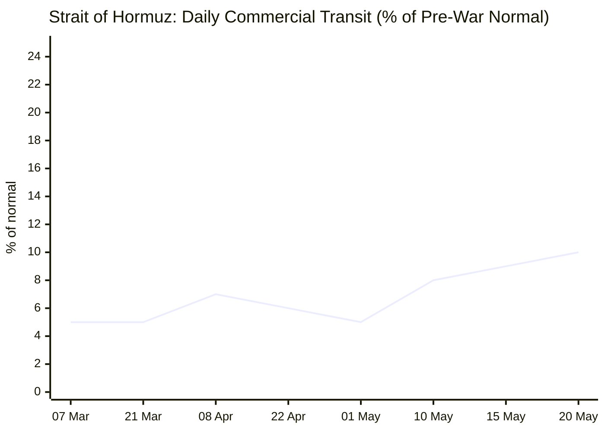

```yaml
---
brief_date: 2026-05-21
version: v1.2.1
run_time: "05:31 CET"
stories_published: 14
categories: [conflict, business, eu_affairs, technology, trends]
alert_counts:
  red: 3
  yellow: 9
  green: 2
ongoing_situations:
  - {name: "Iran–US War", real_world_start: "2026-02-28", day: 83}
  - {name: "Iran–US Ceasefire", real_world_start: "2026-04-08", day: 44}
  - {name: "Lebanon–Israel Ceasefire", real_world_start: "2026-04-16", day: 36}
  - {name: "Ukraine War (full-scale)", real_world_start: "2022-02-24", day: 1548}
sources_fetched: 9
fetch_status:
  le_monde: "❌"
  faz: "❌"
  kommersant: "❌"
  xinhua: "⚠️"
  european_parliament: "✅"
expansion_queue: []
---
```

---

# 🌐 MORNING BRIEF
## Thursday, 21 May 2026 · 05:31 CET
### 14 stories across 5 categories

---

## DIGEST SUMMARY

| # | Category | Headline | Alert |
|---|----------|----------|-------|
| 1 | ⚔️ Conflict | Iran–US talks stalled; Tehran reviews US draft amid Hormuz trickle | 🔴 |
| 2 | ⚔️ Conflict | Lebanon–Israel 45-day ceasefire; Washington talks ongoing | 🟡 |
| 3 | ⚔️ Conflict | Russia holds nuclear force drills; Ukraine nets 29 sq mi gain | 🔴 |
| 4 | 💼 Business | Brent falls 5.66% to $104.99 on Hormuz supply optimism | 🟡 |
| 5 | 💼 Business | EU CPI 3.0% in April — highest since Sept 2023; ECB hike priced | 🟡 |
| 6 | 💼 Business | Big Tech AI capex hits $725bn in 2026 (+77% YoY); memory chip crunch | 🟡 |
| 7 | 🇪🇺 EU Affairs | EU–US trade: Parliament–Council provisional agreement reached | 🟡 |
| 8 | 🇪🇺 EU Affairs | Slovakia: EP resolution demands conditionality mechanism trigger | 🟡 |
| 9 | 🇪🇺 EU Affairs | Parliament approves EU foreign investment screening regulation | 🟢 |
| 10 | 🇪🇺 EU Affairs | MEPs pass new EU steel market protection measures | 🟢 |
| 11 | 🤖 Technology | Google and Blackstone launch $5bn AI data-centre JV on TPUs | 🟡 |
| 12 | 🤖 Technology | OpenAI nears $25bn annualised revenue; IPO mooted for late 2026 | 🟡 |
| 13 | 📈 Trends | FAO food price index up for third consecutive month | 🟡 |
| 14 | 📈 Trends | Hormuz structural shipping crisis: 22,500 mariners stranded; 10% transit | 🔴 |

> Alert Level key: 🔴 High significance · 🟡 Developing · 🟢 Stable/Routine

---

## 🚨 SIGNAL BOARD

🔴 **Brent fell 5.66% in a single session to $104.99/bbl on May 20 — the largest one-day drop since April, driven by the first significant tanker exits from the Strait of Hormuz.**
🔴 **Russia is conducting nuclear-force readiness exercises 19–21 May "under conditions of a threat of aggression," the only such publicised drills since the Iran ceasefire.**
🟡 **EU euro area CPI reached 3.0% in April, its highest reading since September 2023; energy prices surged 10.8%, with markets pricing in a 25bp ECB hike in June.**
🟡 **Parliament and Council struck a provisional EU–US trade tariff agreement on 20 May, embedding a suspension clause tied to US steel and aluminium compliance by 31 December 2026.**
⚡ **Three supertankers exited the Strait of Hormuz on 20 May carrying 6 million barrels — the first coordinated crude departures in months, signalling a tentative softening of Iran's transit posture.**

---

## 🔄 ONGOING SITUATIONS

| Situation | Real-world start | Day # | Last significant development | Status |
|-----------|-----------------|-------|------------------------------|--------|
| Iran–US War | 28 Feb 2026 | Day 83 | Tehran reviewing US draft response to 14-point proposal; no new talks scheduled | 🔴 Active — Ceasefire fragile |
| Iran–US Ceasefire | 08 Apr 2026 | Day 44 | Brent -5.66% on tanker movement; Iran 5-precondition stance unchanged | 🟡 Ceasefire holding |
| Lebanon–Israel Ceasefire | 16 Apr 2026 | Day 36 | 45-day extension agreed ~16 May; Washington talks ongoing | 🟡 Extended |
| Ukraine War (full-scale) | 24 Feb 2022 | Day 1,548 | Russia nuclear drills; net Russian loss of 29 sq mi past week | 🔴 Active — Frontline fluid |

---

## ⚔️ CONFLICT ANALYST

> 🔎 **CONFLICT ANALYST** · 3 updates today

---

### 1. Iran–US War: Talks Stalled; First Supertankers Exit Hormuz 🔴

**Alert:** 🔴

**Summary:** Iran is reviewing Washington's latest draft response to Tehran's 14-point proposal, but no new round of talks has been scheduled. Iran insists on five preconditions — including an end to the US naval blockade, full sanctions relief, and recognition of Iranian sovereignty over the Strait of Hormuz — before resuming nuclear negotiations. The US has rejected Iran's counterproposal as "totally unacceptable." In a rare signal, three supertankers exited the strait on 20 May carrying 6 million barrels, with satellite data confirming the transits. Brent fell sharply in response. Total transit traffic remains ~10% of pre-war normal.

**Significance:** The tanker movement represents the first coordinated crude departure in weeks and suggests Iran may be allowing limited confidence-building transit ahead of resumed talks. However, Tehran's five preconditions remain structurally incompatible with Washington's demand that nuclear concessions precede any economic relief. The diplomatic gap is wide, and the ceasefire lacks a durable framework.

**Sources:**
- [CNBC — "Iran says it will 'never bow' as Trump rejects peace counteroffer"](https://www.cnbc.com/2026/05/11/iran-war-trump-negotiation-hormuz-nuclear-talks.html) · 11 May 2026
- [CGTN — "Iran sets five preconditions for renewed US talks, rejects nuclear concessions"](https://news.cgtn.com/news/2026-05-13/Iran-sets-five-preconditions-for-renewed-US-talks-local-media-reports-1N6AV02FPl6/share_amp.html) · 13 May 2026
- [BNN Bloomberg — "Tankers exit Strait of Hormuz with 6 million barrels of crude oil"](https://www.bnnbloomberg.ca/business/2026/05/20/tankers-exit-strait-of-hormuz-with-6-million-barrels-of-crude-oil/) · 20 May 2026

**Trend:** → Stable (ceasefire holds; diplomatic progress absent)

**Tags:** #Iran #Hormuz #ceasefire #peace-talks #nuclear #MULTI-SOURCE

📎 See also: Business § Story 4 — Brent crude -5.66% on Hormuz supply optimism; Trends § Story 14 — Structural Hormuz shipping crisis

---

### 2. Lebanon–Israel: 45-Day Ceasefire Extension; Washington Talks Enter New Phase 🟡

**Alert:** 🟡

**Summary:** Israel and Lebanon agreed to a 45-day ceasefire extension around 16 May, following US mediation. Peace talks in Washington opened on 14 May, marking the first direct Israeli–Lebanese diplomatic contacts of this nature since the failed 1983 May 17 Agreement. The talks aim at a permanent security arrangement and Hezbollah disarmament. The ceasefire is contested: Lebanon's Health Ministry reported 22 deaths, including eight children, in Israeli airstrikes on 13 May, even as the truce nominally held. Hezbollah has not accepted disarmament proposals.

**Significance:** A 45-day window gives negotiators until late June to establish a durable framework. Israel's insistence that Lebanon's armed forces assume exclusive security responsibility is the key test of Hezbollah's political incorporation into the Lebanese state. Failure to disarm before the window closes risks a fresh escalation, particularly given Iran's preconditions on Lebanon in the wider Hormuz talks.

**Sources:**
- [PBS NewsHour — "Israel and Lebanon agree to 45-day extension of ceasefire, U.S. State Department says"](https://www.pbs.org/newshour/amp/world/israel-and-lebanon-agree-to-45-day-extension-of-ceasefire-u-s-state-department-says) · 16 May 2026
- [The Defense Post — "Lebanon, Israel to Hold New Talks in US as Ceasefire Nears End"](https://thedefensepost.com/2026/05/14/lebanon-israel-ceasefire-talks-us/) · 14 May 2026

**Trend:** ↘ De-escalating (ceasefire extended; but violations ongoing)

**Tags:** #Lebanon #Hezbollah #ceasefire #peace-talks #MULTI-SOURCE

---

### 3. Ukraine: Russia Conducts Nuclear Force Drills; Ukraine Posts Territorial Gains 🔴

**Alert:** 🔴

**Summary:** The Russian Armed Forces are conducting nuclear-force readiness exercises from 19 to 21 May, framed by Moscow as preparation for combat "under conditions of a threat of aggression." The drills represent a deliberate nuclear signal, timed alongside ongoing frontline pressure in eastern Ukraine. ISW data covering 12–19 May shows Russia suffered a net loss of 29 square miles, following a net loss of 12 sq mi the previous week. There were 189 combat clashes on 20 May, with Russian forces concentrating on the Pokrovsk sector. A Russian drone strike hit Naftogaz infrastructure in Chernihiv region. Cumulative Russian personnel losses since 24 February 2022 stand at approximately 1,352,070.

**Significance:** Nuclear-force exercises conducted in plain public view carry a calibrated signalling function. The timing — with Hormuz talks stalled, Lebanon fragile, and Ukraine netting ground — suggests the Kremlin is using nuclear rhetoric to deter Western escalation support. Ukraine's territorial gains in May (net -69 sq mi for Russia over April 21–May 19) mark a positive trend reversal against the prior months of Russian advance.

**Sources:**
- [Ukrinform — Ukraine combat update 20 May 2026](https://www.ukrinform.net/rubric-ato) · 20 May 2026
- [Russia Matters — "Russia–Ukraine War Report Card, May 20, 2026"](https://www.russiamatters.org/news/russia-ukraine-war-report-card/russia-ukraine-war-report-card-may-20-2026) · 20 May 2026

**Trend:** ⚡ Reversal (Russia losing ground; nuclear signal adds escalation risk layer)

**Tags:** #Ukraine #Russia #nuclear #frontline #drone-warfare #MULTI-SOURCE

📚 *Background reading:* [Al Jazeera — "What are US proposals to end war, and will Iran agree to them?"](https://www.aljazeera.com/news/2026/5/7/what-are-us-proposals-to-end-war-and-will-iran-agree-to-them) · [Arms Control Association — "Analysis: U.S. Negotiators Were Ill-Prepared for Serious Nuclear Talks With Iran"](https://www.armscontrol.org/act/2026-04/features/analysis-us-negotiators-were-ill-prepared-serious-nuclear-talks-iran)

---

## 💼 BUSINESS ANALYST

> 💼 **BUSINESS ANALYST** · 3 updates today

---

### 4. Brent Crude Falls 5.66% to $104.99/bbl on Hormuz Supply Optimism 🟡

**Alert:** 🟡

**Summary:** Brent crude fell 5.66% to $104.99/bbl on 20 May, its sharpest single-session drop since the Hormuz crisis peaked in April, after satellite data confirmed three supertankers transiting the strait carrying approximately 6 million barrels of Iraqi and Kuwaiti crude. Markets interpreted the movement as a soft confidence signal ahead of a potential deal, with Tehran confirming it is reviewing Washington's latest draft proposal. ADNOC's chief executive nonetheless warned that full Middle East oil flow recovery is unlikely before late 2027. US crude inventories fell for the fourth consecutive week; the US SPR has declined 6.6% year-on-year. The EIA's May STEO forecasts Brent averaging ~$106/bbl in May–June before falling to $89/bbl in Q4 2026 as flows normalise.

**Market signal:** Tentatively bullish for risk assets, bearish for Brent in the medium term; the tanker movement reduces extreme tail risk, but the EIA's forecast implies sustained supply tightness through summer.

**Sources:**
- [BNN Bloomberg — "Tankers exit Strait of Hormuz with 6 million barrels of crude oil"](https://www.bnnbloomberg.ca/business/2026/05/20/tankers-exit-strait-of-hormuz-with-6-million-barrels-of-crude-oil/) · 20 May 2026
- [Trading Economics — Brent Crude Oil Price](https://tradingeconomics.com/commodity/brent-crude-oil) · 20 May 2026
- [EIA Short-Term Energy Outlook May 2026](https://www.eia.gov/outlooks/steo/) · 14 May 2026

**Trend:** ↘ De-escalating (price pressure easing, but structural shortage persists)

**Tags:** #Brent #oil-price #Hormuz #energy-markets #supply-shock

📎 See also: Conflict § Story 1 — Iran–US ceasefire dynamics driving tanker movement

---

### 5. EU CPI Hits 3.0% in April — Highest Since September 2023; ECB Hike Expected 🟡

**Alert:** 🟡

**Summary:** The euro area annual inflation rate rose to 3.0% in April 2026, up from 2.6% in March, the highest reading since September 2023 and well above the ECB's 2% target. Energy prices surged 10.8% year-on-year — the sharpest gain since February 2023 — driven by the Hormuz-related oil shock. Services held at 3.0% and food at 2.5%. Full April data published by Eurostat on 20 May confirmed the flash estimate. Markets are pricing an over 80% probability of a 25bp ECB rate hike in June, with two further hikes anticipated by year-end. The eurozone economy grew just 0.1% in Q1 2026, the weakest since Q2 2025.

**Market signal:** Bearish for eurozone growth; the ECB faces a stagflationary squeeze — hiking into a 0.1% GDP quarter risks a contraction, but inflation at 3% mandates a policy response.

**Sources:**
- [Eurostat — "Annual inflation up to 3.0% in the euro area" (April 2026 full release)](https://ec.europa.eu/eurostat/web/products-euro-indicators/w/2-20052026-ap) · 20 May 2026
- [Trading Economics — Euro Area Inflation Rate](https://tradingeconomics.com/euro-area/inflation-cpi) · 20 May 2026

**Trend:** ↗ Escalating (inflation accelerating for second consecutive month)

**Tags:** #inflation #ECB #eurozone #energy-markets #data-point #institutional

---

### 6. Big Tech AI Capex Hits $725bn in 2026 (+77% YoY); Memory-Chip Shortage Bites 🟡

**Alert:** 🟡

**Summary:** Google, Amazon, Microsoft, and Meta plan combined capital expenditure of $725bn in 2026, up 77% from 2025's record $410bn, according to Q1 2026 earnings data compiled by the Financial Times. Microsoft's CFO attributed $25bn of its $190bn budget to rising memory chip and component costs, with the company warning it will remain GPU-, CPU-, and storage-constrained through the year. Google Cloud revenue grew 63% year-on-year to $20bn in Q1 2026, exceeding consensus by $1.6bn. Alphabet reported $109.9bn in total Q1 revenue (+22%). NAND contract prices are projected to rise 70–75% in Q2, with all 2026 output already committed.

**Market signal:** Broadly bullish for semiconductor and infrastructure suppliers; neutral-to-bearish for hyperscaler margins as component inflation compresses returns on AI capex.

**Sources:**
- [Tom's Hardware — "Skyrocketing component prices push Big Tech capex to record $725 billion"](https://www.tomshardware.com/tech-industry/big-tech/microsoft-attributed-25-billion-of-its-record-ai-budget-to-memory-chip-costs) · 29 April 2026
- [Fortune — "Microsoft, Meta, and Google just announced billions more in AI spending"](https://fortune.com/2026/04/29/microsoft-meta-google-ai-capex-spending-billions/) · 29 April 2026

**Trend:** ↗ Escalating (AI infrastructure investment accelerating)

**Tags:** #AI #data-centre #semiconductor #earnings

📚 *Background reading:* [CFR — "Israel–Lebanon Ceasefire Extended for Three Weeks"](https://www.cfr.org/articles/israel-lebanon-ceasefire-extended-for-three-weeks) ← N/A for Business. *No relevant Tier 3 source available for this section.*

---

## 🇪🇺 EU AFFAIRS ANALYST

> 🇪🇺 **EU AFFAIRS ANALYST** · 4 updates today

---

### 7. EU–US Trade: Parliament and Council Strike Provisional Tariff Agreement 🟡

**Alert:** 🟡

**Summary:** The European Parliament's Committee on International Trade and the Council presidency reached a provisional agreement on 20 May on two regulations implementing the EU's tariff commitments under the August 2025 EU–US Joint Statement. The agreement includes a suspension clause allowing the Commission — at Parliament's or a member state's request — to revoke tariff preferences if the US fails to cap tariffs on EU steel and aluminium products at 15% by 31 December 2026. A sunset clause terminates the regulations in March 2028 unless renewed. The INTA committee will vote on 2 June; the final plenary vote is scheduled for 15–18 June.

**Legislative/policy stage:** Provisional Parliament–Council agreement reached; INTA committee vote 2 June 2026; plenary ratification vote 15–18 June 2026 plenary session.

**Sources:**
- [Council of the EU — "EU–US trade: Council and Parliament strike a deal to implement the tariff elements of the Joint Statement"](https://www.consilium.europa.eu/en/press/press-releases/2026/05/20/eu-us-trade-council-and-parliament-strike-a-deal-to-implement-the-tariff-elements-of-the-joint-statement/) · 20 May 2026
- [Euronews — "EU approves trade deal with the US despite uncertainty in transatlantic relations"](https://www.euronews.com/my-europe/2026/05/20/eu-approves-trade-deal-with-the-us-despite-uncertainty-in-transatlantic-relations) · 20 May 2026

**Trend:** ↘ De-escalating (transatlantic trade tension easing; deal on path to ratification)

**Tags:** #EU-institutions #single-market #sanctions #MULTI-SOURCE

---

### 8. Slovakia: European Parliament Demands Commission Trigger EU Fund Conditionality 🟡

**Alert:** 🟡

**Summary:** A large majority of MEPs on 20 May adopted a resolution urging the European Commission to trigger the Article 7 conditionality mechanism against Slovakia, which could ultimately suspend EU funds. The resolution condemns what it describes as systematic dismantling of democratic checks under Prime Minister Robert Fico: dissolution of the Special Prosecutor's Office, cuts to penalties for serious offences, restrictions on independent media, and alleged misuse of EU funds through the Agricultural Paying Agency. The resolution follows CONT and LIBE committee fact-finding missions to Bratislava in 2025.

**Legislative/policy stage:** Non-binding parliamentary resolution adopted (20 May 2026); Commission decision on triggering conditionality mechanism not yet taken; no timeline announced.

**Sources:**
- [EUobserver — "'Manual for autocrats': how Fico's rule-of-law breaches put Slovakia in EU sanctions crosshairs"](https://euobserver.com/217728/manual-for-autocrats-how-ficos-rule-of-law-breaches-put-slovakia-in-eu-sanctions-crosshairs/) · 20 May 2026
- [Renew Europe — "Slovakia's democratic backsliding: Liberals and Democrats urge investigation into EU funds misuse"](https://www.reneweuropegroup.eu/news/2026-05-20/slovakias-democratic-backsliding-liberals-and-democrats-urge-investigation-into-eu-funds-misuse) · 20 May 2026

**Trend:** ↗ Escalating (EP pressure intensifying; Commission has not yet acted)

**Tags:** #rule-of-law #EU-funds #EU-institutions #EU-election

---

### 9. Parliament Approves EU Foreign Investment Screening Regulation 🟢

**Alert:** 🟢

**Summary:** The European Parliament on Tuesday approved new rules for screening foreign direct investment into EU strategic sectors, aiming to prevent security risks from non-EU acquirers. The regulation empowers the Commission to launch investigations on its own initiative or on request from member states and Parliament, and requires quarterly reporting to Parliament and Council on covered investment flows. The measure responds to growing concern about Chinese and other state-backed acquisitions in critical infrastructure, advanced manufacturing, and dual-use technology.

**Legislative/policy stage:** Plenary vote passed (19 May 2026); text to enter into force following Council adoption and publication in the Official Journal.

**Sources:**
- [European Parliament Press Room — "Protecting EU strategic sectors from risky foreign investments"](https://www.europarl.europa.eu/news/en/press-room/20260513IPR43304/protecting-eu-strategic-sectors-from-risky-foreign-investments) · 19 May 2026

**Trend:** ↘ De-escalating (EU closing regulatory gaps on foreign investment risk)

**Tags:** #EU-institutions #single-market #EU-defence #institutional

---

### 10. MEPs Approve New EU Steel Overcapacity Measures 🟢

**Alert:** 🟢

**Summary:** The European Parliament approved a new regulation on Tuesday to protect the EU steel market from the global steel surplus, replacing safeguard measures due to expire on 30 June 2026. The new rules maintain import quotas for traditional suppliers while providing emergency tariff mechanisms if import surges threaten European producers. The regulation comes as global steel oversupply — primarily from China — is exacerbated by shifts in supply chains triggered by the Hormuz crisis and energy cost pressures on European steelmakers.

**Legislative/policy stage:** Plenary vote passed (19 May 2026); regulation to apply from 1 July 2026 upon Council adoption; deadline-driven by 30 June 2026 expiry of current measures.

**Sources:**
- [European Parliament Press Room — "Steel overcapacity: MEPs approve new measures to protect EU steel market"](https://www.europarl.europa.eu/news/en/press-room/20260513IPR43305/steel-overcapacity-meps-approve-new-measures-to-protect-eu-steel-market) · 19 May 2026

**Trend:** → Stable (regulatory continuity secured ahead of 30 June deadline)

**Tags:** #EU-institutions #single-market #energy-markets

📚 *Background reading:* [ECFR — [URL UNAVAILABLE]] · [Bruegel — [URL UNAVAILABLE]]

---

## 🤖 TECHNOLOGY ANALYST

> 🤖 **TECHNOLOGY ANALYST** · 2 updates today

---

### 11. Google and Blackstone Launch $5bn AI Data-Centre Joint Venture on TPUs 🟡

**Alert:** 🟡

**Summary:** Google and Blackstone announced on 18–19 May a joint venture to build, finance, and operate AI data centres in the United States offering Google Cloud Tensor Processing Units (TPUs) as a compute-as-a-service product. Blackstone commits $5bn in initial equity capital; the first 500MW of capacity is targeted for 2027. Google supplies TPU hardware, software, and services. The venture is structured as a standalone company, offering enterprises an alternative channel to GPU-centric cloud compute and traditional hyperscale contracts. Alphabet reported a $460bn cloud backlog in Q1 2026, nearly double the prior quarter.

**Analyst note:** Within 12–24 months, TPU-as-a-service delivered via private-equity infrastructure capital could meaningfully erode NVIDIA's pricing power by expanding alternative compute supply at scale, particularly for training and inference workloads where TPUs are competitive.

**Sources:**
- [AI Magazine — "Behind Blackstone's US$5bn Bet on a Google Cloud AI Company"](https://aimagazine.com/news/behind-blackstones-us-5bn-bet-on-a-google-cloud-ai-company) · 20 May 2026
- [PYMNTS — "Google and Blackstone Team to Launch AI Cloud Venture"](https://www.pymnts.com/google/2026/google-and-blackstone-team-to-launch-ai-cloud-venture/) · 19 May 2026

**Trend:** ↗ Escalating (private-equity capital entering AI infrastructure at scale)

**Tags:** #AI #data-centre #M&A #semiconductor

---

### 12. OpenAI Approaches $25bn Annualised Revenue; IPO Mooted for Late 2026 🟡

**Alert:** 🟡

**Summary:** OpenAI has surpassed $25bn in annualised revenue and is reportedly taking early steps towards a public listing, potentially as soon as late 2026, according to reporting from Crescendo AI citing industry sources. Anthropic is approaching $19bn in annualised revenue. The figures position the frontier AI model market as one of the fastest-growing sectors in technology. OpenAI's latest model, GPT-5.5 (released 23 April 2026, codename "Spud"), benchmarks at 82.7% on Terminal-Bench 2.0 and 51.7% on FrontierMath Tier 1–3, surpassing GPT-5.4 and comparable models from Anthropic and Google DeepMind.

**Analyst note:** An OpenAI IPO within 12–24 months would create the largest technology public offering since Arm Holdings in 2023, and would likely trigger valuation re-ratings across the private AI model sector, including Anthropic, xAI, and Mistral.

**Sources:**
- [Crescendo AI — "Agentic AI News + AI Breakthroughs + AI Developments 2026"](https://www.crescendo.ai/news/latest-ai-news-and-updates) · 19 May 2026
- [Wikipedia — GPT-5.5](https://en.wikipedia.org/wiki/GPT-5.5) · 23 April 2026

**Trend:** ↗ Escalating (AI revenue acceleration driving IPO pathway)

**Tags:** #AI #LLM #IPO #AI-benchmark

📚 *Background reading:* [CSIS — [URL UNAVAILABLE]] · [RAND — [URL UNAVAILABLE]]

---

## 📈 TRENDS ANALYST

> 📈 **TRENDS ANALYST** · 2 updates today

---

### 13. FAO Food Price Index Rises for Third Consecutive Month; Fertiliser Crisis Deepens 🟡

**Alert:** 🟡

**Summary:** The FAO Food Price Index averaged 130.7 points in April 2026, up 1.6% from March, its third consecutive monthly increase. The Meat Price Index reached a record high (+1.2% from March, +6.4% year-on-year). The Vegetable Oil Index rose 5.9%, its highest level since July 2022, driven by palm, soy, sunflower, and rapeseed oils. The FAO attributes the underlying pressure to the Strait of Hormuz closure disrupting fertiliser supply chains: urea and phosphate prices are rising sharply, threatening agricultural production capacity well beyond 2026. The All Rice Price Index rose 1.9% as energy-related production costs hit rice-exporting countries.

**Horizon:** Medium-term (months to one year): Fertiliser supply chain disruption from Hormuz closure will propagate into crop yields in 2026–27 harvest cycles, sustaining elevated food commodity prices even after the Hormuz crisis is resolved.

**Sources:**
- [FAO — "FAO Food Price Index up for third consecutive month largely on rising vegetable oil prices"](https://www.fao.org/newsroom/detail/fao-food-price-index-up-for-third-consecutive-month-largely-on-rising-vegetable-oil-prices/en) · 8 May 2026
- [Food Ingredients First — "FAO Food Price Index April 2026: vegetable oil, meat, cereals"](https://www.foodingredientsfirst.com/news/fao-food-price-index-april-2026-vegetable-oil-meat-cereals.html) · 8 May 2026

**Trend:** ↗ Escalating (structural energy-food nexus tightening)

**Tags:** #food-security #food-prices #Hormuz #supply-shock #data-point #institutional

---

### 14. Hormuz Structural Shipping Crisis: 22,500 Mariners Stranded; 10% Transit 🔴

**Alert:** 🔴

**Summary:** The Strait of Hormuz crisis has entered its 84th day with commercial transit running at approximately 10% of pre-war levels, a slight improvement from the 5% nadir of early May. Over 1,550 commercial vessels remain stranded, with 22,500 mariners trapped, per Congressional Research Service and US Joint Chiefs data as of 6 May. Both of the Middle East's major maritime corridors — Hormuz and the Red Sea — are simultaneously disrupted: the Red Sea route is operating at 49% of pre-crisis volume. Before the war, the strait averaged 125–140 daily passages. Normal tanker flow is approximately 20 million barrels per day; current output is estimated at under 2 million bpd exiting through the strait. ADNOC's CEO says full recovery is unlikely before late 2027.

**Horizon:** Long-term (multi-year structural shift): The simultaneous closure of Hormuz and Red Sea is accelerating permanent rerouting of Asian energy imports via the Cape of Good Hope, restructuring maritime insurance markets, and triggering multi-year shifts in global supply chain geography that will persist beyond any ceasefire.

**Sources:**
- [Carra Globe — "Strait of Hormuz Closure 2026: What It Means for Your Supply Chain"](https://carraglobe.com/strait-of-hormuz-closure-2026/) · 8 May 2026
- [USNI News — "Strait of Hormuz Commercial Transits at Lowest Level Since Operation Epic Fury Start"](https://news.usni.org/2026/05/01/strait-of-hormuz-commercial-transits-at-lowest-level-since-operation-epic-fury-start-shipping-data-shows) · 1 May 2026

**Trend:** ⚡ Reversal (slight transit improvement; structural disruption ongoing)

**Tags:** #Hormuz #shipping #humanitarian #supply-shock #naval-blockade #MULTI-SOURCE

📚 *Background reading:* [Al Jazeera — "Has the US accepted Iran's demand to settle Hormuz first, nuclear later?"](https://www.aljazeera.com/news/2026/5/6/has-the-us-accepted-irans-demand-to-settle-hormuz-first-nuclear-later) · [CFR — "Israel–Lebanon Ceasefire Extended for Three Weeks"](https://www.cfr.org/articles/israel-lebanon-ceasefire-extended-for-three-weeks)

---

## 📊 KEY DATA OF THE DAY

> 📊 **DATA OFFICER** · 7 indicators

| Indicator | Value | Δ vs prior session | Δ vs 7 days ago | Note | Source | URL |
|-----------|-------|-------------------|-----------------|------|--------|-----|
| EUR/USD | 1.1624 | +0.16% | −1.01% (30d) | Near 1-month low; ECB hike bets support modest recovery | ECB / Trading Economics | [link](https://tradingeconomics.com/euro-area/currency) |
| Brent Crude (USD/bbl) | 104.99 | −5.66% | N/A | Largest single-session drop since April; 3 supertankers exit Hormuz | EIA / Trading Economics | [link](https://tradingeconomics.com/commodity/brent-crude-oil) |
| Gold (XAU/USD) | 4,503.89 | +0.34% | N/A | Recovering from 20 May low; +35.65% year-on-year | LBMA / Trading Economics | [link](https://tradingeconomics.com/commodity/gold) |
| IMF Global Growth 2026 | 3.1% | −0.2pp vs Jan WEO | −0.2pp vs Oct 2025 WEO | "Global economy in the shadow of war"; adverse scenario 2.5% | IMF WEO Apr 2026 | [link](https://www.imf.org/en/publications/weo/issues/2026/04/14/world-economic-outlook-april-2026) |
| EU CPI YoY (Apr 2026) | 3.0% | +0.4pp vs March | +1.1pp vs Jan 2026 | Highest since Sept 2023; energy +10.8% the dominant driver | Eurostat | [link](https://ec.europa.eu/eurostat/web/products-euro-indicators/w/2-20052026-ap) |
| FAO Food Price Index | 130.7 | +1.6% vs March | +2.0% vs Apr 2025 | Apr 2026 (latest available); third consecutive monthly increase | FAO | [link](https://www.fao.org/newsroom/detail/fao-food-price-index-up-for-third-consecutive-month-largely-on-rising-vegetable-oil-prices/en) |
| Strait of Hormuz transit (% of normal) | ~10% | +5pp vs early May | +5pp vs Apr avg | 3 supertankers exited 20 May; pre-war avg 125–140 transits/day | Reuters / Bloomberg / USNI | [link](https://www.bnnbloomberg.ca/business/2026/05/20/tankers-exit-strait-of-hormuz-with-6-million-barrels-of-crude-oil/) |

**Data commentary:** The 5.66% single-session drop in Brent — triggered by the first coordinated supertanker exits since the Hormuz closure began — marks a meaningful supply expectation shift, though physical deliveries remain months from reaching end-markets. The juxtaposition with EU CPI at 3.0% (energy +10.8%) confirms that accumulated oil-price inflation is still feeding into consumer prices with a lag; the ECB faces a narrowing window to act before Q2 data worsens. Gold at $4,503 — pressured by dollar firmness and rising Treasury yields — signals that markets view a negotiated Hormuz opening as plausible but not imminent.

---

## 📊 CHARTS





---

## ⚙️ AGENT METADATA

| Field | Value |
|-------|-------|
| Agent version | MORNING BRIEF v1.2.1 |
| Run timestamp | 2026-05-21T05:31:23+02:00 |
| Fetch status | Le Monde ❌ · FAZ ❌ · Kommersant ❌ · Xinhua ⚠️ · EP ✅ |
| Sources queried | 9 / 11 (El País and World Bank not searched this run; Le Monde/FAZ/Kommersant fetch failures; search fallback applied across all categories) |
| Stories surfaced | ~28 (pre-editorial filter) |
| Stories published | 14 |
| Languages processed | EN, FR (summary-level), DE (summary-level) |
| Output language | English (British) |
| Date validated | ✅ Confirmed 21 May 2026 |
| Expansion Queue | None |

---

*MORNING BRIEF is an AI-assisted digest. All summaries are paraphrased from original sources. Verify time-sensitive information at the linked URLs before acting. Output language: British English.*
