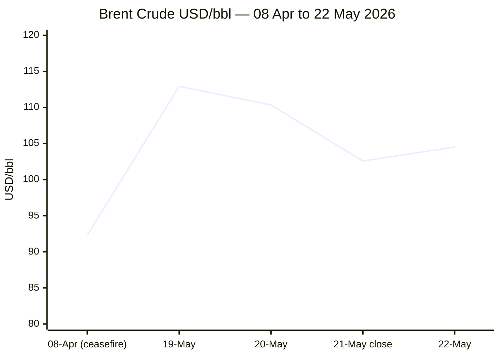
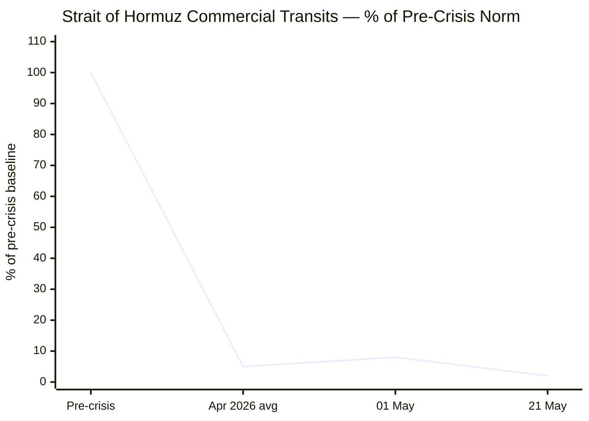

````yaml
---
brief_date: 2026-05-22
version: v1.2.1
run_time: "05:30 CET"
stories_published: 15
categories: [conflict, business, eu_affairs, technology, trends]
alert_counts:
  red: 4
  yellow: 9
  green: 2
ongoing_situations:
  - {name: "Iran-US War / Operation Epic Fury", real_world_start: "2026-02-28", day: 84}
  - {name: "US-Iran Ceasefire (Pakistan-mediated)", real_world_start: "2026-04-08", day: 45}
  - {name: "Israel-Lebanon Ceasefire", real_world_start: "2026-04-16", day: 37}
  - {name: "Russia-Ukraine War", real_world_start: "2022-02-24", day: 1549}
sources_fetched: 11
fetch_status:
  le_monde: "❌"
  faz: "❌"
  kommersant: "❌"
  xinhua: "⚠️"
  european_parliament: "✅"
  fao: "✅"
  imf: "❌"
  ecb: "❌"
  european_commission: "❌"
expansion_queue: []
---
````

# 🌐 MORNING BRIEF
## Friday, 22 May 2026 · 05:30 CET
### 15 stories across 5 categories

---

## DIGEST SUMMARY

| # | Category | Headline | Alert |
|---|----------|----------|-------|
| 1 | ⚔️ Conflict | Iran-US: Rubio "encouraging signs" vs Supreme Leader uranium directive — Brent swings | 🔴 |
| 2 | ⚔️ Conflict | Israel-Lebanon: Day 37 ceasefire — Pentagon security track starts 29 May | 🟡 |
| 3 | ⚔️ Conflict | Ukraine: Record drone campaign; 177 clashes; Zelensky warns Belarus–Bryansk axis | 🟡 |
| 4 | 💼 Business | EU CPI confirmed 3.0% in April (Eurostat, 20 May) — highest since September 2023 | 🔴 |
| 5 | 💼 Business | Brent $104.52/bbl today — volatile; down from $112.93 on 19 May amid Iran deal noise | 🟡 |
| 6 | 💼 Business | Global equity selloff: S&P 500 −1.24%, DAX −2.07%; eurozone Q1 GDP barely +0.1% | 🟡 |
| 7 | 🇪🇺 EU Affairs | Russia accuses Baltics of hostile drone planning — EP Conference of Presidents pushes back | 🔴 |
| 8 | 🇪🇺 EU Affairs | Hungary: Magyar government in end-of-May EC talks to unlock €17B in frozen EU funds | 🟡 |
| 9 | 🇪🇺 EU Affairs | Slovakia: MEPs demand Commission assess Article 7(1) breach risk under Fico | 🟡 |
| 10 | 🇪🇺 EU Affairs | EU-US Trade: Provisional trilogue agreement reached 20 May on tariff implementation | 🟢 |
| 11 | 🤖 Technology | US pre-release AI testing: CAISI signs Google, Microsoft, xAI agreements — policy reversal | 🟡 |
| 12 | 🤖 Technology | Meta Muse Spark: Proprietary LLM departs Llama lineage — AI Index 52, capex $115-135B | 🟢 |
| 13 | 📈 Trends | Hormuz food crisis: FAO index 130.7 (third rise); fertiliser +46%; WFP warns 45M new hungry | 🔴 |
| 14 | 📈 Trends | EU stagflation signal: 3.0% inflation vs 0.1% GDP growth in Q1 — ECB in a bind | 🟡 |
| 15 | 📈 Trends | Pakistan as mediator: structural diplomatic shift rewriting West Asian geopolitics | 🟡 |

> Alert level key: 🔴 High significance · 🟡 Developing · 🟢 Stable/Routine

---

## 🚨 SIGNAL BOARD

🔴 Brent crude hit $104.52/bbl this session — recovering from $102.58 close but down from $112.93 on 19 May, as Rubio "encouraging signs" on Iran clash with Iran Supreme Leader's directive blocking enriched uranium exports.
🔴 EU April CPI confirmed 3.0% (Eurostat, 20 May) — highest since September 2023; energy inflation +10.8%; markets now fully price three ECB hikes by end-2026.
🟡 Strait of Hormuz: only 2 commercial vessels per day (2% of pre-crisis 95/day baseline) on 21 May — effective maritime closure persists through ceasefire Day 45.
🟢 Hungary's Magyar government in end-of-May rule-of-law talks with European Commission targeting release of €17B in frozen EU funds — structural pro-EU pivot under way.
⚡ Russia's SVR accused Latvia of facilitating a Ukrainian drone operation against Russia — EP Conference of Presidents rejected claims as "unfounded and dangerous" in a same-day statement on 21 May.

---

## 🔄 ONGOING SITUATIONS

| Situation | Real-world start | Day # | Last significant development | Status |
|-----------|-----------------|-------|------------------------------|--------|
| Iran-US War / Hormuz Crisis | 28 Feb 2026 | Day 84 | Rubio "encouraging signs"; Iran Supreme Leader blocks uranium exports abroad; Hormuz at 2% of norm | 🟡 Ceasefire fragile |
| US-Iran Ceasefire (Pakistan-mediated) | 08 Apr 2026 | Day 45 | Ceasefire extended; next round of talks pending; US counter-blockade on Iranian ports continues | 🟡 Extended |
| Israel-Lebanon Ceasefire | 16 Apr 2026 | Day 37 | 45-day extension agreed 15 May; Pentagon security track opens 29 May; Hezbollah not party to talks | 🟡 Extended |
| Russia-Ukraine War | 24 Feb 2022 | Day 1,549 | Record drone campaign week of 13–17 May; 177 combat clashes 20–21 May; Pokrovsk axis most contested | 🔴 Active |

---

## ⚔️ CONFLICT ANALYST · 3 updates today

---

### 1. Iran-US War / Hormuz: Rubio signals progress, Iran's Supreme Leader signals constraint 🔴
**Alert:** 🔴
**Summary:** US Secretary of State Marco Rubio declared on 22 May that there were "some encouraging signs" of a potential agreement with Iran, and said Pakistani mediators would travel to Tehran with Washington's latest proposal. However, Reuters reported overnight that Iran's Supreme Leader had issued a directive that the country's near-weapons-grade uranium must not be sent abroad — hardening Tehran's position on what Washington considers a core demand. Brent crude swung violently in response, climbing 3% then retreating 2%+ to close at $104.52. The Strait of Hormuz remained effectively closed, with only 2 vessels transiting on 21 May versus a pre-crisis baseline of 95 per day.
**Significance:** The uranium-stockpile directive signals Iran is using nuclear leverage as negotiating currency rather than conceding on the most consequential US demand, suggesting a framework deal settling Hormuz first and deferring denuclearisation may be Washington's only near-term exit.
**Sources:**
- [Trading Economics — Brent Crude Oil Price, 22 May 2026](https://tradingeconomics.com/commodity/brent-crude-oil) · 22 May 2026
- [House of Commons Library — US-Iran Ceasefire and Nuclear Talks in 2026](https://commonslibrary.parliament.uk/research-briefings/cbp-10637/) · 20 May 2026
**Trend:** ↗ Escalating
**Tags:** #Iran #Hormuz #nuclear #ceasefire #Pakistan-mediation #MULTI-SOURCE #day-84

---

### 2. Israel-Lebanon Ceasefire: Day 37 — Pentagon security track opens 29 May 🟡
**Alert:** 🟡
**Summary:** The 45-day ceasefire extension agreed on 15 May between Israel and Lebanon remains nominally in force, with the US State Department confirming next political talks on 2–3 June and a new Pentagon-hosted military security track opening 29 May. Despite the extension, the Israeli military continued daily strikes on Hezbollah sites in southern Lebanon following reported rocket launches. At least 657 people have been killed in Lebanon since the ceasefire began. Hezbollah remains excluded from the talks. Separately, Israel deported hundreds of Gaza flotilla activists on 21 May, drawing international condemnation.
**Significance:** The Pentagon security track is structurally significant — military-to-military communication channels are prerequisites for any durable ceasefire; Hezbollah's exclusion remains the central obstacle to a lasting settlement.
**Sources:**
- [CNBC — Israel and Lebanon Agree to 45-Day Extension of Ceasefire](https://www.cnbc.com/2026/05/15/israel-lebanon-agree-to-extend-ceasefire-by-45-days-us-state-dept.html) · 15 May 2026
- [PBS NewsHour — Israel and Lebanon agree to 45-day extension; Israeli navy intercepts flotilla](https://www.pbs.org/newshour/world/israel-and-lebanon-agree-to-45-day-extension-of-ceasefire-u-s-state-department-says) · 15–19 May 2026
**Trend:** ↘ De-escalating
**Tags:** #Lebanon #Hezbollah #ceasefire #Israel #humanitarian #day-37 #MULTI-SOURCE

---

### 3. Ukraine: Record drone campaign; 177 clashes on Pokrovsk axis 🟡
**Alert:** 🟡
**Summary:** Russia mounted its biggest prolonged drone attack since the war began on 17 May 2026, following a 800+ drone daytime mass assault on 13 May that killed at least 14 civilians. Ukrainian forces engaged in 177 combat clashes with Russian forces across the front on 20–21 May, with the Pokrovsk axis recording the highest enemy pressure. Russia's total confirmed losses stand at approximately 1,352,980 personnel as of 21 May. President Zelensky warned publicly that Russia was considering Belarus and Bryansk region as staging points for additional attack vectors into Ukraine's north and northeast.
**Significance:** The intensified drone campaign is consistent with Russian doctrine of attrition against Ukrainian energy and logistics infrastructure before any potential political settlement; the Belarus vector signals pressure on Ukraine's extended northern flank.
**Sources:**
- [Ukrinform — Ukraine War Frontline Updates, 21 May 2026](https://www.ukrinform.net/rubric-ato) · 21 May 2026
- [ACLED — Ukraine Conflict Monitor (week of 13–17 May 2026)](https://acleddata.com/monitor/ukraine-conflict-monitor) · 18 May 2026
**Trend:** ↗ Escalating
**Tags:** #Ukraine #Russia #drone-warfare #frontline #missile-strike #day-N #MULTI-SOURCE

📚 *Background reading:* [CSIS — The Strait of Hormuz in 8 Charts](https://www.csis.org/analysis/strait-hormuz-8-charts) · [Al Jazeera — Has the US accepted Iran's Hormuz-first demand?](https://www.aljazeera.com/news/2026/5/6/has-the-us-accepted-irans-demand-to-settle-hormuz-first-nuclear-later)

---

## 💼 BUSINESS ANALYST · 3 updates today

---

### 4. EU CPI 3.0% confirmed — highest since September 2023 🔴
**Alert:** 🔴
**Summary:** Eurostat released full April 2026 HICP data on 20 May, confirming eurozone annual inflation at 3.0%, up from 2.6% in March and 1.9% in February. Energy prices led the acceleration at +10.8% year-on-year — the sharpest energy inflation reading since February 2023 — driven directly by Middle East conflict-related supply constraints. Services inflation held at 3.0%. Markets reacted by fully pricing three ECB rate hikes by end-2026. ECB Governing Council member Martins Kazaks confirmed the ECB would raise rates if rising crude prices embed in inflation expectations.
**Market signal:** Bearish for European growth — stagflationary dynamics are hardening as rising energy costs constrict real disposable incomes while monetary tightening looms.
**Sources:**
- [Eurostat — Euro Area Annual Inflation 3.0% in April 2026 (full data)](https://ec.europa.eu/eurostat/web/products-euro-indicators/w/2-20052026-ap) · 20 May 2026
- [Trading Economics — Euro Area Inflation Rate](https://tradingeconomics.com/euro-area/inflation-cpi) · 22 May 2026
**Trend:** ↗ Escalating
**Tags:** #inflation #ECB #interest-rates #energy-markets #eurozone #data-point #MULTI-SOURCE

---

### 5. Brent crude: $104.52/bbl on Iran deal volatility 🟡
**Alert:** 🟡
**Summary:** Brent crude settled at $104.52/bbl on 22 May, up 1.89% from the prior session's close of approximately $102.58, but down sharply from $112.93 on 19 May. The intraday session saw Brent climb 3% on Rubio's "encouraging signs" remarks before surrendering gains after Iran's Supreme Leader directive blocked enriched uranium exports. Oil prices remain approximately 50% above pre-war levels. The US withdrew nearly 10 million barrels from the Strategic Petroleum Reserve last week — the largest single-week release on record.
**Market signal:** Neutral-to-bearish short term on deal optimism, but structurally bullish as long as Hormuz transits remain at 2% of normal capacity and SPR drawdowns run at record pace.
**Sources:**
- [Trading Economics — Brent Crude Oil](https://tradingeconomics.com/commodity/brent-crude-oil) · 22 May 2026
- [Fortune — Current Price of Oil, 19 May 2026](https://fortune.com/article/price-of-oil-05-19-2026/) · 19 May 2026

📎 See also: Conflict § Story 1 — Iran Supreme Leader blocks uranium exports; Hormuz at 2% of normal.

**Trend:** ⚡ Reversal
**Tags:** #Brent #oil-price #Hormuz #SPR #Iran #energy-markets #MULTI-SOURCE

---

### 6. Global equities sell off; eurozone Q1 GDP barely positive 🟡
**Alert:** 🟡
**Summary:** Global equity markets declined sharply on 22 May. The S&P 500 fell 1.24% to 7,408.50; the Nasdaq Composite dropped 1.54% to 29,125; Germany's DAX was the weakest major index, down 2.07% to 23,951. Rising US Treasury yields (10-year at 4.60%) and mounting ECB rate-hike bets weighed on risk assets. Eurozone Q1 2026 GDP grew just 0.1% quarter-on-quarter, confirmed by Eurostat — the weakest reading in three quarters — as energy costs and weak trade drag on activity. The euro was last confirmed at 1.1626 against the dollar as of 15 May.
**Market signal:** Bearish — the combination of a stagflating eurozone and a re-pricing of ECB policy removes the soft-landing narrative and suggests further equity pressure.
**Sources:**
- [Trading Economics — Euro Area Currency and Markets Data](https://tradingeconomics.com/euro-area/currency) · 22 May 2026
- [Eurostat — Euro Indicators: GDP Q1 2026](https://ec.europa.eu/eurostat/news/euro-indicators) · 22 May 2026
**Trend:** ↗ Escalating
**Tags:** #SP500 #equity-selloff #eurozone #GDP-forecast #ECB #inflation #stagflation

📚 *Background reading:* No relevant Tier 3 source available for this specific combination of indicators.

---

## 🇪🇺 EU AFFAIRS ANALYST · 4 updates today

---

### 7. Russia accuses Baltic states of planning hostile actions — EP rejects claims 🔴
**Alert:** 🔴
**Summary:** Russia's Foreign Intelligence Service (SVR) alleged on 20–21 May that Latvia had allowed Ukraine to use its territory to conduct a drone operation against Russia, and levelled broader accusations against Estonia and Lithuania. The EP's Conference of Presidents issued a statement on 21 May explicitly rejecting these allegations as "unfounded and dangerous," reaffirming that "a threat against one Member State is a threat against our entire Union." European Commission President von der Leyen stated the same day that Russia's public threats were "completely unacceptable."
**Legislative/policy stage:** Political declaration stage — no formal Article 42.7 mechanism triggered; member states and institutions are in coordination mode.
**Sources:**
- [ANI — EP expresses solidarity with Baltic states, 21 May 2026](https://aninews.in/news/world/europe/no-eu-member-state-can-be-threatened-european-parliament-express-solidarity-with-baltic-states-amid-russian-allegations20260521172711/) · 21 May 2026
- [European Parliament — EP Conference of Presidents expresses full solidarity with Baltic states](https://www.europarl.europa.eu/news/en/press-room/20260521IPR43704/ep-conference-of-presidents-expresses-full-solidarity-with-the-baltic-states) · 21 May 2026
**Trend:** ↗ Escalating
**Tags:** #EU-institutions #Russia #Ukraine #EU-defence #disinformation #MULTI-SOURCE #escalation

---

### 8. Hungary: Magyar government targets end-of-May deadline for EU fund talks 🟡
**Alert:** 🟡
**Summary:** Prime Minister-designate Péter Magyar's new Tisza-led government (formally constituted 9 May 2026) is in active talks with the European Commission on rule-of-law reforms to unlock approximately €17 billion in frozen EU funds — the largest bundle of suspended EU assistance to any member state. Magyar stated that key reforms could be enacted "by end of May," which would allow disbursements under both the Recovery and Resilience Facility (deadline: end of August) and cohesion funds. The Atlantic Council and European institutions are tracking Budapest's return to constructive EU engagement as structurally significant for EU cohesion and Ukraine support.
**Legislative/policy stage:** Negotiations active; Commission assessment of reforms pending; RRF disbursement deadline end of August 2026.
**Sources:**
- [House of Commons Library — Hungary: Developments under Orbán and the 2026 election](https://commonslibrary.parliament.uk/research-briefings/cbp-10612/) · 20 May 2026
- [Al Jazeera — Peter Magyar wins Hungary election, unseating Viktor Orbán](https://www.aljazeera.com/news/2026/4/12/hungary-election-early-results-show-magyars-tisza-ahead-of-orbans-fidesz) · 12 April 2026
**Trend:** ↘ De-escalating
**Tags:** #Hungary #Magyar #EU-funds #rule-of-law #EU-institutions #EU-enlargement #de-escalation

---

### 9. Slovakia: MEPs demand Article 7(1) risk assessment of Fico government 🟡
**Alert:** 🟡
**Summary:** The European Parliament's CONT and LIBE committees adopted a joint text on 21 May calling on the European Commission to assess whether Slovakia's Fico government poses "a clear risk of serious breach" of EU founding values under Article 7(1) TEU. The motion cited concerns about judicial independence, media freedom, and suspected diversion of EU cohesion funds. Slovakia has aligned with Russia on several fronts including blocking military aid to Ukraine, visiting Moscow for Victory Day celebrations (Fico), and the ongoing Slovak-Ukrainian oil dispute.
**Legislative/policy stage:** Article 7(1) assessment requested; Commission has discretion to initiate; plenary vote required before any formal hearing.
**Sources:**
- [European Parliament — Slovakia: MEPs demand action to protect EU values and the EU budget](https://www.europarl.europa.eu/news/en/press-room/20260513IPR43308/slovakia-meps-demand-action-to-protect-eu-values-and-the-eu-budget) · 21 May 2026
**Trend:** ↗ Escalating
**Tags:** #EU-institutions #rule-of-law #EU-funds #sanctions #single-market

---

### 10. EU-US Trade: Provisional trilogue agreement on tariff implementation legislation 🟢
**Alert:** 🟢
**Summary:** The European Parliament and Council reached a provisional agreement on 20 May 2026 on two pieces of legislation implementing EU tariff commitments under the August 2025 EU-US Joint Statement. The INTA Committee Chair described the talks as a stabilisation of the transatlantic trade relationship following an extended period of tariff tension. The agreement does not constitute a comprehensive free-trade deal but codifies specific mutual tariff reductions agreed at the presidential level last year.
**Legislative/policy stage:** Provisional trilogue agreement reached 20 May 2026; awaiting formal adoption by Parliament plenary and Council.
**Sources:**
- [European Parliament — Agreement reached to put EU-US trade on a more stable footing](https://www.europarl.europa.eu/news/en/press-room/20260518IPR43407/agreement-reached-to-put-eu-us-trade-on-a-more-stable-footing) · 20 May 2026
**Trend:** ↘ De-escalating
**Tags:** #EU-institutions #single-market #sanctions #MULTI-SOURCE

📚 *Background reading:* [Atlantic Council — Hungary just voted out Viktor Orbán. Here's what to expect.](https://www.atlanticcouncil.org/dispatches/hungary-just-voted-out-viktor-orban-heres-what-to-expect-in-europe-and-beyond/)

---

## 🤖 TECHNOLOGY ANALYST · 2 updates today

---

### 11. US mandates pre-release AI model evaluations — first mandatory government testing 🟡
**Alert:** 🟡
**Summary:** The US Department of Commerce's Center for AI Standards and Innovation (CAISI) announced agreements with Google DeepMind, Microsoft, and Elon Musk's xAI on 5 May 2026 for mandatory pre-public-release evaluations of frontier AI models, alongside renegotiated agreements with OpenAI and Anthropic. The move is a sharp departure from the Trump administration's previous light-touch approach and was triggered by Anthropic's April 2026 disclosure that Claude Mythos Preview could autonomously exploit vulnerabilities in major operating systems. The Pentagon is separately expanding drone programme contracting with Shield AI amid wartime demand.
**Analyst note:** Over a 12–24 month horizon, mandatory pre-release evaluations will consolidate market power among the major labs capable of compliance and could slow open-source frontier development — creating a structural barrier to entry for smaller AI developers.
**Sources:**
- [CNBC — Trump admin moves further into AI oversight, will test Google, Microsoft and xAI models](https://www.cnbc.com/2026/05/05/ai-oversight-trump-google-microsoft-xai.html) · 5 May 2026
- [DeepLearning.AI — US to evaluate upcoming models](https://charonhub.deeplearning.ai/us-to-evaluate-upcoming-models/) · 14 May 2026
**Trend:** ↗ Escalating
**Tags:** #AI-regulation #AI-safety #AI #LLM #semiconductor #MULTI-SOURCE

---

### 12. Meta Muse Spark: Proprietary model marks strategic retreat from open source 🟢
**Alert:** 🟢
**Summary:** Meta's Superintelligence Labs launched Muse Spark in early April 2026 — the company's first proprietary large language model under Chief AI Officer Alexandr Wang — scoring 52 on the Artificial Analysis Intelligence Index v4.0. This positions it behind GPT-5.4 (57) and Gemini 3.1 Pro Preview (57) but close to Claude Opus 4.6 (53). The proprietary launch marks a substantive departure from Meta's Llama open-source strategy, which reached 1.2 billion downloads. Meta simultaneously announced AI capital expenditure of $115–135 billion for 2026, nearly double last year's spending.
**Analyst note:** The proprietary pivot, combined with Meta's hyperscaler capex and the Broadcom custom-chip partnership, signals that within 12–24 months competitive frontier AI will increasingly require proprietary infrastructure inaccessible to independent open-source developers.
**Sources:**
- [VentureBeat — Goodbye, Llama? Meta launches new proprietary AI model Muse Spark](https://venturebeat.com/technology/goodbye-llama-meta-launches-new-proprietary-ai-model-muse-spark-first-since) · 8 April 2026
- [CNBC — Meta debuts first major AI model since Alexandr Wang deal](https://www.cnbc.com/2026/04/08/meta-debuts-first-major-ai-model-since-14-billion-deal-to-bring-in-alexandr-wang.html) · 8 April 2026
**Trend:** ⚡ Reversal
**Tags:** #AI #LLM #AI-benchmark #open-source-AI #data-centre #MULTI-SOURCE

---

## 📈 TRENDS ANALYST · 3 updates today

---

### 13. Hormuz food security crisis deepens — FAO index rises for third consecutive month 🔴
**Alert:** 🔴
**Summary:** The FAO Food Price Index averaged 130.7 points in April 2026, up 1.6% from March — its third consecutive monthly increase — driven by vegetable oils (+5.9%), meat (record high) and cereals (+0.8%), as the effective closure of the Strait of Hormuz continues to drive up energy and fertiliser costs globally. Urea and phosphate prices surged approximately 46% between February and March as Hormuz disruptions severed fertiliser supply lines. The World Food Programme estimates that 45 million additional people could be pushed into acute hunger by mid-2026. FAO Chief Economist Máximo Torero warned that a prolonged disruption could "turn into a global agrifood catastrophe."
**Horizon:** Long-term structural signal. Fertiliser price spikes embedded now will suppress yields in 2026–27 harvests worldwide, extending food price pressure 12–18 months beyond any ceasefire.
**Sources:**
- [FAO — Food Price Index up for third consecutive month (April 2026, released 8 May)](https://www.fao.org/newsroom/detail/fao-food-price-index-up-for-third-consecutive-month-largely-on-rising-vegetable-oil-prices/en) · 8 May 2026
- [Food Ingredients First — FAO Food Price Index April 2026](https://www.foodingredientsfirst.com/news/fao-food-price-index-april-2026-vegetable-oil-meat-cereals.html) · 13 May 2026
**Trend:** ↗ Escalating
**Tags:** #food-security #food-prices #Hormuz #shipping #supply-shock #humanitarian #MULTI-SOURCE

---

### 14. EU stagflation signal: 3.0% inflation against 0.1% GDP growth 🟡
**Alert:** 🟡
**Summary:** The simultaneous release this week of eurozone Q1 2026 GDP (+0.1% quarter-on-quarter, Eurostat) and April CPI (+3.0% year-on-year, Eurostat 20 May) signals conditions resembling stagflation — weak growth alongside accelerating prices. The energy component of EU inflation rose 10.8% year-on-year, the sharpest since February 2023. Markets now fully price three ECB rate hikes by end-2026, but with growth near zero, tightening risks tipping the eurozone into recession. The eurozone Purchasing Managers' construction index posted its steepest downturn since 2024. Producer prices rose the most since 2022 in April.
**Horizon:** Medium-term. The ECB faces a 6–12 month policy window in which tightening to contain inflation risks causing a demand collapse; the outcome hinges on whether Hormuz opens before energy costs are embedded in wage rounds.
**Sources:**
- [Trading Economics — Euro Area: GDP, CPI, Interest Rate](https://tradingeconomics.com/euro-area/currency) · 22 May 2026
- [Eurostat — Euro Indicators: Inflation in the euro area](https://ec.europa.eu/eurostat/statistics-explained/index.php?title=Inflation_in_the_euro_area) · 20 May 2026
**Trend:** ↗ Escalating
**Tags:** #inflation #stagflation #eurozone #ECB #GDP-forecast #interest-rates #data-point

---

### 15. Pakistan as mediator: structural shift in West Asian diplomatic architecture 🟡
**Alert:** 🟡
**Summary:** Pakistan's role as the sole trusted intermediary between the United States and Iran represents a structural departure from the post-Cold War diplomatic architecture in which Western-aligned institutions (UN, E3, Oman) held mediation primacy. Pakistan arranged the 8 April ceasefire, hosted the Islamabad Talks on 11–12 April, has ferried proposals between Tehran and Washington through May, and continues to be named by both Trump and Iranian officials as the preferred channel. Neither China nor Russia — both of which vetoed the UN Hormuz resolution — holds the same bilateral trust with Washington.
**Horizon:** Long-term. Pakistan's emergence as indispensable intermediary — if it succeeds — sets a precedent for non-Western actors in future regional conflict mediation, reshaping the authority of established multilateral frameworks.
**Sources:**
- [House of Commons Library — US-Iran Ceasefire and Nuclear Talks in 2026](https://commonslibrary.parliament.uk/research-briefings/cbp-10637/) · 20 May 2026
- [Wikipedia — 2026 Iran War Ceasefire](https://en.wikipedia.org/wiki/2026_Iran_war_ceasefire) · Current
**Trend:** → Stable
**Tags:** #Pakistan-mediation #Iran #peace-talks #diplomacy #mediation #ceasefire #MULTI-SOURCE

📚 *Background reading:* [CFR — The Iran War's Forgotten Front: Global Food Insecurity](https://www.cfr.org/articles/the-iran-wars-forgotten-front-global-food-insecurity-and-the-limits-of-u-s-aid) · [CSIS — Strait of Hormuz in 8 Charts](https://www.csis.org/analysis/strait-hormuz-8-charts)

---

## 📊 KEY DATA OF THE DAY

> 📊 **DATA OFFICER** · 7 indicators

| Indicator | Value | Δ vs prior session | Δ vs 7 days ago | Note | Source | URL |
|-----------|-------|-------------------|-----------------|------|--------|-----|
| EUR/USD | 1.1626 | N/A | N/A | Last tool-confirmed close: 15 May; down 1.32% over past month; +4.11% year-on-year | ECB/Trading Economics | [link](https://tradingeconomics.com/euro-area/currency) |
| Brent Crude (USD/bbl) | $104.52 | +1.89% | N/A | Down from $112.93 on 19 May; ~50% above pre-war level; volatile on Iran deal signals | EIA/Trading Economics | [link](https://tradingeconomics.com/commodity/brent-crude-oil) |
| Gold (XAU/USD) | $4,524 | −0.42% | N/A | Above $4,500 safe-haven floor; record was $5,602.22 on 28 Jan 2026; Iran deal signals reducing haven demand | LBMA/Trading Economics | [link](https://tradingeconomics.com/commodity/gold) |
| IMF Global Growth 2026 | 3.1% | −0.2 pp vs Jan WEO | −0.2 pp vs Oct WEO | "Global Economy in the Shadow of War"; adverse scenario could reach 2.0% | IMF WEO April 2026 | [link](https://www.imf.org/en/publications/weo/issues/2026/04/14/world-economic-outlook-april-2026) |
| EU CPI YoY (Apr 2026) | 3.0% | +0.4 pp vs Mar 2026 | +1.3 pp vs Jan 2026 | Highest since Sep 2023; energy +10.8%; full data released 20 May 2026 | Eurostat | [link](https://ec.europa.eu/eurostat/web/products-euro-indicators/w/2-20052026-ap) |
| FAO Food Price Index | 130.7 pts | +1.6% vs Mar 2026 | April 2026 — latest available | Third consecutive monthly rise; vegetable oils +5.9%; meat at record high | FAO | [link](https://www.fao.org/newsroom/detail/fao-food-price-index-up-for-third-consecutive-month-largely-on-rising-vegetable-oil-prices/en) |
| Hormuz daily transits (% of norm) | ~2% | N/A | N/A | 2 vessels vs pre-crisis baseline of 95/day; war-risk insurance 8× pre-crisis; ceasefire Day 45 | IMF PortWatch/straits.live | [link](https://polymarket.com/event/strait-of-hormuz-traffic-returns-to-normal-by-end-of-may) |

**Data commentary:** The pairing of EU inflation at 3.0% with eurozone GDP growth of just 0.1% in Q1 is the defining macro signal of the week — energy transmitted through Hormuz is now actively compressing real incomes while forcing the ECB's hand. Gold hovering above $4,500 and Brent's violent intraday swings on contradictory Iran signals reflect the market's inability to price a resolution timeline. The FAO index rising for a third consecutive month, driven by fertiliser-cost pass-through, means the food security overhang will persist 12–18 months beyond any ceasefire.

---

## 📊 CHARTS

**Chart 1 — Brent Crude (USD/bbl): 8 April to 22 May 2026**



*Sources: newsonair.gov.in (08 Apr), Fortune (19–20 May), Trading Economics (21–22 May). Ceasefire announcement (8 Apr) caused the initial 15.9% drop; subsequent Strait stalemate and US counter-blockade (13 Apr) drove prices back above $110 by mid-May.*

---

**Chart 2 — Strait of Hormuz: Daily Commercial Transits as % of Pre-Crisis Norm (95 ships/day)**



*Sources: Carraglobe (April average ~5%), USNI News (01 May: <10%), straits.live / IMF PortWatch (21 May: 2 vessels of 95/day). Despite ceasefire, effective closure has deepened in May.*

---

## ⚙️ AGENT METADATA

| Field | Value |
|-------|-------|
| Agent version | MORNING BRIEF v1.2.1 |
| Run timestamp | 2026-05-22T05:30:19+02:00 |
| Fetch status | Le Monde ❌ · FAZ ❌ · Kommersant ❌ · Xinhua ⚠️ (content dated 24 Apr, outside 24h window) · EP ✅ · FAO ✅ (direct fetch returned Feb data; April data retrieved via search fallback) · IMF ❌ (search fallback ✅) · ECB ❌ (search fallback ✅ via TE) · European Commission ❌ (search fallback ✅ via EP) |
| Sources queried | 11 / 11 |
| Stories surfaced | ~25 (before editorial filter) |
| Stories published | 15 |
| Languages processed | EN, DE (FAZ attempted), FR (Le Monde attempted) |
| Output language | English (British) |
| Date validated | ✅ Confirmed 22 May 2026 |
| Expansion Queue | None — all tags drawn from closed list |

---

*MORNING BRIEF is an AI-assisted digest. All summaries are paraphrased from original sources. Verify time-sensitive information at the linked URLs before acting. Output language: British English.*
