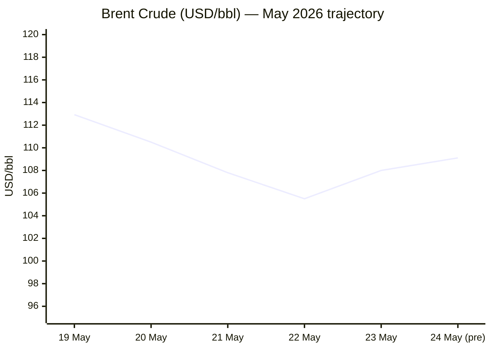
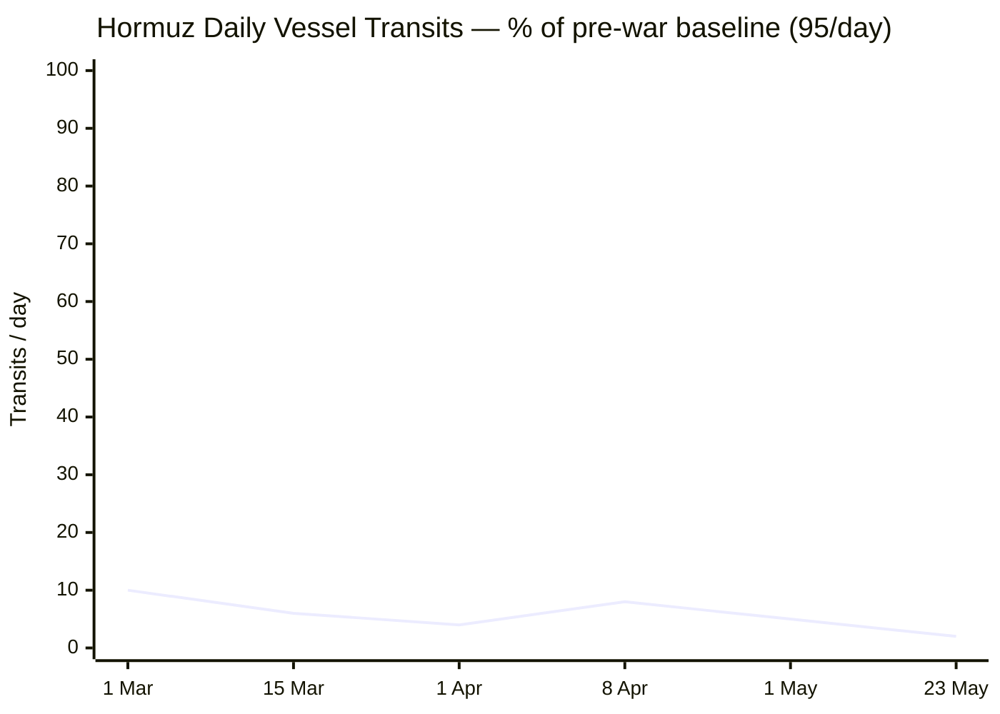
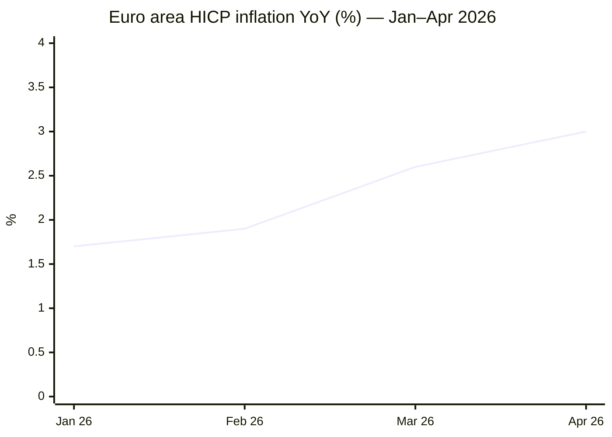

```yaml
---
brief_date: 2026-05-24
version: v1.2.1
run_time: "05:30 CET"
stories_published: 14
categories: [conflict, business, eu_affairs, technology, trends]
alert_counts:
  red: 4
  yellow: 8
  green: 2
ongoing_situations:
  - {name: "2026 Iran-US War", real_world_start: "2026-02-28", day: 86}
  - {name: "Iran-US Ceasefire / Hormuz Crisis", real_world_start: "2026-04-08", day: 47}
  - {name: "Lebanon-Israel War", real_world_start: "2026-02-28", day: 86}
  - {name: "Lebanon Ceasefire", real_world_start: "2026-04-16", day: 39}
  - {name: "Russia-Ukraine War", real_world_start: "2022-02-24", day: 1551}
sources_fetched: 11
fetch_status:
  le_monde: "❌"
  faz: "❌"
  kommersant: "❌"
  xinhua: "⚠️"
  european_parliament: "✅"
expansion_queue: []
---
```

# 🌐 MORNING BRIEF
## Sunday, 24 May 2026 · 05:30 CET
### 14 stories across 5 categories

---

## DIGEST SUMMARY

| # | Category | Headline | Alert |
|---|----------|----------|-------|
| 1 | ⚔️ Conflict | Iran-US deal "largely negotiated" — Hormuz MoU under finalisation | 🔴 |
| 2 | ⚔️ Conflict | Ukraine: Russia nets -29 sq mi in a week as Kyiv gains momentum | 🟡 |
| 3 | ⚔️ Conflict | Lebanon: 45-day ceasefire holds amid continued Israeli strikes | 🟡 |
| 4 | 💼 Business | Eurozone stagflation trap deepens — PMI in sharpest contraction since late 2023 | 🔴 |
| 5 | 💼 Business | EU Commission Spring Forecast cuts eurozone growth to 0.9%, lifts inflation to 3% | 🟡 |
| 6 | 💼 Business | ECB June rate hike increasingly priced as inflation nears 4% trajectory | 🟡 |
| 7 | 🇪🇺 EU Affairs | EP approves landmark FDI screening regulation — 508 to 64 | 🟢 |
| 8 | 🇪🇺 EU Affairs | EU–US tariff accord: industrial goods liberalised, Council awaits formal ratification | 🟢 |
| 9 | 🇪🇺 EU Affairs | Von der Leyen: "second energy shock in five years" frames Commission's austerity-lite agenda | 🟡 |
| 10 | 🤖 Technology | OpenAI files confidential S-1 for IPO — $852B valuation, September debut targeted | 🟡 |
| 11 | 🤖 Technology | SpaceX-xAI public S-1 reveals $18.67B in 2025 revenue — dual trillion-dollar listings imminent | 🟡 |
| 12 | 🤖 Technology | EU Parliament delays high-risk AI rules to December 2027 | 🟢 |
| 13 | 📈 Trends | FAO Food Price Index hits 130.7 in April — third consecutive monthly rise, Hormuz driving fertiliser costs | 🟡 |
| 14 | 📈 Trends | Eurozone consumer confidence at 40-month low: energy shock reshaping household demand | 🔴 |

> Alert Level key: 🔴 High significance · 🟡 Developing · 🟢 Stable/Routine

---

## 🚨 SIGNAL BOARD

🔴 **Trump declares Iran deal "largely negotiated" — a Hormuz MoU as first phase could be the most consequential diplomatic move of the conflict**
🔴 **Eurozone composite PMI deepens into contraction at fastest pace since late 2023; S&P Global warns headline inflation heading toward 4%**
🟡 **Ukraine gains net 29 sq mi in a single week — ISW data shows the most significant Ukrainian territorial recovery in months**
🟡 **OpenAI and SpaceX each filed IPO paperwork within 48 hours — two potential trillion-dollar listings are entering public scrutiny simultaneously**
⚡ **Brent crude at $109/bbl despite Trump's deal optimism — divergence between diplomatic signals and physical supply reality persists**

---

## 🔄 ONGOING SITUATIONS

| Situation | Real-world start | Day # | Last significant development | Status |
|-----------|-----------------|-------|------------------------------|--------|
| 2026 Iran-US War | 28 Feb 2026 | Day 86 | Trump: deal "largely negotiated"; Iran MoU under discussion | 🔴 Ceasefire/Talks |
| Iran-US Ceasefire | 08 Apr 2026 | Day 47 | Hormuz transits: 2 vessels (23 May) vs. 95/day baseline | 🟡 Fragile |
| Lebanon-Israel War | 28 Feb 2026 | Day 86 | 45-day ceasefire extension; Pentagon security track from 29 May | 🟡 Ceasefire |
| Lebanon Ceasefire | 16 Apr 2026 | Day 39 | Hezbollah not party to talks; 657+ killed since truce began | 🟡 Fragile |
| Russia-Ukraine War | 24 Feb 2022 | Day 1,551 | Russia lost net 69 sq mi Apr 21–May 19; Kyiv reveals "Behemoth" drone | 🔴 Active |

---

## ⚔️ CONFLICT ANALYST

> 🔎 **CONFLICT ANALYST** · 3 updates today

### 1. Iran-US Deal "Largely Negotiated" — Hormuz MoU on Table 🔴
**Alert:** 🔴
**Summary:** President Trump declared on Saturday that an agreement with Iran to reopen the Strait of Hormuz is "largely negotiated" and will be announced shortly, describing it as a memorandum of understanding as a first phase before broader talks within 30 to 60 days. Pakistani and Qatari mediators held sessions with Iranian counterparts on Thursday and Friday, remaining in contact with US envoy Steve Witkoff. Iran's top negotiator simultaneously expressed distrust of Washington and stated Tehran would not compromise its "legitimate rights." Iran's Supreme Leader has separately ordered that enriched uranium reserves must not leave Iranian soil — directly blocking a core US demand. The Strait remains at approximately 2% of pre-war transit volume.
**Significance:** The divergence between Trump's optimistic framing and Iran's hardened nuclear position on uranium stockpiles is the central risk. A MoU that reopens Hormuz without resolving the nuclear file would remove Washington's primary leverage in subsequent talks.
**Sources:**
- [CNBC — Trump says Iran deal reopening Strait of Hormuz 'largely negotiated,' will be announced soon](https://www.cnbc.com/2026/05/23/us-iran-war-talks.html) · 23 May 2026
- [Bloomberg — Iran-US Peace Deal: Why Hormuz and Nuclear Enrichment Are Key Sticking Points](https://www.bloomberg.com/news/articles/2026-05-22/iran-us-peace-deal-why-hormuz-and-nuclear-enrichment-are-key-sticking-points) · 22 May 2026
- [Straits.live — Strait of Hormuz Update: 2 vessels transited 23 May vs. 95/day baseline](https://straits.live/) · 23 May 2026
**Trend:** ↘ De-escalating
**Tags:** #Iran #Hormuz #nuclear #peace-talks #Pakistan-mediation #MULTI-SOURCE

---

### 2. Ukraine: Russia Nets -29 sq mi in Single Week as Kyiv Gains Ground 🟡
**Alert:** 🟡
**Summary:** ISW data for the week of 12–19 May shows Russian forces lost a net 29 square miles of Ukrainian territory, the largest single-week reversal of the conflict's 2026 phase. Over the period 21 April–19 May, Russia lost a cumulative 69 square miles. Ukrainian forces also unveiled the "Behemoth" strike drone — capable of carrying a 75 kg warhead to targets 300 km away. Separately, Kyiv reported Russia has launched over 13,000 chemical weapons attacks since 2022. Russia retains approximately 20% of Ukraine's territory, including Crimea and parts of Donbas, but the operational trend in May has reversed in Ukraine's favour.
**Significance:** The pace of Ukrainian territorial recovery, if sustained, marks a structural shift from the attritional stalemate that defined Q1 2026 and complicates any ceasefire framework that locks in current lines of control.
**Sources:**
- [Russia Matters — Russia-Ukraine War Report Card, 20 May 2026](https://www.russiamatters.org/news/russia-ukraine-war-report-card/russia-ukraine-war-report-card-may-20-2026) · 20 May 2026
- [UNITED24 Media — Ukraine Reveals "Behemoth" Strike Drone](https://united24media.com/war-in-ukraine) · 22 May 2026
**Trend:** ↘ De-escalating
**Tags:** #Ukraine #Russia #frontline #drone-warfare #day-1551 #MULTI-SOURCE

---

### 3. Lebanon: 45-Day Ceasefire Extension Holds Despite Continued Strikes 🟡
**Alert:** 🟡
**Summary:** The US State Department announced on 15 May that Israel and Lebanon had agreed to a 45-day extension of their ceasefire, effective from 16 April, following two days of "highly productive" talks in Washington. A Pentagon military-to-military security track launches on 29 May, with a fourth round of political negotiations set for 2–3 June at the State Department. Despite the formal truce, Israel has carried out strikes that have killed at least 657 people in Lebanon since the ceasefire took effect. Hezbollah, excluded from the talks, has publicly stated it will not be bound by any agreement reached between the Lebanese government and Israel. Hezbollah disarmament remains the central unresolved issue.
**Significance:** The exclusion of Hezbollah from a US-brokered process that aims to address Hezbollah's disarmament creates a structural vulnerability in any agreement, mirroring the fundamental problem of the 2024 ceasefire framework.
**Sources:**
- [The National — Israel-Lebanon ceasefire extended by 45 days but deadly strikes continue](https://www.thenationalnews.com/news/us/2026/05/15/israel-lebanon-ceasefire-extended-by-45-days/) · 15 May 2026
- [PBS NewsHour — Israel and Lebanon agree to 45-day extension of ceasefire](https://www.pbs.org/newshour/world/israel-and-lebanon-agree-to-45-day-extension-of-ceasefire-u-s-state-department-says) · 15 May 2026
**Trend:** → Stable
**Tags:** #Lebanon #Hezbollah #ceasefire #peace-talks #Israel #humanitarian #MULTI-SOURCE

📚 *Background reading:* [IISS — Lebanon Security Assessment 2026](https://www.iiss.org) · [Kyiv Independent — Ukraine frontline weekly digest](https://kyivindependent.com)

---

## 💼 BUSINESS ANALYST

> 💼 **BUSINESS ANALYST** · 3 updates today

### 4. Eurozone Stagflation Trap: PMI Hits Sharpest Contraction Since Late 2023 🔴
**Alert:** 🔴
**Summary:** S&P Global's flash composite PMI for May fell further below the 50-point threshold, signalling the fastest contraction in private-sector activity since late 2023. Services — the eurozone's principal growth engine — led the decline, with France recording one of its weakest readings in more than five years. Input price inflation rose at its steepest pace in three and a half years, driven by energy costs linked to the Hormuz closure. S&P Global explicitly warned that the data points to headline inflation approaching 4% in coming months, up from 3% in April. The eurozone economy simultaneously faces weakening demand and accelerating prices — a textbook stagflation configuration.
**Market signal:** Bearish — the combination of weakening output and accelerating cost pressures constrains both fiscal and monetary policy responses, compressing corporate margins and consumer purchasing power simultaneously.
**Sources:**
- [The Private Banker — Eurozone's Energy Trap: PMI Collapse Signals Deepening Stagflation](https://leprivatebanker.com/2026/05/22/eurozones-energy-trap-pmi-collapse-signals-deepening-stagflation-as-ecb-faces-rate-hike-dilemma/) · 22 May 2026
- [ING Think — Rising inflation signals June rate hike in the eurozone](https://think.ing.com/articles/eurozone-rising-inflation-signals-june-rate-hike/) · 19 May 2026
**Trend:** ↗ Escalating
**Tags:** #stagflation #eurozone #inflation #energy-markets #Hormuz #MULTI-SOURCE

---

### 5. EU Commission Spring Forecast: Eurozone Growth Cut to 0.9%, Inflation to 3% 🟡
**Alert:** 🟡
**Summary:** The European Commission's Spring 2026 Economic Forecast, published on 21 May, downgraded eurozone GDP growth to 0.9% for 2026 (from 1.2% in the autumn) and raised the EU-wide inflation projection to 3.1% — a full percentage point above the previous forecast. Germany's growth was slashed to 0.6%, France to 0.8%, Italy to 0.5%. Spain remains the relative outperformer at 2.4%. Consumer confidence has fallen to a 40-month low. The Commission characterised the current crisis as the second major energy shock to hit the EU in less than five years, drawing an explicit parallel with the 2022 Russian gas cut.
**Market signal:** Neutral to bearish — the forecast cements the growth-inflation trade-off; European assets face persistent multiple compression unless energy prices correct materially before Q3.
**Sources:**
- [European Commission — Spring 2026 Economic Forecast](https://commission.europa.eu/news-and-media/news/eu-economy-forecast-slow-down-amid-rising-inflation-following-energy-shock-2026-05-21_en) · 21 May 2026
**Trend:** ↗ Escalating
**Tags:** #GDP-forecast #inflation #eurozone #ECB #energy-markets #IMF

> 📎 See also: EU Affairs § Story 9 — Von der Leyen's Commission sets political agenda for responding to growth downgrade

---

### 6. ECB June Rate Hike Increasingly Priced as Inflation Trajectory Steepens 🟡
**Alert:** 🟡
**Summary:** A Bloomberg survey of economists conducted 4–7 May finds consensus around two ECB rate hikes in 2026 — quarter-point moves in June and September — bringing the deposit rate from 2.0% to 2.5% by year-end. The ECB's 28–29 May meeting is not expected to move but will be closely watched for forward guidance. Markets are now pricing greater than 50% probability of a June hike following May's PMI shock and the Commission's upward inflation revision. ECB board member Olli Rehn has signalled readiness to act to preserve credibility. The Fed faces a parallel dilemma: markets are pricing approximately 55% probability of at least one 25 bp hike by October.
**Market signal:** Bearish for rate-sensitive assets — a June ECB hike would further tighten financing conditions at precisely the moment eurozone growth is stalling, with government deficit-to-GDP ratios projected to widen to 3.6% by 2027.
**Sources:**
- [Bloomberg — ECB to Hike Rates Twice in 2026 as Inflation Jumps, Survey Shows](https://www.bloomberg.com/news/articles/2026-05-11/ecb-to-hike-rates-twice-in-2026-as-inflation-jumps-survey-shows) · 11 May 2026
- [Trading Economics — Gold: Fed rate hike probability noted](https://tradingeconomics.com/commodity/gold) · 22 May 2026
**Trend:** ↗ Escalating
**Tags:** #ECB #interest-rates #inflation #Fed #eurozone #stagflation

📚 *Background reading:* [Bruegel — Eurozone Energy Shock and Monetary Policy Trade-offs](https://www.bruegel.org) · [RAND — Economic Consequences of Prolonged Hormuz Disruption](https://www.rand.org)

---

## 🇪🇺 EU AFFAIRS ANALYST

> 🇪🇺 **EU AFFAIRS ANALYST** · 3 updates today

### 7. EP Approves Landmark FDI Screening Regulation — 508 to 64 🟢
**Alert:** 🟢
**Summary:** The European Parliament voted on 19 May to approve the revised foreign direct investment screening regulation by 508 votes to 64, with 90 abstentions. The legislation mandates that all EU member states screen investments in sensitive sectors including defence, semiconductors, artificial intelligence, critical raw materials, dual-use goods, and financial services. It also extends screening to intra-EU transactions where the ultimate investor is from a third country — closing a significant loophole. The regulation now awaits formal Council approval before entering into force; member states will have 18 months to implement, with new rules applying from 2027.
**Legislative/policy stage:** EP first reading approved; awaiting Council formal endorsement. Implementation deadline: 18 months after entry into force (approximately H2 2027).
**Sources:**
- [Reuters — European Parliament approves new EU foreign investment rules](https://www.globalbankingandfinance.com/european-parliament-approves-new-eu-foreign-investment-rules/) · 19 May 2026
- [Agence Europe — EP votes in favour of FDI screening regulation, 508 to 64](https://agenceurope.eu/en/bulletin/article/13870/19/european-parliament-votes-in-favour-of-new-mechanism-for-screening-foreign-investment) · 20 May 2026
**Trend:** → Stable
**Tags:** #EU-institutions #EU-defence #semiconductor #AI-regulation #single-market #MULTI-SOURCE

---

### 8. EU–US Tariff Accord: Industrial Goods Liberalised, Agricultural Access Granted 🟢
**Alert:** 🟢
**Summary:** The Council of the EU and the European Parliament have agreed to eliminate tariffs on all US industrial goods and grant preferential market access for certain US agricultural and seafood products. The accord marks a significant shift in transatlantic trade relations and appears aimed at preserving the EU-US alignment on Iran and Ukraine. Details on implementation timelines and safeguard clauses remain to be confirmed. Trump had threatened Britain — and by extension EU partners — with "big tariffs" over tech levies as recently as late April.
**Legislative/policy stage:** Political agreement reached; implementing regulations to be finalised. Timeline for formal entry into force not yet confirmed.
**Sources:**
- [European Union news portal — Council and Parliament agree to eliminate tariffs on US industrial goods](https://european-union.europa.eu/news-and-events_en) · 21 May 2026
**Trend:** ↘ De-escalating
**Tags:** #EU-institutions #single-market #sanctions #diplomacy

---

### 9. Von der Leyen Frames "Second Energy Shock in Five Years" as Europe's Structural Test 🟡
**Alert:** 🟡
**Summary:** European Commission President Ursula von der Leyen framed the Middle East conflict's energy impact as structurally comparable to the 2022 Russian gas crisis, while calling for the completion of the European single market as the primary policy response — cutting red tape, boosting the digital transition, and strengthening social inclusion. The Commission's Spring 2026 Forecast explicitly estimates that government measures to cushion high energy prices for households and firms will cost member states approximately €14.5 billion. Combined with defence spending increases and subdued growth, EU general government deficit ratios are projected to rise to 3.6% of GDP by 2027.
**Legislative/policy stage:** Spring 2026 Economic Forecast published 21 May; Autumn 2026 update due November 2026. No new legislative proposals announced; MFF renegotiation implications to be discussed at European Council.
**Sources:**
- [European Commission — Spring 2026 Economic Forecast](https://economy-finance.ec.europa.eu/economic-forecast-and-surveys/economic-forecasts/spring-2026-economic-forecast-slowdown-growth-energy-shock-drives-inflation_en) · 21 May 2026
- [EU Perspectives — 3% inflation, slower GDP growth: Commission predicts energy shock fallout](https://euperspectives.eu/2026/05/3-inflation-slower-gdp-growth-european-commission-predicts-energy-shock-fallout/) · 22 May 2026
**Trend:** ↗ Escalating
**Tags:** #EU-institutions #eurozone #energy-policy #EU-defence #MFF #inflation #MULTI-SOURCE

📚 *Background reading:* [Bruegel — Europe's Second Energy Shock: Policy Options](https://www.bruegel.org) · [ECFR — EU Strategic Autonomy and the Iran Crisis](https://ecfr.eu/)

---

## 🤖 TECHNOLOGY ANALYST

> 🤖 **TECHNOLOGY ANALYST** · 3 updates today

### 10. OpenAI Files Confidential S-1 for IPO — September Debut at up to $1 Trillion Targeted 🟡
**Alert:** 🟡
**Summary:** OpenAI filed its confidential S-1 IPO prospectus with the US Securities and Exchange Commission on 22 May 2026, with Goldman Sachs and Morgan Stanley leading the deal. The company — currently privately valued at $852 billion following its most recent funding round — is targeting a public debut as early as September 2026, which analysts expect could push its market capitalisation above $1 trillion. The filing arrives as OpenAI is losing $1.22 for every $1 of revenue (Q1 2026). The CFO has indicated the company projects $280 billion in revenue by 2030 against approximately $20 billion annualised today. The S-1 remains sealed until approximately 15 days before the roadshow.
**Analyst note:** Over the 12–24 month horizon, the IPO transition will force monetisation decisions — including potential advertising, tiered access models, and enterprise pricing increases — that could reshape the commercial AI landscape and accelerate competitive pressure on Anthropic, Google DeepMind, and xAI.
**Sources:**
- [Fortune — The big questions OpenAI's trillion-dollar IPO filing may finally answer](https://fortune.com/2026/05/22/openai-ipo-filing-1-trillion-may-finally-answer-these-big-questions/) · 22 May 2026
- [Reuters via US News — OpenAI preparing to file for IPO, aiming for September](https://money.usnews.com/investing/news/articles/2026-05-20/openai-preparing-to-file-for-ipo-soon-wsj-reports) · 20 May 2026
**Trend:** ↗ Escalating
**Tags:** #AI #LLM #IPO #semiconductor #MULTI-SOURCE

---

### 11. SpaceX-xAI Public S-1 Reveals $18.67B Revenue — Two Trillion-Dollar Listings in Parallel 🟡
**Alert:** 🟡
**Summary:** SpaceX filed its public S-1 prospectus on 20 May, disclosing $18.67 billion in 2025 combined revenue for the SpaceX-xAI entity following the February 2026 all-stock acquisition of Elon Musk's AI company. The filing — originally submitted confidentially on 1 April and now public — positions SpaceX alongside OpenAI in what would be an unprecedented dual trillion-dollar AI listing window. The convergence of SpaceX (aerospace and Starlink), xAI (Grok model family), and OpenAI on public markets within months of each other represents the first major AI-era market transparency test for frontier model economics.
**Analyst note:** Within 12–24 months, the simultaneous public disclosure of frontier AI revenue multiples and unit economics will set a market-derived benchmark for AI lab valuations that currently exist only in private negotiations — creating significant repricing risk for late-stage private investors.
**Sources:**
- [Investing.com — The Trillion-Dollar IPO Test: SpaceX and OpenAI Face Public Markets](https://www.investing.com/analysis/the-trilliondollar-ipo-test-spacex-and-openai-face-public-markets-200680688) · 22 May 2026
**Trend:** ↗ Escalating
**Tags:** #AI #LLM #IPO #autonomous-systems #semiconductor

---

### 12. EU Parliament Delays High-Risk AI System Rules to December 2027 🟢
**Alert:** 🟢
**Summary:** The European Parliament adopted its position on proposals to simplify AI Act obligations, voting to delay the entry into force of rules governing high-risk AI systems from the previously envisaged date to 2 December 2027. The adjustment provides an additional compliance runway of approximately one year for companies deploying AI in sensitive domains including healthcare, infrastructure, and law enforcement. The AI Act's prohibited practices and general-purpose AI provisions remain on their original timetable. The vote signals Parliament's pragmatic shift toward implementation realism over regulatory ambition, following industry lobbying citing readiness and certification bottlenecks.
**Analyst note:** In a 12–24 month window, the delay creates a competitive window for US and Chinese AI developers to deepen penetration of European high-risk application markets before mandatory conformity assessments become enforceable.
**Sources:**
- [Fladgate AI Round-Up May 2026 — European Parliament votes to simplify AI Act rules](https://www.fladgate.com/insights/ai-round-up-may-2026) · May 2026
**Trend:** ↘ De-escalating
**Tags:** #AI-regulation #digital-regulation #EU-institutions #LLM

📚 *Background reading:* [CSIS — AI Governance and the Transatlantic Regulatory Race](https://www.csis.org)

---

## 📈 TRENDS ANALYST

> 📈 **TRENDS ANALYST** · 2 updates today

### 13. FAO Food Price Index Hits 130.7 — Third Consecutive Rise, Hormuz Driving Fertiliser Costs 🟡
**Alert:** 🟡
**Summary:** The FAO Food Price Index averaged 130.7 points in April 2026, up 1.6% from its revised March level, marking a third consecutive monthly increase. Vegetable oils, meat, and cereals all rose. Critically, the increase was partly driven by rising fertiliser costs linked to the effective closure of the Strait of Hormuz, which is disrupting energy and input supply chains beyond the immediate oil shock. World wheat production for 2026 has been revised slightly down to 817 million tonnes, with farmers shifting away from fertiliser-intensive crops. FAO also flagged the AMIS monthly market monitor: global markets face renewed fertiliser pressure that threatens 2026/27 crop seasons.
**Horizon:** Medium-term — months to one year. Hormuz-driven fertiliser cost inflation is now feeding forward into 2026/27 planting decisions; structural food price pressure will persist well beyond any near-term Hormuz deal.
**Sources:**
- [FAO — FAO Food Price Index up for third consecutive month](https://www.fao.org/newsroom/detail/fao-food-price-index-up-for-third-consecutive-month-largely-on-rising-vegetable-oil-prices/en) · 08 May 2026
- [Food Ingredients First — FAO Food Price Index April 2026](https://www.foodingredientsfirst.com/news/fao-food-price-index-april-2026-vegetable-oil-meat-cereals.html) · 08 May 2026
**Trend:** ↗ Escalating
**Tags:** #food-security #food-prices #Hormuz #energy-markets #supply-shock #MULTI-SOURCE

---

### 14. Eurozone Consumer Confidence Hits 40-Month Low — Energy Shock Reshaping Household Demand 🔴
**Alert:** 🔴
**Summary:** Consumer confidence in the eurozone has fallen to its lowest point in 40 months — its weakest level since the tail end of the post-COVID inflation surge in early 2023 — driven by rising energy bills, job insecurity, and generalised inflation fears. The European Commission's Spring Forecast identifies consumption as the sole remaining growth driver in 2026, even as confidence data suggests that driver is increasingly fragile. Employment growth is forecast to slow from 0.5% in 2025 to 0.3% in 2026. Nominal wage growth remains strong as wages adjust to higher prices, but real purchasing power is being compressed. The parallel with 2022 is structural: the EU is absorbing a second successive external energy shock within five years, each time through household balance sheets.
**Horizon:** Medium-term — the confidence trough typically leads demand contraction by 2–3 quarters; if Hormuz normalises by Q3 2026, a partial recovery in Q1 2027 is plausible, but structural uncertainty remains elevated.
**Sources:**
- [European Commission — Spring 2026 Economic Forecast](https://commission.europa.eu/news-and-media/news/eu-economy-forecast-slow-down-amid-rising-inflation-following-energy-shock-2026-05-21_en) · 21 May 2026
- [EU Perspectives — 3% inflation, slower GDP growth](https://euperspectives.eu/2026/05/3-inflation-slower-gdp-growth-european-commission-predicts-energy-shock-fallout/) · 22 May 2026
**Trend:** ↗ Escalating
**Tags:** #public-opinion #social-contract #inflation #stagflation #demographics #MULTI-SOURCE

> 📎 See also: Business § Story 5 — EC Spring Forecast headline figures

📚 *Background reading:* [Bruegel — Distributional Consequences of the 2026 Energy Shock](https://www.bruegel.org)

---

## 📊 KEY DATA OF THE DAY

> 📊 **DATA OFFICER** · 7 indicators

| Indicator | Value | Δ vs prior session | Δ vs 7 days ago | Note | Source | URL |
|-----------|-------|-------------------|-----------------|------|--------|-----|
| EUR/USD | 1.1608 | +0.12% | −0.14% | Near lowest since early April; PMI contraction and ECB hike pricing weigh | ECB / Moneyswapp | [link](https://tradingeconomics.com/euro-area/currency) |
| Brent Crude (USD/bbl) | 109.11 | −1.95% | N/A | ~50% above pre-war level; deal optimism vs. physical supply reality diverging | EIA / Yahoo Finance | [link](https://finance.yahoo.com/quote/BZ=F/) |
| Gold (XAU/USD) | 4,523 | −0.42% | N/A | Slightly retreating on deal optimism; structural safe-haven bid intact | Trading Economics | [link](https://tradingeconomics.com/commodity/gold) |
| IMF Global Growth 2026 | 3.1% | −0.2 pp vs Jan WEO | −0.2 pp vs Oct 2025 WEO | War revision; adverse scenario: 2.5%; severe scenario: 2.0% | IMF WEO Apr 2026 | [link](https://www.imf.org/en/publications/weo/issues/2026/04/14/world-economic-outlook-april-2026) |
| EU CPI YoY (Apr 2026) | 3.0% | +0.4 pp vs Mar 2026 | +1.1 pp vs Jan 2026 | Energy +10.9% YoY; EC projects further rises toward 3.1% for full year | Eurostat | [link](https://ec.europa.eu/eurostat/web/products-euro-indicators/w/2-20052026-ap) |
| FAO Food Price Index | 130.7 | +1.6% vs Mar 2026 | April 2026 (latest) | Third consecutive monthly increase; fertiliser costs rising on Hormuz disruption | FAO | [link](https://www.fao.org/newsroom/detail/fao-food-price-index-up-for-third-consecutive-month-largely-on-rising-vegetable-oil-prices/en) |
| Hormuz Daily Transits | 2 vessels | N/A | ~5% (Apr avg) | Baseline: 95/day; 2% of normal as of 23 May; 1,550+ vessels stranded | Straits.live / Kpler | [link](https://straits.live/) |

**Data commentary:** The data table tells a coherent story of an energy shock still fully embedded in global prices. Brent crude at $109/bbl — despite deal optimism — reflects the physical reality that Hormuz is running at 2% of normal, a signal that diplomatic framing and market reality remain decoupled. The EU CPI at 3.0% in April, with the Eurostat full release confirming energy as the primary driver (+10.9% YoY), is on a trajectory that will force the ECB's hand in June even as the eurozone PMI contracts sharply. Gold's marginal retreat on deal headlines is a short-term tactical move against a structurally elevated base — at $4,523 it remains 34% above year-ago levels. The FAO index at 130.7 and rising warns that the food dimension of the shock is compounding, not resolving.

---

## 📊 CHARTS







---

## ⚙️ AGENT METADATA

| Field | Value |
|-------|-------|
| Agent version | MORNING BRIEF v1.2.1 |
| Run timestamp | 2026-05-24T05:30:14+02:00 |
| Fetch status | Le Monde ❌ · FAZ ❌ · Kommersant ❌ · Xinhua ⚠️ (content from 24 Apr, not within 24h window) · EP ✅ |
| Sources queried | 11 / 11 |
| Stories surfaced | 22 before editorial filter |
| Stories published | 14 after editorial filter |
| Languages processed | EN, DE (search fallback), FR (search fallback) |
| Output language | English (British) |
| Date validated | ✅ Confirmed 24 May 2026 |
| Expansion Queue | None |

---

*MORNING BRIEF is an AI-assisted digest. All summaries are paraphrased from original sources. Verify time-sensitive information at the linked URLs before acting. Output language: British English.*
