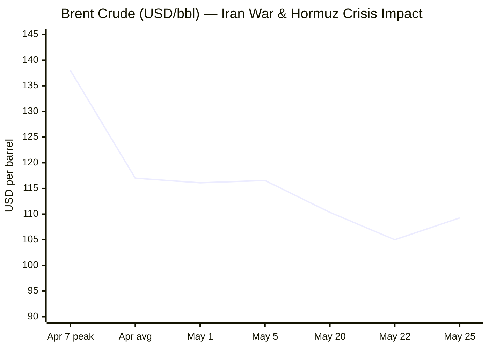

```yaml
---
brief_date: 2026-05-25
version: v1.2.1
run_time: "05:30 CET"
stories_published: 13
categories: [conflict, business, eu_affairs, technology, trends]
alert_counts:
  red: 3
  yellow: 9
  green: 1
ongoing_situations:
  - {name: "2026 Iran War", real_world_start: "2026-02-28", day: 87}
  - {name: "2026 Lebanon War Ceasefire", real_world_start: "2026-04-16", day: 40}
  - {name: "Russia–Ukraine War", real_world_start: "2022-02-24", day: 1551}
sources_fetched: 10
fetch_status:
  le_monde: "❌"
  faz: "❌"
  kommersant: "❌"
  xinhua: "⚠️"
  european_parliament: "⚠️"
expansion_queue: []
---
```

---

# 🌐 MORNING BRIEF
## Monday, 25 May 2026 · 05:30 CET
### 13 stories across 5 categories

---

## DIGEST SUMMARY

| # | Category | Headline | Alert |
|---|----------|----------|-------|
| 1 | ⚔️ Conflict | Iran Peace Deal "Largely Negotiated" — But Tehran Contradicts Terms | 🔴 |
| 2 | ⚔️ Conflict | Lebanon: 45-Day Ceasefire Extension Under Daily Strain | 🟡 |
| 3 | ⚔️ Conflict | Ukraine: Russia Posts Net Territorial Loss; Drone Strikes Hit Oil Ports | 🟡 |
| 4 | 💼 Business | Brent Reverses to $109/bbl as Iran Deal Uncertainty Spikes | 🔴 |
| 5 | 💼 Business | Big Tech AI Restructuring: 142,000+ Jobs Cut in 2026 | 🟡 |
| 6 | 💼 Business | Eurozone CPI Hits 3.0%; ECB to Hike Rates Three Times | 🟡 |
| 7 | 🇪🇺 EU Affairs | EU-US Tariff Deal: EP and Council Clinch Implementation Agreement | 🟡 |
| 8 | 🇪🇺 EU Affairs | Slovakia: MEPs Demand Commission Assess Rule-of-Law Breach Risk | 🟡 |
| 9 | 🇪🇺 EU Affairs | EP Expresses Full Solidarity with Baltic States Against Russian Allegations | 🟢 |
| 10 | 🤖 Technology | Google I/O 2026: Gemini Omni and 3.5 Flash Released | 🟡 |
| 11 | 🤖 Technology | US Mandates Pre-Release AI Testing; Major Companies Comply | 🟡 |
| 12 | 📈 Trends | Hormuz Closure Drives Third Consecutive FAO Food Price Rise | 🔴 |
| 13 | 📈 Trends | Pakistan Consolidates Role as Primary Iran–US Mediator | 🟡 |

> Alert level key: 🔴 High significance · 🟡 Developing · 🟢 Stable/Routine

---

## 🚨 SIGNAL BOARD

🔴 **Trump declares Iran deal "largely negotiated," but Tehran disputes core terms — HEU transfer and Hormuz tolls remain unresolved; US blockade has now redirected 100 commercial vessels**
🔴 **Brent crude reverses +3.35% to $109.26/bbl on Monday as Iran deal uncertainty trumps last week's peace optimism**
🟡 **Eurozone CPI surged to 3.0% in April (up from 2.6% in March) — ECB markets now pricing three rate hikes; EUR/USD at 1.1626, five-week low**
🟡 **FAO Food Price Index hit 130.7 in April 2026, third consecutive monthly rise (+1.6%), driven by energy/fertilizer disruption through Hormuz**
⚡ **Meta posts "no more layoffs" pledge days after cutting 8,000 jobs — reversal signals Big Tech's turbulent AI transition narrative shifting to stability messaging**

---

## 🔄 ONGOING SITUATIONS

| Situation | Real-world start | Day # | Last significant development | Status |
|-----------|-----------------|-------|------------------------------|--------|
| 2026 Iran War | 28 Feb 2026 | Day 87 | Trump says deal "largely negotiated"; Iran disputes terms; US blockade hits 100-ship milestone | 🔴 Active |
| 2026 Lebanon War Ceasefire | 16 Apr 2026 | Day 40 | 45-day extension in effect (to c. 29 Jun); Israeli strikes continuing despite truce | 🟡 Ceasefire |
| Russia–Ukraine War | 24 Feb 2022 | Day 1,551 | Russia posts net territorial loss (−69 sq mi) in Apr 21–May 19 period; Ukraine drone campaign targets Russian oil export ports | 🟡 Active |

---

## ⚔️ CONFLICT ANALYST · 3 updates today

---

### 1. Iran Peace Deal "Largely Negotiated" — But Tehran Contradicts Core Terms 🔴

**Alert:** 🔴
**Summary:** On Sunday 24 May, President Trump declared a framework agreement with Iran "largely negotiated" and pledged an announcement "soon." Iranian state media and a senior Iranian source quoted by Reuters immediately contradicted him: Tehran has not agreed to surrender its highly enriched uranium stockpile, and Iran's Persian Gulf Strait Authority — created on 20 May — insists the Strait of Hormuz will remain under Iranian management. Secretary of State Rubio, attending a NATO summit in Stockholm, acknowledged "a little bit of movement" whilst maintaining all three US demands: no Iranian nuclear weapon, no Hormuz tolls, and transfer of enriched uranium. The US naval blockade has now redirected 100 commercial vessels entering or leaving Iranian ports, per CENTCOM. Separately, Iran claimed it shot down an Israeli surveillance drone on 24 May; the IDF said it was "not familiar" with the incident.
**Significance:** The gap between Trump's public framing and Iranian denials echoes earlier ceasefire miscommunications (8 April). Pakistan and Qatar are mediating, with US envoy Steve Witkoff in contact via both channels. Von der Leyen welcomed progress, calling for a deal guaranteeing "toll-free full freedom of navigation." Whether the MoU framework — a preliminary accord before broader 30–60 day talks — can hold is the critical variable for global energy markets this week.
**Sources:**
- [CBS News — Iran-US peace talks liveblog](https://www.cbsnews.com/live-updates/iran-war-trump-us-peace-talks-strait-of-hormuz-control/) · 25 May 2026
- [CNBC — US, Iran signal progress but remain at odds over uranium and Hormuz tolls](https://www.cnbc.com/2026/05/22/iran-war-strait-of-hormuz-tolls-trump.html) · 22 May 2026
- [Times of Israel — May 24 liveblog](https://www.timesofisrael.com/liveblog-may-24-2026/) · 24 May 2026

**Trend:** ⚡ Reversal
**Tags:** #Iran #Hormuz #nuclear #peace-talks #Pakistan-mediation #MULTI-SOURCE

---

### 2. Lebanon: 45-Day Ceasefire Extension Under Daily Strain 🟡

**Alert:** 🟡
**Summary:** The second ceasefire extension — 45 days agreed 15 May, running to approximately 29 June — is holding in name only. The Israeli military continued daily strikes in Lebanon through the weekend. Both Israel and Hezbollah have increased attacks on one another since the ceasefire announced on 16 April, and Lebanon's army has logged hundreds of violations by Israeli forces. The truce was originally a 10-day arrangement, extended by three weeks on 23 April and now by 45 days following the third round of direct ambassador-level talks in Washington (14–15 May). Trump has confirmed Lebanon is included in the ceasefire; senior US officials nonetheless declined to specify enforcement mechanisms.
**Significance:** The Lebanon theatre remains closely linked to the broader Iran war ceasefire dynamic: a US-Iran deal that leaves the Hormuz issue unresolved will likely keep pressure on Hezbollah to maintain low-level hostilities as leverage. The Palestinian issue and Hezbollah disarmament are explicitly excluded from the current framework, ensuring the structural driver of conflict persists.
**Sources:**
- [Al Jazeera — Israel kills seven in Lebanon, agrees ceasefire extension at talks in US](https://www.aljazeera.com/news/2026/5/15/lebanon-talks-israel-attack) · 15 May 2026
- [PBS NewsHour — Israel and Lebanon agree to 45-day extension of ceasefire](https://www.pbs.org/newshour/world/israel-and-lebanon-agree-to-45-day-extension-of-ceasefire-u-s-state-department-says) · 15 May 2026

**Trend:** → Stable
**Tags:** #Lebanon #Hezbollah #ceasefire #Israel #MULTI-SOURCE

---

### 3. Ukraine: Russia Posts Net Territorial Loss; Drone Strikes Disrupt Russian Oil Exports 🟡

**Alert:** 🟡
**Summary:** According to ISW data compiled by Russia Matters (report dated 20 May), Russian forces recorded a net loss of 69 square miles of Ukrainian territory in the period 21 April–19 May 2026. This stands against Russia's overall control of approximately 20% of Ukrainian territory (c. 45,700 sq mi), roughly equivalent to Pennsylvania. Separately, Ukraine has conducted a sustained drone campaign against all three of Russia's major western oil export ports — Novorossiysk on the Black Sea, and Primorsk and Ust-Luga on the Baltic — disrupting at least 40% of Russia's oil export capacity as of late March. The Belgorod region suffered infrastructure damage from earlier Ukrainian strikes.
**Significance:** The territorial stalemate is shifting marginally in Ukraine's favour in the near term, but the strategic picture remains one of attritional Russian pressure. The drone campaign against export terminals is Ukraine's most effective economic lever, forcing Moscow to absorb revenue losses whilst continuing high-tempo offensive operations. The Iran war energy shock has paradoxically benefited Russia's remaining energy exports at elevated prices.
**Sources:**
- [Russia Matters — Russia-Ukraine War Report Card, May 20, 2026](https://www.russiamatters.org/news/russia-ukraine-war-report-card/russia-ukraine-war-report-card-may-20-2026) · 20 May 2026

**Trend:** → Stable
**Tags:** #Ukraine #Russia #frontline #drone-warfare #energy-markets

📚 *Background reading:* [Kyiv Independent](https://kyivindependent.com) · [IISS — Military Balance](https://www.iiss.org)

---

## 💼 BUSINESS ANALYST · 3 updates today

---

### 4. Brent Reverses to $109/bbl as Iran Deal Uncertainty Spikes 🔴

**Alert:** 🔴
**Summary:** Brent crude jumped 3.35% to $109.26/bbl on Monday, reversing last week's decline of more than 6% which had been driven by optimism around Iran-US peace talks. Today's reversal follows Trump's "Adios" social media post (depicting a destroyed Iranian navy vessel) and Iran's contradictions of his "largely negotiated" deal claim. US equities fell sharply — S&P 500 −1.24% to 7,408.50; Nasdaq −1.54%. The EIA's May STEO (released 12 May) projected Brent averaging approximately $106/bbl in May-June as Gulf oil producers begin raising output. The UAE departed OPEC effective 1 May, removing a significant swing producer from the cartel's formal architecture.
**Market signal:** Bearish for growth equities; bullish for energy and defence stocks, as the Iran deal uncertainty reintroduces the risk of prolonged Hormuz closure and sustained high energy costs.

📎 *See also: Conflict § Story 1 — Iran peace deal contradictions driving today's reversal*

**Sources:**
- [Trading Economics — Brent Crude Oil](https://tradingeconomics.com/commodity/brent-crude-oil) · 25 May 2026
- [EIA Short-Term Energy Outlook](https://www.eia.gov/outlooks/steo/) · 12 May 2026

**Trend:** ⚡ Reversal
**Tags:** #Brent #oil-price #Hormuz #supply-shock #Iran #MULTI-SOURCE

---

### 5. Big Tech AI Restructuring: 142,000+ Jobs Cut in 2026 as $725B AI Capex Wave Rolls On 🟡

**Alert:** 🟡
**Summary:** Meta began notifying 8,000 employees of redundancy on 20 May — its largest companywide round since the 2022–23 "Year of Efficiency" campaign — framing the cuts as essential to fund $125–145 billion in 2026 AI capital expenditure. Microsoft offered voluntary retirement packages to 8,750 US employees. Oracle cut up to 30,000 positions in March. Cisco shed 4,000 more. As of May, more than 142,000 tech workers have lost their jobs in 2026 globally, even as the same companies report record revenues. Meta's Chief People Officer confirmed 7,000 workers are being redirected into AI-native teams.
**Market signal:** Neutral to mildly bullish for large-cap tech in the medium term — AI capex sustains earnings growth forecasts, but the labour repricing signals structural, not cyclical, workforce contraction; median Bay Area time-to-hire stretched to 67 days in Q1 2026.
**Sources:**
- [Yahoo Finance — Meta layoffs 2026: 8,000 jobs cut](https://finance.yahoo.com/sectors/technology/articles/meta-layoffs-2026-8-000-114209703.html) · 20 May 2026
- [Invezz — Big Tech layoffs 2026: Amazon, Meta, Microsoft and the AI trade-off](https://invezz.com/news/2026/05/04/is-big-techs-725b-ai-splurge-being-funded-by-mass-layoffs/) · 04 May 2026

**Trend:** ↗ Escalating
**Tags:** #tech-layoffs #AI #data-centre #earnings #MULTI-SOURCE

---

### 6. Eurozone CPI Hits 3.0%; ECB to Hike Rates Three Times — Stagflation Risk Building 🟡

**Alert:** 🟡
**Summary:** Euro Area CPI rose to 3.0% year-on-year in April 2026, up from 2.6% in March — a sharp reversal of the 2025 disinflation trend driven by energy price transmission from the Hormuz crisis. Eurozone GDP grew only 0.1% quarter-on-quarter in Q1 2026 (0.8% year-on-year). Markets now fully price three ECB rate increases by year-end, with an ECB rate currently at 2.15%; Governing Council member Martins Kazaks confirmed on Thursday that rate hikes would follow if crude-driven inflation expectations persisted. EUR/USD fell to 1.1626, a five-week low, as the rate divergence signal competes with energy import drag.
**Market signal:** Stagflationary: rising rates will dampen credit growth and residential investment, while energy cost pass-through is still incomplete — bearish for European consumer staples and construction sectors.

📎 *See also: Trends § Story 12 — FAO food prices rising on same Hormuz energy/fertilizer channel*

**Sources:**
- [Trading Economics — Euro Area Currency & Indicators](https://tradingeconomics.com/euro-area/currency) · 25 May 2026

**Trend:** ↗ Escalating
**Tags:** #inflation #ECB #eurozone #interest-rates #stagflation #data-point

📚 *Background reading:* [Bruegel — EU Economics](https://www.bruegel.org) · [ECFR — European Economic Sovereignty](https://ecfr.eu/)

---

## 🇪🇺 EU AFFAIRS ANALYST · 3 updates today

---

### 7. EU-US Tariff Deal: EP and Council Clinch Implementation Agreement 🟡

**Alert:** 🟡
**Summary:** The European Parliament's INTA committee and the Council of the EU reached a provisional agreement on 20 May implementing the tariff elements of the Turnberry Trade Agreement Framework (July 2025 Joint Statement). Two regulations will enter force: the first eliminates EU tariffs on all US industrial goods; the second provides preferential market access for certain US agricultural and seafood products. The US maintains a 15% tariff ceiling on EU exports. A suspension mechanism allows the Commission to rescind EU concessions if the US fails to lift tariffs on EU steel and aluminium derivatives above 15% by 31 December 2026, or if the US fails to honour Turnberry commitments. A sunset clause terminates the deal at end-2029 unless renewed.
**Legislative/policy stage:** Provisional political agreement reached 20 May 2026; full plenary vote required in June 2026 for formal adoption; Commission implementing acts to follow.
**Sources:**
- [EU Council — EP and Council strike a deal to implement EU-US trade](https://www.consilium.europa.eu/en/press/press-releases/2026/05/20/eu-us-trade-council-and-parliament-strike-a-deal-to-implement-the-tariff-elements-of-the-joint-statement/) · 20 May 2026
- [Euronews — EU approves trade deal with US despite uncertainty](https://www.euronews.com/my-europe/2026/05/20/eu-approves-trade-deal-with-the-us-despite-uncertainty-in-transatlantic-relations) · 20 May 2026
- [European Commission — Commission welcomes political agreement](https://ec.europa.eu/commission/presscorner/detail/en/ip_26_1103) · 20 May 2026

**Trend:** ↘ De-escalating
**Tags:** #EU-institutions #single-market #MULTI-SOURCE #institutional

---

### 8. Slovakia: MEPs Demand Commission Assess Serious Breach of EU Founding Values 🟡

**Alert:** 🟡
**Summary:** Parliament adopted a resolution on 20 May calling on the European Commission to formally assess whether Slovakia's government poses a "clear risk of a serious breach" of EU founding values under Article 7 TEU procedures. The resolution — driven by the CONT and LIBE committees — cites threats to judicial independence and media pluralism that parallel Hungary's rule-of-law trajectory. Slovakia's accession to the Article 7 watch list has been discussed informally; the resolution represents a formal political escalation requiring Commission response within a defined timeframe.
**Legislative/policy stage:** Parliament resolution adopted 20 May 2026; Commission must now assess and respond; a formal Article 7(1) reasoned proposal would require Council involvement. Slovakia retains access to EU structural funds pending this assessment; Hungary's situation provides the relevant precedent.
**Sources:**
- [European Parliament press room — Slovakia: MEPs demand action to protect EU values and the EU budget](https://www.europarl.europa.eu/news/en/press-room/20260513IPR43308/slovakia-meps-demand-action-to-protect-eu-values-and-the-eu-budget) · 20 May 2026

**Trend:** ↗ Escalating
**Tags:** #EU-institutions #rule-of-law #EU-funds #institutional

---

### 9. EP Expresses Full Solidarity with Baltic States Against Russian Allegations 🟢

**Alert:** 🟢
**Summary:** The European Parliament's Conference of Presidents issued a unanimous solidarity statement on 21 May in response to Russia's allegations against Latvia — and by extension Estonia and Lithuania — regarding alleged interference in Russian domestic affairs. The statement, signed by leaders of all seven political groups, characterised Russia's allegations as "unfounded" and pledged the Parliament's full support for Baltic sovereignty. The statement was coordinated with similar positions from the EU Council and Commission.
**Legislative/policy stage:** Parliamentary resolution — no legislative action; signal function within EU institutional solidarity framework.
**Sources:**
- [European Parliament press room — EP Conference of Presidents expresses full solidarity with the Baltic states](https://www.europarl.europa.eu/news/en/press-room/20260521IPR43704/ep-conference-of-presidents-expresses-full-solidarity-with-the-baltic-states) · 21 May 2026

**Trend:** → Stable
**Tags:** #EU-institutions #Russia #diplomacy #EU-defence

📚 *Background reading:* [ECFR — European Security Policy](https://ecfr.eu/) · [Atlantic Council — Baltic Security](https://www.atlanticcouncil.org)

---

## 🤖 TECHNOLOGY ANALYST · 2 updates today

---

### 10. Google I/O 2026: Gemini Omni and Gemini 3.5 Flash Mark New Multimodal Frontier 🟡

**Alert:** 🟡
**Summary:** Google released two significant models at I/O 2026 (19 May): Gemini Omni — described as capable of creating "anything from any input, starting with video," representing a step change in world understanding and multimodal editing — and Gemini 3.5 Flash, positioned as the first model in a new "frontier intelligence with action" family. Alongside the model releases, Google announced the expansion of its SynthID watermarking standard, with OpenAI, Kakao, and ElevenLabs committed to embedding SynthID in their AI-generated content — representing a meaningful industry-wide convergence on AI content provenance.
**Analyst note:** If Gemini Omni delivers substantiated video-in, video-out capabilities at consumer scale, the competitive pressure on OpenAI's GPT-5 and Anthropic's Claude models for enterprise multimodal contracts will intensify significantly by Q4 2026, with implications for cloud infrastructure pricing and data-centre capacity planning.
**Sources:**
- [Google Blog — Google I/O 2026: all announcements](https://blog.google/innovation-and-ai/technology/developers-tools/google-io-2026-collection/) · 19 May 2026

**Trend:** ↗ Escalating
**Tags:** #AI #LLM #AI-benchmark #open-source-AI

---

### 11. US Government Mandates Pre-Release AI Model Testing; Major Companies Comply 🟡

**Alert:** 🟡
**Summary:** The US government has moved to require major AI developers to provide pre-release model access to federal regulators before public deployment — a significant structural shift from the sector's previous self-regulatory posture. Microsoft, xAI, and others have reportedly agreed to early regulator access. Separately, the UK government (Technology Secretary Liz Kendall, 28 April) declared AI "central to the UK's economic prosperity and national security," announcing a domestic AI hardware plan focused on reducing dependence on foreign chip supply chains. The ICO has also issued a report on automated decision-making in recruitment, with a consultation deadline of 29 May 2026.
**Analyst note:** The US pre-release testing mandate — if codified legislatively — would mark the first formal gatekeeping mechanism for frontier AI in the world's largest model market, restructuring competitive dynamics for releases planned in 2026–27 and giving regulatory bodies new leverage over AI capability disclosure.
**Sources:**
- [IMFounder — 7 Explosive AI Updates in May 2026](https://imfounder.com/science-tech/ai/ai-updates-may-2026/) · May 2026
- [TLT — AI Brief: May 2026](https://www.tlt.com/insights-and-events/insight/ai-brief-may-2026) · May 2026

**Trend:** ↗ Escalating
**Tags:** #AI-regulation #AI-safety #AI #digital-regulation #MULTI-SOURCE

📚 *Background reading:* [CSIS — AI Governance](https://www.csis.org) · [RAND — Technology Policy](https://www.rand.org)

---

## 📈 TRENDS ANALYST · 2 updates today

---

### 12. Strait of Hormuz Closure Drives Third Consecutive Monthly FAO Food Price Rise 🔴

**Alert:** 🔴
**Summary:** The FAO Food Price Index averaged 130.7 points in April 2026, up 1.6% from March's 128.5, marking the third consecutive monthly rise and the highest reading since mid-2024. Vegetable oils hit their highest level since 2022; meat prices reached a record high. The primary structural driver is the effective closure of the Strait of Hormuz since late February, which has pushed up energy costs, disrupted fertiliser supply chains, and raised input costs for global agriculture. FAO's latest wheat production forecast was revised down 2% to 817 million tonnes for 2026 — below last year's level — as farmers shift to less fertiliser-intensive crops. The FFPI now stands 2.0% above year-ago levels and 18.4% below its March 2022 peak.
**Horizon:** Medium-term structural risk: if the Strait remains effectively closed through summer 2026, the fertiliser cost shock will not be transmitted to global food commodity prices until the 2026/27 planting season — compressing the window for policy intervention in food-insecure economies. The FAO warns that low-income food-deficit countries will be disproportionately affected through three channels: higher energy and food prices, sustained wage/price inflation, and a confidence shock.
**Sources:**
- [FAO — FAO Food Price Index up for third consecutive month](https://www.fao.org/newsroom/detail/fao-food-price-index-up-for-third-consecutive-month-largely-on-rising-vegetable-oil-prices/en) · 08 May 2026

**Trend:** ↗ Escalating
**Tags:** #food-security #food-prices #Hormuz #shipping #supply-shock #data-point #MULTI-SOURCE

---

### 13. Pakistan Consolidates Role as Primary Iran–US Mediator — A Structural Diplomatic Shift 🟡

**Alert:** 🟡
**Summary:** Pakistan has emerged in 2026 as the indispensable non-Western intermediary between Washington and Tehran. Having delivered the US "15-point proposal" to Iran on 25 March, and coordinated the 8 April ceasefire, Pakistani and Qatari officials held fresh talks with Iranian counterparts on 22–23 May whilst maintaining constant contact with US envoy Steve Witkoff. Islamabad's position — geographically proximate to Iran, diplomatically acceptable to both Washington and Tehran, and absent from the US–Israel military campaign — has elevated its strategic profile markedly. China's "5-point initiative" (31 March) complemented Pakistan's mediation, suggesting a broader non-Western diplomatic architecture is consolidating around the Iran conflict.
**Horizon:** Long-term structural shift: Pakistan's mediator role is accelerating its reorientation from a primarily South Asian security actor into a Middle East peace broker, with implications for its relationship with Washington, its access to Gulf financial flows, and regional competition with India for diplomatic positioning in the Islamic world.
**Sources:**
- [CNBC — Trump says Iran deal reopening Strait of Hormuz "largely negotiated"](https://www.cnbc.com/2026/05/23/us-iran-war-talks.html) · 23 May 2026
- [House of Commons Library — Israel/US-Iran conflict 2026: Reopening the Strait of Hormuz](https://commonslibrary.parliament.uk/research-briefings/cbp-10636/) · 24 May 2026

**Trend:** ↗ Escalating
**Tags:** #Pakistan-mediation #diplomacy #mediation #peace-talks #Iran #MULTI-SOURCE

📚 *Background reading:* [Atlantic Council — Five Ways the Iran War Will Forever Alter the Middle East](https://www.atlanticcouncil.org/blogs/menasource/five-ways-the-iran-war-will-forever-alter-the-middle-east/) · [CFR — Iran diplomacy](https://www.cfr.org/)

---

## 📊 KEY DATA OF THE DAY

> 📊 **DATA OFFICER** · 7 indicators

| Indicator | Value | Δ vs prior session | Δ vs 7 days ago | Note | Source | URL |
|-----------|-------|-------------------|-----------------|------|--------|-----|
| EUR/USD | 1.1626 | −0.37% | N/A | Five-week low; ECB rate hike bets driving dollar strength | Trading Economics | [link](https://tradingeconomics.com/euro-area/currency) |
| Brent Crude (USD/bbl) | 109.26 | +3.35% | N/A | Reversal on Iran deal contradiction after last week's −6%+ decline; UAE out of OPEC from 1 May | Trading Economics/EIA | [link](https://tradingeconomics.com/commodity/brent-crude-oil) |
| Gold (XAU/USD) | 4,547.89 | −2.22% | N/A | Second consecutive weekly decline; elevated oil fuelling rate-hike expectations which weigh on gold | Trading Economics | [link](https://tradingeconomics.com/commodity/gold) |
| IMF Global Growth 2026 | 3.1% | −0.2pp vs Jan WEO | −0.2pp vs Oct WEO | "Reference forecast" assumes limited conflict duration; adverse scenario 2.5%, severe 2.0% | IMF WEO April 2026 | [link](https://www.imf.org/en/publications/weo/issues/2026/04/14/world-economic-outlook-april-2026) |
| EU CPI YoY (Apr 2026) | 3.0% | +0.4pp vs Mar 2026 | N/A | Sharp reversal of disinflation; energy price pass-through driving acceleration | Eurostat/Trading Economics | [link](https://tradingeconomics.com/euro-area/currency) |
| FAO Food Price Index | 130.7 | +1.6% vs Mar 2026 | — (monthly) | April 2026 — latest available; third consecutive monthly rise; vegetable oils highest since 2022 | FAO | [link](https://www.fao.org/newsroom/detail/fao-food-price-index-up-for-third-consecutive-month-largely-on-rising-vegetable-oil-prices/en) |
| Strait of Hormuz transit (US blockade ships redirected) | 100 vessels | +100 (cumulative) | N/A | US blockade hits century mark today; Strait effectively closed since ~mid-April; Iran's new Persian Gulf Strait Authority claims management rights | CENTCOM/CBS News | [link](https://www.cbsnews.com/live-updates/iran-war-trump-us-peace-talks-strait-of-hormuz-control/) |

**Data commentary:** Three inter-linked signals dominate today's data: Brent's +3.35% reversal reflects markets repricing the probability of a swift Iran deal after Trump's "Adios" post and Tehran's contradictions; gold's concurrent −2.22% decline is unusual in a risk-off environment and reflects investor expectations that sustained oil-driven inflation will force the Fed (at 3.75%) and ECB (at 2.15%) to hike further, raising the opportunity cost of holding the metal. The FAO's 130.7 reading for April and the US blockade's 100-vessel milestone together confirm that the Strait of Hormuz closure has now crossed from an acute shock into a structural economic disruption with compounding effects on agriculture, inflation, and sovereign debt in commodity-importing emerging economies.

---

## 📊 CHARTS

### Chart 1 — Brent Crude Trajectory: Iran War and Hormuz Crisis (USD/bbl)



*Sources: EIA STEO (May 12 release); Fortune daily oil price articles; Trading Economics. Apr 7 peak and Apr monthly average per EIA. May 22 Brent from TE Brent page ("climbed above $105 on Friday"). May 25 from TE live table.*

---

## ⚙️ AGENT METADATA

| Field | Value |
|-------|-------|
| Agent version | MORNING BRIEF v1.2.1 |
| Run timestamp | 2026-05-25T05:30:08+02:00 |
| Fetch status | Le Monde ❌ · FAZ ❌ · Kommersant ❌ · Xinhua ⚠️ (April 24 articles only; outside 24h window) · EP ⚠️ (navigation returned; latest press releases 21 May — 4 days prior; no 25 May releases — Whit Monday holiday) |
| Sources queried | 10 / 11 (World Bank not separately queried this run) |
| Languages processed | EN, FR (Le Monde fallback via search), DE (FAZ fallback via search) |
| Stories surfaced | 28 (before editorial filter) |
| Stories published | 13 (after editorial filter) |
| Output language | English (British) |
| Date validated | ✅ Confirmed 25 May 2026 |
| Note | Today is Whit Monday (Pentecost Monday) — public holiday in Germany, France, Netherlands, Belgium, Austria and others; European equity markets partially closed; EP not issuing press releases; TE data reflects latest available session closes |
| Expansion Queue | None |

---

*MORNING BRIEF is an AI-assisted digest. All summaries are paraphrased from original sources. Verify time-sensitive information at the linked URLs before acting. Output language: British English.*
