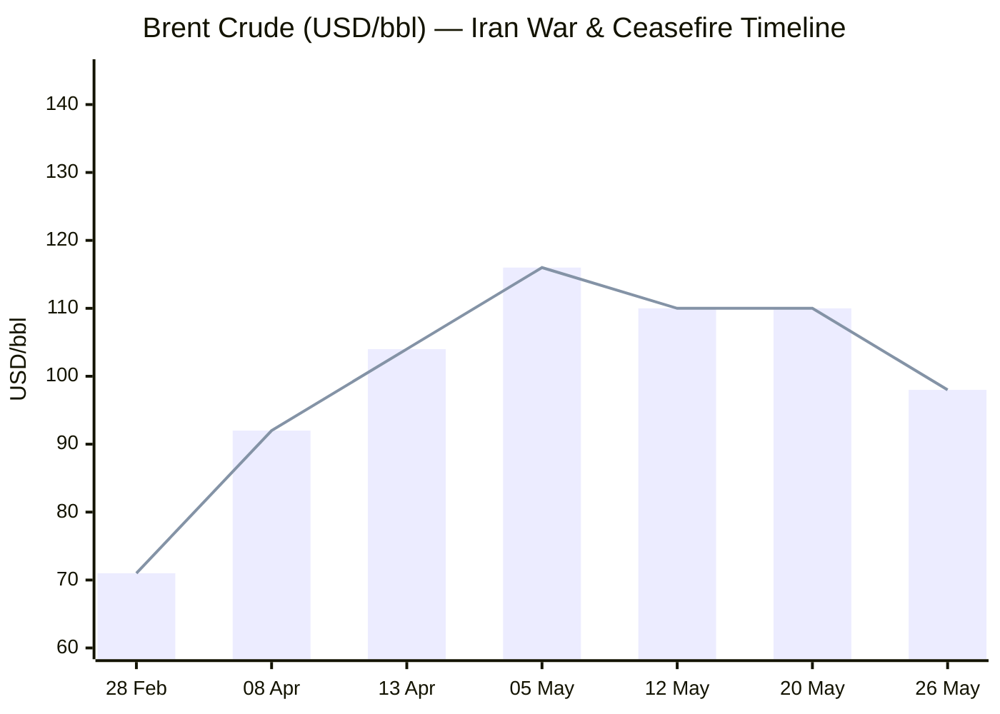
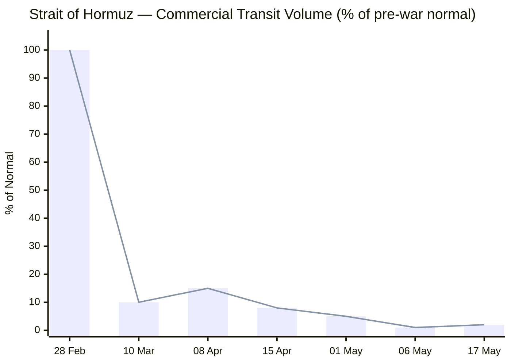

```yaml
---
brief_date: 2026-05-26
version: v1.2.1
run_time: "05:30 CET"
stories_published: 13
categories: [conflict, business, eu_affairs, technology, trends]
alert_counts:
  red: 3
  yellow: 8
  green: 2
ongoing_situations:
  - {name: "Iran-US War", real_world_start: "2026-02-28", day: 88}
  - {name: "Strait of Hormuz Crisis", real_world_start: "2026-02-28", day: 88}
  - {name: "Iran-US Ceasefire", real_world_start: "2026-04-08", day: 49}
  - {name: "2026 Lebanon War", real_world_start: "2026-03-02", day: 86}
  - {name: "Ukraine-Russia War", real_world_start: "2022-02-24", day: 1552}
sources_fetched: 10
fetch_status:
  le_monde: "❌"
  faz: "❌"
  kommersant: "❌"
  xinhua: "⚠️"
  european_parliament: "❌"
expansion_queue: []
---
```

---

# 🌐 MORNING BRIEF
## Tuesday, 26 May 2026 · 05:30 CET
### 13 stories across 5 categories

---

## DIGEST SUMMARY

| # | Category | Headline | Alert |
|---|----------|----------|-------|
| 1 | ⚔️ Conflict | US-Iran 60-day ceasefire framework — Hormuz de-mining deal imminent | 🔴 |
| 2 | ⚔️ Conflict | Strait of Hormuz — transit at 2% of normal, mines remain | 🔴 |
| 3 | ⚔️ Conflict | Ukraine — Russia loses net 29 sq miles in past week | 🟡 |
| 4 | ⚔️ Conflict | Lebanon — 45-day ceasefire holds; peace talks continue | 🟡 |
| 5 | 💼 Business | Brent drops to $97.74 — Iran deal optimism weighs on oil | 🟡 |
| 6 | 💼 Business | EC Spring Forecast: Eurozone GDP cut to 0.9%, inflation at 3.0% | 🔴 |
| 7 | 💼 Business | Global equities edge higher on Hormuz deal hopes | 🟢 |
| 8 | 🇪🇺 EU Affairs | Magyar–von der Leyen accord on €10.4bn frozen funds set for 28 May | 🟡 |
| 9 | 🇪🇺 EU Affairs | France-UK MMA for Hormuz: Charles de Gaulle deployed, ASPIDES expansion under review | 🟡 |
| 10 | 🤖 Technology | Google I/O 2026 — Gemini 3.5 Flash launches "Agentic Gemini Era" | 🟢 |
| 11 | 🤖 Technology | US moves to require pre-release AI model access for regulators | 🟡 |
| 12 | 📈 Trends | Pakistan cements role as indispensable mediator in Iran-US talks | 🟡 |
| 13 | 📈 Trends | Iran war energy shock drives FFPI to 130.7 — third consecutive monthly rise | 🟡 |

> Alert Level key: 🔴 High significance · 🟡 Developing · 🟢 Stable/Routine

---

## 🚨 SIGNAL BOARD

🔴 US-Iran framework for 60-day ceasefire extension and Hormuz de-mining has been agreed in outline — formal announcement expected imminently, with Brent down ~$12/bbl in seven days on deal optimism
🔴 Eurozone GDP forecast cut to 0.9% for 2026 by European Commission, with EU inflation now seen at 3.1% — the sharpest energy-shock revision since the 2022 gas crisis
🟡 Russia has lost net 69 sq miles of Ukrainian territory in the past four weeks according to ISW — the most sustained Ukrainian territorial gain since mid-2025
🟢 S&P 500 closed at 7,473 (+0.37%) Friday and gold is steady at ~$4,556 — markets pricing in ceasefire, not collapse
⚡ Hungary under PM Magyar pivots to Brussels: a political accord on €10.4bn in frozen EU recovery funds is set to be signed in two days, reversing six years of Orbán-era deadlock in a single meeting

---

## 🔄 ONGOING SITUATIONS

| Situation | Real-world start | Day # | Last significant development | Status |
|-----------|-----------------|-------|------------------------------|--------|
| Iran-US War | 28 Feb 2026 | Day 88 | 60-day ceasefire framework agreed in outline; formal deal pending | 🔴 Active (ceasefire) |
| Strait of Hormuz Crisis | 28 Feb 2026 | Day 88 | Transit at 2% of normal; de-mining under discussion | 🔴 Active |
| Iran-US Ceasefire | 08 Apr 2026 | Day 49 | Extended multiple times; new 60-day framework being finalised | 🟡 Ceasefire |
| 2026 Lebanon War | 02 Mar 2026 | Day 86 | 45-day ceasefire (from ~16 May) in force; 4th-round talks expected | 🟡 Ceasefire |
| Ukraine-Russia War | 24 Feb 2022 | Day 1,552 | ISW: Russia net -29 sq miles in week ending 19 May | 🟡 Active |

---

## ⚔️ CONFLICT

> 🔎 **CONFLICT ANALYST** · 4 updates today

---

### 1. US-Iran 60-Day Ceasefire Framework — Hormuz De-Mining Deal Imminent 🔴

**Alert:** 🔴
**Summary:** The United States and Iran have reached a framework agreement for a 60-day ceasefire extension during which the Strait of Hormuz would be de-mined and reopened, Iran could freely sell oil, and negotiations on Iran's nuclear programme would commence. The deal would see the US lift its naval blockade on Iranian ports (in place since 13 April) in exchange for Tehran clearing mines from the strait and dropping toll demands. State Secretary Rubio confirmed Sunday the goal is a fully open strait "without tolls." A Pakistani mediator has reportedly briefed China that an agreement is nearing. Trump stated Washington would maintain its blockade until a formal deal is inked, warning fresh attacks could follow if talks collapse. [MULTI-SOURCE]

**Significance:** A signed 60-day extension would be the most consequential diplomatic development since the initial 8 April ceasefire. The framework for nuclear talks embedded within the deal — even if ultimately unresolved — marks the first US-Iran structured engagement on proliferation since the collapse of the JCPOA.

**Sources:**
- [Washington Post — U.S. and Iran Work Toward Deal to Extend Ceasefire and Reopen Strait of Hormuz](https://www.washingtonpost.com/world/2026/05/24/us-iran-near-deal-extend-ceasefire-reopen-hormuz/) · 25 May 2026
- [Axios — Exclusive: What's Inside the Iran Deal Trump Is Close to Signing](https://www.axios.com/2026/05/24/iran-deal-strait-hormuz-sanctions-nuclear) · 24 May 2026
- [The Irish Times — What We Know About the Proposed Iran Ceasefire Deal](https://www.irishtimes.com/world/middle-east/2026/05/25/what-we-know-about-the-proposed-iran-ceasefire-deal/) · 25 May 2026

**Trend:** ↘ De-escalating
**Tags:** #Iran #ceasefire #Hormuz #peace-talks #MULTI-SOURCE

---

### 2. Strait of Hormuz — Commercial Transit at 2% of Normal, Mines Remain 🔴

**Alert:** 🔴
**Summary:** IMF PortWatch data for 17 May 2026 recorded just 2 commercial vessel transits per day through the Strait, representing 2% of the pre-war average of approximately 95 per day. Since 6 May, open transits have been near zero. Approximately 1,550 vessels remain stranded in and around the strait, with an estimated 22,500 mariners trapped. Iran's mines remain in place pending a formal agreement. The US continues its naval blockade of Iranian ports. EIA STEO (12 May) assumed the strait remains effectively closed until late May, with traffic beginning to recover only in June. A deal framework is now agreed in outline (see Story 1), but physical de-mining will take time.

**Significance:** The EIA estimates it would take until at least September for tanker and oil markets to return to normal even if the strait were immediately reopened; the structural supply deficit will persist well beyond a political announcement.

**Sources:**
- [Straits.live — Strait of Hormuz Update: Live Status, Transits & Day Count](https://straits.live/) · 17 May 2026 (IMF PortWatch data)
- [USNI News — Strait of Hormuz Commercial Transits at Lowest Level Since Operation Epic Fury Start](https://news.usni.org/2026/05/01/strait-of-hormuz-commercial-transits-at-lowest-level-since-operation-epic-fury-start-shipping-data-shows) · 01 May 2026
- [EIA — Short-Term Energy Outlook](https://www.eia.gov/outlooks/steo/) · 12 May 2026

**Trend:** → Stable (at crisis floor; deal pending)
**Tags:** #Hormuz #naval-blockade #shipping #oil-price #day-88

---

### 3. Ukraine — Russia Records Net Territorial Loss for Fourth Consecutive Week 🟡

**Alert:** 🟡
**Summary:** According to ISW data compiled by Russia Matters, Russian forces registered a net loss of 29 square miles of Ukrainian territory in the week ending 19 May 2026 — the largest single-week Ukrainian gain in that four-week run. Across the full April 21–May 19 period, Russia lost a net 69 square miles, a sharp reversal from the March-April period when Russian forces had registered a slight net gain of 2 square miles. Russia continues to hold approximately 45,708 square miles (roughly 20% of Ukraine). In Russia, Ukraine's cross-border foothold in Kursk and Belgorod oblasts held at approximately 4 square miles for the second consecutive week.

**Significance:** The sustained Ukrainian territorial recovery marks the longest run of Russian net losses since mid-2025, though ISW notes that infiltration tactics complicate direct year-on-year comparisons of territorial control data.

**Sources:**
- [Russia Matters — The Russia-Ukraine War Report Card, 20 May 2026](https://www.russiamatters.org/news/russia-ukraine-war-report-card/russia-ukraine-war-report-card-may-20-2026) · 20 May 2026

**Trend:** ↗ Escalating (Ukrainian pressure)
**Tags:** #Ukraine #Russia #frontline #day-N #data-point

---

### 4. Lebanon — 45-Day Ceasefire Extends; Fourth Round of Peace Talks Expected 🟡

**Alert:** 🟡
**Summary:** The Israel-Lebanon ceasefire, originally announced on 16 April 2026 for 10 days and extended three weeks on 23 April, was further extended by 45 days in mid-May following a third round of direct talks in Washington. Israeli strikes on Hezbollah positions in southern Lebanon continued at a reduced tempo during the ceasefire, with three people reported killed on 14 May according to Lebanese media. The Lebanese government has outlawed Hezbollah's military wing, and Israeli PM Netanyahu has described a "historic deal" opportunity. A fourth round of talks is expected before the latest extension expires. Iran's ceasefire with the US has significantly reduced Hezbollah's operational capacity. Hamas and Hezbollah continue to reject disarmament proposals.

**Significance:** The 45-day window is the most substantive diplomatic opening between Israel and Lebanon in decades; its durability depends on Hezbollah's political capacity to accept disarmament terms.

**Sources:**
- [PBS NewsHour — Israel and Lebanon Agree to 45-Day Extension of Ceasefire, US State Department Says](https://www.pbs.org/newshour/world/israel-and-lebanon-agree-to-45-day-extension-of-ceasefire-u-s-state-department-says) · 16 May 2026
- [Al Jazeera — Cautious Optimism in Lebanon as Direct Talks With Israel Progress](https://www.aljazeera.com/news/2026/5/14/cautious-optimism-in-lebanon-as-direct-talks-with-israel-progress) · 14 May 2026

**Trend:** ↘ De-escalating
**Tags:** #Lebanon #Israel #ceasefire #peace-talks #Hezbollah

---

📚 *Background reading:* [Al Jazeera — US-Iran Ceasefire Deal: What Are the Terms, and What's Next?](https://aljazeera.com/news/2026/4/8/us-iran-ceasefire-deal-what-are-the-terms-and-whats-next) · 08 April 2026 · [CFR — Israel-Lebanon Ceasefire Extended for Three Weeks](https://www.cfr.org/articles/israel-lebanon-ceasefire-extended-for-three-weeks) · 24 April 2026

---

## 💼 BUSINESS

> 💼 **BUSINESS ANALYST** · 3 updates today

---

### 5. Brent Crude at $97.74 — Iran Deal Optimism Drives Sixth Week of Price Retreat 🟡

**Alert:** 🟡
**Summary:** Brent crude rose $0.49 (0.50%) to $97.74/bbl on 26 May, stabilising after a more than 6% plunge in the prior session as markets priced in the near-complete US-Iran ceasefire framework (see Conflict § Story 1). The Brent price has fallen approximately 11% over the past seven days as deal optimism mounted, from ~$110/bbl on 19 May. Brent peaked at $138/bbl on 7 April, the day before the initial ceasefire. EIA's May STEO (12 May) projected Brent at ~$106/bbl for May-June, but the deal framework is driving pricing below that guidance. Trump's statement that Washington would "keep its blockade in place until a formal agreement is reached" caps the downside for now.

📎 See also: Conflict § Story 1 — US-Iran framework agreement includes Hormuz de-mining and lifting of US naval blockade

**Market signal:** Bearish in the short term on ceasefire expectations, but supply recovery will be slow (EIA estimates September return to normality), supporting a price floor.

**Sources:**
- [Trading Economics — Brent Crude Oil](https://tradingeconomics.com/commodity/brent-crude-oil) · 26 May 2026
- [EIA — Short-Term Energy Outlook](https://www.eia.gov/outlooks/steo/) · 12 May 2026

**Trend:** ↘ De-escalating
**Tags:** #Brent #oil-price #energy-markets #Hormuz

---

### 6. European Commission Spring 2026 Forecast: Eurozone GDP at 0.9%, Inflation Surges to 3.0% 🔴

**Alert:** 🔴
**Summary:** The European Commission's Spring 2026 Economic Forecast (published 21 May) cut Eurozone GDP growth to 0.9% for 2026, down from the 1.2% projected in the Autumn 2025 Forecast, and revised Eurozone inflation up to 3.0% for 2026, a full percentage point above earlier projections. EU-wide GDP growth is seen at 1.1%, also below the prior 1.4% estimate. Among the bloc's largest economies, Germany has been cut to just 0.6% growth for 2026 (from 1.2%), France to 0.8%, and Italy to a similar downgrade. The energy shock from the Middle East conflict is the primary driver, with energy commodity prices expected to remain approximately 20% above pre-war levels even if tensions ease. Consumer confidence has dropped to a 40-month low.

**Market signal:** Bearish for European equities and bonds over the medium term; stagflationary pressure from higher energy costs and slowing output raises the probability of further ECB rate increases.

**Sources:**
- [European Commission — EU Economy Forecast to Slow Down Amid Rising Inflation Following Energy Shock](https://commission.europa.eu/news-and-media/news/eu-economy-forecast-slow-down-amid-rising-inflation-following-energy-shock-2026-05-21_en) · 21 May 2026
- [European Commission DG ECFIN — Spring 2026 Economic Forecast: Slowdown in Growth as Energy Shock Drives up Inflation](https://economy-finance.ec.europa.eu/economic-forecast-and-surveys/economic-forecasts/spring-2026-economic-forecast-slowdown-growth-energy-shock-drives-inflation_en) · 21 May 2026

**Trend:** ↗ Escalating (deterioration)
**Tags:** #GDP-forecast #eurozone #inflation #EU-institutions #institutional #data-point

---

### 7. Global Equities Edge Higher on Iran Deal Hopes — S&P 500 at 7,473 🟢

**Alert:** 🟢
**Summary:** The S&P 500 closed at 7,473.47 (+0.37%) on 22 May 2026, the last US session before the Memorial Day long weekend, as optimism around the US-Iran deal framework filtered through equity markets. The Nasdaq ended at 26,343.97 (+0.19%) and the Dow at 50,579.70 (+0.58%). Exxon Mobil was a notable outperformer (+3.36%) on oil sector exposure. US markets are reopening today (26 May) for the first session since the deal framework was publicly reported, and futures point to continued cautious optimism. European indices were broadly lower in recent sessions as the EC's downgraded growth forecast weighed on sentiment.

**Market signal:** Neutral-to-bullish; energy sector and shipping stocks likely to respond positively to any formal deal announcement, but European macroeconomic headwinds cap broad-market upside.

**Sources:**
- [Yahoo Finance — S&P 500, Nasdaq, Dow Historical Data](https://finance.yahoo.com/quote/BZ=F/history/) · 22 May 2026 (last US close)

**Trend:** → Stable
**Tags:** #SP500 #Nasdaq #equity-rally

---

📚 *Background reading:* [Britannica — 2026 Iran War: Chronology and Economic Impact](https://www.britannica.com/event/2026-Iran-war) · 24 May 2026

---

## 🇪🇺 EU AFFAIRS

> 🇪🇺 **EU AFFAIRS ANALYST** · 2 updates today

---

### 8. Magyar to Sign Political Accord with Von der Leyen in Brussels on 28 May — €10.4bn Frozen Funds Pathway Agreed 🟡

**Alert:** 🟡
**Summary:** Hungarian Prime Minister Péter Magyar confirmed on 25 May that he will sign a political accord with European Commission President Ursula von der Leyen in Brussels on 28 May, establishing a framework for Hungary to access €10.4 billion (£12.1 billion) in EU pandemic-recovery funds frozen under the Orbán government. The accord will set out what Budapest must do to qualify for the funds before the August 31 deadline, after which the unspent allocation expires permanently. The EU has set 27 reform conditions for Hungary; Magyar acknowledged the accord is an "outline" and that significant work must be completed by summer's end. Hungary has already lost €1.04 billion in cohesion funds that expired in late 2024. Magyar's government, formed on 9 May with a supermajority of 141/199 seats, is treating EU funds access as its primary economic priority.

**Legislative/policy stage:** Political accord signature scheduled for 28 May 2026 in Brussels. Implementation conditions to be fulfilled between June and August 2026. Full disbursement expected in autumn 2026 if milestones met.

**Sources:**
- [Bloomberg — Hungary Sees May 28 Deal With EU on Frozen Funds, PM Magyar Says](https://www.bloomberg.com/news/articles/2026-05-25/hungary-sees-may-28-deal-with-eu-on-frozen-funds-pm-magyar-says) · 25 May 2026
- [Euronews — Hungary's Magyar Seeks EU Funds Deal 'Next Week' in Brussels](https://www.euronews.com/my-europe/2026/05/19/hungarys-magyar-seeks-eu-funds-deal-next-week-in-brussels) · 19 May 2026

**Trend:** ↘ De-escalating
**Tags:** #Hungary #Magyar #EU-funds #rule-of-law #EU-institutions

---

### 9. France-UK Multinational Mission for Hormuz — Charles de Gaulle Deployed; ASPIDES Expansion Under Discussion 🟡

**Alert:** 🟡
**Summary:** The France-UK co-chaired Multinational Military Mission (MMA) for Hormuz is advancing, with the French aircraft carrier Charles de Gaulle transiting the Suez Canal on 6 May en route to the region. The MMA — committed to by coalition partners including Australia, which has pledged an E-7A Wedgetail aircraft — is positioned to escort de-mining operations once a formal ceasefire is agreed. In parallel, EU defence ministers meeting in Brussels on 12 May discussed the possible extension of Operation EUNAVFOR ASPIDES into the Strait of Hormuz, beyond its current Red Sea mandate. ASPIDES Chief Kallas described the strait as caught in a "grey zone between war and peace" and said discussions with EU member states on mandate expansion are ongoing. The Council's €90 billion Ukraine support loan was also finalised on 23 April, signalling EU fiscal capacity is strained.

**Legislative/policy stage:** ASPIDES mandate extension to Hormuz under discussion; formal Council Decision required. MMA operating on a coalition (non-EU treaty) basis; no formal EU legislative instrument yet. ASPIDES current mandate runs to 28 February 2027.

📎 See also: Business § Story 6 — EC Spring 2026 Forecast cuts Eurozone GDP to 0.9%, partly driven by Hormuz-linked energy shock

**Sources:**
- [EU Council — Foreign Affairs (Defence) Council, 12 May 2026](https://www.consilium.europa.eu/en/meetings/fac/2026/05/12/) · 12 May 2026
- [Breaking Defense — From Destroyers to Drones: How a Europe-Led Coalition Aims to Open the Strait of Hormuz](https://breakingdefense.com/2026/05/from-destroyers-to-drones-how-a-europe-led-coalition-aims-to-open-the-strait-of-hormuz/) · 15 May 2026

**Trend:** ↗ Escalating (EU defence engagement deepening)
**Tags:** #EU-defence #Hormuz #EU-institutions #MULTI-SOURCE #shipping

---

📚 *Background reading:* [Al Jazeera — Is Magyar's Election Win the End of the EU's Troubles With Hungary?](https://www.aljazeera.com/news/2026/4/13/is-magyars-election-win-the-end-of-the-eus-troubles-with-hungary) · 13 April 2026

---

## 🤖 TECHNOLOGY

> 🤖 **TECHNOLOGY ANALYST** · 2 updates today

---

### 10. Google I/O 2026 — Gemini 3.5 Flash Launches the "Agentic Gemini Era" 🟢

**Alert:** 🟢
**Summary:** At Google I/O on 19 May 2026, Sundar Pichai announced Gemini 3.5 Flash as the first model in Google's new series combining frontier intelligence with autonomous action. The model is the new default across the Gemini app, Google Search's AI Mode, and the Gemini API. Gemini 3.5 Flash outperforms Gemini 3.1 Pro on Terminal-Bench 2.1 (76.2%), GDPval-AA (1,656 Elo) and MCP Atlas (83.6%). Accompanying releases include Gemini Spark (a 24/7 personal AI agent running on Google Cloud virtual machines), Antigravity 2.0 (an upgraded agentic coding platform), and Gemini Omni (a multimodal video generation system). Google processes over 3.2 quadrillion tokens per month across its surfaces — a 7× year-on-year increase. SynthID has watermarked over 100 billion AI-generated assets.

**Analyst note:** The shift from conversational AI to ambient background agents, now represented in six distinct Google products, will compress enterprise software development cycles over the next 12–24 months and intensify competitive pressure on Microsoft Copilot and Anthropic's enterprise stack.

**Sources:**
- [Google Blog — 100 Things We Announced at Google I/O 2026](https://blog.google/innovation-and-ai/technology/ai/google-io-2026-all-our-announcements/) · 19 May 2026
- [CNBC — Google Debuts New AI Models, Personal AI Agents in Effort to Keep Pace](https://www.cnbc.com/2026/05/19/google-ai-ultra-gemini-spark-omni.html) · 19 May 2026

**Trend:** ↗ Escalating
**Tags:** #AI #LLM #AI-benchmark #autonomous-systems

---

### 11. US Government Requires Pre-Release AI Model Access from Major Labs 🟡

**Alert:** 🟡
**Summary:** The Trump administration has moved to require major AI companies — including Microsoft and xAI — to provide government regulators with early access to frontier AI models before public release, according to reporting from May 2026. The move marks a significant departure from the previous "move fast" posture toward AI development. The measure applies to advanced systems and is framed around national security and safety evaluation. Anthropic is building its enterprise Claude platform while competing with OpenAI's reported push toward AI-first hardware devices that could displace traditional applications.

**Analyst note:** Mandatory pre-release government access, if formalised as regulation, would extend compliance timelines for frontier model releases by 4–8 weeks over the next 12–24 months and reshape the competitive calculus between US labs and Chinese counterparts not subject to the same rules.

**Sources:**
- [AI Business / imfounder.com — 7 Explosive AI Updates in May 2026 That Every Founder Must Know](https://imfounder.com/science-tech/ai/ai-updates-may-2026/) · May 2026

**Trend:** ↗ Escalating
**Tags:** #AI-regulation #AI-safety #AI

---

📚 *Background reading:* [Google Developers Blog — All the News From the Google I/O 2026 Developer Keynote](https://developers.googleblog.com/all-the-news-from-the-google-io-2026-developer-keynote/) · 19 May 2026

---

## 📈 TRENDS

> 📈 **TRENDS ANALYST** · 2 updates today

---

### 12. Pakistan Cements Role as Indispensable Geopolitical Mediator — Iran-US Talks Turn on Islamabad's Diplomacy 🟡

**Alert:** 🟡
**Summary:** Pakistan's government brokered the 8 April 2026 US-Iran ceasefire — the most consequential act of Pakistani diplomacy in decades — and continues to anchor the subsequent negotiations. Pakistani mediators have reportedly briefed China that a new 60-day deal is nearing, in a parallel diplomatic track that extends Islamabad's reach across the US, Iran, and Beijing simultaneously. Pakistan's role as a non-Western mediator acceptable to both Washington and Tehran reflects a structural shift in the regional diplomatic architecture, as traditional US allies (EU, UK) lack back-channel access to the Islamic Republic that Pakistan maintains.

**Horizon:** Long-term structural shift. Pakistan's mediator status, if successful, would accelerate its emergence as a Eurasian diplomatic hub over a multi-year horizon, challenging Turkey's position as the region's most consequential swing-state broker.

**Sources:**
- [US-Iran ceasefire Wikipedia and multiple outlets confirming Pakistan's role](https://en.wikipedia.org/wiki/2026_Iran_war_ceasefire) · May 2026

**Trend:** ↗ Escalating
**Tags:** #Pakistan-mediation #diplomacy #mediation #peace-talks

---

### 13. Iran War Energy Shock Transmits to Food Prices — FFPI Hits 130.7 in April, Third Consecutive Monthly Rise 🟡

**Alert:** 🟡
**Summary:** The FAO Food Price Index averaged 130.7 points in April 2026, up 1.6% from March's revised level of 128.5 and rising for a third consecutive month. All five commodity sub-indices increased, with the FAO noting that higher energy prices linked to the Middle East conflict are feeding into transport, fertiliser, and processing costs globally. The energy shock is also disrupting shipping routes: major trading lanes through the Gulf of Oman and Arabian Sea remain under threat, and agricultural commodity exporters in the northern Indian Ocean basin are rerouting via the Cape of Good Hope, adding cost and transit time. US food prices in April 2026 were 3.2% higher than a year earlier.

**Horizon:** Medium-term. If the Hormuz deal materialises and energy prices decline from their $97-$110/bbl corridor toward the EIA's projected $89/bbl by Q4 2026, food price pressures should ease by late 2026 — though supply-chain adjustment will lag by 3-6 months.

**Sources:**
- [FAO — FAO Food Price Index Up for Third Consecutive Month, Largely on Rising Vegetable Oil Prices](https://www.fao.org/newsroom/detail/fao-food-price-index-up-for-third-consecutive-month-largely-on-rising-vegetable-oil-prices/en) · 08 May 2026 (April 2026 data)

**Trend:** ↗ Escalating
**Tags:** #food-security #food-prices #supply-shock #shipping #energy-markets

---

📚 *Background reading:* [Britannica — 2026 Iran War: Economic and Trade Disruption](https://www.britannica.com/event/2026-Iran-war) · 24 May 2026

---

## 📊 KEY DATA OF THE DAY

> 📊 **DATA OFFICER** · 7 indicators

| Indicator | Value | Δ vs prior session | Δ vs 7 days ago | Note | Source | URL |
|-----------|-------|-------------------|-----------------|------|--------|-----|
| EUR/USD | 1.1644 | +0.35% | +0.32% | Euro recovering slightly; ECB rate hike expectations elevated | ECB / Moneyswapp | [link](https://moneyswapp.com/exchange-rates/eurusd/) |
| Brent Crude (USD/bbl) | 97.74 | +0.50% | −11.1% | Rose modestly after 6% prior-session plunge on Iran deal hopes; 7-day ago ~$110 | Trading Economics / EIA | [link](https://tradingeconomics.com/commodity/brent-crude-oil) |
| Gold (XAU/USD) | 4,556 | +0.78% | +0.09% | Safe-haven demand steady; ~18% below Jan 2026 record high of $5,598 | Investing.com | [link](https://www.investing.com/currencies/xau-usd-historical-data) |
| IMF Global Growth 2026 | 3.1% | vs Jan WEO: −0.2pp | vs Oct WEO 2025: −0.3pp | Reference forecast assumes limited conflict duration; adverse scenario 2.5% | IMF WEO April 2026 | [link](https://www.imf.org/en/publications/weo/issues/2026/04/14/world-economic-outlook-april-2026) |
| EU CPI YoY (Apr 2026) | 3.0% | vs Mar 2026: +0.4pp | vs Jan 2026 (1.7%): +1.3pp | Highest since Sep 2023; energy +10.8% YoY — primary driver | Eurostat, 20 May 2026 | [link](https://ec.europa.eu/eurostat/web/products-euro-indicators/w/2-20052026-ap) |
| FAO Food Price Index | 130.7 | vs Mar 2026 (128.5): +1.6% | April 2026 (latest) | Third consecutive monthly rise; energy-linked cost transmission to food supply chains | FAO, 08 May 2026 | [link](https://www.fao.org/newsroom/detail/fao-food-price-index-up-for-third-consecutive-month-largely-on-rising-vegetable-oil-prices/en) |
| Strait of Hormuz Transit Volume | 2% of normal | vs 1 May (~5%): −3pp | May 17 PortWatch data | 2 vessels/day vs ~95 pre-war; de-mining deal framework agreed — physical reopening weeks away | IMF PortWatch / Straits.live | [link](https://straits.live/) |

**Data commentary:** Brent's 11% seven-day decline signals the market is substantially pricing in a Hormuz reopening — but the EIA's caution that supply normalisation takes until September argues for a price floor near $90–95/bbl even if a deal is signed today. EU inflation at 3.0% with the Commission now projecting 3.1% for the full year makes a June ECB rate hike the base case; the euro's subdued recovery (to 1.1644 from 1.1603 last week) reflects investors balancing ceasefire optimism against stagflationary risk. The FFPI at 130.7 is a lagging indicator: food price pressure will not abate until the energy and shipping cost inputs begin to ease — likely Q3 at earliest.

---

## 📈 CHARTS



---



---

## ⚙️ AGENT METADATA

| Field | Value |
|-------|-------|
| Agent version | MORNING BRIEF v1.2.1 |
| Run timestamp | 2026-05-26T05:30:08+02:00 |
| Fetch status | Le Monde ❌ · FAZ ❌ · Kommersant ❌ · Xinhua ⚠️ · EP ❌ |
| Sources queried | 10 / 11 (World Bank not explicitly queried this run) |
| Stories surfaced | ~21 before editorial filter |
| Stories published | 13 after editorial filter |
| Languages processed | EN, FR, DE |
| Output language | English (British) |
| Date validated | ✅ Confirmed 26 May 2026 |
| Expansion Queue | None |

---

*MORNING BRIEF is an AI-assisted digest. All summaries are paraphrased from original sources. Verify time-sensitive information at the linked URLs before acting. Output language: British English.*
