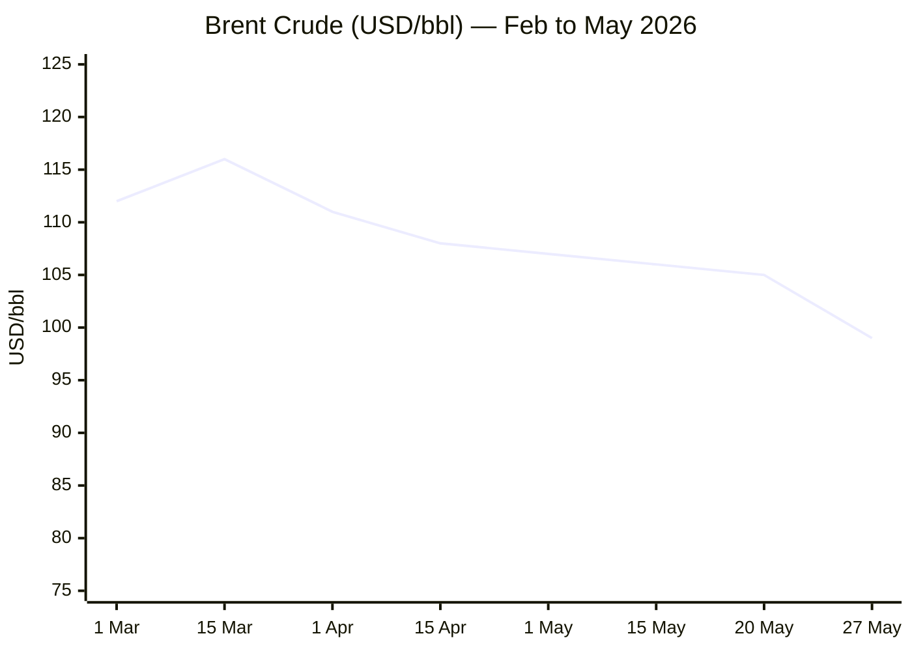
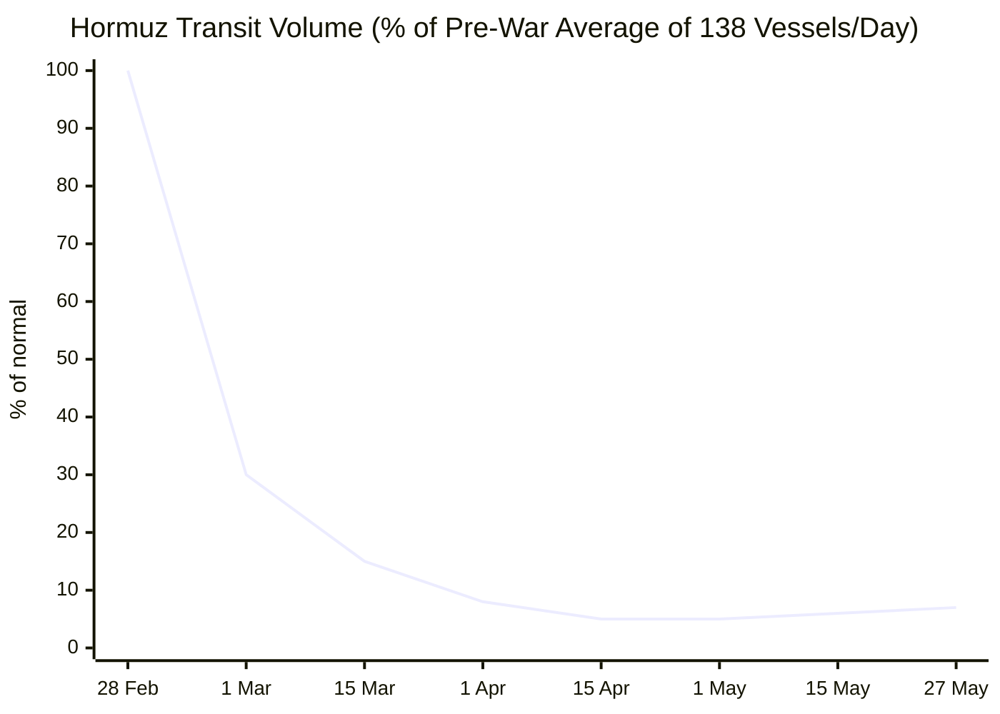

````yaml
---
brief_date: 2026-05-27
version: v1.2.1
run_time: "05:30 CET"
stories_published: 14
categories: [conflict, business, eu_affairs, technology, trends]
alert_counts:
  red: 4
  yellow: 9
  green: 1
ongoing_situations:
  - {name: "2026 Iran–US War / Hormuz Crisis", real_world_start: "2026-02-28", day: 89}
  - {name: "Russia–Ukraine War", real_world_start: "2022-02-24", day: 1554}
  - {name: "Israel–Lebanon Ceasefire", real_world_start: "2024-11-27", day: 547}
sources_fetched: 10
fetch_status:
  le_monde: "❌"
  faz: "❌"
  kommersant: "❌"
  xinhua: "⚠️"
  european_parliament: "⚠️"
expansion_queue: []
---
````

---

# 🌐 MORNING BRIEF
## Wednesday, 27 May 2026 · 05:30 CET
### 14 stories across 5 categories

---

## DIGEST SUMMARY

| # | Category | Headline | Alert |
|---|----------|----------|-------|
| 1 | ⚔️ Conflict | Trump says Iran deal "largely negotiated"; Strait de-mining on the table — Tehran disputes | 🔴 |
| 2 | ⚔️ Conflict | Russia threatens mass strikes on Kyiv "decision-making centres"; Lavrov urges US embassy evacuation | 🔴 |
| 3 | ⚔️ Conflict | Storm Shadow destroys Russian military infrastructure in Luhansk; Kramatorsk hit | 🟡 |
| 4 | 💼 Business | Brent falls below $100; WTI at $93.12 as Iran deal optimism advances | 🟡 |
| 5 | 💼 Business | Global equities rally: S&P 500 +0.89%, DAX +1.14%, CAC 40 +1.9% | 🟡 |
| 6 | 💼 Business | Eurozone PMI contracts at fastest pace since late 2023; EC cuts EU 2026 growth to 1.1% | 🔴 |
| 7 | 🇪🇺 EU Affairs | EP and Council provisionally agree EU–US trade implementing legislation | 🟡 |
| 8 | 🇪🇺 EU Affairs | Slovakia: EP votes 418–207 to threaten EU fund conditionality over rule-of-law | 🟡 |
| 9 | 🇪🇺 EU Affairs | EP Conference of Presidents denounces Russia's "unfounded allegations" against Baltic states | 🟢 |
| 10 | 🤖 Technology | Project Glasswing: 50+ companies given Claude Mythos preview; US Treasury convenes bank CEOs | 🟡 |
| 11 | 🤖 Technology | EU AI Act: bulk of obligations to apply 2 August 2026 — countdown underway | 🟡 |
| 12 | 📈 Trends | FAO warns systemic agrifood shock within 6–12 months; UK FM calls it "global food crisis" | 🔴 |
| 13 | 📈 Trends | Pakistan cements role as structural Middle East mediator as talks intensify | 🟡 |
| 14 | 📈 Trends | EC Spring 2026 Forecast: EU structural energy vulnerability deepens under second shock | 🟡 |

> Alert Level key: 🔴 High significance · 🟡 Developing · 🟢 Stable/Routine

---

## 🚨 SIGNAL BOARD

🔴 **Brent crude fell below $100/bbl for the first time in weeks — deal optimism is pricing in Hormuz re-opening, but Tehran's own state media says the US characterisation is "incomplete and inconsistent with reality."**
🔴 **Russia explicitly warned the US it intends to strike Kyiv "decision-making centres" and urged Washington to evacuate its diplomatic personnel — an escalation signal of the highest order.**
🟡 **The Eurozone economy contracted in May at its fastest pace since late 2023, with the European Commission cutting its 2026 EU growth forecast to 1.1% and inflation to 3.1% — a full percentage point above autumn projections.**
🟡 **EU–US trade implementing legislation provisionally agreed; safeguard mechanism included allowing Brussels to suspend tariff reductions if US commitments are not met.**
⚡ **S&P 500 +0.89%, DAX +1.14%, CAC 40 +1.9% — markets are front-running a Hormuz deal despite unresolved sticking points on nuclear programme, Iran sovereignty over the strait, and active US strikes near the waterway.**

---

## 🔄 ONGOING SITUATIONS

| Situation | Real-world start | Day # | Last significant development | Status |
|-----------|-----------------|-------|------------------------------|--------|
| 2026 Iran–US War / Hormuz Crisis | 28 Feb 2026 | Day 89 | Trump says deal "largely negotiated"; framework includes 60-day ceasefire extension and Hormuz de-mining; Iran disputes US characterisation; US strikes near strait reported (26 May) | 🔴 Active |
| Russia–Ukraine War | 24 Feb 2022 | Day 1,554 | Russia announces planned mass attacks on Kyiv "decision-making centres"; Lavrov urges US embassy evacuation; Oreshnik strike 24 May (4 dead, 100+ injured); Storm Shadow hits Luhansk (26 May) | 🔴 Active |
| Israel–Lebanon Ceasefire | 27 Nov 2024 | Day 547 | Trump announced 3-week ceasefire extension (24 Apr); second round of ambassador-level talks held; Hezbollah disarmament remains unresolved | 🟡 Ceasefire |

---

## ⚔️ CONFLICT ANALYST · 3 updates today

---

### 1. Iran–US War — Framework Deal Emerges, Hormuz De-mining on the Table 🔴
**Alert:** 🔴
**Summary:** President Trump posted on Truth Social that a deal with Iran has been "largely negotiated" encompassing the United States, Iran, and several regional countries, with the Strait of Hormuz set to reopen. The emerging framework reportedly includes a 60-day ceasefire extension and a memorandum of understanding as a first phase, ahead of broader nuclear and sanctions talks within 30–60 days. A flurry of mediation from Pakistan, Qatar, Saudi Arabia, and the UAE preceded the statement. Iran's state media and chief negotiator Ghalibaf flatly rejected Trump's characterisation, insisting the strait will remain under Iranian sovereignty and that the text exchanged is "incomplete and inconsistent with reality." Iran's IRGC separately accused the US of ceasefire violations after American forces struck sites near the Strait of Hormuz on 26 May. [MULTI-SOURCE]
**Significance:** The gap between Trump's public framing and Tehran's position remains material. Iran's refusal to cede sovereignty over the strait — combined with continued US military operations and an unresolved nuclear dossier — means the deal, if announced, will be fragile. Oil markets are nonetheless pricing in a re-opening; the risk is a sharp snap-back if talks collapse.
**Sources:**
- [CNBC — Trump says Iran deal reopening Strait of Hormuz 'largely negotiated'](https://www.cnbc.com/2026/05/23/us-iran-war-talks.html) · 23 May 2026
- [CNN — Iran and US edge toward deal to end war and reopen Hormuz](https://www.cnn.com/2026/05/23/middleeast/iran-us-progress-framework-diplomacy-intl) · 23 May 2026
- [Iran International — Iran and US edge toward framework deal](https://www.iranintl.com/en/202605233301) · 23 May 2026
**Trend:** ↘ De-escalating
**Tags:** #Iran #Hormuz #peace-talks #Pakistan-mediation #MULTI-SOURCE #nuclear

---

### 2. Russia–Ukraine War — Russia Threatens Mass Strikes on Kyiv; Lavrov Warns US Embassy 🔴
**Alert:** 🔴
**Summary:** Russian Foreign Minister Sergey Lavrov telephoned US Secretary of State Rubio on 25 May to announce that Moscow would begin systematic strikes on Kyiv's "decision-making centres" and urged Washington to evacuate diplomatic personnel. Russia's Foreign Ministry separately issued a public statement calling on foreign nationals to leave the Ukrainian capital. The warning follows the single largest Russian aerial attack on Kyiv since the full-scale invasion: an Oreshnik ballistic missile and drone strike on 24 May killed 4, injured over 100, and caused damage in every district of the capital. The Chornobyl Museum was among buildings struck. The EU vowed its diplomatic missions would remain in Kyiv.
**Significance:** Threatening the evacuation of US diplomatic staff escalates political risk significantly and tests Washington's tolerance for continued engagement on Ukraine while it pursues the Iran deal. Putin's simultaneous signing of legislation authorising military force abroad to "protect Russian citizens" adds to a pattern of deliberate legal and rhetorical escalation.
**Sources:**
- [Kyiv Independent — Lavrov warns Rubio of planned strikes on Kyiv's 'decision-making centres'](https://kyivindependent.com/lavrov-rubio-phone-call-may-25/) · 25 May 2026
- [Kyiv Independent — Russia announces plans for new mass attacks on Kyiv](https://kyivindependent.com/russia-announces-plans-for-new-mass-attacks-on-kyiv-including-on-decision-making-centers/) · 25 May 2026
- [Kyiv Independent — 'Damage in every district of Kyiv' — Massive Russian strike kills 4, injures 100](https://kyivindependent.com/russian-attack-may-24-2026/) · 24 May 2026
**Trend:** ↗ Escalating
**Tags:** #Russia #Ukraine #missile-strike #escalation #MULTI-SOURCE

---

### 3. Russia–Ukraine War — Storm Shadow Destroys Luhansk Infrastructure; Kramatorsk Hit 🟡
**Alert:** 🟡
**Summary:** Ukraine's General Staff confirmed on 26 May that British-supplied Storm Shadow cruise missiles struck and destroyed Russian military infrastructure in occupied Luhansk Oblast overnight, including what the General Staff described as a "position of the aggressor" in deep-held Russian rear territory. Separately, Russia carried out an airstrike on central Kramatorsk in Donetsk Oblast on 25 May, injuring at least 12 civilians. Ukraine's General Staff also reported striking a Russian oil facility in Bryansk Oblast, disrupting a key fuel supply line for Russian forces. According to Russia Matters analysis of ISW data, Russian forces registered a net territorial loss of 69 square miles across April 21–May 19.
**Significance:** Ukraine's continued use of long-range British munitions deep into occupied territory contradicts Russian threats of retaliation and demonstrates operational reach. The net Russian territorial reversal over April–May suggests momentum has shifted, even as Russia prepares a new escalatory aerial campaign.
**Sources:**
- [Kyiv Independent — Storm Shadow missiles 'destroy' Russian military infrastructure in occupied Luhansk](https://kyivindependent.com/storm-shadow-missiles-destroy-russian-military-infrastructure-in-occupied-luhansk-oblast-general-staff-says/) · 26 May 2026
- [Russia Matters — Russia–Ukraine War Report Card, May 20, 2026](https://www.russiamatters.org/news/russia-ukraine-war-report-card/russia-ukraine-war-report-card-may-20-2026) · 20 May 2026
**Trend:** → Stable
**Tags:** #Ukraine #Russia #frontline #drone-warfare #air-defense

📚 *Background reading:* [Kyiv Independent — How Ukraine's strikes inside Russia became a headache for its NATO allies](https://kyivindependent.com/how-ukraines-strikes-inside-russia-became-a-headache-for-its-nato-allies/) · [Al Jazeera — Putin hints at ending Russia's war in Ukraine, but why now?](https://www.aljazeera.com/news/2026/5/10/putin-hints-at-ending-russias-war-in-ukraine-but-why-now) · 10 May 2026

---

## 💼 BUSINESS ANALYST · 3 updates today

---

### 4. Brent Crude Falls Below $100 as Iran Deal Optimism Advances 🟡
**Alert:** 🟡
**Summary:** Brent crude fell to $99.18/bbl on 27 May — down 0.41% on the session and below the $100 psychological threshold — as markets priced in a potential Hormuz re-opening following Trump's "largely negotiated" deal announcement. WTI crude traded at $93.12/bbl, near a five-week low. Brent has now fallen roughly 15% from its March peak of $116/bbl, though it remains approximately 54% above year-earlier levels. The US Navy has resumed escorting tankers through Hormuz, and satellite data showed three supertankers crossing the strait this week. Iran's IRGC claimed it fired on an F-35 and drones that had entered Iranian airspace, maintaining uncertainty over whether the Strait is genuinely easing.

📎 *See also: Conflict § Story 1 — Iran–US deal framework; Hormuz de-mining on the table.*

**Market signal:** Cautiously bearish on oil in the near term if the deal materialises, though the Iran–IRGC disconnect and unresolved nuclear dossier keep a snap-back premium in place.
**Sources:**
- [Trading Economics — Brent crude oil price 27 May 2026](https://tradingeconomics.com/commodity/brent-crude-oil) · 27 May 2026
- [Trading Economics — Crude oil (WTI) price 27 May 2026](https://tradingeconomics.com/commodity/crude-oil) · 27 May 2026
**Trend:** ↘ De-escalating
**Tags:** #Brent #oil-price #Hormuz #Iran #energy-markets #supply-shock

---

### 5. Global Equities Rally on Hormuz Deal Hopes 🟡
**Alert:** 🟡
**Summary:** Major equity indices advanced on 27 May as markets front-ran the prospect of Strait of Hormuz reopening and associated inflationary relief. In Europe, the DAX rose 1.14% to 24,680, the CAC 40 gained 1.9% to 8,134, and the FTSE MIB added 1.71% to 49,199. In the US, the S&P 500 extended gains to 7,419 (+0.89%), the Nasdaq Composite rose 1.04% to 29,120, and the Dow Jones added 1.20% to 49,955. Financial stocks led, with Goldman Sachs +4.95%. Energy stocks underperformed, with ExxonMobil down 2.95% on lower crude. Gold retreated slightly to approximately $4,494/oz, with the safe-haven bid easing on deal optimism.
**Market signal:** Bullish in the near term on ceasefire-trade and inflation-relief narrative, but fragility is high — Russia's escalation against Kyiv and an unresolved Iran nuclear track represent credible reversal triggers.
**Sources:**
- [Trading Economics — Market data, 27 May 2026](https://tradingeconomics.com/commodity/brent-crude-oil) · 27 May 2026
**Trend:** ↗ Escalating
**Tags:** #equity-rally #SP500 #Nasdaq #Brent #gold #MULTI-SOURCE

---

### 6. Eurozone Economy Contracts in May; EC Cuts 2026 EU Growth to 1.1% 🔴
**Alert:** 🔴
**Summary:** S&P Global's flash Eurozone PMI for May 2026 showed the bloc's economy contracting at its fastest pace since late 2023, driven by a war-fuelled surge in living costs. S&P Global warned the data is consistent with inflation approaching 4% in the coming months, sending money markets to price in at least two ECB rate hikes before year-end. The European Commission's Spring 2026 Economic Forecast (21 May) cut EU GDP growth for 2026 to 1.1% — down 0.3 percentage points from the Autumn 2025 forecast — with the eurozone even weaker at 0.9%. EU inflation was revised up a full percentage point to 3.1% for 2026. Germany's growth was cut to 0.6%, France to 0.8%. [MULTI-SOURCE]
**Market signal:** Bearish for the euro area: stagnating activity combined with energy-driven inflation is narrowing ECB room for manoeuvre and heightens stagflation risk.
**Sources:**
- [European Commission — EU economy forecast to slow amid rising inflation following energy shock](https://commission.europa.eu/news-and-media/news/eu-economy-forecast-slow-down-amid-rising-inflation-following-energy-shock-2026-05-21_en) · 21 May 2026
- [Euronews — EU cuts 2026 growth forecast as Strait of Hormuz crisis pushes inflation up](https://www.euronews.com/my-europe/2026/05/21/eu-cuts-2026-growth-forecast-as-strait-of-hormuz-crisis-pushes-inflation-up) · 21 May 2026
**Trend:** ↘ De-escalating
**Tags:** #GDP-forecast #inflation #ECB #eurozone #stagflation #EU-institutions #MULTI-SOURCE #data-point

📚 *Background reading:* [Bruegel](https://www.bruegel.org) · [ECFR — European foreign policy analysis](https://ecfr.eu/)

---

## 🇪🇺 EU AFFAIRS ANALYST · 3 updates today

---

### 7. EU–US Trade Implementing Legislation Provisionally Agreed 🟡
**Alert:** 🟡
**Summary:** The European Parliament and the Council of the EU reached provisional agreement on 20 May on two pieces of legislation implementing the tariff commitments of the August 2025 EU–US Joint Statement. Under the deal — originally struck at Turnberry in July 2025 — the EU will eliminate tariffs on US industrial goods while US tariffs on most EU goods are capped at 15%. The implementing legislation includes a safeguard mechanism enabling the Commission to suspend tariff reductions if the US fails to honour its commitments, or if US tariffs on EU steel and aluminium derivatives remain above 15% by end-2026. Von der Leyen called on co-legislators to move swiftly to finalise the process ahead of Trump's stated July 4 deadline.
**Legislative/policy stage:** Provisional agreement reached between EP and Council; formal vote in plenary pending.
**Sources:**
- [Council of the EU — EU–US trade: Council and Parliament strike deal on tariff elements](https://www.consilium.europa.eu/en/press/press-releases/2026/05/20/eu-us-trade-council-and-parliament-strike-a-deal-to-implement-the-tariff-elements-of-the-joint-statement/) · 20 May 2026
- [CNBC — Trump tariffs: EU clears major hurdle to finalize US trade deal](https://www.cnbc.com/amp/2026/05/20/eu-us-trade-deal-trump-autos.html) · 20 May 2026
**Trend:** ↘ De-escalating
**Tags:** #EU-institutions #single-market #sanctions #FX #MULTI-SOURCE

---

### 8. Slovakia: EP Votes 418–207 to Threaten EU Fund Conditionality 🟡
**Alert:** 🟡
**Summary:** The European Parliament adopted a resolution by 418 votes in favour and 207 against during its 18–21 May plenary, urging the European Commission to assess whether Slovakia faces a "clear risk of a serious breach" of EU founding values under Article 7 of the Treaty. MEPs demanded the Commission make full use of all available enforcement instruments, including potentially triggering the budget conditionality mechanism to freeze EU funds. Concerns centre on judicial independence, media freedom, and criminal law amendments that Amnesty International and legal experts warn undermine the rule of law. Germany's MEP Reintke (Greens) stated Slovakia risks becoming "a new Hungary." This was the second such Parliament resolution on Slovakia within a month.
**Legislative/policy stage:** Parliament resolution adopted; Commission must now formally respond; Article 7 and conditionality proceedings not yet initiated.
**Sources:**
- [European Parliament Press Room — Slovakia: MEPs demand action to protect EU values and the EU budget](https://www.europarl.europa.eu/news/en/press-room/20260513IPR43308/slovakia-meps-demand-action-to-protect-eu-values-and-the-eu-budget) · 20 May 2026
**Trend:** ↗ Escalating
**Tags:** #EU-institutions #rule-of-law #EU-funds #EU-election #institutional

---

### 9. EP Conference of Presidents: Full Solidarity with Baltic States Against Russian Allegations 🟢
**Alert:** 🟢
**Summary:** The European Parliament's Conference of Presidents issued a statement of full solidarity with Latvia, Estonia, and Lithuania on 21 May following Russia's announcement that it intends to bring a case before the International Court of Justice alleging discrimination against Russian-speaking minorities in all three Baltic states. Estonia's government called the manoeuvre a deliberate "disinformation campaign" and said Moscow was exploiting international legal processes for political warfare. Russia's allegations focus on language policy restrictions, access to public services, and educational rights. Baltic MEPs called for an EU-level response within the CFSP framework.
**Legislative/policy stage:** EP statement issued; no EU legislative action proposed as yet; ICJ filing by Russia not yet formally submitted.
**Sources:**
- [European Parliament Press Room — EP Conference of Presidents expresses full solidarity with the Baltic states](https://www.europarl.europa.eu/news/en/press-room/20260521IPR43704/ep-conference-of-presidents-expresses-full-solidarity-with-the-baltic-states) · 21 May 2026
- [Kyiv Independent — 'Disinformation campaign' — Estonia slams Russia's planned UN court case against Baltic states](https://kyivindependent.com/disinformation-campaign-estonia-slams-russias-planned-un-court-case-against-baltics/) · 25 May 2026
**Trend:** ↗ Escalating
**Tags:** #EU-institutions #Russia #disinformation #diplomacy #EU-defence

📚 *Background reading:* [ECFR — European strategic autonomy and Russia](https://ecfr.eu/) · [Atlantic Council — Baltic security analysis](https://www.atlanticcouncil.org)

---

## 🤖 TECHNOLOGY ANALYST · 2 updates today

---

### 10. Project Glasswing: 50+ Firms Given Claude Mythos Preview; US Treasury Convenes Bank CEOs Over Cybersecurity Risk 🟡
**Alert:** 🟡
**Summary:** Anthropic's Project Glasswing — launched in April 2026 — has given approximately 50 companies, including Amazon Web Services, Apple, Broadcom, Cisco, CrowdStrike, Google, JPMorgan Chase, Microsoft, and Nvidia, preview access to Claude Mythos, an unreleased and more advanced AI model, for defensive cybersecurity purposes. Anthropic initiated the programme after internally assessing that Mythos could "reshape the cybersecurity sector" via agentic coding and reasoning capabilities. US Treasury Secretary Scott Bessent subsequently convened a meeting of major bank CEOs — including Goldman Sachs, Bank of America, and Citigroup — to discuss cybersecurity risks arising from the model's capability to identify previously unknown software vulnerabilities at machine scale. The World Economic Forum separately warned of a growing gap between AI-driven threat acceleration and institutional response capacity.
**Analyst note:** Within 12–24 months, Mythos-class models are likely to make large-scale automated vulnerability exploitation feasible without expert human steering, materially raising the threat baseline for critical financial and government infrastructure and accelerating demand for AI-native security tooling.
**Sources:**
- [Fortune — Anthropic is giving companies access to its unreleased Claude Mythos model](https://www.fortune.com/2026/04/07/anthropic-claude-mythos-model-project-glasswing-cybersecurity) · 07 April 2026
- [WEF — Anthropic's Mythos moment: how frontier AI is redefining cybersecurity](https://www.weforum.org/stories/2026/04/anthropic-mythos-ai-cybersecurity/) · April 2026
- [TLT — AI Brief: May 2026](https://www.tlt.com/insights-and-events/insight/ai-brief-may-2026) · May 2026
**Trend:** ↗ Escalating
**Tags:** #AI #LLM #cyber #AI-safety #AI-benchmark #autonomous-systems #MULTI-SOURCE

---

### 11. EU AI Act: Bulk of Obligations Apply 2 August 2026 — Compliance Deadline Approaches 🟡
**Alert:** 🟡
**Summary:** The bulk of the EU AI Act's remaining obligations — covering high-risk AI systems, general-purpose AI models, and transparency requirements — take effect on 2 August 2026, ten weeks from the run date. Law firms across the EU have flagged widespread non-compliance risk, particularly for companies deploying AI in employment, credit scoring, biometric identification, and critical infrastructure. The Act's obligations on prohibited AI practices and general-purpose AI models have already applied since August 2025. The EU Artificial Intelligence Office, charged with enforcement, has begun issuing guidance, but detailed implementing regulations remain incomplete in several areas. Industry groups have called for a further enforcement grace period.
**Analyst note:** Companies operating in the EU that have not completed AI system inventories and conformity assessments by 2 August 2026 face formal enforcement risk; within the 12–24 month window, early enforcement actions against high-profile non-compliant systems are likely to create significant precedent.
**Sources:**
- [TLT — AI Brief: May 2026](https://www.tlt.com/insights-and-events/insight/ai-brief-may-2026) · May 2026
**Trend:** → Stable
**Tags:** #AI-regulation #digital-regulation #EU-institutions #AI #LLM #institutional

📚 *Background reading:* [CSIS — AI governance and regulation](https://www.csis.org) · [WEF — Global Cybersecurity Outlook 2026](https://www.weforum.org)

---

## 📈 TRENDS ANALYST · 3 updates today

---

### 12. FAO Warns of Systemic Agrifood Shock; UK FM: "World Is Sleepwalking Into a Global Food Crisis" 🔴
**Alert:** 🔴
**Summary:** The UN's Food and Agriculture Organisation warned in a podcast published on 20 May that the Strait of Hormuz closure is "not a temporary shipping disruption but the beginning of a systemic agrifood shock" that could trigger a severe global food price crisis within six to twelve months if the strait remains blocked. The FAO Food Price Index reached 130.7 in April 2026 — up 1.6% from March and 2.0% year-on-year — driven by vegetable oils and cereals. Approximately 20% of global seaborne fertiliser exports originate from the Arabian Gulf; ING analysts warned a prolonged closure will "significantly tighten fertiliser availability" in Brazil, India, South Asia, and parts of the EU. UK Foreign Secretary Yvette Cooper stated that the world is "sleepwalking into a global food crisis," warning the agriculture clock is running out as the planting and fertilisation window closes.
**Horizon:** Long-term — if the Hormuz closure extends into Q3 2026, fertiliser shortfalls and elevated food commodity prices will structurally raise food insecurity globally for 12–24 months, with greatest exposure in import-dependent sub-Saharan Africa and South Asia.
**Sources:**
- [GlobalSecurity / FAO — Strait of Hormuz conflict threatens global food prices as FAO warns time is running out](https://www.globalsecurity.org/wmd/library/news/iran/2026/05/iran-260520-fao01.htm) · 20 May 2026
- [TIME — Lawmaker warns of 'global food crisis,' urges immediate Hormuz reopening](https://time.com/article/2026/05/19/global-food-crisis-concerns-strait-of-hormuz-iran-trade-choke-hold/) · 19 May 2026
**Trend:** ↗ Escalating
**Tags:** #food-security #food-prices #Hormuz #Iran #shipping #supply-shock #humanitarian #MULTI-SOURCE

---

### 13. Pakistan Cements Structural Role as Middle East Mediator 🟡
**Alert:** 🟡
**Summary:** Pakistan's emergence as the indispensable mediating power in the Iran–US conflict has deepened materially this week. Field Marshal Asim Munir, Pakistan's Army Chief, personally joined mediation efforts in Tehran on 23 May after Interior Minister Mohsin Naqvi's meetings reportedly shifted negotiations "in an important direction." Talks are running in parallel with Qatari mediation channels coordinated with Washington. Pakistan has mediated the 8 April ceasefire, subsequent extensions, and now the near-final framework discussions. Issues under active negotiation include Hormuz freedom of navigation, Iran's nuclear and ballistic programme, sanctions relief, and reconstruction.
**Horizon:** Medium-term — Pakistan's success in managing the Iran–US channel will durably elevate its strategic standing with both Washington and Gulf states, reshaping its leverage in the region over the next 12 months regardless of whether a final deal is reached.
**Sources:**
- [Iran International — Iran and US edge toward deal; Pakistan mediation intensifies](https://www.iranintl.com/en/202605233301) · 23 May 2026
- [Commons Library — US–Iran ceasefire and nuclear talks in 2026](https://commonslibrary.parliament.uk/research-briefings/cbp-10637/) · 25 May 2026
**Trend:** ↗ Escalating
**Tags:** #Pakistan-mediation #Iran #peace-talks #diplomacy #mediation #MULTI-SOURCE

---

### 14. EC Spring 2026 Forecast: EU Structural Energy Vulnerability Deepens Under Second Shock 🟡
**Alert:** 🟡
**Summary:** The European Commission's Spring 2026 Economic Forecast (published 21 May) explicitly frames the Middle East conflict as the EU's second major energy shock in five years — after Russia's 2022 invasion of Ukraine — and warns the bloc's net-importer status renders it disproportionately exposed compared to the United States. The forecast projects eurozone growth of just 0.9% in 2026, with Germany at 0.6% and France at 0.8%. EU inflation is expected to reach 3.1%. The Commission called for fiscal support to remain "temporary and targeted," urged acceleration of fossil fuel diversification, and highlighted a special issue on the "AI adoption divide" — with the US benefiting from AI-driven investment while Europe lags.

📎 *See also: Business § Story 6 — Eurozone PMI contraction and EC forecast details.*

**Horizon:** Long-term — the structural energy dependence exposed by two shocks within five years is accelerating political pressure for faster renewables build-out and EU-level energy diversification; however, short-term fiscal constraints and political fragmentation limit the speed of adjustment.
**Sources:**
- [European Commission — Spring 2026 Economic Forecast](https://commission.europa.eu/news-and-media/news/eu-economy-forecast-slow-down-amid-rising-inflation-following-energy-shock-2026-05-21_en) · 21 May 2026
**Trend:** ↘ De-escalating
**Tags:** #GDP-forecast #EU-institutions #energy-policy #energy-transition #inflation #eurozone #institutional

📚 *Background reading:* [Bruegel — EU energy policy analysis](https://www.bruegel.org) · [ECFR — European strategic autonomy](https://ecfr.eu/)

---

## 📊 KEY DATA OF THE DAY

> 📊 **DATA OFFICER** · 7 indicators

| Indicator | Value | Δ vs prior session | Δ vs 7 days ago | Note | Source | URL |
|-----------|-------|-------------------|-----------------|------|--------|-----|
| EUR/USD | 1.1634 | +0.03% | +0.27% vs 20 May (1.1626) | Euro rebounds from 6-wk low on Iran deal hopes; ECB rate hike bets building | ECB / Trading Economics | [link](https://tradingeconomics.com/euro-area/currency) |
| Brent Crude (USD/bbl) | 99.18 | −0.41% | −5.54% vs 20 May (104.99) | Below $100 psychological level; Hormuz deal optimism driving decline; year-on-year still +54% | Trading Economics / EIA | [link](https://tradingeconomics.com/commodity/brent-crude-oil) |
| Gold (XAU/USD) | ~4,494 | N/A (26 May close) | −0.91% vs 20 May (4,535) | Safe-haven bid easing on deal optimism; down from recent highs | Trading Economics | [link](https://tradingeconomics.com/commodity/brent-crude-oil) |
| IMF Global Growth 2026 | 3.1% | vs Jan WEO: −0.2 pp | vs Oct WEO: 0.0 pp | Reference forecast assumes limited-duration Middle East conflict; severe scenario: 2.0% | IMF WEO April 2026 | [link](https://www.imf.org/en/publications/weo/issues/2026/04/14/world-economic-outlook-april-2026) |
| EU CPI YoY (April 2026) | 3.0% | vs March: +0.4 pp | vs January (1.7%): +1.3 pp | Highest since September 2023; energy +10.9%, driven by Middle East conflict | Eurostat | [link](https://ec.europa.eu/eurostat/web/products-euro-indicators/w/2-20052026-ap) |
| FAO Food Price Index | 130.7 (April 2026) | vs March: +1.6% | April 2026 — latest available (May release: 5 June) | Third consecutive monthly rise; vegetable oils and cereals leading; Hormuz supply fears embedded | FAO | [link](https://www.fao.org/newsroom/detail/fao-food-price-index-up-for-third-consecutive-month-largely-on-rising-vegetable-oil-prices/en) |
| Strait of Hormuz Transit Volume | ~5–7% of pre-war daily average | N/A | N/A | Pre-war norm: ~138 vessels/day; April Kpler avg: ~5%; 47 vessels in transit at 27 May (straits.live); escalation probability 62 (high) | Kpler / JMIC / UANI | [link](https://www.unitedagainstnucleariran.com/index.php/blog/iran-war-shipping-update-may-5-2026) |

**Data commentary:** The brief today is defined by two contradictory signals: oil markets are pricing a Hormuz deal that does not yet exist on paper, while the eurozone PMI and EC Spring Forecast confirm the economic damage already done is severe and accelerating. The FAO Food Price Index at 130.7 captures a structural risk that oil prices alone do not: the fertiliser and food commodity pipeline is running short, and the six-to-twelve month lag before harvest-level shortfalls become apparent means policymakers have a narrowing window to act.

---

## 📊 CHARTS

### Chart 1 — Brent Crude Trajectory (War-Period Peak to Present)



### Chart 2 — Strait of Hormuz Transit Volume (% of Pre-War Daily Average)



---

## ⚙️ AGENT METADATA

| Field | Value |
|-------|-------|
| Agent version | MORNING BRIEF v1.2.1 |
| Run timestamp | 2026-05-27T05:30:14+02:00 |
| Fetch status | Le Monde ❌ · FAZ ❌ · Kommersant ❌ · Xinhua ⚠️ (content dated 24 Apr, outside 24h window) · EP ⚠️ (navigation structure only; press release content captured via search) |
| Sources queried | 10 / 11 (World Bank not queried; Tier 3 excluded from tally) |
| Stories surfaced | ~26 (pre-filter candidate pool) |
| Stories published | 14 (post-editorial filter) |
| Languages processed | EN, FR (EC/Eurostat sources), DE (Bundesliga no — EC sources) |
| Output language | English (British) |
| Date validated | ✅ Confirmed 27 May 2026 |
| Expansion Queue | None |

---

*MORNING BRIEF is an AI-assisted digest. All summaries are paraphrased from original sources. Verify time-sensitive information at the linked URLs before acting. Output language: British English.*
