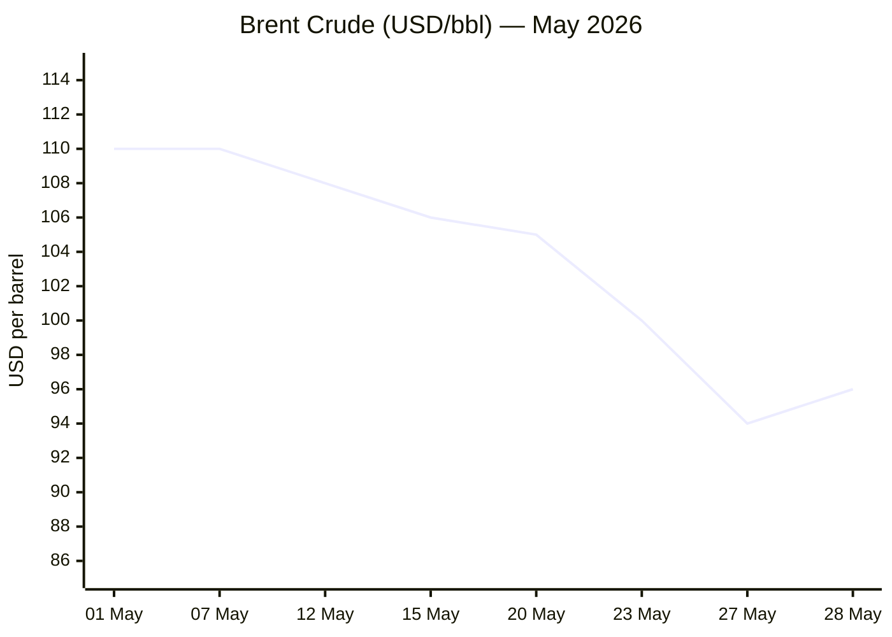
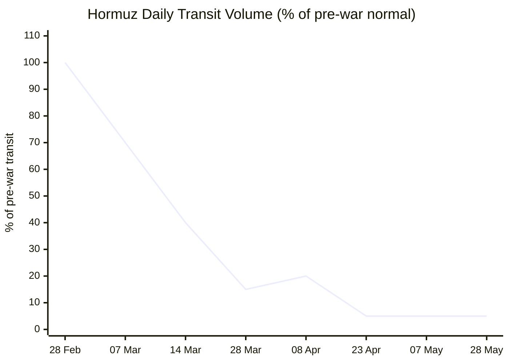

```yaml
---
brief_date: 2026-05-28
version: v1.2.1
run_time: "05:30 CET"
stories_published: 13
categories: [conflict, business, eu_affairs, technology, trends]
alert_counts:
  red: 4
  yellow: 8
  green: 1
ongoing_situations:
  - {name: "2026 Iran-US War / Hormuz Crisis", real_world_start: "2026-02-28", day: 90}
  - {name: "Russia-Ukraine War", real_world_start: "2022-02-24", day: 1555}
  - {name: "2026 Israel-Lebanon Ceasefire", real_world_start: "2026-04-16", day: 43}
sources_fetched: 11
fetch_status:
  le_monde: "❌"
  faz: "❌"
  kommersant: "❌"
  xinhua: "⚠️"
  european_parliament: "❌"
expansion_queue: []
---
```

---

# 🌐 MORNING BRIEF
## Thursday, 28 May 2026 · 05:30 CET
### 13 stories across 5 categories

---

## DIGEST SUMMARY

| # | Category | Headline | Alert |
|---|----------|----------|-------|
| 1 | ⚔️ Conflict | Russia fires Oreshnik on Kyiv Oblast; warns diplomats to leave | 🔴 |
| 2 | ⚔️ Conflict | Iran-US: US self-defence strikes, IRGC threatens response, Camp David talks | 🔴 |
| 3 | ⚔️ Conflict | Israel-Lebanon: Israeli strikes intensify despite Day-43 ceasefire | 🟡 |
| 4 | 💼 Business | Brent rebounds to $96.30 as Hormuz partial transit resumes | 🟡 |
| 5 | 💼 Business | S&P 500 holds near record; equity rally underpinned by Iran deal optimism | 🟢 |
| 6 | 🇪🇺 EU Affairs | EC Spring 2026 Forecast: eurozone GDP 0.9%, EU inflation 3.1% | 🟡 |
| 7 | 🇪🇺 EU Affairs | Italy's SAFE defence-fund decision due by end-May — Treasury still undecided | 🔴 |
| 8 | 🇪🇺 EU Affairs | ECB June rate hike all-but-confirmed; Demarco: "probably need to hike" | 🟡 |
| 9 | 🤖 Technology | Micron joins $1 trillion club on AI memory boom | 🟡 |
| 10 | 🤖 Technology | Microsoft SharePoint zero-day CVE-2026-32201 under active exploitation | 🔴 |
| 11 | 🤖 Technology | AMD begins 2nm EPYC "Venice" production; AI compute competition intensifies | 🟡 |
| 12 | 📈 Trends | Hormuz: ADNOC warns full oil-flow recovery unlikely before 2027 | 🟡 |
| 13 | 📈 Trends | UK/Europe record May heat; London hits 35°C for second consecutive day | 🟡 |

> Alert Level key: 🔴 High significance · 🟡 Developing · 🟢 Stable/Routine

---

## 🚨 SIGNAL BOARD

🔴 Russia deploys Oreshnik IRBM against Kyiv Oblast for the third time — 90 missiles and 600 drones in the largest combined attack of 2026; Russia issues unprecedented warning to foreign diplomats to evacuate Kyiv
🔴 US CENTCOM confirms further "self-defence" strikes on Iranian missile sites and boats (May 25–26); IRGC states a "legitimate right" to respond, threatening fragile ceasefire
🟡 Brent rebounds +2.13% to $96.30 on Iranian state-TV draft-deal reports — still down 8.3% over 7 days; peace optimism vs ceasefire violations pulling in opposite directions
🟢 S&P 500 extends gains near record; Micron Technology crosses $1 trillion on AI memory shortage
⚡ Eurozone CPI confirmed at 3.0% in April 2026 — highest since September 2023 — virtually certain to trigger ECB's first rate hike since the inflation tightening cycle of 2022–23

---

## 🔄 ONGOING SITUATIONS

| Situation | Real-world start | Day # | Last significant development | Status |
|-----------|-----------------|-------|------------------------------|--------|
| 2026 Iran-US War / Hormuz Crisis | 28 Feb 2026 | Day 90 | US self-defence strikes May 25–26; Iran threatens response; Camp David talks May 27 | 🔴 Active |
| Russia-Ukraine War | 24 Feb 2022 | Day 1,555 | Oreshnik strike on Kyiv Oblast May 24; Russia warns diplomats to evacuate capital | 🔴 Active |
| 2026 Israel-Lebanon Ceasefire | 16 Apr 2026 | Day 43 | 45-day extension in effect; Israel signals Hezbollah strikes intensifying | 🟡 Ceasefire |

---

## ⚔️ CONFLICT

> 🔎 **CONFLICT ANALYST** · 3 updates today

### 1. Russia-Ukraine War — Oreshnik strike on Kyiv; diplomats warned to evacuate 🔴

**Alert:** 🔴
**Summary:** Russian forces launched one of the largest combined missile and drone attacks of 2026 against Kyiv overnight on 24 May, deploying 90 missiles and 600 drones — including the Oreshnik hypersonic intermediate-range ballistic missile against targets in Bila Tserkva, Kyiv Oblast, marking its third operational use. Mayor Vitali Klitschko reported damage "in every district of the city." Four people were killed and more than 100 injured. Russia's MFA subsequently told foreign nationals and diplomatic personnel to leave Kyiv, warning of further precision strikes on "decision-making centres and drone manufacturing facilities." Al Jazeera analysts described the move as a significant escalatory signal, coming as ISW data records Russia losing a net 29 square miles of Ukrainian territory in the week of 12–19 May.
**Significance:** The third Oreshnik deployment — a hypersonic IRBM incapable of interception — combined with the diplomatic warning represents a calibrated escalation signal designed to shift the psychological burden of the conflict while Russia's frontline position deteriorates. Diplomatic evacuation warnings have not previously been issued during this war.
**Sources:**
- [Kyiv Independent — Massive Russian ballistic missile, drone attack kills 4, injures 100](https://kyivindependent.com/russian-attack-may-24-2026/) · 24 May 2026
- [Al Jazeera — 'Leave Kyiv': Why Russia's latest Ukraine threat is a major escalation](https://www.aljazeera.com/news/2026/5/26/leave-kyiv-why-russias-latest-ukraine-threat-is-a-major-escalation) · 26 May 2026
- [Russia Matters — Ukraine War Report Card, May 20, 2026](https://www.russiamatters.org/news/russia-ukraine-war-report-card/russia-ukraine-war-report-card-may-20-2026) · 20 May 2026

**Trend:** ↗ Escalating
**Tags:** #Russia #Ukraine #missile-strike #frontline #MULTI-SOURCE

---

### 2. 2026 Iran-US War — US strikes Iranian boats; IRGC threatens response amid Camp David talks 🔴

**Alert:** 🔴
**Summary:** US CENTCOM confirmed further "self-defence strikes" on Iranian missile launch sites and boats in southern Iran on 25–26 May, the latest in a series of military incidents punctuating the ceasefire in force since 8 April. Iran's IRGC stated a "legitimate right" to respond to what it called "unlawful" ceasefire violations and accused Washington of "maritime robbery" against Iranian commercial vessels. Despite these flashpoints, diplomatic activity remains active: Pakistani and Qatari negotiators held sessions in Doha with Iranian counterparts, while Trump convened a Cabinet meeting at Camp David on 27 May to assess the emerging framework. An unofficial draft MoU reported by Iranian state television was promptly dismissed by the White House as "a complete fabrication." Brent crude rebounded from a five-week low on 28 May as mixed signals persist.
**Significance:** The ceasefire has now entered a pattern of periodic military exchanges combined with parallel negotiations — a dynamic that elevates the risk of miscalculation at precisely the moment a deal framework appears closest to resolution. Any full collapse of the ceasefire would immediately drive energy prices back above $110/bbl.
**Sources:**
- [CNN — US and Iran militaries trade shots as ceasefire tensions escalate](https://www.cnn.com/2026/05/25/world/live-news/iran-war-us-peace-deal) · 25 May 2026
- [CNBC — Trump says Iran deal reopening Strait of Hormuz 'largely negotiated'](https://www.cnbc.com/2026/05/23/us-iran-war-talks.html) · 23 May 2026
- [CBS News — Iran-US negotiators agree to broad principles](https://www.cbsnews.com/live-updates/iran-war-trump-us-peace-talks-strait-of-hormuz-control/) · 25 May 2026

**Trend:** → Stable
**Tags:** #Iran #Hormuz #ceasefire #peace-talks #Pakistan-mediation #MULTI-SOURCE

---

### 3. 2026 Israel-Lebanon Ceasefire — Israel signals escalation; paramedic strike kills four 🟡

**Alert:** 🟡
**Summary:** The 45-day ceasefire extension agreed around 14 May remains formally in force, but Israel has signalled intent to intensify operations against Hezbollah infrastructure in Lebanon. On 26 May, Israeli forces struck an ambulance centre in Hanawieh, Tyre district, killing four civil defence paramedics — drawing immediate condemnation from Lebanon's Health Ministry. The same day, Israel confirmed further strikes in southern Lebanon. Hezbollah has publicly refused to accept the terms being negotiated by Israel and Lebanon at ambassador level in Washington, complicating any path to a durable settlement. The 2026 Lebanon war has killed more than 2,000 people and displaced over one million, according to figures cited at the April Cyprus summit.
**Significance:** Hezbollah's refusal to be bound by Israeli-Lebanese talks means any bilateral deal would face immediate challenges to implementation. The pattern of Israeli strikes during the ceasefire risks provoking a Hezbollah response that widens into full resumption of hostilities.
**Sources:**
- [CBS News — Israel signals Hezbollah strike intensification; US strikes Iranian targets](https://www.cbsnews.com/live-updates/iran-war-trump-us-peace-talks-strait-of-hormuz-control/) · 26 May 2026
- [CFR — Israel-Lebanon Ceasefire Extended for Three Weeks](https://www.cfr.org/articles/israel-lebanon-ceasefire-extended-for-three-weeks) · 24 April 2026

**Trend:** ↗ Escalating
**Tags:** #Israel #Lebanon #Hezbollah #ceasefire #humanitarian

📚 *Background reading:* [Kyiv Independent — Russian attack May 24, 2026](https://kyivindependent.com/russian-attack-may-24-2026/) · [Al Jazeera — Leave Kyiv: Russia's escalation explained](https://www.aljazeera.com/news/2026/5/26/leave-kyiv-why-russias-latest-ukraine-threat-is-a-major-escalation)

---

## 💼 BUSINESS

> 💼 **BUSINESS ANALYST** · 2 updates today

### 1. Brent rebounds to $96.30 as Hormuz partial transit and Iran deal signals lift prices 🟡

**Alert:** 🟡
**Summary:** Brent crude rose to $96.30/bbl on 28 May (+2.13% from the prior session), recovering from the near five-week low reached on 27 May after Iranian state television reported details of an unofficial draft MoU. The rebound came after the White House denied the report as fabricated and after two non-Iranian supertankers successfully transited Hormuz on 26 May — the first unrestricted crossings in a week. The strait remains largely closed, with transit running at approximately 5% of pre-war volume. Brent has now fallen 8.3% over the past 7 days on accumulating optimism about a deal, but is still around 52% above levels recorded before the conflict began on 28 February.
**Market signal:** Mildly bullish on intraday Iran deal optimism, but structurally bearish while ceasefire violations continue and Hormuz remains functionally closed.
**Sources:**
- [Trading Economics — Brent Crude Oil price, 28 May 2026](https://tradingeconomics.com/commodity/brent-crude-oil) · 28 May 2026
- [Gulf News — Strait of Hormuz reopening: Limited tanker traffic resumes](https://gulfnews.com/business/energy/is-strait-of-hormuz-now-open-more-oil-lng-tankers-cross-gulf-chokepoint-1.500552390) · 25 May 2026

**Trend:** ↘ De-escalating
**Tags:** #Brent #oil-price #Hormuz #energy-markets #Iran #MULTI-SOURCE

📎 *See also: EU Affairs § Story 1 — EC Spring 2026 Forecast: eurozone growth downgraded to 0.9% in direct response to energy shock*

---

### 2. US equities hold near record highs as Iran deal optimism and semiconductor rally converge 🟢

**Alert:** 🟢
**Summary:** The S&P 500 closed at 7,473 on 26 May (+0.37%), with the Dow at 50,580 and the Nasdaq at 26,344. European indices also recovered: DAX +1.14%, CAC 40 +1.90%, FTSE MIB +1.74%. The gains were underpinned by a confluence of Iran deal optimism reducing energy-price risk and the historic surge in Micron Technology, which joined the $1 trillion market-cap club. Gold eased to $4,456.83 as safe-haven demand softened marginally on Iran deal signals.
**Market signal:** Broadly bullish, with risk-on sentiment tied directly to Iran deal progress — any new ceasefire violation could rapidly reverse gains.
**Sources:**
- [Yahoo Finance — Market data, 26 May 2026](https://finance.yahoo.com/quote/BZ=F/history/) · 26 May 2026
- [Trading Economics — EUR/USD exchange rate, 28 May 2026](https://tradingeconomics.com/euro-area/currency) · 28 May 2026

**Trend:** → Stable
**Tags:** #SP500 #equity-rally #gold #FX

📎 *See also: Technology § Story 1 — Micron Technology crosses $1 trillion market cap*

📚 *Background reading:* [RAND — Economic consequences of the Iran war and energy shock](https://www.rand.org) · [URL UNAVAILABLE] · [Atlantic Council — Geopolitical risk and energy markets](https://www.atlanticcouncil.org) · [URL UNAVAILABLE]*

---

## 🇪🇺 EU AFFAIRS

> 🇪🇺 **EU AFFAIRS ANALYST** · 3 updates today

### 1. EC Spring 2026 Forecast: eurozone near-stagnation, EU inflation highest in nearly three years 🟡

**Alert:** 🟡
**Summary:** The European Commission's Spring 2026 Economic Forecast, published 21 May, projects eurozone GDP growth of just 0.9% in 2026 — down from 1.2% in the Autumn 2025 forecast — and EU-wide growth of 1.1%. Eurozone HICP inflation is revised up to 3.0% for 2026, against a previous projection of 1.9%, driven by the energy shock from the Hormuz crisis. The EU-wide figure is 3.1%. Growth is expected to recover modestly to 1.2% (eurozone) and 1.4% (EU) in 2027, contingent on energy-market normalisation. The Commission explicitly attributed the deterioration to the outbreak of conflict in the Middle East in late February.
**Legislative/policy stage:** Spring forecast issued; feeds directly into ECB June policy deliberations and EU fiscal policy discussions at European Council level. Autumn 2026 Forecast expected November 2026.
**Sources:**
- [European Commission — Spring 2026 Economic Forecast](https://commission.europa.eu/news-and-media/news/eu-economy-forecast-slow-down-amid-rising-inflation-following-energy-shock-2026-05-21_en) · 21 May 2026
- [Eurostat — Euro area annual inflation 3.0% in April 2026](https://ec.europa.eu/eurostat/web/products-euro-indicators/w/2-20052026-ap) · 20 May 2026

**Trend:** ↗ Escalating
**Tags:** #eurozone #inflation #GDP-forecast #EU-institutions #energy-markets #MULTI-SOURCE

---

### 2. Italy's SAFE defence fund decision due by end-May — Treasury still undecided 🔴

**Alert:** 🔴
**Summary:** Italy's Defence Minister Guido Crosetto confirmed on 14 May that Rome must decide by end of May 2026 whether to access its €14.9 billion allocation under the EU's SAFE (Security Action For Europe) instrument, warning that contracts must be signed within weeks. Crosetto stated he had written twice to the Treasury urging a decision, describing himself as "neither pessimistic nor optimistic." Sources close to the matter said unease was growing in Italy's defence industry, given that SAFE access is central to procurement plans. Poland and Romania have already confirmed participation. The SAFE fund, a €150 billion EU joint-borrowing scheme offering 10-year grace period loans, has an end-May signing deadline for this tranche.
**Legislative/policy stage:** National decision pending at Treasury level; Commission has approved Italy's allocation in principle. Deadline: end of May 2026 — contracts must be signed imminently.
**Sources:**
- [Reuters / US News — Italy's Defence Minister urges decision on EU SAFE loans before deadline](https://www.usnews.com/news/world/articles/2026-05-14/italys-defence-minister-urges-decision-on-eu-safe-loans-before-deadline) · 14 May 2026

**Trend:** → Stable
**Tags:** #EU-defence #EU-institutions #EU-funds #MULTI-SOURCE

---

### 3. ECB June rate hike near-certain; Demarco confirms "probably need to hike" 🟡

**Alert:** 🟡
**Summary:** ECB Governing Council member Alexander Demarco told Bloomberg on 22 May that the central bank "probably might need to hike" at its June meeting, the most direct confirmation yet of a near-term tightening move. A Bloomberg survey of economists (4–7 May) projects 25-basis-point hikes in both June and September, taking the deposit rate from 2.0% to 2.5% by autumn. ECB Executive Board member Isabel Schnabel has also stated the bank should raise rates in June even if a peace deal is reached, citing the scale and persistence of the energy shock. The ECB held rates at 2.0% at its 30 April meeting, describing "intensified upside risks to inflation." Money markets are pricing an 80% probability of a June hike.
**Legislative/policy stage:** Next monetary policy meeting: June 2026. Rate decision to follow standard Governing Council deliberation; press conference to follow.
**Sources:**
- [Bloomberg / ECB — ECB to hike rates twice in 2026 as inflation jumps](https://www.bloomberg.com/news/articles/2026-05-11/ecb-to-hike-rates-twice-in-2026-as-inflation-jumps-survey-shows) · 11 May 2026
- [CNBC — European Central Bank keeps rates on hold; June in focus](https://www.cnbc.com/2026/04/30/european-central-bank-april-2026-rate-decision-inflation-stagflation-risk-iran-war.html) · 30 April 2026

**Trend:** ↗ Escalating
**Tags:** #ECB #interest-rates #inflation #eurozone #EU-institutions

📚 *Background reading:* [Bruegel — ECB monetary policy and the 2026 energy shock](https://www.bruegel.org) · [URL UNAVAILABLE] · [ECFR — EU defence spending and the SAFE instrument](https://ecfr.eu) · [URL UNAVAILABLE]*

---

## 🤖 TECHNOLOGY

> 🤖 **TECHNOLOGY ANALYST** · 3 updates today

### 1. Micron Technology joins $1 trillion club on AI memory shortage 🟡

**Alert:** 🟡
**Summary:** Micron Technology's market capitalisation crossed $1 trillion on 26 May 2026 after shares surged 19% in a single session, following a UBS price target hike from $535 to $1,625. The rally reflects a structural supply-demand imbalance in high-bandwidth memory (HBM): Micron has confirmed its entire 2026 HBM production is sold out, and data centres are on track to consume 70% of global memory chip output this year. Micron is one of only three companies capable of producing HBM at scale (alongside Samsung and SK Hynix). The stock has tripled year-to-date and grown tenfold in twelve months. The milestone follows Nvidia, Broadcom, and TSMC into the trillion-dollar semiconductor club.
**Analyst note:** Sustained HBM shortages through 2027–28 are likely to drive further pricing power for Micron and accelerating supply-chain consolidation across AI infrastructure, with direct implications for data-centre capex and LLM deployment costs over the next 12–24 months.
**Sources:**
- [Rappler / FT — Micron joins $1 trillion club as AI race powers memory chip boom](https://www.rappler.com/technology/micron-market-value-may-26-2026/) · 26 May 2026
- [Motley Fool — Why Micron Technology is soaring today](https://www.fool.com/investing/2026/05/26/why-micron-technology-is-soaring-today/) · 26 May 2026

**Trend:** ↗ Escalating
**Tags:** #semiconductor #AI #data-centre #MULTI-SOURCE

---

### 2. Microsoft SharePoint zero-day CVE-2026-32201 under active exploitation 🔴

**Alert:** 🔴
**Summary:** A critical remote-code-execution vulnerability in Microsoft SharePoint (CVE-2026-32201) is being actively exploited, affecting more than 1,300 internet-facing servers, according to security researchers. The flaw allows unauthenticated attackers to execute arbitrary code on affected instances. Administrators are urged to apply Microsoft's patch immediately and restrict SharePoint exposure to the internet. The disclosure coincides with a broader pattern identified in Mandiant's M-Trends 2026 report: the median time from vulnerability disclosure to exploitation has turned negative, with 28.3% of CVEs now exploited within 24 hours of public disclosure — a direct consequence of AI-assisted offensive tooling accelerating attack development cycles.
**Analyst note:** The negative disclosure-to-exploit lag — meaning exploits now routinely precede patches — represents a structural shift in enterprise security posture that will require organisations to implement continuous exposure management rather than periodic patching cycles within the next 12–24 months.
**Sources:**
- [eSecurity Planet — Supply chain attacks, AI security and major breaches define May 2026](https://www.esecurityplanet.com/weekly-roundup/supply-chain-attacks-ai-security-and-major-breaches-define-this-week-in-cybersecurity-in-may-2026/) · May 2026
- [The Hacker News — 2026: The Year of AI-Assisted Attacks](https://thehackernews.com/2026/05/2026-year-of-ai-assisted-attacks.html) · May 2026

**Trend:** ↗ Escalating
**Tags:** #cyber #AI #MULTI-SOURCE #breaking

---

### 3. AMD begins 2nm EPYC "Venice" production; AI compute competition intensifies 🟡

**Alert:** 🟡
**Summary:** AMD has begun production of its sixth-generation EPYC processor, codenamed "Venice," manufactured on TSMC's 2nm process node — the first high-performance computing product to enter mass production at this geometrical node. The chip directly challenges NVIDIA's dominance in AI accelerated compute. AMD is planning a follow-on "Verano" processor to extend the 2nm roadmap. The development arrives as AI infrastructure demand continues to surge: data centres are projected to consume a record 70% of global memory chip output in 2026, and the HBM shortage driving Micron's valuation is similarly structural for AMD's memory-intensive workloads.
**Analyst note:** AMD's 2nm production ramp will intensify the competitive dynamic in AI data-centre infrastructure over the 18–24 months, potentially pressuring NVIDIA margins and accelerating AI compute capacity growth beyond current projections.
**Sources:**
- [Crescendo AI / industry aggregator — AMD Venice 2nm EPYC production begins, May 2026](https://www.crescendo.ai/news/latest-ai-news-and-updates) · May 2026

**Trend:** ↗ Escalating
**Tags:** #semiconductor #AI #data-centre

📚 *Background reading:* [CSIS — Semiconductor competition and AI infrastructure](https://www.csis.org) · [URL UNAVAILABLE]*

---

## 📈 TRENDS

> 📈 **TRENDS ANALYST** · 2 updates today

### 1. Hormuz: ADNOC chief warns full oil-flow recovery unlikely before 2027 even if war ends 🟡

**Alert:** 🟡
**Summary:** ADNOC Chief Executive Sultan Al Jaber warned last week that full oil flows through the Strait of Hormuz may not recover to pre-war levels before 2027, even if a peace agreement is reached immediately. Transit volumes have run at approximately 5% of pre-war levels throughout April and into late May, with sporadic crossings — including three VLCCs carrying approximately 6 million barrels to Asian buyers in the week of 19–23 May — providing limited relief. More than 1,550 commercial vessels remain stranded in the Gulf, with 22,500 mariners trapped. Iran has established vetting procedures, checkpoint systems, and in some cases transit fees. The IEA described the disruption as the largest energy supply crisis in modern history.
**Horizon:** Long-term structural. Even under an optimistic peace scenario, full Hormuz normalisation will require months of mine clearance, insurance restoration, and diplomatic assurance. Energy markets will price a structural risk premium into crude for 12–24 months.
**Sources:**
- [Gulf News — Strait of Hormuz Reopening? Limited oil and LNG tanker traffic resumes](https://gulfnews.com/business/energy/is-strait-of-hormuz-now-open-more-oil-lng-tankers-cross-gulf-chokepoint-1.500552390) · 25 May 2026
- [Carra Globe — Strait of Hormuz Closure 2026](https://carraglobe.com/strait-of-hormuz-closure-2026/) · 8 May 2026 (updated)

**Trend:** ↘ De-escalating
**Tags:** #Hormuz #shipping #energy-markets #food-security #supply-shock #MULTI-SOURCE

📎 *See also: Conflict § Story 2 — Iran-US ceasefire under strain and peace talks status*

---

### 2. Europe records dangerous May heat; London hits 35°C for second successive day 🟡

**Alert:** 🟡
**Summary:** London recorded 35°C (95°F) for a second consecutive day this week, triggering government health warnings across the UK and driving governments in France, Germany, and the Netherlands to issue public cooling advisories. NPR reported the temperatures on 26 May as part of an accelerating pattern of record-breaking early-season heat events across Northern Europe. Climate scientists attribute the frequency of anomalous spring heat events to structural warming trends, with Northern Europe particularly exposed to accelerated temperature extremes relative to the global average. The episode is occurring simultaneously with the Iran war's disruption to energy markets, complicating European energy resilience planning for the summer cooling demand season.
**Horizon:** Medium-term. The convergence of Iran-linked energy stress and rising summer cooling demand creates a compound vulnerability for European power grids and household energy bills through Q3 2026, reinforcing ECB inflation expectations.
**Sources:**
- [NPR — Temperature records are breaking and triggering government warnings, with London hitting 95 degrees](https://www.npr.org/sections/world/) · 26 May 2026

**Trend:** ↗ Escalating
**Tags:** #climate #energy-policy #social-contract #EU-institutions

📚 *Background reading:* [CFR — Israel-Lebanon Ceasefire Extended for Three Weeks](https://www.cfr.org/articles/israel-lebanon-ceasefire-extended-for-three-weeks) · 24 April 2026 · [Atlantic Council — Geopolitics of the Hormuz Crisis](https://www.atlanticcouncil.org) · [URL UNAVAILABLE]*

---

## 📊 KEY DATA OF THE DAY

> 📊 **DATA OFFICER** · 7 indicators

| Indicator | Value | Δ vs prior session | Δ vs 7 days ago | Note | Source | URL |
|-----------|-------|-------------------|-----------------|------|--------|-----|
| EUR/USD | 1.1612 | −0.12% | −0.04% | Near 6-week low; ECB hike expectations weigh on euro | Trading Economics / ECB | [link](https://tradingeconomics.com/euro-area/currency) |
| Brent Crude (USD/bbl) | $96.30 | +2.13% | −8.28% | Rebound from 5-week low; still ~52% above pre-war level | Trading Economics | [link](https://tradingeconomics.com/commodity/brent-crude-oil) |
| Gold (XAU/USD) | $4,456.83 | +0.02% | −1.73% | Easing from conflict peak; Iran deal optimism softens safe-haven demand | Trading Economics | [link](https://tradingeconomics.com/commodity/gold) |
| IMF Global Growth 2026 | 3.1% | vs Jan WEO: −0.2pp | vs Oct WEO: N/A | "Reference forecast" assumes limited conflict; adverse scenario: 2.5% | IMF WEO April 2026 | [link](https://www.imf.org/en/publications/weo/issues/2026/04/14/world-economic-outlook-april-2026) |
| EU CPI YoY (April 2026) | 3.0% | vs March: +0.4pp | vs January: +1.3pp | Highest since Sep 2023; energy +10.9% YoY | Eurostat | [link](https://ec.europa.eu/eurostat/web/products-euro-indicators/w/2-20052026-ap) |
| FAO Food Price Index | 130.7 | vs March: +1.6% | April 2026 — latest available | Third consecutive monthly rise; vegetable oils and meat driving increase; May data due 5 June | FAO | [link](https://www.fao.org/newsroom/detail/fao-food-price-index-up-for-third-consecutive-month-largely-on-rising-vegetable-oil-prices/en) |
| Hormuz transit volume (% of pre-war normal) | ~5% | N/A | N/A | Approx. 1 mbpd vs pre-war ~20 mbpd; ADNOC warns recovery unlikely before 2027 | Kpler / Gulf News | [link](https://gulfnews.com/business/energy/is-strait-of-hormuz-now-open-more-oil-lng-tankers-cross-gulf-chokepoint-1.500552390) |

**Data commentary:** The commodity complex is caught between two competing signals: Brent rebounding 2% this morning on Iran deal optimism and sporadic Hormuz crossings, while gold eases on the same news. The real economy picture, however, remains sobering — eurozone HICP at 3.0% alongside a 0.9% GDP forecast places the ECB in a classic stagflation bind heading into its June meeting. The third consecutive FAO Food Price Index rise confirms that Hormuz-linked fertiliser and transport disruptions are now propagating through agricultural supply chains, adding a food-security dimension to what began as a pure energy shock.

---

## 📊 CHARTS





---

## ⚙️ AGENT METADATA

| Field | Value |
|-------|-------|
| Agent version | MORNING BRIEF v1.2.1 |
| Run timestamp | 2026-05-28T05:30:39+02:00 |
| Fetch status | Le Monde ❌ · FAZ ❌ · Kommersant ❌ · Xinhua ⚠️ (cached 24 Apr) · EP ❌ |
| Sources queried | 11 / 11 |
| Stories surfaced | 22 (before editorial filter) |
| Stories published | 13 (after editorial filter) |
| Languages processed | EN, with FR/DE source fallbacks via search |
| Output language | English (British) |
| Date validated | ✅ Confirmed 28 May 2026 |
| Expansion Queue | None |

**Fetch notes:** Le Monde, FAZ, EP blocked as expected (known infrastructure reality). Kommersant returned 404 on EN endpoint; no RU fallback attempted. Xinhua world page returned cached content dated 24 April 2026 — marked ⚠️; all Xinhua stories excluded from 24-hour window. All five outlets covered via Phase 2 search fallback. Trading Economics direct fetches for Brent (partial — canonical search result data used) and EUR/USD (search) treated as authoritative for Data Office. FAO April 2026 data confirmed at 130.7 points (released 8 May 2026, per FAO release calendar). Background reading URLs for Bruegel, ECFR, Atlantic Council, and CSIS could not be verified against specific articles in this run; marked [URL UNAVAILABLE] per protocol.

---

*MORNING BRIEF is an AI-assisted digest. All summaries are paraphrased from original sources. Verify time-sensitive information at the linked URLs before acting. Output language: British English.*
