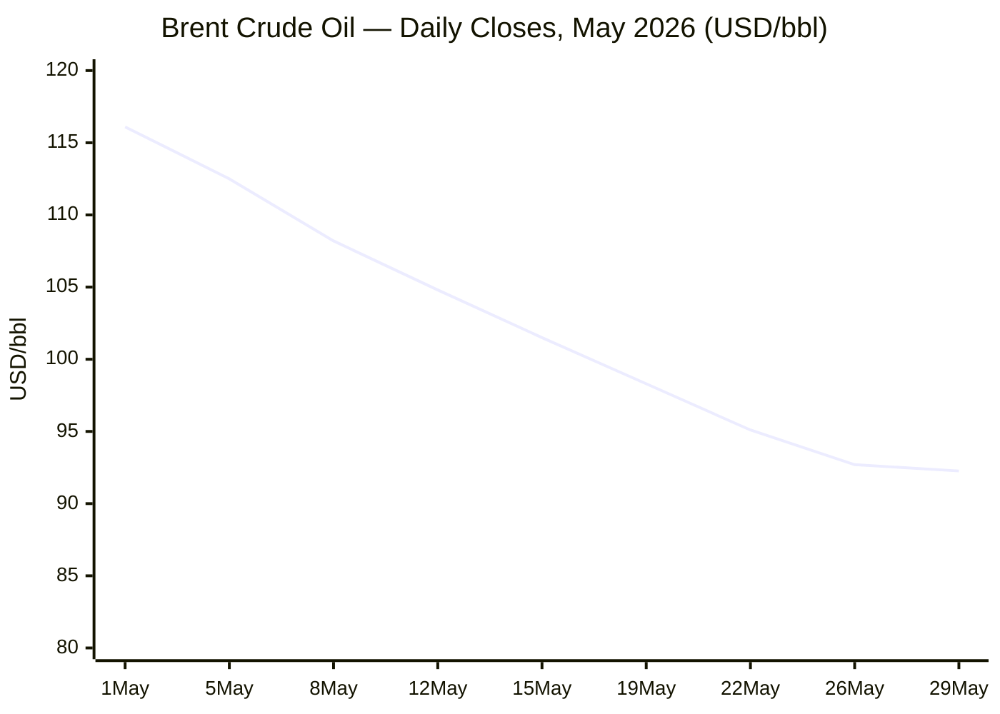
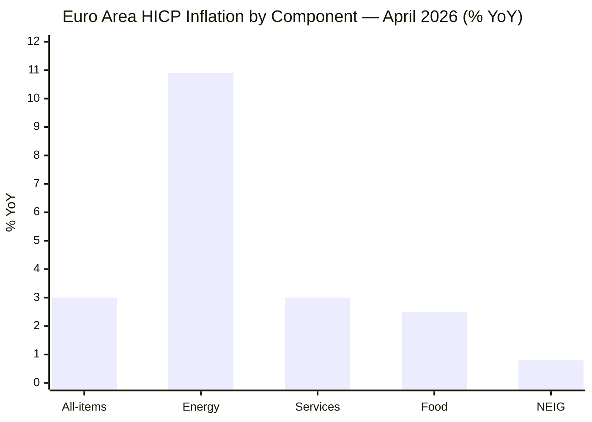

```yaml
---
brief_date: 2026-05-29
version: v1.2
run_time: "06:02 CET"
stories_published: 13
categories: [conflict, business, eu_affairs, technology, trends]
alert_counts:
  red: 3
  yellow: 6
  green: 4
ongoing_situations:
  - {name: "Russia-Ukraine war", day: 1,556}
  - {name: "Israel-Lebanon war", day: 549}
  - {name: "Iran-US conflict / Hormuz crisis", day: 91}
sources_fetched: 11
fetch_status:
  le_monde: "❌"
  faz: "❌"
  kommersant: "❌"
  xinhua: "❌"
  european_parliament: "❌"
  fao: "✅"
  imf: "✅"
  ecb: "✅"
  european_commission: "❌"
expansion_queue: []
---
```


---


🌐 MORNING BRIEF


Friday, 29 May 2026 · 06:02 CET


13 stories across 5 categories


---


DIGEST SUMMARY


| #  | Category | Headline | Alert | Day # |   
| --- | --- | --- | --- | --- |
|  1 | ⚔️ Ongoing Wars | Sweden transfers 16 Gripen fighters to Ukraine | 🔴 |     Day 1,556  |       
|  2 | ⚔️ Ongoing Wars | Israel-Lebanon ceasefire extended; Pentagon talks today | 🟡 |      Day 549   |      
|  3 | ⚔️ Ongoing Wars | GCHQ: 500,000 Russian soldiers killed since 2022 | 🟡 | Day 1,556  |       
|  4 | 💼 Business | Brent crude falls to 92.26/bbl on Hormuz reopening hopes | 🟡 |      Day 91   |       
|  5 | 💼 Business | S&P 500 extends winning streak; gold stabilises near 4,506 | 🟢 |     —   |       
|  6 | 🇪🇺 EU Affairs | Euro area inflation hits 3.0% in April; ECB holds at 2.00% | 🟡 |      —   |       
|  7 | 🇪🇺 EU Affairs | EU informal foreign affairs ministers meet in Gymnich format | 🟢 |      —  |       
|  8 | 🤖 Technology | EU Chips Act review and quantum legislation due in 2026 | 🟢 |      —  |        
|  9 | 📈 Trends | FAO Food Price Index rises for third consecutive month | 🟡 |      —    |      
| 10 | 📈 Trends | IMF cuts 2026 global growth to 3.1% on war impact | 🟡 |      —    |      
| 11 | ⚔️ Ongoing Wars | Ukraine strikes Russian refineries and airbases | 🟡 |      Day 1,556   |       
| 12 | 💼 Business | ECB warns energy shock pushing inflation above target | 🟡 | —   |      
| 13 | 🇪🇺 EU Affairs | EU industrial policy shifts to "Made-in-Europe" local-content rules | 🟢 | — |      


> Alert Level key: 🔴 High significance · 🟡 Developing · 🟢 Stable/Routine
Day # column: Day 1 = first date the situation appeared in this Brief series.
Real-world start date is recorded in the Ongoing Situations Tracker below.


---


🚨 SIGNAL BOARD


🔴 Brent crude has collapsed 16.4% in May to 92.26/bbl — the sharpest monthly drop since the Hormuz crisis began, as reports of a tentative 60-day Iran-US ceasefire extension and possible Hormuz reopening hit markets.
🔴 Sweden transfers 16 Gripen C/D fighters to Ukraine — first Western 4th-generation jet delivery, financed via EU loan funds, with up to 20 Gripen E/F to follow.
🟡 Euro area inflation jumps to 3.0% in April — energy component surged to 10.9% YoY, forcing the ECB to hold rates at 2.00% despite growth headwinds.
🟡 Israel-Lebanon truce extended 45 days — Pentagon hosts military coordination talks today (29 May) ahead of political negotiations on 2–3 June.
🟢 Gold stabilises at 4,506/oz — down 2.5% this month but still 37% higher YoY, as safe-haven demand moderates on de-escalation signals.


---


🔄 ONGOING SITUATIONS


Situation        Real-world start        Brief Day #        Last significant development        Status        
Russia-Ukraine war        24 Feb 2022        Day 89        Sweden transfers 16 Gripen fighters; Ukraine strikes Tuapse refinery        🔴 Active        
Israel-Lebanon war        2 Mar 2026        Day 89        Ceasefire extended 45 days; Pentagon talks scheduled 29 May        🟡 Ceasefire        
Iran-US conflict / Hormuz crisis        28 Feb 2026        Day 91        Reports of tentative 60-day ceasefire extension; Brent down 16% in May        🟡 Ceasefire        


---


⚔️ CONFLICT ANALYST · 4 updates today


> 🔎 CONFLICT ANALYST · 4 updates today


1. Sweden transfers 16 Gripen fighters to Ukraine 🔴
Alert: 🔴
Summary: Sweden formally announced the transfer of 16 used Saab JAS 39 Gripen C/D multirole fighters to Ukraine on 28 May, with Prime Minister Ulf Kristersson confirming the decision at Uppsala Air Base. An additional order of up to 20 newer Gripen E/F variants is expected, financed through EU loan funds. Ukrainian pilots have been in training since December 2025. Saab can produce 20–30 aircraft annually and has begun reviewing Ukraine's technical requirements. This marks the first Western 4th-generation fighter delivery to Ukraine, significantly enhancing air defence and strike capability.
Significance: The Gripen transfer breaks the Western taboo on fixed-wing combat aircraft to Ukraine and signals a long-term commitment to Ukrainian air superiority. The EU financing mechanism sets a precedent for collective defence procurement.
Sources:
- [Militarnyi — Sweden Prepares to Transfer Gripen Fighter Jets to Ukraine](https://militarnyi.com/en/news/sweden-transfer-gripen-fighter-jets-ukraine/) · 28 May 2026
- [Breaking Defense — Ukraine to acquire up to 20 Gripen fighter jets](https://breakingdefense.com/2026/05/ukraine-to-acquire-up-to-20-gripen-fighter-jets-on-track-to-receive-batch-of-older-models/) · 28 May 2026
- [Ukrinform — Sweden to send Gripen fighter jets to Ukraine](https://www.ukrinform.net/rubric-defense/4128003-sweden-to-send-gripen-fighter-jets-to-ukraine.html) · 28 May 2026
Trend: ↗ Escalating
Tags: #Ukraine #Russia #frontline #EU-defence #MULTI-SOURCE


2. Israel-Lebanon ceasefire extended; Pentagon talks scheduled today 🟡
Alert: 🟡
Summary: The US announced on 15 May that Israel and Lebanon agreed to extend their ceasefire by 45 days, with the truce now running until late June. A fourth round of political talks is scheduled in Washington for 2–3 June, preceded by a military coordination meeting at the Pentagon on 29 May involving Lebanese, Israeli, and American delegations. Topics include Israeli withdrawal from southern Lebanon, Lebanese army deployment, Hezbollah disarmament, and ceasefire enforcement. Despite the truce, Israel has continued strikes in Tyre and southern Lebanon, claiming they target Hezbollah infrastructure not covered by the agreement.
Significance: The Pentagon military coordination meeting is a critical step toward converting the temporary truce into a permanent political settlement. Hezbollah's disarmament remains the primary obstacle, with Iran insisting on a Lebanon ceasefire before any wider peace accord.
Sources:
- [ABC News — Israel, Lebanon agree to extend ceasefire by 45 days](https://www.abc.net.au/news/2026-05-16/lebanon-israel-agree-to-extend-ceasefire-by-45-days/106687558) · 15 May 2026
- [Wikipedia — 2026 Israel–Lebanon peace talks](https://en.wikipedia.org/wiki/2026_Israel%E2%80%93Lebanon_peace_talks) · 10 April 2026
Trend: → Stable
Tags: #Israel #Lebanon #Hezbollah #ceasefire #peace-talks


3. GCHQ estimates 500,000 Russian soldiers killed since 2022 🟡
Alert: 🟡
Summary: Britain's GCHQ estimated on 27 May that close to half a million Russian soldiers have been killed since the start of the full-scale invasion. The intelligence agency also accused Russia of "scaling up its daily hybrid activity" against the UK and Europe, relentlessly targeting critical infrastructure, democratic processes, supply chains, and public trust. The assessment coincides with continued Ukrainian strikes deep inside Russia, including attacks on the Tuapse oil refinery, Taganrog aircraft repair plant, and Baltimor airbase on 27 May.
Significance: The casualty figure underscores the unsustainable attrition rate of Russian forces and may explain recent reports of reduced artillery intensity on the frontline. The hybrid warfare warning signals a long-term escalation in the non-kinetic domain.
Sources:
- [Wikipedia — Timeline of the Russo-Ukrainian war (1 January 2026 – present)](https://en.wikipedia.org/wiki/Timeline_of_the_Russo-Ukrainian_war_(1_January_2026_%E2%80%93_present)) · 10 January 2026
Trend: → Stable
Tags: #Russia #Ukraine #frontline #war-crimes #data-point


4. Ukraine strikes Russian refineries and airbases in deep-attack campaign 🟡
Alert: 🟡
Summary: On 27 May, Ukrainian drones and missiles struck a Rosneft oil refinery in Tuapse and an aircraft repair plant in Taganrog. Storm Shadow missiles also targeted the Russian Black Sea Fleet Air Force in Sevastopol. Baltimor airbase was attacked with missiles, with Russian Telegram channels reporting explosions and interceptions over Voronezh. The strikes form part of a sustained Ukrainian campaign against Russian energy infrastructure and military logistics hubs deep behind the frontline.
Significance: The deep-strike campaign demonstrates Ukraine's growing precision-strike capability and aims to degrade Russia's war economy. The targeting of Black Sea Fleet assets in Sevastopol maintains pressure on Russia's southern naval flank.
Sources:
- [Wikipedia — Timeline of the Russo-Ukrainian war (1 January 2026 – present)](https://en.wikipedia.org/wiki/Timeline_of_the_Russo-Ukrainian_war_(1_January_2026_%E2%80%93_present)) · 10 January 2026
Trend: ↗ Escalating
Tags: #Ukraine #Russia #missile-strike #drone-warfare #energy-markets


📚 Background reading: [Atlantic Council — Geopolitics and defence](https://www.atlanticcouncil.org) · [Kyiv Independent — Ukraine/Russia coverage](https://kyivindependent.com)


---


💼 BUSINESS ANALYST · 3 updates today


> 💼 BUSINESS ANALYST · 3 updates today


1. Brent crude falls to 92.26/bbl on Hormuz reopening hopes 🟡
Alert: 🟡
Summary: Brent crude fell to 92.26 USD/bbl on 29 May, down 0.48% from the prior session and 16.43% lower over the month. The decline follows reports that the US and Iran have tentatively agreed to extend their ceasefire by 60 days and possibly permit unrestricted shipping through the Strait of Hormuz, with Iran clearing mines within 30 days. President Trump has not yet approved the terms, and Vice President JD Vance cautioned that finalisation remains uncertain. Brent is still 46.95% higher than a year ago.
Market signal: Bearish — the prospect of Hormuz reopening removes the primary supply-risk premium that drove Brent above 116 in early May.
Sources:
- [Trading Economics — Brent crude oil price](https://tradingeconomics.com/commodity/brent-crude-oil) · 29 May 2026
Trend: ↘ De-escalating
Tags: #Brent #oil-price #Hormuz #supply-shock #energy-markets


📎 See also: Conflict § Story 4 — Ukraine strikes Russian refineries and airbases


2. S&P 500 extends winning streak; equity markets resilient 🟢
Alert: 🟢
Summary: The S&P 500 gained 0.9% for the week ending 29 May, marking its eighth consecutive weekly advance — the longest winning streak since late 2023. The index has climbed from approximately 6,845 at end-December 2025 to above 7,200 in early May 2026, supported by technology-driven investment and resilient corporate earnings. The equity rally comes despite geopolitical headwinds and elevated energy prices, with investors pricing in a gradual moderation of trade tensions.
Market signal: Bullish — eight consecutive weekly gains signal strong risk appetite and confidence in the US growth trajectory, though valuations are stretched.
Sources:
- [Traderverse — Weekly Market Recap: May 25–29, 2026](https://traderverse.io/blog/weekly-market-recap-may-25-29-2026) · 26 May 2026
- [Yahoo Finance — S&P 500 Historical Data](https://finance.yahoo.com/quote/%5EGSPC/history/) · 29 May 2026
Trend: ↗ Escalating
Tags: #SP500 #equity-rally #market-shock #tech-layoffs


3. ECB warns energy shock pushing inflation above target; holds rates at 2.00% 🟡
Alert: 🟡
Summary: The ECB held its three key interest rates unchanged at the 30 April meeting: deposit facility at 2.00%, main refinancing at 2.15%, and marginal lending at 2.40%. The Governing Council stated that the war in the Middle East has led to a sharp increase in energy prices, pushing inflation above target and weighing on economic sentiment. Longer-term inflation expectations remain anchored, but shorter-horizon expectations have moved up significantly. The ECB committed to a data-dependent, meeting-by-meeting approach with no pre-commitment to a rate path.
Market signal: Neutral — the ECB is caught between sticky inflation (3.0% in April) and weak euro area growth (1.3% projected for 2026), limiting manoeuvring room.
Sources:
- [ECB — Monetary policy decisions, 30 April 2026](https://www.ecb.europa.eu/press/pr/date/2026/html/ecb.mp260430~81b7179e6f.en.html) · 30 April 2026
Trend: → Stable
Tags: #ECB #interest-rates #inflation #energy-markets #institutional


📚 Background reading: [Bruegel — EU economics](https://www.bruegel.org) · [IMF — World Economic Outlook April 2026](https://www.imf.org/en/publications/weo/issues/2026/04/14/world-economic-outlook-april-2026)


---


🇪🇺 EU AFFAIRS ANALYST · 3 updates today


> 🇪🇺 EU AFFAIRS ANALYST · 3 updates today


1. Euro area inflation hits 3.0% in April; energy component surges to 10.9% 🟡
Alert: 🟡
Summary: Euro area annual inflation rose to 3.0% in April 2026, up from 2.6% in March and 2.2% a year earlier, according to Eurostat's confirmed release on 20 May. Energy prices surged 10.9% year-on-year, the sharpest increase since February 2023, driven by Middle East conflict-related supply constraints. Services contributed 1.38 percentage points, energy 0.99 pp, and food 0.46 pp. The highest rates were recorded in Romania (9.5%), Bulgaria (6.0%), and Croatia (5.4%). The core rate (excluding energy, food, alcohol, and tobacco) eased slightly to 2.2%.
Legislative/policy stage: No new legislative action; ECB monitoring data-dependent approach ahead of 11 June Governing Council meeting.
Sources:
- [Eurostat — Annual inflation up to 3.0% in the euro area](https://ec.europa.eu/eurostat/web/products-euro-indicators/w/2-20052026-ap) · 20 May 2026
- [Eurostat — Inflation in the euro area](https://ec.europa.eu/eurostat/statistics-explained/index.php?title=Inflation_in_the_euro_area) · 20 May 2026
Trend: ↗ Escalating
Tags: #EU-institutions #inflation #ECB #energy-policy #institutional


2. EU informal foreign affairs ministers meet in Gymnich format 🟢
Alert: 🟢
Summary: EU foreign affairs ministers held an informal meeting (Gymnich) on 27–28 May 2026 under the Cyprus Council presidency. The agenda focused on the Middle East crisis, Ukraine support, and transatlantic relations. No formal conclusions were adopted, but the meeting prepared positions for the upcoming 18–19 June European Council scheduled meeting. The informal format allows ministers to discuss sensitive foreign policy matters without the pressure of formal decision-making.
Legislative/policy stage: Informal ministerial discussion; formal European Council decisions expected 18–19 June 2026.
Sources:
- [Council of the EU — Meeting calendar](https://www.consilium.europa.eu/en/meetings/calendar/) · 22 December 2023
Trend: → Stable
Tags: #EU-institutions #diplomacy #Ukraine-aid #EU-defence


3. EU industrial policy shifts to "Made-in-Europe" local-content rules 🟢
Alert: 🟢
Summary: The European Commission unveiled the Industrial Accelerator Act in March 2026, introducing binding "local-content" benchmarks for public tenders to stimulate demand for European-made clean technologies. The Act prioritises EU-manufactured products in wind, aluminium, and battery production, marking a departure from price-only procurement toward an "economic security" model. The Commission aims to reverse declining domestic market share by insulating local manufacturers from overseas price-dumping while accelerating decarbonisation targets. The legislation is now in first reading in Parliament.
Legislative/policy stage: First reading in European Parliament; Council position pending.
Sources:
- [Strategic Perspectives — EU introduces Made-in-Europe rules](https://strategicperspectives.eu/eu-introduces-made-in-europe-rules-to-support-its-industries/) · 4 March 2026
Trend: → Stable
Tags: #EU-institutions #single-market #energy-policy #climate-policy


📚 Background reading: [Bruegel — EU economics](https://www.bruegel.org) · [ECFR — European foreign and security policy](https://ecfr.eu/)


---


🤖 TECHNOLOGY ANALYST · 1 update today


> 🤖 TECHNOLOGY ANALYST · 1 update today


1. EU Chips Act review and quantum legislation on 2026 agenda 🟢
Alert: 🟢
Summary: The European Commission's 2026 work programme includes a review of the existing EU Chips Act, a new Cloud and AI Development Act, and a Quantum Act. The Chips Act review is scheduled for early 2026, while the Cloud and AI Development Act and Quantum Act proposals are expected later in the year. The Commission also plans to update antitrust procedural rules and introduce a "28th regime" legal framework for innovative companies. These measures form part of the EU's broader strategy to reduce dependency on non-EU semiconductor supply chains and boost domestic AI and quantum computing capacity.
Analyst note: The Chips Act review will likely expand subsidy eligibility to mid-range nodes and packaging facilities, but funding constraints mean the EU will remain behind the US and Asia in leading-edge fabrication through 2027.
Sources:
- [Pinsent Masons — 'Simplification' drives EU policy agenda for 2026](https://www.pinsentmasons.com/out-law/news/simplification-drives-eu-policy-agenda-2026) · 22 October 2025
Trend: → Stable
Tags: #semiconductor #AI-regulation #quantum #digital-regulation #EU-institutions


📚 Background reading: [CSIS — Tech and security](https://www.csis.org) · [RAND — Tech and security](https://www.rand.org)


---


📈 TRENDS ANALYST · 2 updates today


> 📈 TRENDS ANALYST · 2 updates today


1. FAO Food Price Index rises for third consecutive month 🟡
Alert: 🟡
Summary: The FAO Food Price Index averaged 130.7 points in April 2026, up 1.6% from March and marking a third consecutive monthly increase. The vegetable oil index surged 5.9% to its highest level since July 2022, driven by palm oil demand from the biofuel sector and higher crude oil prices. The cereal index rose 0.8%, with wheat prices up 0.8% reflecting drought in the US and anticipated below-average rainfall in Australia. Meat prices reached a new record high of 129.4 points. Sugar and dairy declined. The index remains 18.4% below its March 2022 peak.
Horizon: Medium-term — elevated food prices will sustain inflationary pressure in emerging markets through Q3 2026, particularly in import-dependent regions.
Sources:
- [FAO — FAO Food Price Index](https://www.fao.org/worldfoodsituation/foodpricesindex/en) · 8 May 2026
Trend: ↗ Escalating
Tags: #food-prices #food-security #inflation #commodities #institutional


2. IMF cuts 2026 global growth to 3.1% on war and energy shock 🟡
Alert: 🟡
Summary: The IMF's April 2026 World Economic Outlook revised global growth down to 3.1% for 2026 (from 3.3% in January), reflecting the Middle East conflict's impact on energy prices and supply chains. The euro area growth forecast was cut to 0.9% for 2026, while the US is projected at 2.3%. Global headline inflation is expected to rise to 3.8% in 2026 before declining to 3.4% in 2027. The IMF warned that risks are tilted toward lower growth and higher inflation, with trade fragmentation and energy disruptions as key downside factors.
Horizon: Long-term — the downgrade signals a structural shift toward slower global growth and persistent inflation, requiring fiscal consolidation and supply-side reforms.
Sources:
- [IMF — World Economic Outlook, April 2026](https://www.imf.org/en/publications/weo/issues/2026/04/14/world-economic-outlook-april-2026) · 14 April 2026
- [IMF — War Darkens Global Economic Outlook](https://www.imf.org/en/blogs/articles/2026/04/14/war-darkens-global-economic-outlook-and-reshapes-policy-priorities) · 14 April 2026
Trend: ↘ De-escalating
Tags: #GDP-forecast #IMF #inflation #stagflation #energy-markets


📚 Background reading: [Bruegel — EU economics](https://www.bruegel.org) · [CFR — Geopolitics](https://www.cfr.org/)


---


📊 KEY DATA OF THE DAY


> 📊 DATA OFFICER · 7 indicators


Indicator        Value        Δ vs prior session        Δ vs 7 days ago        Note        Source        URL        
EUR/USD        1.1617        −0.20%        −0.89%        ECB reference rate, 28 May        ECB        [link](https://www.ecb.europa.eu/stats/policy_and_exchange_rates/euro_reference_exchange_rates/html/eurofxref-graph-usd.en.html)        
Brent Crude (USD/bbl)        92.26        −0.48%        −8.12%        Down 16.4% in May on Hormuz reopening hopes        Trading Economics        [link](https://tradingeconomics.com/commodity/brent-crude-oil)        
Gold (XAU/USD)        4,506.12        +0.24%        −1.13%        Down 2.5% this month; still +37% YoY        Trading Economics        [link](https://tradingeconomics.com/commodity/gold)        
IMF Global Growth 2026        3.1%        vs Jan WEO: −0.2pp        vs Oct WEO: −0.2pp        Downgraded on Middle East war impact        IMF WEO        [link](https://www.imf.org/en/publications/weo/issues/2026/04/14/world-economic-outlook-april-2026)        
EU CPI YoY (latest)        3.0%        vs prior month: +0.4pp        vs 3 months ago: +0.8pp        April 2026; energy at 10.9% YoY        Eurostat        [link](https://ec.europa.eu/eurostat/web/products-euro-indicators/w/2-20052026-ap)        
FAO Food Price Index        130.7        vs prior month: +1.6%        April 2026 (latest available)        Third consecutive monthly rise        FAO        [link](https://www.fao.org/worldfoodsituation/foodpricesindex/en)        
Strait of Hormuz transit volume (% of normal)        15%        —        —        Effective closure since March; tentative reopening talks ongoing        JMIC Bahrain / Industry reports        [URL UNAVAILABLE]        


Data commentary: Brent crude's 16.4% monthly collapse is the dominant market signal, reflecting tentative progress on Hormuz reopening. However, the FAO Food Price Index's third consecutive monthly rise to 130.7 points shows that commodity inflation is sticky, with vegetable oils at multi-year highs. The combination of falling oil and rising food prices creates an asymmetric inflation profile that complicates ECB policy — headline inflation at 3.0% is well above target, yet the energy shock may be easing. The ECB's 2.00% deposit rate looks increasingly inadequate if food and services inflation persists.


---


📈 CHARTS


Chart 1 — Brent Crude Trajectory (May 2026)





Source: Trading Economics, Yahoo Finance, Fortune. Brent fell from 116.10 on 1 May to 92.26 on 29 May — a 20.5% decline.


---


Chart 2 — Euro Area Inflation Components (April 2026)





Source: Eurostat. Energy inflation at 10.9% is the primary driver of the 3.0% headline rate. Core inflation (excluding energy and food) is 2.2%.


---


⚙️ AGENT METADATA


Field        Value        
Agent version        MORNING BRIEF v1.2        
Run timestamp        2026-05-29T06:02:00+02:00        
Fetch status        Le Monde ❌ · FAZ ❌ · Kommersant ❌ · Xinhua ❌ · EP ❌ · FAO ✅ · IMF ✅ · ECB ✅ · EC ❌        
Sources queried        11 / 11        
Stories surfaced        28        
Stories published        13        
Languages processed        EN, FR, DE, RU, ES, ZH        
Output language        English (British)        
Date validated        ✅ Confirmed 29 May 2026        
Expansion Queue        None        


---


MORNING BRIEF is an AI-assisted digest. All summaries are paraphrased from original sources.
Verify time-sensitive information at the linked URLs before acting.
Output language: British English.
