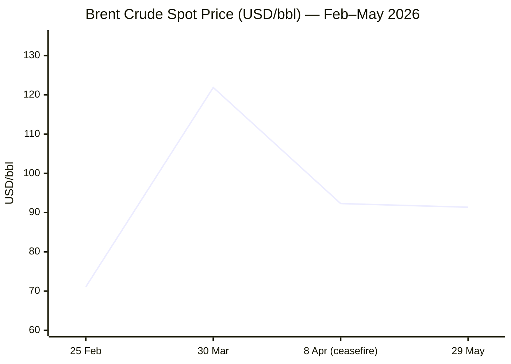
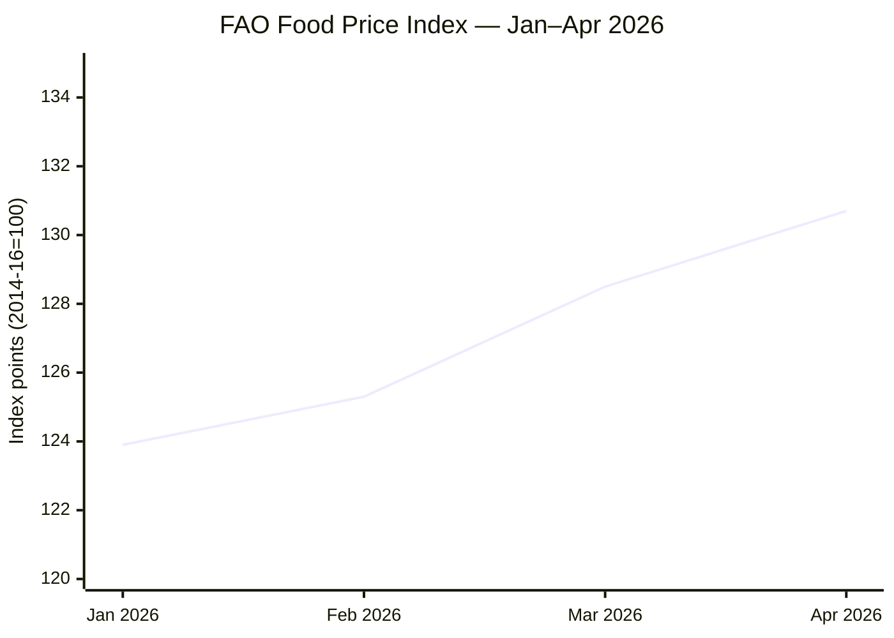

````yaml
---
brief_date: 2026-05-30
version: v1.2.2
run_time: "05:45 CET"
stories_published: 12
categories: [conflict, business, eu_affairs, technology, trends]
alert_counts:
  red: 4
  yellow: 7
  green: 1
ongoing_situations:
  - {name: "2026 Iran-US War / Hormuz Crisis", real_world_start: "2026-02-28", day: 92}
  - {name: "Russia-Ukraine War", real_world_start: "2022-02-24", day: 1557}
  - {name: "Israel-Lebanon Ceasefire (violated)", real_world_start: "2024-11-27", day: 550}
sources_fetched: 9
fetch_status:
  le_monde: "❌"
  faz: "❌"
  kommersant: "❌"
  xinhua: "⚠️"
  european_parliament: "⚠️"
expansion_queue: []
---
````

---

# 🌐 MORNING BRIEF
## Saturday, 30 May 2026 · 05:45 CET
### 12 stories across 5 categories

---

## DIGEST SUMMARY

| # | Category | Headline | Alert |
|---|----------|----------|-------|
| 1 | ⚔️ Conflict | Iran-US 60-day MoU agreed in principle; Trump sign-off still pending | 🔴 |
| 2 | ⚔️ Conflict | Israel resumes strikes in southern Lebanon; civilian deaths reported | 🔴 |
| 3 | ⚔️ Conflict | Russia sets May 30 deadline for Kramatorsk outskirts; shaping operations intensify | 🟡 |
| 4 | 💼 Business | Brent falls 17% in a month on Iran deal hopes; still 45% above year-ago levels | 🟡 |
| 5 | 💼 Business | Big Four inflation data seals ECB June hike as near-certain | 🔴 |
| 6 | 💼 Business | EU-US tariff deal agreed; Trump sets July 4 ratification deadline | 🟡 |
| 7 | 🇪🇺 EU Affairs | EP resolution demands Commission act on Slovakia rule-of-law breach | 🟡 |
| 8 | 🇪🇺 EU Affairs | Parliament approves new EU foreign investment screening framework | 🟡 |
| 9 | 🤖 Technology | EU AI Omnibus provisional deal: high-risk deadlines extended to 2027-28 | 🟡 |
| 10 | 🤖 Technology | Commission opens consultation on AI transparency obligations | 🟢 |
| 11 | 📈 Trends | Hormuz fertiliser disruption pushes FAO index to 130.7; food crisis risk deepens | 🔴 |
| 12 | 📈 Trends | Pakistan pivots to strategic dual role: mediator and Iran land bridge | 🟡 |

> Alert level key: 🔴 High significance · 🟡 Developing · 🟢 Stable/Routine

---

## 🚨 SIGNAL BOARD

🔴 **US-Iran MoU on a 60-day ceasefire extension reportedly agreed by negotiators on 28 May — Trump has not signed; Hormuz remains restricted; IRGC fired warning shots at vessels on Day 92**
🔴 **ECB June 11 rate hike now all but certain: France, Italy and Spain all saw May CPI rise; EU energy inflation running at +10.8% YoY in April**
🟡 **Brent at $91.37 — down 17% over the past month on Iran deal optimism, yet still 45.6% above year-ago levels — the energy shock has not unwound**
🟡 **EU-US tariff deal agreed by Parliament and Council (20 May); Trump threatened immediate escalation if EU fails to ratify by 4 July**
⚡ **FAO Food Price Index reached 130.7 in April — third consecutive monthly rise — reversing a 5-month deflationary trend; Hormuz-linked fertiliser costs are now entering the food supply chain**

---

## 🔄 ONGOING SITUATIONS

| Situation | Real-world start | Day # | Last significant development | Status |
|-----------|-----------------|-------|------------------------------|--------|
| 2026 Iran-US War / Hormuz Crisis | 28 Feb 2026 | Day 92 | US-Iran negotiators agreed MoU framework for 60-day ceasefire extension and partial Hormuz reopening; Trump's final approval outstanding; Iran's Tasnim denies text is finalised | 🔴 Active |
| Russia-Ukraine War | 24 Feb 2022 | Day 1,557 | Russian military reportedly set 30 May deadline to reach Kramatorsk outskirts; artillery and drone shaping campaign ongoing; Ukrainian BAI strikes on Russian logistics | 🔴 Active |
| Israel-Lebanon Ceasefire | 27 Nov 2024 | Day 550 | Israeli strikes in southern Lebanon on 28-29 May killed multiple civilians; IDF Chief visited Lebanon side of Mount Dov; "Operation Eternal Darkness" ongoing | 🟡 Violated |

---

## ⚔️ CONFLICT ANALYST

> 🔎 **CONFLICT ANALYST** · 3 updates today

---

### 1. Iran-US: 60-Day MoU Reportedly Agreed — Awaiting Trump's Signature 🔴

**Alert:** 🔴
**Summary:** US and Iranian negotiators reached a preliminary memorandum of understanding on Thursday 28 May for a 60-day extension of the ceasefire and the gradual reopening of the Strait of Hormuz. The proposed MoU would: end hostilities, lift the US naval blockade on Iranian ports, allow Iran to sell oil freely, and start a 60-day clock for nuclear negotiations. Iran would clear mines from the strait within 30 days and guarantee no transit tolls. Approximately $12 billion in frozen Iranian assets would be unblocked in phase one. However, Trump had not yet approved the deal as of Friday evening; US Vice President Vance said it was "TBD." Iran's Tasnim news agency — close to the IRGC — stated the text had not been finalised. The IRGC fired warning shots at four vessels attempting unauthorised passage on 28 May, illustrating the strait's contested status.
**Significance:** If signed, the MoU would be the most significant diplomatic development of 2026 and would immediately relieve energy market pressure. The gap between US and Iranian characterisations of the deal — especially on Hormuz control and nuclear commitments — remains the dominant downside risk.
**Sources:**

- [Al Jazeera — US, Iran reach MoU on 60-day truce, Trump's approval pending](https://www.aljazeera.com/news/2026/5/29/us-iran-60-day-proposal-what-we-know) · 29 May 2026
- [CNN — US and Iran reach tentative agreement though Trump hasn't signed off on it](https://www.cnn.com/2026/05/28/world/live-news/iran-war-us-news) · 28 May 2026
- [CNBC — Trump says Iran deal reopening Strait of Hormuz 'largely negotiated'](https://www.cnbc.com/2026/05/23/us-iran-war-talks.html) · 23 May 2026

**Trend:** ↘ De-escalating
**Tags:** #Iran #Hormuz #peace-talks #nuclear #MULTI-SOURCE

---

### 2. Israel-Lebanon: Strikes Resume, Civilian Deaths on Day 550 🔴

**Alert:** 🔴
**Summary:** Israeli forces conducted renewed airstrikes on southern Lebanon on 28-29 May, killing civilians including occupants of a car in Tyre and causing casualties in the Nabatieh district. The IDF Chief of Staff visited Israeli positions on the Lebanese side of Mount Dov on 29 May. Israel maintains "Operation Eternal Darkness," a campaign targeting Hezbollah command and control which Israel asserts falls outside the November 2024 ceasefire agreement. Lebanon's army reported Israeli targeting of an army barracks in Nabatieh, wounding a soldier. Iran's latest diplomatic proposal to end the broader war specifically demanded that Lebanon be included in any ceasefire terms — a condition Israel and the US have consistently rejected.
**Significance:** With the Iran-US MoU under negotiation, Israeli actions in Lebanon risk undercutting the diplomatic track: any Iranian rejection of a deal tied to Israeli operations against Hezbollah would further delay Hormuz reopening.
**Sources:**

- [Al Jazeera — Israeli attacks in Lebanon kill at least 20 despite supposed ceasefire](https://www.aljazeera.com/news/2026/5/23/israel-attacks-southern-lebanon-and-near-syrian-border-despite-ceasefire) · 23 May 2026
- [Times of Israel — Liveblog May 29, 2026](https://www.timesofisrael.com/liveblog-may-29-2026/) · 29 May 2026

**Trend:** ↗ Escalating
**Tags:** #Israel #Lebanon #Hezbollah #ceasefire #humanitarian

---

### 3. Russia-Ukraine: Kramatorsk Deadline Passes; Frontline Shaping Intensifies 🟡

**Alert:** 🟡
**Summary:** The Russian military command reportedly set 30 May as its internal deadline to reach the outskirts of Kramatorsk, the northern anchor of Ukraine's Fortress Belt in Donetsk Oblast. ISW assessments through mid-May document Russian artillery, drone, and FAB glide-bomb shaping operations across the Kramatorsk-Slovyansk-Kostyantynivka corridor. During 12-19 May, Russian forces advanced near eight Ukrainian settlements including Charivne, Pokrovsk, and Rodynske; Ukraine liberated Odradne. Ukrainian drone units are now striking Russian logistics targets 30-40 kilometres behind the front line. Whether Russian forces have met the Kramatorsk deadline remains unconfirmed in open sources.
**Significance:** A successful Russian ground advance toward Kramatorsk would trigger a major shift in the operational picture — the fortress cities are the backbone of Ukrainian defences built since 2014. Even failure to reach the deadline signals intensified pressure ahead.
**Sources:**

- [Russia Matters — Russia-Ukraine War Report Card, 20 May 2026](https://www.russiamatters.org/news/russia-ukraine-war-report-card/russia-ukraine-war-report-card-may-20-2026) · 20 May 2026
- [Critical Threats — Russian Offensive Campaign Assessment, May 9, 2026](https://www.criticalthreats.org/analysis/russian-offensive-campaign-assessment-may-9-2026) · 9 May 2026

**Trend:** ↗ Escalating
**Tags:** #Russia #Ukraine #frontline #missile-strike #drone-warfare

📚 *Background reading:* [Al Jazeera — US, Iran inch closer to deal to end the war: What to know](https://www.aljazeera.com/news/2026/5/24/us-iran-inch-closer-to-deal-to-end-the-war-what-to-know) · [Kyiv Independent — [URL UNAVAILABLE]](https://kyivindependent.com)

---

## 💼 BUSINESS ANALYST

> 💼 **BUSINESS ANALYST** · 3 updates today

---

### 1. Brent Crude Posts Biggest Monthly Fall in a Year — But Oil Shock Is Not Over 🟡

**Alert:** 🟡
**Summary:** Brent crude settled at $91.37/bbl on Friday 29 May, down 1.43% on the day and 17.23% over the past month — its steepest monthly decline in a year. The move is driven by markets front-running a potential Iran-US deal that would reopen the Strait of Hormuz and restore Iranian oil exports. Intraday volatility remains elevated: prices rose approximately 2% earlier in the session after the US reported destroying IRGC attack drones near Hormuz, before falling back as MoU optimism returned. The 52-week high stands at $126.41/bbl, set in mid-March. At current levels, Brent is still 45.6% above its year-ago price — representing a persistent inflation shock that has yet to fully unwind in consumer prices.
**Market signal:** Bearish near-term on continued MoU optimism, but with sharp reversal risk if Trump rejects the deal or IRGC escalation resumes.

📎 *See also: Conflict § Story 1 — Iran-US MoU on 60-day ceasefire extension awaiting Trump approval.*

**Sources:**
- [Trading Economics — Brent Crude Oil Price](https://tradingeconomics.com/commodity/brent-crude-oil) · 29 May 2026
- [Investing.com — Brent Oil Futures](https://www.investing.com/commodities/brent-oil) · 29 May 2026

**Trend:** ↘ De-escalating
**Tags:** #Brent #oil-price #Hormuz #supply-shock #energy-markets

---

### 2. Big Four Inflation Data Seals ECB June Hike as Near-Certain 🔴

**Alert:** 🔴
**Summary:** Flash HICP data released on 29 May from the eurozone's four largest economies reinforced near-unanimous market expectations of a 25-basis-point ECB rate hike on 11 June. France's harmonised inflation rose to 2.8% in May — its highest in over a year — driven by natural gas prices. Italy and Spain also reported acceleration. Germany was the sole outlier, with HICP easing to 2.6% (below the 2.8% consensus) as headline pressure moderated, though core inflation rose to 2.5% from 2.3%. ECB Governing Council members have already signalled a June hike publicly; the ECB minutes from April — released Thursday — showed some members would have backed a hike at the April meeting had one been proposed. The ECB currently holds rates at 2.15% (main refinancing) / 2.00% (deposit facility).
**Market signal:** Bullish for EUR on rate expectations, but offset by Middle East risk premium keeping the euro near six-week lows versus the dollar.
**Sources:**

- [Euronews — ECB rate hike in focus as Eurozone's 'Big Four' report stubbornly high inflation](https://www.euronews.com/business/2026/05/29/ecb-rate-hike-in-focus-as-eurozones-big-four-report-stubbornly-high-inflation) · 29 May 2026
- [Eurostat — Annual inflation up to 3.0% in the euro area (April 2026)](https://ec.europa.eu/eurostat/web/products-euro-indicators/w/2-20052026-ap) · 20 May 2026
- [Trading Economics — Euro Area Interest Rate](https://tradingeconomics.com/euro-area/interest-rate) · 29 May 2026

**Trend:** ↗ Escalating
**Tags:** #ECB #inflation #interest-rates #eurozone #EU-institutions

---

### 3. EU-US Tariff Deal Agreed — Trump Sets July 4 Ratification Deadline 🟡

**Alert:** 🟡
**Summary:** The European Parliament and Council of the EU reached a provisional agreement on 20 May implementing the EU-US Joint Statement trade framework from August 2025. The deal eliminates remaining EU tariffs on US industrial goods and certain agricultural products, while capping US tariffs on EU exports at 15%. A robust safeguard mechanism allows the Commission to suspend concessions if the US raises tariffs above 15% on steel and aluminium derivative products after 31 December 2026. A sunset clause terminates the main regulation at end-2029 unless renewed. However, formal ratification requires a mid-June parliamentary vote and administrative implementation. President Trump responded by giving the EU until 4 July to ratify or face immediate tariff escalation to "much higher levels."

📎 *See also: EU Affairs § Story 1 — EP/Council provisional agreement: legislative mechanics.*

**Market signal:** Moderately bullish for EUR/USD and European industrials contingent on ratification, but the July 4 deadline introduces headline risk.
**Sources:**
- [Council of the EU — EU-US trade: Council and Parliament strike a deal](https://www.consilium.europa.eu/en/press/press-releases/2026/05/20/eu-us-trade-council-and-parliament-strike-a-deal-to-implement-the-tariff-elements-of-the-joint-statement/) · 20 May 2026
- [CNBC — Trump threatens EU if no trade deal ratified by July 4](https://www.cnbc.com/2026/05/08/trump-tariffs-trade-eu-europe-deal.html) · 8 May 2026

**Trend:** → Stable
**Tags:** #EU-institutions #sanctions #single-market #FX #MULTI-SOURCE

📚 *Background reading:* [Bruegel — [URL UNAVAILABLE]](https://www.bruegel.org) · [CFR — [URL UNAVAILABLE]](https://www.cfr.org/)

---

## 🇪🇺 EU AFFAIRS ANALYST

> 🇪🇺 **EU AFFAIRS ANALYST** · 2 updates today

---

### 1. Slovakia Rule of Law: Parliament Demands Commission Trigger Conditionality 🟡

**Alert:** 🟡
**Summary:** The European Parliament adopted a resolution on 20 May by 418 votes to 207 demanding the European Commission assess whether Slovakia faces a clear risk of serious breach of EU values under Article 7 TEU, and calling for activation of the rule-of-law conditionality mechanism to protect EU funds. MEPs cited systemic deficiencies in judicial independence, alleged misuse of EU agricultural and cohesion funds via the Agricultural Paying Agency and so-called "guesthouse projects," and deterioration of media pluralism under Prime Minister Robert Fico's government. The Parliament noted that up to 80% of public investment in Slovakia involves EU funding. A previous resolution adopted within the month raised comparable concerns; two consecutive resolutions in a short period signal escalating institutional pressure.
**Legislative/policy stage:** EP resolution adopted (non-binding); Commission must now decide whether to formally open Article 7(1) proceedings, a step it has not yet taken in Slovakia's case.
**Sources:**

- [European Parliament — Slovakia: MEPs demand action to protect EU values and the EU budget](https://www.europarl.europa.eu/news/en/press-room/20260513IPR43308/slovakia-meps-demand-action-to-protect-eu-values-and-the-eu-budget) · 20 May 2026
- [Renew Europe — Slovakia's democratic backsliding: Liberals and Democrats urge investigation](https://www.reneweuropegroup.eu/news/2026-05-20/slovakias-democratic-backsliding-liberals-and-democrats-urge-investigation-into-eu-funds-misuse) · 20 May 2026

**Trend:** ↗ Escalating
**Tags:** #EU-institutions #rule-of-law #EU-funds #EU-institutions #MULTI-SOURCE

---

### 2. Parliament Approves EU Foreign Investment Screening Framework 🟡

**Alert:** 🟡
**Summary:** On 19 May, the European Parliament approved new EU rules for the screening of foreign direct investments to prevent security risks in strategic sectors. The regulation gives EU member states and the Commission enhanced powers to block or impose conditions on acquisitions from third-country investors in areas including critical infrastructure, advanced technologies, sensitive data, and defence-related supply chains. The legislation responds to growing concerns about state-backed investment from China and Russia in EU strategic assets. The vote took place during the 18-21 May plenary session in Strasbourg. The regulation now moves to formal Council adoption before entry into force.
**Legislative/policy stage:** Parliament first reading adopted; Council formal adoption pending; implementing measures to follow.
**Sources:**

- [European Parliament — Protecting EU strategic sectors from risky foreign investments](https://www.europarl.europa.eu/news/en/press-room/20260513IPR43304/protecting-eu-strategic-sectors-from-risky-foreign-investments) · 19 May 2026

**Trend:** → Stable
**Tags:** #EU-institutions #EU-defence #single-market #EU-sanctions

📚 *Background reading:* [ECFR — [URL UNAVAILABLE]](https://ecfr.eu/) · [Bruegel — [URL UNAVAILABLE]](https://www.bruegel.org)

---

## 🤖 TECHNOLOGY ANALYST

> 🤖 **TECHNOLOGY ANALYST** · 2 updates today

---

### 1. EU AI Omnibus: High-Risk Compliance Deadlines Extended to 2027-28 🟡

**Alert:** 🟡
**Summary:** On 7 May, the European Parliament and Council of the EU reached a provisional political agreement on the Digital Omnibus on AI, a targeted package of amendments to the EU AI Act. The deal extends the compliance deadline for standalone high-risk AI systems (Annex III — covering employment, biometrics, critical infrastructure, migration) from August 2026 to December 2027. AI embedded in regulated products (Annex I) receives an extension to August 2028. The Omnibus adds a new prohibition on AI systems generating non-consensual intimate imagery (so-called "nudification" apps) and child sexual abuse material. Regulatory duplication for AI in industrial machinery is reduced, and SME and small mid-cap accommodations are extended. Formal adoption by both institutions is expected before 2 August 2026 — the date the original Annex III obligations would otherwise apply.
**Analyst note:** The extensions remove near-term compliance pressure but delay the EU's ability to enforce risk-based AI rules in sensitive sectors for at least 18 months, potentially allowing rapid deployment of AI tools in high-stakes domains without completed regulatory oversight.
**Sources:**

- [Council of the EU — Artificial intelligence: Council and Parliament agree to simplify and streamline rules](https://www.consilium.europa.eu/en/press/press-releases/2026/05/07/artificial-intelligence-council-and-parliament-agree-to-simplify-and-streamline-rules/) · 7 May 2026
- [Bird & Bird — Digital Omnibus on AI Provisional Agreement Reached](https://www.twobirds.com/en/insights/2026/digital-omnibus-on-ai-provisional-agreement-reached-at-the-may-trilogue) · 7 May 2026

**Trend:** → Stable
**Tags:** #AI-regulation #digital-regulation #EU-institutions #AI

---

### 2. Commission Opens Consultation on AI Transparency Obligations 🟢

**Alert:** 🟢
**Summary:** The European Commission opened a public consultation on 8 May on draft guidelines for implementing Article 50 of the EU AI Act, which governs transparency obligations for providers of AI systems that interact with humans (chatbots, synthetic-content generators, deepfakes). The consultation covers how providers must disclose that users are interacting with an AI system and how AI-generated content must be labelled. The AI Omnibus deal (Story 1 above) extended the Article 50 grace period from six months to three months, setting a new compliance date of 2 December 2026. Separately, the Commission launched a related consultation on measuring and promoting energy-efficient, low-emission AI in the EU.
**Analyst note:** The consultation period will shape technical implementation standards that directly affect all general-purpose AI providers operating in the EU by December 2026; the compressed timeline of three months post-adoption leaves limited margin for iteration.
**Sources:**

- [European Commission — AI Act policy page](https://digital-strategy.ec.europa.eu/en/policies/regulatory-framework-ai) · 8 May 2026

**Trend:** → Stable
**Tags:** #AI-regulation #AI #LLM #digital-regulation

📚 *Background reading:* [CSIS — [URL UNAVAILABLE]](https://www.csis.org) · [RAND — [URL UNAVAILABLE]](https://www.rand.org)

---

## 📈 TRENDS ANALYST

> 📈 **TRENDS ANALYST** · 2 updates today

---

### 1. Hormuz Fertiliser Shock Deepens Food Crisis Risk — FAO Index Hits 130.7 🔴

**Alert:** 🔴
**Summary:** The FAO Food Price Index reached 130.7 points in April — a third consecutive monthly rise of 1.6% and its highest level since 2023 — driven substantially by the effective closure of the Strait of Hormuz. The vegetable oil sub-index rose 5.9% in April (palm oil up for the fifth consecutive month on biofuel demand and higher crude prices); cereal prices rose 0.8%, partly because fertiliser scarcity — 40-50% of global seaborne urea trade originates from the Gulf — is suppressing wheat planting intentions for the 2026 crop. The FAO warned that Hormuz disruption is triggering "one of the most severe shocks to global commodity flows in recent years." WFP activated a rapid response, and IFPRI reports wheat flour prices in Tehran rose approximately 200% year-on-year in early 2026. The May FAO index is due 5 June.

📎 *See also: Conflict § Story 1 — Iran-US MoU status; Business § Story 1 — Brent crude trajectory.*

**Horizon:** Long-term: fertiliser shortages from Gulf supply disruption will suppress 2026/27 crop yields regardless of when the Strait reopens — effects are likely to persist 12-18 months.
**Sources:**
- [FAO — Food Price Index up for third consecutive month](https://www.fao.org/newsroom/detail/fao-food-price-index-up-for-third-consecutive-month-largely-on-rising-vegetable-oil-prices/en) · 8 May 2026
- [WFP — Why the Middle East conflict threatens record levels of hunger](https://www.wfp.org/stories/why-middle-east-conflict-threatens-record-levels-hunger) · 19 March 2026

**Trend:** ↗ Escalating
**Tags:** #food-security #food-prices #Hormuz #shipping #displacement

---

### 2. Pakistan's Dual Role: Mediator and Iran Land Bridge Signals Structural Pivot 🟡

**Alert:** 🟡
**Summary:** Pakistan is simultaneously leading mediation between the US and Iran and has opened overland trade corridors to Iran via a statutory regulatory order (SRO) issued on 25 April — four days after a planned second round of US-Iran talks in Islamabad collapsed. The SRO, entitled "Transit of Goods through Territory of Pakistan Order 2026," permits third-country cargo to transit Pakistani ports and land corridors into Iran, partially substituting for Hormuz maritime flows. This dual positioning — as diplomatic broker and commercial conduit — gives Islamabad unusual leverage but also risks a confrontation with Washington if the US interprets the land bridge as sanctions-busting. Trump stated he was aware of the routes, without objecting explicitly. Pakistan's army, which leads the mediation effort, has declined to comment on the trade policy.
**Horizon:** Medium-term: Pakistan's role as the central node in US-Iran diplomacy — alongside China's continued purchase of Iranian oil — is reshaping the geopolitical architecture of the Middle East crisis; Islamabad's leverage will peak during the 60-day nuclear negotiation window if the MoU is signed.
**Sources:**

- [The National — Pakistan takes calculated risk by opening overland routes for shipments to Iran](https://www.thenationalnews.com/news/mena/2026/05/01/pakistan-takes-calculated-risk-by-opening-overland-routes-for-shipments-to-iran/) · 1 May 2026
- [House of Commons Library — US-Iran ceasefire and nuclear talks in 2026](https://commonslibrary.parliament.uk/research-briefings/cbp-10637/) · 28 May 2026

**Trend:** ↗ Escalating
**Tags:** #Pakistan-mediation #diplomacy #shipping #food-security #sanctions

📚 *Background reading:* [War on the Rocks — A Closed Strait of Hormuz Risks a Global Food Security Crisis](https://warontherocks.com/a-closed-strait-of-hormuz-risks-a-global-food-security-crisis/) · [CFR — [URL UNAVAILABLE]](https://www.cfr.org/)

---

## 📊 KEY DATA OF THE DAY

> 📊 **DATA OFFICER** · 7 indicators

| Indicator | Value | Δ vs prior session | Δ vs 7 days ago | Note | Source | URL |
|-----------|-------|-------------------|-----------------|------|--------|-----|
| EUR/USD | 1.161 | N/A | N/A | Near 6-week low; Middle East uncertainty and ECB tightening expectations competing | Trading Economics | [link](https://tradingeconomics.com/euro-area/currency) |
| Brent Crude (USD/bbl) | 91.37 | −1.43% | N/A | Down 17.23% over past month on Iran deal; still +45.6% YoY; 52-week high $126.41 | Trading Economics / EIA | [link](https://tradingeconomics.com/commodity/brent-crude-oil) |
| Gold (XAU/USD) | 4,540.42 | N/A | N/A | Non-trading day (Saturday); May range $4,454–$4,773; elevated on geopolitical uncertainty | LiteFinance / TE | [link](https://www.litefinance.org/blog/analysts-opinions/gold-price-prediction-forecast/daily-and-weekly/) |
| IMF Global Growth 2026 | 3.1% | vs Jan WEO: −0.2pp | N/A | April 2026 WEO "Global Economy in the Shadow of War"; reference forecast; downside risks dominate | IMF WEO | [link](https://www.imf.org/en/publications/weo/issues/2026/04/14/world-economic-outlook-april-2026) |
| EU CPI YoY (Apr 2026) | 3.0% | vs Mar: +0.4pp | vs Jan: +1.3pp | Highest since Sept 2023; energy +10.8% YoY; May flash estimate due 2 June 2026 | Eurostat | [link](https://ec.europa.eu/eurostat/web/products-euro-indicators/w/2-20052026-ap) |
| FAO Food Price Index | 130.7 | vs Mar: +1.6% | Apr 2026 — latest | Third consecutive monthly rise; Hormuz/energy principal driver; May data due 5 June | FAO | [link](https://www.fao.org/newsroom/detail/fao-food-price-index-up-for-third-consecutive-month-largely-on-rising-vegetable-oil-prices/en) |
| Strait of Hormuz transit | Severely restricted | N/A | N/A | IRGC fired warning shots at 4 unauthorised vessels 28 May; MoU unsigned; 1,550+ vessels remain stranded | USNI / Carra Globe | [link](https://news.usni.org/2026/05/01/strait-of-hormuz-commercial-transits-at-lowest-level-since-operation-epic-fury-start-shipping-data-shows) |

**Data commentary:** Brent's 17% monthly retreat is the market pricing a deal that has not yet been signed; at $91.37 it remains far above the $71/bbl pre-war baseline, sustaining the energy-driven inflation pulse visible in EU CPI at 3.0%. The FAO FFPI at 130.7 — driven by vegetable oils and cereals — is the most consequential forward indicator: even a swift Hormuz reopening cannot reverse the fertiliser supply disruption already baked into 2026/27 crop planting decisions. Gold at $4,540 on a non-trading day reflects persistent safe-haven demand that has not meaningfully unwound despite the diplomatic push.

---

## 📊 CHARTS





---

## ⚙️ AGENT METADATA

| Field | Value |
|-------|-------|
| Agent version | MORNING BRIEF v1.2.2 |
| Run timestamp | 2026-05-30T05:45:07+02:00 |
| Fetch status | Le Monde ❌ · FAZ ❌ · Kommersant ❌ · Xinhua ⚠️ · EP ⚠️ |
| Sources queried | 9 / 11 (Tier 1: Guardian, Le Monde❌, El País, FAZ❌, Kommersant❌, Xinhua⚠️; Tier 2: IMF, ECB, EC, EP⚠️, FAO) |
| Stories surfaced | ~26 before editorial filter |
| Stories published | 12 after editorial filter |
| Languages processed | EN, FR (summaries), DE (summaries) |
| Output language | English (British) |
| Date validated | ✅ Confirmed 30 May 2026 |
| Phase 0 correction | Iran-US War start date corrected from 13 April 2026 (prior runs) to 28 February 2026 (war outbreak) → Day 92 |
| Expansion Queue | None |

---

*MORNING BRIEF is an AI-assisted digest. All summaries are paraphrased from original sources. Verify time-sensitive information at the linked URLs before acting. Output language: British English.*
