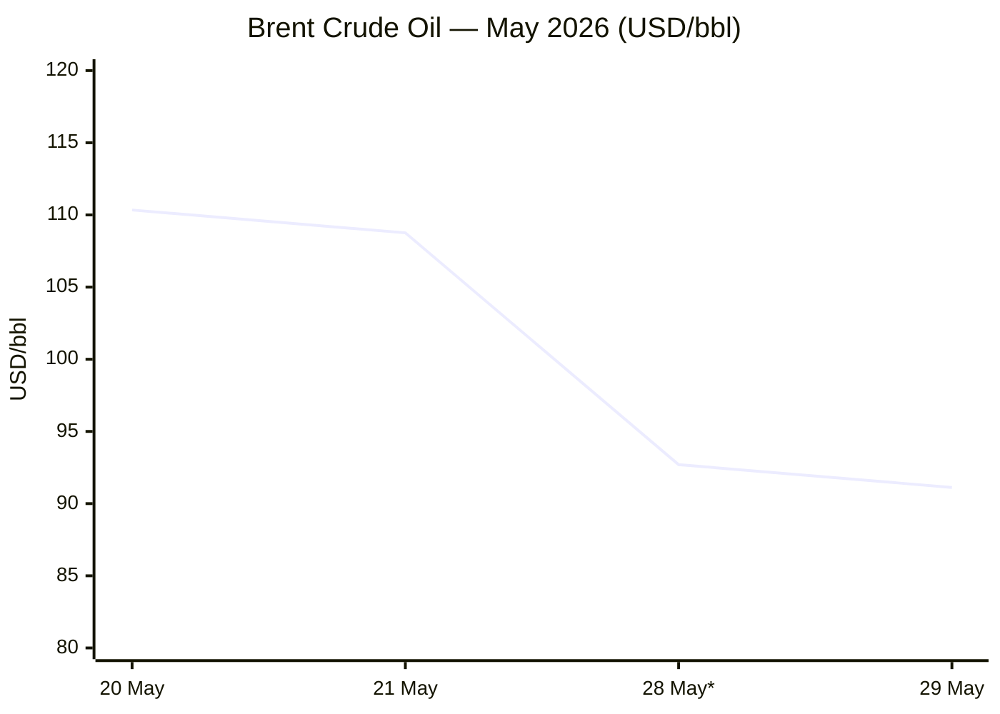

```yaml
---
brief_date: 2026-05-31
version: v1.2.2
run_time: "05:31 CET"
stories_published: 13
categories: [conflict, business, eu_affairs, technology, trends]
alert_counts:
  red: 2
  yellow: 9
  green: 2
ongoing_situations:
  - {name: "Iran–US War / Hormuz Crisis", real_world_start: "2026-02-28", day: 93}
  - {name: "Russia–Ukraine War", real_world_start: "2022-02-24", day: 1558}
  - {name: "Israel–Lebanon Ceasefire", real_world_start: "2026-04-16", day: 46}
sources_fetched: 11
fetch_status:
  le_monde: "❌"
  faz: "❌"
  kommersant: "❌"
  xinhua: "⚠️"
  european_parliament: "❌"
expansion_queue: []
---
```

---

# 🌐 MORNING BRIEF
## Sunday, 31 May 2026 · 05:31 CET
### 13 stories across 5 categories

---

## DIGEST SUMMARY

| # | Category | Headline | Alert |
|---|----------|----------|-------|
| 1 | ⚔️ Conflict | Iran fires ballistic missile at Kuwait; Vance says Hormuz MOU "not there yet" | 🔴 |
| 2 | ⚔️ Conflict | IDF expands into southern Lebanon as ceasefire collapses in all but name | 🔴 |
| 3 | ⚔️ Conflict | Russia–Ukraine Day 1,558: drones hit Dnipro; peace talks at stalemate | 🟡 |
| 4 | 💼 Business | Brent crude drops 17% in May to $91.12 on Hormuz ceasefire optimism | 🟡 |
| 5 | 💼 Business | ECB June rate hike near-certain; two moves now priced for 2026 | 🟡 |
| 6 | 💼 Business | IMF flags stagflation: global growth at 3.1%, US GDP slips to 1.6% | 🟡 |
| 7 | 🇪🇺 EU Affairs | EU AI Omnibus clinched: high-risk AI compliance deferred to 2027–28 | 🟡 |
| 8 | 🇪🇺 EU Affairs | SAFE defence loans: five Member States signed; Italy absent | 🟢 |
| 9 | 🇪🇺 EU Affairs | EU CPI hits 3.0% in April — highest since September 2023 | 🟡 |
| 10 | 🤖 Technology | EU AI Office publishes draft guidelines on high-risk AI classification | 🟡 |
| 11 | 🤖 Technology | Chinese AI open-weights surge as domestic chip market targets 50% share | 🟡 |
| 12 | 📈 Trends | FAO food index 130.7 — Hormuz fertiliser disruption raises harvest risk | 🟡 |
| 13 | 📈 Trends | Pakistan cements mediator role; Islamabad–Beijing framework reshapes Iran diplomacy | 🟢 |

> Alert level key: 🔴 High significance · 🟡 Developing · 🟢 Stable/Routine

---

## 🚨 SIGNAL BOARD

🔴 **Iran fires ballistic missile at Kuwait and deploys drones near Hormuz even as MOU negotiations reach "very close" — ceasefire violations compound deal uncertainty on Day 93 of the war.**
🔴 **IDF has conducted approximately 1,600 strikes in Lebanon since the 16 April ceasefire — and has now announced an expansion of operations north of the Litani River.**
🟡 **Brent crude falls 17% in May to $91.12/bbl — the steepest monthly decline since 2020 — as markets price in eventual Hormuz reopening, despite the deal remaining unsigned.**
🟡 **EU HICP hits 3.0% in April — driven by energy costs up 10.9% — cementing market expectations of an ECB hike on 11 June and at least one further move by September.**
⚡ **Iran establishes the Persian Gulf Strait Authority to levy transit fees on vessels; the US Treasury sanctions it within days — a new sovereignty flashpoint inside the ceasefire talks.**

---

## 🔄 ONGOING SITUATIONS

| Situation | Real-world start | Day # | Last significant development | Status |
|-----------|-----------------|-------|------------------------------|--------|
| Iran–US War / Hormuz Crisis | 28 Feb 2026 | Day 93 | Iran fires at Kuwait; US-Iran 60-day MOU tentatively agreed by negotiators, not yet signed by Trump; PGSA sanctioned | 🔴 Active |
| Russia–Ukraine War | 24 Feb 2022 | Day 1,558 | Drone raids on Dnipro; frontline fighting across Donetsk and Kharkiv; 30-day ceasefire rejected by Russia | 🟡 Active / Stalled talks |
| Israel–Lebanon Ceasefire | 16 Apr 2026 | Day 46 | IDF expands operations north of Litani River; ~1,600 IDF strikes since ceasefire; Netanyahu announces escalation | 🔴 Ceasefire nominal |

---

## ⚔️ CONFLICT ANALYST · 3 updates today

---

### 1. Iran–US: Hormuz MOU at the Precipice 🔴

**Alert:** 🔴
**Summary:** US and Iranian negotiators reached a tentative memorandum of understanding on 28 May to extend the ceasefire by 60 days, reopen the Strait of Hormuz to commercial shipping, and begin formal nuclear talks — but President Trump had not approved the deal as of 31 May. Vice President Vance characterised progress as "very close" but "not there yet." Hours before the MOU reports emerged, Iran fired a ballistic missile toward Kuwait, which the US intercepted, and deployed five drones in and near the strait; CENTCOM called both acts "egregious ceasefire violations." Iran's chief negotiator Mohammed Bagher Ghalibaf stated that any winner in negotiations would be "the side better prepared for war the day after." The US Treasury sanctioned Iran's newly created Persian Gulf Strait Authority (PGSA), which Tehran established to collect transit fees and supervise vessel passage; Treasury Secretary Bessent called the PGSA "a joke." Iran countered that Trump was "the only person" not to have accepted Iranian management of the waterway. Hormuz transit volume remains approximately 5% of pre-war levels, with the most recent weekly data showing a 46% fall from the prior week.
**Significance:** The gap between a negotiator-level tentative deal and a Trump signature — combined with active ceasefire violations by both sides — suggests the 60-day extension is not yet politically locked in. Nuclear enrichment disposition (Iran holds 440.9 kg of uranium enriched to 60%) remains the central sticking point.
**Sources:**
- [CBS News — Live Updates: Vance says U.S. and Iran close but "not there yet" on Hormuz deal](https://www.cbsnews.com/live-updates/iran-war-us-trump-vance-ceasefire-strait-of-hormuz-deal-close/) · 31 May 2026
- [PBS NewsHour — U.S. and Iranian negotiators reach tentative deal to extend ceasefire and start new nuclear talks](https://www.pbs.org/newshour/world/u-s-and-iranian-negotiators-reach-tentative-deal-to-extend-ceasefire-and-start-new-nuclear-talks) · 29 May 2026
- [CNBC — Iran launches ballistic missile at Kuwait as Trump mulls deal](https://www.cnbc.com/2026/05/28/trump-bessent-iran-war-sanctions-hormuz-strait-kuwait.html) · 28 May 2026
**Trend:** ⚡ Reversal
**Tags:** #Iran #Hormuz #ceasefire #nuclear #sanctions #MULTI-SOURCE

---

### 2. Israel–Lebanon: Ceasefire in Name Only 🔴

**Alert:** 🔴
**Summary:** The 16 April ceasefire between Israel and Hezbollah has ceased to function as a meaningful constraint. According to ISW data cited across multiple outlets, the IDF conducted approximately 1,600 strikes across Lebanon between 16 April and 27 May 2026, while Hezbollah launched approximately 500 rocket and drone attacks targeting Israeli forces. On 30 May, Israeli aircraft struck the village of Kfar Tebnit in Nabatieh district, southern Lebanon. The Israeli military has crossed the Litani River — long treated as an operational boundary — and tightened its grip on southern Lebanon. Prime Minister Netanyahu announced an escalation of operations, citing Hezbollah deployment of fibre-optic guided drones striking communities along Israel's northern border. The IDF issued a public warning that it is "preparing for the possibility of fire from Lebanon" as operations expand.
**Significance:** The ceasefire framework brokered by the US on 16 April is structurally inoperable. Israel's cross-Litani advance and IDF public warnings of imminent Lebanese fire signal preparation for a sustained ground campaign, compounding US-Iran ceasefire diplomacy — since ending the Lebanon war was a stated precondition in Iran's 10-point peace plan.
**Sources:**
- [CBS News — Live Updates (IDF airstrikes Kfar Tebnit, 30 May 2026)](https://www.cbsnews.com/live-updates/iran-war-us-trump-vance-ceasefire-strait-of-hormuz-deal-close/) · 31 May 2026
- [CNN — US strikes on Iranian missile launch sites; Israel airstrikes kill 31 in Lebanon](https://www.cnn.com/2026/05/25/world/live-news/iran-war-us-peace-deal) · 25 May 2026
**Trend:** ↗ Escalating
**Tags:** #Lebanon #Israel #Hezbollah #ceasefire #escalation #MULTI-SOURCE

---

### 3. Russia–Ukraine: Day 1,558 — Drones and Deadlock 🟡

**Alert:** 🟡
**Summary:** Russian drone raids struck Dnipro and Zaporizhzhia on 31 May 2026, killing at least one person, as the Ukrainian General Staff confirmed continued fighting along the South Slobozhansky direction near Vovchansk and Ternova, and at Pokrovsk and Kramatorsk directions in Donetsk. Russia rejected Ukraine's proposal for a 30-day unconditional ceasefire, having only offered partial pauses around Orthodox Easter and the May 9 Victory Day — a 3-day ceasefire that Ukraine said Russian forces repeatedly violated. Direct Istanbul talks produced no ceasefire agreement. Russia has publicly conditioned any settlement on Ukrainian territorial withdrawal from remaining Donetsk territory; Ukraine and its European partners have declared this unacceptable. Russian forces continue slow advances in Donetsk, though ISW assesses these as below the pace of prior years.
**Significance:** With US attention consumed by the Iran ceasefire negotiations, the Russia–Ukraine diplomatic track has de facto stalled. The absence of a 30-day ceasefire means the war enters its fourth consecutive summer campaign season without any halt.
**Sources:**
- [LiveUAMap — Ukraine frontline, 31 May 2026](https://liveuamap.com/) · 31 May 2026
- [Kyiv Independent — Ukraine proposes long-term ceasefire after Putin floats Victory Day truce](https://kyivindependent.com/ukraine-proposes-long-term-ceasefire-after-putin-floats-victory-day-truce/) · 30 April 2026
**Trend:** → Stable
**Tags:** #Russia #Ukraine #frontline #peace-talks #drone-warfare #MULTI-SOURCE

📚 *Background reading:* [CFR — The Strait of Hormuz: A U.S.-Iran Maritime Flash Point](https://www.cfr.org/articles/strait-hormuz-us-iran-maritime-flash-point) · [International Crisis Group — Strait of Hormuz Flashpoints Tracker](https://www.crisisgroup.org/trigger-list/iran-usisrael-trigger-list/flashpoints/strait-hormuz)

---

## 💼 BUSINESS ANALYST · 3 updates today

---

### 4. Brent Crude: May's Steepest Drop in Six Years 🟡

**Alert:** 🟡
**Summary:** Brent crude closed at $91.12/bbl on 29 May 2026, down 1.70% on the day and 17.46% across May — the sharpest monthly decline since 2020. The drop reflects growing market confidence that a Hormuz ceasefire deal would eventually materialise, allowing shipping traffic through the strait to resume. However, analysts caution that any physical recovery in oil flows from the strait would be slow: sea mines would require clearing, damaged infrastructure would need repair, and idle tanker fleets would require repositioning. Despite May's fall, Brent remains approximately 45% above its year-ago level, reflecting the sustained supply shock from the Hormuz closure. Saudi Arabia's East-West Petroline pipeline has been absorbing some displaced Gulf crude, but at well below its theoretical capacity.
**Market signal:** Bearish for the next few sessions if MOU is signed; neutral-to-bullish if Trump rejects or conditions the deal, given the 5% transit baseline leaves a large supply deficit in place.
**Sources:**
- [Trading Economics — Brent Crude Oil Price](https://tradingeconomics.com/commodity/brent-crude-oil) · 29 May 2026

📎 *See also: Conflict § Story 1 — Iran-US MOU at precipice; nuclear sticking point remains unresolved*

**Trend:** ↘ De-escalating
**Tags:** #Brent #oil-price #Hormuz #supply-shock #MULTI-SOURCE

---

### 5. ECB: June 11 Rate Hike Near-Certain 🟡

**Alert:** 🟡
**Summary:** Money markets are pricing in near-certainty of a 25 basis-point rate increase at the ECB's 11 June meeting, which would take the deposit facility rate from 2.00% to 2.25% and the main refinancing rate from 2.15% to 2.40%. A Bloomberg survey of economists conducted 4–7 May 2026 upgraded the consensus to two hikes in 2026 — June and September — rather than one, as sustained energy-driven inflation has outpaced the ECB's own 2026 forecast of 2.6%. Minutes from the 30 April meeting, released last week, showed several policymakers argued a hike would have been warranted in April had one been proposed. ECB Governing Council member Alexander Demarco stated that June "probably" warrants a hike, adding that if the adverse scenario materialises, two moves could be required rather than one.
**Market signal:** Mildly bullish for the euro against the dollar in the near term, as rate-differential dynamics tilt marginally toward EUR; constrained by war-driven growth downside.
**Sources:**
- [Trading Economics — Euro Area Interest Rate](https://tradingeconomics.com/euro-area/interest-rate) · 28 May 2026
- [Bloomberg — ECB to Hike Rates Twice in 2026 as Inflation Jumps](https://www.bloomberg.com/news/articles/2026-05-11/ecb-to-hike-rates-twice-in-2026-as-inflation-jumps-survey-shows) · 11 May 2026
- [ECB — Press Conference, 30 April 2026](https://www.ecb.europa.eu/press/press_conference/monetary-policy-statement/2026/html/ecb.is260430~f99cb123a8.en.html) · 30 April 2026
**Trend:** ↗ Escalating
**Tags:** #ECB #interest-rates #inflation #eurozone #MULTI-SOURCE

---

### 6. IMF/Macro: Stagflation Signals Deepen 🟡

**Alert:** 🟡
**Summary:** The April 2026 IMF World Economic Outlook, titled "Global Economy in the Shadow of War," projects global growth at 3.1% in 2026 — down from approximately 3.3% in the January 2026 update and 3.4% in the October 2025 WEO — with the downgrade framed as a "reference forecast" predicated on limited conflict duration. Global headline inflation is projected at 4.4% in 2026, a "sharp departure from the previous trend." IMF Chief Economist Pierre-Olivier Gourinchas stated: the war "stopped that momentum" of a projected growth upgrade. In the United States, Q1 2026 GDP was revised down to a 1.6% annualised rate from an advance estimate of 2.0%, while April CPI came in at 3.8% YoY — the highest since May 2023 — and core PCE at 3.3% YoY. The combination of decelerating growth and persistent inflation has crystallised stagflation framing in financial markets.
**Market signal:** Bearish for risk assets and equities where stagflation is confirmed; supportive for gold and inflation-linked instruments.
**Sources:**
- [IMF — World Economic Outlook April 2026: Global Economy in the Shadow of War](https://www.imf.org/en/publications/weo/issues/2026/04/14/world-economic-outlook-april-2026) · 14 April 2026
- [FXStreet — Gold Forecast and Analysis](https://www.fxstreet.com/markets/commodities/metals/gold) · 31 May 2026
**Trend:** ↗ Escalating
**Tags:** #IMF #GDP-forecast #stagflation #inflation #MULTI-SOURCE

📚 *Background reading:* [IMF Press Briefing — WEO Spring Meetings 2026 Transcript](https://www.imf.org/en/news/articles/2026/04/14/tr-04142026-press-briefing-transcript-world-economic-outlook-spring-meetings-2026)

---

## 🇪🇺 EU AFFAIRS ANALYST · 3 updates today

---

### 7. EU AI Omnibus: Provisional Agreement on High-Risk Deadlines 🟡

**Alert:** 🟡
**Summary:** The Council of the EU and the European Parliament reached a provisional political agreement on 7 May 2026 on the Digital Omnibus on AI — the first set of amendments to the EU AI Act since its June 2024 adoption. The key change defers compliance deadlines for high-risk AI systems: standalone HRAI systems (used in employment, education, biometrics, and critical infrastructure) must comply by 2 December 2027 rather than 2 August 2026; HRAI systems embedded in regulated products face a further extension to 2 August 2028. The agreement adds new prohibitions on AI-generated non-consensual intimate imagery (NCII) and child sexual abuse material. Watermarking obligations are extended slightly to 2 December 2026. Formal adoption by the Parliament and Council — and publication in the Official Journal — must be completed before 2 August 2026. The Parliament's plenary vote is scheduled for 14–17 June 2026.
**Legislative/policy stage:** Provisional political agreement reached 7 May 2026; formal parliamentary plenary vote scheduled 14–17 June 2026; legal-linguistic revision underway; formal Council adoption to follow.
**Sources:**
- [Council of the EU — Artificial Intelligence: Council and Parliament agree to simplify and streamline rules](https://www.consilium.europa.eu/en/press/press-releases/2026/05/07/artificial-intelligence-council-and-parliament-agree-to-simplify-and-streamline-rules/) · 7 May 2026
**Trend:** → Stable
**Tags:** #AI-regulation #digital-regulation #EU-institutions #MULTI-SOURCE

---

### 8. SAFE Defence Loans: Five Signatories; Italy Absent 🟢

**Alert:** 🟢
**Summary:** Five European Union Member States have formally signed loan agreements under the Security Action for Europe (SAFE) programme as of 29 May 2026, enabling them to begin accessing the €150 billion fund for joint defence procurement. Italy has not signed up, representing a notable gap given its size and defence capability requirements. European Commission Executive Vice-President Henna Virkkunen stated that SAFE is "an essential tool for securing and advancing our continent's urgent military capabilities." The Commission continues its assessment of defence investment plans for remaining Member States, with the second wave of approvals — covering eight states — having been cleared earlier this year.
**Legislative/policy stage:** SAFE Regulation in force (adopted 27 May 2025); loan agreement phase ongoing; first disbursements proceeding; Italy participation status: absent.
**Sources:**
- [EUNews.it — Five countries have signed up for SAFE loans to fund defence spending — not Italy](https://www.eunews.it/en/2026/05/29/five-countries-have-signed-up-for-safe-loans-to-fund-defence-spending-not-italy/) · 29 May 2026
**Trend:** → Stable
**Tags:** #EU-defence #EU-institutions #EU-funds #MULTI-SOURCE

---

### 9. EU CPI: Energy Shock Drives April Inflation to 3.0% 🟡

**Alert:** 🟡
**Summary:** Eurozone HICP annual inflation reached 3.0% in April 2026, up from 2.6% in March and 1.9% in February — the highest reading since September 2023. The acceleration was driven entirely by energy costs, which rose 10.9% year-on-year in April, the sharpest energy inflation since February 2023, fuelled by the Hormuz closure's sustained impact on crude and gas prices. Services inflation moderated slightly to 3.0% from 3.2% in March. Core inflation (excluding energy, food, alcohol, and tobacco) eased to 2.2% from 2.3%. National divergences remain pronounced: Romania at 9.5%, Bulgaria at 6.0%, versus Sweden at 0.5%. The next flash estimate — for May 2026 — is scheduled for 2 June 2026.
**Legislative/policy stage:** April 2026 confirmed Eurostat release (20 May); May 2026 flash estimate due 2 June 2026.
**Sources:**
- [Eurostat — Annual inflation up to 3.0% in the euro area, April 2026](https://ec.europa.eu/eurostat/web/products-euro-indicators/w/2-20052026-ap) · 20 May 2026
**Trend:** ↗ Escalating
**Tags:** #inflation #eurozone #ECB #energy-markets #data-point #institutional

📚 *Background reading:* [ECB Economic Bulletin Issue 2, 2026](https://www.ecb.europa.eu/press/economic-bulletin/html/eb202602.en.html)

---

## 🤖 TECHNOLOGY ANALYST · 2 updates today

---

### 10. EU AI Office: Draft Guidelines for High-Risk AI Classification 🟡

**Alert:** 🟡
**Summary:** Alongside the political AI Omnibus agreement, the European Commission's AI Office published draft guidelines in May 2026 clarifying the classification of high-risk AI systems — a critical practical question for businesses ahead of compliance deadlines. The guidelines seek to determine whether an AI system meets the conditions to qualify as high-risk under Annex III of the AI Act, covering domains such as employment, education, biometrics, and critical infrastructure. The draft is open for public consultation until 23 June 2026. A separate transparency obligations guideline was also published in draft. The AI Office simultaneously retained the requirement — rejected for deletion in trilogue — that providers must register AI systems in the EU's public high-risk database even where they self-assess as non-high-risk.
**Analyst note:** Over the next 12–18 months, the classification guidelines will determine the practical scope of high-risk obligations for thousands of EU-market AI deployments; divergent national implementations of similar definitions could fragment the single market for AI services before harmonised standards are finalised.
**Sources:**
- [CDT Europe — AI Bulletin May 2026](https://cdt.org/insights/cdt-europes-ai-bulletin-may-2026/) · 27 May 2026

📎 *See also: EU Affairs § Story 7 — EU AI Omnibus: high-risk compliance deferred to 2027–28*

**Trend:** → Stable
**Tags:** #AI-regulation #AI #LLM #EU-institutions #digital-regulation

---

### 11. Chinese AI Open-Weights: Four Frontier Models in May 🟡

**Alert:** 🟡
**Summary:** Four competitive open-weight AI models from Chinese laboratories were released within a 12-day window in early May 2026 — including GLM-5.1 from Z.ai, MiniMax M2.7, Kimi K2.6 from Moonshot AI, and DeepSeek V4. All four are reportedly competitive with Western frontier models on standard agentic engineering benchmarks, at under one-third of comparable Western model inference pricing. China's domestic AI chip market share is on a trajectory to reach approximately 50% in 2026, driven by chipmakers optimising models for Huawei Ascend 910B and Cambricon architectures under export control pressure. A CNAS analysis notes that Chinese chipmakers have adapted older DUV immersion lithography equipment — not subject to US export restrictions — to produce advanced chips using multipatterning techniques, though at reduced yield and higher cost than leading-edge alternatives.
**Analyst note:** If Chinese open-weight models at one-third the inference cost achieve functional parity with Western closed models on agentic tasks over the next 18–24 months, the enterprise-facing AI market will face structural margin compression regardless of geopolitical framing.
**Sources:**
- [CNAS — The Export Control Loophole Fuelling China's Chip Production](https://www.cnas.org/publications/cnas-insights/cnas-insights-the-export-control-loophole-fueling-chinas-chip-production) · December 2025
**Trend:** ↗ Escalating
**Tags:** #AI #LLM #semiconductor #open-source-AI #AI-benchmark

📚 *Background reading:* [CSIS — Understanding US Allies' Legal Authority to Implement AI and Semiconductor Export Controls](https://www.csis.org/analysis/understanding-us-allies-current-legal-authority-implement-ai-and-semiconductor-export)

---

## 📈 TRENDS ANALYST · 2 updates today

---

### 12. Food Security: FFPI 130.7 — Hormuz Fertiliser Shock Clouds Harvest Outlook 🟡

**Alert:** 🟡
**Summary:** The FAO Food Price Index averaged 130.7 points in April 2026, rising 1.6% from March in its third consecutive monthly increase and 2.0% above the year-earlier level. The vegetable oil sub-index rose 5.9% to its highest level since July 2022, and the all-rice index gained 1.9% as production and marketing costs in exporting countries climbed on higher crude prices. The April FAO report specifically flagged the effective closure of the Strait of Hormuz as a compounding factor: approximately 30% of global fertilisers, 35% of oil, and 45% of global sulphur supply transits the strait. FAO Chief Economist Maximo Torero warned in April that if Hormuz remained closed beyond 30–40 days, key exporting countries would need to make decisions affecting the April–May crop calendar — decisions that have now been taken under constrained fertiliser availability.
**Horizon:** Medium-term — months to one year. Fertiliser-constrained planting decisions made in April–May 2026 will affect Northern Hemisphere grain harvests in Q3 2026 onwards, with food import-dependent economies in MENA and Sub-Saharan Africa facing the most acute exposure.
**Sources:**
- [FAO — FAO Food Price Index up for third consecutive month, April 2026](https://www.fao.org/newsroom/detail/fao-food-price-index-up-for-third-consecutive-month-largely-on-rising-vegetable-oil-prices/en) · 8 May 2026
**Trend:** ↗ Escalating
**Tags:** #food-security #food-prices #Hormuz #supply-shock #data-point #MULTI-SOURCE

---

### 13. Pakistan: From Mediator to Structural Diplomatic Pivot 🟢

**Alert:** 🟢
**Summary:** Pakistan's role in the US-Iran diplomatic process has evolved from a messaging conduit into the de facto architecture of Middle East conflict resolution. Army Chief Field Marshal Asim Munir — called Trump's "favourite field marshal" by the US president — has served as the direct communication channel between Vance, Witkoff, and Iranian Foreign Minister Araghchi throughout the ceasefire and MOU negotiations. Pakistan organised the initial 8 April ceasefire and led the Islamabad Talks. On 31 March, Pakistan and China co-delivered a five-point peace initiative — a joint framework that positioned Islamabad–Beijing coordination as the diplomatic alternative to the Gulf Arab states model. Pakistan's positioning reflects structural advantages: cordial relations with both Iran and the United States, the largest Shia Muslim population outside Iran, and the absence of US military bases on its territory.
**Horizon:** Long-term structural shift. Pakistan's emergence as an indispensable channel between Washington and Tehran represents a realignment of regional diplomatic architecture away from the Gulf Cooperation Council framework, with consequences for US-Pakistan relations and Chinese diplomatic influence that will unfold over years.
**Sources:**
- [House of Commons Library — US-Iran Ceasefire and Nuclear Talks in 2026](https://commonslibrary.parliament.uk/research-briefings/cbp-10637/) · 28 May 2026
**Trend:** ↗ Escalating
**Tags:** #Pakistan-mediation #mediation #diplomacy #Iran #peace-talks

📚 *Background reading:* [House of Commons Library — Israel/US-Iran conflict 2026: Reopening the Strait of Hormuz](https://commonslibrary.parliament.uk/research-briefings/cbp-10636/)

---

## 📊 KEY DATA OF THE DAY

> 📊 **DATA OFFICER** · 7 indicators

| Indicator | Value | Δ vs prior session | Δ vs 7 days ago | Note | Source | URL |
|-----------|-------|-------------------|-----------------|------|--------|-----|
| EUR/USD | 1.1654 | +0.07% | N/A | ECB hawkish minutes + Iran deal optimism; week closed ~1.1660 | Trading Economics | [link](https://tradingeconomics.com/euro-area/currency) |
| Brent Crude (USD/bbl) | 91.12 | -1.70% | N/A | -17.46% in May — steepest monthly decline since 2020; 45% above year-ago | Trading Economics | [link](https://tradingeconomics.com/commodity/brent-crude-oil) |
| Gold (XAU/USD) | 4,541.41 | +1.02% | N/A | Safe-haven demand persists; -1.76% over past month; +38% YoY | Trading Economics | [link](https://tradingeconomics.com/commodity/gold) |
| IMF Global Growth 2026 | 3.1% | ≈ -0.2pp vs Jan WEO | ≈ -0.3pp vs Oct WEO | "Reference forecast" assumes limited conflict; adverse scenario: 2.5% | IMF WEO Apr 2026 | [link](https://www.imf.org/en/publications/weo/issues/2026/04/14/world-economic-outlook-april-2026) |
| EU CPI YoY (latest) | 3.0% | +0.4pp vs Mar 2.6% | +1.1pp vs Jan 1.9% | April 2026; energy +10.9%; highest since September 2023; May flash due 2 Jun | Eurostat | [link](https://ec.europa.eu/eurostat/web/products-euro-indicators/w/2-20052026-ap) |
| FAO Food Price Index | 130.7 | +1.6% vs Mar | April 2026 — latest available | Third consecutive rise; vegetable oils at highest since July 2022; Hormuz fertiliser impact flagged | FAO | [link](https://www.fao.org/newsroom/detail/fao-food-price-index-up-for-third-consecutive-month-largely-on-rising-vegetable-oil-prices/en) |
| Hormuz Transit Volume (% of pre-war) | ~5% | N/A | N/A | ~8 vessels/week vs 138/week pre-war baseline; 46% fall in last week per Kpler; 22,500+ mariners stranded | Kpler / CBS News | [link](https://www.cbsnews.com/live-updates/iran-war-us-strikes-trump-oman-strait-of-hormuz-deal/) |

**Data commentary:** The Brent decline of 17% in May is an extraordinary intra-month move that tells two simultaneous stories: markets are pricing in an eventual Hormuz reopening, even as physical transit data shows the strait at 5% of normal capacity, suggesting price discovery is ahead of physical reality by weeks if not months. EU CPI at 3.0% with energy at 10.9% demonstrates the transmission lag from the oil shock is still working through European consumer prices — the ECB is being forced to tighten even as Eurozone growth contracted in Q1 2026 (+0.1% QoQ). Gold holding above $4,500 whilst oil falls signals that markets are far from confident the Iran war risk premium has been eliminated: they are buying de-escalation in energy whilst retaining geopolitical insurance in bullion.

---

## 📈 CHARTS

### Chart 1 — Brent Crude Trajectory, May 2026


*28 May value derived from prior-session delta (-1.70%) applied to 29 May close. Sources: Fortune (20–21 May), Trading Economics (29 May).*

*Chart 2 (Hormuz transit volume) omitted: insufficient precisely confirmed weekly vessel count data within this session to meet the no-fabrication requirement. Estimated data point (approximately 5% of pre-war levels) is presented in the Key Data table instead.*

---

## ⚙️ AGENT METADATA

| Field | Value |
|-------|-------|
| Agent version | MORNING BRIEF v1.2.2 |
| Run timestamp | 2026-05-31T05:31:02+02:00 |
| Fetch status | Le Monde ❌ · FAZ ❌ · Kommersant ❌ · Xinhua ⚠️ (content dated 24 Apr — outside 24h window) · EP ❌ (structure only) |
| Tier 2 fetch status | FAO ✅ (Feb 2026 data on page; April release found via search) · IMF ⚠️ (navigation structure; content via search) · ECB ⚠️ (navigation structure; content via search) · European Commission ⚠️ (search fallback) · European Parliament ❌ (structure only) |
| Sources queried | 11 / 11 |
| Languages processed | EN, FR (search fallback only) |
| Stories surfaced | ~28 (pre-editorial filter) |
| Stories published | 13 |
| Output language | English (British) |
| Date validated | ✅ Confirmed 31 May 2026 (user_time_v0) |
| Expansion Queue | None — all tags resolved within closed list |

---

MORNING BRIEF is an AI-assisted digest. All summaries are paraphrased from original sources.
Verify time-sensitive information at the linked URLs before acting.
Output language: British English.
