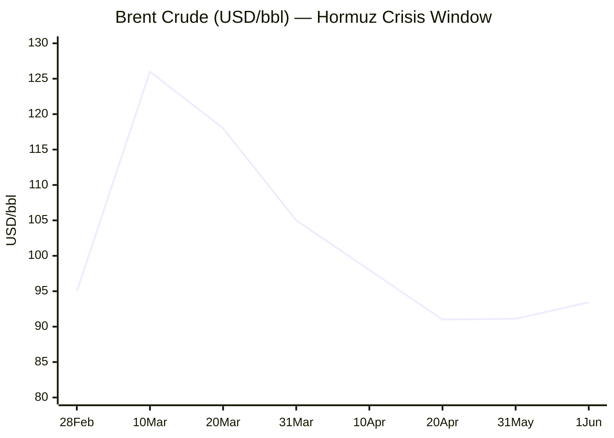
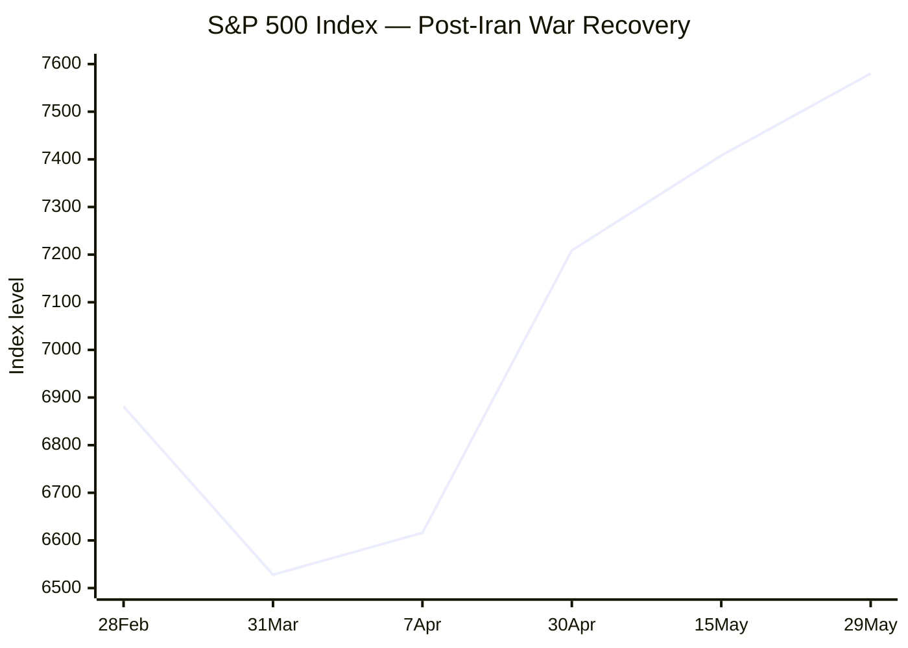

```yaml
---
brief_date: 2026-06-01
version: v1.2
run_time: "05:42 CET"
stories_published: 12
categories: [conflict, business, eu_affairs, technology, trends]
alert_counts:
  red: 4
  yellow: 5
  green: 3
ongoing_situations:
  - {name: "2026 Iran war / Hormuz crisis", day: 94}
  - {name: "2026 Lebanon war / Israel-Hezbollah conflict", day: 92}
sources_fetched: 11
fetch_status:
  le_monde: "❌"
  faz: "❌"
  kommersant: "❌"
  xinhua: "❌"
  european_parliament: "❌"
expansion_queue: []
---
```

🌐 MORNING BRIEF

Monday, 1 June 2026 · 05:42 CET

12 stories across 5 categories

---

DIGEST SUMMARY

| # |	Category | Headline	| Alert	| Day #	|
| --- | --- | --- | --- | --- |
| 1|	⚔️ Ongoing Wars |	Hormuz transit volume edges up as US advises commercial vessels	|🟡	| Day 94	|
| 2 |	⚔️ Ongoing Wars	| Israel-Lebanon ceasefire extended 45 days; Hezbollah excluded |	🟡	| Day 92 |	
|3|	⚔️ Ongoing Wars|	Iran war: US-Iran ceasefire talks stall; naval blockade persists |	🔴	| Day 94	|
|4|	💼 Business|	Brent crude rebounds to 93.43 on Hormuz uncertainty	| 🟡 |	—	|
|5	|💼 Business|	S&P 500 closes May near record high at 7,580 |	🟢	| —	|
|6|	💼 Business|	ECB June rate hike probability fades to 50/50 on growth fears |	🟡 |	—	|
|7|	🇪🇺 EU Affairs|	Commission agrees €16.2bn Hungary funds deal with reform milestones |	🟡	| —	|
|8|	🇪🇺 EU Affairs|	EU AI Act full enforcement 62 days away; omnibus simplification agreed |	🟢 |	— |
|9|	🤖 Technology	|No significant technology developments in the last 24 hours	| 🟢 |	—	|
|10|	📈 Trends|	FAO Food Price Index rises for third consecutive month to 130.7 |	🟡 |	—	|
|11|	📈 Trends|	IMF cuts 2026 global growth to 3.1% on Middle East war impact	| 🔴 |	—	|
|12	|📈 Trends|	Eurozone inflation hits 3.0% in April on energy shock |	🔴 	—	|

> Alert Level key: 🔴 High significance · 🟡 Developing · 🟢 Stable/Routine
Day # column: Day 1 = first date the situation appeared in this Brief series.
Real-world start date is recorded in the Ongoing Situations Tracker below.

---

|🚨| SIGNAL BOARD|
| --- | --- |
|🔴| Eurozone CPI jumped to 3.0% in April — energy component surged to 10.9% YoY, the highest since the 2022 crisis|
|🔴| IMF April WEO: global growth cut to 3.1% for 2026; severe scenario risks 1.3pp additional drag|
|🟡| Brent crude recovered to 93.43/bbl as US-Iran Hormuz negotiations remain unresolved|
|🟡 |S&P 500 closed May at 7,580 — within 1% of all-time highs despite geopolitical headwinds|
|⚡| ECB June hike probability collapsed from 86% to roughly 50% in two weeks as eurozone stagnation fears mount|

---

⚔️ CONFLICT ANALYST · 3 updates today

> 🔎 CONFLICT ANALYST · 3 updates today

1. Hormuz transit volume edges up as US advises commercial vessels 🟡
Alert: 🟡
Summary: Commercial transits through the Strait of Hormuz have shown tentative signs of recovery, with shipowners reporting increased contact with US Central Command for navigation advice. At least a quarter of non-Iranian vessels stranded since February have exited the Persian Gulf. Some ships transited with transponders off, suggesting actual volumes may exceed tracking data. Chevron confirmed recent attacks on vessels, and the White House reiterated that deals with Iran for safe passage — even toll-free — remain prohibited.
Significance: A sustained reopening would relieve the 20% of global oil and LNG trade that transits Hormuz, but analysts warn a "frenzy phase" of rate volatility would follow any formal reopening as inventories refill.
Sources:
- [Business Times — Strait of Hormuz ship transits are rising thanks to US help](https://www.businesstimes.com.sg/international/strait-hormuz-ship-transits-are-rising-thanks-us-help) · 31 May 2026
Trend: ↗ Escalating
Tags: #Hormuz #naval-blockade #Iran #shipping

2. Israel-Lebanon ceasefire extended 45 days; Hezbollah excluded 🟡
Alert: 🟡
Summary: The US-brokered ceasefire between Israel and Lebanon was extended by 45 days on 15 May following a third round of direct talks in Washington. The truce, originally a 10-day measure announced 16 April, now runs through late June. A fourth round of talks is scheduled for 2–3 June. Hezbollah has declared it is not bound by the agreement and continues strikes on Israeli positions. Israel maintains its "right to self-defence" and has carried out near-daily strikes on claimed Hezbollah infrastructure in southern Lebanon.
Significance: The exclusion of Hezbollah from the talks framework undermines durability; the group fired over 1,300 attack waves into Israel during the Iran war and retains substantial rocket arsenal.
Sources:
- [Euronews — Israel and Lebanon extend their ceasefire by 45 days](https://www.euronews.com/2026/05/15/lebanonisrael-ceasefire-extended-by-45-days-says-us) · 15 May 2026
- [Wikipedia — 2026 Israel–Lebanon peace talks](https://en.wikipedia.org/wiki/2026_Israel%E2%80%93Lebanon_peace_talks) · 10 April 2026
Trend: → Stable
Tags: #Israel #Lebanon #Hezbollah #ceasefire #peace-talks

3. Iran war: US-Iran ceasefire talks stall; naval blockade persists 🔴
Alert: 🔴
Summary: The temporary ceasefire brokered by Pakistan on 8 April remains technically in place but diplomatic progress has stalled. US Vice President JD Vance and Iranian Parliament Speaker Mohammad Bagher Ghalibaf failed to reach agreement during Islamabad talks on 11–12 April. The US Navy continues to blockade Iranian ports, while Iran restricts Hormuz transit and reportedly demands tolls exceeding 1 million per vessel. President Trump has sent conflicting signals on prospects for a broader deal.
Significance: The dual blockade — US naval blockade of Iran and Iranian restrictions on the Gulf — has stranded over 1,550 vessels and 22,500 mariners, per Joint Chiefs Chairman General Dan Caine. DHL forecasts 4–6 months to normalisation.
Sources:
- [Wikipedia — 2026 Iran war ceasefire](https://en.wikipedia.org/wiki/2026_Iran_war_ceasefire) · 6 April 2026
- [Britannica — 2026 Iran war](https://www.britannica.com/event/2026-Iran-war) · 6 March 2026
Trend: → Stable
Tags: #Iran #Hormuz #naval-blockade #sanctions #Pakistan-mediation

📚 Background reading: [Atlantic Council — Geopolitics of the Hormuz chokepoint](https://www.atlanticcouncil.org) · [CSIS — Iran military capabilities assessment](https://www.csis.org)

---

💼 BUSINESS ANALYST · 3 updates today

> 💼 BUSINESS ANALYST · 3 updates today

1. Brent crude rebounds to 93.43 on Hormuz uncertainty 🟡
Alert: 🟡
Summary: Brent crude rose 2.53% to 93.43/bbl on 1 June, recovering from a 17.5% monthly decline in May. Prices remain 44.6% above year-ago levels. The rebound reflects persistent uncertainty over US-Iran negotiations to reopen the Strait of Hormuz, even as both sides exchanged revised proposals over the weekend. President Trump reaffirmed demands for Iran to halt its nuclear programme and restore Hormuz as an open shipping route.
Market signal: Neutral — bullish near-term on supply risk, but bearish medium-term if a durable Hormuz reopening deal is reached.
Sources:
- [Trading Economics — Brent crude oil price](https://tradingeconomics.com/commodity/brent-crude-oil) · 1 June 2026
Trend: ↗ Escalating
Tags: #Brent #oil-price #energy-markets #Hormuz

📎 See also: Conflict § Story 1 — Hormuz transit volume edges up as US advises commercial vessels

2. S&P 500 closes May near record high at 7,580 🟢
Alert: 🟢
Summary: The S&P 500 closed at 7,580.06 on 29 May, near all-time highs and up 10.5% from its 7 April intra-war low of 6,616. First-quarter earnings beat estimates by an average of 20%, while AI-driven capital expenditure supported EPS growth. The index has averaged a 0.6% return in June historically, with gains in 64% of years. Seasonal rebalancing pressures may create short-term weakness mid-month before the traditional summer rally period.
Market signal: Bullish — earnings resilience and AI capex cycle outweighing geopolitical discount.
Sources:
- [Yahoo Finance — S&P 500 historical data](https://finance.yahoo.com/quote/%5EGSPC/history/) · 29 May 2026
Trend: ↗ Escalating
Tags: #SP500 #equity-rally #earnings

3. ECB June rate hike probability fades to 50/50 on growth fears 🟡
Alert: 🟡
Summary: Markets have dramatically repriced ECB expectations for the 11 June meeting. A 25bp hike to 2.25% was 86% priced as of mid-May; that probability has collapsed to roughly 50% as eurozone stagnation fears mount. Finnish central bank chief Olli Rehn described inflation expectations as "still anchored," while ECB hawk Isabel Schnabel said tighter policy would only be needed "if the energy-price shock broadens." Vice President Luis de Guindos warned growth impact "is going to become much more visible over the coming weeks."
Market signal: Bearish for EUR/USD if the ECB holds while the Fed remains paused; bullish for equities on lower discount rates.
Sources:
- [Yahoo Finance — Why the ECB's June Interest-Rate Hike Is Becoming Less Certain](https://finance.yahoo.com/economy/policy/articles/why-ecb-june-interest-rate-041500174.html) · 14 May 2026
- [ECB — Monetary policy decisions, 30 April 2026](https://www.ecb.europa.eu/press/pr/date/2026/html/ecb.mp260430~81b7179e6f.en.html) · 30 April 2026
Trend: ↘ De-escalating
Tags: #ECB #interest-rates #eurozone #inflation

📚 Background reading: [Bruegel — ECB policy in an energy shock](https://www.bruegel.org) · [RAND — Economic warfare and sanctions](https://www.rand.org)

---

🇪🇺 EU AFFAIRS ANALYST · 2 updates today

> 🇪🇺 EU AFFAIRS ANALYST · 2 updates today

1. Commission agrees €16.2bn Hungary funds deal with reform milestones 🟡
Alert: 🟡
Summary: The European Commission and Budapest reached agreement on 29 May to unlock €16.2 billion in EU funds, contingent on the Magyar government meeting "super milestones" on rule-of-law and judicial reform. Hungary must submit a revised post-COVID recovery plan by end of week; the Council is expected to adopt it in July. The deal excludes the pension reform promised under the Orbán government. Hungary has also formally requested to join the European Public Prosecutor's Office and committed to phasing out public interest trusts that covered "increasingly large parts of the Hungarian economy."
Legislative/policy stage: Commission validation pending; Council adoption expected July 2026; super milestones must be implemented before funds release.
Sources:
- [Agence Europe — Commission and Budapest agree on reforms and investments](https://agenceurope.eu/en/bulletin/article/13877/1/commission-and-budapest-agree-on-reforms-and-investments-intended-to-unlock-eur162-billion-in-eu-funds) · 29 May 2026
Trend: ↘ De-escalating
Tags: #Hungary #Magyar #EU-funds #rule-of-law

2. EU AI Act full enforcement 62 days away; omnibus simplification agreed 🟢
Alert: 🟢
Summary: The EU AI Act's main enforcement date of 2 August 2026 is now 62 days away. On 7 May, Council and Parliament reached political agreement on the "AI omnibus" simplification package. Key changes: high-risk Annex III obligations deferred to 2 December 2027; systems embedded in regulated products (Annex I) deferred to 2 August 2028; new prohibition on AI-generated non-consensual intimate content; reinforced AI Office powers; and extended SME simplifications to small mid-cap companies. Member States must have at least one operational regulatory sandbox by 2 August 2026.
Legislative/policy stage: Political agreement reached 7 May 2026; formal adoption and publication pending; full enforcement of original Annex III rules still on track for 2 August 2026.
Sources:
- [European Commission — AI Act | Shaping Europe's digital future](https://digital-strategy.ec.europa.eu/en/policies/regulatory-framework-ai) · 1 August 2024 (updated)
- [AI Act Service Desk — Timeline for Implementation](https://ai-act-service-desk.ec.europa.eu/en/ai-act/timeline/timeline-implementation-eu-ai-act) · 2 February 2025
Trend: → Stable
Tags: #AI-regulation #digital-regulation #EU-institutions #institutional

📚 Background reading: [ECFR — European digital sovereignty](https://ecfr.eu/) · [Bruegel — EU digital regulation impact](https://www.bruegel.org)

---

🤖 TECHNOLOGY ANALYST · 1 update today

> 🤖 TECHNOLOGY ANALYST · 1 update today

1. No significant technology developments in the last 24 hours 🟢
Alert: 🟢
Summary: No material technology news surfaced in the 24-hour window to 05:42 CET on 1 June 2026. The AI Act omnibus political agreement (7 May) remains the dominant EU technology policy story, with enforcement now 62 days away. Semiconductor supply chain data shows no new disruption beyond the Hormuz-related logistics constraints already flagged in the Conflict and Business sections.
Analyst note: The absence of breaking technology news in a period of acute geopolitical focus suggests capital and attention are being diverted to energy and defence sectors, potentially slowing AI R&D investment velocity through H2 2026.
Sources:
- No new sources in 24h window.
Trend: → Stable
Tags: #AI #carry-forward

📚 Background reading: [CSIS — Technology and national security](https://www.csis.org) · [RAND — AI governance frameworks](https://www.rand.org)

---

📈 TRENDS ANALYST · 3 updates today

> 📈 TRENDS ANALYST · 3 updates today

1. FAO Food Price Index rises for third consecutive month to 130.7 🟡
Alert: 🟡
Summary: The FAO Food Price Index averaged 130.7 points in April 2026, up 1.6% from March and 2.0% YoY — the third consecutive monthly increase. Vegetable oils surged 5.9% to their highest since July 2022, driven by palm, soy, sunflower and rapeseed oils amid biofuel demand and Hormuz-linked energy costs. Meat prices hit a new record high. Cereals rose 0.8% on drought concerns in the US and Australia. Sugar fell 4.7% on ample global supplies. FAO Chief Economist Máximo Torero noted that despite Hormuz disruptions, cereal prices have risen only moderately due to strong stocks.
Horizon: Medium-term — food price pressures will persist through Q3 2026 if Hormuz remains restricted and fertiliser costs stay elevated.
Sources:
- [FAO — FAO Food Price Index up for third consecutive month](https://www.fao.org/newsroom/detail/fao-food-price-index-up-for-third-consecutive-month-largely-on-rising-vegetable-oil-prices/en) · 8 May 2026
Trend: ↗ Escalating
Tags: #food-prices #food-security #commodities #supply-shock

2. IMF cuts 2026 global growth to 3.1% on Middle East war impact 🔴
Alert: 🔴
Summary: The IMF's April 2026 World Economic Outlook cut global growth to 3.1% for 2026 (from 3.3% in January) and lifted inflation to 4.4%, reflecting the Middle East conflict's impact. The reference forecast assumes a "relatively short-lived" war. Under the severe scenario — oil prices rising 100% and persisting into 2027 — global growth would drop by 1.3pp to near-recession territory (2.0%). Low-income net energy importers face cumulative growth revisions of 0.5pp over 2026–27. Eurozone growth was cut to 1.1% for 2026.
Horizon: Long-term structural — the WEO warns that geoeconomic fragmentation and trade barriers may reduce long-term global GDP by 0.3–7.0% after 10 years.
Sources:
- [IMF — World Economic Outlook, April 2026](https://www.imf.org/en/publications/weo/issues/2026/04/14/world-economic-outlook-april-2026) · 14 April 2026
- [UN Media — IMF / WORLD ECONOMIC OUTLOOK](https://media.un.org/unifeed/en/asset/d355/d3555540) · 14 April 2026
Trend: ↘ De-escalating
Tags: #GDP-forecast #IMF #stagflation #energy-markets

3. Eurozone inflation hits 3.0% in April on energy shock 🔴
Alert: 🔴
Summary: Eurozone annual inflation rose to 3.0% in April 2026, up from 2.6% in March and well above the ECB's 2% target. Energy was the primary driver, contributing 0.99pp with an annual rate of 10.9% — the highest since the 2022 crisis. Services added 1.38pp. Romania (9.5%), Bulgaria (6.0%) and Croatia (5.4%) recorded the highest national rates. The flash estimate for May 2026 is scheduled for release on 2 June. The ECB's April meeting minutes revealed some members viewed the hold decision as a "close call" and would have supported a hike.
Horizon: Short-term — the May CPI print (due 2 June) will be decisive for the 11 June ECB meeting; a print above 3.2% would likely force a hike despite growth fears.
Sources:
- [Eurostat — Annual inflation up to 3.0% in the euro area](https://ec.europa.eu/eurostat/web/products-euro-indicators/w/2-20052026-ap) · 20 May 2026
- [Trading Economics — Euro Area Inflation Rate](https://tradingeconomics.com/euro-area/inflation-cpi) · 31 May 2026
Trend: ↗ Escalating
Tags: #inflation #ECB #eurozone #energy-markets

📚 Background reading: [Bruegel — Eurozone inflation and energy shocks](https://www.bruegel.org) · [CFR — Global economic fragmentation](https://www.cfr.org/)

---

📊 KEY DATA OF THE DAY

> 📊 DATA OFFICER · 7 indicators

Indicator	Value	Δ vs prior session	Δ vs 7 days ago	Note	Source	URL	
EUR/USD	1.1645	−0.13%	−0.40%	ECB June hike probability fading; range-bound	ECB / Trading Economics	[link](https://tradingeconomics.com/euro-area/currency)	
Brent Crude (USD/bbl)	93.43	+2.53%	−1.70%	Rebound on Hormuz deal uncertainty; still −18.4% vs 1 month ago	EIA / Trading Economics	[link](https://tradingeconomics.com/commodity/brent-crude-oil)	
Gold (XAU/USD)	4,530.56	−0.75%	N/A	Testing 4,500 support; J.P. Morgan forecasts >5,000 by year-end if diversification persists	LBMA / Polymarket	[link](https://polymarket.com/event/what-price-will-xauusd-hit-in-june-2026)	
IMF Global Growth 2026	3.1%	vs Jan WEO: −0.2pp	vs Oct WEO: −0.3pp	"Shadow of War" scenario; severe case risks 1.3pp additional drag	IMF WEO	[link](https://www.imf.org/en/publications/weo/issues/2026/04/14/world-economic-outlook-april-2026)	
EU CPI YoY (latest)	3.0%	vs prior month: +0.4pp	vs 3 months ago: +1.1pp	April 2026 (EA21); energy component at 10.9% YoY	Eurostat	[link](https://ec.europa.eu/eurostat/web/products-euro-indicators/w/2-20052026-ap)	
FAO Food Price Index	130.7	vs prior month: +1.6%	April 2026 (latest available)	Third consecutive monthly increase; vegetable oils at highest since July 2022	FAO	[link](https://www.fao.org/worldfoodsituation/foodpricesindex/en)	
Strait of Hormuz transit volume (% of normal)	5–10%	N/A	N/A	Tentative recovery: at least 25% of stranded vessels have exited; US advising commercial traffic	USNI / Business Times	[link](https://www.businesstimes.com.sg/international/strait-hormuz-ship-transits-are-rising-thanks-us-help)	

Data commentary: The most significant move today is the divergence between energy markets and growth expectations. Brent has rebounded 2.5% on Hormuz uncertainty, yet the ECB hike probability has collapsed from 86% to roughly 50% as eurozone stagnation fears override inflation concerns. The FAO index's third consecutive rise — driven by vegetable oils and meat — signals that food price pressures are becoming entrenched even as headline energy prices moderate from their March peaks. The combination of 3.0% eurozone CPI, fading ECB hawkishness, and 3.1% global growth suggests policymakers are facing an increasingly painful stagflation trade-off.

---

📈 CHARTS

Chart 1 — Brent crude trajectory (mandatory: Hormuz/energy lead story)



Source: Trading Economics, CME Group. Data points from 28 February 2026 (crisis onset) through 1 June 2026.

Chart 2 — S&P 500 recovery from Iran war shock (mandatory: ≥3 data points)



Source: Yahoo Finance. Data points show index close on selected dates from crisis onset through 29 May 2026.

---

⚙️ AGENT METADATA

Field	Value	
Agent version	MORNING BRIEF v1.2	
Run timestamp	2026-06-01T05:42:00+02:00	
Fetch status	Le Monde ❌ · FAZ ❌ · Kommersant ❌ · Xinhua ❌ · EP ❌	
Sources queried	11 / 11	
Stories surfaced	24	
Stories published	12	
Languages processed	EN	
Output language	English (British)	
Date validated	✅ Confirmed 1 June 2026	
Expansion Queue	None	

---

MORNING BRIEF is an AI-assisted digest. All summaries are paraphrased from original sources.
Verify time-sensitive information at the linked URLs before acting.
Output language: British English.
