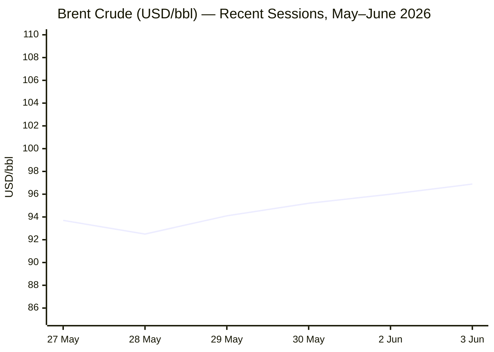
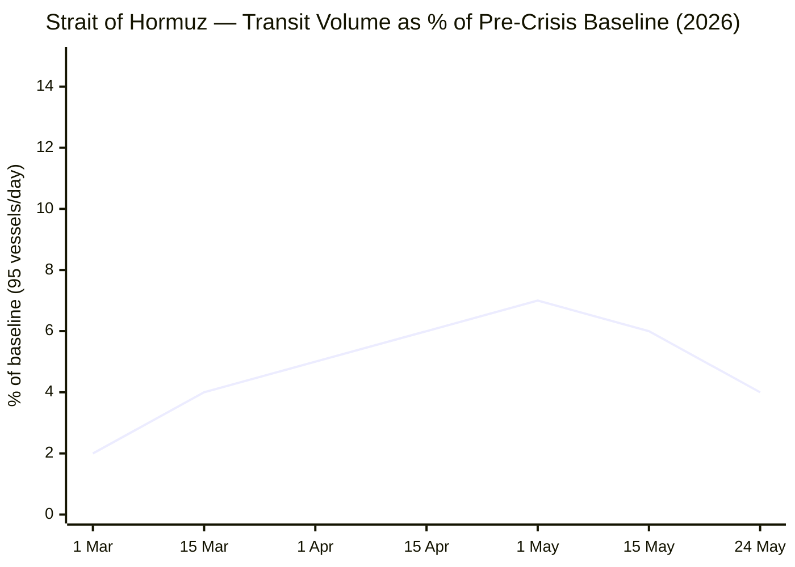

```yaml
---
brief_date: 2026-06-03
version: v1.2.2
run_time: "06:14 CET"
stories_published: 13
categories: [conflict, business, eu_affairs, technology, trends]
alert_counts:
  red: 5
  yellow: 6
  green: 2
ongoing_situations:
  - {name: "Iran–US War / Hormuz Crisis", real_world_start: "2026-02-28", day: 95}
  - {name: "Russia–Ukraine War", real_world_start: "2022-02-24", day: 1561}
  - {name: "Israel–Lebanon Ceasefire (2026)", real_world_start: "2026-04-16", day: 49}
sources_fetched: 9
fetch_status:
  le_monde: "❌"
  faz: "❌"
  kommersant: "❌"
  xinhua: "⚠️"
  european_parliament: "❌"
---
```

---

# 🌐 MORNING BRIEF
## Wednesday, 03 June 2026 · 06:14 CET
### 13 stories across 5 categories

---

## DIGEST SUMMARY

| # | Category | Headline | Alert |
|---|----------|----------|-------|
| 1 | ⚔️ Conflict | Iran suspends US talks, threatens full Hormuz closure | 🔴 |
| 2 | ⚔️ Conflict | Israel–Lebanon: Trump–Netanyahu rift over offensive scope | 🔴 |
| 3 | ⚔️ Conflict | ISW: Russian Spring offensive largely halted by Ukraine | 🟡 |
| 4 | 💼 Business | Eurozone CPI at 3.2% — ECB June 11 hike fully priced | 🔴 |
| 5 | 💼 Business | Brent at $96.89 as US crude draws sixth consecutive week | 🟡 |
| 6 | 💼 Business | S&P 500 closes above 7,600 for first time on AI/chip rally | 🟢 |
| 7 | 🇪🇺 EU Affairs | Magyar secures €16.4bn in unfrozen EU funds at Brussels | 🟡 |
| 8 | 🇪🇺 EU Affairs | EU inflation data seals ECB rate reversal — stagflation risk | 🔴 |
| 9 | 🇪🇺 EU Affairs | SAFE defence loans: 18 member states approved, €150bn active | 🟡 |
| 10 | 🤖 Technology | Trump AI Executive Order: 30-day government pre-access to frontier models | 🟡 |
| 11 | 🤖 Technology | Anthropic files confidential IPO; SpaceX listing imminent | 🟢 |
| 12 | 📈 Trends | UK warns of global food crisis as Hormuz stranglehold persists | 🔴 |
| 13 | 📈 Trends | Hormuz structural closure: shipping at 4–6% of pre-crisis level, Day 95 | 🟡 |

> Alert Level key: 🔴 High significance · 🟡 Developing · 🟢 Stable/Routine

---

## 🚨 SIGNAL BOARD

🔴 **Iran suspended US negotiations on 2 June and threatened to fully seal the Strait of Hormuz — oil prices jumped 7% on the Tasnim report before partially recovering to $96.89/bbl.**
🔴 **Eurozone CPI hit 3.2% in May — highest since September 2023 — locking in a 25bp ECB rate hike on 11 June, reversing 2025's easing trajectory.**
🟡 **Trump's AI Executive Order (2 June) creates a voluntary 30-day government pre-release window for frontier AI models — sets a precedent without imposing a mandatory licensing regime.**
🟢 **S&P 500 closed above 7,600 for the first time ever on 2 June, driven by AI chipmakers, even as geopolitical risk premiums keep oil elevated.**
⚡ **Reversal signal: ISW confirms Russian Spring 2026 offensive has largely stalled — May advances a fraction of prior-year pace — a battlefield reversal after months of Russian momentum.**

---

## 🔄 ONGOING SITUATIONS

| Situation | Real-world start | Day # | Last significant development | Status |
|-----------|-----------------|-------|------------------------------|--------|
| Iran–US War / Hormuz Crisis | 28 Feb 2026 | Day 95 | Iran suspends talks; threatens full Hormuz closure; Hormuz at ~5% of pre-crisis traffic | 🔴 Active |
| Russia–Ukraine War | 24 Feb 2022 | Day 1,561 | ISW: Russian Spring 2026 offensive largely halted; 229 drones fired 31 May | 🔴 Active |
| Israel–Lebanon Ceasefire (2026) | 16 Apr 2026 | Day 49 | Hezbollah agrees conditional US ceasefire proposal; Israel continues southern Lebanon strikes | 🟡 Fragile |

---

## ⚔️ CONFLICT

> 🔎 **CONFLICT ANALYST** · 3 updates today

### 1. Iran–US: Talks Suspended, Full Hormuz Closure Threatened 🔴
**Alert:** 🔴
**Summary:** Iran's state-affiliated outlet Tasnim reported on 2 June that Iranian negotiators have halted the exchange of messages with Washington through intermediaries, citing ongoing ceasefire violations — specifically Israel's military operations in Lebanon, which Tehran insists must be included in any deal. Iran simultaneously threatened to "completely block" the Strait of Hormuz and activate the Bab al-Mandeb as a second pressure point. Oil prices surged more than 7% on the initial Tasnim report. Trump, speaking to ABC News on 2 June, said a deal to reopen Hormuz was reachable "over the next week" and that an MOU could be signed imminently, though he demanded written commitments on nuclear concessions. A regional source told CNN talks were "back on track" hours after the suspension announcement.
**Significance:** The suspension–resumption cycle illustrates how closely the Hormuz reopening is linked to the Lebanon front, a variable Washington does not fully control. A full Hormuz closure would remove the residual 4–6% of pre-crisis transit volume, erasing the last marginal oil supply flow from the Gulf and accelerating inventory depletion globally.
**Sources:**

- [CNBC — Iran stops negotiations with U.S., vows to 'completely' block Strait of Hormuz](https://www.cnbc.com/2026/06/01/iran-us-negotiations-strait-of-hormuz.html) · 01 June 2026
- [CBS News — Trump recently edited possible U.S.-Iran agreement, including on enriched uranium and Strait of Hormuz](https://www.cbsnews.com/live-updates/iran-war-us-trump-vance-ceasefire-strait-of-hormuz-deal-close/) · 01 June 2026
- [CNN — Trump insists talks continue after Iran suspended negotiations](https://www.cnn.com/2026/06/01/world/live-news/iran-trump-lebanon-war-news) · 01 June 2026
**Trend:** ⚡ Reversal
**Tags:** #Iran #Hormuz #naval-blockade #peace-talks #MULTI-SOURCE

---

### 2. Lebanon: Trump–Netanyahu Rift Over Offensive Scope 🔴
**Alert:** 🔴
**Summary:** A sharp divergence emerged on 2 June between Trump and Israeli Prime Minister Netanyahu over the scope of Israel's operations in Lebanon. Trump declared that Israeli forces would not move on Beirut after a call with Netanyahu — a call described by sources as heated — and pressed Israel to scale back its Lebanon offensive to prevent it from collapsing the Iran negotiations. Netanyahu's office, however, stated that Israel would continue striking southern Lebanon. Separately, Lebanese authorities confirmed that Hezbollah had agreed to a US ceasefire proposal under which strikes on Beirut would halt. The 2026 Israel–Lebanon ceasefire, brokered by the US on 16 April and extended on 23 April, is now on Day 49 and under acute stress.
**Significance:** The Lebanon front has become the principal destabilising variable in US–Iran negotiations. Tehran has made Israeli de-escalation in Lebanon a condition of any MOU; Washington cannot deliver Israeli compliance, creating a structural impasse that may outlast any short-term deal.
**Sources:**

- [CNN — Live news: Iran-Trump-Lebanon war](https://www.cnn.com/2026/06/01/world/live-news/iran-trump-lebanon-war-news) · 01 June 2026
- [Fox News — Iran peace talks in question as Trump pressures Israel for ceasefire](https://www.foxnews.com/live-news/trump-iran-war-israel-lebanon-hormuz-june-2) · 02 June 2026
**Trend:** ↗ Escalating
**Tags:** #Lebanon #Israel #Hezbollah #ceasefire #Iran #MULTI-SOURCE

---

### 3. Ukraine: ISW Confirms Russian Spring Offensive Has Largely Stalled 🟡
**Alert:** 🟡
**Summary:** The Institute for the Study of War's 1 June 2026 assessment concluded that Ukrainian forces have largely halted the Russian Spring-Summer 2026 offensive, with Russian gains in May amounting to only a fraction of territory taken in May 2025. ISW attributed the slowdown not to seasonal weather but to structural battlefield shifts, including Ukraine's expanding mid-range strike campaign against Russian ground lines of communication from occupied Luhansk Oblast to Crimea, and expanded drone strikes against Russian training grounds. Neither side made confirmed advances on 31 May. Russia nonetheless launched 229 drones in a single overnight salvo. Russian President Putin is reportedly resisting pressure from economic officials to reduce defence spending despite warnings about its unsustainability.
**Significance:** A stalled Russian offensive may indicate approaching operational culmination or a strategic pause before renewed pressure; it is not indicative of imminent de-escalation. Ukraine's ability to target logistics over extended range represents a qualitative shift in its defensive posture.
**Sources:**

- [Kyiv Post / ISW — Russian Offensive Campaign Assessment, June 1, 2026](https://www.kyivpost.com/post/77319) · 02 June 2026
- [Ukrinform — War news 02 June 2026](https://www.ukrinform.net/rubric-ato) · 02 June 2026
**Trend:** ↘ De-escalating
**Tags:** #Ukraine #Russia #frontline #drone-warfare #MULTI-SOURCE

📚 *Background reading:* [ISW — Institute for the Study of War Ukraine coverage](https://www.understandingwar.org) · [Kyiv Independent — Hungary election reshapes EU defence support for Ukraine](https://kyivindependent.com/magyar-secures-frozen-eu-money-ukraine-issues-unresolved/)

---

## 💼 BUSINESS

> 💼 **BUSINESS ANALYST** · 3 updates today

### 4. Eurozone CPI Hits 3.2% — ECB June 11 Hike Now Fully Priced 🔴
**Alert:** 🔴
**Summary:** Eurostat's flash estimate released 2 June confirmed eurozone CPI at 3.2% year-on-year in May 2026, up from 3.0% in April — the highest reading since September 2023. Energy (+10.9%) remains the dominant driver, directly linked to the Hormuz crisis, but services inflation jumped to 3.5% from 3.0%, indicating broadening price pressures beyond the supply shock. Core inflation rose to 2.5% from 2.2%, beating consensus of 2.4%. Financial markets have now fully priced a 25 basis-point rate hike at the ECB Governing Council meeting on 11 June, which would push the deposit facility rate from 2.00% to 2.25%, ending the easing cycle that defined most of 2025. One to two further hikes are priced for the autumn.
**Market signal:** Bearish for eurozone equities and duration bonds — rate reversal into a stagflationary environment raises borrowing costs without improving the growth backdrop.
**Sources:**

- [Eurostat — Euro area annual inflation up to 3.2%](https://ec.europa.eu/eurostat/web/products-euro-indicators/w/2-02062026-ap) · 02 June 2026
- [Reuters / Investing.com — Euro zone inflation jump reinforces case for June rate hike](https://www.investing.com/news/economy-news/euro-zone-inflation-rises-again-reinforcing-case-for-ecb-hike-4721075) · 02 June 2026
**Trend:** ↗ Escalating
**Tags:** #EU-institutions #inflation #ECB #interest-rates #energy-markets #MULTI-SOURCE #data-point

📎 See also: EU Affairs § Story 8 — Eurozone stagflation context and ECB decision backdrop

---

### 5. Brent at $96.89 as US Crude Draws Sixth Consecutive Week 🟡
**Alert:** 🟡
**Summary:** Brent crude rose to $96.89 USD/bbl on 3 June 2026, gaining for a third consecutive session (+0.93% on the day) as US–Iran negotiation uncertainty maintained a geopolitical risk premium. Industry data showed US crude inventories declined by 6.8 million barrels last week — if confirmed by official EIA figures later Wednesday, it would mark the sixth consecutive weekly drawdown. The EIA's May STEO forecasts global oil inventories will fall by an average 8.5 million barrels per day in Q2 2026. Brent remains approximately 49% above year-ago levels. The UAE's departure from OPEC (effective 1 May 2026) has reduced OPEC spare capacity estimates for 2027 from 3.8 to 2.5 million b/d.
**Market signal:** Moderately bullish for crude in the near term — consecutive inventory draws point to structural undersupply while the Strait remains functionally closed, though any confirmed deal progress could trigger a sharp reversal.
**Sources:**

- [Trading Economics — Brent crude oil price 3 June 2026](https://tradingeconomics.com/commodity/brent-crude-oil) · 03 June 2026
- [EIA — Short-Term Energy Outlook May 2026](https://www.eia.gov/outlooks/steo/) · 01 June 2026
**Trend:** ↗ Escalating
**Tags:** #Brent #oil-price #Hormuz #supply-shock #energy-markets

📎 See also: Conflict § Story 1 — Iran Hormuz suspension driving oil market volatility

---

### 6. S&P 500 Closes Above 7,600 for First Time on AI/Chip Surge 🟢
**Alert:** 🟢
**Summary:** The S&P 500 closed at 7,609.78 on 2 June 2026, breaking above 7,600 for the first time in history, driven by AI-linked semiconductor names including Marvell Technology and Hewlett Packard Enterprise, which beat earnings expectations and raised full-year guidance. Technology and energy were the only two S&P 500 sectors in positive territory, reflecting the bifurcation between AI investment optimism and geopolitical risk. The Nasdaq closed at 27,086.81 and the Dow at 51,078.88. All three major indices are at or near all-time highs. Markets are also digesting Trump's AI executive order (see Technology) and Anthropic's confidential IPO filing.
**Market signal:** Bullish for technology sector near term — AI capex cycle intact and equity markets are treating geopolitical risk as a containable premium rather than a systemic shock.
**Sources:**

- [TheStreet — Stock Market Today June 2 2026: S&P 500 finishes above 7,600](https://www.thestreet.com/stock-market-today/stock-market-today-dow-jones-sp-500-nasdaq-updates-june-02-2026) · 02 June 2026
- [CNBC — S&P 500 closes at a record to kick off June trading](https://www.cnbc.com/2026/05/31/stock-market-today-live-updates.html) · 02 June 2026
**Trend:** ↗ Escalating
**Tags:** #SP500 #equity-rally #AI #semiconductor #MULTI-SOURCE

📚 *Background reading:* [Bruegel — EU energy shock and financial conditions 2026](https://www.bruegel.org) · [Atlantic Council — The SPR problem: energy security post-Hormuz](https://www.atlanticcouncil.org)

---

## 🇪🇺 EU AFFAIRS

> 🇪🇺 **EU AFFAIRS ANALYST** · 3 updates today

### 7. Magyar Secures €16.4bn in Unfrozen EU Funds at Brussels Meeting 🟡
**Alert:** 🟡
**Summary:** Hungarian Prime Minister Péter Magyar met European Commission President Ursula von der Leyen in Brussels on 29 May 2026 and secured the release of €16.4 billion in cohesion and recovery funds that had been frozen over rule-of-law deficiencies under the previous Orbán government. Von der Leyen confirmed a further €6.4 billion would be unlocked, meaning Hungary is now on track to receive all previously suspended funds. Both leaders stated there was "absolutely no link" between the funding decision and Ukraine's EU accession process. Magyar is expected to lift Hungary's veto on the next stage of Ukraine's EU membership process — likely on or after 16 June — once nine of eleven outstanding bilateral issues with Kyiv are resolved; Magyar confirmed nine are agreed.
**Legislative/policy stage:** Cohesion fund disbursement in implementation stage pending formal legal completion of agreements. Ukraine accession negotiations — next Inter-Governmental Conference step pending Hungary veto lift, expected mid-June.
**Sources:**

- [Kyiv Independent — Magyar secures frozen EU money, Ukraine issues remain stuck](https://kyivindependent.com/magyar-secures-frozen-eu-money-ukraine-issues-unresolved/) · 29 May 2026
- [Euronews — EU approves €90 billion loan for Ukraine after Hungary lifts controversial veto](https://www.euronews.com/my-europe/2026/04/23/eu-approves-90-billion-loan-for-ukraine-after-hungary-lifts-controversial-veto/) · 23 April 2026
**Trend:** ↘ De-escalating
**Tags:** #Hungary #Magyar #EU-funds #rule-of-law #EU-enlargement #MULTI-SOURCE

---

### 8. Eurozone Stagflation Risk: CPI Broadens as ECB Faces Rate Reversal 🔴
**Alert:** 🔴
**Summary:** The May 2026 Eurostat flash CPI release — 3.2% headline, 2.5% core — has confronted the ECB with a dilemma largely of the conflict's making: inflation is rising and now spreading beyond energy into services (3.5%), yet eurozone GDP grew just 0.1% in Q1 2026. The ECB held rates at 2.00% on 30 April; minutes published 29 May showed some Governing Council members would have supported an April hike. Markets now price a 97% probability of a 25bp increase on 11 June. Finnish ECB member Olli Rehn described the expected hike as an "insurance" move. Core inflation at 2.5% — its highest in over a year — suggests second-round effects are beginning to emerge.
**Legislative/policy stage:** ECB Governing Council meeting scheduled 11 June 2026; rate decision expected that day. New ECB staff projections will also be published.
**Sources:**

- [GMK Center — Inflation in the eurozone accelerated to 3.2% in May](https://gmk.center/en/news/inflation-in-the-eurozone-accelerated-to-3-2-in-may/) · 02 June 2026
- [Eurostat — Euro area annual inflation flash estimate May 2026](https://ec.europa.eu/eurostat/web/products-euro-indicators/w/2-02062026-ap) · 02 June 2026
**Trend:** ↗ Escalating
**Tags:** #inflation #stagflation #ECB #interest-rates #eurozone #data-point #MULTI-SOURCE

---

### 9. SAFE Defence Loans: 18 Member States Approved, €150bn Framework Active 🟡
**Alert:** 🟡
**Summary:** The EU's Security Action for Europe (SAFE) programme has cleared national defence investment plans for 18 of 19 participating member states, unlocking a total of up to €150 billion in low-cost EU-backed loans for defence procurement — the largest single EU military spending instrument in the bloc's history. The Council approved defence funding for 18 states between January and April 2026. Only Hungary's plan had been held in abeyance, pending the resolution of its Ukraine veto dispute — which was subsequently resolved following the Magyar election victory on 12 April. The programme requires 15 of 19 participating member state plans to include Ukraine defence industrial co-operation provisions. The European Parliament has launched a legal challenge arguing that SAFE bypassed normal parliamentary budgetary oversight via Article 122 TFEU.
**Legislative/policy stage:** Implementation phase — loan agreements being finalised with member states. First disbursements made or imminent. EP legal challenge at Article 122 pending judicial review.
**Sources:**

- [EU Council — What is Security Action for Europe (SAFE)?](https://www.consilium.europa.eu/en/policies/safe/) · 10 April 2026
- [European Commission Defence Industry — SAFE approvals unlock defence funding for Czechia and France](https://defence-industry-space.ec.europa.eu/safe-approvals-unlock-defence-funding-czechia-and-france-2026-03-26_en) · 26 March 2026
**Trend:** ↗ Escalating
**Tags:** #EU-defence #EU-institutions #Ukraine-aid #EU-funds #MULTI-SOURCE

📚 *Background reading:* [BEHorizon — SAFE and the quiet normalisation of EU war finance](https://behorizon.org/safe-and-the-quiet-normalisation-of-eu-war-finance/) · [ECFR — European defence integration 2026](https://ecfr.eu)

---

## 🤖 TECHNOLOGY

> 🤖 **TECHNOLOGY ANALYST** · 2 updates today

### 10. Trump AI Executive Order: Voluntary Government Pre-Access to Frontier Models 🟡

**Alert:** 🟡
**Summary:** President Trump signed an executive order on 2 June 2026, titled "Promoting Advanced Artificial Intelligence Innovation and Security," directing the NSA, CISA and Treasury to establish within 60 days a classified framework under which AI developers would provide the US government up to 30 days' early access to frontier models before public release. The order explicitly states this is voluntary and does not constitute a mandatory government licensing or preclearance requirement. It frames frontier AI simultaneously as a national security asset and threat, establishing a cybersecurity review apparatus. The order is explicitly deregulatory in philosophy, framing itself as a continuation of the administration's approach of "slashing bureaucratic constraints."
**Analyst note:** The voluntary framing limits immediate compliance pressure on labs, but establishes a precedent for government pre-release review that, if normalised over 12–24 months, could shift the regulatory landscape for frontier model deployment — particularly relevant as Anthropic, OpenAI, and SpaceXAI all approach public markets.
**Sources:**

- [White House — Promoting Advanced Artificial Intelligence Innovation and Security](https://www.whitehouse.gov/presidential-actions/2026/06/promoting-advanced-artificial-intelligence-innovation-and-security/) · 02 June 2026
- [CNBC — Trump signs AI executive order asking companies to give government early access to models](https://www.cnbc.com/2026/06/02/trump-executive-order-ai.html) · 02 June 2026
**Trend:** ↗ Escalating
**Tags:** #AI #AI-regulation #AI-safety #LLM #MULTI-SOURCE

---

### 11. Anthropic Files Confidential IPO; SpaceX Listing Imminent 🟢
**Alert:** 🟢
**Summary:** Anthropic, developer of the Claude large language model family, filed a confidential S-1 registration with the US Securities and Exchange Commission on 2 June 2026, initiating the process for a public listing. OpenAI is separately reported to be preparing an IPO later this year. SpaceX — whose AI lab SpaceXAI operates the Grok model series — is set to list "as soon as next week" at a potential valuation exceeding $1 trillion, which would make it the largest technology IPO in history. The cluster of AI-sector listings is occurring as markets reach record highs driven partly by AI infrastructure investment and as the Trump AI executive order reframes federal government engagement with the sector.
**Analyst note:** A wave of AI-sector IPOs over the next 12 months will provide the first transparent market valuations for frontier AI labs, which could recalibrate private-market valuations across the ecosystem and intensify public scrutiny of model safety and governance practices.
**Sources:**

- [CNBC — Trump signs AI executive order asking companies to give government early access to models](https://www.cnbc.com/2026/06/02/trump-executive-order-ai.html) · 02 June 2026
**Trend:** ↗ Escalating
**Tags:** #AI #LLM #IPO #AI-regulation #semiconductor

📚 *Background reading:* [CSIS — AI governance and national security 2026](https://www.csis.org) · [RAND — Frontier AI safety and deployment frameworks](https://www.rand.org)

---

## 📈 TRENDS

> 📈 **TRENDS ANALYST** · 2 updates today

### 12. UK Foreign Secretary Warns of Imminent Global Food Crisis 🔴
**Alert:** 🔴
**Summary:** UK Foreign Secretary Yvette Cooper issued a stark warning on 19 May 2026, stating the world is "sleepwalking into a global food crisis" due to the Hormuz disruption. Her remarks echoed a UN News report of April 2026 and FAO Chief Economist Máximo Torero's warning that a prolonged closure risked reducing global fertiliser availability and crop yields across import-dependent economies. Global fuel prices are more than double 2025 averages per UN estimates. Fertiliser costs in the Middle East rose 19–28% in the first weeks of March. Countries identified as most at risk include India, Bangladesh, Sri Lanka, Somalia, Sudan, Tanzania, Kenya, and Egypt. The Hormuz crisis has been described by the IEA head as "the largest supply disruption in the history of the global oil market."
**Horizon:** Medium-term — if the Strait remains effectively closed through June planting decisions, the FAO projects reduced wheat, rice and maize yields and elevated food price inflation into Q3–Q4 2026 and into 2027.
**Sources:**

- [Time — Lawmaker warns of 'global food crisis,' urges immediate reopening of Strait of Hormuz](https://time.com/article/2026/05/19/global-food-crisis-concerns-strait-of-hormuz-iran-trade-choke-hold/) · 19 May 2026
- [UN News — 'Clock is ticking': Hormuz disruption raises fears of global food crisis](https://news.un.org/en/story/2026/04/1167289) · 13 April 2026
**Trend:** ↗ Escalating
**Tags:** #food-security #food-prices #Hormuz #humanitarian #shipping #MULTI-SOURCE

📎 See also: Conflict § Story 1 — Iran Hormuz suspension as root driver

---

### 13. Hormuz Structural Closure: Shipping at 4–6% of Pre-Crisis Level on Day 95 🟡
**Alert:** 🟡
**Summary:** Per IMF PortWatch data as of 24 May 2026, just four vessels transited the Strait of Hormuz against a pre-crisis baseline of approximately 95 per day — roughly 4% of normal flow. Over 1,500 vessels remain stranded. War-risk insurance is priced at 8× pre-crisis levels, with six P&I clubs having withdrawn cover. The bypass pipelines of Saudi Arabia and UAE can handle only ~5.5 million barrels per day — roughly one-quarter of the region's typical export volume. Even if the Strait were reopened immediately, Lloyd's List estimates it would take until at least September for tanker and oil markets to normalise. Iran has now threatened to escalate from partial to complete blockade (see Conflict § Story 1).
**Horizon:** Medium-to-long-term — structural shipping rerouting is under way; alternative route capacity (Cape of Good Hope, overland pipelines) insufficient to compensate at scale. The 95-day effective closure is already reshaping insurance frameworks, charter markets, and Gulf energy export routing for years ahead.
**Sources:**

- [USNI News — Strait of Hormuz commercial transits at lowest level since Operation Epic Fury start](https://news.usni.org/2026/05/01/strait-of-hormuz-commercial-transits-at-lowest-level-since-operation-epic-fury-start-shipping-data-shows) · 01 May 2026
- [Polymarket — Strait of Hormuz traffic returns to normal by end of June](https://polymarket.com/event/strait-of-hormuz-traffic-returns-to-normal-by-end-of-june) · 02 June 2026
**Trend:** ↗ Escalating
**Tags:** #shipping #Hormuz #naval-blockade #supply-shock #energy-markets #MULTI-SOURCE

📚 *Background reading:* [World Economic Forum — Beyond oil: 9 commodities impacted by the Strait of Hormuz crisis](https://www.weforum.org/stories/2026/04/beyond-oil-lng-commodities-impacted-closure-hormuz-strait/) · [FAO — Global agrifood implications of the 2026 conflict](https://openknowledge.fao.org/server/api/core/bitstreams/1aafb5d8-39d1-481a-b1f8-25facaec3051/content)

---

## 📊 KEY DATA OF THE DAY

> 📊 **DATA OFFICER** · 7 indicators

| Indicator | Value | Δ vs prior session | Δ vs 7 days ago | Note | Source | URL |
|-----------|-------|-------------------|-----------------|------|--------|-----|
| EUR/USD | 1.1635 | N/A | −0.001 (vs 1.1626, 27 May) | Euro soft amid ECB hike anticipation and oil drag; expected range floor ~1.14 | FXStreet/Trading Economics | [link](https://tradingeconomics.com/euro-area/currency) |
| Brent Crude (USD/bbl) | 96.89 | +0.93% (vs ~95.99, 2 Jun) | +3.4% (vs ~93.7, 27 May) | Rising 3rd session; Iran suspension fuelling risk premium; 6th consecutive US crude draw pending official confirm | Trading Economics / EIA | [link](https://tradingeconomics.com/commodity/brent-crude-oil) |
| Gold (XAU/USD) | 4,477.78 | −0.27% (vs ~4,490, 2 Jun) | N/A | Marginal pullback from eased safe-haven demand; geopolitical premium remains; 32.8% above year-ago | Trading Economics | [link](https://tradingeconomics.com/commodity/gold) |
| IMF Global Growth 2026 | 3.1% | −0.2pp vs Jan WEO (3.3%) | vs Oct WEO: −0.2pp (3.3%) | April WEO "reference forecast" conditional on limited-duration conflict; adverse scenario projects materially lower | IMF WEO April 2026 | [link](https://www.imf.org/en/publications/weo/issues/2026/04/14/world-economic-outlook-april-2026) |
| EU CPI YoY (latest) | 3.2% (May 2026 flash) | +0.2pp vs April (3.0%) | +0.6pp vs Feb (2.6%) | Highest since Sep 2023; energy +10.9%; services +3.5%; core +2.5%; ECB hike 11 Jun all but certain | Eurostat | [link](https://ec.europa.eu/eurostat/web/products-euro-indicators/w/2-02062026-ap) |
| FAO Food Price Index | 125.3 (Feb 2026 — latest available) | +0.9% vs Jan 2026 (124.2) | N/A | Next release 5 Jun 2026; index does not yet capture Hormuz-era fertiliser shock; May data expected to show sharp rise | FAO | [link](https://www.fao.org/worldfoodsituation/foodpricesindex/en/) |
| Strait of Hormuz transit volume | ~4–6% of pre-crisis | Stable at critically low level | N/A | ~4 vessels/day vs 95/day baseline (IMF PortWatch, 24 May); Iran threatens further closure; minimum operational threshold | IMF PortWatch / Straits.live | [link](https://straits.live/) |

**Data commentary:** Brent at $96.89 and Hormuz at 4–6% of pre-crisis capacity confirm the oil supply shock remains structurally embedded at Day 95, with consecutive US inventory draws suggesting global stock cushions are being eroded faster than the EIA's base case. The EU CPI reading of 3.2% — driven primarily by energy but now spreading into services — is forcing the ECB to hike into a near-stagnant growth environment (eurozone Q1 GDP: +0.1% QoQ), creating a stagflationary risk that gold at $4,477 and a still-soft EUR/USD of 1.1635 are partially pricing in. The IMF's April downgrade to 3.1% global growth was predicated on a "limited-duration" conflict; at Day 95, that assumption is increasingly in question.

---

## 📊 CHARTS

**Chart 1 — Brent Crude: Recent Sessions (USD/bbl)**



**Chart 2 — Hormuz Transit Volume (% of Pre-Crisis Baseline)**



---

## ⚙️ AGENT METADATA

| Field | Value |
|-------|-------|
| Agent version | MORNING BRIEF v1.2.2 |
| Run timestamp | 2026-06-03T06:14:49+02:00 |
| Fetch status | Le Monde ❌ · FAZ ❌ · Kommersant ❌ · Xinhua ⚠️ (content outside 24h window) · EP ❌ (nav only) |
| Sources queried | 9 / 11 (Tier 1 + Tier 2; Le Monde, FAZ, Kommersant, EP via search fallback; FAO ✅; IMF ⚠️ JS-gated, search used) |
| Stories surfaced | 26 (before editorial filter) |
| Stories published | 13 (after editorial filter) |
| Languages processed | EN, FR (headlines noted), DE (headlines noted) |
| Output language | English (British) |
| Date validated | ✅ Confirmed 03 June 2026 |
| Expansion Queue | None — all tags resolved within closed list |

---

*MORNING BRIEF is an AI-assisted digest. All summaries are paraphrased from original sources. Verify time-sensitive information at the linked URLs before acting. Output language: British English.*
