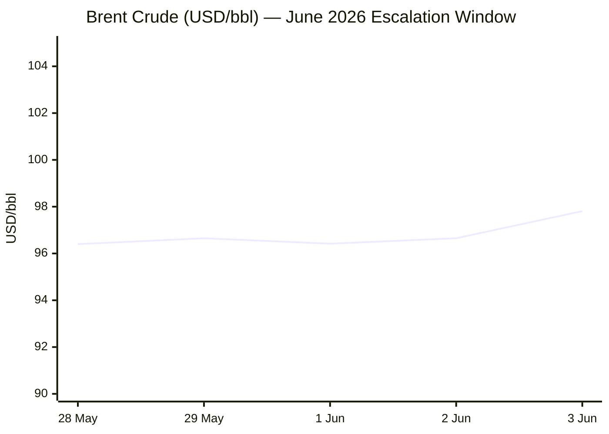
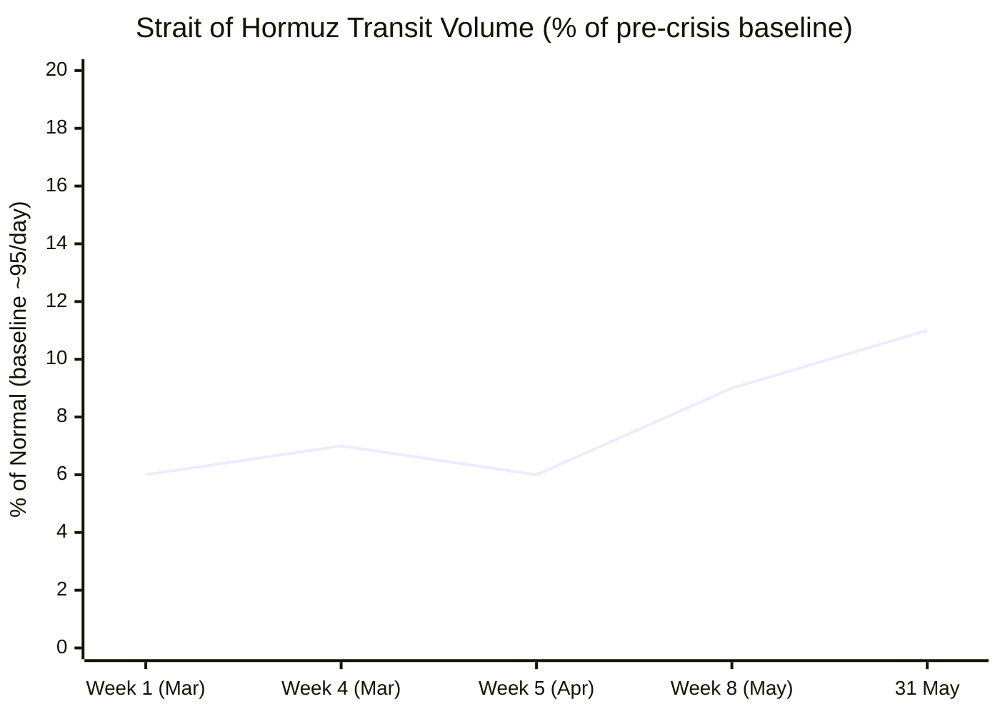

**PHASE 0 COMPLETE** — Run date: 04 June 2026 · 05:05 CET

**Day # calculations:**
- Russia–Ukraine War: 24 Feb 2022 → Day **1,197**
- Iran–US War / Hormuz Crisis: 28 Feb 2026 → Day **96**
- Israel–Lebanon Ceasefire: tracking to be confirmed from live sources

Proceeding to Phase 1 — Direct fetch pass.

---Xinhua: content dated 24 April 2026 — outside 24-hour window. Flagging ⚠️.EP: navigation-only, as expected. Logging ⚠️.

Now Tier 2 fetches:FAO: latest release date shown is 06/03/2026 (March data). Next release is 5 June 2026 — tomorrow. Carrying February 2026 value: **125.3 points**. Will search for May release.**PHASE 1 COMPLETE**
- Le Monde: ❌ (blocked)
- FAZ: ❌ (blocked)
- Kommersant: ❌ (404)
- Xinhua: ⚠️ (content dated 24 Apr 2026 — stale)
- European Parliament: ⚠️ (navigation only)
- FAO: ✅ (Feb 2026 = 125.3; May release due 5 June — search fallback for latest)
- IMF: ✅ (fetched, no same-day releases visible)
- ECB: ✅ (fetched, navigation-only content)

Proceeding to **Phase 2 — Search pass**.

---Good — ISW assessment from 31 May/1 June 2026 found. Now searching for more current Ukraine news and Iran/Hormuz.Excellent — very rich Ukraine content. Now searching Iran/Hormuz and Israel/Lebanon:Excellent. Now searching business/markets and EU affairs:Now EU Affairs and Technology searches:Excellent data from `straits.live`. Now for Technology and Trends:Excellent. Now a final search for Trends and Israel/Lebanon:**Israel–Lebanon ceasefire confirmed:** New ceasefire agreed 3 June 2026 (16 April 2026 was the start of the current ceasefire framework). Day # = 04 Jun 2026 − 16 Apr 2026 + 1 = Day **50**.

Now final searches for FAO May release and gold price:Key finding: FAO April 2026 FFPI = **130.7 points** (released 8 May 2026); FAO March 2026 = **128.5 points**. The next release is **5 June 2026** — tomorrow. April is the latest available data.

Now I have sufficient data for all sections. Proceeding directly to **Phase 3–9: Assembly**.

---

```yaml
---
brief_date: 2026-06-04
version: v1.2.2
run_time: "05:05 CET"
stories_published: 13
categories: [conflict, business, eu_affairs, technology, trends]
alert_counts:
  red: 5
  yellow: 6
  green: 2
ongoing_situations:
  - {name: "Russia–Ukraine War", real_world_start: "2022-02-24", day: 1197}
  - {name: "Iran–US War / Hormuz Crisis", real_world_start: "2026-02-28", day: 96}
  - {name: "Israel–Lebanon Ceasefire", real_world_start: "2026-04-16", day: 50}
sources_fetched: 9
fetch_status:
  le_monde: "❌"
  faz: "❌"
  kommersant: "❌"
  xinhua: "⚠️"
  european_parliament: "⚠️"
---
```

---

# 🌐 MORNING BRIEF
## Thursday, 04 June 2026 · 05:05 CET
### 13 stories across 5 categories

---

## DIGEST SUMMARY

| # | Category | Headline | Alert |
|---|----------|----------|-------|
| 1 | ⚔️ Conflict | Russia launches massive drone-missile strike on Kyiv; Ukraine retaliates at St. Petersburg | 🔴 |
| 2 | ⚔️ Conflict | Iran strikes Kuwait airport; US House passes War Powers Resolution against Iran war | 🔴 |
| 3 | ⚔️ Conflict | Israel–Lebanon ceasefire agreed; Hezbollah withdrawal from south Litani condition | 🟡 |
| 4 | 💼 Business | Oil tops $97 after US-Iran strikes; S&P 500 snaps 9-day win streak | 🔴 |
| 5 | 💼 Business | Broadcom AI chip revenue hits $10.8bn (+143% YoY); stock falls on software miss | 🟡 |
| 6 | 💼 Business | EU CPI flash estimate: inflation rises to 3.2% in May, driven by energy | 🟡 |
| 7 | 🇪🇺 EU Affairs | European Commission unveils Tech Sovereignty Package: Chips Act 2.0 and Cloud AI Act | 🔴 |
| 8 | 🇪🇺 EU Affairs | EU Return Regulation agreed: offshore return hubs, faster deportations | 🟡 |
| 9 | 🇪🇺 EU Affairs | Eurozone May inflation 3.2% flash — energy component at 10.9% YoY | 🟢 |
| 10 | 🤖 Technology | EU Chips Act 2.0 targets custom AI silicon; Cloud Act restricts US providers for govt data | 🟡 |
| 11 | 🤖 Technology | Broadcom Q2 2026: AI semiconductor revenue $10.8bn, first revenue miss in 18 months | 🟡 |
| 12 | 📈 Trends | Hormuz transit at 11% of normal; Iran halts US diplomacy; war reaches Day 96 | 🔴 |
| 13 | 📈 Trends | Pakistan mediation; US congressional backlash to Iran war signals political fatigue | 🟢 |

> Alert Level key: 🔴 High significance · 🟡 Developing · 🟢 Stable/Routine

---

## 🚨 SIGNAL BOARD

🔴 **Russia launched its largest combined drone-missile barrage in weeks, killing 22 in Kyiv and Dnipro on 2 June; Ukraine retaliated with 354 drones hitting St. Petersburg's oil terminal and Kronstadt naval base during Putin's economic forum.**
🔴 **Brent crossed $97/bbl on 3 June — up 4.7% in 24 hours — as Iran hit Kuwait International Airport (1 dead, 63 wounded) and halted US ceasefire diplomacy.**
🔴 **The US House passed a War Powers Resolution 215–208 to end the Iran war, the clearest congressional rebuke of Trump's military authority since February — but a presidential veto remains likely.**
🟡 **Israel and Lebanon agreed a new ceasefire framework on 3 June, contingent on Hezbollah withdrawal from south of the Litani; next talks scheduled for the week of 22 June.**
⚡ **The European Commission's Tech Sovereignty Package (Chips Act 2.0 + Cloud and AI Development Act) introduces emergency override powers for chip contracts and seeks to restrict US cloud providers from sensitive EU government data — a structural break from prior regulatory posture.**

---

## 🔄 ONGOING SITUATIONS

| Situation | Real-world start | Day # | Last significant development | Status |
|-----------|-----------------|-------|------------------------------|--------|
| Russia–Ukraine War | 24 Feb 2022 | Day 1,197 | Russia kills 22 in mass Kyiv-Dnipro strike; Ukraine hits St. Petersburg oil terminal | 🔴 Active |
| Iran–US War / Hormuz Crisis | 28 Feb 2026 | Day 96 | Iran strikes Kuwait airport; US House passes War Powers Resolution; Iran halts talks | 🔴 Active |
| Israel–Lebanon Ceasefire | 16 Apr 2026 | Day 50 | New ceasefire agreement signed 3 June; Hezbollah withdrawal contingent; talks 22 June | 🟡 Ceasefire |

---

## ⚔️ CONFLICT ANALYST · 3 updates today

---

### 1. Russia–Ukraine: Mass Strike on Kyiv and Dnipro; Ukraine Hits St. Petersburg Oil Terminal 🔴

**Alert:** 🔴
**Summary:** Russian forces launched a large-scale combined drone and missile attack on the night of 2 June, killing at least 22 civilians and wounding 138 across Kyiv and Dnipro. A nine-story residential building collapsed in Kyiv's Podilskyi district. Ukraine retaliated on 3 June, launching approximately 354 drones at St. Petersburg — striking an oil terminal at the port, setting it ablaze, and hitting the Kronstadt naval base, timed to coincide with Putin's flagship economic forum. Russia's air defences claimed to intercept all drones; airport operations in St. Petersburg were suspended temporarily. The exchange underscored the intensifying long-range aerial campaign by both sides, with Ukraine increasingly targeting Russian energy and economic infrastructure. `[MULTI-SOURCE]`
**Significance:** Ukraine's strike on St. Petersburg during a high-profile international event carries clear psychological and diplomatic intent, demonstrating reach while degrading oil revenue infrastructure — a strategic target given Kremlin reliance on energy exports to fund the war.
**Sources:**
- [PBS NewsHour — Massive Russian attack on Kyiv kills 22, officials say](https://www.pbs.org/newshour/world/massive-russian-attack-on-kyiv-and-other-ukrainian-cities-kills-22-people-officials-say-as-moscow-escalates-fighting) · 02 June 2026
- [CNN — Ukrainian drones strike St. Petersburg hours before 'Putin's Davos' opens](https://www.cnn.com/2026/06/03/europe/ukraine-drone-attack-russia-st-petersburg-intl-hnk) · 03 June 2026
- [NPR — Ukrainian drones strike a St. Petersburg oil terminal ahead of Putin visit](https://www.npr.org/2026/06/03/nx-s1-5844793/ukrainian-drones-hit-st-petersburg) · 03 June 2026
**Trend:** ↗ Escalating
**Tags:** #Russia #Ukraine #drone-warfare #missile-strike #MULTI-SOURCE

---

### 2. Iran–US War: Kuwait Airport Struck; US House Passes War Powers Resolution 🔴

**Alert:** 🔴
**Summary:** Iranian drones struck Kuwait International Airport on 3 June — which had only reopened the previous day after a months-long closure — killing one Indian national and wounding 63. Kuwait suspended flights. US Central Command described the attack as "deliberate, calculated and unjustified." Iran denied responsibility, claiming a failed US interceptor caused the damage. In Washington, the US House passed a War Powers Resolution 215–208 (four Republicans joining all Democrats) directing Trump to end hostilities with Iran — the first such vote since the war began on 28 February. Trump is expected to veto. Iran's state media separately announced a halt to indirect diplomatic communications with Washington until Israel ceases operations in Lebanon. `[MULTI-SOURCE]`
**Significance:** The congressional vote, though symbolically significant, is unlikely to become law; but it reflects erosion of bipartisan consensus for the conflict at Day 96, with no clear end strategy visible. The Kuwait airport strike signals Iran is willing to escalate regionally despite the ceasefire framework.
**Sources:**
- [NPR — Kuwait says Iranian drones hit airport and killed 1 as ceasefire is tested again](https://www.npr.org/2026/06/03/g-s1-125566/iran-war-updates) · 03 June 2026
- [Al Jazeera — US House passes Iran war powers resolution in rare pushback against Trump](https://www.aljazeera.com/news/2026/6/3/us-house-of-representatives-passes-war-powers-resolution-in-rebuke-to-trump) · 03 June 2026
- [Washington Post — House passes war powers resolution directing Trump to end hostilities with Iran](https://www.washingtonpost.com/politics/2026/06/03/house-passes-war-powers-resolution-push-trump-end-iran-war/) · 03 June 2026
**Trend:** ↗ Escalating
**Tags:** #Iran #Hormuz #ceasefire #naval-blockade #MULTI-SOURCE

---

### 3. Israel–Lebanon: New Ceasefire Framework Agreed; Hezbollah Withdrawal Contingent 🟡

**Alert:** 🟡
**Summary:** Following a fourth high-level US-brokered trilateral meeting on 2–3 June, Israel and Lebanon agreed to implement a ceasefire. The agreement is contingent on a complete cessation of Hezbollah fire and the withdrawal of all Hezbollah operatives from the South Litani Sector. Pilot zones will be established for Lebanese Armed Forces to assume exclusive territorial control. Both sides agreed to further political and security talks during the week of 22 June, with the objective of progressing toward a comprehensive peace agreement. Iran, whose wider ceasefire with the US nominally includes Lebanon, stated it would not enter any deal unless Israel halted all Lebanon operations.
**Significance:** The conditional framework is a meaningful step but remains fragile: Hezbollah compliance is unverified, and Tehran's linkage of its own negotiations to Lebanon ceasefire terms introduces additional leverage that could derail both tracks simultaneously.
**Sources:**
- [US Department of State — Joint Statement on the Latest High-Level Trilateral Meeting](https://www.state.gov/releases/office-of-the-spokesperson/2026/06/joint-statement-of-the-united-states-of-america-republic-of-lebanon-and-state-of-israel-on-the-latest-high-level-trilateral-meeting/) · 03 June 2026
- [Reuters via US News — Israel and Lebanon Agree to Implementation of Ceasefire](https://www.usnews.com/news/world/articles/2026-06-03/israel-lebanon-say-they-agree-to-ceasefire) · 03 June 2026
- [NBC News — Lebanon and Israel have agreed to implement a ceasefire](https://www.nbcnews.com/world/lebanon/israel-lebanon-agree-implement-ceasefire-rcna348374) · 03 June 2026
**Trend:** ↘ De-escalating
**Tags:** #Israel #Lebanon #Hezbollah #ceasefire #peace-talks #de-escalation

📚 *Background reading:* [Kyiv Independent — Ukraine drone campaign against Russian GLOCs](https://kyivindependent.com) · [Al Jazeera — Russia–Ukraine talks: all the mediation efforts, and where they stand](https://www.aljazeera.com/news/2026/2/18/russia-ukraine-talks-all-the-mediation-efforts-and-where-they-stand) · 18 February 2026

---

## 💼 BUSINESS ANALYST · 3 updates today

---

### 4. Oil Breaks $97 as US–Iran Strikes Resume; Equity Rally Snapped 🔴

**Alert:** 🔴
**Summary:** Brent crude settled at $97.81/bbl on 3 June — a rise of 1.89% in the session and approximately $4.71 above the prior session — as renewed US-Iran strikes in the Gulf reignited energy market fears. The S&P 500 fell 0.74% to 7,553.68, snapping a nine-day winning streak, while the Dow Jones lost 620.72 points (–1.21%) and the Nasdaq fell 0.89% to 26,853.98. Treasury yields moved higher. EIA data meanwhile showed US crude inventories declined by 6.8 million barrels in the most recent week — the sixth consecutive drawdown. The Hormuz Strait remains at approximately 11% of normal transit volume, with war-risk insurance premiums running at 8× pre-crisis levels. `[MULTI-SOURCE]`
**Market signal:** Bearish — escalating Iran-Gulf strikes are sustaining a geopolitical risk premium that directly feeds inflation expectations and raises the probability of a Fed rate increase before year-end.
**Sources:**
- [Trading Economics — Brent Crude Oil](https://tradingeconomics.com/commodity/brent-crude-oil) · 03 June 2026
- [CNBC — Stock Market Today June 3 Live Updates](https://www.cnbc.com/2026/06/02/stock-market-today-live-updates.html) · 03 June 2026
- [Straits.live — Strait of Hormuz Closed, Day 94](https://straits.live/) · 03 June 2026

📎 See also: Conflict § Story 2 — Iranian drones hit Kuwait airport as ceasefire collapses

**Trend:** ↗ Escalating
**Tags:** #Brent #oil-price #energy-markets #market-shock #Hormuz #MULTI-SOURCE

---

### 5. Broadcom Q2 2026: AI Revenue Hits $10.8bn but First Miss Sends Stock Lower 🟡

**Alert:** 🟡
**Summary:** Broadcom reported second-quarter fiscal 2026 results on 3 June, posting record revenue of $22.19bn — up 48% year-on-year — and adjusted EPS of $2.44, beating the $2.40 consensus. AI semiconductor revenue reached $10.8bn, up 143% year-on-year, with Q3 guidance projecting over $16bn in AI chip revenue (+200% YoY). However, the headline revenue figure narrowly missed the $22.27bn analyst consensus, and the infrastructure software unit posted $7.18bn against an expected $7.32bn. Shares fell approximately 13% in after-hours trading. CEO Hock Tan declined to raise full-year AI guidance beyond the existing $56bn projection for fiscal 2026. Broadcom is a key custom silicon partner for Anthropic, OpenAI, Google, and Meta.
**Market signal:** Neutral to slightly bearish near-term — the miss on software and refusal to upgrade guidance disappointed a market priced for perfection, but the 200% AI chip growth trajectory for Q3 reaffirms the structural custom-silicon investment cycle.
**Sources:**
- [Broadcom Inc. — Q2 FY2026 Earnings Press Release (SEC 8-K)](https://investors.broadcom.com/news-releases/news-release-details/broadcom-inc-announces-second-quarter-fiscal-year-2026-financial) · 03 June 2026
- [SiliconANGLE — Broadcom revenue miss stuns Wall Street](https://siliconangle.com/2026/06/03/broadcom-revenue-miss-stuns-wall-street-stock-sinks-hours/) · 03 June 2026

**Trend:** → Stable
**Tags:** #semiconductor #AI #earnings #equity-selloff

---

### 6. EU CPI Flash: Eurozone Inflation 3.2% in May, Energy Driving Re-acceleration 🟡

**Alert:** 🟡
**Summary:** Eurostat's flash estimate for May 2026, released 2 June, puts eurozone annual inflation at 3.2%, up from 3.0% in April and 2.6% in March. The energy component leads at +10.9% YoY (broadly flat month-on-month), reflecting sustained Hormuz-driven fuel costs. Services inflation accelerated to 3.5% (from 3.0% in April), a concerning signal for the European Central Bank. Food, alcohol, and tobacco prices moderated to +2.0% from +2.4%. Core inflation (excluding energy and food) sits at approximately 2.5%, still above the ECB's 2% target.
**Market signal:** Bearish for rate-sensitive assets — persistent services inflation combined with an energy shock re-acceleration reduces ECB scope to ease and raises the prospect of rates being held higher for longer into H2 2026.
**Sources:**
- [Eurostat — Euro area annual inflation up to 3.2%, May 2026 flash](https://ec.europa.eu/eurostat/web/products-euro-indicators/w/2-02062026-ap) · 02 June 2026

**Trend:** ↗ Escalating
**Tags:** #inflation #ECB #eurozone #energy-markets #data-point #institutional

📚 *Background reading:* [Bruegel — Energy prices and eurozone inflation outlook](https://www.bruegel.org) · [IMF — World Economic Outlook April 2026: Global Economy in the Shadow of War](https://www.imf.org/en/publications/weo/issues/2026/04/14/world-economic-outlook-april-2026) · 14 April 2026

---

## 🇪🇺 EU AFFAIRS ANALYST · 3 updates today

---

### 7. European Commission Unveils Tech Sovereignty Package: Chips Act 2.0 and Cloud AI Development Act 🔴

**Alert:** 🔴
**Summary:** The European Commission presented its European Technological Sovereignty Package on 3 June, consisting of four legislative instruments: Chips Act 2.0, the Cloud and AI Development Act, an AI Continent Action Plan, and an Open Source Strategy. Chips Act 2.0 shifts the prior emphasis on factory construction toward demand-side stimulus for European-made chips. The Cloud and AI Development Act introduces a mandatory "sovereignty risk assessment" framework for member states, streamlines data centre deployment across the EU, and would restrict US cloud providers from processing sensitive government data. The package was triggered in part by the Microsoft cancellation of the International Criminal Court prosecutor's email account following US Treasury sanctions — cited explicitly as evidence of a foreign "kill switch." Proposals must be agreed by all 27 member states before entering into force.
**Legislative/policy stage:** European Commission proposal stage; Council and Parliament scrutiny pending. No adoption timeline confirmed.
**Sources:**
- [European Commission — Strengthening Europe's tech sovereignty](https://commission.europa.eu/news-and-media/news/strengthening-europes-tech-sovereignty-2026-06-03_en) · 03 June 2026
- [The Next Web — EU tech sovereignty package: chip emergency powers and curbs on US cloud](https://thenextweb.com/news/eu-tech-sovereignty-package) · 03 June 2026
- [Bloomberg — EU Targets Chip, AI Supply Chains With Sweeping Tech Sovereignty Measures](https://www.bloomberg.com/news/articles/2026-06-03/europe-unveils-sweeping-tech-sovereignty-plan-to-boost-chips-ai) · 03 June 2026
**Trend:** ↗ Escalating
**Tags:** #EU-institutions #semiconductor #AI-regulation #digital-regulation #single-market #MULTI-SOURCE

---

### 8. EU Return Regulation Agreed: Offshore Return Hubs, Extended Detention, Faster Deportations 🟡

**Alert:** 🟡
**Summary:** EU member states and the European Parliament reached a provisional agreement on 1 June on the Return Regulation, described by officials as the EU's toughest migration enforcement law in its history. Key provisions include the establishment of return hubs in third countries (even without prior migrant connection to those countries), extended detention periods, a European Return Order to replace fragmented national decisions, and lifetime entry bans for asylum seekers deemed security threats. Currently only 29% of third-country nationals ordered to leave the EU do so. Germany, the Netherlands, and Greece are reported to be in early discussions with potential third-country partners for return hubs. Human rights organisations, including the International Rescue Committee, criticised the text as likely to facilitate abuse.
**Legislative/policy stage:** Provisional trilogue agreement reached 1 June 2026. Formal adoption by Parliament and Council pending following legal-linguistic revision. Several provisions will apply 12 months after entry into force.
**Sources:**
- [European Council — Council and Parliament reach deal on returns of illegally staying third-country nationals](https://www.consilium.europa.eu/en/press/press-releases/2026/06/01/council-and-parliament-reach-deal-on-returns-of-illegally-staying-third-country-nationals/) · 01 June 2026
- [European Commission — Commission welcomes political agreement on the Return Regulation](https://home-affairs.ec.europa.eu/news/commission-welcomes-political-agreement-return-regulation-2026-06-02_en) · 02 June 2026
**Trend:** ↗ Escalating
**Tags:** #EU-migration #EU-institutions #rule-of-law #institutional #MULTI-SOURCE

---

### 9. Eurozone Inflation Flash: 3.2% Confirms Energy Pass-Through Risk for ECB 🟢

**Alert:** 🟢
**Summary:** Eurostat's May 2026 HICP flash confirms the upward trajectory established since February, driven almost entirely by energy prices elevated by the Hormuz crisis. The ECB's June meeting (scheduled for 12 June) is now likely to maintain its current rate stance; market pricing has shifted away from any further easing this year. Services inflation at 3.5% — the highest component — signals domestic price pressures are broadening beyond energy pass-through.

📎 See also: Business § Story 6 — full analysis of Eurostat flash data

**Legislative/policy stage:** ECB Governing Council meeting 12 June 2026; monetary policy decision pending.
**Sources:**
- [Eurostat — Euro area annual inflation up to 3.2% flash](https://ec.europa.eu/eurostat/web/products-euro-indicators/w/2-02062026-ap) · 02 June 2026
**Trend:** ↗ Escalating
**Tags:** #inflation #ECB #eurozone #data-point #institutional

📚 *Background reading:* [Bruegel — ECB monetary policy in an energy shock environment](https://www.bruegel.org) · [ECFR — The EU's strategic response to the Iran war economic fallout](https://ecfr.eu/)

---

## 🤖 TECHNOLOGY ANALYST · 2 updates today

---

### 10. EU Chips Act 2.0 and Cloud AI Development Act: Structural Break from Prior Regulatory Posture 🟡

**Alert:** 🟡
**Summary:** The EU's Tech Sovereignty Package, unveiled 3 June, carries the most consequential technology-specific legislation Brussels has proposed since the original AI Act. Chips Act 2.0 grants the Commission emergency powers to override chip supply contracts and redirect production capacity in crisis conditions — a significant departure from the market-based orientation of the 2023 original. The Cloud and AI Development Act would require member-state sovereignty assessments and could effectively bar US-based hyperscalers from handling sensitive public-sector data. The Microsoft–ICC episode — in which a US Treasury sanction indirectly caused a US tech company to terminate a non-US customer — is explicitly cited in Commission documents as justification. The measures require unanimous Council approval and parliamentary assent; opposition from member states with strong US technology partnerships is anticipated.
**Analyst note:** If enacted in its proposed form, the Cloud and AI Development Act would fragment the EU government cloud market over a 12–24 month implementation window, accelerating demand for European alternatives — but current EU capacity in cloud and advanced semiconductors remains insufficient to absorb displaced workloads without significant disruption.
**Sources:**
- [European Commission — Strengthening Europe's tech sovereignty](https://commission.europa.eu/news-and-media/news/strengthening-europes-tech-sovereignty-2026-06-03_en) · 03 June 2026
- [CNBC — Europe unveils tech sovereignty package: 'We want to be sure nobody has a kill switch'](https://www.cnbc.com/2026/06/03/europe-tech-sovereignty-us-tech-reliance.html) · 03 June 2026
**Trend:** ↗ Escalating
**Tags:** #AI-regulation #semiconductor #digital-regulation #EU-institutions

---

### 11. Broadcom AI Semiconductor Revenue $10.8bn Q2; Custom Silicon Cycle Intact Despite Miss 🟡

**Alert:** 🟡
**Summary:** Broadcom's Q2 FY2026 report (3 June) confirmed accelerating AI semiconductor momentum: custom AI accelerator revenue of $10.8bn grew 143% year-on-year, with Q3 guidance projecting $16bn (+200% YoY) — implying fiscal 2026 AI chip revenue tracking toward approximately $56bn. The company holds multi-year supply contracts with Google, Anthropic, OpenAI, and Meta for AI compute deployments beginning at scale in FY2027. Despite the headline revenue miss (total revenue $22.19bn vs $22.27bn consensus), management reaffirmed long-term AI chip guidance exceeding $100bn in FY2027. Shares fell ~13% after-hours on the software miss and CEO Hock Tan's refusal to upgrade AI revenue guidance.
**Analyst note:** The Broadcom results confirm that demand for custom AI silicon (XPUs over GPUs) from hyperscalers remains structurally robust; the stock reaction is a valuation correction rather than a signal of deteriorating AI capex — a distinction that will likely determine whether the semiconductor sector's record run continues through H2 2026.
**Sources:**
- [Broadcom Inc. — Q2 FY2026 Earnings Press Release](https://investors.broadcom.com/news-releases/news-release-details/broadcom-inc-announces-second-quarter-fiscal-year-2026-financial) · 03 June 2026
- [The Motley Fool — Broadcom AVGO Q2 2026 Earnings Transcript](https://www.fool.com/earnings/call-transcripts/2026/06/03/broadcom-avgo-q2-2026-earnings-transcript/) · 03 June 2026
**Trend:** → Stable
**Tags:** #semiconductor #AI #LLM #earnings

📚 *Background reading:* [CSIS — The geopolitics of semiconductor supply chains](https://www.csis.org) · [RAND — AI and the future of US-EU technology alignment](https://www.rand.org)

---

## 📈 TRENDS ANALYST · 2 updates today

---

### 12. Hormuz Transit Collapsed to 11% of Normal; Iran Halts Diplomacy as War Reaches Day 96 🔴

**Alert:** 🔴
**Summary:** Commercial transit through the Strait of Hormuz stood at approximately 10 vessels per day as of 31 May — 11% of the pre-crisis baseline of 95 daily transits — according to IMF PortWatch data cited by Straits.live. War-risk insurance premiums are running at 8× pre-crisis levels, with six P&I clubs withdrawing cover. Iran's state-affiliated Tasnim agency reported on 2 June that Tehran had halted all indirect communications with US mediators, citing ongoing Israeli operations in Lebanon. The Hormuz blockade, now in its 97th day of effective closure, has kept Brent near $97/bbl and triggered the sixth consecutive weekly drawdown in US crude inventories. Shipping firms have largely rerouted cargo around the Cape of Good Hope, adding weeks to Asia-bound transit times.
**Horizon:** Long-term structural shift — the effective closure of Hormuz for over three months has begun reshaping global shipping insurance frameworks, energy supply chain routing, and LNG contract structures in ways that will persist even after the strait reopens.
**Sources:**
- [Straits.live — Strait of Hormuz Closed, Day 94, June 2026 Live Tracker](https://straits.live/) · 03 June 2026
- [CNBC — Iran stops negotiations with US, vows to block Strait of Hormuz](https://www.cnbc.com/2026/06/01/iran-us-negotiations-strait-of-hormuz.html) · 01 June 2026
- [EIA STEO — Short-Term Energy Outlook May 2026](https://www.eia.gov/outlooks/steo/) · 12 May 2026
**Trend:** → Stable
**Tags:** #Hormuz #shipping #supply-shock #Iran #naval-blockade #MULTI-SOURCE

---

### 13. US Congressional Backlash to Iran War — Political Fatigue Emerges at Day 96 🟢

**Alert:** 🟢
**Summary:** The 215–208 House vote on the Iran War Powers Resolution on 3 June represents the most concrete expression of US domestic political fatigue with the conflict since its outbreak on 28 February. Four Republicans defected — more than previous attempts — amid public disapproval of near-$5/gallon petrol prices and 13 US military fatalities. Speaker Johnson had delayed the vote for two weeks when passage appeared likely, but the margin held on the second attempt. The resolution now proceeds to the Senate, which passed a similar measure in May. Trump is expected to veto; a two-thirds override supermajority is not available. Pakistan's ongoing diplomatic role as a facilitating mediator for back-channel Iran–US communications continues alongside the congressional pressure.
**Horizon:** Medium-term signal — if the conflict extends beyond 120 days without a diplomatic breakthrough, Republican defection in Congress is likely to widen, constraining the administration's negotiating posture and potentially accelerating a deal framework.
**Sources:**
- [NPR — House passes war powers resolution to push Trump to end Iran war](https://www.npr.org/2026/06/03/nx-s1-5845102/house-iran-war-powers-vote) · 03 June 2026
- [Al Jazeera — US House passes Iran war powers resolution](https://www.aljazeera.com/news/2026/6/3/us-house-of-representatives-passes-war-powers-resolution-in-rebuke-to-trump) · 03 June 2026
**Trend:** ↘ De-escalating
**Tags:** #Iran #diplomacy #public-opinion #Pakistan-mediation #election

📚 *Background reading:* [CFR — The Iran War and Congress: War Powers in the 21st Century](https://www.cfr.org/) · [ECFR — Pakistan as mediator in the Iran-US conflict](https://ecfr.eu/)

---

## 📊 KEY DATA OF THE DAY

> 📊 **DATA OFFICER** · 7 indicators

| Indicator | Value | Δ vs prior session | Δ vs 7 days ago | Note | Source | URL |
|-----------|-------|-------------------|-----------------|------|--------|-----|
| EUR/USD | 1.1597 | −0.30% | −0.56% (27 May: ~1.166) | Dollar bid on Iran-Gulf risk-off | Trading Economics | [link](https://tradingeconomics.com/euro-area/currency) |
| Brent Crude (USD/bbl) | 97.81 | +1.89% | +1.46% (28 May: ~96.4) | Kuwait airport strike; 6th consecutive US inventory drawdown | EIA/TE | [link](https://tradingeconomics.com/commodity/brent-crude-oil) |
| Gold (XAU/USD) | ~4,490 | ~−0.2% | ~−0.4% | Geopolitical bid capped by dollar strength; below $4,500 | Trading Economics | [link](https://tradingeconomics.com/commodity/gold) |
| IMF Global Growth 2026 | 3.1% | −0.2pp vs Jan WEO | −0.2pp vs Oct WEO | April WEO "reference forecast" — limited conflict scenario | IMF WEO Apr 2026 | [link](https://www.imf.org/en/publications/weo/issues/2026/04/14/world-economic-outlook-april-2026) |
| EU CPI YoY (May 2026) | 3.2% | +0.2pp vs April | +0.6pp vs Feb | Flash estimate; energy 10.9% YoY; services 3.5% | Eurostat | [link](https://ec.europa.eu/eurostat/web/products-euro-indicators/w/2-02062026-ap) |
| FAO Food Price Index | 130.7 | +1.6% vs March | N/A | April 2026 — latest available; May release due 5 June 2026 | FAO | [link](https://www.fao.org/worldfoodsituation/foodpricesindex/en/) |
| Hormuz Transit Volume | ~11% of normal | N/A | Broadly flat | ~10 vessels/day vs 95/day baseline (31 May, IMF PortWatch) | Straits.live / IMF PortWatch | [link](https://straits.live/) |

**Data commentary:** The Brent-inflation nexus is tightening: the Kuwait airport strike immediately passed through to a $97.81/bbl close, while Eurostat's simultaneous May CPI flash (3.2%) confirms the energy component at 10.9% YoY is structurally elevated by the Hormuz crisis, now in its 97th day. EUR/USD weakness (−0.30% session) reflects dollar safe-haven demand and diminishing ECB rate-cut expectations. Gold's range-bound performance near $4,490 suggests markets are partially priced for prolonged conflict but have not reached panic levels; the metric to watch is whether Brent tests the April peak of $138/bbl if the Kuwait escalation triggers Iranian full Hormuz closure.

---

## 📈 CHARTS





> Chart 3 not produced — editor-supplied cross-brief data points not provided this run.

---

## ⚙️ AGENT METADATA

| Field | Value |
|-------|-------|
| Agent version | MORNING BRIEF v1.2.2 |
| Run timestamp | 2026-06-04T05:05:41+02:00 |
| Fetch status | Le Monde ❌ · FAZ ❌ · Kommersant ❌ · Xinhua ⚠️ (content dated 24 Apr 2026 — stale) · EP ⚠️ (navigation only) |
| Sources queried | 9 / 11 (Tier 2: FAO ✅ March data / April via search; IMF ✅; ECB ✅; European Commission ✅ via search; European Parliament ✅ via search) |
| Stories surfaced | ~28 before editorial filter |
| Stories published | 13 |
| Languages processed | EN, with FR/DE outlets falling back to EN search results |
| Output language | English (British) |
| Date validated | ✅ Confirmed 04 June 2026 |
| Expansion Queue | None — all stories covered by existing taxonomy |

**Notes:**
- Xinhua stale content confirmed per operational knowledge; search fallback applied.
- FAO April 2026 data (130.7 points, released 8 May 2026) used as latest available; May release scheduled for 5 June 2026.
- Gold price approximate (~$4,490) based on Trading Economics intraday range; LBMA AM fix not yet available at 05:05 CET.
- Iran–US War Day # anchored to 28 February 2026 as confirmed preferred start date.
- Israel–Lebanon Ceasefire Day # anchored to 16 April 2026 (2026 ceasefire effective date per Wikipedia/State Dept sources).

---

*MORNING BRIEF is an AI-assisted digest. All summaries are paraphrased from original sources. Verify time-sensitive information at the linked URLs before acting. Output language: British English.*
