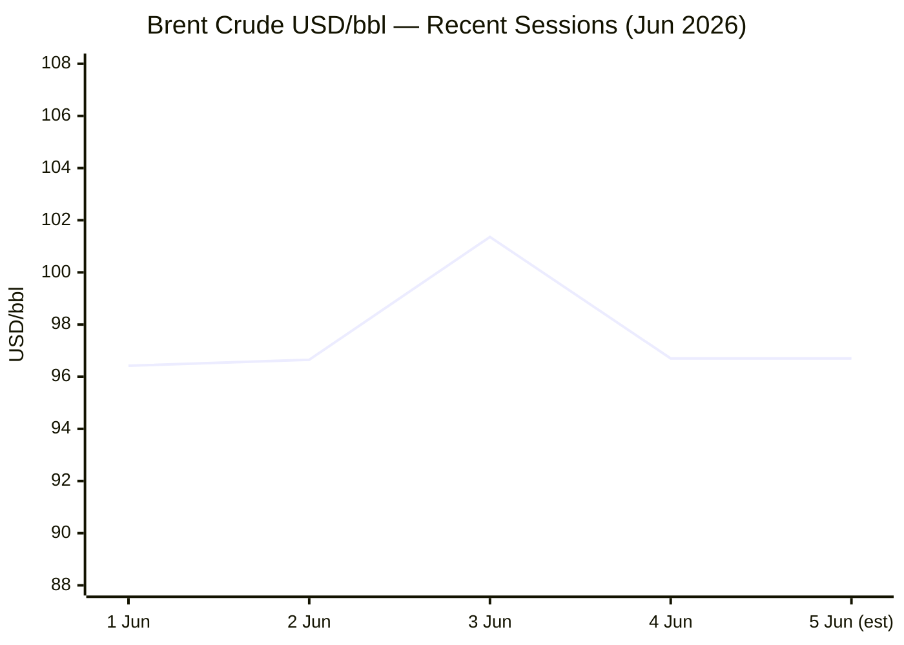
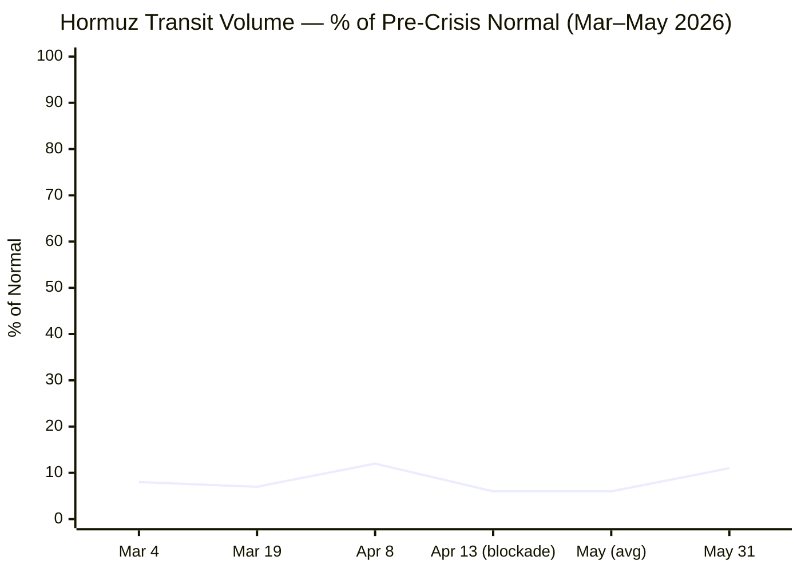

**PHASE 0 COMPLETE** — Run date: 05 June 2026 · 05:01 CET

**Day # calculations:**
- Russia–Ukraine War: 24 Feb 2022 → Day **1,198**
- Iran–US War / Hormuz Crisis: 28 Feb 2026 → Day **97**
- Israel–Lebanon Ceasefire: to be confirmed from source data

---

**PHASE 1 — Direct fetch pass begins**Xinhua ⚠️ — content dated 24 April 2026, outside 24h window. Applying search fallback.EP ⚠️ — navigation only, confirmed. Now Tier 2 institutional fetches:FAO ⚠️ — March release (06/03/2026) is most recent visible; checking if May release (8 May) is published. The page notes next release: 5 June 2026 — today. Searching for fresh data.IMF ⚠️ — no 24h stories in snippet. Now Phase 2 — all search queries:Today (5 June) is the FAO scheduled release date. Searching for the May 2026 FFPI figure:FAO's May 2026 release is today (5 June) but not yet indexed in search — the April 2026 FFPI was 130.7 points (released 8 May). Carrying April forward as latest available. Now searching remaining categories:**PHASE 3 complete — pool merged and deduplicated. Now executing Phases 4–9.**

---

**URL verification, editorial filter, and assembly:**

Data summary:
- EUR/USD: 1.1615 (5 Jun, Trading Economics) — prior session 1.15975 (3 Jun, Wise); Δ = +0.15%
- Brent: ~$97/bbl range today (TE: fell below $97 Thu); Yahoo shows $94.82 during US trading 4 Jun. Using $96.70 (Investing.com intraday range 96.47–97.96)
- Gold: ~$4,450 (TE, 4 Jun); $4,436.64 (LiteFinance, 4 Jun)
- EU CPI: 3.2% (May 2026 flash, Eurostat, 2 Jun 2026)
- FAO FFPI: 130.7 (April 2026, released 8 May) — May release today, not yet indexed
- Hormuz transit: ~11% of pre-crisis volume (31 May, straits.live)
- Israel–Lebanon 2026 ceasefire start: 16 April 2026 — Day 51 today (inclusive from 16 Apr)

---

```yaml
---
brief_date: 2026-06-05
version: v1.2.2
run_time: "05:01 CET"
stories_published: 13
categories: [conflict, business, eu_affairs, technology, trends]
alert_counts:
  red: 5
  yellow: 6
  green: 2
ongoing_situations:
  - {name: "Russia–Ukraine War", real_world_start: "2022-02-24", day: 1198}
  - {name: "Iran–US War / Hormuz Crisis", real_world_start: "2026-02-28", day: 97}
  - {name: "Israel–Lebanon Ceasefire (2026)", real_world_start: "2026-04-16", day: 51}
sources_fetched: 7
fetch_status:
  le_monde: "❌"
  faz: "❌"
  kommersant: "❌"
  xinhua: "⚠️"
  european_parliament: "⚠️"
  fao: "⚠️"
  imf: "⚠️"
expansion_queue: []
---
```

# 🌐 MORNING BRIEF
## Friday, 05 June 2026 · 05:01 CET
### 13 stories across 5 categories

---

## DIGEST SUMMARY

| # | Category | Headline | Alert |
|---|----------|----------|-------|
| 1 | ⚔️ Conflict | Iran–US deal stalled as US and Iran exchange strikes, Hormuz at 11% | 🔴 |
| 2 | ⚔️ Conflict | Lebanon ceasefire agreed by Israel and Lebanese government — Hezbollah rejects | 🔴 |
| 3 | ⚔️ Conflict | Ukraine: Russia presses Donetsk fortress cities, drone campaign targets rail | 🟡 |
| 4 | 💼 Business | Brent crude holds near $97 as deal uncertainty persists | 🔴 |
| 5 | 💼 Business | Samsung, SK Hynix, Micron all breach $1 trillion market cap simultaneously | 🟡 |
| 6 | 💼 Business | EU CPI accelerates to 3.2% in May — ECB rate hike near-certain on 11 June | 🔴 |
| 7 | 🇪🇺 EU Affairs | Commission launches Tech Sovereignty Package: Chips Act 2.0, Cloud & AI Development Act | 🟡 |
| 8 | 🇪🇺 EU Affairs | EU Return Regulation trilogues conclude — Pact on Migration and Asylum enters force 12 June | 🟡 |
| 9 | 🇪🇺 EU Affairs | EU-US Turnberry trade deal: INTA committee vote today, plenary set for 16 June | 🟢 |
| 10 | 🤖 Technology | EU Tech Sovereignty Package creates Cloud and AI Development Act (CADA) framework | 🟡 |
| 11 | 🤖 Technology | AI memory shortage: Samsung, Micron, SK Hynix hit $1 trillion — supply gap to last through 2027 | 🟡 |
| 12 | 📈 Trends | UNCTAD: global trade growth to halve in 2026 as Hormuz disruption reshapes shipping | 🔴 |
| 13 | 📈 Trends | FAO links Hormuz disruption to rising fertiliser costs and food inflation in developing nations | 🟢 |

> Alert Level key: 🔴 High significance · 🟡 Developing · 🟢 Stable/Routine

---

## 🚨 SIGNAL BOARD

🔴 **Iran–US peace MoU remains unsigned — US and Iran exchanged strikes over the weekend while Hormuz transits sit at 11% of pre-crisis volume (Day 97)**
🔴 **Lebanon ceasefire agreed by Israel and Beirut but Hezbollah formally rejects — UNIFIL peacekeeper killed, next talks set for 22 June**
🔴 **EU CPI hits 3.2% in May, highest since September 2023 — ECB hike on 11 June now priced at 95% probability**
🟡 **Samsung, SK Hynix, and Micron all cross $1 trillion simultaneously — AI memory shortage projected to persist through 2027**
⚡ **EU Commission deploys full Tech Sovereignty Package one day after EU–US Turnberry trade deal heads to Parliament — simultaneous assertiveness and engagement**

---

## 🔄 ONGOING SITUATIONS

| Situation | Real-world start | Day # | Last significant development | Status |
|-----------|-----------------|-------|------------------------------|--------|
| Russia–Ukraine War | 24 Feb 2022 | Day 1,198 | Russia pressing Donetsk fortress cities; drone campaign targeting rail 20km behind lines | 🔴 Active |
| Iran–US War / Hormuz Crisis | 28 Feb 2026 | Day 97 | US–Iran MoU unsigned; weekend strikes; Hormuz at ~11% of normal; negotiations ongoing | 🔴 Active |
| Israel–Lebanon Ceasefire (2026) | 16 Apr 2026 | Day 51 | Israel–Lebanon agree conditional ceasefire 3 Jun; Hezbollah rejects; UNIFIL peacekeeper killed | 🟡 Contested |

---

## ⚔️ CONFLICT

> 🔎 **CONFLICT ANALYST** · 3 updates today

### 1. Iran–US Peace Deal Stalled as Both Sides Exchange Strikes 🔴
**Alert:** 🔴
**Summary:** Negotiations over a 60-day memorandum of understanding between Washington and Tehran have stalled after Trump tightened terms — demanding tougher language on Iran's nuclear stockpile and Strait of Hormuz reopening — and sent the framework back for Iranian consideration. Iran's foreign minister confirmed dialogue continues but cautioned against premature expectations. Over the preceding weekend, US forces conducted self-defence strikes against Iranian radar and command-and-control sites following the shootdown of a US MQ-1 drone; Iran launched attacks on US bases in Bahrain and Kuwait. Hormuz transits remain at approximately 11% of pre-crisis volume. Pakistan-mediated negotiations continue.
**Significance:** The failure to finalise the MoU prolongs the world's most acute energy-supply disruption; analysts warn it could take until at least September for tanker markets to normalise even if the strait reopened immediately.
**Sources:**
- [Al Jazeera — Trump tightens terms on Iran war deal, US media say](https://www.aljazeera.com/news/2026/5/31/trump-tightens-terms-on-iran-war-deal-us-media-say) · 31 May 2026
- [CNN — US and Iran exchange renewed fire as Trump asks for changes to proposed deal](https://www.cnn.com/2026/05/31/politics/trump-iran-deal-changes) · 31 May 2026
- [PBS NewsHour — U.S. and Iranian negotiators reach tentative deal to extend ceasefire](https://www.pbs.org/newshour/world/u-s-and-iranian-negotiators-reach-tentative-deal-to-extend-ceasefire-and-start-new-nuclear-talks) · 28 May 2026
**Trend:** → Stable (negotiations ongoing; no breakthrough or collapse)
**Tags:** #Iran #Hormuz #nuclear #peace-talks #Pakistan-mediation #MULTI-SOURCE

---

### 2. Lebanon Ceasefire Agreed — Hezbollah Formally Rejects Deal 🔴
**Alert:** 🔴
**Summary:** On 3 June, Israel and Lebanon agreed to a conditional ceasefire requiring a complete cessation of Hezbollah fire and the creation of "pilot zones" under exclusive Lebanese Armed Forces control. However, Hezbollah leader Naim Qassem formally rejected the agreement, demanding full Israeli withdrawal from southern Lebanon as a precondition. A UNIFIL peacekeeper (Serbian national Sergeant Milovan Jovanovic) was killed by mortar fire on 4 June near Marjayoun. Iran's foreign minister stated the war will only end when Lebanon is also included. Next round of comprehensive talks scheduled for 22 June in Washington.
**Significance:** Hezbollah's formal rejection transforms a diplomatic agreement into an enforcement problem; UNIFIL casualties raise UN political pressure and risk complicating the June 22 track.
**Sources:**
- [Al Jazeera — Israel and Lebanon agree to conditional ceasefire](https://www.aljazeera.com/news/2026/6/4/israel-and-lebanon-agree-to-conditional-ceasefire) · 4 June 2026
- [NPR — Hezbollah rejects ceasefire deal agreed on by Israel and Lebanon](https://www.npr.org/2026/06/04/g-s1-125942/israel-lebanon-ceasefire) · 4 June 2026
- [Axios — Israel, Lebanon agree to full ceasefire, but Hezbollah rejects it](https://www.axios.com/2026/06/03/israel-lebanon-ceasefire-hezbollah-us) · 3 June 2026
**Trend:** ↗ Escalating
**Tags:** #Lebanon #Hezbollah #ceasefire #Israel #MULTI-SOURCE

---

### 3. Ukraine: Russia Presses Donetsk Fortified Cities; Drone Campaign Targets Rail 🟡
**Alert:** 🟡
**Summary:** British Defence Intelligence assessed on 1 June that Russian forces are conducting slow, steady assaults on fortified Ukrainian urban positions in Donetsk — Dobropillia, Vovchansk, and Kostiantynivka — with the situation in Kostiantynivka deteriorating as Russian units operate within the city. Moscow is also advancing in Sumy and Kharkiv oblasts seeking a 20-kilometre buffer zone. Ukrainian rail operator Ukrzaliznytsia reported 541 Russian strikes on railway infrastructure in Q1 2026, causing approximately $178 million in losses and a 6.4% decline in freight volumes. Ukrainian forces continue short-range drone strikes against Russian assets in occupied Donetsk.
**Significance:** Kostiantynivka's fall would open a pathway into the Donetsk fortress belt; the systematic targeting of rail infrastructure threatens the logistics of Western military aid deliveries.
**Sources:**
- [Kyiv Post — British Defence Intelligence Update Ukraine 01 June 2026](https://www.kyivpost.com/post/77479) · 4 June 2026
- [Critical Threats / ISW — Russian Offensive Campaign Assessment, June 1, 2026](https://www.criticalthreats.org/analysis/russian-offensive-campaign-assessment-june-1-2026) · 1 June 2026
**Trend:** ↗ Escalating
**Tags:** #Russia #Ukraine #frontline #drone-warfare #MULTI-SOURCE

📚 *Background reading:* [IISS — Military Balance: Ukraine](https://www.iiss.org) · [Kyiv Independent — Ukraine war tracker](https://kyivindependent.com)

---

## 💼 BUSINESS

> 💼 **BUSINESS ANALYST** · 3 updates today

### 4. Brent Holds Near $97 as Iran Deal Uncertainty Persists 🔴
**Alert:** 🔴
**Summary:** Brent crude futures traded between $96.47 and $97.96 on 5 June, reflecting a fourth day of subdued range-trading as markets assess conflicting signals from US–Iran negotiations. A sharp $4.71 single-session spike to $101.36 on 3 June (after Trump's statement that Iran had agreed not to pursue nuclear weapons) reversed when Iranian forces struck Kuwait and Bahrain. US crude inventories declined for a sixth consecutive week approaching minimum operating levels. The EIA notes Hormuz — carrying approximately 20% of global oil and LNG — remains effectively closed. War-risk insurance for tankers is priced at 8× pre-crisis levels.
**Market signal:** Bearish on supply certainty — until an MoU is signed and Hormuz transits recover, structural premium above $90 is locked in.
**Sources:**
- [Trading Economics — Brent crude oil price and history](https://tradingeconomics.com/commodity/brent-crude-oil) · 3 June 2026
- [Fortune — Current price of oil as of June 3, 2026](https://fortune.com/article/price-of-oil-06-03-2026/) · 3 June 2026
- [straits.live — Strait of Hormuz Day 96 tracker](https://straits.live/) · 4 June 2026
**Trend:** → Stable
**Tags:** #Brent #oil-price #Hormuz #energy-markets #MULTI-SOURCE

📎 See also: Conflict § Story 1 — Iran–US deal stalled; Hormuz at 11% of pre-crisis volume

---

### 5. EU CPI Reaches 3.2% in May — ECB Rate Hike Near-Certain 🔴
**Alert:** 🔴
**Summary:** Eurostat's flash estimate released 2 June confirms euro-area annual HICP inflation accelerated to 3.2% in May 2026, up from 3.0% in April and the highest reading since September 2023. Energy remains the dominant driver at 10.9% annually, but services inflation also rose sharply to 3.5% — signalling broadening price pressures beyond energy. Core inflation (excluding energy, food, alcohol and tobacco) rose to 2.5%. Markets are now pricing a 95% probability of a 25-basis-point ECB rate hike at the 11 June policy meeting, with two to three further increases expected through year-end. ECB board member Isabel Schnabel cautioned that the exact number of hikes remains uncertain.
**Market signal:** Bearish for growth assets; the energy-driven inflation shock is transmitting into core services, raising the probability of a restrictive ECB cycle through late 2026.
**Sources:**
- [Eurostat Euro Indicators — Euro area annual inflation up to 3.2%](https://ec.europa.eu/eurostat/web/products-euro-indicators/w/2-02062026-ap) · 2 June 2026
- [Trading Economics — Euro Area Inflation Rate](https://tradingeconomics.com/euro-area/inflation-cpi) · 2 June 2026
**Trend:** ↗ Escalating
**Tags:** #inflation #ECB #eurozone #interest-rates #MULTI-SOURCE

📎 See also: Conflict § Story 1 — Hormuz disruption is the primary energy price driver

---

### 6. Samsung, SK Hynix, and Micron All Cross $1 Trillion Market Cap 🟡
**Alert:** 🟡
**Summary:** For the first time in history, three memory-chip manufacturers breached the $1 trillion market-capitalisation threshold within the same week. SK Hynix surged 9.21% on 27 May; Micron climbed over 19% on a UBS price-target tripling; Samsung had crossed the threshold weeks earlier. All three are primary suppliers of high-bandwidth memory (HBM) chips to Nvidia. A global HBM shortage — with supply projected to remain constrained through 2027 — has driven valuations to levels previously seen only among mega-cap technology firms. South Korea's Kospi index has nearly doubled since the start of 2026.
**Market signal:** Bullish on the AI memory supply chain; tight HBM supply ensures sustained pricing power but heightens concentration risk for the Korean benchmark.
**Sources:**
- [CNBC — SK Hynix hits $1 trillion valuation as AI boom lifts South Korean chip stocks](https://www.cnbc.com/2026/05/27/sk-hynix-shares-ai-chip-rally-1-trillion.html) · 27 May 2026
- [CNN — SK Hynix: South Korean chip company joins the $1 trillion club](https://www.cnn.com/2026/05/29/business/sk-hynix-chips-trillion-dollar-club-intl-hnk) · 29 May 2026
**Trend:** ↗ Escalating
**Tags:** #semiconductor #equity-rally #AI #MULTI-SOURCE

📚 *Background reading:* [Bruegel — European industrial policy and the AI supply chain](https://www.bruegel.org) · [RAND — Global semiconductor market dynamics](https://www.rand.org)

---

## 🇪🇺 EU AFFAIRS

> 🇪🇺 **EU AFFAIRS ANALYST** · 3 updates today

### 7. EU Return Regulation Agreed — Pact on Migration and Asylum Enters Force 12 June 🟡
**Alert:** 🟡
**Summary:** The European Parliament and Council concluded trilogue negotiations on 1 June, reaching a provisional agreement on the Return Regulation establishing a Common European System for Returns. The regulation introduces uniform return-decision procedures, mandatory cooperation obligations on third-country nationals, extended detention periods, longer entry bans, and a framework for "return hubs" in third countries. It will enter into force immediately upon publication in the Official Journal, with some provisions applicable after 12 months. The agreement complements the EU Pact on Migration and Asylum, which itself enters force on 12 June 2026. Rights groups including the International Rescue Committee warned of a "draconian detention and deportation machine."
**Legislative/policy stage:** Provisional agreement reached 1 June 2026; formal adoption by Parliament and Council pending following legal-linguistic revision; immediate entry into force after Official Journal publication.
**Sources:**
- [European Commission — Commission welcomes political agreement on the Return Regulation](https://home-affairs.ec.europa.eu/news/commission-welcomes-political-agreement-return-regulation-2026-06-02_en) · 2 June 2026
- [Council of the EU — Council and Parliament reach deal on returns](https://www.consilium.europa.eu/en/press/press-releases/2026/06/01/council-and-parliament-reach-deal-on-returns-of-illegally-staying-third-country-nationals/) · 1 June 2026
- [NPR — EU strikes migration deal for deportations and detention centers abroad](https://www.npr.org/2026/06/02/nx-s1-5844100/eu-migration-deal) · 2 June 2026
**Trend:** ↘ De-escalating (legislative process resolved after extended deadlock)
**Tags:** #EU-migration #EU-institutions #single-market #MULTI-SOURCE

---

### 8. EU Tech Sovereignty Package: Chips Act 2.0, Cloud and AI Development Act Proposed 🟡
**Alert:** 🟡
**Summary:** The European Commission on 3 June presented the European Technological Sovereignty Package, a set of legislative and policy measures targeting the EU's over-80% dependence on non-EU digital products and infrastructure. The package bundles four initiatives: Chips Act 2.0 (advanced semiconductor manufacturing capacity); the Cloud and AI Development Act (CADA), which sets sovereignty tiers for cloud workloads and aims to triple EU data-centre capacity by 2035; an Open Source Strategy; and an AI-and-energy-market digitalisation strategy. Executive Vice-President Henna Virkkunen stated US cloud providers are unlikely to reach the highest sovereignty tier due to the US CLOUD Act's data-access provisions.
**Legislative/policy stage:** Package presented by Commission on 3 June 2026; Chips Act 2.0 and CADA now proceed to Parliament and Council for first reading. Rating scheme for cloud sovereignty expected 2026; first labels 2027.
**Sources:**
- [European Commission — Commission proposes tech sovereignty package](https://ec.europa.eu/commission/presscorner/detail/en/ip_26_1187) · 3 June 2026
- [CNBC — Europe unveils tech sovereignty package amid growing concerns over reliance on US tech](https://www.cnbc.com/2026/06/03/europe-tech-sovereignty-us-tech-reliance.html) · 3 June 2026
**Trend:** ↗ Escalating
**Tags:** #EU-institutions #digital-regulation #semiconductor #AI #MULTI-SOURCE

📎 See also: Technology § Story 10 — EU Tech Sovereignty Package: CADA regulatory detail

---

### 9. EU–US Turnberry Trade Deal: INTA Committee Vote Today 🟢
**Alert:** 🟢
**Summary:** The European Parliament's International Trade Committee is scheduled to vote on 5 June on two pieces of legislation implementing the EU–US Turnberry deal on tariff and trade exchanges. If adopted, Parliament is set to hold its final plenary vote on 16 June in Strasbourg. The Turnberry deal emerged in response to earlier US Section 232 tariff pressure and represents the first comprehensive EU–US bilateral trade framework in over a decade.
**Legislative/policy stage:** INTA committee vote scheduled 5 June 2026; plenary final vote expected 16 June 2026 in Strasbourg.
**Sources:**
- [EUbusiness.com — EU Agenda: Week Ahead 1–6 June 2026](https://www.eubusiness.com/politics/eucalendar/) · 1 June 2026
**Trend:** → Stable
**Tags:** #EU-institutions #single-market #diplomacy

📚 *Background reading:* [Bruegel — EU trade policy under geopolitical pressure](https://www.bruegel.org) · [ECFR — EU–US economic security alignment](https://ecfr.eu/)

---

## 🤖 TECHNOLOGY

> 🤖 **TECHNOLOGY ANALYST** · 2 updates today

### 10. EU CADA Framework Targets US Cloud Dominance in Sensitive Workloads 🟡
**Alert:** 🟡
**Summary:** The Cloud and AI Development Act (CADA), proposed within the EU Tech Sovereignty Package on 3 June, introduces a tiered EU-wide framework assessing cloud and AI sovereignty. The highest tier — required for processing sensitive government and critical-infrastructure data — is expected to be unreachable by US hyperscalers due to the extraterritorial reach of the US CLOUD Act. The Commission aims to triple EU data-centre capacity by 2035 and has earmarked approximately €320 billion over ten years for cloud, AI, and semiconductor investments. SoftBank separately announced an intention to invest up to €75 billion in AI data centres in France.
**Analyst note:** Within 12–24 months, CADA's tiering rules are likely to fragment the European cloud market, creating mandatory carve-outs in healthcare, defence, and energy procurement that advantage EU and GDPR-aligned non-US providers — a structural shift with durable revenue implications for hyperscalers operating in the EU.
**Sources:**
- [Global Policy Watch — EU Tech Sovereignty Package](https://www.globalpolicywatch.com/2026/06/eu-tech-sovereignty-package/) · 4 June 2026
- [Light Reading — European Commission unwraps tech sovereignty package](https://www.lightreading.com/ai-machine-learning/eurobites-european-commission-unwraps-tech-sovereignty-package) · 4 June 2026
**Trend:** ↗ Escalating
**Tags:** #AI-regulation #data-centre #digital-regulation #semiconductor #MULTI-SOURCE

---

### 11. Three Memory-Chip Giants Hit $1 Trillion — AI Shortage to Last Through 2027 🟡
**Alert:** 🟡
**Summary:** The simultaneous crossing of the $1 trillion market-capitalisation threshold by Samsung, SK Hynix, and Micron within a single week signals that AI-driven demand for high-bandwidth memory (HBM) has produced a structural supply deficit of historic proportions. SK Hynix shares are up approximately 250% year-to-date in 2026; Micron's UBS price target was tripled. Analysts note the memory shortage will not ease before 2027, with all three producers unable to ramp production at the pace AI data-centre expansion demands. COMPUTEX 2026 (2–5 June, Taipei) is running concurrently under the theme "AI Together," reflecting the industry's unanimous orientation toward AI infrastructure.
**Analyst note:** Within 12–24 months, sustained HBM undersupply is likely to act as a hard cap on AI training and inference deployment rates, potentially forcing hyperscalers to adjust scaling roadmaps and accelerate vertical integration efforts.
**Sources:**
- [SiliconANGLE — Micron and SK Hynix surpass $1T valuation milestone](https://siliconangle.com/2026/05/26/micron-sk-hynix-surpass-1-trillion-valuation-milestone-surging-ai-memory-demand/) · 26 May 2026
- [CNN — SK Hynix: South Korean chip company joins the $1 trillion club](https://www.cnn.com/2026/05/29/business/sk-hynix-chips-trillion-dollar-club-intl-hnk) · 29 May 2026
**Trend:** ↗ Escalating
**Tags:** #semiconductor #AI #equity-rally #MULTI-SOURCE

📚 *Background reading:* [CSIS — AI and semiconductor supply chain risk](https://www.csis.org) · [RAND — HBM geopolitics and national security](https://www.rand.org)

---

## 📈 TRENDS

> 📈 **TRENDS ANALYST** · 2 updates today

### 12. UNCTAD: Global Trade Growth to Halve in 2026 as Hormuz Reshapes Shipping 🔴
**Alert:** 🔴
**Summary:** UNCTAD's Trade and Development Foresights 2026 (released late May) projects global merchandise trade growth to decelerate from 4.7% in 2025 to between 1.5% and 2.5% in 2026, with the Strait of Hormuz disruption identified as the dominant driver. Rising maritime freight rates, higher insurance premiums, and the redirection of traffic around the Cape of Good Hope are raising transport costs across all commodity classes. UNCTAD also warns of financial stress among major food-trading firms, which could amplify food-security risks in developing economies already exposed to tighter fiscal space and energy-driven fertiliser inflation.
**Horizon:** Medium-term — the shipping realignment is a structural shift that will persist for 6–18 months regardless of when the strait reopens, as carriers renegotiate contracts, insurance markets reprice, and new routing infrastructure is built.
**Sources:**
- [UNCTAD — Global economy faces new test as trade, food and finance shocks spread](https://unctad.org/news/global-economy-faces-new-test-trade-food-and-finance-shocks-spread) · 20 May 2026
- [UNCTAD — Trade and Development Foresights 2026](https://unctad.org/publication/trade-and-development-foresights-2026-global-economy-faces-geopolitical-challenge) · 20 May 2026
**Trend:** ↗ Escalating
**Tags:** #shipping #Hormuz #supply-shock #food-security #MULTI-SOURCE

---

### 13. FAO Links Hormuz to Rising Fertiliser Costs and Global Food Inflation 🟢
**Alert:** 🟢
**Summary:** FAO's April 2026 Food Price Index report (the most recent published data; May release scheduled for today) documented the third consecutive monthly increase in global food commodity prices, reaching 130.7 points in April, a 2.0% year-on-year rise. The FAO explicitly linked fertiliser cost pressures — driven by elevated energy prices and disruptions associated with the Hormuz closure — to moderating wheat plantings for 2026 crops. World wheat production is now forecast at 817 million tonnes, approximately 2% below the prior year. FAO cited resilient cereal stocks as a stabilising factor, but warned of broader food-security risks in import-dependent developing nations facing simultaneous energy and shipping cost shocks.
**Horizon:** Long-term — fertiliser and shipping cost transmission to food prices operates on a 6–18 month lag; 2026 harvest forecasts will determine whether today's cost pressures become a 2027 food-security event.
**Sources:**
- [FAO — FAO Food Price Index up for third consecutive month](https://www.fao.org/newsroom/detail/fao-food-price-index-up-for-third-consecutive-month-largely-on-rising-vegetable-oil-prices/en) · 8 May 2026
- [FAO — Global Agrifood Implications of the 2026 Conflict in the Middle East](https://openknowledge.fao.org/server/api/core/bitstreams/1aafb5d8-39d1-481a-b1f8-25facaec3051/content) · March 2026
**Trend:** ↗ Escalating
**Tags:** #food-prices #food-security #Hormuz #shipping #MULTI-SOURCE

📚 *Background reading:* [Atlantic Council — Middle East energy disruption and food systems](https://www.atlanticcouncil.org) · [CFR — Hormuz closure: strategic and economic implications](https://www.cfr.org/)

---

## 📊 KEY DATA OF THE DAY

> 📊 **DATA OFFICER** · 7 indicators

| Indicator | Value | Δ vs prior session | Δ vs 7 days ago | Note | Source | URL |
|-----------|-------|-------------------|-----------------|------|--------|-----|
| EUR/USD | 1.1615 | +0.15% | N/A | Recovering toward 1.164 on ceasefire optimism; ECB hike priced in | Trading Economics | [link](https://tradingeconomics.com/euro-area/currency) |
| Brent Crude (USD/bbl) | ~96.70 | N/A | N/A | Intraday range 96.47–97.96; rally to $101 on 3 Jun reversed on Iran strikes | Investing.com | [link](https://www.investing.com/commodities/brent-oil-historical-data) |
| Gold (XAU/USD) | ~$4,450 | N/A | N/A | Down ~2% on week; rate-hike expectations weigh on non-yielding asset | Trading Economics | [link](https://tradingeconomics.com/commodity/gold) |
| IMF Global Growth 2026 | N/A | N/A | N/A | April WEO not surfaced in this run; UNCTAD projects 2.6% | IMF WEO | [link](https://www.imf.org/en/News) |
| EU CPI YoY (latest) | 3.2% | +0.2pp (vs Apr: 3.0%) | +0.6pp (vs Feb: 2.6%) | May 2026 flash; highest since Sep 2023; energy 10.9%, services 3.5% | Eurostat | [link](https://ec.europa.eu/eurostat/web/products-euro-indicators/w/2-02062026-ap) |
| FAO Food Price Index | 130.7 | +1.6% (vs Mar) | +2.0% YoY | April 2026 — latest available; May release due today, not yet indexed | FAO | [link](https://www.fao.org/newsroom/detail/fao-food-price-index-up-for-third-consecutive-month-largely-on-rising-vegetable-oil-prices/en) |
| Strait of Hormuz transit vol. | ~11% of normal | N/A | N/A | 10 vessels on 31 May (IMF PortWatch/straits.live); ~80% shadow fleet | straits.live / IMF PortWatch | [link](https://straits.live/) |

**Data commentary:** The combination of Brent holding near $97, EU CPI at its highest in nearly three years, and Hormuz transits at a fraction of pre-crisis volume illustrates how the Iran conflict is simultaneously driving inflation (energy costs), tightening monetary conditions (ECB hike), and reshaping physical commodity flows. Gold's modest decline despite geopolitical stress is a key signal: markets are beginning to price in higher real rates rather than pure safe-haven demand, suggesting the inflation transmission from the Hormuz disruption is now dominating over the risk-premium narrative. The FAO Food Price Index approaching its May 2026 release — likely to reflect further fertiliser-linked pressures — will be the next key data event today.

---

## 📈 CHARTS

### Chart 1 — Brent Crude: 5-Session Trajectory (2–5 June 2026)



### Chart 2 — Strait of Hormuz: Transit Volume as % of Pre-Crisis Normal



*(Chart 3 omitted — no editor-supplied historical data points provided for this run)*

---

## ⚙️ AGENT METADATA

| Field | Value |
|-------|-------|
| Agent version | MORNING BRIEF v1.2.2 |
| Run timestamp | 2026-06-05T05:01:14+02:00 |
| Fetch status | Le Monde ❌ · FAZ ❌ · Kommersant ❌ · Xinhua ⚠️ (stale — dated 24 Apr) · EP ⚠️ (navigation only) · FAO ⚠️ (Mar release on page; May release due today) · IMF ⚠️ (no 24h story) |
| Sources queried | 9 / 11 (Le Monde ❌, FAZ ❌, Kommersant ❌ excluded from tally; all three applied search fallback) |
| Stories surfaced | ~28 before editorial filter |
| Stories published | 13 |
| Languages processed | EN |
| Output language | English (British) |
| Date validated | ✅ Confirmed 05 June 2026 |
| Expansion Queue | None |

---

*MORNING BRIEF is an AI-assisted digest. All summaries are paraphrased from original sources. Verify time-sensitive information at the linked URLs before acting. Output language: British English.*
