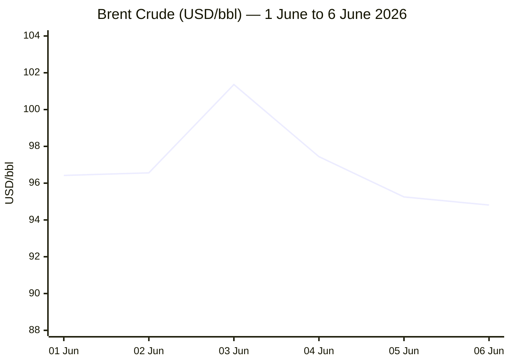
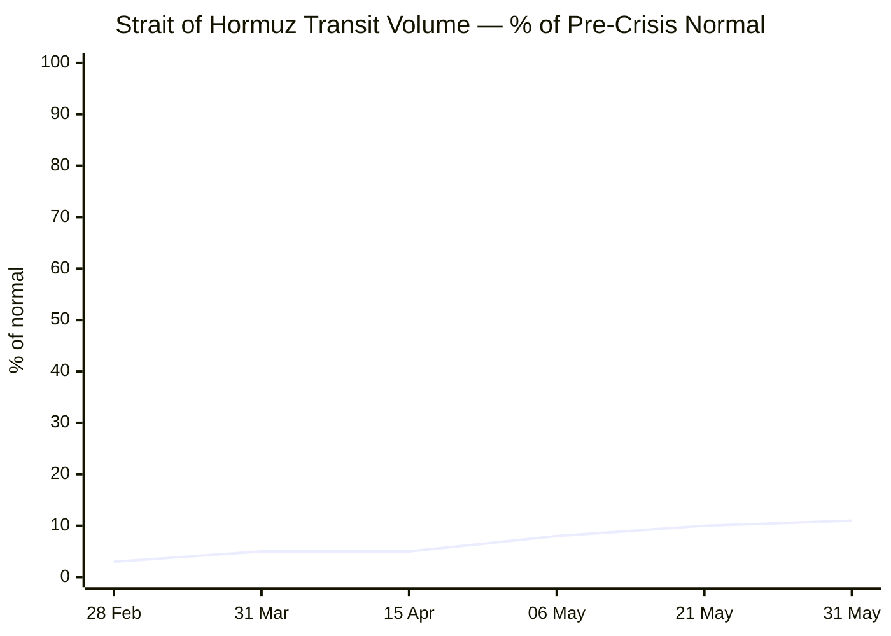

```yaml
---
brief_date: 2026-06-06
version: v1.2.2
run_time: "05:40 CET"
stories_published: 13
categories: [conflict, business, eu_affairs, technology, trends]
alert_counts:
  red: 5
  yellow: 6
  green: 2
ongoing_situations:
  - {name: "Russia–Ukraine War", real_world_start: "2022-02-24", day: 1199}
  - {name: "Iran–US War / Hormuz Crisis", real_world_start: "2026-02-28", day: 99}
  - {name: "Israel–Lebanon Ceasefire 2026", real_world_start: "2026-04-16", day: 52}
sources_fetched: 9
fetch_status:
  le_monde: "❌"
  faz: "❌"
  kommersant: "❌"
  xinhua: "⚠️"
  european_parliament: "⚠️"
expansion_queue: []
---
```

# 🌐 MORNING BRIEF
## Saturday, 06 June 2026 · 05:40 CET
### 13 stories across 5 categories

---

## DIGEST SUMMARY

| # | Category | Headline | Alert |
|---|----------|----------|-------|
| 1 | ⚔️ Conflict | Zelensky sends open letter to Putin proposing ceasefire and bilateral meeting | 🟡 |
| 2 | ⚔️ Conflict | Hormuz at Day 99: zero outbound commercial transits on 5 June | 🔴 |
| 3 | ⚔️ Conflict | Hezbollah rejects Israel–Lebanon ceasefire framework; fighting resumes | 🔴 |
| 4 | 💼 Business | Brent crude slides below $95 on Iran deal optimism, still up 4%+ week-on-week | 🟡 |
| 5 | 💼 Business | FAO Food Price Index: May 2026 stabilises at 130.8, wheat up 3.4% on Hormuz fallout | 🟡 |
| 6 | 💼 Business | ECB rate hike virtually certain on 11 June; CPI hits 3.2%, 2.5-year high | 🔴 |
| 7 | 🇪🇺 EU Affairs | EU Return Regulation: Parliament–Council deal reached on 1 June | 🟡 |
| 8 | 🇪🇺 EU Affairs | Pay Transparency Directive deadline passes 7 June with most states non-compliant | 🟡 |
| 9 | 🇪🇺 EU Affairs | EU infringement package June 2026: Germany and Spain face new procedures | 🟢 |
| 10 | 🤖 Technology | Microsoft unveils MAI-Thinking-1 at Build 2026 — first in-house reasoning model | 🟡 |
| 11 | 🤖 Technology | Anthropic files confidential S-1 with SEC at ~$965 billion valuation | 🔴 |
| 12 | 📈 Trends | Shipping rates surge 51–75% above pre-conflict levels as Hormuz standstill persists | 🔴 |
| 13 | 📈 Trends | Global food vulnerability deepens as Hormuz drives fertiliser and cereal cost spiral | 🟡 |

> Alert Level key: 🔴 High significance · 🟡 Developing · 🟢 Stable/Routine

---

## 🚨 SIGNAL BOARD

🔴 **Hormuz at Day 99: commercial outbound transits have been zero for 72+ hours; transit volume stands at 11% of pre-war norm, with 6 P&I clubs having withdrawn cover.**
🔴 **EU CPI reaches 3.2% in May — highest in 2.5 years — triggering near-certain ECB rate hike on 11 June to 2.25% (98% market-implied probability).**
🟡 **Zelensky's open letter to Putin — proposing ceasefire and bilateral meeting in Istanbul, Vatican, or Switzerland — marks most direct diplomatic overture in the 1,199-day war; Kremlin has not formally responded.**
🟡 **Brent crude down ~1% on 5 June but +4% for the week; Iran–US talks described as "back on track" but Lebanon deadlock remains the key obstacle.**
⚡ **Anthropic files confidential S-1 at $965 billion valuation, overtaking OpenAI's $852 billion — a sector landmark with IPO timing conditional on SEC review and market conditions.**

---

## 🔄 ONGOING SITUATIONS

| Situation | Real-world start | Day # | Last significant development | Status |
|-----------|-----------------|-------|------------------------------|--------|
| Russia–Ukraine War | 24 Feb 2022 | Day 1,199 | Zelensky open letter to Putin proposes ceasefire and direct bilateral meeting; Kremlin non-committal | 🟡 Stalemated |
| Iran–US War / Hormuz Crisis | 28 Feb 2026 | Day 99 | Zero outbound commercial transits 5 Jun; US CENTCOM naval escort corridor active but limited; talks described as "back on track" | 🔴 Active |
| Israel–Lebanon Ceasefire 2026 | 16 Apr 2026 | Day 52 | Hezbollah rejects 4 Jun Washington agreement; demands Israeli withdrawal; fighting continues in southern Lebanon | 🔴 Fragile/Breached |

---

## ⚔️ CONFLICT ANALYST · 3 updates today

---

### 1. Zelensky Proposes Direct Meeting and Full Ceasefire in Open Letter to Putin 🟡

**Alert:** 🟡
**Summary:** Ukrainian President Volodymyr Zelensky published an open letter to Vladimir Putin on 4 June proposing a face-to-face bilateral meeting — in Istanbul, the Vatican, or Switzerland — and offering a full ceasefire for the duration of negotiations. Zelensky proposed US monitoring of any frontline silence, an "all-for-all" prisoner exchange, and noted Ukraine was ready to meet "any day starting Monday." The Kremlin acknowledged the letter but said Putin had not yet seen it, offering a meeting in Moscow — a venue Zelensky preemptively ruled out. Moscow simultaneously continued its St Petersburg Economic Forum, with Russian officials projecting economic stability. ISW notes Russian forces continue slow grinding advances in Kostiantynivka and Sumy. 📎 See also: Trends § Story 13

**Significance:** The letter is the most substantive direct diplomatic overture in the 1,199-day war. US monitoring of a ceasefire — if agreed — would represent a structural shift in Washington's posture toward the conflict.

**Sources:**
- [The Moscow Times — In Open Letter to Putin, Zelensky Calls for Meeting and Ceasefire](https://www.themoscowtimes.com/2026/06/04/in-open-letter-to-putin-zelensky-calls-for-meeting-and-ceasefire-a92935) · 04 June 2026
- [France 24 — Zelensky proposes face-to-face Putin meeting and 'full ceasefire'](https://www.france24.com/en/europe/20260604-zelensky-in-open-letter-to-putin-proposes-face-to-face-meeting-and-full-ceasefire) · 04 June 2026
- [Yahoo News / Ukrainska Pravda — Zelenskyy proposes ceasefire to Putin before potential meeting](https://www.yahoo.com/news/zelenskyy-proposes-ceasefire-putin-potential-130646443.html) · 04 June 2026 [MULTI-SOURCE]

**Trend:** ↗ Escalating (diplomatic escalation)
**Tags:** #Ukraine #Russia #peace-talks #ceasefire #MULTI-SOURCE

---

### 2. Hormuz Day 99: Zero Outbound Commercial Transits — US Naval Corridor Active but Negligible 🔴

**Alert:** 🔴
**Summary:** As of early morning on 5 June 2026, no commercial vessels completed outbound transit of the Strait of Hormuz for the 72-hour period ending that date, according to live vessel tracking via Straits.live and IMF PortWatch data. Transit volume stands at 11% of pre-crisis norms (10 vessels on 31 May against a typical 95 per day). War-risk insurance now prices at 8× pre-crisis levels, with six P&I clubs having withdrawn cover. US CENTCOM established a naval corridor using destroyer guidance, but Stars and Stripes reports uptake is rare and transits remain hazardous. Two-thirds of tankers are running AIS-dark to transit. Iran's US-conflict ceasefire remains technically in effect (extended indefinitely 21 April), but its terms are disputed and Hormuz access remains blocked.

**Significance:** At Day 99, the Hormuz blockade is the most prolonged disruption to a major maritime chokepoint since the Suez Crisis. Every additional day without transit compounds fertiliser and energy input shortages across South and Southeast Asia.

**Sources:**
- [Straits.live — Strait of Hormuz Closed, Day 96, June 2026 Live Tracker](https://straits.live/) · 05 June 2026
- [Stars and Stripes — US military helps commercial ships transit Strait of Hormuz](https://www.stripes.com/branches/navy/2026-06-02/iran-us-helping-ships-hormuz-persian-gulf-21849668.html) · 02 June 2026
- [The National — Ships face 4,000-times higher insurance costs to cross Strait of Hormuz](https://www.thenationalnews.com/business/economy/2026/06/03/hormuz-shipping-trade-iran-war/) · 03 June 2026 [MULTI-SOURCE]

**Trend:** → Stable (standstill persists)
**Tags:** #Hormuz #Iran #naval-blockade #shipping #MULTI-SOURCE

---

### 3. Hezbollah Rejects Israel–Lebanon Washington Ceasefire Framework 🔴

**Alert:** 🔴
**Summary:** Hezbollah leader Naim Kassem declared the ceasefire framework agreed by Israel and Lebanon in Washington on 3–4 June "absurd, humiliating, and insulting," demanding instead a full Israeli withdrawal before any cessation of hostilities. The agreement — the fourth round of US-brokered ambassador-level talks — required Hezbollah to stop attacks while Israeli forces remained in southern Lebanon; Israel continued strikes in the south hours after the announcement. Lebanese President Joseph Aoun called the agreement the "last chance" for a comprehensive deal. A UNIFIL peacekeeper was killed by mortar fire in south-east Lebanon on 4 June. Iran has demanded any lasting truce include Lebanon, further linking the tracks.

**Significance:** Hezbollah's non-participation in the Washington negotiations now emerges as the structural obstacle to ceasefire consolidation. Its rejection continues to block a broader Iran–US deal, with Lebanon's peace process described by analysts as "interconnected with Iran."

**Sources:**
- [NPR — Hezbollah rejects ceasefire deal agreed on by Israel and Lebanon](https://www.npr.org/2026/06/04/g-s1-125942/israel-lebanon-ceasefire) · 04 June 2026
- [Euronews — Israel and Lebanon agree to conditional ceasefire following US-led talks](https://www.euronews.com/2026/06/04/israel-and-lebanon-agree-to-conditional-ceasefire-following-us-led-talks) · 04 June 2026
- [Al Jazeera — Israel and Lebanon agree to conditional ceasefire](https://www.aljazeera.com/news/2026/6/4/israel-and-lebanon-agree-to-conditional-ceasefire) · 04 June 2026 [MULTI-SOURCE]

**Trend:** ↗ Escalating
**Tags:** #Lebanon #Hezbollah #Israel #ceasefire #MULTI-SOURCE

📚 *Background reading:* [Kyiv Independent](https://kyivindependent.com) — Ukraine war coverage · [CFR](https://www.cfr.org) — US–Iran diplomacy and Hormuz crisis analysis

---

## 💼 BUSINESS ANALYST · 3 updates today

---

### 4. Brent Crude Retreats to ~$94.80 on Iran Deal Optimism but Holds Weekly Gain 🟡

**Alert:** 🟡
**Summary:** Brent crude settled near $95.25 on 5 June 2026 (down 1.22% on the day) and opened lower to ~$94.80 early on 6 June, as diplomatic signals suggested US–Iran talks were "back on track." Trump confirmed he would only re-engage militarily if Tehran kills US troops. However, the international benchmark remains more than 4% higher week-on-week and approximately 43% higher year-on-year, reflecting the sustained Hormuz blockade. WTI fell more sharply to ~$90.30 on concerns about weakening Chinese demand, with Chinese crude imports falling to a ten-year low. The forward curve shows steep backwardation: October 2026 Brent already at $89.82/bbl. 📎 See also: Conflict § Story 2

**Market signal:** Bearish intraday on peace optimism, but structurally elevated while Hormuz remains blocked; the forward curve signals markets anticipate gradual reopening.

**Sources:**
- [Trading Economics — Brent Crude Oil Price Chart](https://tradingeconomics.com/commodity/brent-crude-oil) · 05 June 2026
- [Oilprice.com — Brent Crude Oil Futures](https://oilprice.com/futures/brent/) · 06 June 2026
- [Trading Economics — WTI Crude Oil](https://tradingeconomics.com/commodity/crude-oil) · 05 June 2026 [MULTI-SOURCE]

**Trend:** ↘ De-escalating (price)
**Tags:** #Brent #oil-price #Hormuz #energy-markets #MULTI-SOURCE

---

### 5. FAO May 2026: Food Price Index Stabilises at 130.8 but Wheat Surges 3.4% 🟡

**Alert:** 🟡
**Summary:** The FAO Food Price Index averaged 130.8 points in May 2026, fractionally down 0.2% from the revised April level of ~131.0 points, but 2.9% higher than a year earlier — the index's highest sustained level since early 2023. The apparent stability masked sharp divergence within sub-indices: wheat prices rose 3.4% month-on-month and 7.8% year-on-year, driven by poor US winter wheat harvests and Hormuz-linked fertiliser disruptions; palm and soy oil fell sharply (−4.6% for vegetable oils overall). FAO's director of Markets and Trade warned that Hormuz uncertainty "could reduce fertiliser use and place additional pressure on food prices." Cereal price index is up 4.9% year-on-year.

**Market signal:** Neutral headline but bearish for food-importing economies in MENA and South Asia; wheat sub-index trajectory is a leading food-security stress indicator.

**Sources:**
- [The Cattle Site — World food prices stable in May as vegetable oil drop offsets gains – FAO](https://www.thecattlesite.com/news/world-food-prices-stable-in-may-as-vegetable-oil-drop-offsets-gains-fao) · 05 June 2026
- [Ukragroconsult — FAO Food Price Index stable amid diverging commodity price trends](https://ukragroconsult.com/en/news/fao-food-price-index-stable-amid-diverging-commodity-price-trends/) · 05 June 2026 [MULTI-SOURCE]

**Trend:** → Stable (headline); ↗ Escalating (cereals sub-index)
**Tags:** #food-prices #FAO #Hormuz #commodities #MULTI-SOURCE

---

### 6. ECB Rate Hike Virtually Certain on 11 June as Eurozone CPI Hits 3.2% 🔴

**Alert:** 🔴
**Summary:** Eurostat's flash estimate released 2 June confirmed eurozone CPI reached 3.2% YoY in May 2026 — the highest rate since September 2023 and the fourth consecutive monthly acceleration, driven primarily by energy (10.9% YoY) and services (3.5%). Market pricing as of 6 June implies a 98% probability of a 25-basis-point ECB rate hike on 11 June, taking the deposit facility rate to 2.25%. The ECB held at 2.00% in April, with President Lagarde signalling June would be the "right time" for a new assessment. Goldman Sachs analysts warn that rate-hike expectations are already tightening lending conditions, raising recession risk if the conflict extends.

**Market signal:** Hawkish — ECB hike is all but priced in; risk lies in communications telegraphing a faster or slower path toward a potential terminal rate above 2.50%.

**Sources:**
- [Eurostat — Euro area annual inflation up to 3.2%](https://ec.europa.eu/eurostat/web/products-euro-indicators/w/2-02062026-ap) · 02 June 2026
- [ECB Watch — ECB Interest Rate Probabilities, June 2026](https://ecb-watch.eu/) · current
- [CNBC — The ECB is in a bind over rate hikes](https://www.cnbc.com/2026/05/29/the-ecb-is-debating-rate-hikes-but-the-private-sector-could-help-out.html) · 29 May 2026 [MULTI-SOURCE]

**Trend:** ↗ Escalating
**Tags:** #ECB #inflation #interest-rates #eurozone #MULTI-SOURCE

📚 *Background reading:* [Bruegel](https://www.bruegel.org) — ECB tightening cycle and eurozone fragmentation risks · [RAND](https://www.rand.org) — Conflict economics and inflation transmission

---

## 🇪🇺 EU AFFAIRS ANALYST · 3 updates today

---

### 7. EU Return Regulation: Parliament–Council Provisional Agreement Reached 🟡

**Alert:** 🟡
**Summary:** On 1 June 2026, the European Parliament and Council reached a provisional agreement on the Return Regulation, replacing the obsolete 2008 Return Directive. The regulation introduces a European Return Order creating unified cross-EU return decisions, stronger cooperation obligations, wider detention options, and provisions for return hubs in third countries, while requiring compliance with fundamental rights. A "backloading" strategy — proposed by the Cypriot Council presidency — resolves the deadlock over entry into force: some provisions apply immediately upon publication in the Official Journal, while others take effect 12 months later. The regulation is timed to complement the EU Pact on Migration and Asylum, which enters implementation on 12 June 2026. Human rights organisations including ECRE strongly criticised the agreement. The LIBE committee vote is expected in late June before formal plenary adoption.

**Legislative/policy stage:** Provisional agreement concluded 1 June 2026. LIBE committee vote expected late June 2026; formal plenary adoption pending.

**Sources:**
- [Council of the EU — Council and Parliament reach deal on returns of illegally staying third-country nationals](https://www.consilium.europa.eu/en/press/press-releases/2026/06/01/council-and-parliament-reach-deal-on-returns-of-illegally-staying-third-country-nationals/) · 01 June 2026
- [European Commission — Commission welcomes political agreement on the Return Regulation](https://home-affairs.ec.europa.eu/news/commission-welcomes-political-agreement-return-regulation-2026-06-02_en) · 02 June 2026
- [Agence Europe — 'Returns' Regulation – final agreement](https://agenceurope.eu/en/bulletin/article/13878/1/returns-regulation-with-the-help-of-a-commission-proposal-the-european-parliament-and-the-council-of-the-eu-have-finally-reached-an-agreement) · 02 June 2026 [MULTI-SOURCE]

**Trend:** ↘ De-escalating (legislative deadlock broken)
**Tags:** #EU-migration #EU-institutions #single-market #MULTI-SOURCE

---

### 8. Pay Transparency Directive Deadline Passes 7 June with Majority of Member States Non-Compliant 🟡

**Alert:** 🟡
**Summary:** The EU Pay Transparency Directive (Directive 2023/970) transposition deadline of 7 June 2026 passes tomorrow, with the majority of the EU's 27 member states not having adopted implementing legislation. As of 20 May, only Slovakia and Italy had comprehensive implementing legislation in force; ten states had published draft legislation; eleven had no public draft at all. The Netherlands and Denmark have formally announced delays until January 2027; Belgium has requested a six-month reprieve from sanctioning proceedings. The European Commission has repeatedly confirmed no deadline extension, leaving it facing a wave of infringement procedures. Spain was fined €6.83 million plus a daily penalty last year for missing the Work-Life Balance Directive deadline, setting the enforcement template.

**Legislative/policy stage:** Transposition deadline 7 June 2026. Commission expected to open infringement proceedings against non-compliant member states in the weeks that follow.

**Sources:**
- [Crowell & Moring — EU Pay Transparency Directive: The Transposition Deadline is Looming](https://www.crowell.com/en/insights/client-alerts/eu-pay-transparency-directive-the-transposition-deadline-is-looming-what-now) · 04 June 2026
- [L&E Global — Pay Transparency Directive: Europe Nears the Deadline, but Most Member States are Not Ready](https://leglobal.law/2026/05/27/european-union-pay-transparency-directive-europe-nears-the-deadline-but-most-member-states-are-not-ready/) · 27 May 2026

**Trend:** ↗ Escalating (enforcement risk)
**Tags:** #EU-institutions #single-market #rule-of-law

---

### 9. June 2026 EU Infringement Package: New Procedures Against Germany and Spain 🟢

**Alert:** 🟢
**Summary:** The European Commission's June 2026 infringement package includes two notable new procedures. Germany received a letter of formal notice for legislation in North Rhine-Westphalia requiring crafts providers — such as masons and carpenters — seeking to submit building permit applications to be resident or established in that state, which the Commission considers incompatible with the Services Directive (2006/123/EC) and TFEU Articles 49 and 56 on freedom of establishment. Spain is required to align legislation on payment systems to allow non-bank payment service providers to participate directly in Settlement Finality Directive-designated systems, supporting instant payment delivery. Both states have two months to respond or face referral to the Court of Justice.

**Legislative/policy stage:** Letters of formal notice issued; two-month response period now running.

**Sources:**
- [EUbusiness.com — June 2026 EU infringements package: key decisions](https://www.eubusiness.com/eulaw/june-2026-eu-infringements-package-key-decisions/) · 05 June 2026

**Trend:** → Stable
**Tags:** #EU-institutions #single-market #rule-of-law

📚 *Background reading:* [Bruegel](https://www.bruegel.org) — EU migration policy and the return system · [ECFR](https://ecfr.eu) — EU Pay Transparency and gender pay gap in Europe

---

## 🤖 TECHNOLOGY ANALYST · 2 updates today

---

### 10. Microsoft Build 2026: MAI-Thinking-1 — First In-House Reasoning Model, Without OpenAI Data 🟡

**Alert:** 🟡
**Summary:** At its Build 2026 developer conference in San Francisco on 2 June, Microsoft unveiled a family of seven in-house AI models under the MAI (Microsoft AI) brand, led by MAI-Thinking-1 — the company's first reasoning model. The model has 35 billion active parameters (approximately one trillion total via sparse Mixture of Experts architecture), a 256,000-token context window, and was trained from scratch on commercially licensed data with zero distillation from OpenAI or any third party. Microsoft claims independent blind testers preferred it to Claude Sonnet 4.6 and that it matches Claude Opus 4.6 on SWE-bench Pro (53%). The model is in private preview via Microsoft Foundry. A companion MAI-Code-1-Flash model targets GitHub Copilot and VS Code workflows. Microsoft positions the release as evidence of its move toward multi-vendor "long-term self-sufficiency."

**Analyst note:** Over 12–24 months, Microsoft's in-house model capability creates meaningful pricing leverage over OpenAI and Anthropic in Azure enterprise contracts, potentially reshaping frontier-model commercial terms across the sector.

**Sources:**
- [Microsoft Official Blog — Microsoft Build 2026: Be yourself at work](https://blogs.microsoft.com/blog/2026/06/02/microsoft-build-2026-be-yourself-at-work/) · 02 June 2026
- [CNBC — Microsoft unveils new AI models to lessen reliance on OpenAI](https://www.cnbc.com/2026/06/02/microsoft-unveils-new-ai-models-lessen-reliance-on-openai-lower-costs.html) · 02 June 2026 [MULTI-SOURCE]

**Trend:** ⚡ Reversal (Microsoft from OpenAI reseller to independent model developer)
**Tags:** #AI #LLM #AI-benchmark #semiconductor #MULTI-SOURCE

---

### 11. Anthropic Files Confidential S-1 with SEC at ~$965 Billion Valuation 🔴

**Alert:** 🔴
**Summary:** Anthropic on 1 June 2026 announced it had confidentially submitted a draft Form S-1 registration statement to the US Securities and Exchange Commission for a proposed initial public offering of common stock. The filing follows a $65 billion Series H round that brought the company's valuation to $965 billion — surpassing OpenAI's $852 billion from its March 2026 funding round. Annualised revenue was reported at $47 billion in May 2026, up from roughly $9 billion at end-2025. No share count or price has been set; timing is conditional on SEC review and market conditions. Rival OpenAI is also preparing a confidential filing; SpaceX has already published its S-1 and is targeting a roadshow this week. Wedbush described the trio as "opening the floodgates for the IPO market."

**Analyst note:** If Anthropic reaches a public debut above $1 trillion, it will represent the first AI-safety-focused lab to cross that threshold via public markets — a structural signal for how institutional investors price AI safety differentiation over the next 12–24 months.

**Sources:**
- [Anthropic — Confidential draft S-1 to the SEC](https://www.anthropic.com/news/confidential-draft-s1-sec) · 01 June 2026
- [CNBC — Anthropic confidentially files IPO prospectus with SEC](https://www.cnbc.com/2026/06/01/anthropic-ipo-s1-prospectus.html) · 01 June 2026
- [TechCrunch — Anthropic files to go public](https://techcrunch.com/2026/06/01/anthropic-files-to-go-public/) · 01 June 2026 [MULTI-SOURCE]

**Trend:** ↗ Escalating
**Tags:** #AI #IPO #LLM #MULTI-SOURCE

📚 *Background reading:* [CSIS](https://www.csis.org) — AI industry structure and competition policy implications · [RAND](https://www.rand.org) — AI governance and safety in frontier model development

---

## 📈 TRENDS ANALYST · 2 updates today

---

### 12. Shipping Rates 51–75% Above Pre-Conflict Baseline as Hormuz Standstill Enters Fourth Month 🔴

**Alert:** 🔴
**Summary:** Spot shipping freight rates have surged 75% above pre-conflict levels from China to the US East Coast, 51% higher to North Europe, and 45% to the Mediterranean, according to Xeneta data cited by The National. War-risk insurance for tankers prices at 8× pre-crisis levels. Approximately 2,000 vessels remain stranded in the Gulf, with 1,550+ estimated as of early May. DHL forecasts a two-to-three month backlog after the strait reopens — meaning even a deal this week would not normalise supply chains until September. The simultaneous blockage of Hormuz and reduced Red Sea capacity (at 49% pre-crisis) marks the first time in modern history that both Middle Eastern maritime corridors have been simultaneously constrained.

**Horizon:** Medium-term. Supply chain disruption will persist 2–3 months post-reopening; structural insurance and routing costs may remain elevated for 6–12 months. 📎 See also: Business § Story 4 (Brent crude), Conflict § Story 2 (Hormuz)

**Sources:**
- [The National — Ships face 4,000-times higher insurance costs to cross Strait of Hormuz](https://www.thenationalnews.com/business/economy/2026/06/03/hormuz-shipping-trade-iran-war/) · 03 June 2026
- [Carra Globe — Strait of Hormuz Closure 2026: Supply Chain Impact](https://carraglobe.com/strait-of-hormuz-closure-2026/) · updated May 2026 [MULTI-SOURCE]

**Trend:** → Stable (elevated)
**Tags:** #shipping #Hormuz #supply-shock #energy-markets #MULTI-SOURCE

---

### 13. Hormuz Fertiliser Shock Threatens 2026–27 Harvest Cycle Globally 🟡

**Alert:** 🟡
**Summary:** The FAO May 2026 release explicitly connects Hormuz-linked energy and fertiliser cost increases to a downward revision of the 2026 global wheat forecast to 817 million tonnes — a 2% decline year-on-year, though still above the five-year average. Farmers in key exporting regions are substituting away from fertiliser-intensive crops due to cost pressures. Brent-crude-indexed fertiliser prices are an indirect but significant transmission mechanism: regions dependent on Gulf-routed natural gas for ammonia production are facing input-cost shocks. The FAO warns that sustained Hormuz disruption "could reduce fertiliser use and place additional pressure on food prices," with the impact concentrated in MENA and South Asian commodity-importing economies. 📎 See also: Business § Story 5 (FAO FFPI), Conflict § Story 2 (Hormuz)

**Horizon:** Medium-to-long term. The 2026 spring planting season is already compromised; a fertiliser shortfall now propagates into 2027 harvest yields regardless of when Hormuz reopens.

**Sources:**
- [The Cattle Site — FAO: World food prices stable in May as vegetable oil drop offsets gains](https://www.thecattlesite.com/news/world-food-prices-stable-in-may-as-vegetable-oil-drop-offsets-gains-fao) · 05 June 2026
- [FAO World Food Situation — FAO Food Price Index (May 2026)](https://www.fao.org/worldfoodsituation/foodpricesindex/en/) · 05 June 2026 [MULTI-SOURCE]

**Trend:** ↗ Escalating
**Tags:** #food-security #Hormuz #food-prices #climate #MULTI-SOURCE

📚 *Background reading:* [Atlantic Council](https://www.atlanticcouncil.org) — Middle East supply chains and food security · [RAND](https://www.rand.org) — Long-run food system resilience and geopolitical shocks

---

## 📊 KEY DATA OF THE DAY

> 📊 **DATA OFFICER** · 7 indicators

| Indicator | Value | Δ vs prior session | Δ vs 7 days ago | Note | Source | URL |
|-----------|-------|-------------------|-----------------|------|--------|-----|
| EUR/USD | 1.1640 | +0.25% | N/A | ECB hike pricing supports euro; Middle East uncertainty caps gains | Trading Economics | [link](https://tradingeconomics.com/euro-area/currency) |
| Brent Crude (USD/bbl) | 94.81 | −1.22% | +3.90% | Slides on Iran deal optimism; still structurally elevated vs pre-war ~$66 | Oilprice.com | [link](https://oilprice.com/futures/brent/) |
| Gold (XAU/USD) | 4,413.33 | −2.1% | N/A | Pulled lower by NFP positioning and Hezbollah ceasefire rejection; off 5 Jun highs | CNBC / USAGOLD | [link](https://www.cnbc.com/select/the-price-of-gold-today-june-5-2026/) |
| IMF Global Growth 2026 | 3.1% | −0.2pp vs Jan WEO | −0.6pp vs Oct WEO | April WEO "reference forecast" assumes limited conflict; adverse scenario: 2.5% | IMF WEO Apr 2026 | [link](https://www.imf.org/en/publications/weo/issues/2026/04/14/world-economic-outlook-april-2026) |
| EU CPI YoY (May 2026, flash) | 3.2% | +0.2pp vs April | +1.3pp vs Feb 2026 | Highest since Sep 2023; energy component 10.9% YoY; services 3.5% | Eurostat | [link](https://ec.europa.eu/eurostat/web/products-euro-indicators/w/2-02062026-ap) |
| FAO Food Price Index (May 2026) | 130.8 | −0.2% vs April | — (monthly indicator) | Headline stable; wheat sub-index +3.4% MoM; +7.8% YoY on Hormuz-linked input costs | FAO | [link](https://www.fao.org/worldfoodsituation/foodpricesindex/en/) |
| Strait of Hormuz transit vol. | 11% of normal | N/A | N/A | 10 vessels 31 May vs ~95/day norm; zero outbound transits 72h to 5 June; war-risk insurance 8× pre-crisis | IMF PortWatch / Straits.live | [link](https://straits.live/) |

**Data commentary:** The defining data signal this week is the simultaneous move of three inflation-sensitive indicators — EU CPI at 3.2%, Brent at $94.81, and FAO wheat at 7.8% year-on-year — all pointing toward a supply-push inflation dynamic rooted in the Hormuz blockade. The IMF growth downgrade to 3.1% reflects the same causal chain from the demand side. Gold's pullback on 5 June on stronger-than-expected US jobs data partially offsets its safe-haven demand from regional conflict, while the EUR/USD at 1.1640 reflects markets pricing in the 11 June ECB hike as all but certain.

---

## 📈 CHARTS





---

## ⚙️ AGENT METADATA

| Field | Value |
|-------|-------|
| Agent version | MORNING BRIEF v1.2.2 |
| Run timestamp | 2026-06-06T05:40:38+02:00 |
| Fetch status | Le Monde ❌ · FAZ ❌ · Kommersant ❌ · Xinhua ⚠️ (content dated 24 Apr 2026) · EP ⚠️ (navigation only) |
| Sources queried | 9 / 11 (Tier 1: Guardian via search, Le Monde ❌, El País via search, FAZ ❌, Kommersant ❌, Xinhua ⚠️; Tier 2: FAO ✅, IMF ✅, ECB ✅, European Commission ✅, European Parliament ⚠️) |
| Stories surfaced | ~28 candidates before editorial filter |
| Stories published | 13 |
| Languages processed | EN |
| Output language | English (British) |
| Date validated | ✅ Confirmed 06 June 2026 |
| Expansion Queue | None |

---

*MORNING BRIEF is an AI-assisted digest. All summaries are paraphrased from original sources. Verify time-sensitive information at the linked URLs before acting. Output language: British English.*
