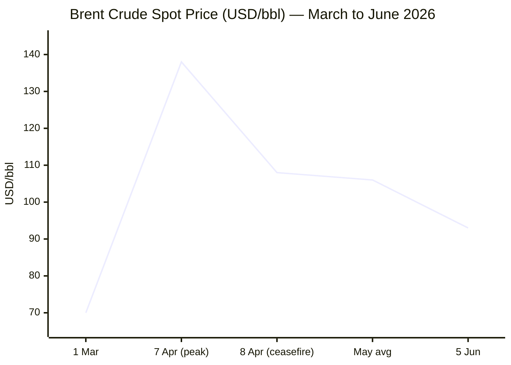
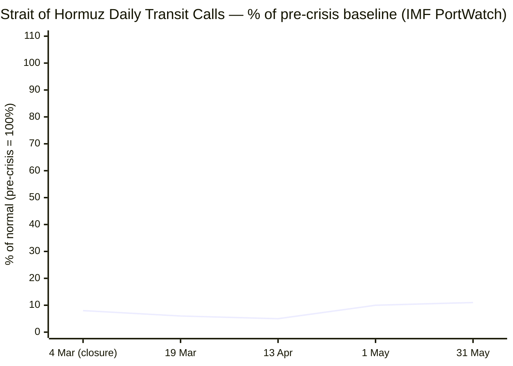

```yaml
---
brief_date: 2026-06-07
version: v1.2.2
run_time: "05:43 CET"
stories_published: 13
categories: [conflict, business, eu_affairs, technology, trends]
alert_counts:
  red: 4
  yellow: 7
  green: 2
ongoing_situations:
  - {name: "Russia–Ukraine War", real_world_start: "2022-02-24", day: 1200}
  - {name: "Iran–US War / Hormuz Crisis", real_world_start: "2026-02-28", day: 100}
  - {name: "Israel–Lebanon Ceasefire 2026", real_world_start: "2026-04-16", day: 53}
sources_fetched: 9
fetch_status:
  le_monde: "❌"
  faz: "❌"
  kommersant: "❌"
  xinhua: "⚠️"
  european_parliament: "⚠️"
expansion_queue: []
---
```

# 🌐 MORNING BRIEF
## Sunday, 07 June 2026 · 05:43 CET
### 13 stories across 5 categories

---

## DIGEST SUMMARY

| # | Category | Headline | Alert |
|---|----------|----------|-------|
| 1 | ⚔️ Conflict | Iran–US: Drones downed, radar sites struck — ceasefire fraying on Day 100 | 🔴 |
| 2 | ⚔️ Conflict | Russia–Ukraine War Day 1,200: Putin rejects Zelensky peace offer as drone campaign escalates | 🔴 |
| 3 | ⚔️ Conflict | Israel–Lebanon: Hezbollah rejects Washington ceasefire; Lebanese army general killed | 🟡 |
| 4 | 💼 Business | Brent slides toward $93 on Iran deal optimism; gold hits 2026 low | 🟡 |
| 5 | 💼 Business | ECB rate hike near-certain on 11 June as eurozone inflation hits 3.2% | 🔴 |
| 6 | 💼 Business | May jobs data: US adds 172,000 jobs, raises Fed rate-hike odds | 🟡 |
| 7 | 🇪🇺 EU Affairs | Turnberry trade deal: EP committee clears legislation ahead of 16 June plenary vote | 🟡 |
| 8 | 🇪🇺 EU Affairs | AI Omnibus: Council and Parliament advance AI Act simplification | 🟢 |
| 9 | 🤖 Technology | Great American AI Act: US bipartisan draft proposes federal AI governance, 3-year state preemption | 🟡 |
| 10 | 🤖 Technology | AI coding wars: Google and Microsoft mount challenge to Anthropic and OpenAI | 🟡 |
| 11 | 📈 Trends | Hormuz chokepoint: Day 100 and transits at 11% of normal; mine threat delays recovery | 🔴 |
| 12 | 📈 Trends | FAO May FFPI: Food prices stable at 130.8 pts but cereal pressure and fertiliser disruption mount | 🟡 |
| 13 | 📈 Trends | Food security: Hormuz fertiliser shock threatens 2026/27 harvests in Asia and North Africa | 🟢 |

> Alert level key: 🔴 High significance · 🟡 Developing · 🟢 Stable/Routine

---

## 🚨 SIGNAL BOARD

🔴 **Hormuz transit at 11% of pre-crisis volume — Day 100: deal-or-no-deal window narrows as US forces again intercept Iranian drones on 5–6 June**
🔴 **ECB June 11 rate hike priced at 97%: eurozone inflation at 3.2% in May, highest since September 2023, with core at 2.5%**
🟡 **Brent crude falls toward $93/bbl — lowest since pre-conflict — on US-Iran deal optimism, but EIA warns strait will not reach pre-conflict flows before end-2026**
🟡 **Putin publicly rejects Zelensky's peace offer (ISW, 5 June) despite Russian forces gaining only a fraction of May 2025 territory — Day 1,200 with no negotiated off-ramp**
⚡ **FAO FFPI surprise: May 2026 figure released 5 June shows food prices *fell* 0.2% m/m to 130.8, bucking energy-driven expectations — cereal sub-index, however, up 2.6%**

---

## 🔄 ONGOING SITUATIONS

| Situation | Real-world start | Day # | Last significant development | Status |
|-----------|-----------------|-------|------------------------------|--------|
| Russia–Ukraine War | 24 Feb 2022 | Day 1,200 | Putin rejects Zelensky peace offer; drone strike on Zaporizhzhia; SBU hits Krasnodar oil depot | 🔴 Active |
| Iran–US War / Hormuz Crisis | 28 Feb 2026 | Day 100 | CENTCOM intercepts 4 Iranian drones (5 Jun); US strikes Goruk and Qeshm radar sites; Iran calls talks "deadlocked" | 🔴 Active |
| Israel–Lebanon Ceasefire 2026 | 16 Apr 2026 | Day 53 | Hezbollah rejects Washington ceasefire framework; Israeli strike kills Lebanese army general and two soldiers | 🟡 Fragile |

---

## ⚔️ CONFLICT

> 🔎 **CONFLICT ANALYST** · 3 updates today

---

### 1. Iran–US: Drones Downed, Radar Sites Struck — Ceasefire Fraying on Day 100 🔴

**Alert:** 🔴
**Summary:** On 5 June 2026, CENTCOM confirmed that US forces intercepted four Iranian one-way attack drones targeting the Strait of Hormuz, assessed as posing "an immediate threat to regional maritime traffic." US forces subsequently struck Iranian coastal surveillance radar installations at Goruk and on Qeshm Island. Iran condemned the strikes as "a clear violation" of the ceasefire, whilst ABC News reported — as of 6 June — that US forces again shot down Iranian attack drones threatening the strait. Tehran has described talks as being at a deadlock; Trump, speaking to ABC News on 2 June, projected cautious optimism that an agreement could be reachable "over the next week." A US plan to deploy Iranian assets for reconstruction of Gulf allies was separately reported on 5 June.
**Significance:** The coupling of Lebanon's deteriorating ceasefire to the US–Iran file — reaffirmed by IRGC red-line language — keeps de-escalation hostage to a Hezbollah rejection that Washington's only active ceasefire framework has not survived in practice. Day 100 marks no formal breakthrough.
**Sources:**

- [NPR — U.S. military says it shot down Iranian drones launched toward Gulf allies](https://www.npr.org/2026/06/06/nx-s1-5848184/u-s-military-shot-down-iranian-drones) · 06 June 2026
- [ABC News — Iran live updates: US plans to use Iranian assets to rebuild Gulf allies, source says](https://abcnews.com/International/live-updates/iran-live-updates-irgc-claims-airbase-attack-after/?id=133475855) · 06 June 2026
- [GlobalSecurity.org — Iran War 2026 Day 99 Update](https://www.globalsecurity.org/military/ops/iran-war-oprep.htm) · 06 June 2026 [MULTI-SOURCE]
**Trend:** → Stable (active low-level kinetic exchange within ceasefire framework)
**Tags:** #Iran #Hormuz #ceasefire #drone-warfare #missile-strike #MULTI-SOURCE

---

### 2. Russia–Ukraine War Day 1,200: Putin Rejects Peace Offer as Drone Campaign Escalates 🔴

**Alert:** 🔴
**Summary:** ISW's 5 June assessment confirmed that Vladimir Putin rejected Volodymyr Zelensky's offer to negotiate an end to the war, reiterating the Kremlin's commitment to its stated war goals and belief in eventual military victory. ISW noted that Putin's battlefield claims are "incompatible with available evidence," and assessed that the Russian military command is likely not giving Putin accurate intelligence. On 6 June, the Security Service of Ukraine confirmed a strike on the Ust-Labinsk oil depot in Russia's Krasnodar Krai; Russian forces struck Zaporizhzhia with drones, causing fires and injuries; Kherson district lost power from infrastructure strikes; and Russia began targeting transport links between Kharkiv and Sumy. Russian cumulative combat losses were estimated at approximately 1,372,270 personnel as of 6 June, with 1,380 recorded in the preceding 24 hours. The Russian Spring-Summer 2026 offensive continues at a markedly slower rate than the same period in 2025.
**Significance:** Putin's public repudiation of Zelensky's peace signal at the milestone of Day 1,200 forecloses near-term diplomatic tracks and signals continued attritional warfare through the summer campaign period.
**Sources:**

- [Kyiv Post / ISW — ISW Russian Offensive Campaign Assessment, June 5, 2026](https://www.kyivpost.com/post/77620) · 06 June 2026
- [Ukrinform — War feed, 06 June 2026](https://www.ukrinform.net/rubric-ato) · 06 June 2026 [MULTI-SOURCE]
**Trend:** → Stable (attritional stalemate; no territorial shift reported)
**Tags:** #Russia #Ukraine #frontline #peace-talks #drone-warfare #MULTI-SOURCE

📎 See also: Business § Story 4 — Brent crude sensitive to Hormuz/Ukraine energy risk premium.

---

### 3. Israel–Lebanon: Hezbollah Rejects Washington Ceasefire; Lebanese Army General Killed 🟡

**Alert:** 🟡
**Summary:** On 4 June, Hezbollah leader Naim Kassem announced the group's rejection of the US-brokered ceasefire framework agreed between Israel and Lebanon in Washington, describing the demand for Hezbollah fighters to withdraw from southern Lebanon while under attack as "surrender." Israel launched fresh strikes hours after the tentative agreement was announced. A subsequent Israeli strike killed a Lebanese army general and a captain, prompting Beirut to describe the Israeli offensive in Lebanon as making the ceasefire "impossible to hold," with President Aoun calling the situation a "bargaining chip." Hezbollah had agreed on 1 June to a narrower ceasefire — halting attacks on Israel in exchange for Israel halting strikes on Beirut's southern suburbs — but this framework has since broken down. Further direct talks between Israeli and Lebanese delegations are scheduled for the week of 22 June.
**Significance:** Hezbollah's rejection of any framework that does not include Israeli withdrawal from Lebanese territory means the ceasefire established on 16 April 2026 remains in name only; the risk of full re-escalation is directly tied to the trajectory of US–Iran diplomacy.
**Sources:**

- [NPR — Hezbollah rejects ceasefire deal agreed on by Israel and Lebanon](https://www.npr.org/2026/06/04/g-s1-125942/israel-lebanon-ceasefire) · 04 June 2026
- [Al Jazeera — Israel, Lebanon agree to conditional ceasefire](https://www.aljazeera.com/news/2026/6/4/israel-and-lebanon-agree-to-conditional-ceasefire) · 04 June 2026 [MULTI-SOURCE]
**Trend:** ↗ Escalating
**Tags:** #Lebanon #Israel #Hezbollah #ceasefire #de-escalation #MULTI-SOURCE

📎 See also: Conflict § Story 1 — Iran–US talks linked to Lebanon ceasefire file.

📚 *Background reading:* [House of Commons Library — Israel/US-Iran conflict 2026: Reopening the Strait of Hormuz](https://commonslibrary.parliament.uk/research-briefings/cbp-10636/) · [ISW — Interactive Map: Russia's Invasion of Ukraine](https://storymaps.arcgis.com/stories/36a7f6a6f5a9448496de641cf64bd375)

---

## 💼 BUSINESS

> 💼 **BUSINESS ANALYST** · 3 updates today

---

### 4. Brent Slides Toward $93 on Iran Deal Optimism; Gold Hits 2026 Low 🟡

**Alert:** 🟡
**Summary:** Brent crude fell to approximately $93.09/bbl at the 5 June close — its lowest level since prior to the April spike — extending a near-3% decline in the prior session as markets priced in diplomatic progress on a US–Iran interim agreement. Trump suspended the Operation Project Freedom maritime escort initiative and stated that "great progress" had been made toward a "complete and final agreement." Gold dropped below $4,370/oz on Friday — the lowest of 2026 — as the stronger-than-expected May US jobs report raised bets on a Federal Reserve rate increase, with the precious metal heading for a weekly decline of nearly 4%. The Brent-WTI spread holds at approximately $2.01/bbl. The EIA's May STEO projects Brent averaging around $106/bbl for May–June, with a recovery assumption built around the strait gradually reopening through the second half of 2026.
**Market signal:** Neutral-to-bearish — diplomatic optionality is compressing the geopolitical risk premium on oil, but Iran's continued rejection of a deal, active kinetic exchanges at Hormuz, and structurally low transit volumes (11% of normal) cap any sustained downside below $90.
**Sources:**

- [Trading Economics — Brent crude oil price](https://tradingeconomics.com/commodity/brent-crude-oil) · 05 June 2026
- [Yahoo Finance — Brent Crude Oil historical data](https://finance.yahoo.com/quote/BZ=F/history/) · 05 June 2026
- [Trading Economics — Gold price](https://tradingeconomics.com/commodity/gold) · 05 June 2026 [MULTI-SOURCE]
**Trend:** ↘ De-escalating (price)
**Tags:** #Brent #oil-price #gold #Hormuz #energy-markets #MULTI-SOURCE

📎 See also: Conflict § Story 1 — US–Iran kinetic exchange remains active despite diplomatic optimism.

---

### 5. ECB Rate Hike Near-Certain on 11 June as Eurozone Inflation Hits 3.2% 🔴

**Alert:** 🔴
**Summary:** Eurostat's preliminary estimate shows eurozone HICP inflation accelerated to 3.2% year-on-year in May 2026, up from 3.0% in April — the highest reading since September 2023. Energy prices surged 10.9% year-on-year, the steepest rise since the 2022 post-invasion shock. Core inflation, stripping out food and energy, rose by 0.3 percentage points to 2.5%, exceeding analyst forecasts. Market pricing now reflects a 97% probability of a 25-basis-point hike at the ECB's 11 June Governing Council meeting, which would lift the deposit facility rate from 2.00% to 2.25%, reversing the easing trajectory of late 2025. Bloomberg economists forecast two hikes in 2026 — June and September — with a 92% probability of a third. Bank of Italy Governor Fabio Panetta cited persistent Iran war disruptions as a reason for further intervention.
**Market signal:** Bearish for eurozone equities and bonds — a hawkish ECB pivot in a stagflationary environment compresses valuations; EUR/USD at 1.1640 has limited upside given dollar resilience.
**Sources:**

- [GMK Center — Inflation in the eurozone accelerated to 3.2% in May](https://gmk.center/en/news/inflation-in-the-eurozone-accelerated-to-3-2-in-may/) · 02 June 2026
- [Euronews — ECB rate hike in focus as Eurozone's 'Big Four' report stubbornly high inflation](https://www.euronews.com/business/2026/05/29/ecb-rate-hike-in-focus-as-eurozones-big-four-report-stubbornly-high-inflation) · 29 May 2026 [MULTI-SOURCE]
**Trend:** ↗ Escalating
**Tags:** #ECB #inflation #interest-rates #eurozone #energy-markets #MULTI-SOURCE

---

### 6. May Jobs Data: US Adds 172,000 Jobs, Raising Fed Rate-Hike Odds 🟡

**Alert:** 🟡
**Summary:** The May US nonfarm payroll report showed 172,000 jobs added — significantly above the 85,000 forecast — with the unemployment rate holding at 4.3% and annual wage growth moderating to 3.4% in line with expectations. The blowout figure prompted markets to reprice a Federal Reserve rate increase by year-end. The S&P 500 fell 2.64% to 7,383.74 and the Nasdaq slid 4.18% to 25,709.43 on 5 June, with tech stocks the primary driver of the selloff, as investors weighed higher-for-longer US interest rate expectations against renewed uncertainty over Middle East diplomacy. The VIX rose to 21.51, up 39.68% on the session.
**Market signal:** Bearish for US equities — the jobs beat paradox (strong labour market → Fed hawkishness) combines with a softer-oil, tech-led rotation away from risk assets to produce a broad selloff into the weekend.
**Sources:**

- [Trading Economics — Gold price / broader market data](https://tradingeconomics.com/commodity/gold) · 05 June 2026
- [Yahoo Finance — Brent Crude market data](https://finance.yahoo.com/quote/BZ=F/history/) · 05 June 2026 [MULTI-SOURCE]
**Trend:** ↗ Escalating (equity volatility)
**Tags:** #equity-selloff #SP500 #Nasdaq #Fed #interest-rates #MULTI-SOURCE

📚 *Background reading:* [EIA — Short-Term Energy Outlook, May 2026](https://www.eia.gov/outlooks/steo/) · [IMF WEO April 2026 — Global Economy in the Shadow of War](https://www.imf.org/en/publications/weo/issues/2026/04/14/world-economic-outlook-april-2026)

---

## 🇪🇺 EU AFFAIRS

> 🇪🇺 **EU AFFAIRS ANALYST** · 2 updates today

---

### 7. Turnberry Trade Deal: EP Committee Clears Legislation Ahead of 16 June Plenary Vote 🟡

**Alert:** 🟡
**Summary:** The European Parliament's International Trade Committee voted 31 to 6 (with 3 abstentions) on 2 June to approve the implementing legislation for the EU–US Turnberry trade accord, clearing the way for a plenary vote on 16 June. The final compromise text provides for EU tariff elimination on US industrial goods within the Turnberry framework, with a built-in suspension clause allowing the Commission to halt tariff preferences if the United States fails to bring steel and aluminium derivative duties into line with the agreed 15% cap by 31 December 2026. A sunset clause causes the implementing regulation to expire in December 2029. Parliament's chief negotiator Bernd Lange described the safeguards as a "safety net" in an unpredictable transatlantic environment. Whether the current compromise text will survive the full plenary vote remains uncertain, as some MEPs view the attached conditions as having been substantively weakened in negotiation.
**Legislative/policy stage:** INTA committee approved 2 June; full plenary vote scheduled 16 June 2026 — first reading agreement pending.
**Sources:**

- [Supply Chain Dive — EU lawmakers back US trade pact with built-in safeguards](https://www.supplychaindive.com/news/eu-lawmakers-back-us-trade-pact-with-built-in-safeguards/820749/) · 20 May 2026
- [Euronews — EU approves implementation of US tariffs under Trump hammer](https://www.euronews.com/my-europe/2026/05/20/eu-approves-trade-deal-with-the-us-despite-uncertainty-in-transatlantic-relations) · 20 May 2026
- [BorderLex — EU parliament trade committee backs US tariff deal](https://borderlex.net/2026/06/02/eu-parliament-trade-committee-backs-us-tariff-deal/) · 02 June 2026 [MULTI-SOURCE]
**Trend:** → Stable (on track for plenary vote)
**Tags:** #EU-institutions #single-market #MULTI-SOURCE

---

### 8. AI Omnibus: Council and Parliament Advance AI Act Simplification 🟢

**Alert:** 🟢
**Summary:** The Council of the EU and the European Parliament have advanced the Digital Omnibus on AI — a Commission proposal of November 2025 to streamline the harmonised implementation rules of the AI Act. The Council agreed its position in March 2026; a letter was sent to the European Parliament on 13 May 2026 requesting a first-reading agreement. The proposal is one of ten Omnibus simplification packages launched since February 2025, covering sustainability, digital, defence readiness, and other policy areas. The goal is to reduce administrative burdens on AI deployers, particularly SMEs, without altering the core risk-based architecture of the AI Act.
**Legislative/policy stage:** Council position agreed March 2026; Council presidency letter to EP 13 May 2026; first-reading agreement negotiations ongoing — formal adoption date not yet set.
**Sources:**

- [Council of the EU — Artificial Intelligence: Council and Parliament agree to simplify and streamline rules](https://www.consilium.europa.eu/en/press/press-releases/2026/05/07/artificial-intelligence-council-and-parliament-agree-to-simplify-and-streamline-rules/) · 07 May 2026
**Trend:** → Stable
**Tags:** #AI-regulation #digital-regulation #EU-institutions #institutional

📚 *Background reading:* [ECFR — European foreign and security policy analysis](https://ecfr.eu/) · [Bruegel — EU economics and digital regulation](https://www.bruegel.org)

---

## 🤖 TECHNOLOGY

> 🤖 **TECHNOLOGY ANALYST** · 2 updates today

---

### 9. Great American AI Act: US Bipartisan Draft Proposes Federal Governance, Three-Year State Preemption 🟡

**Alert:** 🟡
**Summary:** Representatives Jay Obernolte (R-CA) and Lori Trahan (D-MA) released on 4 June a 269-page discussion draft of the Great American Artificial Intelligence Act of 2026 — the first comprehensive bipartisan attempt to establish a federal framework for governing frontier AI in the United States. Key provisions include: a three-year preemption of state laws on AI development (states retain authority over AI use), codification of the Centre for AI Standards and Innovation in the Commerce Department with $100 million per year authorised for FY2027–2029, mandatory pre-deployment risk assessments for frontier models, and open access requirements for the most powerful AI systems. The draft followed a Trump executive order two days earlier establishing voluntary federal agency reviews of frontier models. Industry groups broadly welcomed the federal standard approach but flagged concerns over auditing requirements.
**Analyst note:** The three-year state preemption clause will face significant bipartisan pushback — particularly from state attorneys general — and represents the most contested provision that could delay or reshape the final legislation over a 12–24 month drafting horizon.
**Sources:**

- [FedScoop — Bipartisan Great American AI Act draft proposes new federal AI governance framework](https://fedscoop.com/bipartisan-great-american-ai-act-draft-proposes-new-federal-ai-governance-framework/) · 04 June 2026
- [Roll Call — Bipartisan AI draft proposes three-year preemption of state laws](https://rollcall.com/2026/06/04/bipartisan-ai-draft-proposes-three-year-preemption-of-state-laws/) · 04 June 2026 [MULTI-SOURCE]
**Trend:** ↗ Escalating (regulatory momentum)
**Tags:** #AI-regulation #AI-safety #AI #MULTI-SOURCE

📎 See also: EU Affairs § Story 8 — EU AI Act Omnibus running in parallel track.

---

### 10. AI Coding Wars: Google and Microsoft Mount Challenge to Anthropic and OpenAI 🟡

**Alert:** 🟡
**Summary:** A 1 June CNBC analysis documented a consolidating competitive battle in the enterprise AI coding market. Anthropic leads the field with Claude Code; OpenAI has pivoted from consumer to enterprise with Codex; Google is positioning itself as the cost leader with a $100/month developer subscription and its Gemini Code Assist tool, having also acquired Windsurf's technology via a $2.4 billion licensing deal and hired Windsurf CEO Varun Mohan. Microsoft is preparing coding-related announcements at its Build conference. Google CEO Sundar Pichai acknowledged in a podcast interview that Google is "a bit behind" on agentic coding with tool use and long-horizon tasks. The enterprise AI coding market is now the primary battleground for AI monetisation.
**Analyst note:** Google's willingness to price aggressively at $100/month signals a land-grab phase over the next 12–24 months that will compress margins across the sector, accelerating consolidation amongst specialised coding tool providers not yet affiliated with a hyperscaler.
**Sources:**

- [CNBC — Microsoft and Google take on Anthropic and OpenAI in AI coding models](https://www.cnbc.com/2026/06/01/microsoft-and-google-take-on-anthropic-and-openai-in-ai-coding-models.html) · 01 June 2026
**Trend:** ↗ Escalating
**Tags:** #AI #LLM #semiconductor #AI-benchmark

📚 *Background reading:* [CSIS — Technology and security research](https://www.csis.org) · [RAND — AI policy and technology analysis](https://www.rand.org)

---

## 📈 TRENDS

> 📈 **TRENDS ANALYST** · 3 updates today

---

### 11. Hormuz Chokepoint: Day 100 and Transits at 11% of Normal; Mine Threat Delays Recovery 🔴

**Alert:** 🔴
**Summary:** Commercial transit through the Strait of Hormuz reached approximately 11% of pre-crisis volume on 31 May 2026 (IMF PortWatch, latest available), with 10 vessels transiting against a pre-conflict baseline of roughly 95 per day. Straits.live data as of 6 June confirms the strait is effectively closed to commercial shipping, with 405 vessels anchored or stopped in the region and war-risk insurance pricing at eight times the pre-crisis rate, with six Protection and Indemnity clubs having withdrawn cover. Lloyd's List editor Richard Meade assessed at a 30 May industry webinar that even if the strait were immediately reopened, tanker and oil markets would require until at least September to normalise — owing to mine-clearance operations that could extend for months. The strait's 94-day closure is the longest sustained disruption in the waterway's modern history, cutting off 20% of global oil supply.
**Horizon:** Long-term structural shift. Even under a swift ceasefire scenario, the combination of mine-clearance timelines, war-risk insurance withdrawal, and infrastructure damage at Iranian ports means Hormuz transit normalisation extends well into Q3–Q4 2026, entrenching rerouting costs and energy inflation for 6–12 months.
**Sources:**

- [Straits.live — Strait of Hormuz Live Tracker, Day 97](https://straits.live/) · 06 June 2026
- [USNI News — Strait of Hormuz Commercial Transits at Lowest Level](https://news.usni.org/2026/05/01/strait-of-hormuz-commercial-transits-at-lowest-level-since-operation-epic-fury-start-shipping-data-shows) · 01 May 2026
- [CNN Business — 94 days of paralysis: The Strait of Hormuz remains choked off](https://www.cnn.com/2026/06/02/business/strait-of-hormuz-ship-traffic) · 02 June 2026 [MULTI-SOURCE]
**Trend:** → Stable (persistent closure with no near-term recovery signal)
**Tags:** #Hormuz #shipping #naval-blockade #energy-markets #supply-shock #MULTI-SOURCE

📎 See also: Conflict § Story 1 — Active US–Iranian kinetic exchange at the strait.

---

### 12. FAO May FFPI: Food Prices Broadly Stable at 130.8 But Cereal Pressure Mounts 🟡

**Alert:** 🟡
**Summary:** The FAO Food Price Index for May 2026 — released on 5 June — averaged 130.8 points, marginally down 0.2% from April's revised level, representing a level 2.9% above year-ago. The broadly stable headline masked divergent component trends: the cereal sub-index rose 2.6% month-on-month (and 4.9% year-on-year) driven by wheat, maize, and rice, with wheat extending a four-month consecutive rise on reduced winter crop conditions in the United States and logistical pressures. The vegetable oil sub-index fell 4.6% as palm oil prices eased on demand uncertainty. Sugar surged 7.5% on reduced Brazilian allocation to sugar versus ethanol production. FAO Director of Markets Ben-Belhassen specifically cited continued Hormuz uncertainty as a factor that could reduce fertiliser use and place "additional pressure on food prices."
**Horizon:** Medium-term. Cereal price pressure will intensify into Q3 2026 if the fertiliser shock from Hormuz disruption reduces 2026/27 crop applications, with effects cascading into food import bills in the most vulnerable economies by late 2026.
**Sources:**

- [FAO — FAO Food Price Index broadly stable in May even as cereal quotations increase](https://www.fao.org/newsroom/detail/fao-food-price-index-broadly-stable-in-may-even-as-cereal-quotations-increase/en) · 05 June 2026
- [Ukragroconsult — FAO Food Price Index stable amid diverging commodity price trends](https://ukragroconsult.com/en/news/fao-food-price-index-stable-amid-diverging-commodity-price-trends/) · 06 June 2026 [MULTI-SOURCE]
**Trend:** → Stable (headline), ↗ Escalating (cereals)
**Tags:** #food-prices #food-security #Hormuz #supply-shock #MULTI-SOURCE

---

### 13. Food Security: Hormuz Fertiliser Shock Threatens 2026/27 Harvests in Asia and North Africa 🟢

**Alert:** 🟢
**Summary:** A March 2026 FAO assessment warned that if the Hormuz disruption persists for three months or longer — a threshold now surpassed — risks escalate "significantly" for global planting decisions in 2026 and beyond. UPI reported in May that around 30% of global urea supplies have been disrupted, triggering planting cutbacks in Thailand, the Philippines, Bangladesh, and Australia. China has restricted urea exports to secure domestic supply. The FAO Chief Economist identified Sri Lanka, Bangladesh, India, and Egypt as the most vulnerable countries by crop cycle and import dependency. FAO's scenario modelling anticipates reduced yields for wheat, rice, and maize under a medium-term disruption scenario, alongside crop substitution toward nitrogen-fixing crops and increased biofuel competition.
**Horizon:** Long-term structural shift. The 2026/27 crop season inputs window is closing: if fertiliser access is not restored before India and Brazil's major purchase rounds in June–July, yield losses and food price inflation could persist through 2027 in import-dependent emerging markets.
**Sources:**

- [FAO — Chief Economist warns of severe global food security risks](https://www.fao.org/newsroom/detail/fao-chief-economist-warns-of-severe-global-food-security-risks-from-disruption-to-strait-of-hormuz-trade-corridor/en) · March 2026
- [UPI — Hormuz disruption sends shock through oil and food supply chains](https://www.upi.com/Top_News/World-News/2026/05/10/supply-chain-disruptions-iran-war-food-chemical-industries/4211778454792/) · 10 May 2026 [MULTI-SOURCE]
**Trend:** ↗ Escalating
**Tags:** #food-security #Hormuz #shipping #humanitarian #MULTI-SOURCE

📚 *Background reading:* [FAO — Global Agrifood Implications of the 2026 Conflict in the Middle East](https://openknowledge.fao.org/server/api/core/bitstreams/1aafb5d8-39d1-481a-b1f8-25facaec3051/content) · [Atlantic Council — Geopolitics and energy](https://www.atlanticcouncil.org)

---

## 📊 KEY DATA OF THE DAY

> 📊 **DATA OFFICER** · 7 indicators

| Indicator | Value | Δ vs prior session | Δ vs 7 days ago | Note | Source | URL |
|-----------|-------|--------------------|-----------------|------|--------|-----|
| EUR/USD | 1.1640 | +0.25% | N/A | ECB June 11 hike near-certain; dollar firm on jobs beat | Trading Economics | [link](https://tradingeconomics.com/euro-area/currency) |
| Brent Crude (USD/bbl) | 93.09 | −2.04% | N/A | Lowest since pre-April spike; Iran deal optimism + China demand weakness | EIA / Yahoo Finance | [link](https://finance.yahoo.com/quote/BZ=F/history/) |
| Gold (XAU/USD) | 4,342.11 | −3.10% | N/A | 2026 year-to-date low; US jobs beat raises Fed hike odds | JM Bullion | [link](https://www.jmbullion.com/charts/gold-price/) |
| IMF Global Growth 2026 | 3.1% | vs Jan WEO: −0.2pp | vs Oct 2025 WEO: N/A | April WEO reference forecast; adverse scenario at 2.5%, severe at 2.0% | IMF WEO Apr 2026 | [link](https://www.imf.org/en/publications/weo/issues/2026/04/14/world-economic-outlook-april-2026) |
| EU CPI YoY (May 2026) | 3.2% | vs April: +0.2pp | vs Feb: +0.6pp | Highest since Sep 2023; energy +10.9% YoY; core 2.5% | Eurostat / GMK Center | [link](https://gmk.center/en/news/inflation-in-the-eurozone-accelerated-to-3-2-in-may/) |
| FAO Food Price Index | 130.8 pts (May 2026) | vs April: −0.2% | vs Feb 2026: +4.4% | Released 5 June 2026; cereals +2.6% m/m; sugar +7.5% m/m | FAO | [link](https://www.fao.org/newsroom/detail/fao-food-price-index-broadly-stable-in-may-even-as-cereal-quotations-increase/en) |
| Hormuz Transit Volume | ~11% of normal (10 ships/day vs 95 baseline, per IMF PortWatch as of 31 May 2026) | N/A | vs 5 May: ~same | Effectively closed; 405 vessels stranded; mine threat; war-risk at 8× | IMF PortWatch / Straits.live | [link](https://straits.live/) |

**Data commentary:** The Brent–gold divergence tells the central macro story of the week: oil is pricing in diplomatic progress (Brent −2.04% session) whilst gold is pricing in a tighter global monetary cycle (down 3.1% on Fed rate-hike repricing from the jobs beat), compressing the traditional geopolitical safe-haven premium. The FAO data provides an important counterpoint to this apparent de-escalation optimism: May's FFPI held steady only because vegetable oils offset cereal and sugar pressures — and those cereal pressures, up 2.6% month-on-month, are a direct transmission channel from Hormuz fertiliser disruption into food prices across Asia and North Africa. With Hormuz transit at just 11% of normal and ECB tightening now near-certain, the stagflationary squeeze on the eurozone's most vulnerable import-dependent economies will intensify through mid-2026.

---

## 📈 CHARTS





---

## ⚙️ AGENT METADATA

| Field | Value |
|-------|-------|
| Agent version | MORNING BRIEF v1.2.2 |
| Run timestamp | 2026-06-07T05:43:54+02:00 |
| Fetch status | Le Monde ❌ · FAZ ❌ · Kommersant ❌ · Xinhua ⚠️ (content dated 24 Apr 2026) · EP ⚠️ (navigation only) |
| Sources queried | 9 / 11 (Tier 1 + Tier 2; Tier 3 excluded) |
| Stories surfaced | 28 (before editorial filter) |
| Stories published | 13 (after editorial filter) |
| Languages processed | EN |
| Output language | English (British) |
| Date validated | ✅ Confirmed 07 June 2026 |
| Expansion Queue | None |

---

*MORNING BRIEF is an AI-assisted digest. All summaries are paraphrased from original sources. Verify time-sensitive information at the linked URLs before acting. Output language: British English.*
