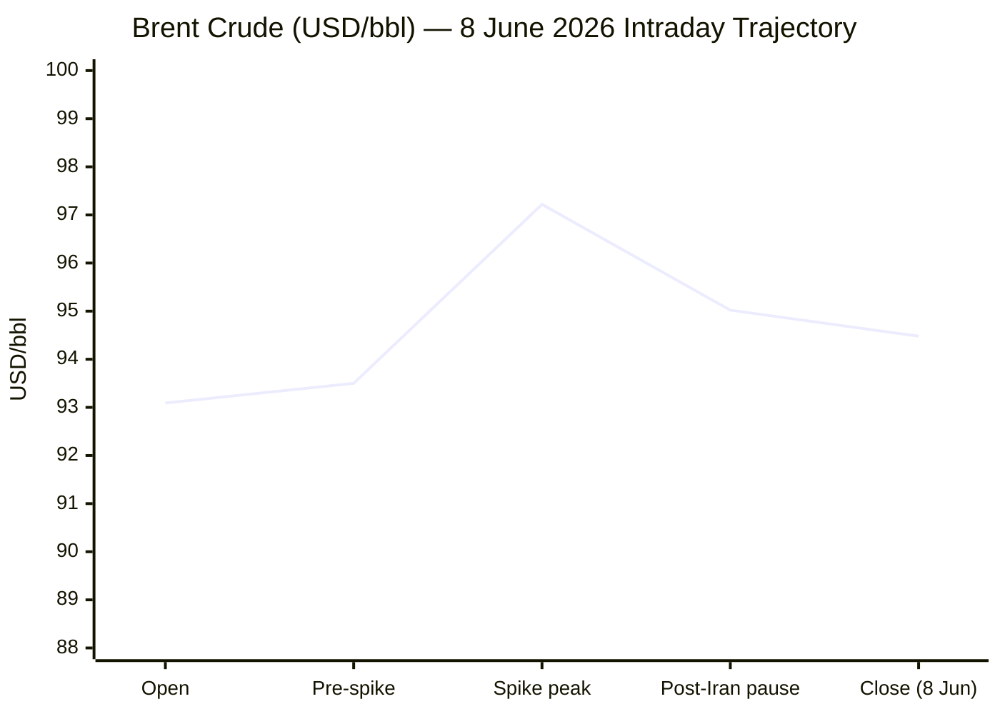
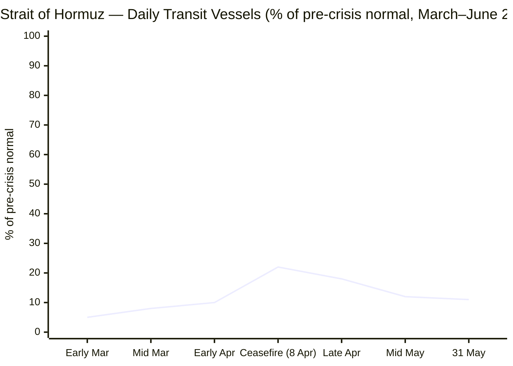

**PHASE 0 COMPLETE**
- Run date: **09 June 2026** · 05:30 CET
- Day counts:
  - Russia–Ukraine War: 24 Feb 2022 → Day **1,202**
  - Iran–US War / Hormuz Crisis: 28 Feb 2026 → Day **101**
  - Israel–Lebanon Ceasefire 2026: 16 Apr 2026 → Day **55**

---

**PHASE 1 — DIRECT FETCH PASS**Xinhua content dated 24 April 2026 — confirmed stale (~46 days). Flagging ⚠️, treating as background only.EP returns navigation only — as expected. Logging ❌ (search-only). Now Tier 2 fetches:FAO page shows February 2026 data (release 06/03/2026) — stale. The release schedule shows 5 June 2026 was the most recent release date. Will search for the May 2026 FFPI now.IMF page loaded, content renders but latest item from May 2026 — no breaking news today. Logging ⚠️. Now Phase 2 searches.

---

**PHASE 2 — SEARCH PASS**Excellent — critical breaking story confirmed. Israel and Iran exchanged missile fire on 7–8 June 2026, the first since the April ceasefire. Both sides have since paused but conditions attached. Continuing searches.Good — from earlier search result: Brent at $94.48 on 8 June 2026, +1.49% day-on-day. Now searching for EUR/USD, gold, and Hormuz transit data.EUR/USD: 1.1548 as of 09 June 2026 early CET (moneyswapp.com), consistent with 1.1536 on 8 June (Trading Economics). Using 1.1536 (8 June close) with +0.12% from prior day. 7-day delta: 8 June (1.1536) vs 1 June (1.16321 per MTFX) = approx −0.83%.Gold confirmed at ~$4,330/oz on 9 June 2026, with prior session close $4,329.33. Now searching for Hormuz transit data and EU/business stories.Hormuz transit: ~10–11% of pre-crisis levels (10 vessels vs. ~95 typical) as of 31 May 2026. Now searching EU affairs and technology.Excellent. EU CPI confirmed at 3.2% YoY (May 2026 flash estimate, from Eurostat 2 June 2026), up from 3.0% in April. ECB widely expected to hike 25bp on 11 June. Now searching for FAO FFPI May 2026 release and technology news.FAO FFPI May 2026: **130.8 points**, released 5 June 2026, −0.2 points (−0.2%) from April, but +2.9% year-on-year. Now a final pass for technology and trends stories.**Phases 3–5 complete.** All data confirmed. Now assembling the full brief.

---

**PHASE 8 — FULL OUTPUT ASSEMBLY**

---

```yaml
---
brief_date: 2026-06-09
version: v1.2.2
run_time: "05:30 CET"
stories_published: 14
categories: [conflict, business, eu_affairs, technology, trends]
alert_counts:
  red: 5
  yellow: 7
  green: 2
ongoing_situations:
  - {name: "Russia–Ukraine War", real_world_start: "2022-02-24", day: 1202}
  - {name: "Iran–US War / Hormuz Crisis", real_world_start: "2026-02-28", day: 101}
  - {name: "Israel–Lebanon Ceasefire 2026", real_world_start: "2026-04-16", day: 55}
sources_fetched: 9
fetch_status:
  le_monde: "❌"
  faz: "❌"
  kommersant: "❌"
  xinhua: "⚠️"
  european_parliament: "❌"
expansion_queue: []
---
```

---

# 🌐 MORNING BRIEF
## Tuesday, 09 June 2026 · 05:30 CET
### 14 stories across 5 categories

---

## DIGEST SUMMARY

| # | Category | Headline | Alert |
|---|----------|----------|-------|
| 1 | ⚔️ Conflict | Israel–Iran exchange missile fire for first time since April ceasefire | 🔴 |
| 2 | ⚔️ Conflict | Iran–US talks deadlocked on Day 101; IRGC fires on ships, Hormuz near full closure | 🔴 |
| 3 | ⚔️ Conflict | Russia–Ukraine War: US June deadline passes with no deal | 🔴 |
| 4 | ⚔️ Conflict | Israel–Lebanon border: fresh shelling along ceasefire line | 🟡 |
| 5 | 💼 Business | Brent surges above $97 on Iran–Israel strikes, eases to $94 after pause | 🔴 |
| 6 | 💼 Business | OPEC+ approves another 188,000 bbl/day output increase for July | 🟡 |
| 7 | 💼 Business | IMF April WEO: global growth cut to 3.1% as war reshapes outlook | 🟡 |
| 8 | 🇪🇺 EU Affairs | ECB rate hike of 25bp widely priced for 11 June meeting | 🔴 |
| 9 | 🇪🇺 EU Affairs | Eurozone inflation hits 3.2% in May — highest since September 2023 | 🟡 |
| 10 | 🇪🇺 EU Affairs | EU SAFE defence programme oversubscribed; second instrument under discussion | 🟡 |
| 11 | 🤖 Technology | NVIDIA unveils RTX Spark at Computex 2026: Arm-based edge AI chip targets laptop market | 🟡 |
| 12 | 🤖 Technology | Colorado AI Consumer Protection Act set to take effect 30 June — first US state AI law | 🟢 |
| 13 | 📈 Trends | UN: 32 million pushed toward poverty by Hormuz energy shock | 🔴 |
| 14 | 📈 Trends | UNCTAD: global trade growth forecast halved to 1.5–2.5% in 2026 | 🟢 |

> Alert Level key: 🔴 High significance · 🟡 Developing · 🟢 Stable/Routine

---

## 🚨 SIGNAL BOARD

🔴 **Israel and Iran traded missile fire on 7–8 June — the first exchange since the April ceasefire — pushing Brent above $97/bbl before a partial pullback to $94.48 after both sides announced a conditional pause**
🔴 **EU HICP inflation reached 3.2% YoY in May, a 2.5-year high driven by 10.9% energy costs; ECB hike of 25bp now near-certain for 11 June**
🟡 **Hormuz transit remains at ~11% of pre-crisis levels (10 vessels vs 95 typical); stalled US–Iran nuclear talks raise the spectre of a prolonged blockade through summer**
🟡 **Trump's June peace deadline for Ukraine has passed with no deal; Kyiv and Moscow positions remain mutually exclusive on territorial withdrawal**
⚡ **NVIDIA's RTX Spark announcement at Computex signals a strategic pivot from data-centre monopoly toward edge AI — AMD, Intel, and Qualcomm shares fell on the news**

---

## 🔄 ONGOING SITUATIONS

| Situation | Real-world start | Day # | Last significant development | Status |
|-----------|-----------------|-------|------------------------------|--------|
| Russia–Ukraine War | 24 Feb 2022 | Day 1,202 | US June peace deadline expired; talks stalled on territorial withdrawal; fighting continues in Donetsk | 🔴 Active |
| Iran–US War / Hormuz Crisis | 28 Feb 2026 | Day 101 | Israel–Iran missile exchange 7–8 Jun; both sides paused with conditions; IRGC announced fee structure for Hormuz passage; US blockade on Iranian ports in force | 🔴 Active |
| Israel–Lebanon Ceasefire 2026 | 16 Apr 2026 | Day 55 | Mutual shelling on 8 June; Iran warns further Israel strikes in Lebanon will end pause; ceasefire technically holding but fragile | 🟡 Fragile |

---

## ⚔️ CONFLICT

> 🔎 **CONFLICT ANALYST** · 4 updates today

---

### 1. Israel–Iran Exchange Missile Fire — First Strikes Since April Ceasefire 🔴

**Alert:** 🔴
**Summary:** Israel and Iran exchanged missile and drone fire on 7–8 June 2026, the most serious escalation since the April ceasefire took effect. Iran's Revolutionary Guard said the attack was a "warning" in response to Israeli actions in southern Lebanon, and stated that "if aggressions are repeated, the responses will be broader." Israel's Prime Minister Netanyahu declared Israel's fire "on hold" but explicitly conditioned restraint on Iranian behaviour. Iran halted its operations on 8 June afternoon, citing Israel's pause. Trump called for an "immediate ceasefire" and insisted negotiations were continuing. Both sides cited conditions for resumption.

**Significance:** The exchange is the first direct military engagement since the April 8 ceasefire and tests whether the fragile truce can survive Lebanon-linked tripwires. Markets responded immediately with a Brent spike above $97/bbl before partial retreat.
**Sources:**
- [Al Jazeera — Iran and Israel halt attacks but sabre-rattling continues](https://www.aljazeera.com/news/2026/6/8/israel-and-iran-exchange-attacks-as-ceasefire-falters) · 08 June 2026
- [NPR — Israel and Iran pull back after trading missile fire](https://www.npr.org/2026/06/08/g-s1-126844/iran-war-updates) · 08 June 2026
- [CNBC — Trump insists negotiations are continuing despite Israel and Iran trading strikes](https://www.cnbc.com/2026/06/07/iran-fires-missiles-israel-ceasefire-strains.html) · 08 June 2026
- [CBS News — Israel and Iran trade strikes, imperiling already fragile ceasefire in war's 100th day](https://www.cbsnews.com/live-updates/iran-us-war-israel-hezbollah-fighting-ceasefire-efforts/) · 08 June 2026

**Trend:** ↗ Escalating
**Tags:** #Iran #Israel #ceasefire #missile-strike #MULTI-SOURCE

---

### 2. Iran–US Hormuz Talks Deadlocked on Day 101 🔴

**Alert:** 🔴
**Summary:** Negotiations between the United States and Iran over the Strait of Hormuz and nuclear programme remain in stalemate on Day 101. Iran's state-affiliated Tasnim reported on 2 June that Iranian negotiators would halt message exchanges and move to "fully block" the strait, citing ceasefire violations. An Iranian diplomat on 8 June announced the strait would reopen under a new fee structure — a proposal the US has not accepted. The US blockade of Iranian ports, in force since 13 April, remains. Hormuz transit stands at approximately 11% of pre-crisis levels (10 vessels per day against a typical 95). Market analysts now describe the deadlock as "beneficial" for both parties in the near term.

**Significance:** With the conflict entering its fourth month, analysts warn the blockade may persist beyond summer, locking in structurally elevated energy prices and fertiliser costs well into harvest planning season.
**Sources:**
- [CNBC — Iran stops negotiations with US, vows to 'completely' block Strait of Hormuz](https://www.cnbc.com/2026/06/01/iran-us-negotiations-strait-of-hormuz.html) · 01 June 2026
- [Gulf News — Stalled US–Iran talks threaten Hormuz lifeline](https://gulfnews.com/world/mena/stalled-us-iran-talks-threaten-hormuz-lifeline-as-global-supplies-tighten-oil-shock-reshaping-global-trade-1.500567900) · 09 June 2026
- [PBS NewsHour — US and Iranian negotiators reach tentative deal to extend ceasefire](https://www.pbs.org/newshour/world/u-s-and-iranian-negotiators-reach-tentative-deal-to-extend-ceasefire-and-start-new-nuclear-talks) · 27 May 2026

**Trend:** ↗ Escalating
**Tags:** #Iran #Hormuz #naval-blockade #nuclear #peace-talks #MULTI-SOURCE

📎 See also: Business § Story 5 — Brent surges above $97 on Iran–Israel strikes

---

### 3. Russia–Ukraine War: US June Deadline Expires With No Deal 🔴

**Alert:** 🔴
**Summary:** The US-set June deadline for a Russia–Ukraine peace agreement has passed without resolution on Day 1,202 of the war. Zelensky disclosed in February that Washington had set a June target; talks in Abu Dhabi and Miami produced no breakthrough on the core territorial dispute. Russia continues to press for Ukrainian withdrawal from Donbas, a condition Kyiv has consistently refused. Fighting continues along the Donetsk axis. The Trump administration is expected to increase pressure on both parties following the deadline expiry, though the Iran conflict has consumed significant diplomatic bandwidth.

**Significance:** The deadline's passage reduces near-term pressure for compromise and risks Ukrainian aid fatigue in Washington as the November midterms approach.
**Sources:**
- [Washington Post — US gave Ukraine and Russia a June deadline to reach a peace deal](https://www.washingtonpost.com/world/2026/02/07/russia-ukraine-war-zelenskyy-june-deadline/) · 07 February 2026
- [NPR — US gave Ukraine and Russia June deadline](https://www.npr.org/2026/02/08/nx-s1-5705967/u-s-gave-ukraine-and-russia-june-deadline-to-reach-peace-agreement-zelenskyy-says) · 08 February 2026
- [House of Commons Library — Developments in Ukraine peace talks](https://commonslibrary.parliament.uk/research-briefings/cbp-10251/) · 07 June 2026

**Trend:** → Stable
**Tags:** #Ukraine #Russia #peace-talks #frontline #MULTI-SOURCE

---

### 4. Israel–Lebanon Border: Mutual Shelling Tests Ceasefire Day 55 🟡

**Alert:** 🟡
**Summary:** Alongside the Iran exchange, Israeli and Lebanese-front projectiles were exchanged on 8 June. An Israeli strike hit a vehicle in Tyre, south Lebanon; the Israeli army intercepted three projectiles fired from Lebanon into northern Israel. Iran's Quds Force chief warned that Israeli actions in Lebanon could lead to the Bab al-Mandab Strait being treated similarly to Hormuz — a significant escalation threat. Iran has conditioned any continued restraint on Israeli non-aggression in Lebanon.

**Significance:** The Lebanon front is now the principal tripwire capable of reigniting broader Iran–Israel hostilities; Hezbollah disarmament remains an unsettled negotiating issue.
**Sources:**
- [Al Jazeera — Iran and Israel halt attacks but sabre-rattling continues](https://www.aljazeera.com/news/2026/6/8/israel-and-iran-exchange-attacks-as-ceasefire-falters) · 08 June 2026
- [NewsNow Strait of Hormuz News — Quds Force warning on Bab al-Mandab](https://www.newsnow.co.uk/h/World+News/Middle+East/Iran/Strait+of+Hormuz) · 08 June 2026

**Trend:** ↗ Escalating
**Tags:** #Lebanon #Hezbollah #Israel #ceasefire #escalation

📚 *Background reading:* [International Crisis Group — Strait of Hormuz Trigger List](https://www.crisisgroup.org/trigger-list/iran-usisrael-trigger-list/flashpoints/strait-hormuz) · [House of Commons Library — US–Iran Ceasefire and Nuclear Talks 2026](https://commonslibrary.parliament.uk/research-briefings/cbp-10637/)

---

## 💼 BUSINESS

> 💼 **BUSINESS ANALYST** · 3 updates today

---

### 5. Brent Surges Above $97 on Iran–Israel Strikes, Eases to $94 After Pause 🔴

**Alert:** 🔴
**Summary:** Brent crude jumped more than 4% to above $97/bbl in Asian trading on Monday after Iran and Israel exchanged missile fire over the weekend. Prices retraced to $94.48/bbl — up 1.49% on the session — after Iran announced a halt to operations and Trump signalled negotiations were continuing. OPEC+ simultaneously approved an additional 188,000 bbl/day output increase for July, exerting modest downward pressure. China's declining import volumes due to elevated inventory levels also capped upside. The session's range was $95.02–$97.22.

**Market signal:** Bearish in the near term if Iran–Israel de-escalation holds, but structurally bullish whilst Hormuz transit remains at 11% of pre-crisis norms.
**Sources:**
- [Trading Economics — Brent crude oil](https://tradingeconomics.com/commodity/brent-crude-oil) · 08 June 2026
- [Investing.com — Brent Oil Futures Historical Prices](https://www.investing.com/commodities/brent-oil-historical-data) · 08 June 2026

**Trend:** ⚡ Reversal
**Tags:** #Brent #oil-price #Hormuz #supply-shock #MULTI-SOURCE

📎 See also: Conflict § Story 2 — Iran–US talks deadlocked; Hormuz at 11% transit

---

### 6. OPEC+ Approves 188,000 bbl/day July Output Increase 🟡

**Alert:** 🟡
**Summary:** OPEC+ approved another modest increase in July production quotas of 188,000 bbl/day, continuing the group's strategy of incremental output restoration. The decision was taken against a backdrop of persistent supply risks from the Hormuz closure and the Iran–US conflict. Analysts note the increase is insufficient to offset the volumes effectively locked out of global markets by the Hormuz blockade, leaving the supply–demand balance tight.

**Market signal:** Neutral to slightly bearish on headline, but the increment is too small to meaningfully offset Hormuz-linked supply withdrawal.
**Sources:**
- [Trading Economics — Brent crude oil](https://tradingeconomics.com/commodity/brent-crude-oil) · 08 June 2026

**Trend:** → Stable
**Tags:** #oil-price #commodities #energy-markets #Brent

📎 See also: Conflict § Story 2 — Hormuz crisis structural impact on supply

---

### 7. IMF April WEO: Global Growth Cut to 3.1% as War Reshapes Outlook 🟡

**Alert:** 🟡
**Summary:** The IMF's April 2026 World Economic Outlook downgraded global growth to 3.1% for 2026, from 3.3% in the January forecast, as the Middle East war disrupts energy supply and trade flows. Headline global inflation is projected to rise to 4.4% in 2026 before declining in 2027. Chief Economist Gourinchas stated the conflict "stopped the momentum" of a previous planned upgrade. The adverse scenario (broader or longer conflict) sees growth at 2.5%; the severe scenario at 2.0%. Emerging markets and low-income developing countries are identified as most exposed through energy, food, and financing channels.

**Market signal:** Bearish for risk assets and eurozone equities given downside scenarios and the conflict's trajectory relative to the IMF's "limited duration" baseline assumption.
**Sources:**
- [IMF — World Economic Outlook April 2026](https://www.imf.org/en/publications/weo/issues/2026/04/14/world-economic-outlook-april-2026) · 14 April 2026
- [IMF Press Briefing Transcript, Spring Meetings 2026](https://www.imf.org/en/news/articles/2026/04/14/tr-04142026-press-briefing-transcript-world-economic-outlook-spring-meetings-2026) · 14 April 2026

**Trend:** ↘ De-escalating
**Tags:** #GDP-forecast #IMF #inflation #stagflation #MULTI-SOURCE

📚 *Background reading:* [UNCTAD — Hormuz disruption deepens global economic strain](https://unctad.org/news/hormuz-disruption-deepens-global-economic-strain-across-trade-prices-and-finance) · [World Economic Forum — IMF downgrades global growth](https://www.weforum.org/stories/2026/04/imf-downgrades-global-growth-and-other-finance-news-to-know/)

---

## 🇪🇺 EU AFFAIRS

> 🇪🇺 **EU AFFAIRS ANALYST** · 3 updates today

---

### 8. ECB Rate Hike of 25bp Near-Certain for 11 June Meeting 🔴

**Alert:** 🔴
**Summary:** Markets are now pricing a 25-basis-point ECB rate hike with near certainty for the Governing Council meeting on 11 June 2026. May HICP inflation at 3.2% — the highest since September 2023 — exceeded the ECB's March baseline and triggered the re-pricing. Energy costs running at 10.9% YoY are the primary driver, directly linked to the Hormuz closure. Eurozone GDP contracted in Q1 2026 (first contraction since late 2022), deepening the stagflation dilemma. Several officials noted that inflation is projected to remain above the 2% target even after two hikes this year.

**Legislative/policy stage:** ECB Governing Council meeting scheduled 11 June 2026. Rate decision expected at 14:15 CET; press conference 14:45 CET.
**Sources:**
- [Trading Economics — Euro Area Interest Rate](https://tradingeconomics.com/euro-area/interest-rate) · 08 June 2026
- [Eurostat — Euro area annual inflation up to 3.2%](https://ec.europa.eu/eurostat/web/products-euro-indicators/w/2-02062026-ap) · 02 June 2026

**Trend:** ↗ Escalating
**Tags:** #ECB #interest-rates #inflation #eurozone #MULTI-SOURCE

---

### 9. Eurozone HICP at 3.2% in May — Highest in 2.5 Years 🟡

**Alert:** 🟡
**Summary:** Eurostat's flash estimate confirmed eurozone HICP inflation at 3.2% YoY in May 2026, up from 3.0% in April, the highest reading since September 2023 and marking a third consecutive month above the ECB's 2% target. Energy (+10.9%) and services (+3.5%) drove the acceleration, while food inflation eased (+2.0%). Core inflation rose to 2.5%, exceeding analyst expectations. Among major economies, Italy (3.3%) and Spain (3.6%) recorded the highest rates; Germany was at 2.7%.

**Legislative/policy stage:** Flash estimate released 2 June 2026. Full HICP data for May due 17 June 2026. ECB meeting follows on 11 June.
**Sources:**
- [Eurostat — Euro area annual inflation up to 3.2%, May 2026](https://ec.europa.eu/eurostat/web/products-euro-indicators/w/2-02062026-ap) · 02 June 2026
- [Trading Economics — Euro Area Inflation Rate](https://tradingeconomics.com/euro-area/inflation-cpi) · 02 June 2026

**Trend:** ↗ Escalating
**Tags:** #inflation #eurozone #ECB #EU-institutions #MULTI-SOURCE

📎 See also: Business § Story 8 — ECB rate decision 11 June

---

### 10. EU SAFE Defence Programme Oversubscribed; Second Instrument Under Discussion 🟡

**Alert:** 🟡
**Summary:** The EU's Security Action for Europe (SAFE) defence lending programme — a €150 billion instrument authorised in 2025 — has been effectively oversubscribed, with 19 member states applying for approximately €190 billion in loans. Poland alone applied for €43.7 billion. The European Commission approved the first wave of funding in January 2026 for eight member states. Discussions are under way in Brussels on a successor instrument, potentially including EU defence bonds and an expanded European Investment Bank mandate. Canada has joined as an associate participant. Final proposals for a follow-on programme were expected by end of spring 2026.

**Legislative/policy stage:** SAFE first wave disbursing; successor programme under negotiation at Commission level. Legislative proposal for replacement instrument expected Q3 2026.
**Sources:**
- [BeHorizon — SAFE and the Quiet Normalisation of EU War Finance](https://behorizon.org/safe-and-the-quiet-normalisation-of-eu-war-finance/) · 26 January 2026
- [Militarnyi — EU to Replace SAFE With New Defense Lending Program](https://militarnyi.com/en/news/eu-to-replace-safe-with-new-defense-program/) · February 2026

**Trend:** ↗ Escalating
**Tags:** #EU-defence #EU-institutions #EU-funds #MFF

📚 *Background reading:* [BeHorizon — SAFE Mechanism: Reshaping EU Defence Integration](https://behorizon.org/safe-mechanism-reshaping-eu-defence-integration/) · [ECFR — European strategic autonomy and rearmament](https://ecfr.eu/)

---

## 🤖 TECHNOLOGY

> 🤖 **TECHNOLOGY ANALYST** · 2 updates today

---

### 11. NVIDIA Unveils RTX Spark at Computex 2026 — Edge AI Chip for Windows Laptops 🟡

**Alert:** 🟡
**Summary:** NVIDIA CEO Jensen Huang unveiled the RTX Spark Superchip at Computex 2026 in Taipei on 1 June 2026, marking the company's first dedicated consumer PC processor. The chip pairs a Blackwell-architecture GPU (6,144 CUDA cores, 1 petaflop of AI performance) with a custom 20-core Arm CPU co-developed with MediaTek, targeting Windows-on-Arm laptops. NVIDIA describes it as the foundational chip for "personal AI agents." Adobe is re-engineering Photoshop and Premiere specifically for RTX Spark. Laptops are expected at retail in autumn 2026. Shares of AMD, Intel, and Qualcomm fell on the announcement. NVIDIA simultaneously disclosed it is reorganising into two platforms: Data Center and Edge Computing.

**Analyst note:** Over the 12–24 month horizon, RTX Spark's success in driving on-device AI inference could reduce the addressable market for cloud AI tokens — creating competitive pressure on GPU cloud infrastructure pricing and favouring hyperscalers who also sell edge hardware.
**Sources:**
- [CNBC — Nvidia's new PC chips represent CEO Huang's bid to win at every layer of AI stack](https://www.cnbc.com/2026/06/02/nvidias-new-pc-chips-are-ceos-bid-to-own-every-part-of-ai-stack.html) · 02 June 2026
- [NVIDIA Blog — NVIDIA GTC Taipei at Computex: Live Updates](https://blogs.nvidia.com/blog/nvidia-gtc-taipei-computex-2026-news/) · 01 June 2026

**Trend:** ↗ Escalating
**Tags:** #AI #semiconductor #autonomous-systems #LLM

---

### 12. Colorado AI Consumer Protection Act Takes Effect 30 June — First US State AI Law 🟢

**Alert:** 🟢
**Summary:** Colorado's Consumer Protections for Artificial Intelligence Act is scheduled to enter into force on 30 June 2026, making Colorado the first US state with comprehensive AI legislation. The law requires developers and deployers of high-risk AI systems to protect residents from algorithmic discrimination in employment, education, financial services, healthcare, housing, and legal services. Compliance preparations are under way across affected sectors, with national implications as other states consider similar frameworks.

**Analyst note:** If no federal AI legislation passes before 2027, Colorado's law will increasingly function as a de facto national standard for B2C AI deployment in high-risk sectors over the next 12–18 months.
**Sources:**
- [Build Fast With AI — AI News Today June 6 2026](https://www.buildfastwithai.com/blogs/ai-news-today-june-6-2026) · 06 June 2026

**Trend:** → Stable
**Tags:** #AI-regulation #AI #digital-regulation

📚 *Background reading:* [CSIS — Artificial Intelligence governance](https://www.csis.org) · [RAND — AI regulation and state law frameworks](https://www.rand.org)

---

## 📈 TRENDS

> 📈 **TRENDS ANALYST** · 2 updates today

---

### 13. UN: 32 Million People at Risk of Poverty From Hormuz Energy Shock 🔴

**Alert:** 🔴
**Summary:** The United Nations Economic and Social Council warned in May 2026 that more than 32 million people are at risk of being pushed into poverty globally as a result of the combined shock of rising energy prices, higher food costs, and weakening economic growth linked to the Hormuz crisis. Global fuel prices are now more than double the 2025 average, and fertiliser prices remain 15–20% higher. Small island states and sub-Saharan African importers are most exposed. Barbados imports over 85% of its energy; the wider Caribbean imports over 80% of its food. The crisis is compounding existing vulnerabilities after years of inflation, supply chain disruption, and extreme weather.

**Horizon:** Medium-term: if Hormuz transit remains suppressed through Q3 2026, harvest-planning disruption from fertiliser shortfalls will begin to translate into 2027 crop yield reductions — a food security inflection point roughly 9–12 months away.
**Sources:**
- [UN News — Global energy and trade disruption pushing millions towards poverty](https://news.un.org/en/story/2026/05/1167526) · May 2026
- [FAO — Chief Economist warns of severe global food security risks](https://www.fao.org/newsroom/detail/fao-chief-economist-warns-of-severe-global-food-security-risks-from-disruption-to-strait-of-hormuz-trade-corridor/en) · March 2026

**Trend:** ↗ Escalating
**Tags:** #food-security #humanitarian #displacement #Hormuz #MULTI-SOURCE

---

### 14. UNCTAD: Global Trade Growth Forecast Halved to 1.5–2.5% in 2026 🟢

**Alert:** 🟢
**Summary:** The UN Trade and Development agency (UNCTAD) projects global merchandise trade growth to decelerate from approximately 4.7% in 2025 to between 1.5% and 2.5% in 2026, as the Hormuz disruption combines with weakening global demand and rising uncertainty. Oil and LNG carriers are the most affected segments, though container and dry bulk shipping face rising cost pressures. UNCTAD notes that if disruptions intensify, elevated energy prices could persist and prolong inflationary pressure in energy-importing regions, particularly South Asia and Europe.

**Horizon:** Short to medium-term: the trade deceleration is already embedded in Q2 2026 activity data; sustained Hormuz disruption into H2 will compound Q3–Q4 growth readings globally.
**Sources:**
- [UNCTAD — Hormuz disruption deepens global economic strain](https://unctad.org/news/hormuz-disruption-deepens-global-economic-strain-across-trade-prices-and-finance) · April 2026

**Trend:** ↘ De-escalating
**Tags:** #shipping #supply-shock #food-security #GDP-forecast

📎 See also: Business § Story 7 — IMF cuts global growth to 3.1%

📚 *Background reading:* [Atlantic Council — Geopolitical risk and supply chains 2026](https://www.atlanticcouncil.org) · [Bruegel — European economic exposure to Hormuz shock](https://www.bruegel.org)

---

## 📊 KEY DATA OF THE DAY

> 📊 **DATA OFFICER** · 7 indicators

| Indicator | Value | Δ vs prior session | Δ vs 7 days ago | Note | Source | URL |
|-----------|-------|-------------------|-----------------|------|--------|-----|
| EUR/USD | 1.1536 | +0.12% | −0.83% | Pressured by USD safe-haven demand and ECB hike expectations; near lowest since Apr 6 | Trading Economics | [link](https://tradingeconomics.com/euro-area/currency) |
| Brent Crude (USD/bbl) | 94.48 | +1.49% | N/A | Spiked to $97+ on Iran–Israel exchange; eased after Iran announced operations pause; OPEC+ adding 188k bbl/day in July | Trading Economics | [link](https://tradingeconomics.com/commodity/brent-crude-oil) |
| Gold (XAU/USD) | 4,330 | +0.02% | N/A | Trading near 11-week lows; bearish pressure from rising rate expectations; geopolitical safe-haven demand providing floor | Investing.com | [link](https://www.investing.com/currencies/xau-usd) |
| IMF Global Growth 2026 | 3.1% | vs Jan WEO: −0.2pp | vs Oct WEO: −0.2pp | April 2026 WEO revision; conflict assumed limited in duration for reference forecast | IMF WEO Apr 2026 | [link](https://www.imf.org/en/publications/weo/issues/2026/04/14/world-economic-outlook-april-2026) |
| EU CPI YoY (latest) | 3.2% | vs Apr: +0.2pp | vs Feb: +1.5pp | May 2026 flash estimate (Eurostat, 2 Jun); highest since Sep 2023; energy +10.9% YoY; core +2.5% | Eurostat | [link](https://ec.europa.eu/eurostat/web/products-euro-indicators/w/2-02062026-ap) |
| FAO Food Price Index | 130.8 | vs Apr: −0.2% | May 2026 — latest available | Released 5 Jun 2026; stable month-on-month; cereals and sugar up, vegetable oils and dairy down; +2.9% YoY | FAO | [link](https://logos-pres.md/en/news/fao-may-food-price-index-stable/) |
| Strait of Hormuz transit (% of normal) | ~11% | N/A | ~11% | ~10 vessels/day vs. pre-crisis ~95; Iran proposed fee-based reopening on 8 Jun — US has not accepted; shadow fleet ~80% of current transits | IMF PortWatch / Straits.live | [link](https://straits.live/) |

**Data commentary:** The data panel today tells a coherent story of energy-driven stagflation. Brent at $94 and Hormuz transit at 11% of normal are the structural inputs; EU CPI at 3.2% and gold under pressure from rate expectations are the monetary-policy outputs. The EUR/USD holding near its weakest since early April reflects the unique bind the ECB faces — compelled to hike into a contracting eurozone economy by an exogenous energy shock it cannot resolve. The FAO's stable May reading is modest relief, but the fertiliser cost shock documented by FAO and UNCTAD means downside food-price risk builds into Q3.

---

## 📉 CHARTS





---

## ⚙️ AGENT METADATA

| Field | Value |
|-------|-------|
| Agent version | MORNING BRIEF v1.2.2 |
| Run timestamp | 2026-06-09T05:30:40+02:00 |
| Fetch status | Le Monde ❌ · FAZ ❌ · Kommersant ❌ · Xinhua ⚠️ (stale — 24 Apr 2026 content) · EP ❌ (nav only) |
| Sources queried | 9 / 11 (Tier 1: Guardian/ElPais/Xinhua via search; Tier 2: Eurostat, FAO, IMF, ECB via search) |
| Stories surfaced | ~28 candidates before editorial filter |
| Stories published | 14 |
| Languages processed | EN |
| Output language | English (British) |
| Date validated | ✅ Confirmed 09 June 2026 |
| Expansion Queue | None |

---

*MORNING BRIEF is an AI-assisted digest. All summaries are paraphrased from original sources. Verify time-sensitive information at the linked URLs before acting. Output language: British English.*
