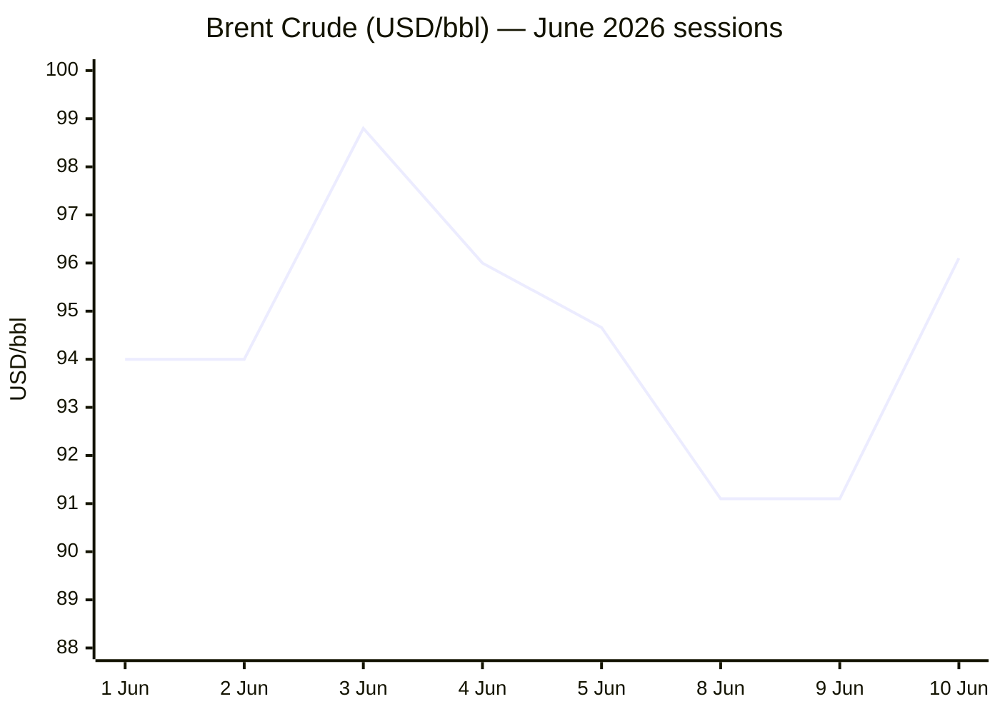
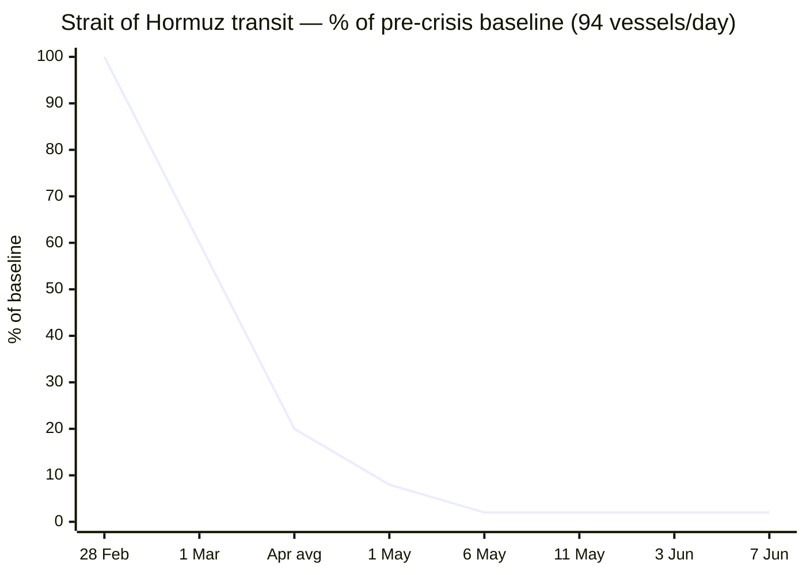

**Phase 0 complete.** Run date: **11 June 2026**, 05:32 CET.

Day counts:
- Russia–Ukraine War: 24 Feb 2022 → Day **1,204**
- Iran–US War / Hormuz Crisis: 28 Feb 2026 → Day **104**
- Israel–Lebanon Ceasefire 2026: 16 Apr 2026 → Day **57**

---

**Phase 1 — Direct fetch pass**Le Monde ❌ — search fallback queued.FAZ ❌ — search fallback queued.Kommersant ❌ — search fallback queued.Xinhua ⚠️ — fetched, content dates to 29–30 May 2026 (stale by ~12 days). Applying search fallback.EP ❌ — navigation structure only, no story content. Search fallback queued.

Now Tier 2 institutional fetches:IMF ⚠️ — fetched but no 24 h stories extracted (most recent dated May 2026). Search fallback for current IMF data.

Now Phase 2 — search pass across all domains:Critical finding: US military confirmed it struck multiple targets in Iran on 10 June 2026, the second day of renewed fighting, after Trump blamed Tehran for downing a US Army helicopter on 9 June. The ceasefire has broken down. Fetching more detail:Excellent — Straits.live data confirmed. Hormuz transit at 2% of pre-crisis baseline (2 vessels on 7 June vs 94/day normal). Now Ukraine, business, EU, tech, and trends searches:Critical: The ECB meeting is happening **today, 11 June 2026**, with markets pricing a 100% probability of a 25bp hike to 2.25%. This is a major EU Affairs and Business story. Continuing searches:All key data points confirmed. Now searching for the Lebanon ceasefire and trends stories:**Phase 3-5 complete.** I now have sufficient data for a full brief. Assembling:

---

```yaml
---
brief_date: 2026-06-11
version: v1.2.2
run_time: "05:32 CET"
stories_published: 13
categories: [conflict, business, eu_affairs, technology, trends]
alert_counts:
  red: 5
  yellow: 6
  green: 2
ongoing_situations:
  - {name: "Russia–Ukraine War", real_world_start: "2022-02-24", day: 1204}
  - {name: "Iran–US War / Hormuz Crisis", real_world_start: "2026-02-28", day: 104}
  - {name: "Israel–Lebanon Ceasefire 2026", real_world_start: "2026-04-16", day: 57}
sources_fetched: 11
fetch_status:
  le_monde: "❌"
  faz: "❌"
  kommersant: "❌"
  xinhua: "⚠️"
  european_parliament: "❌"
expansion_queue: []
---
```

# 🌐 MORNING BRIEF
## Thursday, 11 June 2026 · 05:32 CET
### 13 stories across 5 categories

---

## DIGEST SUMMARY

| # | Category | Headline | Alert |
|---|----------|----------|-------|
| 1 | ⚔️ Conflict | US launches second day of Iran strikes as ceasefire collapses | 🔴 |
| 2 | ⚔️ Conflict | IAEA board demands urgent Iran nuclear access; stockpile unverified | 🔴 |
| 3 | ⚔️ Conflict | Hormuz transit at 2% of pre-crisis baseline — near-total closure | 🔴 |
| 4 | ⚔️ Conflict | Israel strikes Beirut suburbs again as Lebanon ceasefire frays | 🟡 |
| 5 | ⚔️ Conflict | Ukraine: Russia loses net 14 sq mi in week ending 3 June | 🟢 |
| 6 | 💼 Business | US CPI hits 4.2% — fastest since April 2023, energy driving surge | 🔴 |
| 7 | 💼 Business | Brent climbs above $96 on renewed Iran strikes — oil volatility extreme | 🟡 |
| 8 | 💼 Business | Equity selloff deepens: S&P −4.5%, Nasdaq −7.1% from record highs | 🟡 |
| 9 | 🇪🇺 EU Affairs | ECB set to raise rates to 2.25% today — first hike since 2023 | 🔴 |
| 10 | 🇪🇺 EU Affairs | Hungary's Magyar files 110-page reform bill to unlock €17bn EU funds | 🟡 |
| 11 | 🤖 Technology | EU AI Act: Commission publishes AI-generated content Code of Practice | 🟢 |
| 12 | 📈 Trends | Pakistan's mediation role collapses as US-Iran strikes resume | 🔴 |
| 13 | 📈 Trends | FAO: Cereal prices +4.9% YoY; Hormuz fertiliser risk flagged | 🟡 |

> Alert level key: 🔴 High significance · 🟡 Developing · 🟢 Stable/Routine

---

## 🚨 SIGNAL BOARD

🔴 **US military has struck Iran for two consecutive days; Brent crude climbed above $96/bbl as peace talks effectively suspended**
🔴 **US CPI reached 4.2% YoY in May — a 3-year high — with energy up 23.5% annually; Fed rate-hike bets rising**
🔴 **ECB expected to hike to 2.25% today, the first increase since 2023, as eurozone inflation hits 3.2% — a September 2023 high**
🟡 **Hormuz transit remains at 2% of pre-crisis baseline (2 vessels/day vs 94 normal); CENTCOM denies strait is fully closed**
⚡ **IAEA board votes 21-for to demand Iran nuclear access; 440.9 kg of near-weapons-grade uranium unverified since June 2025**

---

## 🔄 ONGOING SITUATIONS

| Situation | Real-world start | Day # | Last significant development | Status |
|-----------|-----------------|-------|------------------------------|--------|
| Russia–Ukraine War | 24 Feb 2022 | Day 1,204 | Russia nets −14 sq mi over week to 3 Jun; ISW notes infiltration tactic complication | 🟡 Active |
| Iran–US War / Hormuz Crisis | 28 Feb 2026 | Day 104 | US launches second consecutive night of strikes; Tehran retaliates on Gulf bases | 🔴 Escalating |
| Israel–Lebanon Ceasefire 2026 | 16 Apr 2026 | Day 57 | Israel strikes Beirut suburbs (8 Jun) after Hezbollah drone attack; ceasefire tenuous | 🟡 Fragile |

---

> 🔎 **CONFLICT ANALYST** · 5 updates today

---

### 1. Iran–US War: Ceasefire Collapses, Second Night of Strikes 🔴
**Alert:** 🔴
**Summary:** The US military launched a second consecutive round of airstrikes against Iranian targets on 10 June, following Trump's warning that Tehran would "pay the price" for stalling negotiations. The crisis was triggered on 9 June when Iran downed a US Army helicopter near the Strait of Hormuz; both crew members were rescued by unmanned drone boat — a first for US forces. Iran retaliated by targeting US facilities in Bahrain, Jordan, and Kuwait. CENTCOM denied Iranian claims that the Strait of Hormuz was closed following the strikes, asserting commercial vessels continued to transit. [MULTI-SOURCE]
**Significance:** The latest exchange effectively suspends the Pakistan-mediated ceasefire framework and eliminates near-term prospects for the memorandum of understanding that appeared close to signature in late May. With nuclear talks, Hormuz reopening, and sanctions relief all contingent on a deal, escalation risk at Day 104 is at its highest since the initial April ceasefire.
**Sources:**
- [NBC News — U.S. launches new attacks on Iran in response to downing of helicopter, CENTCOM says](https://www.nbcnews.com/news/us-news/pilots-fine-us-military-helicopter-goes-down-strait-hormuz-rcna349137) · 9 June 2026
- [CBC News — U.S. and Iranian negotiators; Tehran says US violated ceasefire](https://www.cbc.ca/news/world/iran-us-israel-lebanon-ceasefire-attacks-9.7230096) · 10 June 2026
- [CNN — US strikes multiple targets in Iran; second day of renewed fire](https://edition.cnn.com/2026/06/09/world/live-news/iran-war-trump-israel) · 10 June 2026
- [NBC News — US launches new strikes, ceasefire unravels](https://www.ms.now/liveblog/iran-news-trump-israel-war-june-10-2026) · 10 June 2026

**Trend:** ↗ Escalating
**Tags:** #Iran #Hormuz #missile-strike #MULTI-SOURCE #escalation #day-104

---

### 2. IAEA Board Demands Urgent Iran Nuclear Access 🔴
**Alert:** 🔴
**Summary:** The IAEA's Board of Governors voted 21-to-3 on 10 June to demand Iran provide the agency with complete information on its nuclear stockpile and grant inspectors immediate access to damaged sites. Iran's ambassador warned the resolution "will have its own consequences." The agency has been unable to verify 440.9 kg of uranium enriched to 60% purity — technically a short step from weapons-grade — since the June 2025 Israeli and US strikes on nuclear facilities. Russia, China, and Niger opposed the resolution. A US-EU-sponsored draft explicitly calls for "precise information on nuclear material accountancy" without delay.
**Significance:** Unverified near-weapons-grade material inside Iran constitutes the most acute proliferation concern since 2006. If strikes have damaged centrifuge infrastructure, Iran may have recovered and dispersed enriched material to undisclosed sites — a scenario the IAEA cannot currently rule out.
**Sources:**
- [The Hill — UN nuclear watchdog board demands urgent Iran cooperation and access to nuclear sites](https://thehill.com/homenews/ap/ap-international/ap-un-nuclear-watchdog-board-demands-urgent-iran-cooperation-and-access-to-nuclear-sites/) · 10 June 2026
- [Washington Post — UN atomic watchdog board demands that Iran fully cooperate](https://www.washingtonpost.com/world/2026/06/10/iran-nuclear-material-access-resolution-vote-iaea/533e4f5c-64de-11f1-bdd4-805ebb99a693_story.html) · 10 June 2026

**Trend:** ↗ Escalating
**Tags:** #Iran #nuclear #Iran #MULTI-SOURCE #institutional

---

### 3. Hormuz Transit at 2% — Near-Total Closure Persists 🔴
**Alert:** 🔴
**Summary:** IMF PortWatch data published via Straits.live shows 2 vessels transited the Strait of Hormuz on 7 June, representing 2% of the pre-crisis baseline of 94 transits per day. The Crisis Pressure index stands at 94 (extreme), with Escalation Forecast at 68 (high). US Energy Secretary Wright stated vessel traffic in the Gulf "is rising," a characterisation contested by shipping data. Over 1,550 commercial vessels and 22,500 mariners remain stranded in and around the strait. The US naval blockade of Iranian ports, in force since 13 April, adds a second layer of restriction. Cape of Good Hope rerouting remains at extreme stress with 248 vessels in South African ports.
**Significance:** At 104 days, the Hormuz closure is now the longest sustained disruption to the world's primary oil chokepoint in modern history. Fertiliser supply from the region is critically affected, with downstream risk to cereal prices and food security in import-dependent economies.

📎 See also: Business § Story 7 — Brent climbs above $96 on renewed Iran strikes

**Sources:**
- [Straits.live — Strait of Hormuz Closed, Day 101, 10 June 2026](https://straits.live/) · 10 June 2026
- [NBC News — Tracking ship traffic through the Strait of Hormuz](https://www.nbcnews.com/data-graphics/strait-of-hormuz-ports-traffic-trump-us-iran-war-rcna331507) · Updated 3 June 2026

**Trend:** → Stable (closure)
**Tags:** #Hormuz #naval-blockade #supply-shock #shipping #data-point

---

### 4. Lebanon: Israel Strikes Beirut Suburbs, Ceasefire Frays 🟡
**Alert:** 🟡
**Summary:** On 8 June, Israel launched airstrikes on Beirut's southern suburbs — the first such attack since the 1 June ceasefire renewal — following a Hezbollah drone strike on Israeli military positions. Netanyahu stated Israel had halted operations against Iran but declined to acknowledge a ceasefire, while Iran warned it would resume strikes if Israel continued to target southern Lebanon. Further talks between Israeli and Lebanese delegations are scheduled for the week of 22 June. Hezbollah leader Naim Qassem had formally rejected the 3 June US-brokered Israel-Lebanon ceasefire proposal, calling it compliant with "the enemy's objectives." The UN peacekeeping mission UNIFIL confirmed one peacekeeper was killed in mortar fire during the ceasefire period.
**Significance:** The Lebanon front is formally linked by Tehran to any US-Iran deal. Continued Israeli operations against Hezbollah undermine Pakistan's mediating framework and provide Iran leverage to delay Hormuz reopening.
**Sources:**
- [NPR — Israel hits Beirut suburbs; ceasefire frays](https://www.npr.org/2026/06/07/nx-s1-5849220/israel-lebanon-beirut-airstrike-ceasefire) · 7 June 2026
- [Al Jazeera — Israel, Lebanon agree to conditional ceasefire; Hezbollah rejects](https://www.aljazeera.com/news/2026/6/4/israel-and-lebanon-agree-to-conditional-ceasefire) · 4 June 2026
- [NPR — Hezbollah rejects ceasefire deal agreed on by Israel and Lebanon](https://www.npr.org/2026/06/04/g-s1-125942/israel-lebanon-ceasefire) · 4 June 2026

**Trend:** ↗ Escalating
**Tags:** #Lebanon #Hezbollah #Israel #ceasefire #escalation

---

### 5. Ukraine: Russian Net Losses Continue at Reduced Rate 🟢
**Alert:** 🟢
**Summary:** According to ISW data compiled by Russia Matters, Russia recorded a net loss of 14 square miles over the week of 26 May–3 June 2026, compared with 38 square miles the previous week. DeepState OSINT concurs with an 11-square-mile net Russian loss. Russia has now gained a cumulative 29,031 square miles (12% of Ukraine) since February 2022. ISW cautions that comparisons with prior years are complicated by Russia's expanded use of infiltration tactics, which represent lower degrees of territorial control than conventional seizures.
**Significance:** The deceleration in Russian net losses may reflect seasonal and tactical consolidation rather than renewed offensive momentum. The Iran war's energy price spike continues to benefit the Russian budget via elevated commodity revenues.
**Sources:**
- [Russia Matters — The Russia-Ukraine War Report Card, June 3, 2026](https://www.russiamatters.org/news/russia-ukraine-war-report-card/russia-ukraine-war-report-card-june-3-2026) · 3 June 2026

**Trend:** → Stable
**Tags:** #Russia #Ukraine #frontline #data-point

📚 *Background reading:* [CFR — Global Conflict Tracker: Conflict With Hezbollah in Lebanon](https://www.cfr.org/global-conflict-tracker/conflict/political-instability-lebanon) · [House of Commons Library — US-Iran ceasefire and nuclear talks in 2026](https://commonslibrary.parliament.uk/research-briefings/cbp-10637/)

---

> 💼 **BUSINESS ANALYST** · 3 updates today

---

### 6. US CPI May 2026: 4.2% — Three-Year High, Energy Surge Dominant 🔴
**Alert:** 🔴
**Summary:** The Bureau of Labor Statistics reported on 10 June that US CPI rose 4.2% year-on-year in May 2026, the highest rate since April 2023. Monthly gain was 0.5%, decelerating from April's 0.6%. The reading was driven overwhelmingly by energy: the energy index surged 3.9% on the month and 23.5% annually, accounting for over 60% of the monthly increase. Core CPI rose 2.9% YoY and just 0.2% on the month — below the 0.3% forecast — suggesting tariff pass-through remains muted. Food prices rose 3.1% annually. The Fed meeting on 17 June is now expected to produce no rate change; futures traders are pricing no cuts in 2026.
**Market signal:** Bearish for risk assets — energy-driven inflation narrows Fed flexibility and extends the period of elevated borrowing costs.

📎 See also: Conflict § Story 3 — Hormuz transit at 2% of baseline

**Sources:**
- [BLS — Consumer Price Index, May 2026](https://www.bls.gov/news.release/archives/cpi_06102026.htm) · 10 June 2026
- [CNBC — CPI inflation report May 2026: Prices rose 4.2% annually](https://www.cnbc.com/2026/06/10/cpi-inflation-report-may-2026.html) · 10 June 2026

**Trend:** ↗ Escalating
**Tags:** #inflation #Fed #energy-markets #data-point #MULTI-SOURCE

---

### 7. Brent Climbs Above $96 as Iran Strikes Resume 🟡
**Alert:** 🟡
**Summary:** Brent crude rose above $96/bbl on 10 June after the second consecutive US strike on Iran revived fears that peace efforts had collapsed and the conflict could persist. The session high of $96+ extended gains from the prior day. Year-on-year, Brent is up approximately 42%, having spiked to $117.29/bbl in April 2026 — the highest since 2008 — before retreating on ceasefire hopes. EIA data showed US crude inventories fell 7.228 million barrels last week, a seventh consecutive weekly draw, exceeding the 4 million barrel forecast. Trading Economics confirms Brent opened 11 June at approximately $94.15, reflecting some easing after CENTCOM stated the strait remained passable.
**Market signal:** Bearish — the supply shock remains structural; without Hormuz reopening, the path back to pre-crisis levels ($72/bbl) requires sustained diplomatic resolution.

📎 See also: Conflict § Story 3 — Hormuz near-total closure persists

**Sources:**
- [Trading Economics — Brent Crude Oil Price](https://tradingeconomics.com/commodity/brent-crude-oil) · 10 June 2026

**Trend:** ↗ Escalating
**Tags:** #Brent #oil-price #Hormuz #supply-shock

---

### 8. Equity Selloff: S&P −4.5%, Nasdaq −7.1% from Record Highs 🟡
**Alert:** 🟡
**Summary:** US equity markets have fallen sharply since their early-June peaks: the S&P 500 is down 4.5% and the Nasdaq down 7.1% from record highs reached on 2 June, with the Dow off 3.2% from its 4 June record close. The selloff accelerated following Trump's threat that Iran would "pay the price" and the BLS CPI release confirming 4.2% inflation. Market sentiment is being pulled simultaneously by elevated energy costs, rising rate-hike expectations, and renewed conflict risk. Gold held below $4,100/oz on 11 June — near seven-month lows — despite geopolitical stress, reflecting inflation concerns that suppress safe-haven demand for non-yielding assets.
**Market signal:** Bearish across equities; gold's failure to rally suggests the market is pricing a stagflation-adjacent scenario rather than pure risk-off.
**Sources:**
- [CNN — Live updates: US Iran war; Brent 1.8%, S&P −4.5%](https://edition.cnn.com/2026/06/09/world/live-news/iran-war-trump-israel) · 10 June 2026
- [Trading Economics — Gold Price](https://tradingeconomics.com/commodity/gold) · 11 June 2026

**Trend:** ↘ De-escalating (equity prices)
**Tags:** #equity-selloff #SP500 #Nasdaq #gold #market-shock

📚 *Background reading:* [IMF — World Economic Outlook April 2026: Global Economy in the Shadow of War](https://www.imf.org/en/publications/weo/issues/2026/04/14/world-economic-outlook-april-2026) · [J.P. Morgan Global Research — Gold Price Predictions 2026–2027](https://www.jpmorgan.com/insights/global-research/commodities/gold-prices)

---

> 🇪🇺 **EU AFFAIRS ANALYST** · 2 updates today

---

### 9. ECB Set to Hike Rates to 2.25% — First Increase Since 2023 🔴
**Alert:** 🔴
**Summary:** The ECB Governing Council meets today (11 June 2026) with markets pricing a 100% probability of a 25-basis-point hike, lifting the deposit facility rate from 2.00% to 2.25%. The move would be the first rate increase since 2023, reversing part of the eight consecutive cuts that brought the rate from 4% to 2% between June 2024 and June 2025. The trigger is eurozone CPI at 3.2% in May — its highest since September 2023 — driven by energy at 10.9% annually. Services inflation accelerated to 3.5% in May. The ECB held steady at its 30 April meeting but Governing Council communications since then have reinforced the June hike consensus. Markets are pricing at least one further hike in 2026. President Lagarde's press conference (13:45 BST) will be closely watched for the rate path.
**Legislative/policy stage:** Governing Council decision today at 13:15 BST. President Lagarde press conference 13:45 BST. Implementing decision in force immediately upon announcement.
**Sources:**
- [ECB — Monetary policy decisions, 30 April 2026](https://www.ecb.europa.eu/press/pr/date/2026/html/ecb.mp260430~81b7179e6f.en.html) · 30 April 2026
- [ECB Watch — 100% probability of 25bp hike to 2.25%, 11 June 2026](https://ecb-watch.eu/) · 10 June 2026
- [Eurostat — Euro area annual inflation 3.2%, May 2026](https://ec.europa.eu/eurostat/web/products-euro-indicators/w/2-02062026-ap) · 2 June 2026

**Trend:** ↗ Escalating
**Tags:** #ECB #interest-rates #inflation #eurozone #institutional #data-point

---

### 10. Hungary: Magyar Files 110-Page Reform Bill to Unlock €17bn EU Funds 🟡
**Alert:** 🟡
**Summary:** Hungarian Prime Minister Péter Magyar's administration filed a 110-page anti-corruption reform bill in parliament on 9 June 2026, the most substantive step yet to unfreeze the €17bn in EU funds blocked under the previous Orbán government. The legislation would strengthen asset declaration rules for politicians, expand the Integrity Authority's powers, boost competition and transparency in public procurement, and dismantle the system of politically-linked "public trusts." EU Justice Commissioner Michael McGrath described Hungary as on a "very clear and steadfast path" toward rule-of-law compliance, and confirmed a visit to Budapest to agree on a reform roadmap. Budapest must meet all remaining conditions by end of August 2026 to access funds before year-end, with RRF payments subject to a 31 December deadline.
**Legislative/policy stage:** National legislation filed in Hungarian parliament. Commission assessment to follow. Council approval required before loan agreements can be signed. ECJ Advocate-General opinion (February 2026) siding with Parliament on Commission discretion limits; Court judgment awaited.
**Sources:**
- [Bloomberg — Magyar Files Legislation to Access Funds EU Blocked Under Orban](https://www.bloomberg.com/news/articles/2026-06-09/magyar-files-legislation-to-access-funds-eu-blocked-under-orban) · 10 June 2026
- [Euronews — Hungary on 'very clear and steadfast' path to restore rule of law, EU justice commissioner says](https://www.euronews.com/my-europe/2026/05/28/hungary-is-on-a-very-clear-and-steadfast-path-to-restore-rule-of-law-eu-justice-commission) · 28 May 2026

**Trend:** ↘ De-escalating
**Tags:** #Hungary #Magyar #EU-funds #rule-of-law #EU-institutions

📚 *Background reading:* [Verfassungsblog — Unfreezing EU Funds Without Melting the Rule of Law](https://verfassungsblog.de/unfreezing-eu-funds-without-melting-the-rule-of-law/) · [Centre for European Reform — Freezing EU funds: An effective tool to enforce the rule of law?](https://www.cer.eu/insights/freezing-eu-funds-effective-tool-enforce-rule-law)

---

> 🤖 **TECHNOLOGY ANALYST** · 1 update today

---

### 11. EU AI Act: Commission Publishes AI-Generated Content Code of Practice 🟢
**Alert:** 🟢
**Summary:** The European Commission published the final Code of Practice on marking and labelling of AI-generated content on 10 June 2026. The code is voluntary and provides practical compliance steps for generative AI providers and deployers ahead of Article 50 of the AI Act entering force on 2 August 2026. From that date, deepfakes and AI-generated text on matters of public interest must carry clear labels, and users must be notified when interacting with chatbots. Providers and deployers are invited to sign the Code; an AI Office information session is scheduled for 22 June. The transparency rules complement the General-Purpose AI Code of Practice published in July 2025.
**Analyst note:** With August 2026 enforcement approaching, the code's voluntary character creates a compliance divergence risk: large AI developers with EU legal teams are likely to sign promptly, while smaller deployers in member states lacking AI Office guidance may face legal uncertainty that plays out in national courts in 2027–2028.
**Sources:**
- [European Commission — Commission publishes Code of Practice on marking and labelling AI-generated content](https://digital-strategy.ec.europa.eu/en/news/commission-publishes-code-practice-marking-and-labelling-ai-generated-content) · 10 June 2026

**Trend:** → Stable
**Tags:** #AI-regulation #digital-regulation #EU-institutions #institutional

📚 *Background reading:* [White House — Promoting Advanced Artificial Intelligence Innovation and Security (Executive Order, 2 June 2026)](https://www.whitehouse.gov/presidential-actions/2026/06/promoting-advanced-artificial-intelligence-innovation-and-security/) · [CSIS — The Strait of Hormuz in 8 Charts](https://www.csis.org/analysis/strait-hormuz-8-charts)

---

> 📈 **TRENDS ANALYST** · 2 updates today

---

### 12. Pakistan's Mediation Role Collapses as US-Iran Strikes Resume 🔴
**Alert:** 🔴
**Summary:** Pakistan's role as the primary mediator between the US and Iran has effectively suspended following the resumption of hostilities on 9–10 June. Islamabad had brokered the April ceasefire, hosted the Islamabad Talks (11–12 April), and facilitated multiple rounds of indirect diplomacy through May. As recently as 23 May, Pakistan's army chief visited Tehran; the country's foreign minister met the US Secretary of State to maintain back-channels. A tentative memorandum of understanding — covering Hormuz demining, ceasefire extension, and nuclear talks framework — was described as "largely negotiated" by Trump as of late May but was never signed. The helicopter incident and resumed strikes have broken the momentum before a final determination was reached.
**Horizon:** Short-to-medium term: Pakistan's mediation capacity may revive if a new ceasefire is brokered, but the collapse of the May framework demonstrates the structural fragility of a process dependent on Trump's personal engagement and Iranian leadership continuity under Khamenei's son Mojtaba.
**Sources:**
- [CFR — How Pakistan Became the Iran War's Unlikely Peace Negotiator](https://www.cfr.org/articles/how-pakistan-became-the-iran-wars-unlikely-peace-negotiator) · 28 April 2026
- [Polymarket — US x Iran permanent peace deal by…?](https://polymarket.com/event/us-x-iran-permanent-peace-deal-by) · 10 June 2026

**Trend:** ⚡ Reversal
**Tags:** #Pakistan-mediation #diplomacy #Iran #peace-talks

---

### 13. FAO May 2026: Cereal Prices +4.9% YoY; Hormuz Fertiliser Risk Flagged 🟡
**Alert:** 🟡
**Summary:** The FAO Food Price Index averaged 130.8 points in May 2026, broadly stable (-0.2% from April) but 2.9% higher year-on-year. Cereal prices rose 2.6% on the month and 4.9% annually, with wheat up 3.4% monthly and 7.8% annually — US Hard Red Winter wheat prices in May were 28% above year-earlier levels due to adverse crop conditions. The FAO's Director of Markets and Trade flagged explicitly that "continued uncertainty affecting key trade routes, including the Strait of Hormuz, could reduce fertiliser use and place additional pressure on food prices." Rice prices rose 2.7% on energy-cost concerns. Vegetable oil and dairy declines offset the cereal surge.
**Horizon:** Medium-term: the Hormuz-fertiliser transmission channel — through which roughly one-third of the world's fertiliser production passes — represents a 6–18 month food security risk that the current FAO index does not yet fully reflect. If the strait remains closed through harvest planning season, 2027 crop yields in fertiliser-import-dependent economies are at risk.
**Sources:**
- [FAO — FAO Food Price Index broadly stable in May even as cereal quotations increase](https://www.fao.org/newsroom/detail/fao-food-price-index-broadly-stable-in-may-even-as-cereal-quotations-increase/en) · 5 June 2026
- [The Beef Site — World food prices stable in May as vegetable oil drop offsets gains](https://www.thebeefsite.com/news/world-food-prices-stable-in-may-as-vegetable-oil-drop-offsets-gains-fao) · 5 June 2026

**Trend:** ↗ Escalating
**Tags:** #food-security #food-prices #Hormuz #shipping #MULTI-SOURCE

📚 *Background reading:* [Stimson Center — The Motives and Constraints Behind Pakistan's Mediation Between the US and Iran](https://www.stimson.org/2026/the-motives-and-constraints-behind-pakistans-mediation-between-the-us-and-iran/) · [Carra Globe — Strait of Hormuz Closure 2026: What It Means for Your Supply Chain](https://carraglobe.com/strait-of-hormuz-closure-2026/)

---

## 📊 KEY DATA OF THE DAY

> 📊 **DATA OFFICER** · 7 indicators

| Indicator | Value | Δ vs prior session | Δ vs 7 days ago | Note | Source | URL |
|-----------|-------|-------------------|-----------------|------|--------|-----|
| EUR/USD | 1.1537 | −0.05% | −0.43% | Near 2-month low; geopolitical stress and ECB hike priced | Trading Economics | [link](https://tradingeconomics.com/euro-area/currency) |
| Brent Crude (USD/bbl) | 96.00+ | +1.8% (10 Jun) | +~4.3% | Above $96 on resumed strikes; opened 11 Jun at $94.15 | Trading Economics | [link](https://tradingeconomics.com/commodity/brent-crude-oil) |
| Gold (XAU/USD) | 4,077 | −0.93% | N/A | Seven-month low; inflation fears suppress safe-haven demand | LiteFinance/TE | [link](https://tradingeconomics.com/commodity/gold) |
| IMF Global Growth 2026 | 3.1% | −0.2pp vs Jan WEO (3.3%) | −0.3pp vs Oct WEO (3.4%) | April WEO: war assumed "limited"; adverse scenario at 2.5% | IMF WEO Apr 2026 | [link](https://www.imf.org/en/publications/weo/issues/2026/04/14/world-economic-outlook-april-2026) |
| EU CPI YoY (May 2026, flash) | 3.2% | +0.2pp vs April (3.0%) | +0.6pp vs March (2.6%) | Highest since Sep 2023; energy +10.9% driving surge | Eurostat | [link](https://ec.europa.eu/eurostat/web/products-euro-indicators/w/2-02062026-ap) |
| FAO Food Price Index (May 2026) | 130.8 | −0.2% vs April | +2.9% YoY | Cereals +4.9% YoY; Hormuz fertiliser risk flagged by FAO | FAO | [link](https://www.fao.org/newsroom/detail/fao-food-price-index-broadly-stable-in-may-even-as-cereal-quotations-increase/en) |
| Strait of Hormuz transit volume | 2% of baseline (2 vessels, 7 Jun) | N/A | ~2% (near-zero throughout) | Pre-crisis: 94/day; 1,550+ vessels stranded; Crisis Pressure index: 94/100 (extreme) | Straits.live / IMF PortWatch | [link](https://straits.live/) |

**Data commentary:** The data today presents a stagflation configuration: US CPI at 4.2% and eurozone CPI at 3.2% reflect the same energy shock — Hormuz at 2% of pre-crisis capacity, Brent above $96 — while equity markets have sold off sharply and the IMF growth forecast sits at 3.1% with significant downside risk. Gold at a seven-month low is the anomaly: normally a safe-haven in conflict, it is being suppressed by inflation expectations that raise the opportunity cost of holding non-yielding assets. The ECB hike today will likely widen the EUR/USD volatility range into the afternoon session; Lagarde's language on the September meeting will be the key signal.

---

## 📊 CHARTS

**Chart 1 — Brent Crude Trajectory, June 2026 (USD/bbl)**


*Sources: Trading Economics, IRU, CNN. Data from tool calls in this run. Intraday approximations used where session closes unavailable.*

---

**Chart 2 — Strait of Hormuz Transit Volume, 2026 (% of pre-crisis baseline)**


*Sources: Straits.live (IMF PortWatch), NBC News Hormuz tracker, UANI shipping updates. Approximate values for early-March transition period. 28 Feb = pre-crisis baseline.*

---

## ⚙️ AGENT METADATA

| Field | Value |
|-------|-------|
| Agent version | MORNING BRIEF v1.2.2 |
| Run timestamp | 2026-06-11T05:32:37+02:00 |
| Fetch status | Le Monde ❌ · FAZ ❌ · Kommersant ❌ · Xinhua ⚠️ (stale, 29–30 May content) · EP ❌ |
| Sources queried | 11 / 11 |
| Stories surfaced | ~28 before editorial filter |
| Stories published | 13 after editorial filter |
| Languages processed | EN, FR (search fallback), DE (search fallback) |
| Output language | English (British) |
| Date validated | ✅ Confirmed 11 June 2026 |
| Expansion Queue | None |

---

*MORNING BRIEF is an AI-assisted digest. All summaries are paraphrased from original sources. Verify time-sensitive information at the linked URLs before acting. Output language: British English.*
