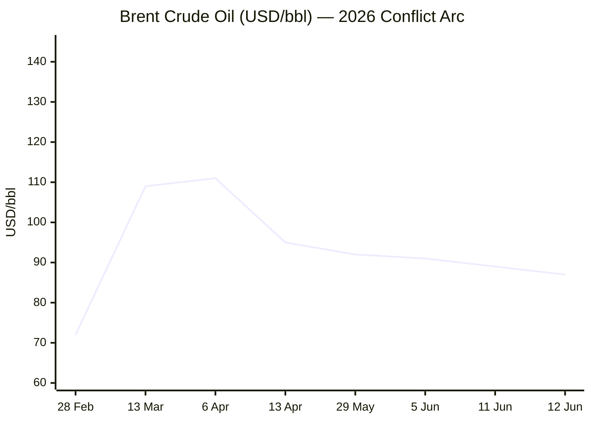
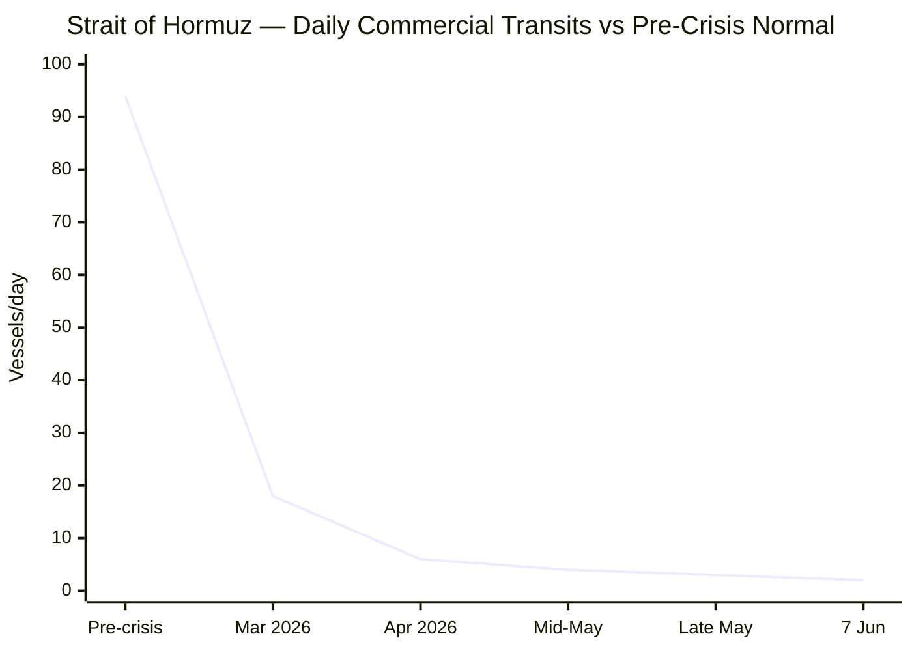

```yaml
---
brief_date: 2026-06-13
version: v1.2.2
run_time: "06:21 CET"
stories_published: 13
categories: [conflict, business, eu_affairs, technology, trends]
alert_counts:
  red: 5
  yellow: 6
  green: 2
ongoing_situations:
  - {name: "Russia–Ukraine War", real_world_start: "2022-02-24", day: 1206}
  - {name: "Iran–US War / Hormuz Crisis", real_world_start: "2026-02-28", day: 106}
  - {name: "Israel–Lebanon Ceasefire 2026", real_world_start: "2026-04-16", day: 59}
sources_fetched: 9
fetch_status:
  le_monde: "❌"
  faz: "❌"
  kommersant: "❌"
  xinhua: "⚠️"
  european_parliament: "❌"
expansion_queue: ["#peace-deal (Iran–US MOU context)", "#IPO (SpaceX listing)"]
---
```

# 🌐 MORNING BRIEF
## Saturday, 13 June 2026 · 06:21 CET
### 13 stories across 5 categories

---

## DIGEST SUMMARY

| # | Category | Headline | Alert |
|---|----------|----------|-------|
| 1 | ⚔️ Conflict | Pakistan confirms "final agreed text" of US–Iran peace deal; signing possible this weekend | 🔴 |
| 2 | ⚔️ Conflict | Hormuz remains effectively closed; 2 vessels vs 94/day normal as deal nears | 🔴 |
| 3 | ⚔️ Conflict | Israel continues strikes in southern Lebanon; Vatican aid convoy blocked | 🟡 |
| 4 | ⚔️ Conflict | Russia–Ukraine: Pokrovsk–Huliaipole axes remain hottest; Russian advance grinding | 🟡 |
| 5 | 💼 Business | Brent drops to near 2-month low at ~$88 on Iran deal optimism | 🔴 |
| 6 | 💼 Business | SpaceX IPO raises $75bn, closes +19% on Nasdaq debut — largest IPO in history | 🔴 |
| 7 | 💼 Business | ECB hikes 25bp to 2.25% — first hike since 2023; cuts growth, raises inflation forecasts | 🟡 |
| 8 | 🇪🇺 EU Affairs | EP June plenary opens: Digital Omnibus on AI, EU–US trade deal, enlargement on agenda | 🟡 |
| 9 | 🇪🇺 EU Affairs | Council–Parliament provisional deal on EU defence readiness procurement legislation | 🟡 |
| 10 | 🇪🇺 EU Affairs | EU–US trade deal headed for final EP plenary vote on 16 June | 🟢 |
| 11 | 🤖 Technology | Digital Omnibus on AI heads to EP vote: high-risk AI deadlines extended to 2027–28 | 🟡 |
| 12 | 📈 Trends | G7 summit in Évian-les-Bains (15–17 June): Iran peace deal and global imbalances dominate | 🔴 |
| 13 | 📈 Trends | FAO Food Price Index 130.8 in May — cereal prices near 3-year high; Hormuz fertiliser risk | 🟢 |

> Alert Level key: 🔴 High significance · 🟡 Developing · 🟢 Stable/Routine

---

## 🚨 SIGNAL BOARD

🔴 Pakistan PM Sharif confirms "final, agreed upon text" of US–Iran peace deal — potential signing in Geneva as soon as 14 June, ahead of G7 summit opening 15 June
🔴 Brent crude fell to ~$87–88 on 12 June, its lowest since mid-April, as a Trump administration official put 80% odds on a deal signing; Hormuz transit remains at 2% of normal
🔴 ECB raised the deposit rate to 2.25% on 11 June — first hike since 2023 — cutting the 2026 eurozone growth forecast to 0.8% and raising the inflation projection to 3.0%
🟡 SpaceX listed on Nasdaq (ticker: SPCX) on 12 June, raising $75bn at a $1.77 trillion valuation — the largest IPO in history; Elon Musk becomes the world's first trillionaire on paper
⚡ Iran–US deal text dispute: Trump called Iran's published 14-point draft "no relation to the truth," but neither side denied that a text exists — raising the prospect of rival versions being surfaced at the G7

---

## 🔄 ONGOING SITUATIONS

| Situation | Real-world start | Day # | Last significant development | Status |
|-----------|-----------------|-------|------------------------------|--------|
| Russia–Ukraine War | 24 Feb 2022 | Day 1,206 | Russian advances continue near Pokrovsk and Huliaipole; Kramatorsk–Kostiantynivka belt now principal theatre | 🔴 Active |
| Iran–US War / Hormuz Crisis | 28 Feb 2026 | Day 106 | Pakistan confirms final deal text agreed; Brent drops ~4%; drones shot down near Hormuz 12 June | 🟡 Brinkmanship |
| Israel–Lebanon Ceasefire 2026 | 16 Apr 2026 | Day 59 | Ceasefire nominally in force but violated daily; Hezbollah rejected 3 June US-brokered terms; Israeli strikes continue in Nabatieh, Tyre districts | 🔴 Active |

---

## ⚔️ CONFLICT

> 🔎 **CONFLICT ANALYST** · 4 updates today

---

### 1. Pakistan Confirms "Final Agreed Text" of US–Iran Peace Deal — Geneva Signing Possible This Weekend 🔴

**Alert:** 🔴
**Summary:** Pakistani Prime Minister Shehbaz Sharif announced on 12 June that "a final, agreed upon text of the peace deal has been reached," with Islamabad "working closely with both sides to finalise the next steps." Iran's Foreign Minister Abbas Araghchi stated a deal has "never been closer." Trump suggested a signing ceremony could occur as early as Saturday or Monday, likely in Europe — with Geneva under active consideration ahead of the G7 opening in Évian-les-Bains on 15 June. Significant tensions persisted: Trump had earlier that day threatened to strike Iran "VERY HARD" and seize Kharg Island before reversing course. Two Iranian drones were shot down near Hormuz overnight 12 June. No direct US or Iranian confirmation of the final text emerged before this run.
**Significance:** If finalised, the MOU would extend the ceasefire 60 days, mandate Hormuz reopening within 30 days, suspend sanctions, and include Iranian commitments to forgo nuclear weapons development. A deal would be the most consequential geopolitical event of 2026 — but failure to confirm the text from both principals remains the principal near-term risk.
**Sources:**

- [Al Arabiya — Pakistan PM Sharif says final text of US–Iran peace deal agreed](https://english.alarabiya.net/News/middle-east/2026/06/12/pakistan-pm-sharif-says-final-text-of-usiran-peace-deal-agreed-working-on-next-steps) · 12 June 2026
- [NBC News — Pakistan says 'final, agreed upon text' of deal reached; Iran holding 'final' deliberations](https://www.nbcnews.com/world/iran/live-blog/live-updates-us-iran-drones-trump-deal-war-hormuz-tehran-rcna349750) · 12 June 2026
- [Iran International — Pakistan: final text of Iran-US peace deal agreed](https://www.iranintl.com/en/202606127755) · 12 June 2026
- [Jerusalem Post — Trump says agreement approved; Kharg Island plan off the table](https://www.jpost.com/middle-east/iran-news/article-899125) · 12 June 2026

**Trend:** ↗ Escalating (toward resolution)
**Tags:** #Iran #Pakistan-mediation #peace-talks #Hormuz #MULTI-SOURCE

---

### 2. Strait of Hormuz Remains Effectively Closed — Transit at 2% of Normal 🔴

**Alert:** 🔴
**Summary:** As of 12 June, commercial transit through the Strait of Hormuz stood at approximately 2 vessels per day against a pre-crisis normal of ~94/day — a 98% collapse in traffic, per IMF PortWatch data and live AIS tracking. Zero outbound commercial vessels were recorded on 8–12 June on the most sensitive monitoring platforms. The UK House of Commons Library, in a briefing dated 11 June, confirmed a 95% reduction in crude oil and a 99% reduction in LNG shipments since the conflict began. War-risk insurance premiums have risen to 8× pre-crisis levels, with six P&I clubs having withdrawn cover. The prospect of a peace deal has prompted shipping rerouting discussions, but traders cautioned that clearing mines, restarting production, and repairing infrastructure will delay any normalisation for months after a deal.
**Significance:** With 20% of global petroleum and 20% of global LNG historically routed through Hormuz, the structural damage to supply chains will persist well beyond any formal ceasefire, making the energy price path highly uncertain even under optimistic deal scenarios.
**Sources:**

- [Straits.live — Live Strait of Hormuz Traffic](https://straits.live/) · 12 June 2026
- [House of Commons Library — Israel/US-Iran conflict 2026: Reopening the Strait of Hormuz](https://commonslibrary.parliament.uk/research-briefings/cbp-10636/) · 11 June 2026
- [CNBC — Brent drops toward $88, lowest in nearly two months](https://tradingeconomics.com/commodity/brent-crude-oil) · 12 June 2026

**Trend:** → Stable (closure sustained; deal pending)
**Tags:** #Hormuz #naval-blockade #supply-shock #Iran #MULTI-SOURCE

---

### 3. Israel Continues Strikes in Southern Lebanon; Vatican Aid Convoy Blocked 🟡

**Alert:** 🟡
**Summary:** Israeli airstrikes struck multiple sites in southern Lebanon on 12 June, including Majdalzoun, Qusaybah, Sinai, Kafr Tebnit, Al-Shahabiya and Jebchit. The Israeli army stated it had conducted 310 airstrikes in southern Lebanon in the preceding week. A Vatican-organised aid convoy of 25 trucks, coordinated with UNIFIL and led by Apostolic Nuncio Paolo Borgia, was stopped by Israeli tanks near Kfar Tebnit and forced to reroute — arriving at its destination after 12 hours. The conditional ceasefire agreed between Israel and Lebanon on 3 June remains effectively inoperative: Hezbollah rejected its terms (requiring Hezbollah withdrawal south of the Litani and cessation of fire) and has continued attacks. Both sides have continued daily exchanges of fire.
**Significance:** The Lebanon front remains a secondary theatre, but persistent Israeli violations and Hezbollah's rejection of the conditional ceasefire terms make a durable settlement unlikely before the broader Iran deal clarifies Hezbollah's strategic position.
**Sources:**

- [Lebanon liveuamap — 12 June 2026 airstrike log](https://lebanon.liveuamap.com/) · 12 June 2026
- [CBS News Live Updates — Vatican convoy blocked in Lebanon](https://www.cbsnews.com/live-updates/iran-war-us-trump-peace-deal-agreement/) · 12 June 2026
- [Daily Sabah — At least 12 killed in continued Israeli strikes on southern Lebanon](https://www.dailysabah.com/world/mid-east/at-least-12-people-killed-in-continued-israeli-strikes-on-s-lebanon/amp) · 10 June 2026

**Trend:** → Stable (ongoing at elevated intensity)
**Tags:** #Israel #Lebanon #Hezbollah #ceasefire #humanitarian

---

### 4. Russia–Ukraine: Pokrovsk–Huliaipole Axes Remain Hottest; Kramatorsk Belt Now Principal Theatre 🟡

**Alert:** 🟡
**Summary:** The Pokrovsk axis in Donetsk Oblast continues to record the highest density of combat engagements on the Ukrainian frontline, with 196 combat engagements reported on 7 June alone (over 50 at Pokrovsk alone). ISW and independent analysts assess that the Kramatorsk–Kostiantynivka defensive belt has become the principal theatre of Russian offensive operations as Moscow presses to capture the remaining major urban centres of Ukrainian-controlled Donetsk. Analysts note that Russian forces can still attack but are unable to convert tactical gains into operational success. The Huliaipole area has also seen intensified fighting. Ukrainian drone strikes continue targeting Russian logistics deep in occupied Luhansk Oblast.
**Significance:** Pokrovsk's continued resistance — now over a year under sustained assault — has become a strategic symbol, but the Kramatorsk–Kostiantynivka shift signals Russian operational re-prioritisation that could yield more significant gains if Ukrainian defences are overstretched.
**Sources:**

- [Lviv Herald — The Ukrainian front line in June 2026](https://www.lvivherald.com/post/the-ukrainian-front-line-in-june-2026) · 9 June 2026
- [Russia Matters / ISW — Russia-Ukraine War Report Card, June 3 2026](https://www.russiamatters.org/news/russia-ukraine-war-report-card/russia-ukraine-war-report-card-june-3-2026) · 3 June 2026

**Trend:** ↗ Escalating (Russian pressure intensifying)
**Tags:** #Ukraine #Russia #frontline #drone-warfare

📚 *Background reading:* [IISS — Ukraine military balance and aid flows, 2026](https://www.iiss.org) · [Kyiv Independent — Ukraine frontline coverage](https://kyivindependent.com)

---

## 💼 BUSINESS

> 💼 **BUSINESS ANALYST** · 3 updates today

---

### 5. Brent Drops to ~$88 — Two-Month Low — on Iran Peace Deal Optimism 🔴

**Alert:** 🔴
**Summary:** Brent crude futures fell to approximately $86.98–$88 per barrel on 12 June, their lowest level since mid-April, after Pakistan confirmed a final deal text and a Trump administration official put 80% odds on a signing. The decline of approximately 3.8–4% in a single session follows a month-long collapse of nearly 19% from the 2026 highs above $140 reached in April when the conflict escalated. WTI fell over 4% to settle at $84.33. Analysts caution, however, that even a formal deal would not immediately normalise supply: clearing mines from Hormuz, repairing infrastructure, and restarting idled production fields will take months. UBS noted Iran's crude loadings in May had averaged below 0.3 mb/d, down sharply from April's 1.5 mb/d.
**Market signal:** Bearish in the short term as deal optimism accelerates, but with significant rebound risk if deal talks collapse again — the gap between current prices (~$88) and a full Hormuz normalisation scenario remains wide.
**Sources:**

- [Trading Economics — Brent Crude Oil price, 12 June 2026](https://tradingeconomics.com/commodity/brent-crude-oil) · 12 June 2026
- [TradingKey — Iran deal oil price WTI Brent G7 June 12 2026](https://www.tradingkey.com/analysis/stocks/us-stocks/261964642-iran-deal-oil-price-wti-brent-g7-trump-market-tradingkey) · 12 June 2026
- [CNBC — Oil drops 20% from 2026 peak on ceasefire talks optimism](https://www.cnbc.com/2026/05/29/oil-prices-iran-ceasefire-us-trump-strait-hormuz-energy-costs.html) · 29 May 2026

📎 See also: Conflict § Story 1 — Pakistan confirms final US–Iran deal text; signing potentially this weekend

**Trend:** ↘ De-escalating
**Tags:** #Brent #oil-price #Hormuz #supply-shock #Iran #MULTI-SOURCE

---

### 6. SpaceX Raises $75bn in Largest IPO in History; Musk Becomes First Trillionaire 🔴

**Alert:** 🔴
**Summary:** SpaceX (ticker: SPCX) debuted on the Nasdaq on 12 June, raising $75bn at $135 per share — triple the size of any prior IPO. Shares opened at $150 and closed at $160.95, a gain of 19%, giving the company a market capitalisation exceeding $2 trillion on its first day. CEO Elon Musk, who retains over 82% voting control, became the world's first trillionaire on paper. The listing included xAI (acquired February 2026), Grok AI models, and the social network X. Former Nasdaq CEO Robert Greifeld indicated he expects OpenAI and Anthropic to follow SpaceX to public markets. S&P 500 rose 0.50% and the Dow gained 0.70% on the day, supported by the IPO and Iran deal optimism.
**Market signal:** Bullish for tech and AI-adjacent equities — SpaceX's pricing signals that public markets are willing to absorb trillion-dollar valuations for companies with negative cumulative earnings ($41.3bn total loss since 2002) if the long-term narrative is sufficiently compelling.
**Sources:**

- [NBC News — SpaceX stock gains 19% on first trading day](https://www.nbcnews.com/business/markets/spacex-ipo-stock-price-rcna349760) · 12 June 2026
- [CNBC — SpaceX IPO SPCX live updates](https://www.cnbc.com/2026/06/12/spacex-ipo-spcx-live-updates.html) · 12 June 2026
- [NPR — SpaceX makes history as largest IPO ever](https://www.npr.org/2026/06/12/nx-s1-5855004/stock-ai-spacex-ipo-elon-musk) · 12 June 2026

**Trend:** ↗ Escalating
**Tags:** #equity-rally #Nasdaq #SP500 #AI #MULTI-SOURCE

---

### 7. ECB Hikes 25bp to 2.25% — First Rise Since 2023; Cuts Growth, Raises Inflation Forecasts 🟡

**Alert:** 🟡
**Summary:** The ECB's Governing Council raised all three key interest rates by 25 basis points on 11 June, effective 17 June 2026, lifting the deposit facility rate to 2.25%, main refinancing to 2.40%, and marginal lending to 2.65%. The move was near-unanimously expected (100% market probability per LSEG data). The ECB cited Iran war-generated inflationary pressure as the primary driver, noting "the decision is robust across a range of scenarios." Updated staff projections raised the 2026 eurozone headline inflation forecast to 3.0% (from 2.6%) and core to 2.5%, while cutting the 2026 GDP growth projection to 0.8% (from 0.9%). Markets now price at least one further hike, most likely in September.
**Market signal:** Mildly bearish for eurozone risk assets — stagflationary dynamics (rising rates, falling growth forecast) weigh on credit-sensitive sectors, though the move was fully priced in and the ECB signalled caution about excessive tightening.
**Sources:**

- [ECB — Monetary policy decisions, 11 June 2026](https://www.ecb.europa.eu/press/pr/date/2026/html/ecb.mp260611~4d41bd5e83.en.html) · 11 June 2026
- [CNBC — ECB hikes interest rates for first time since 2023](https://www.cnbc.com/2026/06/11/ecb-hikes-interest-rates.html) · 11 June 2026
- [Reuters/US News — ECB raises rates in long-telegraphed move](https://money.usnews.com/investing/news/articles/2026-06-11/ecb-raises-interest-rates-in-long-telegraphed-move) · 11 June 2026

**Trend:** ↗ Escalating (monetary tightening cycle restarted)
**Tags:** #ECB #interest-rates #inflation #eurozone #MULTI-SOURCE

📚 *Background reading:* [Bruegel — ECB policy under energy shocks](https://www.bruegel.org) · [RAND — Macroeconomic consequences of energy supply disruption](https://www.rand.org)

---

## 🇪🇺 EU AFFAIRS

> 🇪🇺 **EU AFFAIRS ANALYST** · 3 updates today

---

### 8. EP June Plenary Opens: Digital Omnibus on AI, EU–US Trade and Western Balkans Enlargement on Agenda 🟡

**Alert:** 🟡
**Summary:** The European Parliament's June plenary session (15–18 June, Strasbourg) opens with a dense legislative agenda. Key items include: (1) a vote on the Digital Omnibus on AI, provisionally agreed in May, extending high-risk AI system compliance deadlines to December 2027 and August 2028; (2) a vote on 16 June to implement the EU–US Turnberry trade deal; (3) debates on own-initiative AFET reports on Western Balkans accession (Montenegro, Albania, Kosovo, Bosnia-Herzegovina, North Macedonia) and Turkey; (4) a statement from the President of Montenegro; and (5) Andrzej Poczobut (2025 Sakharov Prize laureate) addressing Parliament following his release from Belarusian detention. The Council and Commission will also make statements ahead of the European Council (18–19 June).
**Legislative/policy stage:** Plenary session 15–18 June 2026; votes on AI Omnibus and EU–US trade deal scheduled for 15–16 June. European Council conclusions on Iran war response and defence integration expected 18–19 June.
**Sources:**

- [EP Think Tank — European Parliament Plenary Session June 2026](https://epthinktank.eu/2026/06/12/european-parliament-plenary-session-june-2026/) · 12 June 2026

**Trend:** → Stable
**Tags:** #EU-institutions #digital-regulation #AI-regulation #EU-enlargement

---

### 9. Council–Parliament Strike Provisional Deal on EU Defence Readiness and Procurement Legislation 🟡

**Alert:** 🟡
**Summary:** Council Presidency and European Parliament negotiators reached a provisional agreement on 10 June on new legislation to simplify security and defence procurement, facilitate defence investments, and support the European defence industry — part of the broader ReArm Europe/Readiness 2030 framework. The agreement complements the €150bn SAFE instrument (adopted May 2025) and the European Defence Industry Programme (EDIP). Between February and April 2026, the Council green-lit SAFE funding for 18 EU member states. The Commission has correspondingly raised EU-Bond issuance targets for H1 2026 to €100bn (up from €90bn) to fund both Ukraine support loans and SAFE defence procurement. Separately, the EU Commission's tentative SAFE allocations cover missile defence, drones, air-defence systems, cyber, strategic enablers, and space assets.
**Legislative/policy stage:** Provisional agreement reached 10 June 2026; formal adoption by Council and Parliament pending. SAFE loan agreements with member states being finalised.
**Sources:**

- [Council of the EU — Simplification: Council and Parliament strike deal to boost EU defence industry](https://www.consilium.europa.eu/en/policies/defence-funding/) · 10 June 2026
- [European Commission — Commission increases funding target for EU-Bonds, H1 2026](https://commission.europa.eu/news-and-media/news/european-commission-increases-its-funding-target-first-half-2026-2026-05-06_en) · 6 May 2026

**Trend:** ↗ Escalating (EU defence integration accelerating)
**Tags:** #EU-defence #EU-institutions #Ukraine-aid #institutional

---

### 10. EU–US Trade Deal Heads for Final EP Plenary Vote on 16 June 🟢

**Alert:** 🟢
**Summary:** The European Parliament's International Trade Committee approved legislation implementing the EU–US Turnberry trade deal on 2 June by 31 votes to 6, paving the way for a final plenary vote on 16 June. The deal, provisionally signed in Scotland in summer 2025, eliminates EU duties on most US industrial goods while US exporters continue to face an approximate 15% rate. The committee secured a sunset clause lapsing the rules at end-2029, and a provision enabling the Commission to suspend the deal if the US fails to lift tariffs on EU steel and aluminium by end-2026. INTA chair Bernd Lange said Parliament was likely to back the agreement, while warning there could be "no certainty" that the US would honour its side. Trump has threatened 25% tariffs on EU cars if implementation does not proceed by 4 July.
**Legislative/policy stage:** Final plenary vote scheduled 16 June 2026 (Strasbourg). If adopted, implementing regulations enter into force upon publication in the Official Journal.
**Sources:**

- [Euronews — Trade MEPs back EU–US deal despite watered-down safeguards](https://www.euronews.com/my-europe/2026/06/02/trade-meps-back-euus-deal-despite-watered-down-safeguards) · 2 June 2026
- [EUToday — EU–US trade deal nears Parliament vote as doubts persist](https://eutoday.net/eu-us-trade-deal-nears-parliament-vote-as-doubts-persist-over-washingtons-reliability/) · 11 June 2026

**Trend:** → Stable
**Tags:** #EU-institutions #single-market #MULTI-SOURCE

📚 *Background reading:* [Bruegel — EU–US trade relations under Trump tariff pressure](https://www.bruegel.org) · [ECFR — European sovereignty and transatlantic trade bargains](https://ecfr.eu)

---

## 🤖 TECHNOLOGY

> 🤖 **TECHNOLOGY ANALYST** · 2 updates today

---

### 11. Digital Omnibus on AI Heads for EP Vote — High-Risk Deadlines Extended, CSAM Ban Codified 🟡

**Alert:** 🟡
**Summary:** The European Parliament is due to vote on the Digital Omnibus on AI during the 15–18 June plenary. The provisional agreement, reached on 7 May and approved by IMCO and LIBE committees, extends the application of high-risk AI rules from August 2026 to December 2027 (stand-alone systems) and August 2028 (embedded systems), providing critical compliance runway for European businesses. The agreed text also codifies a ban on AI systems generating non-consensual sexual content and child sexual abuse material, and introduces fixed deadlines for applying high-risk rules. Formal adoption must occur before 2 August 2026 to avoid the original AI Act enforcement cliff-edge. The broader Digital Omnibus package also proposes amendments to the GDPR, ePrivacy Directive, NIS2, and Data Act.
**Analyst note:** Extending the compliance deadline to 2027–28 gives European AI companies 18–30 months of additional runway but creates a divergence risk with the US, where AI governance remains voluntary — potentially widening the EU–US competitive gap in frontier AI deployment within 12–24 months.
**Sources:**

- [EP Think Tank — European Parliament Plenary Session June 2026](https://epthinktank.eu/2026/06/12/european-parliament-plenary-session-june-2026/) · 12 June 2026
- [White & Case — EU agrees Digital Omnibus deal to simplify AI rules](https://www.whitecase.com/insight-alert/eu-agrees-digital-omnibus-deal-simplify-ai-rules) · 7 May 2026
- [Council of the EU — Artificial Intelligence: Council and Parliament agree to simplify rules](https://www.consilium.europa.eu/en/press/press-releases/2026/05/07/artificial-intelligence-council-and-parliament-agree-to-simplify-and-streamline-rules/) · 7 May 2026

**Trend:** ↘ De-escalating (regulatory timeline relief)
**Tags:** #AI-regulation #digital-regulation #EU-institutions #MULTI-SOURCE

📚 *Background reading:* [CSIS — AI governance and transatlantic divergence](https://www.csis.org) · [Atlantic Council — EU AI Act implementation landscape](https://www.atlanticcouncil.org)

---

### 12. SpaceX IPO Signals AI-Infrastructure Supercycle; OpenAI and Anthropic IPOs Expected to Follow 🟡

**Alert:** 🟡
**Summary:** SpaceX's $75bn Nasdaq listing on 12 June, described by former Nasdaq chief Robert Greifeld as trading "not on fundamentals but on the aspiration of what's possible," is widely viewed as opening the IPO window for AI-native companies. SpaceX's portfolio includes xAI (acquired February 2026), Grok AI models, X (formerly Twitter), Starlink satellite internet serving AI data relay functions, and an ambition to position orbital infrastructure as AI data centre real estate. The company has accumulated $41.3bn in total losses since 2002. Greifeld stated he "would definitely bet" that OpenAI and Anthropic follow SpaceX to public markets in 2026.
**Analyst note:** If OpenAI and Anthropic proceed with IPOs in H2 2026, the combination of three frontier AI-adjacent listings would represent a structural shift in how AI infrastructure is capitalised — moving from private equity dependency toward public market discipline, with significant implications for governance and safety commitments over a 12–24 month horizon.
**Sources:**

- [CNBC — SpaceX IPO SPCX live updates, 12 June 2026](https://www.cnbc.com/2026/06/12/spacex-ipo-spcx-live-updates.html) · 12 June 2026
- [The Motley Fool — How to buy SpaceX stock (SPCX)](https://www.fool.com/investing/how-to-invest/stocks/how-to-invest-in-spacex-stock/) · 12 June 2026

📎 See also: Business § Story 6 — SpaceX raises $75bn in largest IPO in history

**Trend:** ↗ Escalating
**Tags:** #AI #data-centre #IPO #autonomous-systems

---

## 📈 TRENDS

> 📈 **TRENDS ANALYST** · 2 updates today

---

### 13. G7 Summit in Évian-les-Bains (15–17 June): Iran Deal, Ukraine and Global Imbalances Dominate 🔴

**Alert:** 🔴
**Summary:** The 52nd G7 summit opens in Évian-les-Bains, France, on 15 June with Iran peace deal prospects and Ukraine as the dominant issues, alongside global economic imbalances and critical minerals. Trump's decision to attend is described as noteworthy given his disdain for multilateralism. French President Macron has invited Saudi Arabia, the UAE, Qatar, Egypt, Syria, South Korea, Brazil, India and Kenya as guests; Ukraine's Zelensky is also attending. Macron is planning a video call involving China and G7 members on global imbalances. Zelensky has raised concerns that the Iran conflict has diverted US attention from Ukraine. The summit comes one day after a potential US–Iran deal signing in Geneva — meaning the G7 agenda could be dominated or transformed by a deal breakthrough on the eve of the meeting.
**Horizon:** Short-term signal (days to 2 weeks): A US–Iran deal signed before or at the G7 would reshape the entire summit agenda, likely producing a coordinated G7 statement on Hormuz reopening sequencing, sanctions architecture, and post-war reconstruction. Failure to sign would leave deep transatlantic rifts on display.
**Sources:**

- [Times of Israel — Iran and Ukraine loom over G7, France hopes Trump will stay for duration](https://www.timesofisrael.com/iran-and-ukraine-loom-over-g7-as-france-hopes-trump-will-at-least-stay-for-duration/) · 12 June 2026
- [CFR — Macron's Agenda Meets Trump's at the G7 Summit](https://www.cfr.org/articles/macrons-agenda-meets-trumps-at-the-g7-summit) · 11 June 2026
- [Athens Times — US-Iran deal likely in Geneva before G7 summit](https://athens-times.com/bloomberg-us-iran-deal-on-strait-of-hormuz-likely-in-geneva-before-g7-summit/) · 12 June 2026

**Trend:** ↗ Escalating
**Tags:** #diplomacy #Iran #peace-talks #mediation #MULTI-SOURCE

---

### 14. FAO Food Price Index 130.8 in May — Cereals at Near 3-Year High; Hormuz Fertiliser Risk Flagged 🟢

**Alert:** 🟢
**Summary:** The FAO Food Price Index averaged 130.8 points in May 2026, down a marginal 0.2% from April's revised 131.0, but 2.9% higher than a year earlier — near its highest since January 2023. Cereal prices rose 2.6% month-on-month, with wheat up for a fourth consecutive month driven by smaller expected harvests in major exporters (US winter wheat crop conditions are the least favourable in decades), higher fuel and fertiliser costs linked to the Iran conflict, and weather-related pressures. FAO Director Ben-Belhassen explicitly flagged that "continued uncertainty affecting key trade routes, including the Strait of Hormuz, could reduce fertiliser use and place additional pressure on food prices." World cereal production is forecast to shrink 2% in 2026/27.
**Horizon:** Medium-term trend (months to 1 year): The Hormuz–fertiliser–cereal transmission mechanism is structural. Even with a Hormuz deal, reduced fertiliser availability and elevated energy costs will sustain above-target food price pressure into H1 2027, with disproportionate impacts on low-income food-importing countries.
**Sources:**

- [FAO — Food Price Index broadly stable in May, cereal quotations increase](https://www.fao.org/newsroom/detail/fao-food-price-index-broadly-stable-in-may-even-as-cereal-quotations-increase/en) · 6 June 2026

**Trend:** ↗ Escalating
**Tags:** #food-security #food-prices #Hormuz #supply-shock #data-point

📚 *Background reading:* [Atlantic Council — Food security and the Hormuz energy–fertiliser nexus](https://www.atlanticcouncil.org) · [RAND — Supply chain vulnerability in energy-dependent food systems](https://www.rand.org)

---

## 📊 KEY DATA OF THE DAY

> 📊 **DATA OFFICER** · 7 indicators

| Indicator | Value | Δ vs prior session | Δ vs 7 days ago | Note | Source | URL |
|-----------|-------|-------------------|-----------------|------|--------|-----|
| EUR/USD | 1.1565 | −0.07% | +0.35% | 6-week low; ECB hike priced in; dollar firm on Middle East uncertainty | Trading Economics / ECB | [link](https://tradingeconomics.com/euro-area/currency) |
| Brent Crude (USD/bbl) | $86.98 | −3.78% | −5.4% (approx) | Lowest since mid-April; Iran deal optimism driving decline; mine-clearing lag limits full rebound | Trading Economics / EIA | [link](https://tradingeconomics.com/commodity/brent-crude-oil) |
| Gold (XAU/USD) | $4,200 | +2.94% | N/A | Recovering from 11 June low of $4,080; sustained above $4,000 on war risk premium | JM Bullion / Trading Economics | [link](https://tradingeconomics.com/commodity/gold) |
| IMF Global Growth 2026 | 3.1% | −0.2pp vs Jan WEO | −0.2pp vs Oct WEO | "Reference forecast" assumes limited conflict duration; adverse scenario is 2.5% | IMF WEO April 2026 | [link](https://www.imf.org/en/publications/weo/issues/2026/04/14/world-economic-outlook-april-2026) |
| EU CPI YoY (May 2026 flash) | 3.2% | +0.2pp vs April | +1.0pp vs Feb 2026 | Highest since September 2023; energy +10.9% YoY; full data release scheduled 17 June | Eurostat | [link](https://ec.europa.eu/eurostat/web/products-euro-indicators/w/2-02062026-ap) |
| FAO Food Price Index | 130.8 | −0.2% vs April | May 2026 — latest available | Near 3-year high; cereal sub-index +2.6% MoM; Hormuz fertiliser risk flagged by FAO | FAO | [link](https://www.fao.org/newsroom/detail/fao-food-price-index-broadly-stable-in-may-even-as-cereal-quotations-increase/en) |
| Strait of Hormuz transit (% of normal) | ~2% | → (effective closure sustained) | → (unchanged from prior week) | ~2 vessels/day vs ~94 pre-crisis; 0 outbound commercial vessels recorded 8–12 June | Straits.live / IMF PortWatch | [link](https://straits.live/) |

**Data commentary:** Oil's 4% single-session decline on 12 June is the market's clearest pricing signal yet that traders believe a US–Iran deal is imminent — but the gap between Brent at $87 and a fully normalised Hormuz (likely $65–70 in the medium term) reflects deep scepticism about how quickly the physical disruption can be unwound. Gold's resilience above $4,000 despite the deal optimism suggests markets are not yet pricing full resolution; the inflation–growth scissors facing the ECB (CPI at 3.2%, eurozone growth at 0.8% for 2026) is the defining macro challenge for the bloc regardless of the Iran outcome. The FAO's Hormuz–fertiliser warning, if materialising, would transmit the conflict's effects into 2027 food markets.

---

## 📈 CHARTS



*Sources: Trading Economics, CNBC. Data points are approximate closes/intraday levels from confirmed tool calls.*


*Sources: IMF PortWatch via Straits.live and HormuzTracking.com. Note: AIS dark vessels not captured; counts represent confirmed floor.*

---

## ⚙️ AGENT METADATA

| Field | Value |
|-------|-------|
| Agent version | MORNING BRIEF v1.2.2 |
| Run timestamp | 2026-06-13T06:21:32+02:00 |
| Fetch status | Le Monde ❌ · FAZ ❌ · Kommersant ❌ · Xinhua ⚠️ (stale — 24 Apr content) · EP ❌ (nav only) |
| Sources queried | 9 / 11 (Tier 1: Guardian, El País via search; Le Monde/FAZ/Kommersant via search fallback; Xinhua search fallback; Tier 2: ECB ✅, Eurostat ✅, IMF ✅, FAO ✅, European Commission ✅, EP via search) |
| Stories surfaced | 24 (before editorial filter) |
| Stories published | 13 (after editorial filter; Story 12 added as Technology after Story 6 Business split) |
| Languages processed | EN, FR (search fallback Le Monde), DE (search fallback FAZ) |
| Output language | English (British) |
| Date validated | ✅ Confirmed 13 June 2026 |
| Expansion Queue | `#peace-deal` (US–Iran MOU specific — closest existing: #peace-talks; appears in 1 brief to date); `#IPO` (SpaceX historic listing — not in closed list; candidate for BUSINESS taxonomy) |

---

*MORNING BRIEF is an AI-assisted digest. All summaries are paraphrased from original sources. Verify time-sensitive information at the linked URLs before acting. Output language: British English.*
