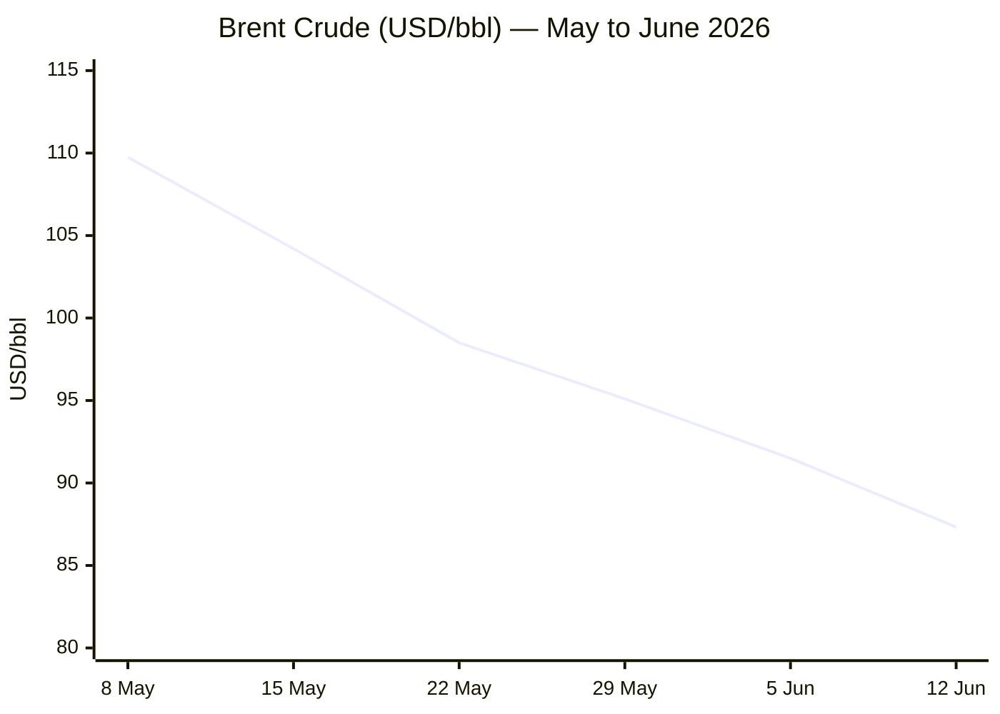
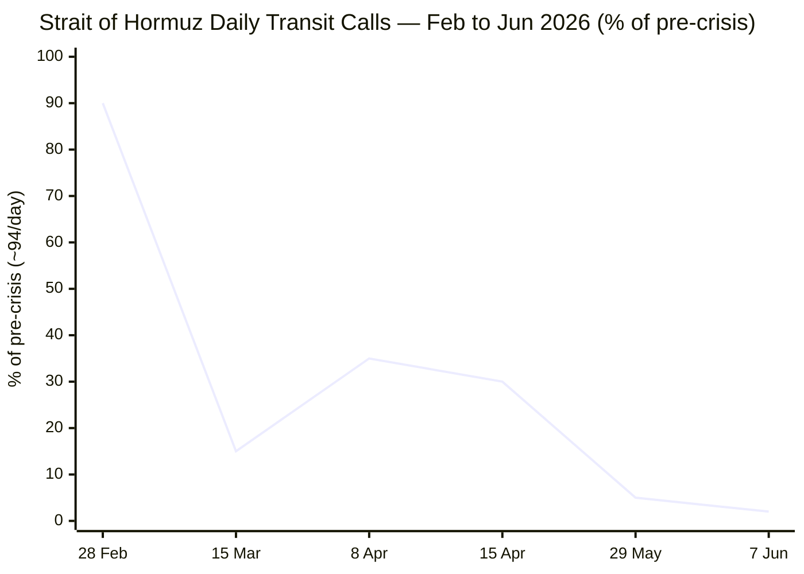

**PHASE 0 COMPLETE** — Run date: **14 June 2026** · 05:44 CET

Day counts:
- Russia–Ukraine War (start 24 Feb 2022): **Day 1,207**
- Iran–US War / Hormuz Crisis (start 28 Feb 2026): **Day 107**
- Israel–Lebanon Ceasefire 2026 (start 16 Apr 2026): **Day 60**

---

**PHASE 1 — Direct fetch pass**Le Monde ❌ — search fallback queued.FAZ ❌ — search fallback queued.Kommersant ❌ — search fallback queued.Xinhua ⚠️ — fetched but content dated 29–30 May 2026 (stale). Search fallback applied.European Parliament ❌ — navigation structure only, no story content. Search-only as per protocol.

Now Tier 2 fetches:IMF ⚠️ — fetched, navigation structure only, no fresh 14 June stories. Search fallback.ECB ⚠️ — navigation only. Search fallback.FAO ⚠️ — page shows March 2026 data (release date 06/03/2026). Will search for June 2026 release.

**PHASE 1 COMPLETE.** Now proceeding to **PHASE 2 — Search pass.**Good. Now Business, EU Affairs, Technology and Data searches:Excellent. Now EU Affairs, Technology, Trends, and FAO data:Excellent data from Straits.live. Now Technology and Trends searches:**PHASE 3–5 COMPLETE.** Story pool assembled. Now proceeding to full assembly.

---

```yaml
---
brief_date: 2026-06-14
version: v1.2.2
run_time: "05:44 CET"
stories_published: 14
categories: [conflict, business, eu_affairs, technology, trends]
alert_counts:
  red: 5
  yellow: 7
  green: 2
ongoing_situations:
  - {name: "Russia–Ukraine War", real_world_start: "2022-02-24", day: 1207}
  - {name: "Iran–US War / Hormuz Crisis", real_world_start: "2026-02-28", day: 107}
  - {name: "Israel–Lebanon Ceasefire 2026", real_world_start: "2026-04-16", day: 60}
sources_fetched: 9
fetch_status:
  le_monde: "❌"
  faz: "❌"
  kommersant: "❌"
  xinhua: "⚠️"
  european_parliament: "❌"
expansion_queue: []
---
```

---

# 🌐 MORNING BRIEF
## Sunday, 14 June 2026 · 05:44 CET
### 14 stories across 5 categories

---

## DIGEST SUMMARY

| # | Category | Headline | Alert |
|---|----------|----------|-------|
| 1 | ⚔️ Conflict | US–Iran peace deal expected Sunday — Hormuz opening imminent | 🔴 |
| 2 | ⚔️ Conflict | Israel pounds south Lebanon as Nabatieh strikes widen | 🔴 |
| 3 | ⚔️ Conflict | Russia–Ukraine: war continues at Day 1,207 with no ceasefire in sight | 🟡 |
| 4 | 💼 Business | Brent drops to $87 on deal optimism — 7-week low | 🔴 |
| 5 | 💼 Business | SpaceX IPO soars 19% in record Wall Street debut | 🟡 |
| 6 | 💼 Business | ECB hikes rates for first time since 2023 to fight Iran-driven inflation | 🔴 |
| 7 | 💼 Business | Global oil inventories depleting at record pace, EIA warns | 🟡 |
| 8 | 🇪🇺 EU Affairs | ECB rate hike triggers stagflation alarm across eurozone | 🔴 |
| 9 | 🇪🇺 EU Affairs | EU AI Act Code of Practice on AI content labelling published | 🟡 |
| 10 | 🇪🇺 EU Affairs | SAFE rearmament instrument on track; 17 member states activate escape clause | 🟡 |
| 11 | 🤖 Technology | EU AI Act Digital Omnibus: high-risk system deadlines deferred to December 2027 | 🟡 |
| 12 | 🤖 Technology | SpaceX AI-in-space bet opens IPO floodgates; Anthropic and OpenAI file confidentially | 🟢 |
| 13 | 📈 Trends | Pakistan cements mediator role as Iran–US deal nears signature | 🟡 |
| 14 | 📈 Trends | Hormuz closure pushes 45 million towards hunger — FAO and UN warn | 🔴 |

> Alert Level key: 🔴 High significance · 🟡 Developing · 🟢 Stable/Routine

---

## 🚨 SIGNAL BOARD

🔴 **Trump declares Iran deal to be signed today (Sunday) — Hormuz "OPEN TO ALL" the moment it is signed; Iran's foreign ministry cautious on timing.**
🔴 **Brent crude at $87.33/bbl — down 18% in one month — as deal optimism erases war risk premium; EIA still forecasts $105 average for June–July on Hormuz closure assumption.**
🔴 **ECB raises deposit rate to 2.25% — first hike since September 2023 — as eurozone CPI hits 3.2% in May and ECB projects full-year 2026 headline inflation at 3.0%.**
🟡 **Israel strikes 20+ locations in south Lebanon on Saturday including Nabatieh; ceasefire framework agreed 4 June but Hezbollah rejected terms; next talks scheduled week of 22 June.**
⚡ **SpaceX IPO closes at $160.95 (+19%) — world's largest-ever IPO at $75bn raised — making Musk the world's first trillionaire; signals AI-infrastructure investment boom despite active Middle East war.**

---

## 🔄 ONGOING SITUATIONS

| Situation | Real-world start | Day # | Last significant development | Status |
|-----------|-----------------|-------|------------------------------|--------|
| Russia–Ukraine War | 24 Feb 2022 | Day 1,207 | No active ceasefire; May Victory Day truce lapsed; ongoing frontline pressure | 🔴 Active |
| Iran–US War / Hormuz Crisis | 28 Feb 2026 | Day 107 | Final deal text agreed 12 June; Trump announces signing Sunday; Hormuz daily transits ~2 vessels vs 94 pre-crisis | 🟡 Ceasefire/Deal imminent |
| Israel–Lebanon Ceasefire 2026 | 16 Apr 2026 | Day 60 | Renewed ceasefire framework signed 4 June; Hezbollah rejected terms; major Israeli strikes on south Lebanon 13 June | 🔴 Active violations |

---

> 🔎 **CONFLICT ANALYST** · 3 updates today

### 1. Iran–US War / Hormuz Crisis — Deal signature expected Sunday 🔴

**Alert:** 🔴
**Summary:** The most consequential development in the 107-day Iran–US war unfolded on Saturday 13 June, as both sides confirmed a final peace deal text was agreed on 12 June. Pakistan's Prime Minister Shehbaz Sharif said finalisation was "likely in the next 24 hours" and that his government was preparing for electronic signing. Trump posted on Truth Social that "The Deal is scheduled to get signed tomorrow, and immediately after it is signed, the Hormuz Strait is OPEN TO ALL." Iran's foreign ministry, however, said signing may take more time, and was cautious about the Sunday timeline. Iranian state media's semi-official Mehr agency published a 14-point draft reportedly including release of $24bn in frozen assets and a 30-day commitment by Iran to reopen the strait. Trump disputed Mehr's version of the terms. The deal has not yet been signed at run time (05:44 CET Sunday).
**Significance:** A signed deal would end the largest maritime supply disruption in the history of the global oil market and unlock a normalisation of Brent crude pricing. Even a signed deal faces weeks of mine-clearing, insurance reinstatement, and tanker reactivation before shipping volumes recover materially.
**Sources:**
- [NBC News — U.S.-Iran deal expected to reopen Strait of Hormuz could be signed within days](https://www.nbcnews.com/world/iran/us-iran-deal-expected-reopen-strait-hormuz-signed-days-both-sides-say-rcna349916) · 13 June 2026
- [CNBC — Trump says peace deal will be signed Sunday after Iran said it remains cautious on timing](https://www.cnbc.com/amp/2026/06/13/trump-iran-deal-strait-of-hormuz.html) · 13 June 2026
- [France 24 — US and Iran contradict each other on Sunday peace deal signing](https://www.france24.com/en/middle-east/20260612-middle-east-live-iran-says-us-war-deal-could-be-signed-remotely-in-coming-days) · 13 June 2026

**Trend:** ↘ De-escalating
**Tags:** #Iran #Hormuz #peace-talks #Pakistan-mediation #MULTI-SOURCE

---

### 2. Israel–Lebanon — Major strikes on Nabatieh as ceasefire framework strains 🔴

**Alert:** 🔴
**Summary:** On Saturday 13 June, Israel issued forced displacement orders for the southern city of Nabatieh and more than 20 other locations across Lebanon, subsequently striking multiple villages in the Nabatieh and Jezzine districts. Lebanon's National News Agency reported five people killed including a local mayor in Rihan municipality (Jezzine district), one Lebanese army soldier severely wounded near Kfar Remman–Nabatieh road, and strikes targeting Kfar Tebnit, Rihan, Deir Qanun al-Nahr, and surrounding areas. The operations continue notwithstanding the renewed ceasefire framework agreed on 4 June in US-mediated Washington talks. Hezbollah formally rejected the 4 June agreement's terms on 4 June, demanding full Israeli withdrawal before any ceasefire. A further round of talks is scheduled for the week of 22 June.
**Significance:** Hezbollah's rejection of the conditional ceasefire framework and continued Israeli operations mean the Lebanon theatre remains unresolved, complicating the broader Iran–US deal which all parties have said should encompass Lebanon. The strikes on Lebanese army personnel risk drawing Beirut into formal hostilities.
**Sources:**
- [Al Jazeera — Five killed as Israel hits south Lebanon, issues forced displacement orders](https://www.aljazeera.com/news/2026/6/13/one-killed-as-israel-hits-south-lebanon-issues-forced-displacement-orders) · 13 June 2026
- [France 24 — Lebanon reports Israeli strikes in south and east amid broad evacuation warnings](https://www.france24.com/en/middle-east/20260613-lebanon-reports-israeli-strikes-in-south-and-east-amid-broad-evacuation-warnings) · 13 June 2026
- [The New Arab — Israel strikes South Lebanon, issues broad evacuation warnings](https://www.newarab.com/news/israel-strikes-south-lebanon-issues-broad-evacuation-warnings) · 13 June 2026

**Trend:** ↗ Escalating
**Tags:** #Lebanon #Israel #Hezbollah #ceasefire #MULTI-SOURCE

📎 See also: Trends § Story 14 — Hormuz closure displacing 45 million towards hunger; Lebanon aid convoys obstructed

---

### 3. Russia–Ukraine War — Day 1,207: Frontline grinding; no ceasefire framework 🟡

**Alert:** 🟡
**Summary:** The Russia–Ukraine war grinds into its 1,207th day with no active ceasefire framework in place. The May 2026 Victory Day truce (9–11 May) lapsed amid mutual violation accusations. US-brokered talks involving Zelensky and Putin remain episodic; Washington had targeted a June framework but that deadline has now passed without a deal. Russia continues incremental advances across the Donetsk and Zaporizhzhia fronts. Russia's record aerial strike of 13–14 May (1,567 drones, 56 missiles; 27 killed in Kyiv) demonstrated continued Russian ability to conduct large-scale strategic strikes. Diplomatic bandwidth from Washington has been overwhelmingly absorbed by the Iran–US deal process.
**Significance:** With US attention dominated by the Iran deal, Ukraine faces a diplomatic vacuum. EU and UK support for Ukraine continues but the absence of a comprehensive US-backed framework leaves Kyiv exposed to continued Russian pressure through the summer campaign season.
**Sources:**
- [House of Commons Library — Developments in Ukraine peace talks](https://commonslibrary.parliament.uk/research-briefings/cbp-10251/) · 7 June 2026
- [Wikipedia — May 2026 Russo-Ukrainian truce](https://en.wikipedia.org/wiki/May_2026_Russo-Ukrainian_truce)

**Trend:** → Stable
**Tags:** #Ukraine #Russia #frontline #peace-talks

📚 *Background reading:* [Chatham House — How a Russia–Ukraine ceasefire could imperil Ukrainian and European security](https://www.chathamhouse.org/2026/05/how-russia-ukraine-ceasefire-could-imperil-ukrainian-and-european-security/02-ukraine) · May 2026 · [ISW — Institute for the Study of War](https://www.understandingwar.org) · Ongoing

---

> 💼 **BUSINESS ANALYST** · 4 updates today

### 4. Brent crude falls to $87.33 — 7-week low — on Iran deal optimism 🔴

**Alert:** 🔴
**Summary:** Brent crude closed at $87.33/bbl on Friday 13 June (Aug 2026 contract), down 3.37% on the day and down 18% over the prior month. The decline accelerated after Trump cancelled strikes on Iran on 11 June and declared a deal "largely negotiated." The day range on Friday was $85.80–$89.90 — the lowest Brent trading range since late March. Over a 12-month horizon, Brent is still +17.65%, reflecting the war premium accumulated since 28 February. The EIA's 9 June Short-Term Energy Outlook maintained a $105/bbl average forecast for June–July, based on an assumption the strait remains effectively closed in the near term. Brent has significantly undercut this forecast already, suggesting markets are pricing in deal materialisation faster than the EIA assumed.
**Market signal:** Bearish for crude in the near-term as deal optimism drives the war premium out; but structural supply dislocation — mines, damaged infrastructure, tanker scarcity — means downside is likely capped well above pre-war levels.
**Sources:**
- [Oilprice.com — Brent Crude Oil Futures](https://oilprice.com/futures/brent/) · 13 June 2026
- [Trading Economics — Brent crude oil](https://tradingeconomics.com/commodity/brent-crude-oil) · 13 June 2026
- [EIA Short-Term Energy Outlook](https://www.eia.gov/outlooks/steo/) · 9 June 2026

**Trend:** ↘ De-escalating
**Tags:** #Brent #oil-price #Hormuz #energy-markets #MULTI-SOURCE

📎 See also: Conflict § Story 1 — Iran–US deal expected Sunday; signing would trigger immediate Hormuz reopening commitment

---

### 5. SpaceX IPO closes +19% — world's largest-ever at $75bn raised 🟡

**Alert:** 🟡
**Summary:** SpaceX debuted on Nasdaq (ticker: SPCX) on 12 June, pricing shares at $135, opening at $150, and closing at $160.95 — a 19% first-day gain. The offering raised $75 billion — the largest IPO in stock market history — giving the company a market capitalisation above $2 trillion. Elon Musk, who owns approximately half of SpaceX, became the world's first trillionaire on paper. The Dow gained 0.7%, the S&P 500 +0.5%, and Nasdaq +0.3% on the day. Goldman Sachs' John Waldron described the IPO as evidence of global capital markets' willingness to fund "the AI infrastructure build." Notably, both Anthropic and OpenAI have confidentially filed to go public on the back of investor enthusiasm.
**Market signal:** Bullish for the AI and space-tech complex; the successful debut signals a re-opening of the large-cap technology IPO window that had been dormant since 2021.
**Sources:**
- [NBC News — SpaceX stock gains 19% its first trading day](https://www.nbcnews.com/business/markets/spacex-ipo-stock-price-rcna349760) · 12 June 2026
- [CNN — SpaceX shares debut after biggest IPO in history](https://www.cnn.com/2026/06/12/business/live-news/spacex-goes-public-ipo) · 12 June 2026
- [Fortune — SpaceX's record IPO has Wall Street torn](https://fortune.com/2026/06/11/spacex-ipo-largest-history-wall-street-analysts-split-valuation-debate/) · 11 June 2026

**Trend:** ↗ Escalating
**Tags:** #IPO #equity-rally #AI #Nasdaq #MULTI-SOURCE

---

### 6. ECB hikes rates to 2.25% — first increase since 2023 🔴

**Alert:** 🔴
**Summary:** The ECB Governing Council on 11 June raised its deposit facility rate by 25 basis points to 2.25%, with effect from 17 June 2026 — the first rate increase since September 2023. The move was widely anticipated, with markets pricing near-100% probability. The ECB simultaneously revised its inflation projections to 3.0% headline for 2026 (up from 2.6%) and cut its growth forecast to 0.8% for 2026 (from 1.2%). ECB President Christine Lagarde cited the Iran war as generating inflationary pressures. Money markets now price a second 25bp hike in September. ECB chief economist Philip Lane warned the outlook remains "highly uncertain" with "upside risks to inflation and downside risks to growth."
**Market signal:** Bearish for eurozone equities and credit in the near term as borrowing costs rise into a contracting economy; EUR/USD finds modest support from the policy differential narrowing.
**Sources:**
- [ECB — Monetary policy decisions](https://www.ecb.europa.eu/press/pr/date/2026/html/ecb.mp260611~4d41bd5e83.en.html) · 11 June 2026
- [Euronews — ECB raises interest rates for the first time in three years](https://www.euronews.com/business/2026/06/11/ecb-raises-interest-rates-for-the-first-time-in-three-years-as-iran-war-fuels-inflation) · 11 June 2026
- [CNBC — ECB hikes interest rates for first time since 2023](https://www.cnbc.com/2026/06/11/ecb-hikes-interest-rates.html) · 11 June 2026

**Trend:** ↗ Escalating
**Tags:** #ECB #interest-rates #inflation #stagflation #MULTI-SOURCE

📎 See also: EU Affairs § Story 8 — ECB hike triggers eurozone stagflation alarm

---

### 7. EIA warns global oil inventories depleting at record pace 🟡

**Alert:** 🟡
**Summary:** The EIA's 9 June Short-Term Energy Outlook warned that global oil markets remain "highly volatile" and that oil inventories are depleting at a record pace due to the Hormuz disruption. The EIA's reference-case forecast assumes the strait will remain effectively closed in the near term, with oil shipments resuming in Q3 2026 but not recovering to pre-conflict volumes before early 2027. Global oil demand is now projected to fall 1.1 million barrels per day in 2026 versus 2025, a dramatic reversal from the February 2026 forecast of +1.2 million b/d growth. Strategists separately warn physical shortages could begin to bite European refiners by end-June if deals are not signed.
**Market signal:** Neutral with upside risk — current price decline reflects deal optimism but inventory depletion will cap any medium-term downside; a deal failure would see Brent spike sharply.
**Sources:**
- [EIA Short-Term Energy Outlook](https://www.eia.gov/outlooks/steo/) · 9 June 2026

**Trend:** → Stable
**Tags:** #oil-price #Hormuz #supply-shock #energy-markets #data-point

📚 *Background reading:* [RAND — Energy security and the Iran conflict](https://www.rand.org) · [Congressional Research Service — Iran Conflict and the Strait of Hormuz](https://www.congress.gov/crs-product/R45281)

---

> 🇪🇺 **EU AFFAIRS ANALYST** · 3 updates today

### 8. ECB rate hike triggers stagflation alarm across eurozone 🔴

**Alert:** 🔴
**Summary:** The ECB's 11 June rate hike to 2.25% — its first since 2023 — arrives at what Euronews described as "a difficult moment for the eurozone." The bloc's economy contracted 0.2% in Q1 2026. Eurostat flash data puts May 2026 CPI at 3.2% (up from 3.0% in April), the highest since September 2023. Energy inflation remains the key driver at +10.9% YoY in May. EC Commissioner Dombrovskis formally flagged a "stagflationary shock" in May and the Commission's Spring Forecast revised growth down and inflation up. The ECB now projects eurozone growth at 0.8% for 2026 — less than half the pre-conflict January projection of 1.7%. A September follow-up hike is now widely priced.
**Legislative/policy stage:** Rate decision in force from 17 June 2026. Next ECB Governing Council meeting: 23 July 2026. Full Eurostat May CPI data release: 17 June 2026.
**Sources:**
- [Eurostat — Euro area annual inflation up to 3.2%](https://ec.europa.eu/eurostat/web/products-euro-indicators/w/2-02062026-ap) · 2 June 2026
- [ECB — Monetary policy decisions](https://www.ecb.europa.eu/press/pr/date/2026/html/ecb.mp260611~4d41bd5e83.en.html) · 11 June 2026
- [CNBC — EU warns Iran war is causing stagflation shock](https://www.cnbc.com/2026/05/18/eu-stagflation-shock-iran-war-oil-prices.html) · 18 May 2026

**Trend:** ↗ Escalating
**Tags:** #ECB #inflation #stagflation #eurozone #MULTI-SOURCE

📎 See also: Business § Story 6 — ECB rate decision detail

---

### 9. EU AI Act: Commission publishes Code of Practice on AI content labelling 🟡

**Alert:** 🟡
**Summary:** The European Commission published on 10 June 2026 the final Code of Practice on marking and labelling of AI-generated content, meeting the timeline set under Article 50 of the EU AI Act. The voluntary framework provides standardised methods for providers of generative AI systems to implement transparency obligations. The publication coincides with the EU AI Act's transparency provisions coming into force on 2 August 2026. Separately, the Digital Omnibus on AI — agreed provisionally on 7 May — defers high-risk AI system obligations under Annex III from August 2026 to December 2027, providing significant compliance relief for enterprises deploying AI in healthcare, education, and employment contexts.
**Legislative/policy stage:** Code of Practice: in force from 10 June 2026. Transparency provisions (Article 50): applicable 2 August 2026. Annex III HRAIS: deferred to 2 December 2027. Full EU AI Act applicability: 2 August 2026.
**Sources:**
- [EU Digital Strategy — AI Act](https://digital-strategy.ec.europa.eu/en/policies/regulatory-framework-ai) · 10 June 2026
- [Inside Privacy — EU AI Act Update: Digital Omnibus](https://www.insideprivacy.com/artificial-intelligence/eu-ai-act-update-timeline-relief-targeted-simplification-and-new-prohibitions/) · May 2026

**Trend:** → Stable
**Tags:** #digital-regulation #AI-regulation #EU-institutions #AI

---

### 10. SAFE rearmament: 17 member states activate defence escape clause 🟡

**Alert:** 🟡
**Summary:** As of June 2026, 17 EU member states have activated the national escape clause under the EU Stability and Growth Pact, allowing additional defence spending up to 1.5% of GDP annually through 2028 without triggering excessive deficit procedures. The activation forms a key element of the ReArm Europe/Readiness 2030 plan, which aims to mobilise €800 billion in defence investment. The SAFE instrument (€150bn loan facility) has been operational since May 2025 and funds joint procurement of weapons systems with at least 65% European content. EU defence spending has increased 60% since 2020. The escalating Iran conflict and ongoing Russia–Ukraine war have accelerated member state uptake.
**Legislative/policy stage:** Escape clause activations: in force. SAFE loans: disbursement ongoing. Readiness 2030 plan: implementation phase, with interim review scheduled in 2027.
**Sources:**
- [Council of the EU — European defence readiness](https://www.consilium.europa.eu/en/policies/european-defence-readiness/) · June 2026
- [Wikipedia — Security Action for Europe](https://en.wikipedia.org/wiki/Security_Action_for_Europe)

**Trend:** ↗ Escalating
**Tags:** #EU-defence #EU-institutions #EU-funds #institutional

📚 *Background reading:* [ECFR — EU defence strategic autonomy](https://ecfr.eu) · [Bruegel — 2026 European energy crisis fiscal response tracker](https://www.bruegel.org/dataset/2026-european-energy-crisis-fiscal-response-tracker)

---

> 🤖 **TECHNOLOGY ANALYST** · 2 updates today

### 11. EU AI Act Digital Omnibus: high-risk AI deadlines deferred 16 months 🟡

**Alert:** 🟡
**Summary:** The provisional agreement reached on 7 May 2026 on the Digital Omnibus on AI — the first formal amendment package to the EU AI Act since its 2024 adoption — introduces a staggered deferral of compliance deadlines. Annex III high-risk AI system obligations (use-based, covering healthcare, employment, education, and law enforcement) are deferred from 2 August 2026 to 2 December 2027 — a 16-month extension. Annex I product-regulated high-risk systems receive a 12-month extension to 2 August 2028. The package also includes targeted simplification measures. Full EU AI Act applicability (including transparency rules under Article 50) remains on schedule for 2 August 2026. The final Code of Practice on AI content labelling was published 10 June.
**Analyst note:** The 16-month deferral for Annex III systems will provide significant compliance breathing space for healthcare, HR, and education AI providers over the 2026–27 cycle, but enterprises should begin documentation and testing now given the December 2027 deadline is not a further extension.
**Sources:**
- [Inside Privacy — EU AI Act Update: Digital Omnibus](https://www.insideprivacy.com/artificial-intelligence/eu-ai-act-update-timeline-relief-targeted-simplification-and-new-prohibitions/) · May 2026
- [EU Digital Strategy — AI Act](https://digital-strategy.ec.europa.eu/en/policies/regulatory-framework-ai) · 10 June 2026

**Trend:** → Stable
**Tags:** #digital-regulation #AI-regulation #AI #EU-institutions

---

### 12. SpaceX IPO opens AI-in-space investment cycle; Anthropic and OpenAI file confidentially 🟢

**Alert:** 🟢
**Summary:** SpaceX's record Nasdaq debut on 12 June — raising $75bn at a $1.77 trillion valuation — signals a new phase of AI-infrastructure investment. SpaceX's prospectus positioned the company as a provider of AI data centres in space. Goldman Sachs' John Waldron described the IPO as demonstrating capital markets' "willingness to finance this AI infrastructure build and this build in space." Following the debut, CNBC and Fortune reported that both Anthropic and OpenAI have confidentially filed with the SEC to go public, potentially targeting late 2026 or 2027. NYU finance professor Aswath Damodaran cautioned that SpaceX's $1.77 trillion valuation already stretches the bull case, calling parts of the prospectus "a hallucination."
**Analyst note:** The dual filing of Anthropic and OpenAI within weeks of the SpaceX IPO suggests that AI-pure-play public market issuance will materialise in the 12–24-month window, fundamentally reshaping the technology IPO landscape and investor portfolios.
**Sources:**
- [NBC News — SpaceX stock gains 19% its first trading day](https://www.nbcnews.com/business/markets/spacex-ipo-stock-price-rcna349760) · 12 June 2026
- [Fortune — SpaceX's record IPO](https://fortune.com/2026/06/11/spacex-ipo-largest-history-wall-street-analysts-split-valuation-debate/) · 11 June 2026

**Trend:** ↗ Escalating
**Tags:** #AI #IPO #data-centre #autonomous-systems

📚 *Background reading:* [CSIS — Technology and geopolitical competition](https://www.csis.org) · [Atlantic Council — Digital innovation and investment](https://www.atlanticcouncil.org)

---

> 📈 **TRENDS ANALYST** · 2 updates today

### 13. Pakistan cements mediator role as Iran–US deal approaches signature 🟡

**Alert:** 🟡
**Summary:** Pakistan's emergence as the principal mediator between the United States and Iran represents one of the most significant diplomatic shifts in South Asian foreign policy since Islamabad's role as a backchannel between the US and China in the 1970s. Pakistani PM Shehbaz Sharif has led a multination mediation effort since the Islamabad Talks of 11–12 April, culminating in Pakistan preparing for electronic co-signing of the deal. Iran allowed 20 Pakistani-flagged vessels to transit the Hormuz strait — a trust-building measure. Pakistan's own economy was acutely affected by the crisis, as it imports over 85% of crude via Hormuz and fertiliser costs have soared ahead of the harvest season.
**Horizon:** Medium-term structural shift (months to 1 year): Pakistan's successful mediation — if the deal holds — would elevate Islamabad's strategic status in US-Iran relations and across the Gulf, with potential downstream effects on its own debt relief and IMF programme negotiations.
**Sources:**
- [The Diplomat — Pakistan Is Mediating Between Iran and the US Because It Can – and It Must](https://thediplomat.com/2026/04/pakistan-is-mediating-between-iran-and-the-us-because-it-can-and-it-must/) · April 2026
- [Al Jazeera — Pakistan to continue with Iran-US mediation despite obstacles](https://www.aljazeera.com/news/2026/4/2/pakistan-to-continue-with-iran-us-mediation-despite-obstacles) · April 2026

**Trend:** ↘ De-escalating
**Tags:** #Pakistan-mediation #diplomacy #mediation #Iran #Hormuz

---

### 14. Hormuz closure pushes 45 million towards hunger — FAO and UN warn 🔴

**Alert:** 🔴
**Summary:** The near-total closure of the Strait of Hormuz since late February — reducing daily transits from ~94 vessels to approximately 2–4 per day — is generating a widening food security emergency. The UN and FAO have warned that an additional 45 million people face acute hunger risk if the crisis persists. Bahrain's foreign minister, citing UN estimates, warned of 4 million additional people pushed into poverty across the Arab world alone. Around 46% of global urea supply (used in over 90% of industrial fertiliser production) originates from the Gulf region. Disrupted fertiliser flows are raising food production costs across Asia and Africa. The UN OCHA describes the disruption as a "widening humanitarian and economic shock far beyond the Middle East."
**Horizon:** Short-to-medium term: if the Iran–US deal is signed Sunday and Hormuz reopens, fertiliser flows will take weeks to months to normalise; food price inflation will persist into Q3 2026 at minimum even under the optimistic scenario. The FAO Food Price Index rose to 130.8 points in May 2026 — up 2.9% year-on-year — and is expected to increase further if Hormuz remains restricted.
**Sources:**
- [UN News — Despite ceasefire, Hormuz tensions continue to throttle supply chains](https://news.un.org/en/story/2026/04/1167365) · April 2026
- [FAO — FAO Food Price Index broadly stable in May](https://www.fao.org/newsroom/detail/fao-food-price-index-broadly-stable-in-may-even-as-cereal-quotations-increase/en) · 6 June 2026
- [Statista — Gulf Disruption Puts Global Fertilizer Supply at Risk](https://www.statista.com/chart/amp/35981/share-of-global-seaborne-fertilizer-trade-from-the-arabian-gulf-and-destination-breakdown) · 2026

**Trend:** → Stable
**Tags:** #food-security #Hormuz #humanitarian #supply-shock #MULTI-SOURCE

📚 *Background reading:* [CFR — Global food security and the Iran crisis](https://www.cfr.org) · [ECFR — European energy and food security](https://ecfr.eu)

---

## 📊 KEY DATA OF THE DAY

> 📊 **DATA OFFICER** · 7 indicators

| Indicator | Value | Δ vs prior session | Δ vs 7 days ago | Note | Source | URL |
|-----------|-------|-------------------|-----------------|------|--------|-----|
| EUR/USD | 1.1574 | N/A (weekend) | −0.05% | Euro holding just below 1.16; ECB hike on 11 June provides support; deal optimism weakens USD | ECB / Trading Economics | [link](https://tradingeconomics.com/euro-area/currency) |
| Brent Crude (USD/bbl) | 87.33 | −3.37% | −7.98% | Lowest since late March; deal optimism driving war premium out; EIA still forecasts $105 avg for June–July | Oilprice.com / Investing.com | [link](https://oilprice.com/futures/brent/) |
| Gold (XAU/USD) | 4,224.41 | N/A (weekend) | N/A | Market closed 13–14 June; last close $4,218.78 on 13 June; down from Jan 2026 peak of $5,602 | JM Bullion / LiteFinance | [link](https://www.jmbullion.com/charts/gold-price/) |
| IMF Global Growth 2026 | 3.1% | −0.2pp vs Jan WEO | −0.3pp vs Oct WEO | April WEO revision; assumes limited conflict; adverse scenario: 2.5% | IMF WEO April 2026 | [link](https://www.imf.org/en/publications/weo/issues/2026/04/14/world-economic-outlook-april-2026) |
| EU CPI YoY (latest) | 3.2% | +0.2pp vs April | +0.6pp vs Feb | May 2026 flash estimate; highest since Sep 2023; energy +10.9% YoY | Eurostat | [link](https://ec.europa.eu/eurostat/web/products-euro-indicators/w/2-02062026-ap) |
| FAO Food Price Index | 130.8 | −0.2 pts vs April (−0.2%) | +2.9% vs May 2025 | May 2026 — latest available; broadly stable but cereal +2.6% MoM | FAO | [link](https://www.fao.org/newsroom/detail/fao-food-price-index-broadly-stable-in-may-even-as-cereal-quotations-increase/en) |
| Strait of Hormuz daily transits | ~2–4 vessels | N/A | vs ~94/day pre-crisis | IMF PortWatch data to 7 June; Iran June 11 full closure declaration; war-risk insurance 8× pre-crisis | Straits.live / IMF PortWatch | [link](https://straits.live/) |

**Data commentary:** The Brent crude price at $87.33 represents the most direct market pricing of Sunday's anticipated deal signing — a 22% decline from the >$110 levels seen during peak Hormuz crisis in April. Yet the disconnect between market optimism and structural reality is stark: the FAO index at 130.8 — 2.9% above a year ago — reflects upstream fertiliser and food pressures that will persist well into Q3 regardless of a deal, and the ECB's first rate hike since 2023 signals that the inflation consequences of the Iran war are now too material for the eurozone to absorb passively. The combination of falling Brent, rising CPI, and slowing growth represents a textbook stagflationary dynamic that monetary policy alone cannot resolve.

---

## 📊 CHARTS


*Sources: Oilprice.com, Investing.com (12 June 2026). Data points represent approximate weekly closes.*


*Sources: IMF PortWatch, Straits.live, NBC News tracking data. Pre-crisis baseline ~94 vessels/day. The 8 Apr spike reflects the brief conditional ceasefire reopening. 7 Jun is the most recent IMF PortWatch finalised date.*

---

## ⚙️ AGENT METADATA

| Field | Value |
|-------|-------|
| Agent version | MORNING BRIEF v1.2.2 |
| Run timestamp | 2026-06-14T05:44:12+02:00 |
| Fetch status | Le Monde ❌ · FAZ ❌ · Kommersant ❌ · Xinhua ⚠️ (stale content, 29–30 May) · EP ❌ (navigation only) |
| Sources queried | 9 / 11 (ECB direct fetch ⚠️ navigation only; FAO direct fetch ⚠️ stale; both covered by search) |
| Stories surfaced | 24 before editorial filter |
| Stories published | 14 after editorial filter |
| Languages processed | EN, FR (via search summaries) |
| Output language | English (British) |
| Date validated | ✅ Confirmed 14 June 2026 |
| Expansion Queue | None |

---

*MORNING BRIEF is an AI-assisted digest. All summaries are paraphrased from original sources. Verify time-sensitive information at the linked URLs before acting. Output language: British English.*
