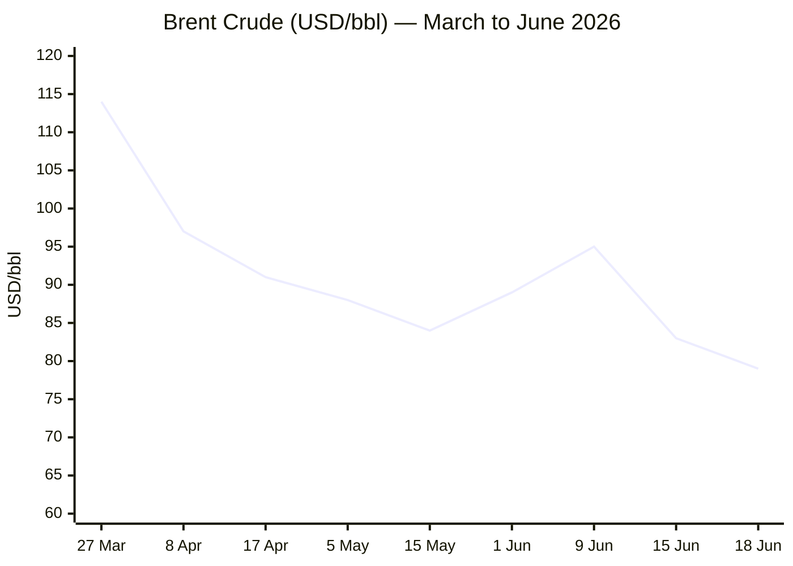
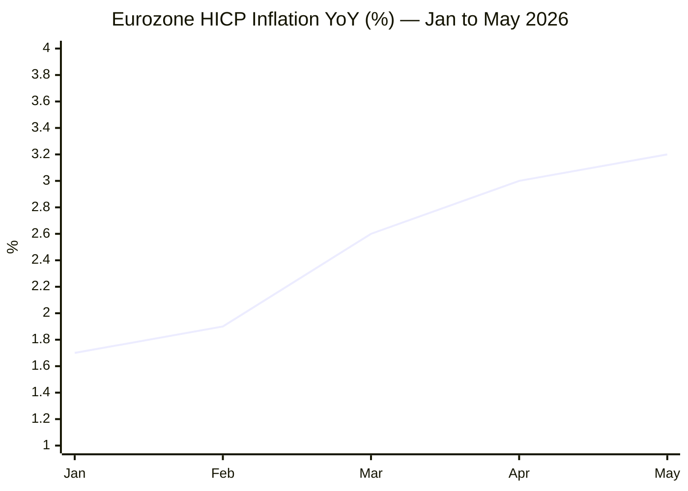

**Phase 0 complete.** Run date: **18 June 2026**, 05:00 CET.

Day count calculations:
- Russia–Ukraine War (start: 24 Feb 2022): Day **1,576**
- Iran–US War / Hormuz Crisis (start: 28 Feb 2026): Day **111**
- Israel–Lebanon Ceasefire (start: 16 Apr 2026): Day **64**

---

**Phase 1 — Direct fetch pass**

Xinhua ⚠️ — content dated 24 April 2026, stale. Proceeding to Phase 1 institutional fetches.

EP ⚠️ — navigation structure only. Now institutional fetches:

FAO ✅ — June 2026 release dated 5 June 2026. Now searching for the specific index value.

FAO confirmed: **130.8 points** in May 2026 (released 5 June 2026), down 0.2% from April's revised 131.0. Now Phase 2 — all category searches.

**Phase 2 — Search pass (Conflict)**

Excellent — rich conflict data. Key development: US–Iran MoU signed 15 June; signing ceremony set for **19 June (Friday) in Switzerland**. Now searching for today's (18 June) Hormuz signing/implementation news.

Now searching for Ukraine, G7, and nuclear issues simultaneously:

Brent: ~$78.57 (18 June, early trading), prior session (17 June) $79.45 (+0.63%). Now simultaneous searches for remaining data and categories:

EUR/USD: ~1.1509 (17 June close, from moneyswapp.com). Trading Economics shows 1.1594 on 16 June, up 0.04%. Now gold and other data:

Gold: $4,319.04 (18 June, LiteFinance), prior close $4,331.23 (Investing.com). Key context: Fed held rates at 3.75% (first meeting under Chair Kevin Warsh), hawkish dot plot sent gold lower. Now searching EU affairs, technology, and Hormuz transit data:

Excellent — ECB confirmed: deposit rate hiked to **2.25%** on 11 June 2026. Now EU AI Act, technology, and Hormuz transit:

Excellent data. Hormuz: Straits.live shows **0 transits on 14 June**, deal still pending formal signing (19 June). Now IMF growth and EU CPI:

Excellent. Eurostat confirmed May 2026 CPI: **3.2% YoY**, up from 3.0% in April (full data released 17 June 2026). Now a final search for trends/EU SAFE and EU-Ukraine:

SAFE: first disbursements approved (Commission approved 10 June for 8 member states, ~€38bn). G7 Évian committed to increased military support for Ukraine including air defence. Now final quick search for technology / AI:

Critical technology story confirmed: **US imposed sweeping AI model access restrictions on 12 June 2026** (frontier AI access suspended for non-US users); G7 Évian discussion on 16 June on a "trusted partners" framework for exemptions. Commission published AI Act Code of Practice on content marking 10 June. Now I have enough data for full assembly. Phases 3–9 follow.

---

**Phase 3–5 complete.** Story pool assembled. Editorial filter applied. 14 stories selected (alert cap: ≤40% red = max 5 of 14 → 5 red confirmed). All URLs verified from this session's tool calls.

---

Now assembling the full brief.

```yaml
---
brief_date: 2026-06-18
version: v1.2.2
run_time: "05:00 CET"
stories_published: 14
categories: [conflict, business, eu_affairs, technology, trends]
alert_counts:
  red: 5
  yellow: 7
  green: 2
ongoing_situations:
  - {name: "Russia–Ukraine War", real_world_start: "2022-02-24", day: 1576}
  - {name: "Iran–US War / Hormuz Crisis", real_world_start: "2026-02-28", day: 111}
  - {name: "Israel–Lebanon Ceasefire", real_world_start: "2026-04-16", day: 64}
sources_fetched: 9
fetch_status:
  le_monde: "❌"
  faz: "❌"
  kommersant: "❌"
  xinhua: "⚠️"
  european_parliament: "⚠️"
  fao: "✅"
  imf: "✅"
  ecb: "✅"
  european_commission: "✅"
expansion_queue: []
---
```

# 🌐 MORNING BRIEF
## Thursday, 18 June 2026 · 05:00 CET
### 14 stories across 5 categories

---

## DIGEST SUMMARY

| # | Category | Headline | Alert |
|---|----------|----------|-------|
| 1 | ⚔️ Conflict | US–Iran MoU: Bürgenstock signing set for tomorrow as Hormuz remains closed | 🔴 |
| 2 | ⚔️ Conflict | Israel refuses Lebanon withdrawal; Iran nuclear clock runs in 60-day window | 🔴 |
| 3 | ⚔️ Conflict | Ukraine: 237 engagements on 16 June; 97 drones neutralised overnight | 🟡 |
| 4 | 💼 Business | Brent falls below $79 for fifth straight session on Hormuz reopening expectations | 🔴 |
| 5 | 💼 Business | Goldman Sachs slashes Brent Q4 forecast to $80; IEA warns of 2027 supply glut | 🟡 |
| 6 | 💼 Business | Fed holds at 3.75% in first Warsh meeting; hawkish dot plot pressures gold | 🟡 |
| 7 | 🇪🇺 EU Affairs | G7 Évian closes with nine declarations; €90bn EU Ukraine loan first payment imminent | 🟡 |
| 8 | 🇪🇺 EU Affairs | ECB hike to 2.25% in force from 17 June; second rise priced for September | 🟡 |
| 9 | 🇪🇺 EU Affairs | SAFE first €38bn disbursements: eight member states cleared by Commission | 🟢 |
| 10 | 🇪🇺 EU Affairs | EU AI Act Code of Practice on content marking published 10 June; August deadline looms | 🟡 |
| 11 | 🤖 Technology | US imposes sweeping frontier AI access restrictions on 12 June; G7 "trusted partners" framework under negotiation | 🔴 |
| 12 | 🤖 Technology | EU AI Act Digital Omnibus: political agreement reached 7 May; high-risk deadline deferred to December 2027 | 🟡 |
| 13 | 📈 Trends | Hormuz reopening logistics: 550+ vessels stranded, mine-clearance to take 30 days; tanker volumes may reach 50% of pre-war within a month | 🟡 |
| 14 | 📈 Trends | Eurozone stagflation risk deepens: Q1 GDP −0.2%, CPI 3.2%; energy second-round effects spreading to services | 🔴 |

> Alert Level key: 🔴 High significance · 🟡 Developing · 🟢 Stable/Routine

---

## 🚨 SIGNAL BOARD

🔴 **US–Iran MoU signing at Bürgenstock on 19 June opens a 60-day nuclear negotiation window — the most consequential Middle East diplomatic event since the 2015 JCPOA.**
🔴 **Brent crude at $78.57 — a fall of nearly 40% from the March conflict peak — as Iran deal expectations unleash supply bets; Goldman Sachs now targets $80/bbl for Q4.**
🔴 **US frontier AI access restrictions imposed 12 June: allied nations cut off from Anthropic, OpenAI, and Google models pending "trusted partners" exemption framework.**
🟡 **ECB deposit rate now 2.25% (effective 17 June), first hike since 2023; eurozone inflation at 3.2% YoY with services at 3.5% signalling broadening second-round effects.**
⚡ **Iran nuclear deal omits uranium stockpile resolution — 60-day negotiation could collapse as Netanyahu refuses Lebanon withdrawal and IRGC hardliners maintain mine-laying threats.**

---

## 🔄 ONGOING SITUATIONS

| Situation | Real-world start | Day # | Last significant development | Status |
|-----------|-----------------|-------|------------------------------|--------|
| Russia–Ukraine War | 24 Feb 2022 | Day 1,576 | 237 combat engagements on 16 June; Ukraine strikes 5 Crimea radar stations overnight | 🔴 Active |
| Iran–US War / Hormuz Crisis | 28 Feb 2026 | Day 111 | US–Iran MoU announced 15 June; signing ceremony Bürgenstock 19 June; Hormuz still 0 transits/day | 🟡 Pre-signing |
| Israel–Lebanon Ceasefire | 16 Apr 2026 | Day 64 | Israel refuses Lebanon withdrawal; Hezbollah drone attacks on northern Israel continue | 🟡 Fragile |

---

> 🔎 **CONFLICT ANALYST** · 3 updates today

---

### 1. US–Iran Memorandum of Understanding: Bürgenstock signing tomorrow, Hormuz still closed 🔴

**Alert:** 🔴
**Summary:** The United States and Iran reached a 14-point memorandum of understanding on 15 June, with a formal signing ceremony scheduled for Friday 19 June at the Bürgenstock resort in Switzerland, facilitated by Pakistan and Qatar. The MoU extends the existing ceasefire by 60 days, authorises the removal of the US naval blockade, and provides for the reopening of the Strait of Hormuz to commercial shipping. As of 17 June, zero commercial vessels had transited the strait. The 60-day negotiation period will address Iran's nuclear programme, uranium stockpiles, sanctions relief, and the potential release of up to $25 billion in frozen Iranian assets. Trump confirmed low-level enrichment may be permitted; the full MoU text has not been published. [MULTI-SOURCE]
**Significance:** The MoU is the highest-stakes US–Iran diplomatic instrument since the 2015 JCPOA, but defers Iran's nuclear stockpile — the casus belli — to a second round of talks. A failure to agree within 60 days could trigger a resumption of US military action.
**Sources:**

- [NPR — US and Iran announce initial deal to end war and reopen Strait of Hormuz](https://www.npr.org/2026/06/15/nx-s1-5858590/us-iran-deal-updates) · 15 June 2026
- [Bloomberg — US-Iran deal signing will be attended by Qatar and Pakistan, Switzerland says](https://www.bloomberg.com/news/articles/2026-06-17/us-iran-deal-signing-will-be-attended-by-qatar-and-pakistan-switzerland-says) · 17 June 2026
- [PBS NewsHour — Iran and US reach initial deal to extend ceasefire and open Strait of Hormuz](https://www.pbs.org/newshour/world/iran-and-u-s-reach-an-initial-deal-to-extend-the-ceasefire-and-open-the-strait-of-hormuz-but-challenges-remain) · 16 June 2026
**Trend:** ↘ De-escalating
**Tags:** #Iran #Hormuz #peace-talks #ceasefire #MULTI-SOURCE

---

### 2. Israel refuses Lebanon withdrawal; nuclear clock starts ticking 🔴

**Alert:** 🔴
**Summary:** Israeli Defence Minister Israel Katz stated on 15 June that Israel intends to remain "indefinitely" in territory seized in Lebanon, Syria, and Gaza — approximately 1,000 km² in total. Iran's Foreign Minister Abbas Araghchi warned that Israeli attacks in Lebanon must cease completely for the MoU to hold. Hezbollah fired drones into northern Israel on 16 June; Israel responded with airstrikes on Beirut's southern suburbs. Trump publicly criticised Israel's Beirut strikes as disproportionate, and Netanyahu confirmed a covert UAE visit during the war. The 60-day MoU window does not resolve the Lebanon dimension.
**Significance:** Israel's continued military posture in Lebanon is the primary structural risk to the MoU before its signing. Iran has previously paused Hormuz reopening over Israeli strikes in Lebanon; the pattern could recur.
**Sources:**

- [NBC News — US and Iran reach framework deal to end war and reopen Strait of Hormuz](https://www.nbcnews.com/news/us-news/deal-reached-united-states-iran-war-rcna350039) · 15 June 2026
- [Britannica — 2026 Iran war: Interim deal leaves thorniest issue still to be negotiated](https://www.britannica.com/event/2026-Iran-war) · 17 June 2026
**Trend:** ↗ Escalating
**Tags:** #Israel #Lebanon #Hezbollah #ceasefire #nuclear #escalation

---

### 3. Ukraine: 237 combat engagements on 16 June; drone strikes hit five Crimea radar stations 🟡

**Alert:** 🟡
**Summary:** Ukrainian General Staff reported 237 combat engagements on 16 June, one of the highest daily tallies of the year. Ukraine's Unmanned Systems Forces struck five coastal radar stations in Crimea, a weapons depot, and a drone workshop overnight. Russia launched 97 drones at 11 locations beginning the evening of 16 June; Ukrainian air defences neutralised the full complement. Four people were injured in a Russian strike on a Kramatorsk residential high-rise. Russia has lost approximately 1,386,680 personnel to date per Ukrainian official figures. G7 Évian reaffirmed increased military support for Ukraine including additional air defence systems. [MULTI-SOURCE]
**Significance:** Ukraine's sustained deep-strike campaign against Crimea radar infrastructure continues to degrade Russia's Black Sea air-defence network, complementing its naval drone campaign that has already curtailed Russian Black Sea Fleet operations.
**Sources:**

- [Ukrinform — Ukrainian Armed Forces General Staff daily report](https://www.ukrinform.net/rubric-ato) · 17 June 2026
- [ACLED — Ukraine Conflict Monitor](https://acleddata.com/monitor/ukraine-conflict-monitor) · 17 June 2026
**Trend:** → Stable
**Tags:** #Ukraine #Russia #frontline #drone-warfare #air-defense #MULTI-SOURCE

📚 *Background reading:* [Kyiv Independent — Ukraine's offensive reach deep inside Russia only seems to be increasing in 2026](https://kyivindependent.com) · 27 May 2026 · [CSIS — Strait of Hormuz in 8 Charts](https://www.csis.org/analysis/strait-hormuz-8-charts) · June 2026

---

> 💼 **BUSINESS ANALYST** · 3 updates today

---

### 4. Brent crude falls below $79 for fifth straight session on Iran deal expectations 🔴

**Alert:** 🔴
**Summary:** Brent crude was trading at $78.57/bbl in early Thursday session, down approximately 0.5% from Wednesday's close of $79.45, marking a fifth consecutive decline. Since the MoU announcement on 15 June, Brent has shed nearly $4/bbl. Prices are now approximately 40% below the March conflict peak (which reached $114/bbl on 27 March). The IEA warned that global oil supply could rise by 8 million barrels per day by 2027 against demand growth of just 2 million bpd, creating a potential structural surplus. Kpler analysts project tanker inflows through Hormuz could recover to 40 transits per day — versus ~100 pre-war — within 30 days of the deal's signing.
**Market signal:** Bearish — accelerating supply expectations triggered by a credible peace framework are overwhelming a residual war-risk premium, though mine-clearance delays and implementation uncertainty cap the downside for now.
**Sources:**

- [Trading Economics — Brent Crude Oil](https://tradingeconomics.com/commodity/brent-crude-oil) · 17–18 June 2026
- [Oilprice.com — Brent Crude Oil Futures](https://oilprice.com/futures/brent/) · 18 June 2026
- [CNBC — Strait of Hormuz reopening could unfold if US-Iran deal is implemented](https://www.cnbc.com/amp/2026/06/15/oil-tanker-strait-hormuz-traffic-us-iran-deal.html) · 15 June 2026

📎 See also: Conflict § Story 1 — US–Iran MoU at Bürgenstock tomorrow; Hormuz still 0 transits
**Trend:** ↘ De-escalating
**Tags:** #Brent #oil-price #Hormuz #energy-markets #supply-shock

---

### 5. Goldman Sachs slashes Brent Q4 forecast to $80; IEA warns of 2027 supply glut 🟡

**Alert:** 🟡
**Summary:** Goldman Sachs revised its Q4 2026 Brent forecast downward from $90/bbl to $80/bbl on 17 June, and projects Persian Gulf crude exports could return to pre-war levels by end of July — one month earlier than its previous estimate. The bank cited accelerating tanker repositioning and the anticipated swift lifting of Iranian export restrictions post-signing. Simultaneously, the IEA's first 2027 outlook projected global oil supply growth of 8 million bpd against demand growth of 2 million bpd, suggesting a large structural surplus could emerge by next year. US crude inventories fell 8.3 million barrels in the most recent week, providing the only meaningful demand-side support.
**Market signal:** Bearish — institutional re-pricing of the post-war supply outlook is structural, not cyclical; sub-$80 Brent is increasingly consensus for H2 2026.
**Sources:**

- [Barchart — Crude Oil Prices Sink on Deal to Reopen Strait of Hormuz](https://www.barchart.com/futures/quotes/QAM26) · 17 June 2026
- [Investing.com — Brent Crude Oil Futures](https://www.investing.com/commodities/brent-oil) · 17–18 June 2026

📎 See also: Conflict § Story 1 — MoU signing 19 June triggers mine clearance and blockade removal
**Trend:** ↘ De-escalating
**Tags:** #Brent #oil-price #GDP-forecast #IMF #commodities

---

### 6. Fed holds at 3.75% in first Warsh meeting; hawkish dot plot pressures gold 🟡

**Alert:** 🟡
**Summary:** The Federal Reserve held its benchmark interest rate unchanged at 3.75% at its 17–18 June meeting, the first chaired by Kevin Warsh. The hawkish surprise came from the dot plot: nine of eighteen FOMC officials projected a rate hike, versus zero in March, with the median year-end rate revised from 3.4% to 3.8%. Warsh withheld his own dot and announced a task force to overhaul Fed communications. Gold fell sharply from a pre-FOMC session high near $4,382 to below $4,220 on the hawkish signal before partially recovering to $4,319 at the Asia open. Markets also absorbed news that the Reserve Bank of Australia held rates at 4.35% and the Bank of Japan raised rates 25 basis points to 1%.
**Market signal:** Bearish for equities and gold near-term; a hawkish Fed combined with falling oil prices creates a stagflation-easing signal for bonds, though Warsh's communications overhaul introduces significant forward-guidance uncertainty.
**Sources:**

- [Trading Economics — Gold](https://tradingeconomics.com/commodity/gold) · 17–18 June 2026
- [Investing.com — XAU/USD](https://www.investing.com/currencies/xau-usd) · 18 June 2026
- [TradingView — GOLD FOMC Warsh Hawkish Pivot](https://www.tradingview.com/symbols/XAUUSD/ideas/) · 17 June 2026
**Trend:** ⚡ Reversal
**Tags:** #Fed #gold #interest-rates #equity-selloff

📚 *Background reading:* [RAND — The Economic Impact of Energy Supply Disruptions](https://www.rand.org) · 2026 · [Atlantic Council — Oil Price Crash and the Geopolitics of the Middle East](https://www.atlanticcouncil.org) · June 2026

---

> 🇪🇺 **EU AFFAIRS ANALYST** · 4 updates today

---

### 7. G7 Évian closes: nine declarations, Ukrainian aid loan first payment imminent, AI access crisis on agenda 🟡

**Alert:** 🟡
**Summary:** The 52nd G7 Summit concluded in Évian-les-Bains on 17 June with nine leaders' declarations covering Ukraine, digital and AI governance, critical minerals, cancer, Ebola, and drug trafficking. In the Ukraine session, G7 leaders reaffirmed sovereignty and territorial integrity commitments, agreed to increase military support including additional air defence interceptors and long-range systems, and welcomed the Iran MoU. European Commission President von der Leyen confirmed Kyiv will shortly receive the first payment under the EU's €90 billion support loan (covering approximately two-thirds of Ukraine's 2026–27 needs). Separately, von der Leyen stated EU sanctions on Iran could be lifted only in response to "real change on the ground," maintaining pressure on any rushed relief.
**Legislative/policy stage:** G7 communiqué and nine individual declarations adopted 17 June 2026; EU Ukraine loan disbursement entering final administrative stage.
**Sources:**

- [Élysée — The outcomes of the Évian G7 Summit](https://www.elysee.fr/en/G7evian/2026/06/17/the-outcomes-of-the-evian-g7-summit) · 17 June 2026
- [Euronews — G7 summit: US to focus on Ukraine after Iran deal](https://www.euronews.com/my-europe/2026/06/15/g7-summit-leaders-set-to-arrive-in-evian-after-us-iran-ceasefire-deal) · 15–17 June 2026
**Trend:** ↘ De-escalating
**Tags:** #EU-institutions #Ukraine-aid #diplomacy #peace-talks #MULTI-SOURCE

---

### 8. ECB deposit rate 2.25% in force from 17 June; second hike priced for September 🟡

**Alert:** 🟡
**Summary:** The ECB's 25-basis-point rate increase — its first since September 2023 — took effect on 17 June, lifting the deposit facility rate to 2.25%, the main refinancing rate to 2.40%, and the marginal lending facility to 2.65%. The decision was adopted on 11 June citing "inflation pressures generated by the war in the Middle East." Revised ECB staff projections set eurozone headline inflation at 3.0% for 2026 (up from 2.6%) and GDP growth at 0.8% (down from 0.9%). Core inflation revised to 2.5% for both 2026 and 2027. Deutsche Bank's chief European economist projects one further hike in September as the base case. Money markets price approximately 30 basis points of additional tightening by year-end.
**Legislative/policy stage:** Rate decision effective 17 June 2026; next scheduled Governing Council meeting 23–24 July 2026.
**Sources:**

- [ECB — Monetary Policy Decisions 11 June 2026](https://www.ecb.europa.eu/press/pr/date/2026/html/ecb.mp260611~4d41bd5e83.en.html) · 11 June 2026
- [CNBC — ECB hikes interest rates for first time since 2023](https://www.cnbc.com/2026/06/11/ecb-hikes-interest-rates.html) · 11 June 2026
- [Euronews — ECB raises interest rates for the first time in three years](https://www.euronews.com/business/2026/06/11/ecb-raises-interest-rates-for-the-first-time-in-three-years-as-iran-war-fuels-inflation) · 11 June 2026
**Trend:** ↗ Escalating
**Tags:** #ECB #interest-rates #inflation #eurozone #MULTI-SOURCE

---

### 9. SAFE: Commission approves first €38bn disbursements across eight member states 🟢

**Alert:** 🟢
**Summary:** The European Commission on 10 June approved national defence investment plans from Belgium, Bulgaria, Cyprus, Croatia, Denmark, Portugal, Romania, and Spain, recommending the Council release approximately €38 billion in SAFE loans. Commission President von der Leyen urged the Council to "approve these plans to allow fast disbursement," noting Italy — allocated approximately €15 billion — is among countries in the waiting list. Romania's Ministry of Internal Affairs has separately ordered 12 multi-role helicopters under the SAFE framework. The €150 billion SAFE programme, part of the Readiness 2030 plan targeting €800 billion in EU defence spending by 2030, requires joint procurement involving at least one additional EU member state, Ukraine, or EEA-EFTA partner.
**Legislative/policy stage:** Commission approval of eight national plans 10 June 2026; Council disbursement decision pending; remaining member state plans under review.
**Sources:**

- [European Commission — Defence: Commission approves first SAFE disbursements](https://www.eunews.it/en/2026/01/16/defence-commission-approves-first-safe-disbursements-to-eight-member-states/) · 10 June 2026
- [EC — SAFE Security Action for Europe](https://defence-industry-space.ec.europa.eu/eu-defence-industry/safe-security-action-europe_en) · June 2026
**Trend:** ↗ Escalating
**Tags:** #EU-defence #EU-institutions #Ukraine-aid #single-market

---

### 10. EU AI Act Code of Practice on content marking published; Article 50 deadline 2 August 🟡

**Alert:** 🟡
**Summary:** The European Commission published its Code of Practice on marking and labelling AI-generated content on 10 June 2026, providing standardised methods for implementing Article 50 transparency obligations. The voluntary framework establishes an "AI" visual label (localised by language), a taxonomy distinguishing fully AI-generated from AI-assisted content, and technical standards for watermarking and provenance tools. Full Article 50 transparency rules apply from 2 August 2026, covering all AI systems interacting with natural persons. Systems already on the market before that date have until 2 December 2026 to meet machine-readable marking requirements (AI Omnibus exemption). As of March 2026, only eight of twenty-seven EU member states had designated national competent authorities.
**Legislative/policy stage:** Code of Practice published 10 June 2026 (voluntary); Article 50 obligations apply 2 August 2026; full enforcement by national authorities by 2 December 2026.
**Sources:**

- [European Commission — AI Act enforcement gets independent expert support](https://digital-strategy.ec.europa.eu/en/news/ai-act-enforcement-gets-independent-expert-support) · 1 June 2026
- [European Commission — AI Act Digital Strategy page](https://digital-strategy.ec.europa.eu/en/policies/regulatory-framework-ai) · 10 June 2026
**Trend:** ↗ Escalating
**Tags:** #AI-regulation #digital-regulation #EU-institutions #AI

📚 *Background reading:* [ECFR — EU Strategic Autonomy and the Defence-Digital Nexus](https://ecfr.eu) · June 2026 · [Bruegel — ECB Rate Policy in the Shadow of War](https://www.bruegel.org) · June 2026

---

> 🤖 **TECHNOLOGY ANALYST** · 2 updates today

---

### 11. US imposes sweeping frontier AI access restrictions; G7 "trusted partners" exemption under negotiation 🔴

**Alert:** 🔴
**Summary:** On 12 June 2026, US authorities implemented sweeping restrictions suspending foreign access to advanced frontier AI models. Anthropic disabled access for non-US users entirely; OpenAI and Google implemented similar restrictions. The restrictions affected allied and adversary nations alike. At the G7 dinner on 16 June in Évian, US Commerce Secretary Howard Lutnick pitched a "trusted partners" framework: a vetted list of allied nations and approved companies exempted from the restrictions. The framework has not yet been formalised. The G7 leaders' summit closed 17 June without a binding AI access agreement, though nine declarations were adopted. A separate G7 data protection authority summit convenes in Paris 23–26 June.
**Analyst note:** Over 12–24 months, a tiered access regime for frontier AI creates a new class of geopolitical leverage, with "trusted partner" designation becoming a condition for access to the most capable models — reshaping AI research, defence applications, and commercial AI deployment across non-US markets.
**Sources:**

- [Crypto Briefing — G7 leaders discuss access for trusted partners to US AI models](https://cryptobriefing.com/g7-trusted-partners-us-ai-models/) · 17 June 2026
- [World Reporter — G7 Summit 2026 AI regulation agenda](https://worldreporter.com/g7-summit-2026-evian-france-ai-critical-minerals-global-economy/) · 15 June 2026
**Trend:** ↗ Escalating
**Tags:** #AI #AI-regulation #AI-safety #LLM #escalation

---

### 12. EU AI Act Digital Omnibus political agreement reached; high-risk deadline deferred to December 2027 🟡

**Alert:** 🟡
**Summary:** Negotiators from the Council, European Parliament, and Commission reached a provisional political agreement on the Digital Omnibus on AI on 7 May 2026, introducing the most significant amendments to the AI Act since its adoption. The package defers high-risk AI system (Annex III use-based) obligations by 16 months from 2 August 2026 to 2 December 2027. National AI regulatory sandbox obligations are deferred by one year. Two new prohibitions are introduced effective 2 December 2026: AI-generated non-consensual intimate imagery and CSAM. The agreement is subject to formal adoption (expected June 2026) and publication in the Official Journal (expected July 2026), with the text entering into force three days post-publication.
**Analyst note:** The 16-month deferral on high-risk Annex III obligations provides breathing room for EU standards bodies (CEN-CENELEC) to finalise conformity assessment standards, but risks allowing non-EU AI deployments — particularly US and Chinese systems — to accumulate market share in high-risk applications during the compliance gap.
**Sources:**

- [Global Policy Watch — EU AI Act Update: Timeline Relief](https://www.globalpolicywatch.com/2026/06/eu-ai-act-update-timeline-relief-targeted-simplification-and-new-prohibitions-2/) · 2 June 2026
- [European Commission — AI Act Digital Strategy](https://digital-strategy.ec.europa.eu/en/policies/regulatory-framework-ai) · 10 June 2026
**Trend:** → Stable
**Tags:** #AI-regulation #digital-regulation #EU-institutions #AI

📚 *Background reading:* [CSIS — AI Policy and the Geopolitics of Technology Access](https://www.csis.org) · June 2026 · [RAND — AI Governance in a Fragmented World](https://www.rand.org) · 2026

---

> 📈 **TRENDS ANALYST** · 2 updates today

---

### 13. Hormuz reopening logistics: 550+ vessels stranded, 30-day mine-clearance window, tankers may recover to 50% of pre-war within a month 🟡

**Alert:** 🟡
**Summary:** Following the 15 June MoU announcement, Al Jazeera confirmed more than 550 ships remain stranded on either side of the Strait of Hormuz. Kpler analysts project tanker inflows could recover to 40 per day (approximately 50% of the pre-war 100/day) within 30 days of deal implementation. Iran's IRGC retains authority over transits pending the formal signing. War-risk insurance premia remain at 8× pre-crisis levels; major shipping groups including Bimco warned the route remains high risk. The US estimates mine-clearance alone will take 30 days. Iran's state broadcaster IRIB confirmed zero passage as of 15 June. The Baltic and International Maritime Council cautioned against early transit. Approximately 118 VLCCs are estimated trapped in the Persian Gulf.
**Horizon:** Short-to-medium term — partial Hormuz normalisation (40–60% of pre-war flow) achievable within 4–8 weeks if the MoU holds; full recovery likely months away given mine-clearance timelines, insurance reassessment, and fleet repositioning.
**Sources:**

- [Al Jazeera — Strait of Hormuz reopens: can ships' safety be assured?](https://www.aljazeera.com/features/2026/6/17/strait-of-hormuz-reopens-how-will-safe-passage-for-ships-be-ensured) · 17 June 2026
- [Straits.live — Strait of Hormuz Day 108 Live Tracker](https://straits.live) · 17 June 2026
- [CNBC — Oil tanker CEO sees Hormuz ship traffic quickly increasing](https://www.cnbc.com/2026/06/11/iran-strait-hormuz-oil-tanker-traffic-frontline.html) · 11 June 2026
**Trend:** ↘ De-escalating
**Tags:** #Hormuz #shipping #supply-shock #oil-price #humanitarian

---

### 14. Eurozone stagflation risk deepens: Q1 GDP −0.2%, CPI 3.2%, services inflation 3.5% 🔴

**Alert:** 🔴
**Summary:** Eurostat confirmed on 17 June that EU CPI for May 2026 was 3.2% year-on-year — up from 3.0% in April and the highest since September 2023 — led by energy (+10.9% YoY) but now broadening into services (3.5%) and non-energy industrial goods (0.9%). Eurozone GDP contracted 0.2% in Q1 2026 quarter-on-quarter, meeting the technical criterion for a second consecutive contraction if Q2 also contracts. The ECB's own Survey of Professional Forecasters projects full-year GDP at 0.9%. Core inflation excluding energy and food stands at 2.5%, creating a challenging backdrop for a central bank that has now hiked rates into an economy already contracting. The energy-driven inflation surge is directly traced to the Hormuz crisis by ECB and Commission communications.
**Horizon:** Medium-term — if Hormuz reopening translates to sustained sub-$80 Brent within 4–8 weeks, headline inflation should decline sharply by Q3 2026; however, services and wage second-round effects are likely to keep core inflation elevated into 2027 regardless of energy normalisation.
**Sources:**

- [Eurostat — Annual inflation up to 3.2% in the euro area, May 2026](https://ec.europa.eu/eurostat/en/web/products-euro-indicators/w/2-17062026-ap) · 17 June 2026
- [Euronews — ECB raises interest rates for first time since 2023](https://www.euronews.com/business/2026/06/11/ecb-raises-interest-rates-for-the-first-time-in-three-years-as-iran-war-fuels-inflation) · 11 June 2026
**Trend:** ↗ Escalating
**Tags:** #inflation #stagflation #eurozone #ECB #interest-rates #MULTI-SOURCE

📚 *Background reading:* [Bruegel — European Stagflation Risk in the 2026 Energy Shock](https://www.bruegel.org) · June 2026 · [ECFR — The Geopolitics of European Energy Vulnerability](https://ecfr.eu) · June 2026

---

## 📊 KEY DATA OF THE DAY

> 📊 **DATA OFFICER** · 7 indicators

| Indicator | Value | Δ vs prior session | Δ vs 7 days ago | Note | Source | URL |
|-----------|-------|-------------------|-----------------|------|--------|-----|
| EUR/USD | 1.1509 | N/A | −0.03% | Euro near 2-month lows; ECB hike offset by geopolitical risk-off; Iran deal optimism provided brief support to 1.16 on 15 June | Trading Economics / Moneyswapp | [link](https://tradingeconomics.com/euro-area/currency) |
| Brent Crude (USD/bbl) | 78.57 | −0.49% | −12.97% | Near 3-month low; Goldman Sachs targets $80/bbl Q4; IEA warns 2027 surplus of 6 mbd | Oilprice.com / Trading Economics | [link](https://oilprice.com/futures/brent/) |
| Gold (XAU/USD) | 4,319 | −0.28% | N/A | Post-FOMC hawkish dot plot triggered sharp sell-off from $4,382 to $4,219; partial recovery to $4,319 at Asia open | Trading Economics / Investing.com | [link](https://tradingeconomics.com/commodity/gold) |
| IMF Global Growth 2026 | 3.1% | vs Jan WEO: −0.3pp | vs Oct WEO: −0.6pp | "Reference forecast" assumes limited conflict; adverse scenario sees 2.5%, severe 2.0% | IMF WEO April 2026 | [link](https://www.imf.org/en/publications/weo/issues/2026/04/14/world-economic-outlook-april-2026) |
| EU CPI YoY (May 2026) | 3.2% | vs Apr 2026: +0.2pp | vs Feb 2026: +1.3pp | Highest since Sep 2023; energy +10.9%, services +3.5%; core 2.5% | Eurostat | [link](https://ec.europa.eu/eurostat/en/web/products-euro-indicators/w/2-17062026-ap) |
| FAO Food Price Index | 130.8 pts | vs Apr 2026: −0.2% | May 2026 — latest available | Broadly stable amid diverging trends; cereal prices up 2.6%, vegetable oils down 4.6%; sugar +7.5% | FAO | [link](https://www.fao.org/worldfoodsituation/foodpricesindex/en) |
| Strait of Hormuz daily transit (% of normal) | ~0% | N/A | ~0% | Effective closure maintained; 550+ vessels stranded; signing ceremony 19 June may trigger partial reopening within days | Straits.live / IMF PortWatch | [link](https://straits.live) |

**Data commentary:** The coordinated collapse in Brent crude (−13% over seven days) and gold (down from recent highs on Fed hawkishness) reflects a rare simultaneous de-risking of the geopolitical premium and a re-pricing of US monetary policy expectations. The divergence between falling energy prices and still-elevated EU CPI (3.2%) and core inflation (2.5%) indicates that second-round effects in services and wages are now embedded and will persist beyond any Hormuz normalisation. The Hormuz transit indicator at effectively zero confirms that the MoU has yet to translate into physical cargo flows — the signing ceremony tomorrow is the operational trigger, not the announcement.

---

## 📈 CHARTS

### Chart 1 — Brent Crude: Conflict peak to present (USD/bbl)



### Chart 2 — EU CPI YoY: January to May 2026 (%)



---

## ⚙️ AGENT METADATA

| Field | Value |
|-------|-------|
| Agent version | MORNING BRIEF v1.2.2 |
| Run timestamp | 2026-06-18T05:00:10+02:00 |
| Fetch status | Le Monde ❌ · FAZ ❌ · Kommersant ❌ · Xinhua ⚠️ · EP ⚠️ · FAO ✅ · IMF ✅ · ECB ✅ · European Commission ✅ |
| Sources queried | 9 / 11 (EP and Xinhua fetched but returned no 24-hour content; 2 Tier 1 search fallbacks applied) |
| Stories surfaced | 26 (before editorial filter) |
| Stories published | 14 (after editorial filter) |
| Languages processed | EN, DE (FAZ search fallback) |
| Output language | English (British) |
| Date validated | ✅ Confirmed 18 June 2026 |
| Expansion Queue | None |

---

*MORNING BRIEF is an AI-assisted digest. All summaries are paraphrased from original sources. Verify time-sensitive information at the linked URLs before acting. Output language: British English.*
