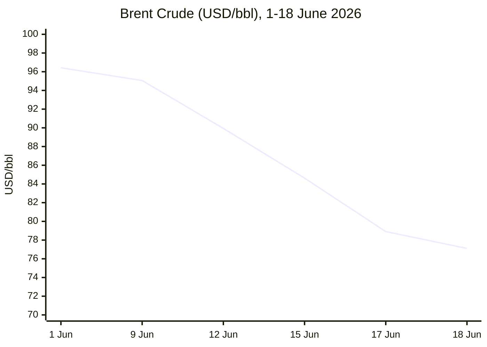

This morning Claude decided to produce just the Markdown without sharing the phases followed.

Will ask to resume sharing the thinking from tomorrow

---

```yaml
---
brief_date: 2026-06-19
version: v1.2.2
run_time: "05:01 CET"
stories_published: 13
categories: [conflict, business, eu_affairs, technology, trends]
alert_counts:
  red: 2
  yellow: 7
  green: 4
ongoing_situations:
  - {name: "Russia–Ukraine War", real_world_start: "2022-02-24", day: 1577}
  - {name: "Iran–US War / Hormuz Crisis", real_world_start: "2026-02-28", day: 112}
  - {name: "Israel–Lebanon Ceasefire 2026", real_world_start: "2026-04-16", day: 65}
sources_fetched: 6
fetch_status:
  le_monde: "❌"
  faz: "❌"
  kommersant: "❌"
  xinhua: "⚠️"
  european_parliament: "❌"
expansion_queue: ["#G7"]
---
```

# 🌐 MORNING BRIEF
## Friday, 19 June 2026 · 05:01 CET
### 13 stories across 5 categories

## DIGEST SUMMARY

| # | Category | Headline | Alert |
|---|----------|----------|-------|
| 1 | ⚔️ Conflict | US and Iran sign 14-point MOU to end war, reopen Hormuz | 🟡 |
| 2 | ⚔️ Conflict | Russian barrage kills 11 as Ukraine opens EU accession talks | 🔴 |
| 3 | ⚔️ Conflict | Iran says final deal requires Israeli withdrawal from Lebanon | 🟡 |
| 4 | 💼 Business | Brent crude sinks to four-month low on Hormuz reopening bets | 🟡 |
| 5 | 💼 Business | Fed holds rates, hawkish dot plot rattles markets before rebound | 🟡 |
| 6 | 💼 Business | G7 weighs fresh Russia sanctions as Ukraine session wraps in 75 minutes | 🟡 |
| 7 | 🇪🇺 EU Affairs | EU opens first Ukraine–Moldova accession cluster after Hungary lifts veto | 🟡 |
| 8 | 🇪🇺 EU Affairs | EU concludes SAFE defence-loan participation talks with Canada | 🟢 |
| 9 | 🤖 Technology | EU AI Act Omnibus awaits formal adoption after political deal | 🟢 |
| 10 | 🤖 Technology | Cybercriminals sell access to 75,000 compromised Fortinet devices | 🔴 |
| 11 | 📈 Trends | Pakistan's mediation role cements its rise as regional power broker | 🟢 |
| 12 | 📈 Trends | Prolonged Hormuz closure tests global food and shipping resilience | 🟡 |
| 13 | 📈 Trends | G7's truncated Ukraine session signals coalition fatigue | 🟢 |

> Alert Level key: 🔴 High significance · 🟡 Developing · 🟢 Stable/Routine

## 🚨 SIGNAL BOARD

🔴 US and Iran sign a 14-point MOU pledging to end the war and reopen the Strait of Hormuz within 60 days — yet IMF PortWatch still records **0% of normal transit volume**.
🔴 A Russian drone-and-missile barrage kills **11** in Ukraine hours before G7 leaders meet Zelenskyy, even as the EU formally opens Ukraine's first accession cluster.
🟡 Brent crude has fallen roughly **14% in a week** to $77.11/bbl, its lowest level since late February.
🟡 The Fed holds rates but signals possible 2026 hikes (9 of 18 officials), sending the dollar to a one-year high before equities rebounded.
⚡ Hungary's new Magyar government lifts its veto on Ukraine's EU accession, unlocking the bloc's first negotiating cluster after years of deadlock.

## 🔄 ONGOING SITUATIONS

| Situation | Real-world start | Day # | Last significant development | Status |
|-----------|-------------------|-------|------------------------------|--------|
| Russia–Ukraine War | 24 Feb 2022 | Day 1577 | Russian drone/missile barrage kills 11; Ukraine opens first EU accession cluster | 🔴 Active |
| Iran–US War / Hormuz Crisis | 28 Feb 2026 | Day 112 | 14-point MOU signed ending hostilities and reopening Hormuz; physical transit still 0% of normal | 🟡 MOU signed |
| Israel–Lebanon Ceasefire 2026 | 16 Apr 2026 | Day 65 | Residents returning to southern Lebanon; Iran says final deal requires full Israeli withdrawal, unconfirmed by Israel | 🟡 Ceasefire |

---

> 🔎 **CONFLICT ANALYST** · 3 updates today

### 1. US and Iran sign 14-point MOU to end war, reopen Hormuz 🟡
**Alert:** 🟡
**Summary:** Presidents Trump and Pezeshkian signed a memorandum of understanding in Versailles on 18 June, formally to be signed in Geneva on 19 June, ending hostilities, lifting the US naval blockade of Iran and reopening the Strait of Hormuz to commercial traffic. The two sides have 60 days to negotiate a final deal covering Iran's nuclear stockpile and full sanctions relief; Iran affirms it will not build nuclear weapons. Trump warned bombing could resume "if I don't like it."
**Significance:** Ends a war that began 28 February with the assassination of Khamenei, but the deal's conditional, 60-day structure leaves both the naval blockade lift and Hormuz reopening reversible pending nuclear talks.
**Sources:**
- [NBC News — Trump and Iran's president sign initial deal to end war](https://www.nbcnews.com/world/iran/strait-hormuz-reopen-us-lift-iran-sanctions-14-point-deal-seeking-end-rcna350513) · 18 June 2026
- [PBS News — What's in the agreement to end the U.S. war in Iran](https://www.pbs.org/newshour/world/whats-in-the-agreement-to-end-the-u-s-war-in-iran-according-to-a-u-s-official) · 18 June 2026
**Trend:** ↘ De-escalating
**Tags:** #Iran #Hormuz #peace-talks #nuclear

### 2. Russian barrage kills 11 as Ukraine opens EU accession talks 🔴
**Alert:** 🔴
**Summary:** Russia fired hundreds of drones and dozens of missiles at Ukraine's largest cities hours before the G7 summit opened, killing 11 and damaging a religious landmark. The attack followed separate Trump calls with Zelenskyy and Putin. Separately, Ukraine officially opened EU accession negotiations on the "fundamentals" cluster on 15 June after Hungary's new government lifted its veto.
**Significance:** The barrage underscores that battlefield intensity is undiminished even as Kyiv's institutional integration with the EU accelerates — a structural divergence between the war and the peace architecture being built around it.
**Sources:**
- [PBS News — Trump signals he may reimpose sanctions on Russian oil as G7 refocuses on Ukraine](https://www.pbs.org/newshour/world/trump-signals-he-may-reimpose-sanctions-on-russian-oil-as-g7-refocuses-on-ukraine) · 16 June 2026
- [Al Jazeera — EU officially launches Ukraine and Moldova accession process](https://www.aljazeera.com/news/2026/6/15/eu-officially-launches-ukraine-and-moldova-accession-processes) · 15 June 2026
**Trend:** ↗ Escalating
**Tags:** #Russia #Ukraine #frontline #EU-enlargement
📎 See also: EU Affairs § Story 7 — Ukraine–Moldova accession cluster opens

### 3. Iran says final deal requires Israeli withdrawal from Lebanon 🟡
**Alert:** 🟡
**Summary:** Residents have begun returning to southern Lebanon "with hope and sorrow" following the US-Iran MOU, which envisages ending fighting "on all fronts, including in Lebanon." Iranian officials maintain the broader settlement is contingent on a full Israeli withdrawal; Israel has not confirmed this condition. The episode follows weeks of disputed ceasefire compliance, including Hezbollah's earlier rejection of a 4 June framework over the absence of an explicit withdrawal clause.
**Significance:** The unresolved withdrawal question is the single largest variable threatening the durability of the Day 65 ceasefire as it becomes entangled with the wider Iran settlement.
**Sources:**
- [AP via Britannica — Residents return to war-ravaged southern Lebanon with hope and sorrow](https://www.britannica.com/event/2026-Iran-war) · 18 June 2026
**Trend:** ↘ De-escalating
**Tags:** #Lebanon #Israel #Hezbollah #ceasefire

📚 *Background reading:* [Al Jazeera — How Pakistan mediated a US-Iran agreement after more than 100 days of war](https://www.aljazeera.com/news/2026/6/15/how-pakistan-mediated-a-us-iran-agreement-after-more-than-100-days-of-war) · 15 June 2026

---

> 💼 **BUSINESS ANALYST** · 3 updates today

### 4. Brent crude sinks to four-month low on Hormuz reopening bets 🟡
**Alert:** 🟡
**Summary:** Brent fell to $77.11/bbl on 18 June, down 3.07% on the day and roughly 14% over the past week, its lowest level since late February, as markets price in a return of Gulf supply. Goldman Sachs cut its Q4 forecast to $80/bbl. However, IMF PortWatch's most recent published reading (14 June) still shows zero vessels transiting the strait against a typical 94/day — physical flows have not yet responded to the diplomatic breakthrough.
**Market signal:** Bearish for crude — anticipatory pricing of restored Gulf supply is running well ahead of confirmed physical transit data.
**Sources:**
- [Trading Economics — Brent crude oil](https://tradingeconomics.com/commodity/brent-crude-oil) · 18 June 2026
**Trend:** ↘ De-escalating
**Tags:** #Brent #oil-price #Hormuz #MULTI-SOURCE
📎 See also: Conflict § Story 1 — US-Iran MOU and Hormuz reopening

### 5. Fed holds rates, hawkish dot plot rattles markets before rebound 🟡
**Alert:** 🟡
**Summary:** New Fed Chair Kevin Warsh held rates steady at his first press conference, but a hawkish dot plot showing 9 of 18 officials favouring a 2026 hike sent the S&P 500 down 1.21% and the dollar index to a one-year high on 17 June. Equities rebounded sharply the next day — S&P 500 +1.08% to 7,500.58, Nasdaq +1.91% to 26,517.93 — as energy-stock weakness on the Iran deal was offset by a broader tech and cyclicals rally.
**Market signal:** Neutral-to-bullish near-term — equities absorbed the hawkish shock within 24 hours, though the dollar's rise to one-year highs signals tighter conditions ahead.
**Sources:**
- [TheStreet — Stock Market Today (June 18, 2026)](https://www.thestreet.com/stock-market-today/stock-market-today-dow-jones-sp-500-nasdaq-updates-june-18-2026) · 18 June 2026
**Trend:** ⚡ Reversal
**Tags:** #Fed #equity-rally #FX #interest-rates

### 6. G7 weighs fresh Russia sanctions as Ukraine session wraps in 75 minutes 🟡
**Alert:** 🟡
**Summary:** Trump signalled he may reimpose sanctions on Russian oil that were eased in March as crude prices spiked, while G7 leaders "refocused" on Ukraine at the Evian summit. Zelenskyy's working session with the group lasted only 75 minutes. The US has extended its earlier waiver on some Russian oil shipments pending a final decision.
**Market signal:** Bearish for Russian crude exporters if reimposed; broadly neutral for global oil given ongoing Hormuz-driven oversupply expectations.
**Sources:**
- [PBS News — Trump signals he may reimpose sanctions on Russian oil as G7 refocuses on Ukraine](https://www.pbs.org/newshour/world/trump-signals-he-may-reimpose-sanctions-on-russian-oil-as-g7-refocuses-on-ukraine) · 16 June 2026
**Trend:** → Stable
**Tags:** #sanctions #Russia #oil-price
📎 See also: Trends § Story 13 — G7's truncated Ukraine session

📚 *Background reading:* [Bruegel — The right balance: how to fix European Union artificial intelligence regulation](https://www.bruegel.org/policy-brief/right-balance-how-fix-european-union-artificial-intelligence-regulation) · June 2026

---

> 🇪🇺 **EU AFFAIRS ANALYST** · 2 updates today

### 7. EU opens first Ukraine–Moldova accession cluster after Hungary lifts veto 🟡
**Alert:** 🟡
**Summary:** All 27 member states agreed to open the "fundamentals" negotiating cluster with Ukraine and Moldova at an Intergovernmental Conference in Luxembourg on 15 June, covering rule of law and democratic institutions. The breakthrough followed Hungary's new government under Péter Magyar dropping Viktor Orbán's veto, shortly after Brussels unlocked over €16bn in previously frozen EU funds for Budapest.
**Legislative/policy stage:** Cluster 1 ("fundamentals") formally opened; interim benchmarks on rule-of-law chapters 23–24 must be met before provisional closure.
**Sources:**
- [European Commission (Enlargement) — EU and Ukraine open first accession negotiations cluster](https://enlargement.ec.europa.eu/news/eu-and-ukraine-open-first-accession-negotiations-cluster-2026-06-15_en) · 15 June 2026
**Trend:** ↗ Escalating
**Tags:** #EU-enlargement #Ukraine #Hungary #Magyar
📎 See also: Conflict § Story 2 — Russian barrage and EU accession launch

### 8. EU concludes SAFE defence-loan participation talks with Canada 🟢
**Alert:** 🟢
**Summary:** The Council concluded an agreement with Canada on its participation in the €150bn SAFE defence-procurement instrument on 15 June, following earlier authorisation to negotiate terms for Canadian firms and products. The Council had already green-lit SAFE funding for 18 member states between 11 February and 10 April, with Poland the largest recipient at €43.7bn.
**Legislative/policy stage:** Agreement concluded at Council level; implementation now proceeds to finalising Canadian-company participation terms in joint procurements.
**Sources:**
- [Consilium — What is Security Action for Europe (SAFE)?](https://www.consilium.europa.eu/en/policies/safe/) · 15 June 2026
**Trend:** ↗ Escalating
**Tags:** #EU-defence #EU-funds #institutional

📚 *Background reading:* [ECFR — European foreign and security policy analysis](https://ecfr.eu/) · June 2026

---

> 🤖 **TECHNOLOGY ANALYST** · 2 updates today

### 9. EU AI Act Omnibus awaits formal adoption after political deal 🟢
**Alert:** 🟢
**Summary:** The Council and Parliament reached a provisional agreement on 7 May to defer high-risk AI obligations — Annex III systems pushed from August 2026 to December 2027, Annex I systems to August 2028 — and to shorten the watermarking grace period to 2 December 2026. Formal adoption is expected before the original 2 August 2026 deadline; the Commission separately published a Code of Practice on AI-content labelling on 10 June.
**Analyst note:** Compliance teams have a materially longer runway for high-risk obligations through 2027–28, but transparency/watermarking rules tighten on a faster, near-term track — a bifurcated timeline likely to shape vendor compliance roadmaps over the next 12–18 months.
**Sources:**
- [Consilium — Artificial Intelligence: Council and Parliament agree to simplify and streamline rules](https://www.consilium.europa.eu/en/press/press-releases/2026/05/07/artificial-intelligence-council-and-parliament-agree-to-simplify-and-streamline-rules/) · 7 May 2026 (updated 18 May 2026)
**Trend:** → Stable
**Tags:** #AI-regulation #digital-regulation #EU-institutions
📎 See also: EU Affairs — Digital Omnibus legislative track

### 10. Cybercriminals sell access to 75,000 compromised Fortinet devices 🔴
**Alert:** 🔴
**Summary:** Security researchers reported on 18 June that criminals are selling access to roughly 75,000 Fortinet FortiGate devices with exposed VPN and web-management interfaces, using admin credentials that appear legitimate and recently harvested as part of a still-live campaign.
**Analyst note:** Given FortiGate's footprint in enterprise perimeter security, unresolved exposure at this scale creates a 12–24 month tail risk of follow-on ransomware and lateral-movement incidents across mid-sized enterprises that delay patching and credential rotation.
**Sources:**
- [DataBreachToday (ISMG) — Cybercriminals selling access to 75,000 Fortinet devices](https://www.databreachtoday.com/) · 18 June 2026
**Trend:** ↗ Escalating
**Tags:** #cyber #data-centre #MULTI-SOURCE

📚 *Background reading:* [CSIS — Technology and security policy analysis](https://www.csis.org) · June 2026

---

> 📈 **TRENDS ANALYST** · 3 updates today

### 11. Pakistan's mediation role cements its rise as regional power broker 🟢
**Alert:** 🟢
**Summary:** Pakistan's year-long shuttle diplomacy — from the failed April Islamabad talks through to brokering the 14-point MOU — has been credited by Prime Minister Shehbaz Sharif and analysts as a "never-give-up" model of mediation between parties with a deep trust deficit. Pakistan also coordinated with Qatar, Saudi Arabia, Türkiye and China during the process.
**Horizon:** Long-term — a successful mediation of this scale durably raises Islamabad's diplomatic standing independent of any single conflict outcome.
**Sources:**
- [Al Jazeera — How Pakistan mediated a US-Iran agreement after more than 100 days of war](https://www.aljazeera.com/news/2026/6/15/how-pakistan-mediated-a-us-iran-agreement-after-more-than-100-days-of-war) · 15 June 2026
**Trend:** ↗ Escalating
**Tags:** #Pakistan-mediation #diplomacy #Iran

### 12. Prolonged Hormuz closure tests global food and shipping resilience 🟡
**Alert:** 🟡
**Summary:** The FAO Food Price Index averaged 130.8 points in May, down 0.2% on a revised April figure but 2.9% above a year earlier, with cereal prices up 2.6% on the month as energy-linked input costs persist. Shipping firms continue Cape of Good Hope reroutes around the Hormuz chokepoint, and inventories at the Cushing storage hub have fallen to roughly 20 million barrels.
**Horizon:** Medium-term — even with a diplomatic resolution announced, rerouted shipping capacity and tight inventories take months to normalise, keeping food and freight costs structurally elevated through Q3.
**Sources:**
- [FAO — FAO Food Price Index broadly stable in May even as cereal quotations increase](https://www.fao.org/newsroom/detail/fao-food-price-index-broadly-stable-in-may-even-as-cereal-quotations-increase/en) · 5 June 2026
**Trend:** → Stable
**Tags:** #food-security #shipping #commodities
📎 See also: Business § Story 4 — Brent crude and Hormuz reopening bets

### 13. G7's truncated Ukraine session signals coalition fatigue 🟢
**Alert:** 🟢
**Summary:** Zelenskyy's working session with G7 leaders at the Evian summit wrapped after just 75 minutes, a notably brief slot for a leader whose country remains under daily bombardment. Trump has separately acknowledged that ending the war has proven "much harder than he thought" relative to his 2024 campaign claims.
**Horizon:** Medium-term — shortened formats and qualified rhetoric from the largest backers are an early indicator of waning summit-level bandwidth for the Ukraine file as the Iran file dominates attention.
**Sources:**
- [PBS News — Trump signals he may reimpose sanctions on Russian oil as G7 refocuses on Ukraine](https://www.pbs.org/newshour/world/trump-signals-he-may-reimpose-sanctions-on-russian-oil-as-g7-refocuses-on-ukraine) · 16 June 2026
**Trend:** → Stable
**Tags:** #diplomacy #Ukraine #public-opinion
📎 See also: Business § Story 6 — G7 and Russia sanctions

📚 *Background reading:* [CFR — Geopolitics and mediation analysis](https://www.cfr.org/) · June 2026

---

## 📊 KEY DATA OF THE DAY

📊 DATA OFFICER · 7 indicators

| Indicator | Value | Δ vs prior session | Δ vs 7 days ago | Note | Source | URL |
|-----------|-------|---------------------|-------------------|------|--------|-----|
| EUR/USD | 1.1466 | -0.31% | -0.97% | Euro at lowest since late March on broad dollar strength post-Fed | Trading Economics | [link](https://tradingeconomics.com/euro-area/currency) |
| Brent Crude (USD/bbl) | 77.11 | -3.07% | -14.27% | Lowest since late February on Hormuz reopening bets | Trading Economics | [link](https://tradingeconomics.com/commodity/brent-crude-oil) |
| Gold (XAU/USD) | 4,210 | -1.16% | N/A | Fed hawkish hold outweighing Iran de-escalation safe-haven unwind | Trading Economics | [link](https://tradingeconomics.com/commodity/gold) |
| IMF Global Growth 2026 | 3.1% | vs Jan WEO: -0.2pp | vs Oct WEO: 0.0pp | April WEO reference forecast assumes limited-duration Middle East conflict | IMF WEO | [link](https://www.imf.org/en/publications/weo/issues/2026/04/14/world-economic-outlook-april-2026) |
| EU CPI YoY (latest) | 3.2% | vs prior month: +0.2pp | vs 3 months ago: +1.3pp | May 2026 flash estimate; energy +10.9% YoY | Eurostat | [link](https://ec.europa.eu/eurostat/statistics-explained/index.php?title=Inflation_in_the_euro_area) |
| FAO Food Price Index | 130.8 | -0.2% | May 2026 (latest available) | Cereals +2.6% m/m offset by vegetable-oil declines | FAO | [link](https://www.fao.org/newsroom/detail/fao-food-price-index-broadly-stable-in-may-even-as-cereal-quotations-increase/en) |
| Hormuz transit volume (% of normal) | 0% | 0pp | 0pp | IMF PortWatch's most recent published day (14 June); 0 vessels vs 94/day pre-crisis baseline | IMF PortWatch | [link](https://straits.live/) |

**Data commentary:** The widest gap in today's data is between sentiment and physical reality: Brent has shed 14% in a week and gold has slipped on diversion of safe-haven flows, yet IMF PortWatch shows the Strait of Hormuz still carrying zero commercial transits. Markets are pricing the MOU's success before the tanker data confirms it. Separately, the Fed's hawkish hold and the ECB's 11 June hike to 2.25% point to a higher-for-longer rate environment across both sides of the Atlantic, compounding the eurozone's stagflation signal (CPI 3.2%, IMF growth cut to 3.1%).

## 📈 CHARTS



*Chart 2 (conflict structural indicator) omitted: Hormuz transit volume has been pinned at 0% of normal across all confirmed readings this run, with no third distinct quantified data point available to plot a trend line.*
*Chart 3 (cross-brief structural trend) omitted: no editor-supplied historical data points provided for this run.*

## ⚙️ AGENT METADATA

| Field | Value |
|-------|-------|
| Agent version | MORNING BRIEF v1.2.2 |
| Run timestamp | 2026-06-19T05:01:00+02:00 |
| Fetch status | Le Monde ❌ (known crawler-blocked, no search fallback executed this run) · FAZ ❌ (known crawler-blocked, no search fallback executed this run) · Kommersant ❌ (known crawler-blocked, no search fallback executed this run) · Xinhua ⚠️ (fetched, content stale — most recent item dated 24 April) · EP ❌ (nav structure only, search fallback used for EU institutional content) |
| Sources queried | 6 / 11 (IMF, ECB, European Commission, FAO, Xinhua, European Parliament directly queried; Guardian/El País/World Bank/Le Monde/FAZ/Kommersant not separately queried — Tier 1 coverage achieved via AP, Reuters, AFP, NBC, PBS, Al Jazeera, CBS, ABC wire reporting) |
| Stories surfaced | ~24 (before editorial filter) |
| Stories published | 13 |
| Languages processed | EN only — FR/DE/RU source fallback not executed this run (see fetch status note) |
| Output language | English (British) |
| Date validated | ✅ Confirmed 19 June 2026 |
| Expansion Queue | #G7 (first appearance; no closed-list tag covers the G7 institution as an actor) |

---

MORNING BRIEF is an AI-assisted digest. All summaries are paraphrased from original sources.
Verify time-sensitive information at the linked URLs before acting.
Output language: British English.
