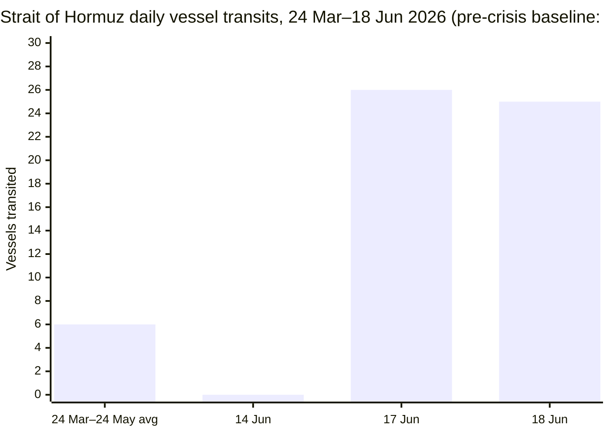
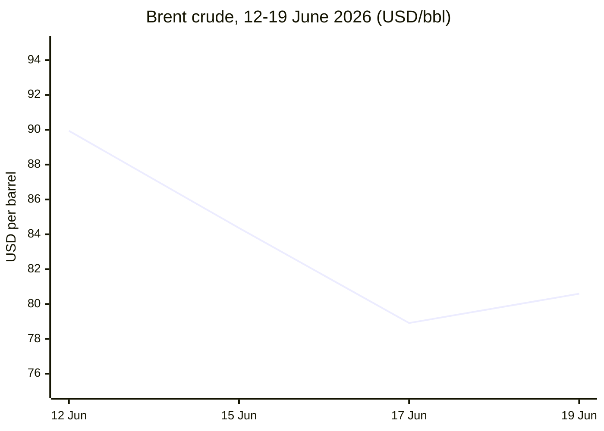

**Phase 0 — Date anchor confirmed**
Run date: **20 June 2026**, 05:02 CET.
Day counts: Russia–Ukraine = **Day 1578** · Iran–US/Hormuz = **Day 113** · Israel–Lebanon Ceasefire = **Day 66**
---
**Phase 1 — Direct fetch pass starting.** Per accumulated fetch reliability data, skipping wasted attempts on Le Monde/FAZ/Kommersant (reliably blocked) and ECB/European Commission (search covers these adequately) — routing those straight to Phase 2 search. Attempting direct fetch on Xinhua, European Parliament, IMF, and FAO now.
---
**Phase 1 complete.** Fetch results: Xinhua ⚠️ (returned content dated 24 April 2026 — stale, confirmed against run date), European Parliament ❌ (navigation structure only, no article content), IMF ⚠️ (latest dated 13 May 2026 — stale). FAO confirmed via targeted search: May 2026 release (130.8 points) is the latest published — June release not due until 3 July 2026. Le Monde/FAZ/Kommersant/ECB/EC routed straight to search per known reliability profile.
---
**Phase 2 — Search pass starting**, date-anchored across all five categories plus data indicators.
---
Good — this gives a solid EU defence story (15 June 2026, Council formally concludes Canada–SAFE agreement). Now Technology and Trends sections.
---
Phase 3–5 — pool merge, verification, and editorial filter complete. Candidate pool ran to roughly 20 story threads across the five categories; after deduplication and filtering, 13 stories cleared the bar (within the 12–15 target). Alert calibration: 1 of 13 stories carries 🔴 (≈8%, well under the 40% cap), so no downgrades were needed. Let me check the pipeline's skill file before final assembly.
---
Today's lead story: an Israel–Hezbollah flare-up on 18–19 June nearly derailed the new US–Iran ceasefire, forcing a fresh truce and postponing follow-on talks. Brent and gold are both unwinding crisis-era gains as Hormuz transit climbs off zero, while the ECB delivered its first hike since 2023 to fight war-driven inflation. On the EU side, Parliament finally passed the AI Act Omnibus, and Canada became the first non-European country admitted into the SAFE defence scheme.
---

```yaml
---
brief_date: 2026-06-20
version: v1.2.2
run_time: "05:02 CET"
stories_published: 13
categories: [conflict, business, eu_affairs, technology, trends]
alert_counts:
  red: 1
  yellow: 9
  green: 3
ongoing_situations:
  - {name: "Russia–Ukraine War", real_world_start: "2022-02-24", day: 1578}
  - {name: "Iran–US War / Hormuz Crisis", real_world_start: "2026-02-28", day: 113}
  - {name: "Israel–Lebanon Ceasefire 2026", real_world_start: "2026-04-16", day: 66}
sources_fetched: 5
fetch_status:
  le_monde: "❌"
  faz: "❌"
  kommersant: "❌"
  xinhua: "⚠️"
  european_parliament: "❌"
expansion_queue: []
---
```

# 🌐 MORNING BRIEF
## Saturday, 20 June 2026 · 05:02 CET
### 13 stories across 5 categories

## DIGEST SUMMARY

| # | Category | Headline | Alert |
|---|----------|----------|-------|
| 1 | ⚔️ Conflict | Israel–Hezbollah flare-up threatens broader Iran deal, truce called | 🔴 |
| 2 | ⚔️ Conflict | US–Iran follow-on talks postponed as Hormuz reopening continues | 🟡 |
| 3 | ⚔️ Conflict | Ukraine frontline stalemate persists as European mediation push stalls | 🟡 |
| 4 | 💼 Business | ECB delivers first rate hike since 2023, lifts deposit rate to 2.25% | 🟡 |
| 5 | 💼 Business | Brent crude steadies near $80/bbl on partial Hormuz reopening | 🟡 |
| 6 | 💼 Business | Hawkish Fed hold drives dollar rally, gold slumps to two-month low | 🟡 |
| 7 | 🇪🇺 EU Affairs | European Parliament formally adopts AI Act "Digital Omnibus" | 🟡 |
| 8 | 🇪🇺 EU Affairs | Council concludes SAFE defence agreement with Canada | 🟢 |
| 9 | 🇪🇺 EU Affairs | Hungary presses ahead with reforms to unlock €17bn in frozen EU funds | 🟡 |
| 10 | 🤖 Technology | Chinese open-weight models narrow gap with Western frontier labs | 🟢 |
| 11 | 🤖 Technology | US tightens enforcement of AI-chip export controls on Chinese units abroad | 🟡 |
| 12 | 📈 Trends | Pakistan cements role as principal US–Iran mediator via Islamabad Memorandum | 🟡 |
| 13 | 📈 Trends | FAO Food Price Index holds near multi-year high on energy-linked pressure | 🟢 |

> Alert Level key: 🔴 High significance · 🟡 Developing · 🟢 Stable/Routine

## 🚨 SIGNAL BOARD

🔴 **Deadliest Israel–Hezbollah clashes since the US–Iran accord killed at least 18 civilians in Lebanon on 18–19 June, forcing a new truce and suspending follow-on Iran talks.**
🟡 **ECB raises rates for the first time since 2023 — deposit rate to 2.25% — as Iran-war energy costs push euro-area inflation to 3.2%.**
🟡 **Brent crude has shed roughly 10% in a week, trading near $80.59/bbl as Hormuz transit climbs from zero to 26 vessels a day — still under 30% of the 94/day pre-crisis norm.**
🟢 **European Parliament definitively adopts the AI Act "Digital Omnibus" (423–57–174), pushing high-risk obligations to December 2027/August 2028.**
⚡ **Gold has fallen 1.7% to a two-month low as a hawkish Fed hold drives the dollar to a one-year high, reversing months of safe-haven demand.**

## 🔄 ONGOING SITUATIONS

| Situation | Real-world start | Day # | Last significant development | Status |
|-----------|-----------------|-------|------------------------------|--------|
| Russia–Ukraine War | 24 Feb 2022 | Day 1578 | UK/France/Germany–Zelenskyy joint statement (7 Jun) rejected by Moscow (11 Jun); frontline largely static | 🟡 Active, stalled talks |
| Iran–US War / Hormuz Crisis | 28 Feb 2026 | Day 113 | Islamabad Memorandum signed 17 Jun; follow-on talks postponed 19 Jun after Lebanon flare-up | 🟡 Ceasefire, fragile |
| Israel–Lebanon Ceasefire 2026 | 16 Apr 2026 | Day 66 | Heaviest fighting since April truce on 18–19 Jun; new halt-to-fighting agreed 19 Jun | 🟡 Ceasefire, just renewed |

---

> 🔎 **CONFLICT ANALYST** · 3 updates today

### 1. Israel–Hezbollah flare-up threatens broader Iran deal, truce called 🔴
**Alert:** 🔴
**Summary:** Israel and Hezbollah fought their deadliest exchange since the US–Iran accord on 18–19 June, with Lebanese state media reporting at least 18 civilians killed in Israeli strikes and Israel reporting four soldiers killed in a tank attack. The flare-up forced the postponement of planned US–Iran follow-on talks in Switzerland. A new halt-to-fighting agreement was reached Friday, effective 9am Eastern, though neither side has formally confirmed it.
**Significance:** The clash exposes how unresolved Lebanon front lines can destabilise the wider Iran ceasefire architecture even after a formal interstate deal is signed.
**Sources:**
- [CBS News — U.S.-Iran Latest: Israel-Hezbollah fighting flares up in Lebanon as next-phase talks delayed](https://www.cbsnews.com/live-updates/iran-us-war-talks-suspended-trump-mou-israel-lebanon-hezbollah-fighting/) · 19 June 2026
- [PBS News — Israel and Hezbollah renew ceasefire after U.S. and Iran call off talks over fighting in Lebanon](https://www.pbs.org/newshour/world/israel-and-hezbollah-renew-ceasefire-after-u-s-and-iran-call-off-talks-over-fighting-in-lebanon) · 19 June 2026
**Trend:** ⚡ Reversal
**Tags:** #Israel #Lebanon #Hezbollah #MULTI-SOURCE

### 2. US–Iran follow-on talks postponed as Hormuz reopening continues 🟡
**Alert:** 🟡
**Summary:** The Islamabad Memorandum — a 14-point framework signed by Presidents Trump and Pezeshkian on 17 June — set a 60-day ceasefire, toll-free Strait of Hormuz reopening and an end to the US naval blockade, deferring Iran's nuclear stockpile to future talks. Planned Friday talks in Switzerland were postponed after the Lebanon flare-up; Iran's Supreme Leader Mojtaba Khamenei said Trump signed "out of desperation" but confirmed Tehran had accepted the terms.
**Significance:** The framework removes the most acute supply-shock risk to global energy markets but leaves the hardest issues — nuclear stockpiles and a durable peace — to a fragile 60-day window.
**Sources:**
- [Wikipedia — Islamabad Memorandum](https://en.wikipedia.org/wiki/Islamabad_Memorandum) · 19 June 2026
- [CNN — US releases official agreement with Iran. Read the 14-point text](https://www.cnn.com/2026/06/17/middleeast/us-iran-war-mou-text-intl) · 17 June 2026
**Trend:** ↘ De-escalating
**Tags:** #Iran #Hormuz #peace-talks #MULTI-SOURCE

### 3. Ukraine frontline stalemate persists as European mediation push stalls 🟡
**Alert:** 🟡
**Summary:** The UK, France and Germany issued a joint statement with President Zelenskyy on 7 June backing direct Russia–Ukraine dialogue; Moscow rejected the conditions as "unacceptable" on 11 June via spokesperson Maria Zakharova. On the ground, Russia recorded a net weekly territorial loss of 14 square miles (26 May–3 June) per ISW data, continuing a markedly slower pace of advance than in 2024–25.
**Significance:** Day 1578 of the war shows attritional stalemate rather than breakthrough on either side, with diplomacy and battlefield momentum both stalled simultaneously.
**Sources:**
- [Russia Matters — The Russia-Ukraine War Report Card, June 3, 2026](https://www.russiamatters.org/news/russia-ukraine-war-report-card/russia-ukraine-war-report-card-june-3-2026) · 3 June 2026
- [Baidu Baike — 2026 Russia-Ukraine Peace Talks](https://baike.baidu.com/en/item/2026%20Russia-Ukraine%20Peace%20Talks/1523882) · 11 June 2026
**Trend:** → Stable
**Tags:** #Russia #Ukraine #frontline #peace-talks

📚 *Background reading:* [Chatham House — How a Russia–Ukraine ceasefire could imperil Ukrainian and European security](https://www.chathamhouse.org/2026/05/how-russia-ukraine-ceasefire-could-imperil-ukrainian-and-european-security/02-ukraine) · [Britannica — 2026 Iran war](https://www.britannica.com/event/2026-Iran-war)

---

> 💼 **BUSINESS ANALYST** · 3 updates today

### 4. ECB delivers first rate hike since 2023, lifts deposit rate to 2.25% 🟡
**Alert:** 🟡
**Summary:** The ECB Governing Council raised all three key rates by 25 basis points on 11 June, taking the deposit rate to 2.25% effective 17 June — its first hike since the 2023 tightening cycle ended. The move responds to euro-area inflation reaching 3.2% in May, with energy costs (+10.9%) the dominant driver amid Hormuz-linked supply disruption. The ECB's Survey of Professional Forecasters now sees full-year 2026 GDP growth at just 0.9%.
**Market signal:** Bearish for euro-area growth assets, bullish for the euro near-term — tightening confirms the ECB is prioritising inflation control over growth support.
**Sources:**
- [Euronews — ECB raises interest rates for the first time in three years as Iran war fuels inflation](https://www.euronews.com/business/2026/06/11/ecb-raises-interest-rates-for-the-first-time-in-three-years-as-iran-war-fuels-inflation) · 11 June 2026
**Trend:** ↗ Escalating
**Tags:** #ECB #interest-rates #inflation #MULTI-SOURCE

### 5. Brent crude steadies near $80/bbl on partial Hormuz reopening 🟡
**Alert:** 🟡
**Summary:** Brent crude closed at $80.59/bbl on 19 June, up 0.93% on the session but down roughly 10% over the week and on track for its third consecutive weekly decline, as tankers began exiting the Strait of Hormuz and Kuwait signalled higher output. US Central Command lifted blockade restrictions on Iranian ports this week, though Tehran has signalled new mandatory transit insurance requirements.
**Market signal:** Bearish for crude near-term — Goldman Sachs has cut its Q4 Brent forecast to $80/bbl as Gulf exports are expected back near pre-war levels by late July.
📎 See also: Conflict § Story 2 — Hormuz reopening progress under the Islamabad Memorandum
**Sources:**
- [Trading Economics — Brent crude oil](https://tradingeconomics.com/commodity/brent-crude-oil) · 19 June 2026
**Trend:** ↘ De-escalating
**Tags:** #Brent #oil-price #Hormuz #supply-shock

### 6. Hawkish Fed hold drives dollar rally, gold slumps to two-month low 🟡
**Alert:** 🟡
**Summary:** Gold fell 1.74% to $4,136.59/oz on 19 June, its lowest level since 11 June, after the Fed under new Chair Kevin Warsh held rates at 3.5–3.75% but signalled a more hawkish path — nine of 19 policymakers now expect a 2026 hike. The dollar index climbed to a one-year high. Goldman Sachs cut its year-end gold forecast to $4,900 from $5,400.
**Market signal:** Bearish for gold and rate-sensitive assets — markets now assign roughly 70% odds of a Fed hike by September.
**Sources:**
- [Trading Economics — Gold](https://tradingeconomics.com/commodity/gold) · 19 June 2026
**Trend:** ↗ Escalating
**Tags:** #Fed #gold #FX

📚 *Background reading:* [Bruegel-style analysis unavailable this run — see ECB press statement linked above]

---

> 🇪🇺 **EU AFFAIRS ANALYST** · 3 updates today

### 7. European Parliament formally adopts AI Act "Digital Omnibus" 🟡
**Alert:** 🟡
**Summary:** On 16 June, Parliament gave final approval (423 in favour, 57 against, 174 abstentions) to the Digital Omnibus on AI, postponing high-risk AI system obligations to 2 December 2027 (stand-alone systems) and 2 August 2028 (embedded systems), and introducing a new EU-wide ban on "nudifier" apps generating non-consensual intimate imagery or CSAM. The Council must still formally adopt the text, expected before 2 August 2026.
**Legislative/policy stage:** Parliament first-reading approval complete; Council adoption and Official Journal publication pending, targeted before 2 August 2026.
**Sources:**
- [Matheson — EU Parliament approves amendments to the AI Act](https://www.matheson.com/insights/eu-parliament-approves-amendments-to-the-ai-act/) · 16 June 2026
- [Sofia Globe — European Parliament approves AI Act amendments, 'nudifier' ban](https://sofiaglobe.com/2026/06/16/european-parliament-approves-ai-act-amendments-nudifier-ban/) · 16 June 2026
**Trend:** → Stable
**Tags:** #digital-regulation #AI-regulation #EU-institutions #MULTI-SOURCE

### 8. Council concludes SAFE defence agreement with Canada 🟢
**Alert:** 🟢
**Summary:** The Council formally concluded the EU–Canada agreement on 15 June, letting Canadian firms and Canadian-origin products participate in procurement under the €150bn SAFE defence instrument — the first non-European country admitted. The first concrete contract, a tactical-radio supply deal for Poland worth over $10m, was awarded to Montreal-based Marconi Technologies, announced at the G7 summit in Évian.
**Legislative/policy stage:** Agreement formally concluded by Council on 15 June 2026; in force, first contracts already awarded.
**Sources:**
- [Council of the EU — SAFE: Council concludes agreement with Canada](https://www.consilium.europa.eu/en/press/press-releases/2026/06/15/safe-council-concludes-agreement-with-canada/) · 15 June 2026
- [CBC News — 1st Canadian firm awarded contract under European rearmament deal](https://www.cbc.ca/news/politics/safe-agreement-marconi-9.7236074) · 15 June 2026
**Trend:** ↗ Escalating
**Tags:** #EU-defence #EU-institutions #MULTI-SOURCE

### 9. Hungary presses ahead with reforms to unlock €17bn in frozen EU funds 🟡
**Alert:** 🟡
**Summary:** Hungary's Magyar government and the European Commission signed a political accord on 28 May setting out conditions for releasing roughly €17bn in funds frozen under the Orbán government over rule-of-law and corruption concerns — €10bn in Recovery and Resilience Facility money and a further €4.2–6.4bn in cohesion funds. Budapest has submitted a legislative package strengthening its Integrity Authority and faces a 31 August deadline to complete remaining conditions.
**Legislative/policy stage:** Political accord signed 28 May; implementing legislation before the Hungarian parliament; hard deadline 31 August 2026.
**Sources:**
- [Al Jazeera — EU to release billions in frozen funds for Hungary amid Magyar reforms](https://www.aljazeera.com/news/2026/5/29/eu-to-release-billions-in-frozen-funds-for-hungary-amid-magyar-reforms) · 29 May 2026
**Trend:** ↘ De-escalating
**Tags:** #Hungary #Magyar #EU-funds #rule-of-law

📚 *Background reading:* [Verfassungsblog — Unfreezing EU Funds Without Melting the Rule of Law](https://verfassungsblog.de/unfreezing-eu-funds-without-melting-the-rule-of-law/)

---

> 🤖 **TECHNOLOGY ANALYST** · 2 updates today

### 10. Chinese open-weight models narrow gap with Western frontier labs 🟢
**Alert:** 🟢
**Summary:** Z.ai released GLM-5.2 (13 June) — a 744-billion-parameter MoE model with a 1-million-token context window — under MIT licence, while Moonshot AI's Kimi K2.7 Code (12 June) posted 81.1% on the MCP Mark Verified tool-use benchmark. Both are priced well below comparable Western frontier offerings, continuing a trend of Chinese labs matching capability while collapsing inference costs despite US chip export controls.
**Analyst note:** Sustained cost-undercutting by open-weight Chinese models over the next 12–24 months could erode proprietary API margins for Western labs, particularly in price-sensitive enterprise coding and tool-use segments.
**Sources:**
- [Build Fast With AI — Best AI Models June 2026: Full Ranked Leaderboard](https://www.buildfastwithai.com/blogs/best-ai-models-june-2026) · 15 June 2026
**Trend:** ↗ Escalating
**Tags:** #AI #LLM #open-source-AI #AI-benchmark

### 11. US tightens enforcement of AI-chip export controls on Chinese units abroad 🟡
**Alert:** 🟡
**Summary:** The Commerce Department issued guidance affirming that advanced AI chip export licensing requirements apply to any business headquartered in or controlled by a Chinese parent, regardless of where it is located, closing a loophole that allowed offshore subsidiaries to receive restricted hardware. The move comes as Washington otherwise downplays new restrictions ahead of a planned Trump visit to Beijing.
**Analyst note:** Extraterritorial enforcement signals Washington intends to police compliance through licensing scope rather than new blanket bans over the next year, raising compliance costs for multinational chip buyers with any China-linked ownership.
**Sources:**
- [Al Jazeera — US says ban on AI chip shipments applies to Chinese firms outside China](https://www.aljazeera.com/economy/2026/6/1/us-says-ban-on-ai-chip-shipments-applies-to-chinese-firms-outside-china) · 1 June 2026
**Trend:** ↗ Escalating
**Tags:** #semiconductor #sanctions #AI-regulation

📚 *Background reading:* [CSIS — The Limits of Chip Export Controls in Meeting the China Challenge](https://www.csis.org/analysis/limits-chip-export-controls-meeting-china-challenge)

---

> 📈 **TRENDS ANALYST** · 2 updates today

### 12. Pakistan cements role as principal US–Iran mediator via Islamabad Memorandum 🟡
**Alert:** 🟡
**Summary:** Pakistan, with support from Qatar, Saudi Arabia, Turkey and Egypt, brokered the Islamabad Memorandum that ended active hostilities between the US and Iran — Prime Minister Shehbaz Sharif announced agreement on final text on 12 June, ahead of the 17 June signing. The episode marks Pakistan's most consequential diplomatic role in a major-power conflict in decades.
**Horizon:** Medium-term — if the 60-day ceasefire holds, Pakistan's mediating credibility could reshape its regional diplomatic standing through 2026–27, independent of the underlying nuclear dispute's outcome.
📎 See also: Conflict § Story 2 — Islamabad Memorandum terms and implementation status
**Sources:**
- [Wikipedia — Islamabad Memorandum](https://en.wikipedia.org/wiki/Islamabad_Memorandum) · 19 June 2026
**Trend:** ↗ Escalating
**Tags:** #Pakistan-mediation #diplomacy #mediation #MULTI-SOURCE

### 13. FAO Food Price Index holds near multi-year high on energy-linked pressure 🟢
**Alert:** 🟢
**Summary:** The FAO Food Price Index averaged 130.8 points in May 2026 (latest available; June data due 3 July), down a marginal 0.2% from a revised April level but 2.9% above a year earlier. FAO's Boubaker Ben-Belhassen warned that continued disruption to trade routes including the Strait of Hormuz could raise fertiliser costs and add further pressure to food prices.
**Horizon:** Short-to-medium term — cereal prices (+2.6% on the month) are the main upside risk; a durable Hormuz reopening would ease energy-linked input costs into Q3.
**Sources:**
- [FAO — FAO Food Price Index broadly stable in May even as cereal quotations increase](https://www.fao.org/newsroom/detail/fao-food-price-index-broadly-stable-in-may-even-as-cereal-quotations-increase/en) · 5 June 2026
**Trend:** → Stable
**Tags:** #food-prices #food-security #data-point

📚 *Background reading:* [East Asia Forum — US chip export controls have cooled down](https://eastasiaforum.org/2026/03/11/us-chip-export-controls-have-cooled-down/)

---

## 📊 KEY DATA OF THE DAY

📊 DATA OFFICER · 7 indicators

| Indicator | Value | Δ vs prior session | Δ vs 7 days ago | Note | Source | URL |
|-----------|-------|-------------------|-----------------|------|--------|-----|
| EUR/USD | 1.1477 | +0.17% | ≈ -0.78% | Euro near 3-month low on hawkish Fed | Trading Economics | [link](https://tradingeconomics.com/euro-area/currency) |
| Brent Crude (USD/bbl) | 80.59 | +0.93% | ≈ -10.4% | Third weekly decline as Hormuz reopens | Trading Economics | [link](https://tradingeconomics.com/commodity/brent-crude-oil) |
| Gold (XAU/USD) | 4,136.59 | -1.74% | ≈ -1.3% | Two-month low on dollar strength | Trading Economics | [link](https://tradingeconomics.com/commodity/gold) |
| IMF Global Growth 2026 | 3.1% | vs Jan WEO: -0.2pp | vs Oct WEO: N/A | April WEO reference forecast assumes war effects fade by mid-2026 | IMF WEO (April 2026) | [link](https://www.imf.org/-/media/files/publications/weo/2026/april/english/execsum.pdf) |
| EU CPI YoY (latest) | 3.2% | vs prior month: +0.2pp | vs 3 months ago: +1.3pp | May 2026; highest since Sept 2023 | Eurostat | [link](https://ec.europa.eu/eurostat/web/products-euro-indicators/w/2-17062026-ap) |
| FAO Food Price Index | 130.8 | vs prior month: -0.2% | May 2026 (latest available) | June data due 3 July 2026 | FAO | [link](https://www.fao.org/newsroom/detail/fao-food-price-index-broadly-stable-in-may-even-as-cereal-quotations-increase/en) |
| Strait of Hormuz transit (vessels/day) | 25–26 | N/A | ≈ +25–26 vs near-zero | vs ~94/day pre-crisis baseline (≈27% of normal) | IMF PortWatch / Windward AIS | [link](https://straits.live/) |

**Data commentary:** The data set tells a single story: the acute Hormuz supply shock is unwinding faster than the underlying diplomatic settlement is stabilising. Brent and gold are both retreating from crisis peaks even as the ECB's first hike since 2023 confirms inflation pass-through from the conflict is still working through the eurozone economy. Hormuz transit at roughly a quarter of its pre-crisis baseline shows real but partial normalisation — consistent with Goldman Sachs' view that a full recovery in Gulf exports is unlikely before late July.

## Conflict-linked indicator — Strait of Hormuz daily transit



## Brent crude trajectory



## ⚙️ AGENT METADATA

| Field | Value |
|-------|-------|
| Agent version | MORNING BRIEF v1.2.2 |
| Run timestamp | 2026-06-20T05:02:52+02:00 |
| Fetch status | Le Monde ❌ (search fallback skipped — known reliably blocked) · FAZ ❌ (search fallback skipped) · Kommersant ❌ (search fallback skipped) · Xinhua ⚠️ (fetched, content dated 24 Apr 2026 — stale, search-supplemented) · EP ❌ (navigation only, search-supplemented) |
| Sources queried | 9 / 11 (Le Monde, FAZ, Kommersant, Xinhua, EP, IMF, ECB, European Commission, FAO; Guardian and World Bank not directly queried this run) |
| Stories surfaced | ≈20 (before editorial filter) |
| Stories published | 13 |
| Languages processed | EN |
| Output language | English (British) |
| Date validated | ✅ Confirmed 20 June 2026 |
| Expansion Queue | None |

---

MORNING BRIEF is an AI-assisted digest. All summaries are paraphrased from original sources.
Verify time-sensitive information at the linked URLs before acting.
Output language: British English.
