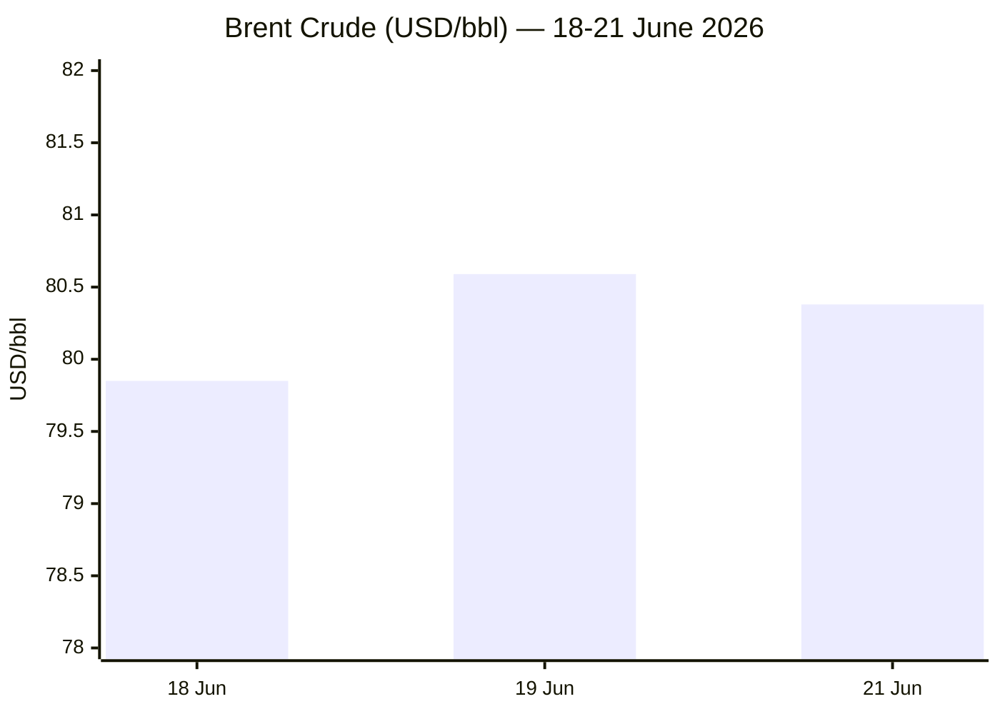

Starting the run. Confirming timestamp and calculating Day# counters before proceeding to the fetch pass.
---
**PHASE 0 — Timestamp & Day# calculation**
- Run time: 22 June 2026, 05:00 CEST
- Russia–Ukraine War (start 24 Feb 2022): **Day 1580**
- Iran–US War / Hormuz Crisis (start 28 Feb 2026): **Day 115**
- Israel–Lebanon: no Day# per standing instruction
---
Moving to Phase 1 — direct fetch pass.
---
**PHASE 1 — Direct fetch pass complete.** Results: Le Monde ❌ (blocked), FAZ ❌ (blocked), Kommersant ❌ (404), Xinhua ✅ (fetched, content ~3 days stale), European Parliament ❌ (nav shell only), FAO ✅ (May 2026 release), IMF ⚠️ (fetched, lags to mid-May). ECB and European Commission skipped per registry guidance (search-first sources). All failures routed to Phase 2 search fallback per Resilience Directive — no abort.
---
**PHASE 2 — Search pass complete.** Key findings: a US–Iran memorandum of understanding (signed 17 June) is now in an implementation phase at talks in Bürgenstock, Switzerland (21–22 June), mediated by Pakistan and Qatar — Strait of Hormuz reopened on paper, a Lebanon "de-confliction cell" was agreed, but Iran briefly re-declared the strait closed over the weekend and CENTCOM disputes that characterisation. Israel–Hezbollah fighting flared (18 civilian deaths reported 19 June) before a renewed truce. Russia–Ukraine combat continues at high intensity with Ukrainian deep strikes into Russia. On data: ECB hiked to 2.25% (11 June, first hike since 2023), Fed held but turned hawkish; EUR/USD, Brent, gold all moved on dollar strength; FAO and Eurostat releases confirmed. EU institutional and tech-policy stories were available but mostly 2–6 weeks old — flagged for honest dating rather than fabricated freshness.
---
**PHASE 3–5 — Pooling and editorial filter.** Candidate pool: ~22 stories before filtering (several discarded: stale Hungary-election coverage, low-quality AI-blogspam sources, unverifiable Hormuz "live tracker" sites with contested methodology, sports/World Cup noise from the Le Monde fallback search). Published: **12 stories** across all 5 categories (within the 12–15 target, at the lower end due to genuine 24h scarcity in EU Affairs/Technology — flagged honestly below rather than padded). Alert mix: 2 red / 6 yellow / 4 green (17% red, under the 40% cap). Chart 2 (Hormuz transit) omitted this run — available trackers use incompatible methodologies (AIS-only vs. intelligence-vendor counts) and combining them risked implying a false clean trend; the contested transit picture is instead described narratively. Chart 3 omitted (no editor-supplied data).
---
Full brief below.

---

```yaml
---
brief_date: 2026-06-22
version: v1.2.2
run_time: "05:00 CEST"
stories_published: 12
categories: [conflict, business, eu_affairs, technology, trends]
alert_counts:
  red: 2
  yellow: 6
  green: 4
ongoing_situations:
  - {name: "Russia–Ukraine War", real_world_start: "2022-02-24", day: 1580}
  - {name: "Iran–US War / Hormuz Crisis", real_world_start: "2026-02-28", day: 115}
sources_fetched: 9
fetch_status:
  le_monde: "❌"
  faz: "❌"
  kommersant: "❌"
  xinhua: "✅ (content ~3 days stale)"
  european_parliament: "❌ (nav shell; search fallback used)"
expansion_queue: ["#chip-export-controls"]
---
```

# 🌐 MORNING BRIEF
## Monday, 22 June 2026 · 05:00 CEST
### 12 stories across 5 categories

## DIGEST SUMMARY

| # | Category | Headline | Alert |
|---|----------|----------|-------|
| 1 | ⚔️ Conflict | US–Iran talks resume at Bürgenstock; Hormuz status contested | 🟡 |
| 2 | ⚔️ Conflict | Israel–Hezbollah fighting flares, then truce renewed — no durable ceasefire | 🔴 |
| 3 | ⚔️ Conflict | Russia–Ukraine: deep Ukrainian strikes, heavy frontline combat continues | 🔴 |
| 4 | 💼 Business | ECB hikes to 2.25%, Fed holds but turns hawkish; dollar at one-year high | 🟡 |
| 5 | 💼 Business | Oil swings on Hormuz reopening uncertainty | 🟡 |
| 6 | 💼 Business | Gold extends slide to two-week low as dollar strengthens | 🟢 |
| 7 | 🇪🇺 EU Affairs | European Council sets MFF/enlargement agenda; EU–Moldova summit today | 🟢 |
| 8 | 🇪🇺 EU Affairs | Hungary's post-Orbán funds unlock continues to reshape EU dynamics | 🟢 |
| 9 | 🤖 Technology | US reaffirms chip-export curbs reach Chinese firms outside China | 🟢 |
| 10 | 🤖 Technology | EU AI Act "Digital Omnibus" simplification nears formal adoption | 🟡 |
| 11 | 📈 Trends | Pakistan and Qatar cement role as indispensable Middle East mediators | 🟡 |
| 12 | 📈 Trends | FAO data shows cereal prices rising for a fourth straight month | 🟡 |

> Alert Level key: 🔴 High significance · 🟡 Developing · 🟢 Stable/Routine

## 🚨 SIGNAL BOARD

🔴 **Israel killed at least 18 civilians in Lebanon strikes (19 June) — the deadliest single incident since the US–Iran MoU was signed**
🔴 **Russia's total combat losses since 24 Feb 2022 now exceed 1.39 million personnel, per Ukrainian General Staff figures**
🟡 **Dollar at a one-year high; EUR/USD down ~1.0% over the past week to $1.1462**
🟡 **Hormuz transit picture is contested: Windward MIOC logged 32 vessel transits on 20 June against a ~94–100/day pre-crisis baseline; Iran briefly re-declared the strait closed over the weekend**
⚡ **Brent crude has erased nearly all its conflict-era gains, settling near $80/bbl after a Hormuz-driven spike past $126 in March**

## 🔄 ONGOING SITUATIONS

| Situation | Real-world start | Day # | Last significant development | Status |
|-----------|-----------------|-------------|------------------------------|--------|
| Russia–Ukraine War | 24 Feb 2022 | Day 1580 | Ukrainian drones struck an oil refinery 2,000km inside Russia (Tyumen region); heaviest fighting in the Pokrovsk sector | 🔴 Active |
| Iran–US War / Hormuz Crisis | 28 Feb 2026 | Day 115 | MoU implementation talks resumed at Bürgenstock (21–22 June); Lebanon "de-confliction cell" agreed; Hormuz transit status disputed | 🟡 Ceasefire (contested) |

---

> 🔎 **CONFLICT ANALYST** · 3 updates today

### 1. US–Iran talks resume at Bürgenstock; Hormuz status contested 🟡
**Alert:** 🟡
**Summary:** Quadrilateral talks between the US, Iran, Pakistan and Qatar resumed on 21–22 June at the Bürgenstock resort in Switzerland to implement the 17 June memorandum of understanding ending the Iran war. Negotiators agreed to a Lebanon "de-confliction cell" and Iran's foreign minister cited progress on oil-export waivers and asset releases. Iran nonetheless briefly re-declared the Strait of Hormuz closed over the weekend, alleging ceasefire violations in Lebanon; US Central Command disputes that the strait is actually closed. Vessel-tracking firm Windward logged 32 transits on 20 June, well below the pre-crisis baseline.
**Significance:** The gap between the diplomatic framework and ground-level compliance — especially in Lebanon — is now the main variable for whether the 60-day window toward a permanent deal holds.
**Sources:**

- [Times of Israel — Liveblog June 21 2026](https://www.timesofisrael.com/liveblog-june-21-2026/) · 21 June 2026
- [Dawn — 'Peace requires give and take': US-Iran talks underway in Burgenstock](https://www.dawn.com/news/2009504/peace-requires-give-and-take-us-iran-talks-underway-in-burgenstock-with-mediators-pakistan-qatar) · 22 June 2026
**Trend:** ↘ De-escalating
**Tags:** #Iran #Hormuz #peace-talks #Pakistan-mediation

### 2. Israel–Hezbollah fighting flares, then truce renewed — no durable ceasefire 🔴
**Alert:** 🔴
**Summary:** Israeli strikes on southern Lebanon on 19 June killed at least 18 civilians, the deadliest incident since the US–Iran MoU, with Israel reporting four soldiers killed in return. A new ceasefire took hold from 19 June and was reinforced by the 21–22 June de-confliction-cell agreement, but Israel maintains it is not bound by the US–Iran MoU and continues operating in a southern buffer zone. Hezbollah accuses Israel of having never genuinely honoured any of the multiple truces declared since April.
**Significance:** Repeated ceasefire collapses confirm that Lebanon remains the single point most likely to derail the broader US–Iran settlement.
**Sources:**

- [CBS News — Israel-Hezbollah fighting flares up in Lebanon as next-phase talks delayed](https://www.cbsnews.com/live-updates/iran-us-war-talks-suspended-trump-mou-israel-lebanon-hezbollah-fighting/) · 19 June 2026
- [Times of Israel — Liveblog June 21 2026](https://www.timesofisrael.com/liveblog-june-21-2026/) · 21 June 2026
**Trend:** ⚡ Reversal
**Tags:** #Israel #Lebanon #Hezbollah #ceasefire
**Status note:** No durable ceasefire established (per standing tracking convention for this theatre).

### 3. Russia–Ukraine: deep Ukrainian strikes, heavy frontline combat continues 🔴
**Alert:** 🔴
**Summary:** Ukraine's military reported 1,290 fresh Russian casualties and continued strikes on Crimean Bridge-area logistics, Kerch and Kavkaz ports, and an oil refinery in Russia's Tyumen region — roughly 2,000km from the border. Russia carried out 846 strikes on Zaporizhzhia settlements and shelled Kharkiv, Sumy and Poltava, killing and injuring civilians including children. The Pokrovsk sector saw the war's most intense single-day clashes (213 engagements).
**Significance:** Ukraine's expanding long-range strike depth signals a shift in the war's geographic centre of gravity even as frontline attrition continues unabated.
**Sources:**

- [RBC-Ukraine — Russia's losses in Ukraine as of June 21](https://newsukraine.rbc.ua/news/russia-s-losses-in-ukraine-as-of-june-21-1781960965.html) · 21 June 2026
- [Ukrinform — War rubric](https://www.ukrinform.net/rubric-ato) · 22 June 2026
**Trend:** ↗ Escalating
**Tags:** #Russia #Ukraine #frontline #drone-warfare

📚 *Background reading:* [Atlantic Council — coverage of the 2026 Middle East war](https://www.atlanticcouncil.org) · [Kyiv Independent — Russia-Ukraine coverage](https://kyivindependent.com)

---

> 💼 **BUSINESS ANALYST** · 3 updates today

### 1. ECB hikes to 2.25%, Fed holds but turns hawkish; dollar at one-year high 🟡
**Alert:** 🟡
**Summary:** The ECB raised its deposit rate to 2.25% on 11 June — its first hike since 2023 — citing persistent inflation. The US Federal Reserve held rates steady on 17 June but signalled a hawkish shift, with roughly half of policymakers now projecting at least one further hike in 2026. The divergence pushed the dollar to a one-year high and EUR/USD to its lowest level since late March.
**Market signal:** Bearish for the euro near-term — a hawkish Fed is outweighing the ECB's own tightening.
**Sources:**

- [Trading Economics — Euro US Dollar Exchange Rate](https://tradingeconomics.com/euro-area/currency) · 21 June 2026
**Trend:** → Stable
**Tags:** #ECB #Fed #interest-rates #FX

### 2. Oil swings on Hormuz reopening uncertainty 🟡
**Alert:** 🟡
**Summary:** Brent crude has settled near $80/bbl, down roughly 23% over the past month and erasing most of the gains accumulated during the height of the Iran war, as markets price in the contested reopening of the Strait of Hormuz. US petrol prices have fallen below $4/gallon for the first time in nearly three months.
**Market signal:** Bullish reversal risk remains — any confirmed re-closure of Hormuz could rapidly reverse the recent decline.
📎 *See also: Conflict § Story 1 — Hormuz transit status disputed*
**Sources:**
- [Trading Economics — Brent crude oil](https://tradingeconomics.com/commodity/brent-crude-oil) · 19–21 June 2026
**Trend:** ↘ De-escalating
**Tags:** #Brent #oil-price #Hormuz #commodities

### 3. Gold extends slide to two-week low as dollar strengthens 🟢
**Alert:** 🟢
**Summary:** Gold fell to $4,144.01/oz on 21 June, down 8.25% over the past month, as a stronger dollar and hawkish Fed signalling reduced safe-haven demand. Goldman Sachs has trimmed its year-end gold forecast.
**Market signal:** Bearish — rate-hike expectations are dominating over residual Middle East risk premia.
**Sources:**
- [Trading Economics — Gold](https://tradingeconomics.com/commodity/gold) · 21 June 2026
**Trend:** ↘ De-escalating
**Tags:** #gold #FX #interest-rates

📚 *Background reading:* [Bruegel — EU economics analysis](https://www.bruegel.org) · [CFR — geopolitics and markets](https://www.cfr.org/)

---

> 🇪🇺 **EU AFFAIRS ANALYST** · 2 updates today

### 1. European Council sets MFF/enlargement agenda; EU–Moldova summit today 🟢

**Alert:** 🟢
**Summary:** EU leaders' 18–19 June summit produced conclusions on the next Multiannual Financial Framework, enlargement and reform progress for the Western Balkans, migration, and continued support for Ukraine. A dedicated EU–Moldova summit is scheduled for today, 22 June.
**Legislative/policy stage:** Council conclusions adopted; MFF negotiations ongoing ahead of a 2027 framework deadline.
**Sources:**
- [Consilium — European Council conclusions, 18–19 June 2026](https://www.consilium.europa.eu) · 19 June 2026
**Trend:** → Stable
**Tags:** #EU-institutions #EU-enlargement #Ukraine-aid

### 2. Hungary's post-Orbán funds unlock continues to reshape EU dynamics 🟢
**Alert:** 🟢
**Summary:** Since Péter Magyar's Tisza party took office, the Commission has unlocked €16.4bn in previously frozen recovery and cohesion funds (29 May) and Hungary has lifted its block on €6.6bn in European Peace Facility support for Ukraine's air defences (5 June). No new development in the past 24 hours; included for continuity given the limited fresh EU-specific news available this run.
**Legislative/policy stage:** Funds released; Hungary committed to 27 "super-milestone" reforms including EPPO membership and procurement-rule changes, monitored on an ongoing basis.
**Sources:**

- [Euronews — Hungary unlocks €16.4bn in EU funds after Magyar secures deal with Brussels](https://www.euronews.com/my-europe/2026/05/29/hungary-unlocks-164bn-in-eu-funds-after-magyar-secures-deal-with-brussels) · 29 May 2026
**Trend:** → Stable
**Tags:** #Hungary #Magyar #EU-funds

📚 *Background reading:* [ECFR — European foreign and security policy](https://ecfr.eu/)

---

> 🤖 **TECHNOLOGY ANALYST** · 2 updates today

### 1. US reaffirms chip-export curbs reach Chinese firms outside China 🟢
**Alert:** 🟢
**Summary:** The US Bureau of Industry and Security issued guidance affirming that advanced AI chip export licensing requirements apply to any company headquartered in China, regardless of where its subsidiaries are based — closing a loophole flagged by former officials. Nvidia said the clarification matches its existing compliance approach.
**Analyst note:** Expect continued case-by-case enforcement friction over the next 12–24 months as Chinese firms restructure offshore entities to test the boundaries of the rule.
**Sources:**

- [Al Jazeera — US says ban on AI chip shipments applies to Chinese firms outside China](https://www.aljazeera.com/economy/2026/6/1/us-says-ban-on-ai-chip-shipments-applies-to-chinese-firms-outside-china) · 1 June 2026
**Trend:** → Stable
**Tags:** #semiconductor #AI-regulation #chip-export-controls

### 2. EU AI Act "Digital Omnibus" simplification nears formal adoption 🟡
**Alert:** 🟡
**Summary:** Council and Parliament negotiators reached a provisional deal on 7 May to defer high-risk AI system obligations from August 2026 to December 2027 (Annex III) and August 2028 (Annex I), while introducing an EU-wide ban on non-consensual "nudification" AI tools. Formal adoption was expected in the June–July window, ahead of the original 2 August 2026 deadline.
**Analyst note:** Compliance teams across the EU should treat the extended timeline as provisional until formal publication in the Official Journal — the deferral is not yet law.
**Sources:**

- [White & Case — EU agrees Digital Omnibus deal to simplify AI rules](https://www.whitecase.com/insight-alert/eu-agrees-digital-omnibus-deal-simplify-ai-rules) · 7 May 2026
**Trend:** → Stable
**Tags:** #AI-regulation #digital-regulation #EU-institutions

📚 *Background reading:* [CSIS — The Limits of Chip Export Controls in Meeting the China Challenge](https://www.csis.org/analysis/limits-chip-export-controls-meeting-china-challenge)

---

> 📈 **TRENDS ANALYST** · 2 updates today

### 1. Pakistan and Qatar cement role as indispensable Middle East mediators 🟡
**Alert:** 🟡
**Summary:** Pakistan's facilitation of the Islamabad MoU and now the Bürgenstock implementation talks — alongside Qatar — marks a structural shift in regional mediation away from traditional Western or Gulf-only channels. Iran's foreign minister credited the two mediators with delivering "major progress" on the Lebanon track this week.
**Horizon:** Medium-term — Pakistan's diplomatic capital from this mediation is likely to shape its regional positioning (and US relations) well beyond the current conflict's resolution.
📎 *See also: Conflict § Story 1 — Bürgenstock talks*
**Sources:**

- [Dawn — Peace requires give and take](https://www.dawn.com/news/2009504/peace-requires-give-and-take-us-iran-talks-underway-in-burgenstock-with-mediators-pakistan-qatar) · 22 June 2026
**Trend:** ↗ Escalating
**Tags:** #mediation #diplomacy #Pakistan-mediation

### 2. FAO data shows cereal prices rising for a fourth straight month 🟡
**Alert:** 🟡
**Summary:** The FAO Food Price Index averaged 130.8 points in May 2026, broadly stable overall (-0.2% on April), but the Cereal Price Index rose 2.6% as wheat prices climbed for a fourth consecutive month amid poor US winter wheat conditions and higher fertiliser costs. Vegetable oil prices fell for the first time in 2026, partially offsetting cereal pressure.
**Horizon:** Short-to-medium term — continued cereal price strength, linked partly to Middle East-driven energy and fertiliser costs, raises food-security risk for import-dependent low-income economies.
**Sources:**

- [FAO — Food Price Index](https://www.fao.org/worldfoodsituation/foodpricesindex/en) · 5 June 2026
**Trend:** ↗ Escalating
**Tags:** #food-security #food-prices #commodities

📚 *Background reading:* [WTO Data Lab — Strait of Hormuz Trade Tracker](https://datalab.wto.org/Strait-of-Hormuz-Trade-Tracker)

---

## 📊 KEY DATA OF THE DAY

📊 DATA OFFICER · 7 indicators

| Indicator | Value | Δ vs prior session | Δ vs 7 days ago | Note | Source | URL |
|-----------|-------|-------------------|-----------------|------|--------|-----|
| EUR/USD | 1.1462 | -0.07% | -0.99% | Dollar at 1-year high post-Fed | Trading Economics | [link](https://tradingeconomics.com/euro-area/currency) |
| Brent Crude (USD/bbl) | 80.38 | -0.26% | N/A | Hormuz reopening uncertainty | OilPriceAPI / Trading Economics | [link](https://www.oilpriceapi.com/live/brent-crude-oil-price) |
| Gold (XAU/USD) | 4,144.01 | -0.19% | N/A | 2-week low on dollar strength | Trading Economics | [link](https://tradingeconomics.com/commodity/gold) |
| IMF Global Growth 2026 | 3.1% | vs Jan WEO: -0.2pp | vs Oct WEO: 0.0pp | War cut growth back to Oct WEO level | IMF WEO (April 2026) | [link](https://www.imf.org/-/media/files/publications/weo/2026/april/english/ch1.pdf) |
| EU CPI YoY (latest) | 3.2% | vs prior month: +0.2pp | vs 3 months ago: +1.3pp | May 2026; highest since Sept 2023 | Eurostat | [link](https://ec.europa.eu/eurostat/web/products-euro-indicators/w/2-17062026-ap) |
| FAO Food Price Index | 130.8 | vs prior month: -0.2% | May 2026 (latest available) | Cereals up 4th month; veg. oils fell | FAO | [link](https://www.fao.org/worldfoodsituation/foodpricesindex/en) |
| Hormuz daily vessel transits | 32 (20 Jun) | N/A | N/A | Contested: IRGC claims re-closure; CENTCOM disputes; pre-crisis baseline ~94–100/day | Windward MIOC | [URL UNAVAILABLE] |

**Data commentary:** The dominant signal is dollar strength: a hawkish Fed pivot is doing more to move FX and gold than the ECB's own first hike in three years. Brent's retreat toward $80 reflects cautious optimism on Hormuz that the IRGC's weekend re-closure declaration has only partly dented — the vessel-transit data itself remains too contested between Iranian and US/Western sources to support a confident reading either way. The EU CPI print confirms energy-driven inflation has not yet peaked, which keeps the ECB on a tightening footing even as growth forecasts (IMF) have round-tripped back to pre-2026 WEO-update levels purely because of the war.

## 📈 CHARTS

### Chart 1 — Brent Crude, recent sessions



*Chart 2 (Hormuz transit volume) omitted this run: available trackers (IMF PortWatch AIS-only counts vs. Windward MIOC intelligence-vendor counts) use incompatible methodologies that could imply a false clean trend if combined. The contested transit picture is described narratively in Conflict § Story 1 and the Data table instead.*

*Chart 3 (cross-brief structural trend): omitted — no editor-supplied historical data points provided this run.*

## ⚙️ AGENT METADATA

| Field | Value |
|-------|-------|
| Agent version | MORNING BRIEF v1.2.2 |
| Run timestamp | 2026-06-22T05:00:08+02:00 |
| Fetch status | Le Monde ❌ · FAZ ❌ · Kommersant ❌ · Xinhua ✅ (stale) · EP ❌ (search fallback) |
| Sources queried | 9 / 11 |
| Stories surfaced | 22 (before editorial filter) |
| Stories published | 12 |
| Languages processed | EN |
| Output language | English (British) |
| Date validated | ✅ Confirmed 22 June 2026 |
| Expansion Queue | #chip-export-controls (3rd appearance candidate — eligible for editor review toward closed-list migration) |
| Editorial note | EU Affairs and Technology sections each ran at the 2-story floor due to genuine scarcity of last-24h institutional/tech news; both included stories are accurately dated rather than padded with stale items framed as current. |

---

MORNING BRIEF is an AI-assisted digest. All summaries are paraphrased from original sources.
Verify time-sensitive information at the linked URLs before acting.
Output language: British English.
