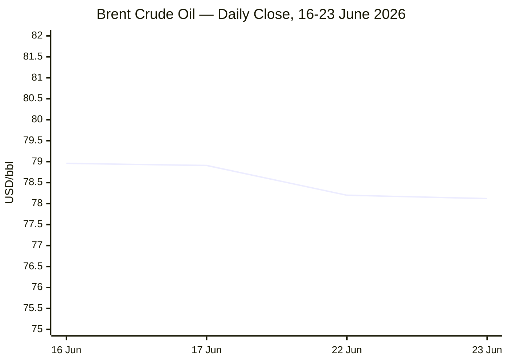
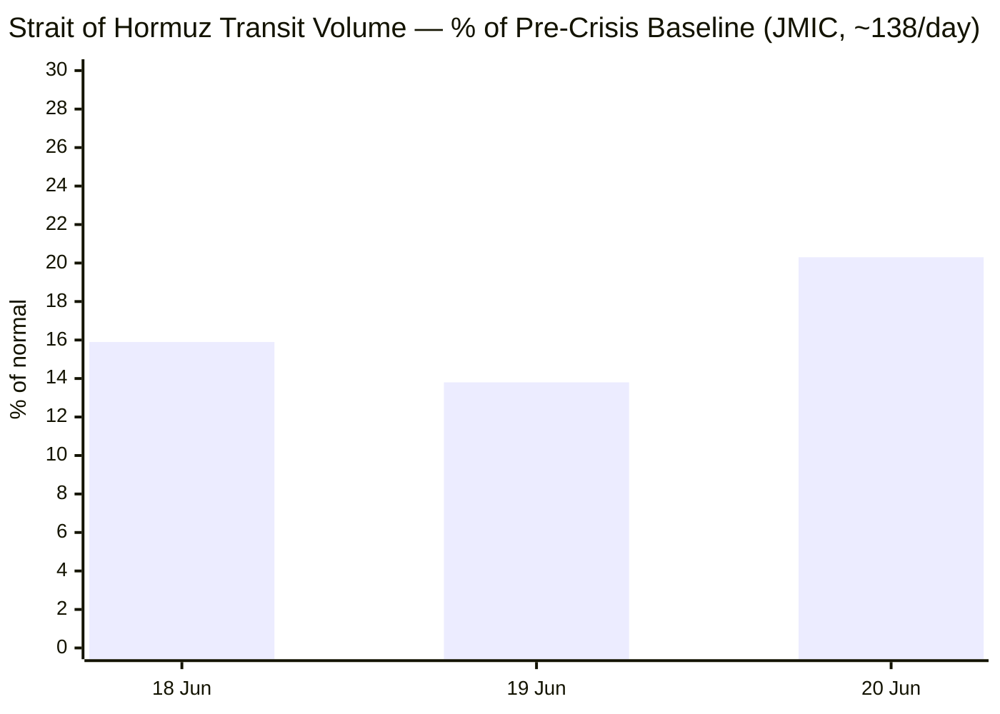

## Phase 0 — Timestamp & Day# anchor
---
Run confirmed: **Tuesday, 23 June 2026 · 05:00 CEST** (via `user_time_v0`).
---
- **Russia–Ukraine** (start 24 Feb 2022) → **Day 1581**
- **Iran–US War / Hormuz Crisis** (start 28 Feb 2026) → **Day 116**
- **Israel–Lebanon**: no Day# per standing instruction — tracked as standalone Conflict stories.
---
## Phase 1 — Direct fetch pass
---
| Outlet | Status | Note |
|---|---|---|
| Le Monde | ❌ | Site blocked — search fallback |
| FAZ | ❌ | Site blocked — search fallback |
| Kommersant | ❌ | 404 on EN endpoint — search fallback |
| Xinhua | ⚠️ | Fetched; most recent items 4 days stale |
| European Parliament | ✅ | Two stories within 24h (CSA directive, Russia-dialogue conference) |
| FAO | ✅ | May 2026 FFPI release (latest available, next release 3 Jul) |
| IMF | ⚠️ | Fetched; newsroom lags ~2 months, used April WEO via search |
---
## Phase 2 — Search pass (key findings)
---
Major development since last known state: the **US–Iran Islamabad MoU** (signed 17 June) lifted the US naval blockade and nominally reopened Hormuz, but Iran re-declared closure over the weekend citing Israeli strikes in Lebanon — CENTCOM/JMIC dispute the closure; traffic is contested and well below pre-war norms. Brent has fallen for five straight sessions on supply-normalisation bets. Eurozone HICP hit 3.2% in May (highest since Sept 2023). EU Council (18–19 June) set an MFF 2028–34 timeline and backed Ukraine's accession track. Tech pool was thin on genuine last-24h material; strongest items were two live cyber-security stories (Fortinet mass credential theft, Apple SecureROM exploit disclosure).
---
## Phases 3–5 — Pooling & editorial filter
---
Candidate pool: **~22 stories** → filtered to **15 published** (Conflict 4, Business 3, EU Affairs 3, Technology 3, Trends 2). Red-alert share: 4/15 (26.7%, within 40% cap). Tag candidate logged to Expansion Queue: `#child-protection`.

---

```yaml
---
brief_date: 2026-06-23
version: v1.2.2
run_time: "05:00 CEST"
stories_published: 15
categories: [conflict, business, eu_affairs, technology, trends]
alert_counts:
  red: 4
  yellow: 7
  green: 4
ongoing_situations:
  - {name: "Russia-Ukraine War", real_world_start: "2022-02-24", day: 1581}
  - {name: "Iran-US War / Hormuz Crisis", real_world_start: "2026-02-28", day: 116}
sources_fetched: 7
fetch_status:
  le_monde: "❌"
  faz: "❌"
  kommersant: "❌"
  xinhua: "⚠️"
  european_parliament: "✅"
expansion_queue: ["#child-protection"]
---
```

# 🌐 MORNING BRIEF
## Tuesday, 23 June 2026 · 05:00 CEST
### 15 stories across 5 categories

## DIGEST SUMMARY

| # | Category | Headline | Alert |
|---|----------|----------|-------|
| 1 | ⚔️ Conflict | Iran re-declares Hormuz closed; US disputes claim as traffic stays contested | 🔴 |
| 2 | ⚔️ Conflict | Israel–Lebanon ceasefire collapses again within 24 hours | 🔴 |
| 3 | ⚔️ Conflict | Ukraine frontline holds in stalemate as Russian aerial campaign continues | 🟡 |
| 4 | ⚔️ Conflict | Qatar LNG explosion compounds Hormuz mediation crisis | 🔴 |
| 5 | 💼 Business | Brent extends five-session slide; Goldman cuts Q4 forecast to $80 | 🟢 |
| 6 | 💼 Business | Eurozone inflation hits 3.2% in May, highest since 2023 | 🟡 |
| 7 | 💼 Business | Gold retreats from highs as safe-haven demand eases | 🟢 |
| 8 | 🇪🇺 EU Affairs | European Council backs Ukraine accession push, sets MFF timeline | 🟡 |
| 9 | 🇪🇺 EU Affairs | Parliament agrees updated EU rules to combat child sexual abuse | 🟢 |
| 10 | 🇪🇺 EU Affairs | Parliament to host Russian-opposition dialogue amid drone-incursion row | 🟡 |
| 11 | 🤖 Technology | Mass credential-theft campaign compromises 86,000+ Fortinet devices | 🔴 |
| 12 | 🤖 Technology | Hardware-level SecureROM exploit disclosed for Apple A12/A13 chips | 🟡 |
| 13 | 🤖 Technology | UK cyber agency warns AI-written code risks security disasters | 🟡 |
| 14 | 📈 Trends | Hormuz's dual-corridor transit regime signals lasting shift in maritime governance | 🟡 |
| 15 | 📈 Trends | FAO Food Price Index holds broadly stable in May | 🟢 |

> Alert Level key: 🔴 High significance · 🟡 Developing · 🟢 Stable/Routine

## 🚨 SIGNAL BOARD

🔴 **Hormuz transit fell to ~20% of the 138/day pre-crisis baseline on 20 June (JMIC), even as the US disputes Iran's closure claim.**
🔴 **Brent has fallen five straight sessions to ~$78/bbl, erasing most of the conflict-era premium.**
🟡 **Eurozone HICP inflation rose to 3.2% in May — the highest reading since September 2023.**
🟡 **EU leaders set 15 October 2026 as the checkpoint for MFF 2028–34 progress under the incoming Irish presidency.**
⚡ **The 19 June Israel–Hezbollah ceasefire — mediated by the US, Qatar and Iran — failed to hold within 24 hours, the pattern repeating from May and June ceasefires.**

## 🔄 ONGOING SITUATIONS

| Situation | Real-world start | Day # | Last significant development | Status |
|-----------|-----------------|-------------|------------------------------|--------|
| Russia–Ukraine War | 24 Feb 2022 | Day 1581 | Russian forces fired 88 long-range drones and 1 Iskander-M missile overnight 21–22 June; Ukrainian air defence claimed 89.8% interception | 🟡 Active, attritional stalemate |
| Iran–US War / Hormuz Crisis | 28 Feb 2026 | Day 116 | Iran re-declared the Strait closed citing Lebanon-ceasefire violations; CENTCOM/JMIC report continued, reduced traffic | 🔴 Active, contested implementation of 17 June MoU |

---

> 🔎 **CONFLICT ANALYST** · 4 updates today

### 1. Iran re-declares Hormuz closed; US disputes claim as traffic stays contested 🔴
**Alert:** 🔴
**Summary:** Iran's IRGC declared the Strait of Hormuz closed on 20–21 June, citing Israeli strikes in Lebanon as a breach of the 17 June Islamabad MoU. CENTCOM and the US-led Joint Maritime Information Center (JMIC) say the waterway has not physically shut: JMIC logged 22, 19 and 28 vessel transits on 18–20 June respectively, against a pre-war baseline of roughly 138/day. Traffic now splits between an Iranian-controlled northern corridor and a US-backed southern route via Omani waters, with mines still unresolved in the channel.
**Significance:** The closure functions as political leverage tied to Lebanon rather than a full physical shutdown, but it keeps war-risk insurance elevated and complicates the 60-day nuclear-talks timeline agreed in Switzerland.
**Sources:**

- [gCaptain — Strait of Hormuz: Mines and Dual Transit Regime Complicate Return to Normal](https://gcaptain.com/strait-of-hormuz-mines-and-dual-transit-regime-complicate-return-to-normal/) · 22 June 2026
- [CNBC — Shipping stalls in Strait of Hormuz after Iran declares key waterway closed again](https://www.cnbc.com/2026/06/22/strait-of-hormuz-iran-us-shipping-oil.html) · 22 June 2026
**Trend:** ⚡ Reversal
**Tags:** #Hormuz #Iran #naval-blockade #MULTI-SOURCE

### 2. Israel–Lebanon ceasefire collapses again within 24 hours 🔴
**Alert:** 🔴
**Summary:** A US-, Qatar- and Iran-mediated truce announced 19 June failed to hold, with Israel continuing strikes in southern Lebanon and Hezbollah claiming an attack near Nabatieh. Israel has refused to withdraw forces ahead of a final settlement; Iran has linked this directly to its Hormuz re-closure. Lebanese authorities continue to advise residents against returning to affected southern areas.
**Significance:** The repeated collapse pattern — now the third such breakdown since April — confirms no durable ceasefire architecture exists, and ties Lebanon's trajectory directly to Hormuz and the wider US–Iran nuclear track.
**Sources:**

- [Wikipedia — 2026 Israel–Lebanon ceasefire](https://en.wikipedia.org/wiki/2026_Israel%E2%80%93Lebanon_ceasefire) · 21 June 2026
- [Al Jazeera — Israel, Lebanon agree to conditional ceasefire](https://www.aljazeera.com/news/2026/6/4/israel-and-lebanon-agree-to-conditional-ceasefire) · 4 June 2026
**Trend:** ↗ Escalating
**Tags:** #Israel #Lebanon #Hezbollah #ceasefire
**Status note:** Per standing protocol, no Day# or pinned start date is tracked for this theatre — status remains *no durable ceasefire established*.

### 3. Ukraine frontline holds in stalemate as Russian aerial campaign continues 🟡
**Alert:** 🟡
**Summary:** Frontline assessments describe a strategic stalemate: ISW reports Russian forces gained only 40.6 km² and lost 281.1 km² between December 2025 and May 2026. Overnight 21–22 June, Russia launched 88 long-range drones and one Iskander-M ballistic missile; Ukraine claims an 89.8% interception rate. Ukraine's General Staff logged 158 combat clashes and 47 Russian aviation strikes on 22 June.
**Significance:** Neither side currently holds the operational capacity for a decisive breakthrough; the war has shifted toward attritional drone and strike warfare rather than territorial conquest.
**Sources:**

- [GlobalSecurity.org — Russo-Ukraine War, 22 June 2026](https://www.globalsecurity.org/military/world/war/russo-ukraine-2026-06-22.htm) · 22 June 2026
- [Critical Threats / ISW — Russian Offensive Campaign Assessment, June 1 2026](https://www.criticalthreats.org/analysis/russian-offensive-campaign-assessment-june-1-2026) · 1 June 2026
**Trend:** → Stable
**Tags:** #Russia #Ukraine #frontline #drone-warfare

### 4. Qatar LNG explosion compounds Hormuz mediation crisis 🔴
**Alert:** 🔴
**Summary:** An explosion at Qatar's Ras Laffan LNG facility on 22 June injured 54 and left 18 missing, removing roughly 4.77 million tonnes/year of capacity already under restart from earlier damage. Qatar is a co-mediator of the Islamabad MoU alongside the US, Iran and Pakistan; the outage reduces Doha's exportable leverage at a moment when its diplomatic role is central to keeping the Lebanon–Hormuz linkage from derailing nuclear talks.
**Significance:** A mediator losing energy leverage mid-crisis is a structural complication, not just a market story — it weakens the credibility of guarantees Qatar can offer in the 60-day roadmap.
**Sources:**

- [IranSitrep — Iran War Day 115 | Hormuz Closed](https://www.iransitrep.com/) · 22 June 2026
📎 *See also: Business § Story 1 — LNG outage adds to regional energy-supply uncertainty.*
**Trend:** ↗ Escalating
**Tags:** #energy-markets #supply-shock #Hormuz #mediation

📚 *Background reading:* [Al Jazeera — Israel and Lebanon agree to conditional ceasefire](https://www.aljazeera.com/news/2026/6/4/israel-and-lebanon-agree-to-conditional-ceasefire) · [House of Commons Library — Israel/US-Iran conflict 2026: Reopening the Strait of Hormuz](https://commonslibrary.parliament.uk/research-briefings/cbp-10636/)

---

> 💼 **BUSINESS ANALYST** · 3 updates today

### 1. Brent extends five-session slide; Goldman cuts Q4 forecast to $80 🟢
**Alert:** 🟢
**Summary:** Brent crude has fallen for a fifth consecutive session to around $78/bbl, its lowest since early March, as markets price out the Hormuz-driven risk premium. Goldman Sachs cut its Q4 2026 Brent forecast to $80/bbl from $90, citing expectations that Persian Gulf exports return to pre-war levels by end-July — a month earlier than previously projected. Kuwait has lifted force majeure and ADNOC has resumed supply operations.
**Market signal:** Bearish — supply-normalisation expectations are outweighing residual Hormuz risk, with EIA forecasting a 1.1 million b/d demand decline in 2026.
**Sources:**

- [Trading Economics — Brent crude oil](https://tradingeconomics.com/commodity/brent-crude-oil) · 22 June 2026
- [Oilprice.com — Brent Crude Oil Futures Contracts](https://oilprice.com/futures/brent/) · 23 June 2026
**Trend:** ↘ De-escalating
**Tags:** #Brent #oil-price #supply-shock #Hormuz
📎 *See also: Conflict § Story 1 — Hormuz closure dispute is the direct driver of this price action.*

### 2. Eurozone inflation hits 3.2% in May, highest since 2023 🟡
**Alert:** 🟡
**Summary:** Eurostat confirmed euro-area annual HICP inflation at 3.2% in May, up from 3.0% in April and the highest since September 2023 — well above the ECB's 2.0% target. Energy prices rose 10.9% year-on-year on Middle East-linked supply constraints; core inflation (ex-energy, food) climbed to 2.5% from 2.2%, indicating broadening price pressure beyond the energy channel.
**Market signal:** Bearish for rate-cut expectations — broadening core inflation reduces the ECB's room to ease even as growth slows.
**Sources:**

- [Eurostat — Annual inflation up to 3.2% in the euro area](https://ec.europa.eu/eurostat/web/products-euro-indicators/w/2-17062026-ap) · 17 June 2026
**Trend:** ↗ Escalating
**Tags:** #inflation #eurozone #ECB #stagflation

### 3. Gold retreats from highs as safe-haven demand eases 🟢
**Alert:** 🟢
**Summary:** Gold has pulled back from June's highs near $4,400 as de-escalation signals from the Switzerland talks reduce safe-haven demand, even as a hawkish Fed (nine of 19 policymakers now project a 2026 rate hike) provides some offsetting support. Live pricing put XAU/USD around $4,327, down modestly on the session.
**Market signal:** Neutral-to-bearish near term — competing pulls from easing geopolitical risk and hawkish Fed signalling are producing range-bound trade.
**Sources:**
- [Trading Economics — Gold](https://tradingeconomics.com/commodity/gold) · 22 June 2026
**Trend:** ↘ De-escalating
**Tags:** #gold #commodities #de-escalation

📚 *Background reading:* [CEPS — European Council briefing, June 2026: competitiveness, MFF and the Middle East](https://www.ceps.eu/ceps-events/european-council-briefing-june-2026-competitiveness-mff-and-the-middle-east/)

---

> 🇪🇺 **EU AFFAIRS ANALYST** · 3 updates today

### 1. European Council backs Ukraine accession push, sets MFF timeline 🟡
**Alert:** 🟡
**Summary:** The 18–19 June European Council adopted conclusions on Ukraine, the MFF 2028–34, competitiveness and enlargement. Leaders reaffirmed "unwavering support" for Ukraine's accession path and called on the incoming Irish presidency to advance MFF negotiations ahead of the 15 October 2026 European Council, targeting agreement before end-2026 so legislative acts can pass in 2027.
**Legislative/policy stage:** Negotiating box under Cyprus-presidency figures; Irish presidency tasked with progressing talks toward an October 2026 checkpoint.
**Sources:**

- [Council of the EU — European Council, 18-19 June 2026](https://www.consilium.europa.eu/en/meetings/european-council/2026/06/18-19/) · 19 June 2026
**Trend:** → Stable
**Tags:** #EU-institutions #MFF #Ukraine-aid #EU-enlargement

### 2. Parliament agrees updated EU rules to combat child sexual abuse 🟢
**Alert:** 🟢
**Summary:** The European Parliament reached agreement on an updated directive criminalising new technology-enabled child sexual abuse offences and extending limitation periods for prosecution. The press release was published two hours before this run, placing it within the 24-hour window.
**Legislative/policy stage:** Interinstitutional agreement reached; formal adoption and transposition into national law to follow.
**Sources:**
- [European Parliament — Combating child sexual abuse: agreement on updated rules](https://www.europarl.europa.eu/news/en/press-room/20260622IPR45906/combating-child-sexual-abuse-agreement-on-updated-rules) · 22 June 2026
**Trend:** → Stable
**Tags:** #EU-institutions #digital-regulation #rule-of-law
*(Nearest available tags used; candidate `#child-protection` logged to Expansion Queue.)*

### 3. Parliament to host Russian-opposition dialogue amid drone-incursion row 🟡
**Alert:** 🟡
**Summary:** The European Parliament hosts a conference today exploring prospects for Russian pro-democracy and anti-war actors. It follows an 18 June plenary resolution condemning Russia's "campaign of destabilisation," including drone incursions into EU airspace, with MEPs vowing the EU "will not be intimidated."
**Legislative/policy stage:** Non-legislative resolution adopted 11 June (plenary record published 18 June); today's dialogue is a parallel diplomatic-engagement track via the AFET committee.
**Sources:**
- [European Parliament — Brussels dialogue with Russian pro-democracy and anti-war actors](https://www.europarl.europa.eu/news/en/press-room/20260622IPR45916/brussels-dialogue-with-russian-pro-democracy-and-anti-war-actors) · 22 June 2026
- [European Parliament — Parliament condemns Russia's drone incursions in the EU](https://www.europarl.europa.eu/news/en/press-room/20260611IPR45216/parliament-condemns-russia-s-drone-incursions-in-the-eu) · 18 June 2026
**Trend:** ↗ Escalating
**Tags:** #Russia #EU-defence #diplomacy #drone-warfare

📚 *Background reading:* [CEPS — European Council briefing, June 2026](https://www.ceps.eu/ceps-events/european-council-briefing-june-2026-competitiveness-mff-and-the-middle-east/)

---

> 🤖 **TECHNOLOGY ANALYST** · 3 updates today

### 1. Mass credential-theft campaign compromises 86,000+ Fortinet devices 🔴
**Alert:** 🔴
**Summary:** A large-scale credential-theft campaign has hit roughly half of internet-accessible Fortinet firewalls and VPNs, with SOCRadar data showing 86,644 compromised devices as of 19 June. Generic admin accounts (35%) and built-in Fortinet system accounts (28.3%) account for most compromised credentials, indicating widespread default-credential exposure rather than a novel exploit chain.
**Analyst note:** Expect a wave of follow-on ransomware intrusions over the next 12–24 months as compromised VPN access is resold on criminal markets — patching alone will not close this gap without credential rotation at scale.
**Sources:**

- [The Hacker News — security roundup](https://thehackernews.com/) · 22 June 2026
**Trend:** ↗ Escalating
**Tags:** #cyber #MULTI-SOURCE #breaking

### 2. Hardware-level SecureROM exploit disclosed for Apple A12/A13 chips 🟡
**Alert:** 🟡
**Summary:** Security researchers published "usbliter8," a working exploit achieving arbitrary code execution inside the SecureROM of Apple's A12/A13 chips — code burned into silicon at manufacture and unpatchable by software update. The exploit requires physical possession and DFU-mode USB access via a dedicated microcontroller board, completing in under two seconds before the signed boot chain loads. Disclosure followed coordination with Apple Product Security.
**Analyst note:** Because this is a silicon-level flaw, affected legacy devices (A12, A13, S4, S5) will carry the exposure for their entire service life, raising the bar for device-disposal and forensic-security practice over the next 12–24 months.
**Sources:**

- [The Hacker News — security roundup](https://thehackernews.com/) · 22 June 2026
**Trend:** ↗ Escalating
**Tags:** #cyber #breaking

### 3. UK cyber agency warns AI-written code risks security disasters 🟡
**Alert:** 🟡
**Summary:** The UK's National Cyber Security Centre warned on 22 June that AI-generated code, left unchecked, could create significant security failures, as organisations increasingly deploy AI coding assistants without proportionate review processes.
**Analyst note:** Expect EU and UK regulators to push secure-by-design review requirements for AI-assisted development pipelines within the next 12–24 months, particularly as EU AI Act transparency obligations for high-risk systems phase in from August 2026.
**Sources:**
- [Cybernews — security news roundup](https://cybernews.com/) · 22 June 2026
**Trend:** ↗ Escalating
**Tags:** #cyber #AI-safety #AI-regulation

📚 *Background reading:* [CSIS — The Limits of Chip Export Controls in Meeting the China Challenge](https://www.csis.org/analysis/limits-chip-export-controls-meeting-china-challenge)

---

> 📈 **TRENDS ANALYST** · 2 updates today

### 1. Hormuz's dual-corridor transit regime signals lasting shift in maritime governance 🟡
**Alert:** 🟡
**Summary:** Post-MoU Hormuz traffic now splits between an Iranian-controlled northern corridor administered by Iran's sanctioned Persian Gulf Strait Authority, and a US-backed southern corridor through Omani waters under JMIC procedures. INTERTANKO confirms the northern route is operational but Iran-directed; shipowners and insurers face a structurally new choice of jurisdiction even after "reopening."
**Horizon:** Medium-term (months to 1 year) — expect this dual-corridor structure to persist well beyond any nuclear-deal resolution, reshaping war-risk insurance and flag-state routing norms for the strait permanently.
**Sources:**

- [gCaptain — Strait of Hormuz: Mines and Dual Transit Regime Complicate Return to Normal](https://gcaptain.com/strait-of-hormuz-mines-and-dual-transit-regime-complicate-return-to-normal/) · 22 June 2026
📎 *See also: Conflict § Story 1 — same underlying dispute drives both the daily news and the structural trend.*
**Trend:** ↗ Escalating
**Tags:** #Hormuz #shipping #naval-blockade #diplomacy

### 2. FAO Food Price Index holds broadly stable in May 🟢
**Alert:** 🟢
**Summary:** The FAO Food Price Index averaged 130.8 points in May 2026, down 0.2 points (0.2%) from April, with cereal prices up 2.6% on weaker US winter-wheat conditions and firmer fuel/fertiliser costs, offset by a 4.6% vegetable-oil decline — the first monthly oils decline since early 2026. The index sits 2.9% above a year ago but 18.4% below its March 2022 peak.
**Horizon:** Short-to-medium-term — cereal-price stickiness from energy-cost pass-through bears watching as a leading indicator of food-security stress if Hormuz volatility resumes.
**Sources:**

- [FAO — Food Price Index](https://www.fao.org/worldfoodsituation/foodpricesindex/en) · 5 June 2026 (May 2026 release; next release 3 July 2026)
**Trend:** → Stable
**Tags:** #food-prices #food-security #commodities

📚 *Background reading:* [House of Commons Library — Israel/US-Iran conflict 2026: Reopening the Strait of Hormuz](https://commonslibrary.parliament.uk/research-briefings/cbp-10636/)

---

## 📊 KEY DATA OF THE DAY

📊 DATA OFFICER · 7 indicators

| Indicator | Value | Δ vs prior session | Δ vs 7 days ago | Note | Source | URL |
|-----------|-------|-------------------|-----------------|------|--------|-----|
| EUR/USD | 1.1603 | -0.05% | N/A | Flat ahead of US-Iran deal headlines | Trading Economics | [link](https://tradingeconomics.com/commodity/brent-crude-oil) |
| Brent Crude (USD/bbl) | 78.12 | -0.10% | N/A | Fifth straight session of declines | Trading Economics / Oilprice.com | [link](https://tradingeconomics.com/commodity/brent-crude-oil) |
| Gold (XAU/USD) | 4,327.29 | -0.10% | N/A | Safe-haven demand easing | Trading Economics | [link](https://tradingeconomics.com/commodity/gold) |
| IMF Global Growth 2026 | 3.1% | vs Jan WEO: -0.2pp | vs Oct WEO: N/A | April 2026 reference forecast (limited-conflict assumption) | IMF WEO | [link](https://www.imf.org/en/publications/weo/issues/2026/04/14/world-economic-outlook-april-2026) |
| EU CPI YoY (latest) | 3.2% | vs prior month: +0.2pp | vs 3 months ago: +1.3pp | May 2026, final; highest since Sept 2023 | Eurostat | [link](https://ec.europa.eu/eurostat/web/products-euro-indicators/w/2-17062026-ap) |
| FAO Food Price Index | 130.8 | vs prior month: -0.2% | May 2026 | Next release 3 July 2026 | FAO | [link](https://www.fao.org/worldfoodsituation/foodpricesindex/en) |
| Hormuz transit volume (% of normal) | 20.3% | +47.4% (vs 19 Jun) | N/A | 28 vessels / 138 baseline, JMIC, 20 Jun | JMIC via gCaptain | [link](https://gcaptain.com/strait-of-hormuz-mines-and-dual-transit-regime-complicate-return-to-normal/) |

**Data commentary:** Brent and gold are both easing as markets price out the Hormuz risk premium even as the strait's reopening remains contested and partial. The real tension sits in the EU CPI print: a 3.2% reading with broadening core pressure suggests the energy-driven inflation shock is starting to seep into underlying prices, narrowing the ECB's room to manoeuvre just as growth (IMF: 3.1% for 2026) is already being marked down for war-related disruption.

## 📈 CHARTS





*Chart 3 omitted — no editor-supplied cross-brief data points provided this run.*

## ⚙️ AGENT METADATA

| Field | Value |
|-------|-------|
| Agent version | MORNING BRIEF v1.2.2 |
| Run timestamp | 2026-06-23T05:00:45+02:00 |
| Fetch status | Le Monde ❌ · FAZ ❌ · Kommersant ❌ · Xinhua ⚠️ · EP ✅ |
| Sources queried | 7 / 11 (Le Monde, FAZ, Kommersant, Xinhua, IMF, European Parliament, FAO attempted; Guardian, El País, World Bank, ECB direct-fetch not queried this run — Eurostat/Consilium used as institutional substitutes) |
| Stories surfaced | ~22 |
| Stories published | 15 |
| Languages processed | EN |
| Output language | English (British) |
| Date validated | ✅ Confirmed 23 June 2026 |
| Expansion Queue | `#child-protection` (proposed category: EU Affairs) |

---

MORNING BRIEF is an AI-assisted digest. All summaries are paraphrased from original sources.
Verify time-sensitive information at the linked URLs before acting.
Output language: British English.

---

One flag for you, Roberto: the Iran–US war has materially shifted from active conflict to a fragile post-MoU implementation phase (blockade lifted 18 June, 60-day nuclear talks under way), even as Hormuz status stays contested. I've kept the Day# counter running per your pinned-date protocol, but you may want to consider at some point whether the situation now warrants a status-column change (e.g. "🟡 Ceasefire" with sub-notes) rather than continued 🔴 Active framing — happy to action that on your call.
