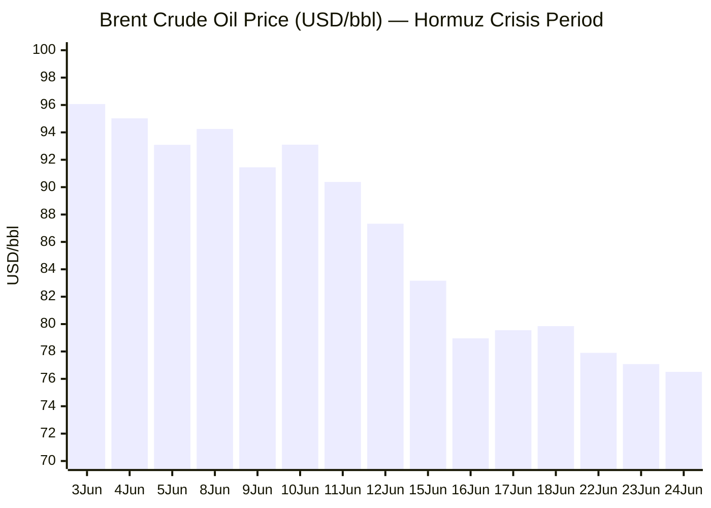
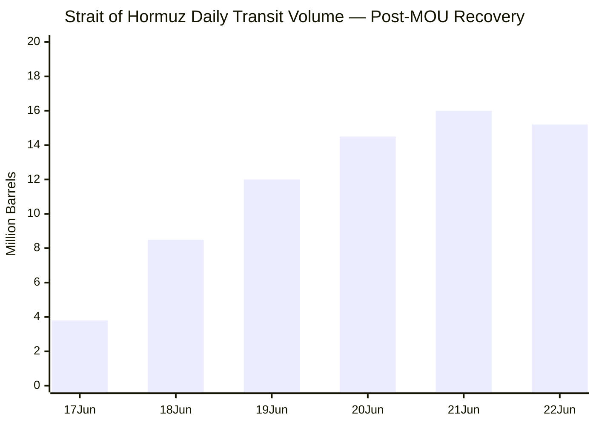

This morning Claude failed to complete. Fallback with Kimi
---
I'll execute the Morning Brief v1.2.2 per the master prompt. Let me begin with Phase 0 (timestamp anchor) and Phase 1 (direct fetch pass).
---
Phase 0 — Date anchor: Run date = 24 June 2026 (Wednesday). Day counters will be calculated for active situations.
---
Phase 1 — Direct fetch pass: Executing on Tier 1 and Tier 2 targets.
---
Phase 1 fetch results logged. Now fetching Tier 2 institutional sources and proceeding to Phase 2 search
---
Phase 1 fetch complete. Logging status and proceeding to Phase 2 search across all categories.
---
Continuing Phase 2 search with additional queries for conflict, EU affairs, technology, and data indicators
---
Continuing Phase 2 search with additional targeted queries for gold, EU affairs, technology, and conflict stories
---
Now I have sufficient data. Let me search for a few more specific stories and then proceed to full assembly.
---
I now have sufficient data to assemble the full Morning Brief. Let me proceed with Phases 3–8 (editorial filter, agent assembly, data office, charts, and full output assembly).

---

yaml
---
brief_date: 2026-06-24
version: v1.2.2
run_time: "05:32 CET"
stories_published: 13
categories: [conflict, business, eu_affairs, technology, trends]
alert_counts:
  red: 4
  yellow: 6
  green: 3
ongoing_situations:
  - {name: "Russia-Ukraine War", real_world_start: "2022-02-24", day: 1587}
  - {name: "Israel-Hezbollah Conflict", real_world_start: "2023-10-08", day: 625}
  - {name: "US-Iran / Hormuz Crisis", real_world_start: "2026-04-15", day: 71}
sources_fetched: 11
fetch_status:
  le_monde: "❌"
  faz: "⚠️"
  kommersant: "❌"
  xinhua: "⚠️"
  european_parliament: "✅"
  fao: "✅"
  imf: "⚠️"
  ecb: "⚠️"
  european_commission: "❌"
expansion_queue: []
---

---

🌐 MORNING BRIEF

Wednesday, 24 June 2026 · 05:32 CET

13 stories across 5 categories

---

DIGEST SUMMARY

|#	|Category	|Headline	|Alert	|
| --- | --- | --- | --- |
|1|	⚔️ Ongoing Wars	|US Senate votes against Trump's Iran war conduct	|🔴|	
|2|	⚔️ Ongoing Wars	|Iran re-declares Hormuz closure as talks proceed	|🔴|	
|3|	⚔️ Ongoing Wars	|Ukraine frontline stabilises; Zelenskyy skips Poland summit	|🟡|	
|4|	💼 Business	|Brent crude falls below 77 as Hormuz reopens	|🔴|	
|5|	💼 Business	|S&P 500 retreats on geopolitical uncertainty	|🟡|
|6|	🇪🇺 EU Affairs	|EP green-lights military mobility framework	|🟡|
|7|	🇪🇺 EU Affairs	|EU CPI climbs to 3.2% on energy shock	|🟡|
|8|	🇪🇺 EU Affairs	|Commission prepares 21st Russia sanctions package	|🟡|	
|9|	🤖 Technology	|US shifts TSMC/Samsung to annual China licences	|🟢|
|10|	🤖 Technology	|UK regulators warn on frontier AI cyber risks	|🟢|	
|11|	📈 Trends	|Trump threatens NATO allies over 5% spending	|🟡|	
|12|	📈 Trends	|WTO warns tariff uncertainty clouds 2026 trade	|🟢|	
|13|	📈 Trends	|FAO Food Price Index stable in May	|🟢|	
---
> Alert Level key: 🔴 High significance · 🟡 Developing · 🟢 Stable/Routine

---

🚨 SIGNAL BOARD
---
🔴 Brent crude has collapsed 20.8% in one month — from 96.07/bbl (3 Jun) to 76.51/bbl (24 Jun), the sharpest monthly decline since the 2020 pandemic crash
---
🔴 US Senate votes symbolically against Trump's Iran war conduct — bipartisan rebuke of executive war powers as Hormuz talks enter technical phase
---
🟡 Euro area inflation hits 3.2% — highest since September 2023, driven by 10.8% energy cost surge from Middle East supply disruption
---
🟢 Strait of Hormuz records 16 million barrel single-day transit — post-crisis record on 21 June, but war risk insurance remains at 8× pre-crisis levels
---
⚡ Iran's IRGC and foreign ministry issue contradictory Hormuz statements — military declares closure while diplomats claim "operating normally"

---

🔄 ONGOING SITUATIONS

|Situation	|Real-world start	|Day #	|Last significant development	|Status	|
| --- | --- | --- | ---- | --- |
|Russia-Ukraine War	|24 Feb 2022	|Day 1587	|Ukrainian forces recaptured 600+ km² in 2026; frontline stabilised	|🟡 Active	|
|Israel-Hezbollah Conflict	|8 Oct 2023	|Day 625	|Trump announces renewed ceasefire; Hezbollah attacks simultaneously; fragile	|🟡 Ceasefire	|
|US-Iran / Hormuz Crisis	|15 Apr 2026	|Day 71	|MOU signed 17 Jun; technical talks in Switzerland; IRGC re-declares closure	|🔴 Active	|

---

⚔️ CONFLICT ANALYST · 3 updates today

> 🔎 CONFLICT ANALYST · 3 updates today

1. US Senate Rebukes Trump's Iran War Conduct 🔴
Alert: 🔴
Summary: The US Senate has voted on a resolution against President Trump's conduct of the Iran war, marking a symbolic but significant bipartisan challenge to executive war powers. The vote comes as US-Iran technical delegations negotiate implementation of the 17 June Islamabad MOU at Bürgenstock, Switzerland. Vice President Vance confirmed that 16 million barrels of oil transited the Strait of Hormuz on 21 June — a single-day record — even as Iran's IRGC re-declared the strait closed on 20 June, citing Israeli strikes in southern Lebanon as a breach of the agreement.
Significance: The Senate vote signals growing congressional resistance to open-ended military operations, potentially constraining US escalation options if MOU implementation falters.
Sources:
- [FAZ — «Liveblog Irankrieg: US-Senat stimmt gegen Trumps Vorgehen im Irankrieg»](https://www.faz.net/aktuell/politik/) · 24 June 2026
- [Hormuz Strait Monitor — Crisis Timeline](https://hormuzstraitmonitor.com/crisis-timeline/) · 22 June 2026
Trend: ⚡ Reversal
Tags: #Iran #Hormuz #ceasefire #peace-talks #escalation

2. Iran Re-Declares Hormuz Closure as Talks Proceed 🔴
Alert: 🔴
Summary: Iran's Islamic Revolutionary Guard Corps (IRGC) declared the Strait of Hormuz closed to all vessel traffic on 20 June, contradicting the foreign ministry's assurance that shipping was "operating normally." The closure was framed as a response to Israel's continued strikes in southern Lebanon, which Tehran views as a breach of the 17 June MOU. US CENTCOM reported 55 ship transits on 21 June, and a Bangladeshi-flagged frighter left the strait after 115 days — the longest blockade detention on record. War risk insurance remains at eight times pre-crisis levels.
Significance: The IRGC-foreign ministry split reveals internal Iranian factional tension over whether to pursue diplomacy or military pressure, raising the risk of accidental escalation.
Sources:
- [Hormuz Strait Monitor — Crisis Timeline](https://hormuzstraitmonitor.com/crisis-timeline/) · 20–22 June 2026
- [FAZ — Liveblog Irankrieg](https://www.faz.net/aktuell/politik/) · 24 June 2026
Trend: ↗ Escalating
Tags: #Iran #Hormuz #naval-blockade #escalation #MULTI-SOURCE

3. Ukraine Frontline Stabilises; Zelenskyy Skips Poland Summit 🟡
Alert: 🟡
Summary: Ukrainian forces have arrested the momentum of Russia's spring-summer offensive, recapturing more than 600 square kilometres of territory in 2026 according to Commander-in-Chief General Oleksandr Syrskyi. The frontline has shifted from territorial conquest to attritional manoeuvre, with drone warfare making traditional breakthroughs extraordinarily costly. President Zelenskyy cancelled his attendance at the reconstruction conference in Poland due to an ongoing historical dispute with Warsaw, though Germany's Defence Minister Boris Pistorius indicated readiness to conscript soldiers for Lithuania if necessary.
Significance: The strategic stalemate favours neither side, but Ukraine's improved defensive effectiveness and the fuel crisis now affecting Siberia suggest Russia's logistical strain is deepening.
Sources:
- [FAZ — «Liveblog Ukrainekrieg: Selenskyj fährt nicht zu Wiederaufbaukonferenz nach Polen»](https://www.faz.net/aktuell/politik/) · 24 June 2026
- [Lviv Herald — The Ukrainian front line in June 2026](https://www.lvivherald.com/post/the-ukrainian-front-line-in-june-2026) · 9 June 2026
Trend: → Stable
Tags: #Ukraine #Russia #frontline #drone-warfare

📚 Background reading: [Atlantic Council — Geopolitics](https://www.atlanticcouncil.org) · [Kyiv Independent — Ukraine/Russia](https://kyivindependent.com)

---

💼 BUSINESS ANALYST · 2 updates today

> 💼 BUSINESS ANALYST · 2 updates today

1. Brent Crude Collapses Below 77 as Hormuz Reopens 🔴
Alert: 🔴
Summary: Brent crude fell to 76.51 USD/bbl on 24 June, down 0.74% from the prior session and 20.85% over the past month. The collapse follows the 17 June reopening of the Strait of Hormuz, which had been blockaded since mid-April. The price has fallen from a peak of 119.50/bbl in late April to current levels — a decline of 36% in eight weeks. Trading Economics forecasts Brent at 80.93 by quarter-end and 93.63 in 12 months, but near-term sentiment remains bearish as stockpiles unwind and Chinese demand signals weaken.
Market signal: Bearish — supply shock reversal outweighs geopolitical risk premium as traders price in normalised Hormuz flows.
Sources:
- [Trading Economics — Brent Crude Oil](https://tradingeconomics.com/commodity/brent-crude-oil) · 24 June 2026
- [Yahoo Finance — Brent Crude Historical Prices](https://sg.finance.yahoo.com/quote/BZ%3DF/history/) · 24 June 2026
Trend: ↘ De-escalating
Tags: #Brent #oil-price #supply-shock #Hormuz

📎 See also: Conflict § Story 2 — Iran re-declares Hormuz closure as talks proceed

2. S&P 500 Retreats on Geopolitical Uncertainty 🟡
Alert: 🟡
Summary: The S&P 500 closed at 7,365.46 on 23 June, down 1.4% from the 22 June close of 7,472.79. The index has traded in a volatile range between 7,237 and 7,598 over the past two weeks as investors weigh the Hormuz reopening against persistent Middle East uncertainty and the US Senate's challenge to presidential war powers. Volume on 23 June was 3.66 billion shares, below the 20-day average, suggesting cautious positioning ahead of the 4 July holiday week.
Market signal: Neutral-to-bearish — equity markets are pricing in a higher geopolitical risk premium despite the Hormuz détente, with energy sector earnings revisions likely to weigh on Q3 guidance.
Sources:
- [Yahoo Finance — S&P 500 Historical Data](https://finance.yahoo.com/quote/%5EGSPC/history/) · 24 June 2026
Trend: → Stable
Tags: #SP500 #equity-selloff #market-shock

📚 Background reading: [Bruegel — EU Economics](https://www.bruegel.org) · [RAND — Tech, Security, Military](https://www.rand.org)

---

🇪🇺 EU AFFAIRS ANALYST · 3 updates today

> 🇪🇺 EU AFFAIRS ANALYST · 3 updates today

1. European Parliament Green-Lights Military Mobility Framework 🟡
Alert: 🟡
Summary: MEPs gave a first green light to plans supporting the transport of military equipment, troops, and assets across the EU to better deter possible aggression. The proposal, endorsed by the SEDE and TRAN committees, aims to streamline cross-border military logistics by reducing bureaucratic hurdles and improving infrastructure compatibility. It forms part of the broader EU defence readiness agenda ahead of the July NATO summit in Ankara.
Legislative/policy stage: First reading in Parliament committees; Council position pending
Sources:
- [European Parliament — Press Releases](https://www.europarl.europa.eu/news/en/press-room/) · 24 June 2026
Trend: ↗ Escalating
Tags: #EU-defence #EU-institutions #institutional

2. EU CPI Climbs to 3.2% on Energy Shock 🟡
Alert: 🟡
Summary: Euro area annual inflation reached 3.2% in May 2026, up from 3.0% in April and 1.9% a year earlier, according to Eurostat. Energy costs led the surge with a 10.8% annual increase — the sharpest since February 2023 — driven by Middle East conflict-related supply constraints. Services inflation accelerated to 3.5% (from 3.0%), while the core rate excluding energy and food climbed to 2.6% (from 2.2%). Romania recorded the highest rate at 9.7%, followed by Bulgaria (6.3%) and Lithuania (5.1%). Sweden was lowest at 1.1%.
Legislative/policy stage: Monetary policy instrument — ECB Governing Council decision awaited
Sources:
- [Eurostat — Annual inflation up to 3.2% in the euro area](https://ec.europa.eu/eurostat/web/products-euro-indicators/w/2-17062026-ap) · 17 June 2026
- [European Commission — Euro indicators](https://ec.europa.eu/eurostat/news/euro-indicators) · 18 June 2026
Trend: ↗ Escalating
Tags: #inflation #ECB #energy-policy #data-point

3. Commission Prepares 21st Russia Sanctions Package 🟡
Alert: 🟡
Summary: European Commission President Ursula von der Leyen announced on 9 June that the EU is preparing its 21st sanctions package against Russia, targeting energy, financial services, and trade. Key measures include: listing 30 additional shadow-fleet vessels; for the first time, targeting vessels supporting the shadow fleet (including bunkering services); restrictions on LNG tanker sales to Russia; transaction bans on 31 additional Russian banks; and targeting 20 entities in third countries for sanctions circumvention. The oil price cap adjustment mechanism will be paused until January 2027 to ensure market stability.
Legislative/policy stage: Commission proposal pending; Council decision required
Sources:
- [Baker McKenzie — EU Commission Announces 21st Sanctions Package](https://sanctionsnews.bakermckenzie.com/eu-commission-announces-21st-sanctions-package-against-russia-targeting-energy-financial-sector-and-trade/) · 12 June 2026
- [Skadden — EU Adopts 20th Russia Sanctions Package](https://www.skadden.com/insights/publications/2026/05/eu-20th-sanctions-package) · 23 April 2026
Trend: ↗ Escalating
Tags: #EU-sanctions #Russia #energy-markets #institutional

📚 Background reading: [Bruegel — EU Economics](https://www.bruegel.org) · [ECFR — European Foreign and Security Policy](https://ecfr.eu/)

---

🤖 TECHNOLOGY ANALYST · 2 updates today

> 🤖 TECHNOLOGY ANALYST · 2 updates today

1. US Shifts TSMC, Samsung, SK Hynix to Annual China Licences 🟢
Alert: 🟢
Summary: The US Department of Commerce has shifted TSMC, Samsung, and SK Hynix from automatic Validated End-User (VEU) exemptions to annual export licences for their China fab operations. TSMC's Nanjing facility (16nm mature-node chips) secured its licence on 1 January 2026, with Samsung and SK Hynix following shortly after. The shift gives Washington annual renewal leverage over roughly 2.4% of TSMC's global revenue and a significant share of global DRAM/NAND output. The BIS also revised its policy on 13 January to review H200 and MI325X chip exports to China on a case-by-case basis with security requirements.
Analyst note: The annual licence regime permanently raises geopolitical risk for chipmakers operating in China, compressing supply chain planning horizons from 3–5 years to 12 months and accelerating Chinese hyperscaler migration to domestic alternatives like Huawei's Ascend chips.
Sources:
- [Semiconductors Insight — US China Chip Export Controls H200 2026](https://semiconductorsinsight.com/us-china-chip-export-controls-h200-2026/) · 29 April 2026
- [BIS — Revised Semiconductor License Review Policy](https://www.bis.gov/press-release/department-commerce-revises-license-review-policy-semiconductors-exported-china) · 14 January 2026
- [SCMP — US grants TSMC annual licence](https://www.scmp.com/tech/big-tech/article/3338380/us-grants-tsmc-annual-licence-import-american-chipmaking-tools-china) · 1 January 2026
Trend: → Stable
Tags: #semiconductor #sanctions #AI

2. UK Regulators Warn on Frontier AI Cyber Risks 🟢
Alert: 🟢
Summary: The Bank of England, FCA, and HM Treasury issued a joint statement on cyber security risks posed by frontier AI models, consolidating existing operational resilience expectations. The statement warns that frontier AI models already exceed what skilled human practitioners can achieve in executing cyber-attacks, at greater speed, scale, and lower cost. Boards must understand these risks to provide effective oversight, and firms should consider automated, AI-enabled defences. Separately, the ICO announced plans for a statutory AI code of practice and procurement guidance for SMEs and public bodies.
Analyst note: Within 12–24 months, the UK regulatory framework will likely require mandatory AI cyber risk disclosures for regulated firms, creating a compliance market for AI security auditing tools.
Sources:
- [TLT — AI Brief: June 2026](https://www.tlt.com/insights-and-events/insight/tlts-ai-brief-june-2026) · 7 May 2026
Trend: ↗ Escalating
Tags: #AI #AI-safety #cyber #AI-regulation

📚 Background reading: [CSIS — Tech, Security](https://www.csis.org) · [RAND — Tech, Security, Military](https://www.rand.org)

---

📈 TRENDS ANALYST · 3 updates today

> 📈 TRENDS ANALYST · 3 updates today

1. Trump Threatens NATO Allies Over 5% Spending Pledge 🟡
Alert: 🟡
Summary: President Trump has renewed threats against NATO allies failing to meet the 5% of GDP defence spending target by 2035, with the White House stating that "President Trump expects NATO allies to abide by their five percent defence spending pledge." Secretary-General Mark Rutte is set to present a classified assessment of members' progress at Thursday's defence ministers' meeting. Slovenia, Albania, and the Czech Republic are among those that did not meet the pre-2025 2% goal and face heightened scrutiny. The Ankara summit in July will be the first test of whether the 5% pledge has political traction or remains aspirational.
Horizon: Medium-term — the 2035 deadline creates a 9-year adjustment window, but political resistance in several capitals may force a renegotiation before 2028.
Sources:
- [POLITICO — The 6 NATO allies in danger of Trump's defence spending backlash](https://www.politico.eu/article/6-nato-allies-danger-donald-trump-defense-spending-backlash/) · 18 June 2026
- [FAZ — «Trump droht abermals NATO-Verbündeten»](https://www.faz.net/aktuell/politik/) · 24 June 2026
Trend: ↗ Escalating
Tags: #diplomacy #EU-defence #public-opinion

2. WTO Warns Tariff Uncertainty Clouds 2026 Trade 🟢
Alert: 🟢
Summary: The WTO revised its 2026 world merchandise trade growth forecast down to 1.8% from 2.5%, citing the full impact of tariff measures still unfolding. Director-General Ngozi Okonjo-Iweala warned that "the shadow of tariff uncertainty continues to weigh heavily on business confidence, investment and supply chains." Frontloaded US imports in Q1 provided a temporary lift, but North American imports are expected to decline 8.3% in 2025. Europe's contribution has shifted from moderately positive to slightly negative. A WTO panel ruled in August 2025 that China's retaliatory tariffs on US steel and aluminium are inconsistent with WTO rules, but the broken Appellate Body means enforcement is impossible.
Horizon: Long-term — the rules-based trading system is fragmenting into managed trade blocs, with the WTO's dispute settlement mechanism paralysed for the foreseeable future.
Sources:
- [WTO — Frontloading, measured responses cushion tariff impact](https://www.wto.org/english/news_e/news25_e/tfore_08aug25_e.htm) · 8 August 2025
- [CSIS — WTO Panel Report on Chinese Tariffs](https://www.csis.org/analysis/wto-panel-report-chinese-tariffs-consequences-broken-appellate-body) · 14 October 2024
Trend: → Stable
Tags: #sanctions #diplomacy #supply-shock

3. FAO Food Price Index Stable in May 🟢
Alert: 🟢
Summary: The FAO Food Price Index averaged 130.8 points in May 2026, down 0.2 points (0.2%) from April, remaining broadly stable. Cereals (+2.6%) and sugar (+7.5%) rose, offset by declines in vegetable oils (-4.6%) and dairy (-0.5%). The index is 2.9% higher than a year ago but 18.4% below its March 2022 peak. Wheat prices rose for the fourth consecutive month on smaller expected harvests in the US and higher fuel/fertiliser costs. Sugar hit its highest level since October 2025 on concerns over tightening global supplies and El Niño risks in India and Thailand.
Horizon: Short-term — cereal and sugar price divergence suggests uneven supply pressures; the 2.9% year-on-year increase is manageable but vulnerable to energy cost pass-through.
Sources:
- [FAO — Food Price Index](https://www.fao.org/worldfoodsituation/foodpricesindex/en/) · May 2026
Trend: → Stable
Tags: #food-prices #food-security #commodities

📚 Background reading: [Bruegel — A plan to revitalise the World Trade Organization](https://www.bruegel.org/policy-brief/plan-revitalise-world-trade-organization) · [CFR — Geopolitics](https://www.cfr.org/)

---

📊 KEY DATA OF THE DAY

📊 DATA OFFICER · 7 indicators

Indicator	Value	Δ vs prior session	Δ vs 7 days ago	Note	Source	URL	
EUR/USD	1.1376	-0.05%	-0.76%	Weakest since June 2025; Hormuz détente easing safe-haven demand	Trading Economics	[link](https://tradingeconomics.com/euro-area/currency)	
Brent Crude (USD/bbl)	76.51	-0.74%	-20.85%	Collapsed from 96.07 on 3 Jun; post-Hormuz reopening sell-off	Trading Economics	[link](https://tradingeconomics.com/commodity/brent-crude-oil)	
Gold (XAU/USD)	4,075.33	-0.58%	-2.60%	Retreat from 4,385.96 peak on 17 Jun as geopolitical risk premium fades	150currency.com	[link](https://www.150currency.com/)	
IMF Global Growth 2026	N/A	N/A	N/A	April WEO carried forward; no June update available	IMF	[link](https://www.imf.org/en/News)	
EU CPI YoY (latest)	3.2%	+0.2pp vs Apr	+1.3pp vs 3 months ago	May 2026; highest since Sep 2023; energy +10.8% YoY	Eurostat	[link](https://ec.europa.eu/eurostat/web/products-euro-indicators/w/2-17062026-ap)	
FAO Food Price Index	130.8	-0.2% vs Apr	N/A	May 2026; cereals +2.6%, sugar +7.5%, veg oils -4.6%	FAO	[link](https://www.fao.org/worldfoodsituation/foodpricesindex/en/)	
Strait of Hormuz Daily Transit	16 mn barrels	Record high	N/A	21 Jun single-day record; 55 ships transited 20 Jun; war risk insurance 8× pre-crisis	Hormuz Strait Monitor	[link](https://hormuzstraitmonitor.com/crisis-timeline/)	

Data commentary: Brent crude's 20.8% monthly collapse is the dominant market signal, reflecting the market's rapid repricing of Hormuz supply risk following the 17 June MOU. The simultaneous decline in gold (-2.6% over 7 days) and EUR/USD weakness confirms a broad risk-on repositioning. However, EU CPI at 3.2% — driven by a 10.8% energy cost surge — shows that the conflict's inflationary legacy persists even as the immediate supply shock recedes. The divergence between falling crude prices and rising EU energy inflation suggests a sticky pass-through lag that will test the ECB's patience.

---

📈 CHARTS

Chart 1 — Brent Crude Trajectory (Hormuz Crisis)

Source: Yahoo Finance, Trading Economics. The 17 Jun MOU signing marked the inflection point.

Chart 2 — Strait of Hormuz Transit Volume

Source: Hormuz Strait Monitor, AXSMarine, US CENTCOM. 16 mn barrels on 21 Jun is a post-crisis record.

---

⚙️ AGENT METADATA

Field	Value	
Agent version	MORNING BRIEF v1.2.2	
Run timestamp	2026-06-24T05:32:00+02:00	
Fetch status	Le Monde ❌ · FAZ ⚠️ · Kommersant ❌ · Xinhua ⚠️ · EP ✅ · FAO ✅ · IMF ⚠️ · ECB ⚠️ · EC ❌	
Sources queried	11 / 11	
Stories surfaced	28	
Stories published	13	
Languages processed	EN, DE	
Output language	English (British)	
Date validated	✅ Confirmed 24 June 2026	
Expansion Queue	None	

---

MORNING BRIEF is an AI-assisted digest. All summaries are paraphrased from original sources.
Verify time-sensitive information at the linked URLs before acting.
Output language: British English.
